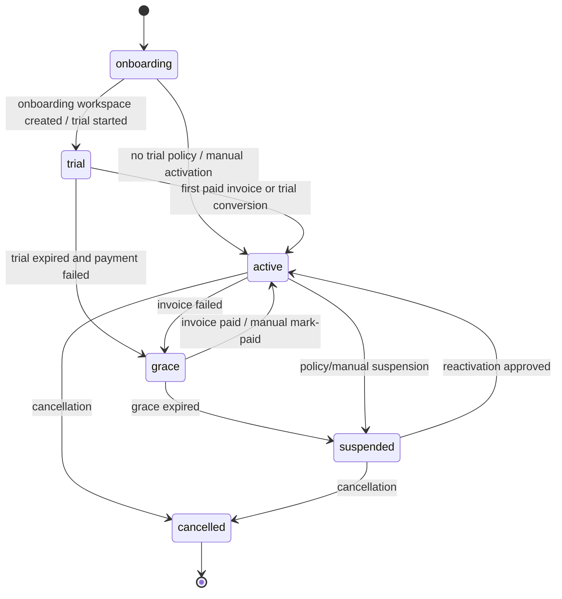
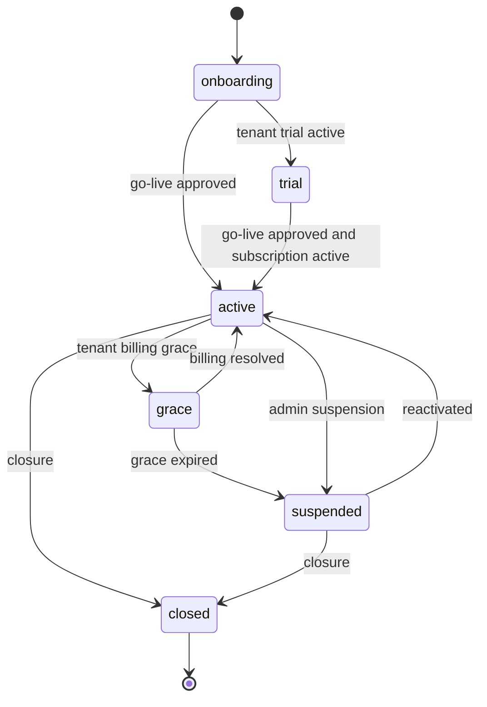
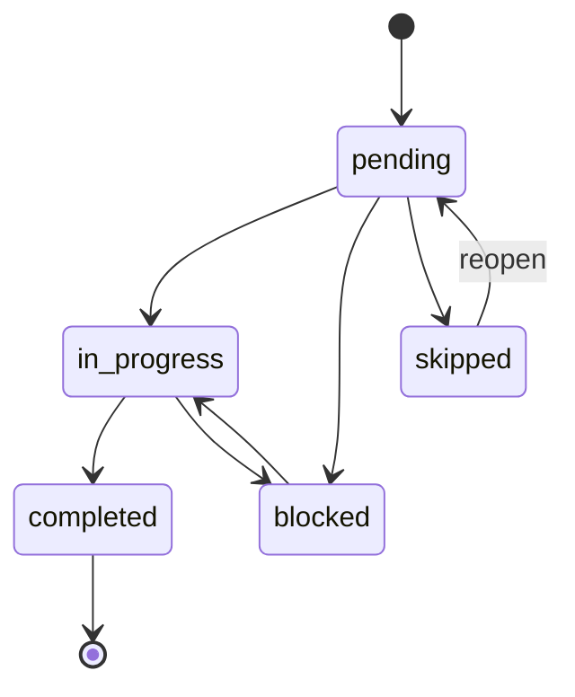
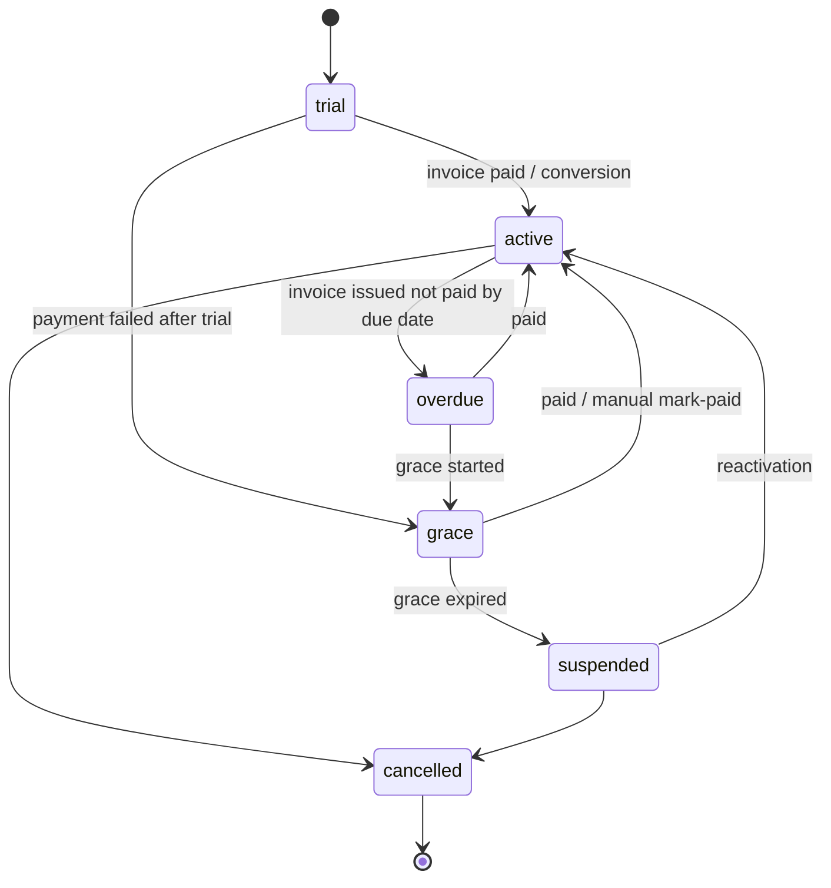
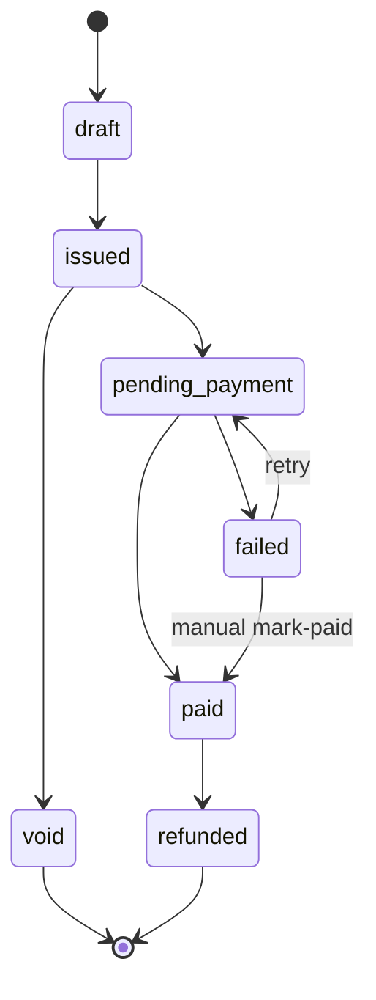
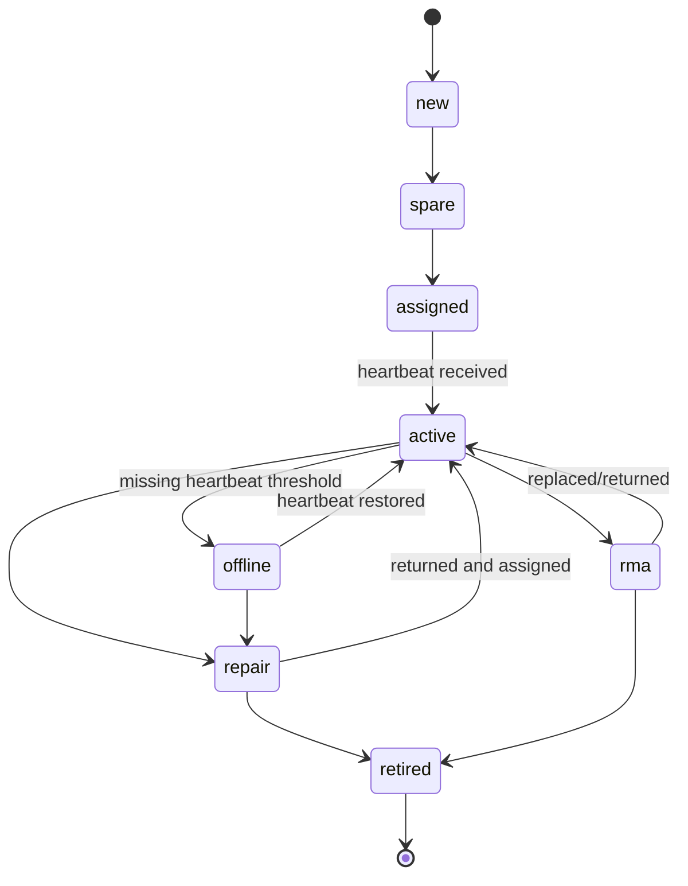
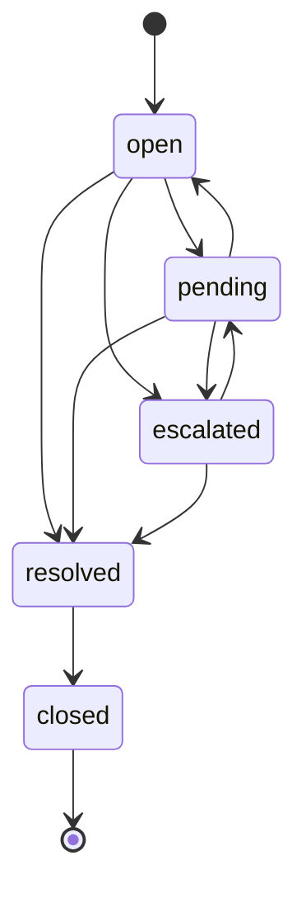
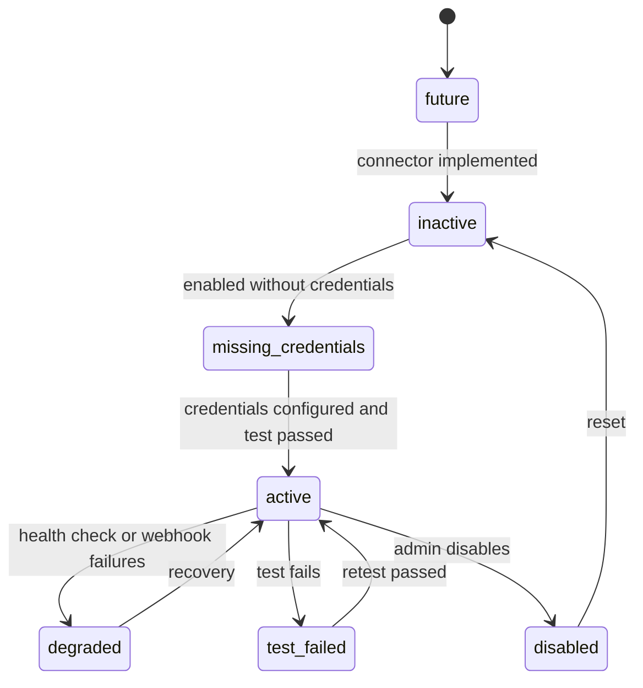

# KitLuy Admin PWA Portal — Rebuild Bible

**Filename:** `kitluy-admin-pwa-portal-rebuild-bible-v2.0.0.md`  
**Version:** v2.0.0  
**Date:** 2026-07-13  
**Product:** `kitluy-admin-pwa-portal` / `kitluy-admin-portal`  
**Owner:** HET / KitLuy Suite platform owner  
**Audience:** HET platform owner, admin operators, support, finance, DevOps, security, engineering, QA, and approved AI agents  
**Primary industry:** Laundry Industry  
**Status:** Canonical HET platform-owner operations and rebuild bible; implementation readiness is tracked below  
**Project boundary:** KitLuy-first. No active dependency on SroulERP, Netra, Rotanak, Prajna, HSAL, HSA, Canvar, or other future projects for MVP operation. Future integrations are represented as optional connectors in Integration Hub.  
**Naming rule:** Use **Partner**, not Seller. Any older `seller-*` references map to `partner-*`. Use **Tenant** as the backend account term and **Partner** as the business-facing term.  
**Build philosophy:** One-shot complete product scaffold for MVP, Phase 1.5, and Phase 2 modules. Implementation can still be sequenced internally by dependency order.  
**Operational classification:** HET-internal privileged control plane. Never expose to Partners, chain operators, store staff, or customers.  
**Canonical app root:** `Y:\HET_GOOGLE_DRIVE\001_Business_Folder\002_Hello Evolution Technology Co,. Ltd\00X_Project Folder\KITLUY_SUITE_PROJECT\KITLUY-SUITE-REPO (MAIN)\apps\kitluy-admin-portal`  
**Canonical source-of-truth root:** `Y:\HET_GOOGLE_DRIVE\001_Business_Folder\002_Hello Evolution Technology Co,. Ltd\00X_Project Folder\KITLUY_SUITE_PROJECT\KITLUY-SUITE-REPO (MAIN)\docs`  
**Canonical AI handoff root:** `Y:\HET_GOOGLE_DRIVE\001_Business_Folder\002_Hello Evolution Technology Co,. Ltd\00X_Project Folder\KITLUY_SUITE_PROJECT\KITLUY-SUITE-REPO (MAIN)\00_AI_HANDOFF`  

> **Mission:** This handbook must pass the **Rebuild Test**:  
> *If every person who built KitLuy Admin PWA Portal disappeared tomorrow, could a single engineer with zero prior context reconstruct the product, infrastructure, and business logic from this document alone?*  
> **Required answer:** Yes.

### Source Baseline Used for This Consolidation

1. `rebuild-bible-ai-template(2).md`, uploaded 2026-07-13 — required Parts 0–18 and Appendices A–D structure.
2. `kitluy-admin-pwa-portal-rebuild-bible-v2.0.0.md`, dated 2026-07-03 — primary Admin PWA v2 source.
3. `kitluy-suite-ecosystem-rebuild-bible-v2.0.0.md`, dated 2026-07-01 — ecosystem boundaries and shared architecture.
4. `kitluy-partner-pwa-portal-rebuild-bible-v1.0.0.md`, dated 2026-07-03 — one-store ownership boundary.
5. `kitluy-chain-portal-rebuild-bible-v2.0.0.md`, dated 2026-07-03 — chain ownership boundary.
6. `kitluy-partner-app-rebuild-bible-v1.0.0.md`, dated 2026-07-05 — mobile owner/manager boundary.
7. Current KitLuy Suite project instructions and locked decisions as of 2026-07-13.
8. Legacy Admin Portal v1 material is historical input only and cannot override current v2 naming, infrastructure, AI, file-storage, or product boundaries.

### Current Implementation Readiness — As of 2026-07-13

| Area | Current state | Operational consequence |
|---|---|---|
| Product definition | Complete planning baseline | This document is the target contract for Admin PWA scope and HET operations. |
| Frontend app root | Confirmed at `apps/kitluy-admin-portal` | Do not create or revive `apps/admin-pwa-portal`. |
| Backend migrations | Admin migration set `000`–`014` is planned/scaffolded | Treat as DRAFT until applied and validated in an isolated development database. |
| Edge Functions | Admin function scaffold exists/planned | Deployment is not evidence of correctness until validation and RBAC tests pass. |
| Development database gate | Pending / blocked | Do not claim backend readiness until migrations, PostgREST exposure, validation SQL, and a dev `platform_owner` are evidenced. |
| Production migration authority | Human operator only | AI may write/review migration files but must never auto-apply production migrations. |
| Pilot go-live | Not approved by this document alone | Go-live requires Part 15 QA evidence and Part 16 approval checklist. |

### Authority Precedence

1. Owner-approved locked decisions and current source-of-truth documents define product direction and boundaries.
2. Applied database migrations define the factual deployed schema for that environment.
3. This bible defines the target Admin PWA contract where implementation is not yet applied.
4. Code, wireframes, or legacy docs may not silently override this bible. Conflicts must be entered in Appendix C and an AI handoff note.
5. Production changes require explicit authorized human approval, evidence, rollback planning, and audit.

---

## 0. Front Matter — Rebuild Sequence

### REBUILD SEQUENCE — KitLuy Admin PWA Portal v2.0.0

1. **Provision infrastructure**
   - Supabase project in Singapore / SGP1 region for PostgreSQL, Auth, Realtime, Edge Functions, RLS, audit/events, and pgvector if AI/RAG admin features are enabled.
   - DigitalOcean SGP1 App Platform or static hosting for the Admin PWA frontend.
   - DigitalOcean Spaces for exports, support evidence, admin attachments, generated PDFs, RAG source documents, logs, and backups.
   - DigitalOcean Inference Engine as the first LLM inference layer for KitLuy AI Gateway.
   - Required exact values: `[REQUIRED: production Supabase project ref]`, `[REQUIRED: DigitalOcean project name]`, `[REQUIRED: Spaces bucket names]`, `[REQUIRED: production admin domain]`, `[REQUIRED: staging admin domain]`.

2. **Apply database migrations in order**
   - `000_enable_extensions.sql`
   - `001_kitluy_core_schema.sql`
   - `002_kitluy_admin_schema.sql`
   - `003_kitluy_billing_schema.sql`
   - `004_kitluy_devices_schema.sql`
   - `005_kitluy_sync_schema.sql`
   - `006_kitluy_laundry_templates_schema.sql`
   - `007_kitluy_files_schema.sql`
   - `008_kitluy_ai_schema.sql`
   - `009_kitluy_integrations_schema.sql`
   - `010_kitluy_events_schema.sql`
   - `011_kitluy_audit_schema.sql`
   - `012_kitluy_admin_rls_policies.sql`
   - `013_kitluy_admin_indexes.sql`
   - `014_kitluy_admin_seed_baseline.sql`
   - Production migrations are written by engineering and applied only by an authorized backend/operator. Do not auto-apply production migrations from AI tools.

3. **Seed baseline data**
   - HET platform-owner users and Admin RBAC roles.
   - Platform currency/timezone defaults: KHR integer display, Asia/Phnom_Penh timezone, Khmer-first readiness.
   - Subscription plan policy placeholders: Commerce plan, Chain plan, add-ons, trial duration, grace policy.
   - Laundry vertical enum and default Laundry service/status/tag/receipt/notification templates.
   - Device types: Store Hub, POS Desktop, POS Mobile, receipt printer, tag printer, scale, scanner, cash drawer, optional conveyor/controller.
   - Connector registry defaults: payments, notifications, storage, AI, webhooks, ERP export, e-commerce, logistics, loyalty, maps.
   - AI prompt policy defaults and MCP tool registry.
   - Audit event action catalog.
   - See Part 16, Part 6, and Part 17.

4. **Deploy API contracts / Edge Functions**
   - Auth/session helpers and platform-owner checks.
   - Tenant/Partner provisioning functions.
   - Store provisioning and go-live functions.
   - Billing/subscription functions.
   - Device registry and heartbeat ingest functions.
   - Support ticket and evidence functions.
   - Platform health and safety switch functions.
   - Integration Hub connector, credential-status, webhook, and test functions.
   - AI Admin functions through KitLuy AI Gateway.
   - File Service functions for DigitalOcean Spaces signed upload/download/export.
   - See Part 7.

5. **Configure secrets and third-party credentials**
   - Supabase URL, anon key, service role key.
   - DigitalOcean Spaces access key and secret key.
   - DigitalOcean Inference Engine endpoint/key.
   - ABA PayWay / KHQR credentials when payment integration is activated.
   - Telegram/SMS/email provider tokens when notifications are activated.
   - Maps/geocoding key if location mapping is activated.
   - Admin session/MFA settings.
   - Never commit secrets. The Admin PWA displays credential status only, never raw secret values. See Part 5, Part 10, and Part 11.

6. **Build / image local hardware or nodes**
   - The Admin PWA Portal is cloud/web only. It does not run on store hardware.
   - Store Hub and POS devices are sibling builds required for live store operation, but not required to run the Admin PWA itself.
   - For full end-to-end go-live testing, image one Raspberry Pi 5 Store Hub and pair one POS Desktop, receipt printer, tag printer, scale, and scanner using the POS/Hub bibles.
   - Admin monitors Hubs/POS devices only through cloud-reported heartbeat and sync data.

7. **Pair / register clients to backend**
   - Register first HET platform-owner account.
   - Create admin roles and role assignments.
   - Create first tenant/Partner and first Laundry store.
   - Register Store Hub and POS devices in Device Registry.
   - Confirm heartbeat ingest and sync freshness appear in Fleet Ops.
   - Install Admin PWA in a supported browser and verify online-only business-data behavior.

8. **Run QA validation scenarios**
   - Run minimum 30 Admin PWA scenarios covering RBAC, tenant/store provisioning, onboarding, billing, device registry, fleet health, support, audit, integration hub, AI admin, PWA behavior, and go-live readiness.
   - See Part 15.

9. **Verify monitoring and alerting**
   - Admin PWA health.
   - Supabase Auth/DB/Realtime/Edge Function health.
   - Store Hub heartbeat and POS heartbeat ingest.
   - Sync queue depth and sync queue age.
   - Payment webhook failure rate.
   - File upload/export failure rate.
   - AI Gateway latency/cost/error rate.
   - Support SLA breach alerts.
   - Audit-sensitive action review alerts.
   - See Part 12.

10. **Go-live smoke test**
    - Login as `platform_owner` -> create tenant -> create Laundry store -> create owner account -> assign trial/subscription -> seed Laundry templates -> register Store Hub -> register POS Desktop -> test receipt/tag printer, scale, scanner -> create POS Laundry order -> print receipt/tag -> sync cloud -> verify Store Network/Fleet Ops -> verify Partner Portal visibility -> open support ticket -> generate invoice -> verify audit trail -> approve go-live.
    - See Part 16.

---

## Part 1 — Glossary

### 1.1 Platform Terms

| Term | Definition |
|---|---|
| KitLuy | Cambodia-first commerce operating ecosystem for SMEs, starting with Laundry. |
| KitLuy Suite | The full product ecosystem: Admin Portal, Chain Portal, Partner Portal, Partner App, POS Desktop App, POS Mobile App, Store Hub, File Service, AI Gateway, MCP Server, RAG Indexer, Notification Service, and shared backend. |
| KitLuy-only stage | Current development rule: active MVP features are built inside KitLuy or treated as generic optional connectors. No active dependency on removed/future sibling projects. |
| Cambodia-first | Product decisions prioritize Cambodian realities: Khmer-first UX, KHR-native money, KHQR/payment readiness, offline-first operation, affordable hardware, and practical SME workflows. |
| Vertical | An industry-specific business bundle. A vertical includes workflow, schema delta, order lifecycle, reports, hardware profile, feature index, and UI adjustments. It is not just a UI skin. |
| Laundry Industry | First active vertical and MVP baseline for KitLuy Suite. |
| Tenant | Backend/platform account representing a business customer organization using KitLuy. One tenant can own one or more stores depending on plan and product scope. |
| Partner | Business/store owner using KitLuy. Replaces the retired term `Seller`. |
| Platform Owner | HET / KitLuy internal operator with top-level Admin Portal authority. |
| Store | One physical business location using KitLuy. A store belongs to exactly one tenant and exactly one vertical. |
| Chain | Multi-store brand, branch network, or franchise group managed through Chain Portal. |
| Admin PWA Portal | This product: HET-only web/PWA control plane for the KitLuy platform. |
| Store Hub | Local Raspberry Pi 5 server at a store. Runs local PostgreSQL, Hub API, sync agent, device monitor, local file queue, and employee/PIN cache. |
| Offline-first | Store operations continue during WAN/internet failure. POS writes to Store Hub first; Hub syncs to cloud when WAN returns. |
| Sync freshness | Admin/Partner UI indicator showing whether cloud data is fresh, stale, pending, or offline relative to Store Hub sync status. |
| Domain Event | Immutable event representing a meaningful business or system state change, such as `tenant_created`, `store_activated`, `hub_heartbeat_received`, or `invoice_failed`. |
| Rebuild Test | Standard requiring a single engineer with no prior context to reconstruct the product, infrastructure, and business logic from this bible and referenced migrations. |

### 1.2 Product Terms

| Product | Definition |
|---|---|
| `kitluy-admin-pwa-portal` | This product. Internal HET Admin Portal delivered as a secure web/PWA control plane. |
| `kitluy-admin-portal` | Canonical product family name. Equivalent to `kitluy-admin-pwa-portal` in this bible. |
| `kitluy-chain-portal` | Web app for brand, chain, or franchise owners. Manages multiple stores, branch performance, central catalog push, brand standards, compliance, and franchise structure. |
| `kitluy-partner-portal` | Web/PWA back office for one store/business owner. Replaces old `kitluy-seller-portal`. |
| `kitluy-partner-app` | Mobile form-factor of Partner Portal. Replaces old `kitluy-seller-app`. |
| `kitluy-pos-desktop-app` | Fixed in-store POS terminal for staff. Handles counter orders, payments, receipt/tag printing, shift, and offline store operation. |
| `kitluy-pos-mobile-app` | Mobile POS for roaming intake, pickup, scan/status, or line-busting. |
| `kitluy-hub-agent` | Store Hub service for local database, sync, device health, local APIs, and offline queue. |
| `kitluy-file-service` | Internal service controlling DigitalOcean Spaces upload/download, file metadata, permissions, thumbnails, export files, and RAG source registration. |
| `kitluy-ai-gateway` | KitLuy-native AI orchestration layer for permissions, prompt policy, RAG retrieval, MCP/tool routing, provider routing, safety, logging, and DigitalOcean Inference Engine calls. |
| `kitluy-mcp-server` | Internal tool/action server used by AI for approved operations such as search tenant, summarize support ticket, or inspect device health. |
| `kitluy-rag-indexer` | Worker that chunks/indexes documents and selected operational records for AI retrieval. |
| `kitluy-notification-service` | Internal service for Telegram, SMS, email, push, and in-app notifications. |

### 1.3 Admin Module Terms

| Term | Definition |
|---|---|
| Overview | Admin dashboard showing platform KPIs, alerts, health, sync status, billing risk, support risk, and live activity. |
| CRM | HET merchant acquisition workspace for leads, demos, site surveys, follow-ups, and conversion into onboarding. |
| Tenants / Partners | Admin module for managing all business customer accounts and their status, health, stores, documents, billing, and lifecycle. |
| Onboarding | Guided workspace for provisioning a tenant, Laundry store, owner account, templates, devices, training, test transaction, and go-live approval. |
| Store Network | Platform-wide store list, store profiles, vertical lock, sync freshness, device summary, and store activation status. |
| Subscriptions & Billing | SaaS plan, subscription, invoice, payment failure, grace, dunning, and billing policy module. |
| Device Registry | Hardware lifecycle inventory for Store Hubs, POS devices, printers, scales, scanners, spares, warranty, RMA, and assignment history. |
| Fleet Ops | Live operational monitoring of Hubs, POS devices, sync queue, firmware/app versions, remote actions, incidents, and device health metrics. |
| Platform Activity | Domain event stream and aggregate activity center for orders, payments, laundry workflow, sync, files, AI, support, billing, and activation. |
| Support Center | HET support module for tickets, SLA, evidence, remote interventions, escalation, and resolution records. |
| Platform Ops | Internal service health and control module for Supabase, Edge Functions, queues, File Service, AI Gateway, Notification Service, safety switches, and incidents. |
| Audit & Compliance | First-class immutable audit module for privileged actions, billing changes, remote device actions, connector changes, support access, AI tool calls, and security events. |
| Laundry Templates | Platform-level default Laundry services, statuses, add-ons, receipt templates, laundry tag templates, notification templates, and template versions. |
| AI Admin | Admin intelligence module powered by KitLuy AI Gateway/RAG/MCP for summaries, tenant health explanations, support summaries, device insights, policy, and AI audit. |
| Integration Hub | First-class Admin module for active and future connectors: payments, notifications, storage, AI, webhooks, credentials, ERP export, e-commerce, logistics, loyalty, and maps. |
| Settings | Admin configuration module for HET users, RBAC, billing policy, feature flags, alert thresholds, security, PWA behavior, AI policy, and retention. |

### 1.4 Commerce and Billing Terms

| Term | Definition |
|---|---|
| Commerce Plan | Single-store subscription plan. Exact final price is `[REQUIRED: final monthly KHR price]`. Older assumptions are not hard-coded in this bible. |
| Chain Plan | Multi-store subscription plan. Exact final HQ fee and per-store price are `[REQUIRED: final Chain plan pricing]`. |
| Subscription | Monthly SaaS billing relationship between HET/KitLuy and a tenant/store/chain. |
| Trial | Free trial period before billing starts. Final duration is `[REQUIRED: final trial days]`. |
| Grace Period | Period after a failed payment before suspension. Final duration is `[REQUIRED: final grace days]`. |
| Dunning | Reminder and collection process for overdue subscription invoices. |
| 0% Commission | KitLuy does not take order revenue commission in the current stage. Revenue is SaaS/subscription/add-on based. |
| MRR | Monthly Recurring Revenue from active subscriptions and add-ons. |
| ARR | Annualized Recurring Revenue, usually MRR × 12. |
| Churn Risk | KitLuy-native score estimating cancellation risk based on usage, billing, support, device health, and sync freshness. |
| Health Score | KitLuy-native operational health score for a tenant/store. Not dependent on Netra. |
| KHR | Cambodian Riel. KitLuy displays KHR natively using `៛`. Admin stores KHR money as integer fields unless a future ledger explicitly requires decimal values. |
| KHQR | Cambodia QR payment standard. Used by payment connectors when activated. |
| Invoice | SaaS billing document generated for tenant subscription and add-ons. |
| Manual Mark-Paid | Admin action marking an invoice paid after external/manual settlement. Requires finance permission, reason, and audit. |

### 1.5 Laundry Terms

| Term | Definition |
|---|---|
| Laundry Order | Customer laundry job with services, price lines, due/pickup dates, status lifecycle, payment state, receipt, and tag records. Admin reads aggregates only; POS/Partner own operational writes. |
| Service Template | Platform default Laundry service seed applied during onboarding, such as Wash & Fold or Dry Clean. |
| Add-on Template | Platform default extra service seed, such as express, fragrance, hanger, delicate handling, or stain treatment. |
| Laundry Tag | Printed physical label/slip attached to order, bag, or garment for tracking. |
| Receipt Template | Platform default customer receipt layout seeded into a new store. |
| Laundry Status | Lifecycle state for Laundry order. MVP defaults: New, Received, Washing, Drying, Ironing, Ready, Picked Up, Cancelled, Issue/Rewash/Damaged. |
| Issue / Rewash / Damaged | Exception status for operational problems requiring evidence, manager review, customer communication, or compensation workflow. |
| Go-Live Approval | HET admin confirmation that a store has completed onboarding and is ready for real operation. |

### 1.6 Hardware Terms

| Term | Definition |
|---|---|
| Raspberry Pi 5 Hub | Recommended local store hub hardware, minimum 8GB RAM, NVMe storage, active cooling, UPS. |
| POS Desktop Terminal | Fixed in-store POS device, typically Raspberry Pi 5 or desktop-class terminal running Electron POS. |
| POS Mobile Device | Mobile staff device running POS Mobile. |
| Receipt Printer | ESC/POS thermal printer used for receipts. |
| Tag Printer | Label printer for Laundry tags. May use ESC/POS, TSPL, or ZPL depending model. |
| USB Scale | Scale used for per-kg Laundry pricing. POS reads scale; Admin tracks device registration and health if reported. |
| Barcode/QR Scanner | Scanner used for order/tag lookup or inventory item scan. |
| Cash Drawer | Optional drawer triggered through receipt printer pulse. |
| Conveyor Controller | Optional future Laundry dispatch/storage hardware controller. Not MVP requirement, but Device Registry should be future-ready. |
| UPS | Uninterruptible Power Supply recommended for Hub and core POS devices in Cambodian store environments. |
| Heartbeat | Periodic liveness/health signal from Store Hub, POS device, or service. Admin reads heartbeats from cloud tables only. |
| RMA | Return Merchandise Authorization for repair/replacement of hardware. |

### 1.7 Integration Terms

| Term | Definition |
|---|---|
| Supabase | Active cloud database/auth/realtime/edge-function backend. |
| DigitalOcean Spaces | Active object storage provider for files, exports, evidence, logs, backups, and RAG source documents. |
| DigitalOcean Inference Engine | First LLM inference layer for KitLuy AI Gateway. Provider must remain swappable. |
| ABA PayWay | Payment gateway connector for KHQR/card/subscription billing when activated. |
| Telegram / SMS / Email / Push | Notification channels exposed through Notification Service when activated. |
| Maps / Geocoding | Optional connector for store location, coverage planning, and future delivery area features. |
| Webhook | HTTP callback used by external providers or internal services to report events. Admin monitors webhook health and retry status. |
| Credential Status | Admin-visible metadata indicating configured/missing/expiring/expired/test-failed state. Raw credential values are never displayed in Admin PWA. |
| ERP Export Prep | Future export package/readiness module for ERP/back-office integration. Not an MVP dependency. |
| E-commerce Connector | Future online booking/customer ordering/marketplace connector. Not an MVP dependency. |
| Logistics Connector | Future generic pickup/delivery provider connector. Not an MVP dependency. |
| Loyalty Connector | KitLuy-native basic loyalty or future optional external loyalty connector. Not an MVP dependency. |

### 1.8 Removed / Future Terms

| Term | Current Status |
|---|---|
| Seller | Retired official product term. Use Partner. |
| SroulERP | Future ERP/back-office integration. Not active dependency for Admin PWA MVP. Represent only as ERP export readiness. |
| Netra | Old external AI name. Replace with KitLuy AI Gateway/RAG/MCP. |
| Rotanak | Old external loyalty dependency. Use KitLuy-native future loyalty or optional connector readiness. |
| Prajna | Removed/future separate project. Not KitLuy MVP dependency. |
| HSAL | Old logistics dependency. Replace with generic future logistics connector readiness. |
| HSA / Canvar | Future e-commerce/marketplace connector concept only. Not active Admin PWA dependency. |
| PlantOS | Old production system name. Replace with KitLuy Laundry workflow or park as future. |

### 1.9 Feature-Index Terms

| Prefix | Meaning |
|---|---|
| `KL-AP-OVR-*` | Admin Overview features. |
| `KL-AP-CRM-*` | Admin CRM features. |
| `KL-AP-TNT-*` | Tenant / Partner features. |
| `KL-AP-ONB-*` | Onboarding features. |
| `KL-AP-STR-*` | Store Network features. |
| `KL-AP-BIL-*` | Subscription & Billing features. |
| `KL-AP-DEV-*` | Device Registry features. |
| `KL-AP-FLT-*` | Fleet Ops features. |
| `KL-AP-ACT-*` | Platform Activity features. |
| `KL-AP-SUP-*` | Support Center features. |
| `KL-AP-OPS-*` | Platform Ops features. |
| `KL-AP-AUD-*` | Audit & Compliance features. |
| `KL-AP-LDT-*` | Laundry Templates features. |
| `KL-AP-AI-*` | AI Admin features. |
| `KL-AP-INT-*` | Integration Hub features. |
| `KL-AP-SET-*` | Settings features. |

---

## Part 2 — Business Overview

### 2.1 What it is

KitLuy Admin PWA Portal is the **HET-only platform-owner control plane** for operating KitLuy Suite. If KitLuy is the Cambodia-first commerce operating ecosystem for Laundry-first SMEs, the Admin PWA Portal is the internal cockpit where HET provisions tenants, launches stores, manages SaaS subscriptions, monitors Store Hubs and POS devices, operates support, audits sensitive actions, supervises platform health, controls integrations, and uses KitLuy-native AI to understand risks and operational blockers.

In product terms: **Shopify Admin-style SaaS operations console + Cambodia-first offline commerce monitoring + HET support/billing/fleet control plane**, starting with Laundry.

### 2.2 What it is not

The Admin PWA Portal is **not merchant-facing**. Partners, chain owners, store managers, cashiers, and laundry staff do not operate their daily business inside Admin PWA. One-store service/pricing setup, staff, customers, reports, inventory, and finance belong to Partner Portal/App. Multi-store catalog push, franchise control, and branch performance belong to Chain Portal. Counter order creation, payment capture, receipt/tag printing, status updates, and shift operation belong to POS Desktop/Mobile and Store Hub.

The Admin PWA Portal is **not a POS**, **not a formal ERP**, **not a payment gateway**, **not a loyalty engine**, **not a logistics platform**, and **not a marketplace admin**. It may monitor connectors and operational data, but it does not create customer orders, process customer payments directly, write loyalty rules, dispatch drivers, or run accounting ledgers.

The Admin PWA Portal is also **not offline-first for business data**. It is installable as a PWA and can cache static application shell assets, but it must not cache sensitive tenant, billing, support, or audit data for offline use and must not perform offline admin mutations.

### 2.3 Verticals / Modules

KitLuy is phased by industry vertical. Admin PWA is vertical-aware but begins with Laundry only.

| Vertical | Stage | Admin PWA behavior |
|---|---|---|
| Laundry | Active MVP | Full support for tenant/store onboarding, Laundry templates, device registry, sync monitoring, support, billing, and store activation. |
| Cafe / Milk Tea | Future | Parked. Can appear only as future connector/template placeholder. No active MVP workflow. |
| Restaurant | Future | Parked. No active MVP workflow. |
| Retail | Future | Parked. No active MVP workflow. |

Locked rule: **one store belongs to exactly one vertical**. A Laundry store cannot later become a Cafe store under the same store record. Multi-vertical operators must create separate stores or separate chains.

### 2.4 Product / Build Inventory

| Build | Audience | Form factor | Scope | Admin relationship |
|---|---|---|---|---|
| `kitluy-admin-pwa-portal` | HET/platform owner | Web/PWA | This build. Internal platform control plane. | Owns platform operations. |
| `kitluy-chain-portal` | Brand/chain/franchise owner | Web | Multi-store HQ, branch reports, central catalog push, compliance, franchise features. | Admin provisions/monitors chains; does not replace Chain Portal. |
| `kitluy-partner-portal` | One-store owner/manager | Web/PWA | One-store back office: services, staff, customers, inventory, finance, reports. | Admin can support/audit; Partner owns one-store config. |
| `kitluy-partner-app` | Owner/manager on phone | Mobile | Mobile form-factor of Partner Portal. | Admin monitors user/store status only. |
| `kitluy-pos-desktop-app` | Store staff | Electron/desktop/Pi | Fixed register: orders, payment, receipt/tag printing, shift, offline operation. | Admin monitors device/app health; cannot create POS orders. |
| `kitluy-pos-mobile-app` | Store staff | Mobile | Roaming POS/status/pickup helper. | Admin monitors device/app health. |
| `kitluy-hub-agent` | Store infrastructure | Raspberry Pi service | Local DB, sync, device health, local APIs, file queue. | Admin reads heartbeat/sync metrics. |
| `kitluy-file-service` | Internal service | Cloud | File metadata, signed URLs, exports, evidence, RAG sources. | Admin monitors and uses for evidence/exports. |
| `kitluy-ai-gateway` | Internal service | Cloud | AI/RAG/MCP orchestration, permissions, audit, provider routing. | Admin consumes AI summaries and monitors AI health. |
| `kitluy-mcp-server` | Internal service | Cloud | Approved AI tools/actions. | Admin audits tool calls and policy. |
| `kitluy-rag-indexer` | Internal worker | Cloud | Chunks/indexes documents and operational data. | Admin monitors RAG sources/jobs. |
| `kitluy-notification-service` | Internal service | Cloud | Telegram/SMS/email/push/in-app notifications. | Admin monitors provider health and alerts. |

### 2.5 Business Model

| Lever | Rule |
|---|---|
| Revenue model | SaaS subscription and optional add-ons. 0% order commission in current stage. |
| Commerce/single-store plan | `[REQUIRED: final monthly KHR price]` |
| Chain plan | `[REQUIRED: final HQ fee and per-store monthly KHR price]` |
| Trial | `[REQUIRED: final trial days]` |
| Grace period | `[REQUIRED: final grace days]` |
| Billing rhythm | Monthly by default. Other rhythms require explicit future decision. |
| Hardware | Store hardware is sold, leased, or procured separately. `[REQUIRED: commercial hardware policy]` |
| AI | Basic AI summaries may be included; advanced AI recommendations may be add-on. `[REQUIRED: AI pricing decision]` |
| Storage | Heavy file/export/RAG storage may require plan limits or add-ons. `[REQUIRED: storage policy]` |
| Payments | Cash and manual billing required operationally; ABA PayWay/KHQR billing connector activated when credentials and merchant account are ready. |

Admin PWA operates this business model. It must support configurable plan policy and must not hard-code unresolved prices or trial lengths.

### 2.6 Moat / Defensibility

1. **Cambodia-first localization:** KHR-native display, Khmer-ready UI, KHQR readiness, Cambodian phone formats, local business workflows, and practical SME pricing.
2. **Offline-first store architecture:** Store Hub and POS continue during WAN failure. Admin PWA gives HET cloud visibility into sync freshness and device health after the store syncs.
3. **Laundry operational depth:** Laundry tags, per-kg/per-piece pricing, due dates, receipt/tag templates, chain-of-custody statuses, rewash/damaged flows, and device workflows are deeper than generic POS.
4. **HET platform control plane:** Admin PWA lets HET launch, support, bill, monitor, and audit many tenants/stores consistently.
5. **Native AI operations layer:** KitLuy AI Gateway/RAG/MCP turns documents and operational data into support summaries, risk explanations, and platform insights without depending on removed external AI projects.
6. **Integration governance:** Integration Hub keeps connector readiness, credential status, webhook health, and per-tenant enablement visible without making future connectors MVP blockers.

### 2.7 Ecosystem Position — Owned vs. Consumed

| Capability | Current owner | Admin PWA relationship |
|---|---|---|
| Tenant, Partner, store provisioning | KitLuy Admin | Owns write/admin workflow. |
| Subscription and billing policy | KitLuy Admin | Owns plan policy, invoice oversight, dunning, manual actions. |
| Device registry and assignment | KitLuy Admin | Owns lifecycle and assignment. |
| Hub/POS health | Hub/POS/Sync services | Consumes heartbeat/sync metrics. Does not connect directly to LAN. |
| Laundry templates | KitLuy Admin | Owns platform defaults used in onboarding. |
| Store-specific services/pricing | Partner Portal | Admin seeds defaults only; Partner owns live store config. |
| Chain catalog/branch control | Chain Portal | Admin provisions/monitors only. |
| POS order/payment operation | POS + Store Hub | Admin reads aggregates and support context only. |
| Files/exports/evidence | KitLuy File Service + DigitalOcean Spaces | Admin consumes and monitors. |
| AI summaries/insights | KitLuy AI Gateway | Admin consumes and governs. |
| Payment gateway | ABA PayWay/KHQR connector | Admin monitors connector and subscription billing status; not direct customer payment processor. |
| Notifications | Notification Service | Admin monitors provider health and alert settings. |
| ERP/back-office | Future connector/export | Not MVP dependency. Integration Hub tracks readiness only. |
| E-commerce/marketplace | Future connector | Not MVP dependency. Integration Hub tracks readiness only. |
| Logistics | Future generic connector | Not MVP dependency. Integration Hub tracks readiness only. |
| Loyalty | KitLuy-native/future connector | Not MVP dependency. Integration Hub tracks readiness only. |


### 2.8 HET Platform-Owner Operating Model

The Admin PWA is not only a software interface; it is the operating system for HET's KitLuy platform-owner team. Every privileged activity must map to an accountable HET function, a permitted role, an auditable record, and an escalation path.

| HET operating function | Primary Admin module | Core outcome | Explicit boundary |
|---|---|---|---|
| Platform governance | Settings, Audit & Compliance | Policies, RBAC, feature flags, retention, approvals | Does not perform store daily operations. |
| Partner acquisition | CRM | Qualified Laundry prospects move to onboarding | Does not promise unsupported features or pricing. |
| Tenant/store provisioning | Tenants, Onboarding, Store Network | Correct tenant, store, owner, templates, devices, and go-live state | Cannot bypass validation or vertical lock. |
| SaaS revenue operations | Subscriptions & Billing | Accurate plan, invoice, collection, grace, dunning, suspension | Does not alter store sales ledgers. |
| Hardware lifecycle | Device Registry | Traceable procurement, assignment, warranty, spare, RMA | Does not directly control a store LAN. |
| Fleet reliability | Fleet Ops | Heartbeat, sync, version, queue, and remote-action visibility | Remote actions are queued, scoped, confirmed, and audited. |
| Support operations | Support Center | SLA-controlled triage, evidence, intervention, resolution | Support access is time-bound and least-privilege. |
| Platform reliability | Platform Ops | Service health, incidents, safety switches, recovery | Engineering performs infrastructure changes under change control. |
| Connector governance | Integration Hub | Credential status, tenant enablement, webhook health, tests | Raw secrets never appear in the PWA. |
| AI governance | AI Admin, Audit & Compliance | Safe summaries, explanations, retrieval, tool-call review | AI cannot bypass RBAC, confirmation, or audit. |
| Template governance | Laundry Templates | Versioned default services, statuses, receipts, tags, notifications | Store-specific live config belongs to Partner/Chain products. |
| Executive oversight | Overview, Reports | One trusted view of growth, risk, revenue, fleet, support, security | Dashboard metrics must expose freshness and source. |

### 2.9 HET Operational Ownership and Escalation

| Decision / activity | Accountable role | Execution role | Required evidence | Escalation trigger |
|---|---|---|---|---|
| Create/disable Admin user | `platform_owner` | Authorized security/admin operator | Request, approval, role diff, audit event | Any owner-level access or anomalous login. |
| Approve tenant/store go-live | `platform_owner` or delegated onboarding approver | `admin_operator` | Completed checklist, device test, test transaction, training sign-off | Missing hardware, stale sync, failed test, unresolved P1 ticket. |
| Change billing policy | `platform_owner` | `finance_admin` | Approved policy record, effective date, impact preview | Retroactive impact, mass invoice change, price change. |
| Mark invoice paid manually | `finance_admin` | `finance_admin` | External payment reference, reason, attachment if needed | Amount mismatch, duplicate payment, disputed payment. |
| Queue remote device action | `support_lead` or `platform_owner` | Support operator | Ticket, reason, target device, expiry, confirmation | Destructive/high-risk action or repeated failure. |
| Toggle safety switch | `platform_owner` | Platform owner | Incident/change reference, scope, expiry, rollback plan | Platform-wide or multi-tenant impact. |
| Enable production connector | `platform_owner` | Integration/DevOps operator | Credential test, sandbox evidence, webhook verification, rollback | Payment/storage/AI connector or broad tenant enablement. |
| Approve production migration | Authorized backend/operator | Backend/DevOps | Migration review, backup, validation SQL, rollback/restore plan | Destructive DDL, data rewrite, cross-tenant/RLS change. |
| Approve AI MCP tool | `platform_owner` + security reviewer | AI/BE owner | Tool schema, permission matrix, dry-run tests, audit output | Write-capable, financial, security, or cross-tenant tool. |
| Declare major incident | `platform_owner` or incident commander | Platform Ops | Incident record, severity, timeline, communications | Multiple stores, billing, auth, data integrity, security. |

### 2.10 Operating Cadence

| Cadence | Required review | Minimum output |
|---|---|---|
| Start of day | Overnight incidents, open P1/P2 tickets, offline Hubs, oldest sync queue, failed billing jobs, failed webhooks, security alerts | Named owners and due times for every critical item. |
| During day | New onboarding gates, SLA timers, device actions, billing exceptions, connector failures, platform health | Audit-backed action or explicit defer reason. |
| End of day | Unresolved critical alerts, actions still queued, failed exports, stale onboarding, expiring credentials | Handoff note for anything crossing shifts/days. |
| Weekly | Growth funnel, activation, MRR/collections, churn risk, fleet reliability, support trends, release/change calendar | Weekly operating review with decisions, owners, dates. |
| Monthly | Billing policy, access review, connector/security review, backup restore evidence, AI tool/prompt review, cost review | Signed monthly control review and risk register update. |
| Quarterly | Product boundary, pricing, capacity, vendor dependency, DR exercise, penetration/security findings | Owner-approved roadmap and control changes. |

---

## Part 3 — System Architecture & Topology

### 3.1 Topology Diagram

```text
                                      WAN / INTERNET
┌─────────────────────────────────────────────────────────────────────────────┐
│                         DIGITALOCEAN / SUPABASE CLOUD                      │
│                                                                             │
│  ┌─────────────────────────────┐       ┌────────────────────────────────┐  │
│  │ kitluy-admin-pwa-portal     │ HTTPS │ Supabase SGP1                  │  │
│  │ React + TypeScript + PWA    │──────▶│ - PostgreSQL                   │  │
│  │ DO App Platform / static    │ WSS   │ - Auth / RLS                   │  │
│  └─────────────────────────────┘       │ - Realtime                     │  │
│              ▲                         │ - Edge Functions               │  │
│              │                         │ - audit/events                 │  │
│              │                         │ - pgvector optional            │  │
│  ┌───────────┴─────────────┐           └───────────────┬────────────────┘  │
│  │ HET Admin Browser/PWA   │                           │ service role      │
│  │ - platform owner        │                           ▼                   │
│  │ - support/finance/ops   │           ┌────────────────────────────────┐  │
│  └─────────────────────────┘           │ KitLuy Edge Functions          │  │
│                                        │ admin, billing, device, audit  │  │
│                                        │ support, integration, AI       │  │
│                                        └────┬─────────────┬─────────────┘  │
│                                             │             │                │
│  ┌─────────────────────────────┐            │             │                │
│  │ KitLuy File Service         │◀───────────┘             │                │
│  │ signed URLs + metadata      │                          │                │
│  └──────────────┬──────────────┘                          │                │
│                 ▼                                         │                │
│  ┌─────────────────────────────┐                          │                │
│  │ DigitalOcean Spaces         │                          │                │
│  │ - support evidence          │                          │                │
│  │ - exports                   │                          │                │
│  │ - RAG sources               │                          │                │
│  │ - backups/logs              │                          │                │
│  └─────────────────────────────┘                          │                │
│                                                           ▼                │
│  ┌─────────────────────────────┐           ┌────────────────────────────┐  │
│  │ KitLuy AI Gateway           │──────────▶│ DigitalOcean Inference     │  │
│  │ RAG + MCP + prompt policy   │           │ Engine or swappable LLM    │  │
│  └─────────────┬───────────────┘           └────────────────────────────┘  │
│                ▼                                                            │
│  ┌─────────────────────────────┐                                           │
│  │ KitLuy MCP Server           │                                           │
│  │ approved admin tools only   │                                           │
│  └─────────────────────────────┘                                           │
│                                                                             │
│  Optional connectors through Integration Hub: ABA/KHQR, Telegram/SMS/Email, │
│  Maps, ERP export, future e-commerce, future logistics, future loyalty.      │
└──────────────────────────────────────▲──────────────────────────────────────┘
                                       │ WAN sync / HTTPS / WSS
                                       │ Admin never connects directly to LAN
                                       ▼
┌─────────────────────────────────────────────────────────────────────────────┐
│                                STORE LAN                                    │
│                                                                             │
│ ┌─────────────────────────────────────────────────────────────────────────┐ │
│ │ Store Hub — Raspberry Pi 5                                              │ │
│ │ - Local PostgreSQL                                                      │ │
│ │ - Hub API                                                               │ │
│ │ - Sync Agent                                                            │ │
│ │ - Device Monitor                                                        │ │
│ │ - File queue                                                            │ │
│ └───────────────┬───────────────────────┬───────────────────────┬─────────┘ │
│                 │ LAN API                │ LAN API                │ LAN     │
│        ┌────────▼─────────┐     ┌────────▼─────────┐     ┌──────▼───────┐ │
│        │ POS Desktop      │     │ POS Mobile       │     │ Printers,    │ │
│        │ orders/payment   │     │ scan/status      │     │ scale,       │ │
│        │ receipts/tags    │     │ pickup helper    │     │ scanner      │ │
│        └──────────────────┘     └──────────────────┘     └──────────────┘ │
└─────────────────────────────────────────────────────────────────────────────┘
```

LAN/WAN boundary rules:

1. Admin PWA is **100% WAN/cloud**.
2. Admin PWA has no direct LAN connection to Store Hubs or POS devices.
3. Store Hub and POS are offline-first sibling builds.
4. Admin PWA sees store state only after Hub/POS data reaches cloud tables or Edge Function endpoints.
5. Admin PWA can queue remote actions in cloud; Hub picks them up on heartbeat/sync. Admin does not open direct device sockets.

### 3.2 Data Flow Maps

#### Flow A — Platform-owner login

1. HET user opens Admin PWA at `[REQUIRED: admin production domain]`.
2. Admin PWA loads static app shell from DigitalOcean hosting.
3. User authenticates through Supabase Auth using phone OTP, email OTP, SSO, or other configured method.
4. Supabase returns session JWT.
5. Admin PWA calls `GET /admin-session-context` Edge Function.
6. Edge Function checks user role in `kitluy_core.user_roles` and `kitluy_admin.admin_user_profiles`.
7. Function returns role, permissions, display name, and feature flags.
8. Admin PWA initializes sidebar, route guards, and Realtime subscriptions.
9. Login audit event is inserted into `kitluy_audit.audit_logs`.

#### Flow B — Load Overview dashboard

1. User lands on `/overview`.
2. Admin PWA calls `GET /admin-dashboard-summary`.
3. Edge Function verifies role has `overview.read`.
4. Function reads aggregates from `kitluy_core.tenants`, `kitluy_core.stores`, `kitluy_billing.invoices`, `kitluy_devices.devices`, `kitluy_sync.heartbeats`, `kitluy_support.tickets`, `kitluy_integrations.connectors`, and service health views.
5. Function returns KPI envelope with stale markers and generated-at timestamp.
6. Admin PWA subscribes to Realtime channels: `admin:alerts`, `admin:heartbeats`, `admin:billing`, `admin:support`.
7. KPI cards render with freshness labels.
8. No write operation occurs except optional `admin_page_viewed` audit if enabled.

#### Flow C — Provision new tenant and Laundry store

1. Admin operator opens `/onboarding/workspaces/new`.
2. Operator submits tenant profile, owner contact, plan, trial policy, and store profile.
3. Admin PWA calls `POST /admin-onboarding-create` with `Idempotency-Key`.
4. Edge Function verifies `onboarding.create` permission.
5. Function starts transaction:
   - insert `kitluy_core.tenants`
   - insert `kitluy_core.tenant_contacts`
   - insert `kitluy_core.stores` with `vertical_type='laundry'`
   - insert `kitluy_billing.subscriptions`
   - insert `kitluy_admin.onboarding_workspaces`
   - insert default `kitluy_admin.onboarding_tasks`
   - insert audit log and domain events.
6. Function returns onboarding workspace ID and store ID.
7. Admin PWA redirects to `/onboarding/workspaces/:id`.
8. Operator applies Laundry templates through `POST /admin-laundry-template-apply`.
9. Go-live checklist remains blocked until required tasks complete.

#### Flow D — Hub heartbeat appears in Fleet Ops

1. Store Hub sends heartbeat to `POST /device-heartbeat-ingest` using device credential.
2. Edge Function validates device credential and store assignment.
3. Function inserts row into `kitluy_sync.device_heartbeats` and updates `kitluy_devices.devices.last_seen_at`.
4. Function evaluates heartbeat freshness and sync queue metrics.
5. If threshold exceeded, function creates/updates `kitluy_admin.fleet_incidents`.
6. Realtime publishes `hub_heartbeat_received` to Admin PWA.
7. Fleet Ops updates status card.
8. Platform Activity records domain event.

#### Flow E — Queue remote device action

1. Support lead opens `/fleet/remote-actions` or device profile.
2. Support lead selects action `sync_now`, `request_logs`, `restart_app`, or `refresh_config`.
3. UI requires reason and confirmation. High-risk actions require `platform_owner` or configured approval.
4. Admin PWA calls `POST /admin-device-action-queue` with `Idempotency-Key`.
5. Edge Function verifies permission and inserts `kitluy_devices.device_actions` with status `queued`.
6. Audit log records actor, action, reason, device, store, tenant.
7. Store Hub polls action queue during heartbeat/sync.
8. Hub executes action and reports status `picked_up`, `completed`, or `failed`.
9. Admin PWA shows result and links action to support ticket if provided.

#### Flow F — Failed subscription payment and dunning

1. Billing cron creates invoice through `kitluy-admin-invoice-generate` or scheduled worker.
2. Payment connector attempts charge if configured.
3. Payment connector webhook or billing function reports failure.
4. Edge Function updates `kitluy_billing.invoices.status='failed'` and creates `kitluy_billing.dunning_events`.
5. Domain event `invoice_failed` is inserted.
6. Admin PWA shows alert in Overview and Billing queue.
7. Finance admin retries, extends grace, marks manually paid, or starts suspension workflow.
8. Every manual billing action requires reason and audit.

#### Flow G — Support ticket with evidence file

1. Support user creates ticket from tenant/store/device profile.
2. Admin PWA calls `POST /admin-ticket-create`.
3. User uploads evidence file through `POST /file-signed-upload-create`.
4. File Service returns signed Spaces upload URL.
5. Browser uploads file directly to DigitalOcean Spaces.
6. Admin PWA confirms upload through `POST /file-upload-confirm`.
7. File metadata is inserted into `kitluy_files.file_objects` and linked to `kitluy_admin.support_ticket_files`.
8. Audit and domain events are recorded.

#### Flow H — AI support ticket summary

1. Support lead opens ticket and clicks “Summarize”.
2. Admin PWA calls `POST /admin-ai-support-summarize`.
3. Edge Function verifies `ai.support_summarize` permission.
4. AI Gateway retrieves ticket, comments, device actions, audit references, and linked files permitted for the actor.
5. RAG retriever fetches relevant SOP/knowledge chunks.
6. AI Gateway calls DigitalOcean Inference Engine.
7. Summary is returned with source references and confidence markers.
8. AI request, sources, and MCP tool calls are recorded in `kitluy_ai.ai_requests`, `kitluy_ai.ai_retrievals`, and `kitluy_ai.mcp_tool_calls`.
9. If user saves summary to ticket, `support_ticket_comment` is inserted with `source='ai_draft_approved_by_human'`.

### 3.3 Offline-First Protocol

Admin PWA is **online-only** for business data. It does not capture offline business mutations, does not sync local admin state, and does not cache sensitive tenant/support/billing/audit records.

| Concern | Admin PWA rule |
|---|---|
| App shell cache | Allowed for static JS/CSS/icon assets. |
| Business data cache | Not allowed beyond normal in-memory session state. |
| Offline route behavior | Show offline screen with last app shell, block data reads/mutations. |
| Offline mutations | Not allowed. No background sync for admin writes. |
| Admin remote actions | Must be queued online through cloud Edge Function only. |
| Store offline behavior | Owned by Store Hub/POS sibling builds. Admin observes sync freshness after cloud sync. |

Store Hub/POS offline protocol summary as observed by Admin:

1. POS writes orders/payments/shift/status locally to Store Hub when WAN is unavailable.
2. Hub records sync events and batches.
3. Hub pushes events to cloud when WAN returns.
4. Financial records are append-only; corrections are new rows/events.
5. Operational non-financial conflicts use deterministic policy defined by POS/Hub bibles.
6. Admin reads `kitluy_sync.sync_batches`, `kitluy_sync.sync_events`, `kitluy_events.domain_events`, and store freshness views.

Admin idempotency key format for admin mutations:

```text
admin_{actor_user_id}_{action_slug}_{client_generated_uuid}
```

Remote device action idempotency key format:

```text
device_action_{device_id}_{action_type}_{client_generated_uuid}
```

File upload idempotency key format:

```text
file_upload_{tenant_id}_{sha256}_{client_generated_uuid}
```

### 3.4 Hardware Placement

The Admin PWA itself has no store-local hardware. It is served from cloud hosting and runs in HET users’ browsers or installed PWA containers.

Reference hardware monitored by Admin:

| Hardware | Runs where | Admin role |
|---|---|---|
| Raspberry Pi 5 Store Hub | Store LAN | Register, assign, monitor heartbeat/sync/health. |
| POS Desktop terminal | Store LAN | Register, assign, monitor app version/heartbeat. |
| POS Mobile device | Store LAN / mobile network | Register, assign, monitor app version/heartbeat if supported. |
| Receipt printer | Store counter | Track assignment and reported status. |
| Tag printer | Store counter / production area | Track assignment and reported status. |
| Scale | Store counter | Track assignment and reported status. |
| Scanner | Store counter / pickup | Track assignment and reported status. |
| UPS | Store infrastructure | Track as hardware profile field; heartbeat only if future sensor support. |

Recommended HET Admin operator devices:

| Device | Minimum recommendation |
|---|---|
| Desktop/laptop browser | Chrome/Edge latest, 1440px width preferred, stable internet. |
| Tablet PWA | 1024px width minimum; read/triage workflows only. |
| Mobile browser | Emergency read-only/support triage only; full Admin operations are desktop-first. |

### 3.5 Environment Promotion

| Environment | Purpose | Data | Promotion rule |
|---|---|---|---|
| Dev | Local development | Seed/demo data only | Developers run local/staging branches. No production secrets. |
| Staging | Pre-production QA | Sanitized or staging tenant data | Migrations applied by authorized operator; QA must pass before prod. |
| Production | Live HET operations | Real tenants/stores/billing/support/audit | Only tagged release; migrations applied by authorized backend/operator. |

Promotion sequence:

1. Merge feature branch after code review.
2. Apply migration to dev/staging.
3. Run schema validation and RLS tests.
4. Deploy Edge Functions to staging.
5. Deploy Admin PWA staging build.
6. Run Part 15 QA smoke subset.
7. Tag release `admin-pwa-vX.Y.Z`.
8. Apply production migrations.
9. Deploy production Edge Functions.
10. Deploy production Admin PWA.
11. Verify health checks and audit login.
12. Announce release to HET admin users.

---

## Part 4 — External Contracts & Integrations

### 4.1 Supabase Auth / PostgreSQL / Realtime / Edge Functions

#### 4.1.1 Purpose

Supabase is the active backend platform for Admin PWA authentication, database access, RLS, Realtime subscriptions, and Edge Functions.

#### 4.1.2 Authentication

Admin users authenticate through Supabase Auth. Supported methods are configured by environment:

| Method | Status |
|---|---|
| Phone OTP | Required for Cambodia-first readiness. |
| Email OTP | Optional. |
| SSO/OAuth | Optional for HET internal rollout. |
| MFA | `[REQUIRED: final MFA policy]` |

Admin PWA uses public anon key only. Privileged operations go through Edge Functions using caller JWT. Service role key is used only in backend functions/workers.

#### 4.1.3 Request / Response Contracts

Common Edge Function request headers:

```http
Authorization: Bearer <supabase_jwt>
Content-Type: application/json
Idempotency-Key: <required_for_mutations>
X-Kitluy-Client: admin-pwa
X-Kitluy-Env: dev|staging|prod
```

Common success envelope:

```json
{
  "ok": true,
  "data": {},
  "meta": {
    "request_id": "uuid",
    "generated_at": "2026-07-03T10:00:00+07:00"
  }
}
```

Common error envelope:

```json
{
  "ok": false,
  "error": {
    "code": "permission_denied",
    "message": "Human-readable error",
    "details": {},
    "request_id": "uuid"
  }
}
```

#### 4.1.4 Error Handling & Retry Policy

| Error | Client behavior | Server behavior |
|---|---|---|
| 401 | Force re-auth. | No side effects. |
| 403 | Show permission denied. | Audit denied sensitive action if applicable. |
| 409 | Show duplicate/idempotent result or conflict message. | Return original result for same idempotency key. |
| 422 | Show validation errors. | No partial writes unless explicitly transactional. |
| 429 | Backoff and show rate limit. | Rate-limit by actor/IP/action. |
| 500/503 | Retry safe reads up to 3 times; do not retry unsafe mutations without idempotency. | Log error and alert if threshold exceeded. |

#### 4.1.5 Webhook Events

Supabase Realtime channels used by Admin:

| Channel | Purpose |
|---|---|
| `admin:alerts` | Platform alerts. |
| `admin:heartbeats` | Hub/POS heartbeat updates. |
| `admin:billing` | Invoice/payment/dunning events. |
| `admin:support` | Ticket/SLA updates. |
| `admin:integrations` | Connector/webhook status. |
| `admin:ai` | AI request/job status. |

#### 4.1.6 Sandbox vs Production Differences

| Environment | Supabase project | Data |
|---|---|---|
| Dev | `[REQUIRED: dev project ref]` | Local/demo data. |
| Staging | `[REQUIRED: staging project ref]` | Sanitized or staging tenant data. |
| Production | `[REQUIRED: production project ref]` | Real tenant and billing data. |

### 4.2 DigitalOcean Spaces / KitLuy File Service

#### 4.2.1 Purpose

DigitalOcean Spaces stores support evidence, uploaded documents, invoice PDFs, export files, RAG source documents, logs, and backups. Admin PWA never directly stores raw files in Supabase tables.

#### 4.2.2 Authentication

Admin PWA requests signed upload/download URLs from KitLuy File Service. Spaces access keys are stored in backend secrets only.

#### 4.2.3 Request / Response Contracts

Create signed upload:

```http
POST /file-signed-upload-create
```

```json
{
  "tenant_id": "uuid-or-null",
  "store_id": "uuid-or-null",
  "purpose": "support_evidence|tenant_document|invoice_pdf|export|rag_source|admin_attachment",
  "filename": "printer-error.jpg",
  "mime_type": "image/jpeg",
  "size_bytes": 482192,
  "sha256": "hex-sha256",
  "linked_entity_type": "support_ticket",
  "linked_entity_id": "uuid"
}
```

Response:

```json
{
  "ok": true,
  "data": {
    "file_id": "uuid",
    "upload_url": "signed-url",
    "method": "PUT",
    "expires_at": "2026-07-03T10:15:00+07:00",
    "required_headers": {
      "Content-Type": "image/jpeg"
    }
  }
}
```

Confirm upload:

```http
POST /file-upload-confirm
```

```json
{
  "file_id": "uuid",
  "sha256": "hex-sha256",
  "size_bytes": 482192
}
```

#### 4.2.4 Error Handling & Retry Policy

| Failure | Policy |
|---|---|
| Signed URL expired | Client requests a new signed URL. |
| Upload timeout | Retry upload up to 3 times with same `file_id`; after failure mark `upload_failed`. |
| SHA mismatch | Reject confirmation; mark file as `quarantined`. |
| Malware scan unavailable | `[REQUIRED: malware scanning policy]`; default is block public access until scan result. |
| Spaces unavailable | Create `file_service_degraded` alert and block new evidence uploads. |

#### 4.2.5 Webhook Events

If future async scanning/thumbnailing is used:

```json
{
  "event": "file_processed",
  "file_id": "uuid",
  "status": "available|quarantined|failed",
  "processed_at": "timestamptz"
}
```

#### 4.2.6 Sandbox vs Production Differences

| Environment | Bucket pattern |
|---|---|
| Dev | `kitluy-dev-*` |
| Staging | `kitluy-staging-*` |
| Production | `[REQUIRED: production bucket names]` |

### 4.3 DigitalOcean Inference Engine / KitLuy AI Gateway

#### 4.3.1 Purpose

The AI stack powers Admin AI summaries, tenant health explanations, support summaries, device insights, and operational risk analysis. Admin PWA calls KitLuy AI Gateway, not the inference provider directly.

#### 4.3.2 Authentication

Admin PWA authenticates to Edge Functions with Supabase JWT. AI Gateway uses backend service credentials for DigitalOcean Inference Engine. Prompt policy and tool access are role-scoped.

#### 4.3.3 Request / Response Contracts

Support summary request:

```http
POST /admin-ai-support-summarize
```

```json
{
  "ticket_id": "uuid",
  "include_device_history": true,
  "include_audit_events": true,
  "output_language": "en|km",
  "max_words": 300
}
```

Response:

```json
{
  "ok": true,
  "data": {
    "summary": "Short summary text...",
    "recommended_next_steps": ["step 1", "step 2"],
    "risk_level": "low|medium|high",
    "sources": [
      {"source_type": "support_ticket", "source_id": "uuid"},
      {"source_type": "rag_chunk", "source_id": "uuid"}
    ],
    "ai_request_id": "uuid"
  }
}
```

Tenant health explanation request:

```json
{
  "tenant_id": "uuid",
  "lookback_days": 30,
  "include_billing": true,
  "include_support": true,
  "include_device_health": true
}
```

#### 4.3.4 Error Handling & Retry Policy

| Failure | Policy |
|---|---|
| AI provider timeout | Retry once server-side if safe; return degraded response if retrieval succeeded but generation failed. |
| Tool permission denied | Block tool call, log in `kitluy_ai.mcp_tool_calls`, return safe explanation. |
| Sensitive action requested | Require human confirmation; AI cannot execute directly. |
| High cost threshold | Block or downgrade model based on policy. |
| RAG source unavailable | Return answer with missing-source warning or fail if source is required. |

#### 4.3.5 Webhook Events

Internal AI job status event:

```json
{
  "event": "ai_request_completed",
  "ai_request_id": "uuid",
  "status": "completed|failed|blocked",
  "latency_ms": 2300,
  "cost_estimate_khr": 0,
  "completed_at": "timestamptz"
}
```

#### 4.3.6 Sandbox vs Production Differences

| Environment | Model behavior |
|---|---|
| Dev | Lower-cost model, fake tenant data allowed. |
| Staging | Production-like model, sanitized data. |
| Production | Approved provider/model only, full audit, cost controls. |

### 4.4 ABA PayWay / KHQR Payment Connector

#### 4.4.1 Purpose

Payment connector supports SaaS subscription billing, payment status monitoring, and webhook health. Admin PWA does not process customer POS payments directly.

#### 4.4.2 Authentication

Payment credentials live in backend secrets. Admin PWA displays connector status only. Webhook verification method is `[REQUIRED: final ABA/PayWay webhook signature spec]`.

#### 4.4.3 Request / Response Contracts

Payment connector status:

```http
GET /admin-connector-status?connector=aba_payway
```

Response:

```json
{
  "ok": true,
  "data": {
    "connector_key": "aba_payway",
    "status": "active|degraded|inactive|missing_credentials|test_failed",
    "environment": "sandbox|production",
    "last_health_check_at": "timestamptz",
    "last_webhook_at": "timestamptz",
    "failure_count_24h": 0,
    "enabled_tenant_count": 12
  }
}
```

Subscription charge request, internal worker/Edge only:

```json
{
  "invoice_id": "uuid",
  "tenant_id": "uuid",
  "amount_khr": 30000,
  "currency": "KHR",
  "idempotency_key": "billing_invoice_uuid_attempt_1"
}
```

#### 4.4.4 Error Handling & Retry Policy

| Failure | Policy |
|---|---|
| Payment timeout | Mark payment attempt `pending` until webhook or poll resolves; no duplicate charge without idempotency. |
| 5xx provider error | Retry up to `[REQUIRED: retry count]` with exponential backoff. |
| Invalid credentials | Set connector status `test_failed`, alert Integration Hub. |
| Webhook signature failure | Reject, log security event, alert if repeated. |
| Payment failed | Mark invoice `failed`, start dunning/grace workflow. |

#### 4.4.5 Webhook Events

Expected normalized webhook payload after verification:

```json
{
  "event": "payment.succeeded|payment.failed|payment.pending|refund.succeeded",
  "provider": "aba_payway",
  "provider_event_id": "string",
  "invoice_id": "uuid-or-null",
  "tenant_id": "uuid-or-null",
  "amount_khr": 30000,
  "status": "succeeded|failed|pending",
  "occurred_at": "timestamptz"
}
```

#### 4.4.6 Sandbox vs Production Differences

| Mode | Rule |
|---|---|
| Sandbox | Test credentials, simulated payment states, no real charge. |
| Production | Real credentials, real charge, stricter alerting. |

### 4.5 Notification Connectors

#### 4.5.1 Purpose

Notification connectors send Admin alerts, billing reminders, onboarding reminders, support updates, and future Partner/store notifications through Telegram, SMS, email, push, or in-app channels.

#### 4.5.2 Authentication

Provider tokens live in backend secrets. Admin PWA displays status only.

#### 4.5.3 Request / Response Contracts

Notification send request, internal service:

```json
{
  "channel": "telegram|sms|email|push|in_app",
  "template_key": "billing_failed_admin_alert",
  "recipient_type": "admin_user|tenant_contact|support_group",
  "recipient_id": "uuid",
  "variables": {
    "tenant_name": "Sok Laundry",
    "invoice_id": "INV-001"
  },
  "priority": "low|normal|high|urgent"
}
```

Delivery log response:

```json
{
  "notification_id": "uuid",
  "status": "queued|sent|delivered|failed|bounced",
  "provider_message_id": "string-or-null",
  "error_code": "string-or-null"
}
```

#### 4.5.4 Error Handling & Retry Policy

- Retry transient failures 3 times with exponential backoff.
- Permanent failures go to `notification_dead_letters`.
- Urgent Admin alerts may fail over to secondary channel if configured.
- No secrets are exposed in delivery logs.

#### 4.5.5 Webhook Events

Normalized delivery event:

```json
{
  "event": "notification.delivered|notification.failed|notification.bounced",
  "notification_id": "uuid",
  "provider": "telegram|sms|email|push",
  "provider_event_id": "string",
  "occurred_at": "timestamptz"
}
```

#### 4.5.6 Sandbox vs Production Differences

Dev/staging may route to test recipients only. Production routing must honor real alert policies.

### 4.6 Maps / Geocoding Connector

#### 4.6.1 Purpose

Maps/geocoding supports store location display, coverage planning, onboarding site survey, and future delivery/service-area planning.

#### 4.6.2 Authentication

Maps provider API key stored in backend secrets. Admin PWA displays maps only using client-safe key if provider requires it. Provider is `[REQUIRED: final maps provider]`.

#### 4.6.3 Request / Response Contracts

Geocode request:

```json
{
  "address_text": "Street 123, Phnom Penh, Cambodia",
  "country": "KH"
}
```

Response:

```json
{
  "lat": 11.5564,
  "lng": 104.9282,
  "confidence": "high|medium|low",
  "formatted_address": "string",
  "provider_place_id": "string"
}
```

#### 4.6.4 Error Handling & Retry Policy

- Geocoding timeouts retry twice.
- Low confidence requires manual confirmation.
- Provider quota exceeded creates Integration Hub alert.

#### 4.6.5 Webhook Events

None in MVP.

#### 4.6.6 Sandbox vs Production Differences

Staging uses test quota/project. Production uses paid quota/project.

### 4.7 ERP Export Connector

#### 4.7.1 Purpose

Future export readiness for SroulERP or generic accounting/ERP systems. Not an MVP dependency. Admin PWA tracks configuration, export jobs, file generation, and audit.

#### 4.7.2 Authentication

No live ERP credential required for MVP. Future API credentials handled through Integration Hub credential status.

#### 4.7.3 Request / Response Contracts

Export job create:

```json
{
  "tenant_id": "uuid",
  "store_id": "uuid-or-null",
  "period_start": "2026-07-01",
  "period_end": "2026-07-31",
  "export_type": "daily_summary|payment_methods|order_detail|invoice_summary",
  "format": "csv|xlsx|json"
}
```

Response:

```json
{
  "export_job_id": "uuid",
  "status": "queued|running|completed|failed",
  "file_id": "uuid-or-null"
}
```

#### 4.7.4 Error Handling & Retry Policy

Export generation retries once. Completed exports are immutable. Failed exports keep error detail and can be re-run by permitted admin.

#### 4.7.5 Webhook Events

Future ERP push events are parked. MVP only creates export files.

#### 4.7.6 Sandbox vs Production Differences

Staging exports use sanitized data. Production exports require audit and permission.

### 4.8 Future E-commerce / Logistics / Loyalty Connectors

These are placeholder connector categories in Integration Hub. They must not execute real actions until activated by a future spec.

| Connector category | MVP behavior |
|---|---|
| E-commerce | Show readiness, config placeholder, no live order channel. |
| Logistics | Show readiness, config placeholder, no live driver dispatch. |
| Loyalty | Show readiness, config placeholder, no external loyalty writes. |

Common placeholder response:

```json
{
  "connector_key": "future_logistics",
  "status": "future",
  "can_execute": false,
  "message": "Connector reserved for future phase. No live action available."
}
```

---

## Part 5 — Tech Stack & Repository Structure

### 5.1 Stack by Layer

| Layer | Technology | Notes |
|---|---|---|
| Frontend | React 18+, TypeScript, Vite | Admin PWA desktop-first SPA. |
| Styling | Tailwind CSS v4 or latest approved Tailwind | Use KitLuy design tokens in Part 9. |
| PWA | Web App Manifest + Service Worker | Cache static shell only; no offline business-data mutations. |
| Auth | Supabase Auth | Phone OTP / email OTP / SSO as configured. |
| Database | Supabase PostgreSQL | SGP1/Singapore region. RLS enabled. |
| Edge Functions | Supabase Edge Functions, Deno | All privileged writes go through Edge Functions. |
| Realtime | Supabase Realtime | Dashboard alerts, heartbeats, support, billing events. |
| File storage | DigitalOcean Spaces via KitLuy File Service | Evidence, exports, docs, RAG sources, backups/logs. |
| AI | KitLuy AI Gateway + DigitalOcean Inference Engine | Provider-agnostic architecture. |
| AI tools | KitLuy MCP Server | Approved tool calls only, fully audited. |
| RAG | pgvector + RAG Indexer + Spaces source files | Metadata in Supabase, source files in Spaces. |
| Notifications | KitLuy Notification Service | Telegram/SMS/email/push/in-app through provider connectors. |
| CI/CD | `[REQUIRED: GitHub Actions / GitLab CI / DO deploy pipeline decision]` | Must run build, lint, tests, artifact deploy. |
| Hosting | DigitalOcean SGP1 App Platform/static hosting | Admin PWA served over HTTPS. |
| Monitoring | Supabase logs, DO metrics, custom health tables | Surfaced in Platform Ops. |

### 5.2 Repository Layout

Canonical Windows paths:

```text
ROOT REPOSITORY: Y:\HET_GOOGLE_DRIVE\001_Business_Folder\002_Hello Evolution Technology Co,. Ltd\00X_Project Folder\KITLUY_SUITE_PROJECT\KITLUY-SUITE-REPO (MAIN)
ADMIN APP:      Y:\HET_GOOGLE_DRIVE\001_Business_Folder\002_Hello Evolution Technology Co,. Ltd\00X_Project Folder\KITLUY_SUITE_PROJECT\KITLUY-SUITE-REPO (MAIN)\apps\kitluy-admin-portal
SOURCE OF TRUTH:Y:\HET_GOOGLE_DRIVE\001_Business_Folder\002_Hello Evolution Technology Co,. Ltd\00X_Project Folder\KITLUY_SUITE_PROJECT\KITLUY-SUITE-REPO (MAIN)\docs
AI HANDOFF:     Y:\HET_GOOGLE_DRIVE\001_Business_Folder\002_Hello Evolution Technology Co,. Ltd\00X_Project Folder\KITLUY_SUITE_PROJECT\KITLUY-SUITE-REPO (MAIN)\00_AI_HANDOFF
```

Canonical monorepo layout:

```text
KITLUY-SUITE-REPO (MAIN)/
  apps/
    kitluy-admin-portal/
      public/
        manifest.webmanifest
        icons/
      src/
        app/
        routes/
        modules/
          overview/
          crm/
          tenants/
          onboarding/
          stores/
          billing/
          devices/
          fleet/
          activity/
          support/
          ops/
          audit/
          laundry-templates/
          ai-admin/
          integrations/
          settings/
        components/
        design-system/
        lib/
        services/
        auth/
        pwa/
        tests/
      package.json
      vite.config.ts
      tailwind.config.ts
      tsconfig.json
    kitluy-chain-portal/
    kitluy-partner-portal/
    kitluy-partner-app/
    kitluy-pos-desktop-app/
    kitluy-pos-mobile-app/
  services/
    file-service/
    ai-gateway/
    mcp-server/
    rag-indexer/
    notification-service/
    hub-agent/
  supabase/
    migrations/
      000_enable_extensions.sql
      001_kitluy_core_schema.sql
      002_kitluy_admin_schema.sql
      003_kitluy_billing_schema.sql
      004_kitluy_devices_schema.sql
      005_kitluy_sync_schema.sql
      006_kitluy_laundry_templates_schema.sql
      007_kitluy_files_schema.sql
      008_kitluy_ai_schema.sql
      009_kitluy_integrations_schema.sql
      010_kitluy_events_schema.sql
      011_kitluy_audit_schema.sql
      012_kitluy_admin_rls_policies.sql
      013_kitluy_admin_indexes.sql
      014_kitluy_admin_seed_baseline.sql
    functions/
      admin-session-context/
      admin-dashboard-summary/
      admin-onboarding-create/
      admin-tenant-update/
      admin-store-create/
      admin-laundry-template-apply/
      admin-billing-policy-update/
      admin-invoice-mark-paid/
      admin-device-register/
      device-heartbeat-ingest/
      admin-device-action-queue/
      admin-ticket-create/
      admin-platform-health/
      admin-connector-test/
      admin-webhook-retry/
      admin-ai-support-summarize/
  packages/
    shared-ui/
    shared-types/
    shared-utils/
    admin-rbac/
    api-contracts/
  docs/
    rebuild-bibles/
      kitluy-admin-pwa-portal-rebuild-bible-v2.0.0.md
    qa/
    sop/
    wireframes/
  00_AI_HANDOFF/
    000_INDEX.md
    admin/
    reviews/
    archive/
  infra/
    digitalocean/
    supabase/
    monitoring/
```

### 5.3 Build & Deploy Pipeline

#### Local development

```bash
cd apps/kitluy-admin-portal
pnpm install --frozen-lockfile
pnpm dev
```

Monorepo alternative from repository root:

```bash
pnpm --filter kitluy-admin-portal dev
```

Required local `.env.local` keys:

```bash
VITE_SUPABASE_URL=
VITE_SUPABASE_ANON_KEY=
VITE_APP_ENV=dev
VITE_ADMIN_APP_URL=http://localhost:5173
```

#### Build

```bash
cd apps/kitluy-admin-portal
pnpm lint
pnpm typecheck
pnpm test
pnpm build
```

The repository is pnpm/Turbo-oriented. Do not introduce an app-local npm lockfile unless the source-of-truth repository explicitly adopts one. Exact package names and Turbo task wiring must be confirmed from the live root `package.json`, `pnpm-workspace.yaml`, and `turbo.json`.

Expected build output:

```text
apps/kitluy-admin-portal/dist/
  index.html
  assets/*.js
  assets/*.css
  manifest.webmanifest
  service-worker.js
```

#### Deploy

1. Build artifact in CI.
2. Upload to DigitalOcean App Platform/static hosting.
3. Verify HTTPS domain.
4. Run health endpoint `GET /admin-app-health.json`.
5. Run smoke login in staging/production.
6. Verify service worker registration but confirm offline data routes are blocked.

### 5.4 Secrets Inventory

| Secret / Env Var | Purpose | Consumed by | Rotation cadence |
|---|---|---|---|
| `VITE_SUPABASE_URL` | Public Supabase endpoint | Admin PWA | On project change |
| `VITE_SUPABASE_ANON_KEY` | Public anon key | Admin PWA | On key rotation |
| `SUPABASE_SERVICE_ROLE_KEY` | Privileged DB operations | Edge Functions only | 90 days or incident |
| `DATABASE_URL` | Direct DB access for workers | Workers/CI migrations | 90 days or incident |
| `DO_SPACES_ACCESS_KEY` | Spaces API access | File Service | 90 days or incident |
| `DO_SPACES_SECRET_KEY` | Spaces API secret | File Service | 90 days or incident |
| `DO_SPACES_BUCKET_PRIVATE` | Private files bucket | File Service | On bucket change |
| `DO_SPACES_BUCKET_EXPORTS` | Export files bucket | File Service | On bucket change |
| `DO_SPACES_BUCKET_RAG` | RAG source bucket | RAG Indexer/File Service | On bucket change |
| `DO_INFERENCE_API_KEY` | LLM provider key | AI Gateway | 90 days or incident |
| `DO_INFERENCE_ENDPOINT` | LLM endpoint | AI Gateway | On provider change |
| `ABA_PAYWAY_API_KEY` | Payment connector | Billing/payment functions | Provider policy |
| `ABA_PAYWAY_API_SECRET` | Payment connector secret | Billing/payment functions | Provider policy |
| `ABA_PAYWAY_WEBHOOK_SECRET` | Webhook verification | Webhook functions | Provider policy |
| `TELEGRAM_BOT_TOKEN` | Notification connector | Notification Service | 90 days or incident |
| `SMS_PROVIDER_API_KEY` | SMS connector | Notification Service | Provider policy |
| `EMAIL_PROVIDER_API_KEY` | Email connector | Notification Service | Provider policy |
| `PUSH_PROVIDER_KEY` | Push notifications | Notification Service | Provider policy |
| `MAPS_PROVIDER_API_KEY` | Geocoding/map display | Maps service / frontend if client-safe | Provider policy |
| `ADMIN_SESSION_SIGNING_SECRET` | Optional server session signing | Edge Functions | 90 days or incident |
| `MCP_SERVER_TOKEN` | AI tool server auth | AI Gateway/MCP | 90 days or incident |
| `RAG_INDEXER_TOKEN` | RAG worker auth | RAG Indexer | 90 days or incident |

Rules:

1. Admin PWA may only contain public, client-safe env vars.
2. Raw secrets are never shown in Admin PWA.
3. Integration Hub displays status metadata only.
4. Secret rotation creates audit events.
5. Production secrets are injected through cloud secret manager or deployment environment, never committed.

### 5.5 Permanently Removed Decisions

| Removed decision | Replacement | Reason |
|---|---|---|
| `seller-*` official naming | `partner-*` | Current KitLuy naming uses Partner. |
| Netra as active AI dependency | KitLuy AI Gateway/RAG/MCP | AI is KitLuy-native in this stage. |
| Rotanak as active loyalty dependency | KitLuy-native/future loyalty connector | Not an MVP dependency. |
| HSAL as active logistics dependency | Generic future logistics connector | Not an MVP dependency. |
| HSA/Canvar as active marketplace dependency | Future e-commerce connector | Not an MVP dependency. |
| Supabase Storage for heavy files | DigitalOcean Spaces via File Service | Better separation of DB/Auth from object storage. |
| Admin offline business mutations | Online-only Admin writes | Security and freshness requirement for platform-owner actions. |
| Admin direct LAN device connection | Cloud-reported heartbeat/action queue only | Store LAN isolation and offline-first architecture. |

---

## Part 6 — Database Schema (Canonical)

### 6.1 Schema Inventory

| Schema | Owner | Purpose | Source migration |
|---|---|---|---|
| `kitluy_core` | Shared backend | Tenants, stores, users, roles, platform config | `001_kitluy_core_schema.sql` |
| `kitluy_admin` | Admin Portal | CRM, onboarding, support, incidents, settings | `002_kitluy_admin_schema.sql` |
| `kitluy_billing` | Admin/Billing | Plans, subscriptions, invoices, payment attempts, dunning | `003_kitluy_billing_schema.sql` |
| `kitluy_devices` | Admin/Fleet | Device registry, assignments, firmware, actions, RMA | `004_kitluy_devices_schema.sql` |
| `kitluy_sync` | Hub/Sync/Admin | Heartbeats, sync batches, sync events, freshness | `005_kitluy_sync_schema.sql` |
| `kitluy_laundry` | Admin/Laundry | Default Laundry templates, statuses, add-ons, receipts, tags | `006_kitluy_laundry_templates_schema.sql` |
| `kitluy_files` | File Service | File metadata, uploads, exports, evidence, retention | `007_kitluy_files_schema.sql` |
| `kitluy_ai` | AI Gateway | AI requests, prompt policies, RAG sources, MCP tools/calls | `008_kitluy_ai_schema.sql` |
| `kitluy_integrations` | Integration Hub | Connectors, credential status, webhook logs, per-tenant enablement | `009_kitluy_integrations_schema.sql` |
| `kitluy_events` | Shared backend | Domain events and activity streams | `010_kitluy_events_schema.sql` |
| `kitluy_audit` | Shared backend | Immutable audit logs and security events | `011_kitluy_audit_schema.sql` |

### 6.2 Table Specifications

#### 6.2.1 `kitluy_core.tenants`

| Column | Type | Constraints / Default | FK | Notes |
|---|---|---|---|---|
| `id` | `uuid` | PK, default `gen_random_uuid()` | | Tenant ID. |
| `tenant_code` | `text` | NOT NULL, UNIQUE | | Human-readable code, e.g. `TNT-000001`. |
| `display_name` | `text` | NOT NULL | | Business name shown in Admin. |
| `legal_name` | `text` | nullable | | Legal entity name. |
| `status` | `tenant_status` | NOT NULL, default `onboarding` | | Lifecycle state. |
| `primary_contact_name` | `text` | nullable | | Main contact. |
| `primary_contact_phone` | `text` | nullable | | E.164 preferred. |
| `primary_contact_email` | `text` | nullable | | Optional. |
| `created_by_admin_user_id` | `uuid` | nullable | `auth.users.id` | Creating admin. |
| `created_at` | `timestamptz` | NOT NULL, default `now()` | | Immutable. |
| `updated_at` | `timestamptz` | NOT NULL, default `now()` | | Trigger-maintained. |

#### 6.2.2 `kitluy_core.stores`

| Column | Type | Constraints / Default | FK | Notes |
|---|---|---|---|---|
| `id` | `uuid` | PK, default `gen_random_uuid()` | | Store ID. |
| `tenant_id` | `uuid` | NOT NULL | `kitluy_core.tenants.id` | Owning tenant. |
| `store_code` | `text` | NOT NULL, UNIQUE | | Human-readable code. |
| `display_name` | `text` | NOT NULL | | Branch/store name. |
| `vertical_type` | `vertical_type` | NOT NULL | | Immutable after insert. MVP value `laundry`. |
| `status` | `store_status` | NOT NULL, default `onboarding` | | Store lifecycle. |
| `timezone` | `text` | NOT NULL, default `Asia/Phnom_Penh` | | Cambodia default. |
| `currency_code` | `text` | NOT NULL, default `KHR` | | KHR default. |
| `address_text` | `text` | nullable | | Store address. |
| `lat` | `numeric(10,7)` | nullable | | Geocoded latitude. |
| `lng` | `numeric(10,7)` | nullable | | Geocoded longitude. |
| `go_live_approved_at` | `timestamptz` | nullable | | Set by onboarding approval. |
| `go_live_approved_by` | `uuid` | nullable | `auth.users.id` | Admin approver. |
| `created_at` | `timestamptz` | NOT NULL, default `now()` | | Immutable. |
| `updated_at` | `timestamptz` | NOT NULL, default `now()` | | Trigger-maintained. |

#### 6.2.3 `kitluy_core.admin_user_profiles`

| Column | Type | Constraints / Default | FK | Notes |
|---|---|---|---|---|
| `user_id` | `uuid` | PK | `auth.users.id` | One row per HET admin user. |
| `display_name` | `text` | NOT NULL | | Admin display name. |
| `status` | `admin_user_status` | NOT NULL, default `active` | | Active/suspended. |
| `department` | `text` | nullable | | Support, finance, ops, etc. |
| `last_login_at` | `timestamptz` | nullable | | Updated on login. |
| `created_at` | `timestamptz` | NOT NULL, default `now()` | | |
| `updated_at` | `timestamptz` | NOT NULL, default `now()` | | |

#### 6.2.4 `kitluy_core.user_roles`

| Column | Type | Constraints / Default | FK | Notes |
|---|---|---|---|---|
| `id` | `uuid` | PK, default `gen_random_uuid()` | | |
| `user_id` | `uuid` | NOT NULL | `auth.users.id` | Role holder. |
| `role_key` | `admin_role` | NOT NULL | | Role enum. |
| `scope_type` | `scope_type` | NOT NULL, default `platform` | | Platform/tenant/store. Admin roles are platform by default. |
| `scope_id` | `uuid` | nullable | | Null for platform scope. |
| `assigned_by` | `uuid` | nullable | `auth.users.id` | Assigning admin. |
| `assigned_at` | `timestamptz` | NOT NULL, default `now()` | | |
| `revoked_at` | `timestamptz` | nullable | | Null means active. |

#### 6.2.5 `kitluy_admin.crm_leads`

| Column | Type | Constraints / Default | FK | Notes |
|---|---|---|---|---|
| `id` | `uuid` | PK, default `gen_random_uuid()` | | |
| `lead_code` | `text` | NOT NULL, UNIQUE | | Human-readable lead code. |
| `business_name` | `text` | NOT NULL | | Lead business name. |
| `contact_name` | `text` | nullable | | Owner/contact. |
| `contact_phone` | `text` | nullable | | E.164 preferred. |
| `contact_email` | `text` | nullable | | |
| `vertical_interest` | `vertical_type` | NOT NULL, default `laundry` | | MVP default Laundry. |
| `store_count_estimate` | `integer` | NOT NULL, default `1` | | |
| `pipeline_stage` | `crm_stage` | NOT NULL, default `new` | | Lead lifecycle. |
| `source` | `text` | nullable | | Referral, Facebook, site visit, etc. |
| `assigned_admin_user_id` | `uuid` | nullable | `auth.users.id` | Sales/admin owner. |
| `lost_reason` | `text` | nullable | | Required if stage `lost`. |
| `converted_tenant_id` | `uuid` | nullable | `kitluy_core.tenants.id` | Set on conversion. |
| `created_at` | `timestamptz` | NOT NULL, default `now()` | | |
| `updated_at` | `timestamptz` | NOT NULL, default `now()` | | |

#### 6.2.6 `kitluy_admin.onboarding_workspaces`

| Column | Type | Constraints / Default | FK | Notes |
|---|---|---|---|---|
| `id` | `uuid` | PK, default `gen_random_uuid()` | | |
| `tenant_id` | `uuid` | NOT NULL | `kitluy_core.tenants.id` | |
| `store_id` | `uuid` | nullable | `kitluy_core.stores.id` | Usually one store for MVP. |
| `source_lead_id` | `uuid` | nullable | `kitluy_admin.crm_leads.id` | If converted from CRM. |
| `status` | `onboarding_status` | NOT NULL, default `not_started` | | |
| `activation_score` | `integer` | NOT NULL, default `0` | | 0-100. |
| `assigned_admin_user_id` | `uuid` | nullable | `auth.users.id` | HET operator. |
| `blocked_reason` | `text` | nullable | | Human-readable blocker. |
| `go_live_approved_at` | `timestamptz` | nullable | | |
| `go_live_approved_by` | `uuid` | nullable | `auth.users.id` | |
| `created_at` | `timestamptz` | NOT NULL, default `now()` | | |
| `updated_at` | `timestamptz` | NOT NULL, default `now()` | | |

#### 6.2.7 `kitluy_admin.onboarding_tasks`

| Column | Type | Constraints / Default | FK | Notes |
|---|---|---|---|---|
| `id` | `uuid` | PK, default `gen_random_uuid()` | | |
| `workspace_id` | `uuid` | NOT NULL | `kitluy_admin.onboarding_workspaces.id` | |
| `task_key` | `text` | NOT NULL | | Stable task key. |
| `label` | `text` | NOT NULL | | UI label. |
| `task_group` | `text` | NOT NULL | | profile, store, devices, training, go_live. |
| `required_for_go_live` | `boolean` | NOT NULL, default `true` | | |
| `status` | `task_status` | NOT NULL, default `pending` | | |
| `completed_by` | `uuid` | nullable | `auth.users.id` | |
| `completed_at` | `timestamptz` | nullable | | |
| `evidence_file_id` | `uuid` | nullable | `kitluy_files.file_objects.id` | Optional. |
| `notes` | `text` | nullable | | |
| `sort_order` | `integer` | NOT NULL, default `0` | | |

#### 6.2.8 `kitluy_admin.support_tickets`

| Column | Type | Constraints / Default | FK | Notes |
|---|---|---|---|---|
| `id` | `uuid` | PK, default `gen_random_uuid()` | | |
| `ticket_code` | `text` | NOT NULL, UNIQUE | | e.g. `SUP-000001`. |
| `tenant_id` | `uuid` | nullable | `kitluy_core.tenants.id` | |
| `store_id` | `uuid` | nullable | `kitluy_core.stores.id` | |
| `device_id` | `uuid` | nullable | `kitluy_devices.devices.id` | |
| `category` | `support_category` | NOT NULL | | |
| `priority` | `support_priority` | NOT NULL, default `p3` | | |
| `status` | `support_ticket_status` | NOT NULL, default `open` | | |
| `subject` | `text` | NOT NULL | | |
| `description` | `text` | nullable | | |
| `assigned_admin_user_id` | `uuid` | nullable | `auth.users.id` | |
| `sla_due_at` | `timestamptz` | nullable | | |
| `resolved_at` | `timestamptz` | nullable | | |
| `root_cause` | `text` | nullable | | |
| `created_by` | `uuid` | nullable | `auth.users.id` | |
| `created_at` | `timestamptz` | NOT NULL, default `now()` | | |
| `updated_at` | `timestamptz` | NOT NULL, default `now()` | | |

#### 6.2.9 `kitluy_admin.support_ticket_comments`

| Column | Type | Constraints / Default | FK | Notes |
|---|---|---|---|---|
| `id` | `uuid` | PK, default `gen_random_uuid()` | | |
| `ticket_id` | `uuid` | NOT NULL | `kitluy_admin.support_tickets.id` | |
| `author_user_id` | `uuid` | nullable | `auth.users.id` | Null for system. |
| `source` | `support_comment_source` | NOT NULL, default `human` | | human, system, ai_draft_approved_by_human. |
| `body` | `text` | NOT NULL | | |
| `internal_only` | `boolean` | NOT NULL, default `true` | | MVP support notes are internal. |
| `created_at` | `timestamptz` | NOT NULL, default `now()` | | |

#### 6.2.10 `kitluy_admin.platform_incidents`

| Column | Type | Constraints / Default | FK | Notes |
|---|---|---|---|---|
| `id` | `uuid` | PK, default `gen_random_uuid()` | | |
| `incident_code` | `text` | NOT NULL, UNIQUE | | |
| `title` | `text` | NOT NULL | | |
| `severity` | `incident_severity` | NOT NULL | | |
| `status` | `incident_status` | NOT NULL, default `open` | | |
| `affected_service` | `text` | nullable | | Supabase, File Service, AI, payments, etc. |
| `started_at` | `timestamptz` | NOT NULL, default `now()` | | |
| `resolved_at` | `timestamptz` | nullable | | |
| `owner_user_id` | `uuid` | nullable | `auth.users.id` | |
| `summary` | `text` | nullable | | |

#### 6.2.11 `kitluy_billing.plan_policies`

| Column | Type | Constraints / Default | FK | Notes |
|---|---|---|---|---|
| `id` | `uuid` | PK, default `gen_random_uuid()` | | |
| `plan_key` | `text` | NOT NULL, UNIQUE | | commerce, chain, ai_addon, storage_addon. |
| `display_name` | `text` | NOT NULL | | |
| `monthly_price_khr` | `integer` | nullable | | Null until final price decided. |
| `hq_monthly_price_khr` | `integer` | nullable | | Chain HQ fee. |
| `per_store_monthly_price_khr` | `integer` | nullable | | Chain per-store fee. |
| `trial_days` | `integer` | nullable | | Null until final policy. |
| `grace_days` | `integer` | nullable | | Null until final policy. |
| `is_active` | `boolean` | NOT NULL, default `false` | | Activate only after policy final. |
| `created_at` | `timestamptz` | NOT NULL, default `now()` | | |
| `updated_at` | `timestamptz` | NOT NULL, default `now()` | | |

#### 6.2.12 `kitluy_billing.subscriptions`

| Column | Type | Constraints / Default | FK | Notes |
|---|---|---|---|---|
| `id` | `uuid` | PK, default `gen_random_uuid()` | | |
| `tenant_id` | `uuid` | NOT NULL | `kitluy_core.tenants.id` | |
| `plan_key` | `text` | NOT NULL | `kitluy_billing.plan_policies.plan_key` | |
| `status` | `subscription_status` | NOT NULL, default `trial` | | |
| `trial_started_at` | `timestamptz` | nullable | | |
| `trial_ends_at` | `timestamptz` | nullable | | |
| `current_period_start` | `date` | nullable | | |
| `current_period_end` | `date` | nullable | | |
| `grace_started_at` | `timestamptz` | nullable | | |
| `suspended_at` | `timestamptz` | nullable | | |
| `cancelled_at` | `timestamptz` | nullable | | |
| `created_at` | `timestamptz` | NOT NULL, default `now()` | | |
| `updated_at` | `timestamptz` | NOT NULL, default `now()` | | |

#### 6.2.13 `kitluy_billing.invoices`

| Column | Type | Constraints / Default | FK | Notes |
|---|---|---|---|---|
| `id` | `uuid` | PK, default `gen_random_uuid()` | | |
| `invoice_number` | `text` | NOT NULL, UNIQUE | | |
| `tenant_id` | `uuid` | NOT NULL | `kitluy_core.tenants.id` | |
| `subscription_id` | `uuid` | nullable | `kitluy_billing.subscriptions.id` | |
| `period_start` | `date` | NOT NULL | | |
| `period_end` | `date` | NOT NULL | | |
| `subtotal_khr` | `integer` | NOT NULL, default `0` | | |
| `discount_khr` | `integer` | NOT NULL, default `0` | | |
| `tax_khr` | `integer` | NOT NULL, default `0` | | Tax stub; see Part 8. |
| `total_khr` | `integer` | NOT NULL, default `0` | | subtotal - discount + tax. |
| `status` | `invoice_status` | NOT NULL, default `draft` | | |
| `due_date` | `date` | nullable | | |
| `paid_at` | `timestamptz` | nullable | | |
| `file_id` | `uuid` | nullable | `kitluy_files.file_objects.id` | PDF export. |
| `created_at` | `timestamptz` | NOT NULL, default `now()` | | |
| `updated_at` | `timestamptz` | NOT NULL, default `now()` | | |

#### 6.2.14 `kitluy_billing.payment_attempts`

| Column | Type | Constraints / Default | FK | Notes |
|---|---|---|---|---|
| `id` | `uuid` | PK, default `gen_random_uuid()` | | |
| `invoice_id` | `uuid` | NOT NULL | `kitluy_billing.invoices.id` | |
| `provider` | `text` | NOT NULL | | aba_payway, manual, etc. |
| `status` | `payment_attempt_status` | NOT NULL, default `pending` | | |
| `amount_khr` | `integer` | NOT NULL | | |
| `provider_reference` | `text` | nullable | | |
| `idempotency_key` | `text` | NOT NULL, UNIQUE | | Prevent duplicate attempts. |
| `error_code` | `text` | nullable | | |
| `error_message` | `text` | nullable | | |
| `attempted_at` | `timestamptz` | NOT NULL, default `now()` | | |

#### 6.2.15 `kitluy_billing.dunning_events`

| Column | Type | Constraints / Default | FK | Notes |
|---|---|---|---|---|
| `id` | `uuid` | PK, default `gen_random_uuid()` | | |
| `tenant_id` | `uuid` | NOT NULL | `kitluy_core.tenants.id` | |
| `invoice_id` | `uuid` | nullable | `kitluy_billing.invoices.id` | |
| `event_type` | `dunning_event_type` | NOT NULL | | reminder, grace_started, suspended, reactivated. |
| `status` | `text` | NOT NULL, default `created` | | |
| `scheduled_for` | `timestamptz` | nullable | | |
| `completed_at` | `timestamptz` | nullable | | |
| `notes` | `text` | nullable | | |
| `created_at` | `timestamptz` | NOT NULL, default `now()` | | |

#### 6.2.16 `kitluy_devices.devices`

| Column | Type | Constraints / Default | FK | Notes |
|---|---|---|---|---|
| `id` | `uuid` | PK, default `gen_random_uuid()` | | |
| `device_code` | `text` | NOT NULL, UNIQUE | | |
| `device_type` | `device_type` | NOT NULL | | hub, pos_desktop, printer, etc. |
| `serial_number` | `text` | nullable, UNIQUE | | Unique if known. |
| `model` | `text` | nullable | | |
| `manufacturer` | `text` | nullable | | |
| `status` | `device_status` | NOT NULL, default `spare` | | |
| `firmware_version` | `text` | nullable | | Device firmware/app version. |
| `assigned_tenant_id` | `uuid` | nullable | `kitluy_core.tenants.id` | Current assignment. |
| `assigned_store_id` | `uuid` | nullable | `kitluy_core.stores.id` | Current assignment. |
| `last_seen_at` | `timestamptz` | nullable | | Updated by heartbeat. |
| `warranty_start_date` | `date` | nullable | | |
| `warranty_end_date` | `date` | nullable | | |
| `created_at` | `timestamptz` | NOT NULL, default `now()` | | |
| `updated_at` | `timestamptz` | NOT NULL, default `now()` | | |

#### 6.2.17 `kitluy_devices.device_assignments`

| Column | Type | Constraints / Default | FK | Notes |
|---|---|---|---|---|
| `id` | `uuid` | PK, default `gen_random_uuid()` | | |
| `device_id` | `uuid` | NOT NULL | `kitluy_devices.devices.id` | |
| `tenant_id` | `uuid` | NOT NULL | `kitluy_core.tenants.id` | |
| `store_id` | `uuid` | nullable | `kitluy_core.stores.id` | |
| `assigned_by` | `uuid` | nullable | `auth.users.id` | |
| `assigned_at` | `timestamptz` | NOT NULL, default `now()` | | |
| `unassigned_at` | `timestamptz` | nullable | | Null = active. |
| `notes` | `text` | nullable | | |

#### 6.2.18 `kitluy_devices.device_actions`

| Column | Type | Constraints / Default | FK | Notes |
|---|---|---|---|---|
| `id` | `uuid` | PK, default `gen_random_uuid()` | | |
| `device_id` | `uuid` | NOT NULL | `kitluy_devices.devices.id` | |
| `action_type` | `device_action_type` | NOT NULL | | sync_now, request_logs, restart_app, refresh_config. |
| `status` | `device_action_status` | NOT NULL, default `queued` | | |
| `requested_by` | `uuid` | NOT NULL | `auth.users.id` | |
| `reason` | `text` | NOT NULL | | Required. |
| `idempotency_key` | `text` | NOT NULL, UNIQUE | | |
| `picked_up_at` | `timestamptz` | nullable | | |
| `completed_at` | `timestamptz` | nullable | | |
| `result_json` | `jsonb` | NOT NULL, default `'{}'::jsonb` | | |
| `created_at` | `timestamptz` | NOT NULL, default `now()` | | |

#### 6.2.19 `kitluy_devices.rma_cases`

| Column | Type | Constraints / Default | FK | Notes |
|---|---|---|---|---|
| `id` | `uuid` | PK, default `gen_random_uuid()` | | |
| `rma_code` | `text` | NOT NULL, UNIQUE | | |
| `device_id` | `uuid` | NOT NULL | `kitluy_devices.devices.id` | |
| `status` | `rma_status` | NOT NULL, default `opened` | | |
| `issue_description` | `text` | NOT NULL | | |
| `opened_by` | `uuid` | nullable | `auth.users.id` | |
| `opened_at` | `timestamptz` | NOT NULL, default `now()` | | |
| `closed_at` | `timestamptz` | nullable | | |

#### 6.2.20 `kitluy_sync.device_heartbeats`

| Column | Type | Constraints / Default | FK | Notes |
|---|---|---|---|---|
| `id` | `uuid` | PK, default `gen_random_uuid()` | | |
| `device_id` | `uuid` | NOT NULL | `kitluy_devices.devices.id` | |
| `tenant_id` | `uuid` | nullable | `kitluy_core.tenants.id` | |
| `store_id` | `uuid` | nullable | `kitluy_core.stores.id` | |
| `heartbeat_type` | `heartbeat_type` | NOT NULL | | hub, pos, printer, service. |
| `status` | `heartbeat_status` | NOT NULL, default `online` | | |
| `app_version` | `text` | nullable | | |
| `firmware_version` | `text` | nullable | | |
| `metrics_json` | `jsonb` | NOT NULL, default `'{}'::jsonb` | | cpu, memory, disk, queue, etc. |
| `received_at` | `timestamptz` | NOT NULL, default `now()` | | |

#### 6.2.21 `kitluy_sync.sync_batches`

| Column | Type | Constraints / Default | FK | Notes |
|---|---|---|---|---|
| `id` | `uuid` | PK, default `gen_random_uuid()` | | |
| `tenant_id` | `uuid` | NOT NULL | `kitluy_core.tenants.id` | |
| `store_id` | `uuid` | NOT NULL | `kitluy_core.stores.id` | |
| `hub_device_id` | `uuid` | NOT NULL | `kitluy_devices.devices.id` | |
| `status` | `sync_batch_status` | NOT NULL, default `pending` | | |
| `event_count` | `integer` | NOT NULL, default `0` | | |
| `synced_count` | `integer` | NOT NULL, default `0` | | |
| `conflict_count` | `integer` | NOT NULL, default `0` | | |
| `error_count` | `integer` | NOT NULL, default `0` | | |
| `started_at` | `timestamptz` | nullable | | |
| `completed_at` | `timestamptz` | nullable | | |
| `created_at` | `timestamptz` | NOT NULL, default `now()` | | |

#### 6.2.22 `kitluy_laundry.service_templates`

| Column | Type | Constraints / Default | FK | Notes |
|---|---|---|---|---|
| `id` | `uuid` | PK, default `gen_random_uuid()` | | |
| `template_key` | `text` | NOT NULL | | e.g. `wash_fold`. |
| `version` | `integer` | NOT NULL, default `1` | | Composite unique with key. |
| `name_en` | `text` | NOT NULL | | |
| `name_km` | `text` | nullable | | |
| `pricing_mode` | `laundry_pricing_mode` | NOT NULL | | per_kg, per_piece, flat, addon. |
| `default_price_khr` | `integer` | nullable | | Optional seed price. |
| `is_active` | `boolean` | NOT NULL, default `true` | | |
| `created_at` | `timestamptz` | NOT NULL, default `now()` | | |

#### 6.2.23 `kitluy_laundry.status_templates`

| Column | Type | Constraints / Default | FK | Notes |
|---|---|---|---|---|
| `id` | `uuid` | PK, default `gen_random_uuid()` | | |
| `status_key` | `text` | NOT NULL | | new, received, washing, etc. |
| `name_en` | `text` | NOT NULL | | |
| `name_km` | `text` | nullable | | |
| `sort_order` | `integer` | NOT NULL | | |
| `is_terminal` | `boolean` | NOT NULL, default `false` | | picked_up, cancelled. |
| `is_exception` | `boolean` | NOT NULL, default `false` | | issue/rewash/damaged. |
| `is_active` | `boolean` | NOT NULL, default `true` | | |

#### 6.2.24 `kitluy_files.file_objects`

| Column | Type | Constraints / Default | FK | Notes |
|---|---|---|---|---|
| `id` | `uuid` | PK, default `gen_random_uuid()` | | |
| `tenant_id` | `uuid` | nullable | `kitluy_core.tenants.id` | Nullable for platform files. |
| `store_id` | `uuid` | nullable | `kitluy_core.stores.id` | |
| `purpose` | `file_purpose` | NOT NULL | | support_evidence, export, etc. |
| `bucket_name` | `text` | NOT NULL | | Spaces bucket. |
| `object_key` | `text` | NOT NULL | | Path in bucket. |
| `filename` | `text` | NOT NULL | | Original filename. |
| `mime_type` | `text` | NOT NULL | | |
| `size_bytes` | `bigint` | NOT NULL | | |
| `sha256` | `text` | nullable | | |
| `status` | `file_status` | NOT NULL, default `pending_upload` | | |
| `uploaded_by` | `uuid` | nullable | `auth.users.id` | |
| `created_at` | `timestamptz` | NOT NULL, default `now()` | | |
| `available_at` | `timestamptz` | nullable | | |

#### 6.2.25 `kitluy_ai.ai_requests`

| Column | Type | Constraints / Default | FK | Notes |
|---|---|---|---|---|
| `id` | `uuid` | PK, default `gen_random_uuid()` | | |
| `actor_user_id` | `uuid` | nullable | `auth.users.id` | Null for scheduled system. |
| `tenant_id` | `uuid` | nullable | `kitluy_core.tenants.id` | Scope if applicable. |
| `store_id` | `uuid` | nullable | `kitluy_core.stores.id` | Scope if applicable. |
| `request_type` | `ai_request_type` | NOT NULL | | support_summary, tenant_health, etc. |
| `status` | `ai_request_status` | NOT NULL, default `queued` | | |
| `prompt_policy_key` | `text` | NOT NULL | | |
| `model_provider` | `text` | nullable | | do_inference, etc. |
| `latency_ms` | `integer` | nullable | | |
| `cost_estimate_khr` | `integer` | nullable | | Optional. |
| `input_hash` | `text` | nullable | | Avoid storing sensitive full prompt unless policy allows. |
| `output_summary` | `text` | nullable | | Short result. |
| `error_code` | `text` | nullable | | |
| `created_at` | `timestamptz` | NOT NULL, default `now()` | | |
| `completed_at` | `timestamptz` | nullable | | |

#### 6.2.26 `kitluy_ai.mcp_tool_calls`

| Column | Type | Constraints / Default | FK | Notes |
|---|---|---|---|---|
| `id` | `uuid` | PK, default `gen_random_uuid()` | | |
| `ai_request_id` | `uuid` | NOT NULL | `kitluy_ai.ai_requests.id` | |
| `tool_key` | `text` | NOT NULL | | |
| `status` | `mcp_tool_call_status` | NOT NULL | | allowed, blocked, failed, completed. |
| `input_json` | `jsonb` | NOT NULL, default `'{}'::jsonb` | | Redacted if sensitive. |
| `output_json` | `jsonb` | NOT NULL, default `'{}'::jsonb` | | Redacted if sensitive. |
| `blocked_reason` | `text` | nullable | | |
| `created_at` | `timestamptz` | NOT NULL, default `now()` | | |

#### 6.2.27 `kitluy_integrations.connectors`

| Column | Type | Constraints / Default | FK | Notes |
|---|---|---|---|---|
| `id` | `uuid` | PK, default `gen_random_uuid()` | | |
| `connector_key` | `text` | NOT NULL, UNIQUE | | aba_payway, telegram, spaces, ai_gateway, etc. |
| `category` | `connector_category` | NOT NULL | | payments, notifications, storage, ai, etc. |
| `display_name` | `text` | NOT NULL | | |
| `status` | `connector_status` | NOT NULL, default `inactive` | | |
| `environment` | `connector_environment` | NOT NULL, default `sandbox` | | |
| `can_execute` | `boolean` | NOT NULL, default `false` | | Future placeholders false. |
| `last_health_check_at` | `timestamptz` | nullable | | |
| `last_success_at` | `timestamptz` | nullable | | |
| `last_failure_at` | `timestamptz` | nullable | | |
| `created_at` | `timestamptz` | NOT NULL, default `now()` | | |
| `updated_at` | `timestamptz` | NOT NULL, default `now()` | | |

#### 6.2.28 `kitluy_integrations.credential_statuses`

| Column | Type | Constraints / Default | FK | Notes |
|---|---|---|---|---|
| `id` | `uuid` | PK, default `gen_random_uuid()` | | |
| `connector_id` | `uuid` | NOT NULL | `kitluy_integrations.connectors.id` | |
| `credential_key` | `text` | NOT NULL | | Name only, no value. |
| `status` | `credential_status` | NOT NULL, default `missing` | | |
| `expires_at` | `timestamptz` | nullable | | |
| `last_checked_at` | `timestamptz` | nullable | | |
| `updated_by` | `uuid` | nullable | `auth.users.id` | |
| `updated_at` | `timestamptz` | NOT NULL, default `now()` | | |

#### 6.2.29 `kitluy_integrations.webhook_logs`

| Column | Type | Constraints / Default | FK | Notes |
|---|---|---|---|---|
| `id` | `uuid` | PK, default `gen_random_uuid()` | | |
| `connector_id` | `uuid` | nullable | `kitluy_integrations.connectors.id` | |
| `provider_event_id` | `text` | nullable | | Dedup key if provider supplies. |
| `event_type` | `text` | NOT NULL | | |
| `status` | `webhook_status` | NOT NULL, default `received` | | |
| `payload_hash` | `text` | nullable | | Store hash; raw payload retention policy required. |
| `attempt_count` | `integer` | NOT NULL, default `0` | | |
| `last_error` | `text` | nullable | | |
| `received_at` | `timestamptz` | NOT NULL, default `now()` | | |
| `processed_at` | `timestamptz` | nullable | | |

#### 6.2.30 `kitluy_events.domain_events`

| Column | Type | Constraints / Default | FK | Notes |
|---|---|---|---|---|
| `id` | `uuid` | PK, default `gen_random_uuid()` | | |
| `event_type` | `text` | NOT NULL | | Stable event name. |
| `tenant_id` | `uuid` | nullable | `kitluy_core.tenants.id` | |
| `store_id` | `uuid` | nullable | `kitluy_core.stores.id` | |
| `actor_user_id` | `uuid` | nullable | `auth.users.id` | |
| `entity_type` | `text` | NOT NULL | | tenant, store, invoice, device, etc. |
| `entity_id` | `uuid` | nullable | | |
| `payload_json` | `jsonb` | NOT NULL, default `'{}'::jsonb` | | Redacted for sensitive data. |
| `occurred_at` | `timestamptz` | NOT NULL, default `now()` | | Immutable. |

#### 6.2.31 `kitluy_audit.audit_logs`

| Column | Type | Constraints / Default | FK | Notes |
|---|---|---|---|---|
| `id` | `uuid` | PK, default `gen_random_uuid()` | | |
| `actor_user_id` | `uuid` | nullable | `auth.users.id` | Null for system. |
| `actor_type` | `actor_type` | NOT NULL | | admin_user, system_service, ai_service. |
| `action_key` | `text` | NOT NULL | | Stable action key. |
| `severity` | `audit_severity` | NOT NULL, default `info` | | |
| `target_type` | `text` | NOT NULL | | tenant, store, device, invoice, etc. |
| `target_id` | `uuid` | nullable | | |
| `tenant_id` | `uuid` | nullable | `kitluy_core.tenants.id` | |
| `store_id` | `uuid` | nullable | `kitluy_core.stores.id` | |
| `reason` | `text` | nullable | | Required for sensitive actions. |
| `before_json` | `jsonb` | NOT NULL, default `'{}'::jsonb` | | Redacted. |
| `after_json` | `jsonb` | NOT NULL, default `'{}'::jsonb` | | Redacted. |
| `ip_address` | `inet` | nullable | | |
| `user_agent` | `text` | nullable | | |
| `request_id` | `uuid` | nullable | | |
| `created_at` | `timestamptz` | NOT NULL, default `now()` | | Immutable. |

No update or delete is allowed on `kitluy_audit.audit_logs` in production.

### 6.3 Enum Catalog

```sql
-- Core
type vertical_type as enum ('laundry','cafe','restaurant','retail');
type tenant_status as enum ('onboarding','trial','active','grace','suspended','cancelled','closed');
type store_status as enum ('onboarding','trial','active','grace','suspended','closed');
type admin_role as enum ('platform_owner','admin_operator','support_lead','finance_admin','ops_readonly','ai_service','system_service');
type admin_user_status as enum ('active','suspended','left_company');
type scope_type as enum ('platform','tenant','store');

-- CRM / Onboarding / Support
type crm_stage as enum ('new','contacted','demo_scheduled','site_survey','trial_requested','converted','lost');
type onboarding_status as enum ('not_started','in_progress','blocked','ready_for_go_live','live','cancelled');
type task_status as enum ('pending','in_progress','completed','blocked','skipped');
type support_category as enum ('onboarding','billing','hardware','sync','pos','partner_portal','payment','reports','ai','file_upload','training','other');
type support_priority as enum ('p1','p2','p3','p4');
type support_ticket_status as enum ('open','pending','escalated','resolved','closed');
type support_comment_source as enum ('human','system','ai_draft_approved_by_human');
type incident_severity as enum ('sev1','sev2','sev3','sev4');
type incident_status as enum ('open','investigating','mitigated','resolved','closed');

-- Billing
type subscription_status as enum ('trial','active','grace','overdue','suspended','cancelled');
type invoice_status as enum ('draft','issued','pending_payment','paid','failed','void','refunded');
type payment_attempt_status as enum ('pending','authorized','captured','failed','cancelled','refunded');
type dunning_event_type as enum ('reminder_sent','grace_started','payment_retry','suspended','reactivated','manual_note');

-- Devices / Sync
type device_type as enum ('store_hub','pos_desktop','pos_mobile','receipt_printer','tag_printer','scale','scanner','cash_drawer','conveyor_controller','other');
type device_status as enum ('new','spare','assigned','active','offline','repair','rma','retired');
type device_action_type as enum ('sync_now','request_logs','restart_app','refresh_config','set_firmware_target');
type device_action_status as enum ('queued','picked_up','completed','failed','cancelled','expired');
type rma_status as enum ('opened','in_repair','replaced','returned','closed','cancelled');
type heartbeat_type as enum ('hub','pos','printer','scale','scanner','service');
type heartbeat_status as enum ('online','degraded','offline','unknown');
type sync_batch_status as enum ('pending','syncing','synced','conflict','partial','error');

-- Laundry
type laundry_pricing_mode as enum ('per_kg','per_piece','flat','addon');

-- Files / AI / Integrations / Audit
type file_purpose as enum ('support_evidence','tenant_document','invoice_pdf','export','rag_source','admin_attachment','log_bundle');
type file_status as enum ('pending_upload','uploaded','available','quarantined','failed','deleted');
type ai_request_type as enum ('platform_summary','tenant_health','support_summary','device_insight','billing_insight','onboarding_blocker','rag_query');
type ai_request_status as enum ('queued','running','completed','failed','blocked');
type mcp_tool_call_status as enum ('allowed','blocked','completed','failed');
type connector_category as enum ('payments','notifications','storage','ai','webhooks','erp_export','ecommerce','logistics','loyalty','maps');
type connector_status as enum ('future','inactive','active','degraded','missing_credentials','test_failed','disabled');
type connector_environment as enum ('sandbox','production');
type credential_status as enum ('missing','configured','expiring','expired','test_failed','rotated');
type webhook_status as enum ('received','processed','failed','retrying','dead_lettered','ignored');
type actor_type as enum ('admin_user','system_service','ai_service');
type audit_severity as enum ('info','warning','high','critical');
```

### 6.4 RLS Policy Summary

RLS must be enabled on all tenant-scoped and admin tables. Admin policies differ from Partner/Chain policies because Admin is platform-scoped.

Canonical helper functions:

```sql
kitluy_core.current_user_id() returns uuid
kitluy_core.is_platform_owner() returns boolean
kitluy_core.has_admin_permission(permission_key text) returns boolean
kitluy_core.is_service_role() returns boolean
kitluy_core.current_admin_role_keys() returns text[]
```

Pattern for Admin-readable platform tables:

```sql
USING (
  kitluy_core.is_service_role()
  OR kitluy_core.has_admin_permission('module.read')
)
```

Pattern for sensitive writes:

```sql
WITH CHECK (
  kitluy_core.is_service_role()
  OR kitluy_core.has_admin_permission('module.sensitive_write')
)
```

Pattern for audit logs:

```sql
-- INSERT allowed only to service role or approved audit function.
-- SELECT allowed by audit.read permission.
-- UPDATE/DELETE denied to all roles in production.
```

### 6.5 Migration Sequencing

```text
000_enable_extensions.sql
  - pgcrypto, uuid helpers, pgvector if AI enabled
001_kitluy_core_schema.sql
  - core enums, tenants, stores, admin profiles, roles, config
002_kitluy_admin_schema.sql
  - CRM, onboarding, support, incidents
003_kitluy_billing_schema.sql
  - plan policies, subscriptions, invoices, payment attempts, dunning
004_kitluy_devices_schema.sql
  - devices, assignments, actions, RMA
005_kitluy_sync_schema.sql
  - heartbeats, sync batches, sync freshness
006_kitluy_laundry_templates_schema.sql
  - services, statuses, add-ons, receipts, tags, notification templates
007_kitluy_files_schema.sql
  - file objects, exports, retention
008_kitluy_ai_schema.sql
  - AI requests, prompt policies, RAG sources, MCP logs
009_kitluy_integrations_schema.sql
  - connectors, credential statuses, webhooks, enablement
010_kitluy_events_schema.sql
  - domain events
011_kitluy_audit_schema.sql
  - audit logs, security events
012_kitluy_admin_rls_policies.sql
  - RLS policies and helper functions
013_kitluy_admin_indexes.sql
  - performance indexes and unique constraints
014_kitluy_admin_seed_baseline.sql
  - roles, templates, connectors, baseline policies
```

Rollback policy: migrations are forward-only in production. If corruption occurs, restore from backups. Do not rely on down migrations for live production recovery.

### 6.6 Naming Conventions

| Item | Convention |
|---|---|
| Schemas | `kitluy_<domain>` snake_case. |
| Tables | Plural snake_case nouns. |
| Primary keys | `id uuid primary key default gen_random_uuid()`. |
| Foreign keys | `<entity>_id`. |
| Timestamps | `created_at`, `updated_at`, `completed_at`, `deleted_at` where applicable. |
| Money | KHR integer fields ending in `_khr`. |
| Status columns | Enum named `<entity>_status`. |
| Idempotency keys | Text column `idempotency_key`, unique for mutation tables. |
| Human codes | `<entity>_code`, unique, e.g. `TNT-000001`. |
| JSON columns | Suffix `_json`; never store raw secrets. |
| Immutable columns | `vertical_type`, creation timestamps, audit rows, event rows. |

---

## Part 7 — API / Edge Function Specifications

### 7.1 Shared API Rules

All Admin mutation functions require:

```http
Authorization: Bearer <supabase_jwt>
Content-Type: application/json
Idempotency-Key: <key>
X-Kitluy-Client: admin-pwa
```

Common response codes:

| Code | Meaning |
|---|---|
| 200 | Success. |
| 201 | Created. |
| 400 | Invalid JSON or missing required header. |
| 401 | Missing/expired auth. |
| 403 | Permission denied. |
| 404 | Entity not found or not visible. |
| 409 | Idempotency replay or business conflict. |
| 422 | Validation failed. |
| 429 | Rate-limited. |
| 500 | Server error. |
| 503 | Dependency unavailable. |

All sensitive actions must insert `kitluy_audit.audit_logs`. All business-significant actions must insert `kitluy_events.domain_events`.

### 7.2 Session and Overview Functions

#### `GET /admin-session-context`

| Field | Spec |
|---|---|
| Auth | Any authenticated user; must have active Admin profile. |
| Purpose | Return Admin role, permissions, feature flags, and user profile. |
| Side effects | Update `last_login_at`; audit login if first session of day or policy enabled. |

Response:

```json
{
  "ok": true,
  "data": {
    "user_id": "uuid",
    "display_name": "Het Admin",
    "roles": ["platform_owner"],
    "permissions": ["overview.read", "tenant.create"],
    "feature_flags": {"ai_admin": true, "integration_hub": true},
    "environment": "production"
  }
}
```

#### `GET /admin-dashboard-summary`

| Field | Spec |
|---|---|
| Auth | `overview.read` |
| Purpose | Load Overview KPI envelope. |
| Request query | `lookback_days`, default `7`; `timezone`, default `Asia/Phnom_Penh`. |
| Side effects | None except optional page-view audit. |

Response data fields:

```json
{
  "tenants": {"active": 0, "trial": 0, "grace": 0, "suspended": 0},
  "stores": {"active": 0, "onboarding": 0, "offline": 0},
  "billing": {"mrr_khr": 0, "unpaid_invoice_count": 0, "failed_payment_count": 0},
  "fleet": {"online_hubs": 0, "offline_hubs": 0, "sync_queue_max_age_minutes": 0},
  "support": {"open_tickets": 0, "sla_breached": 0},
  "integrations": {"degraded": 0, "missing_credentials": 0},
  "ai": {"requests_24h": 0, "error_rate_24h": 0},
  "generated_at": "timestamptz"
}
```

### 7.3 Tenant / Partner and Onboarding Functions

#### `POST /admin-onboarding-create`

| Field | Spec |
|---|---|
| Auth | `onboarding.create` |
| Purpose | Create tenant, optional first Laundry store, subscription/trial, and onboarding workspace. |
| Idempotency | Required. Replay returns original workspace. |
| RLS | Function uses service role after validating Admin permission. |

Request JSONSchema:

```json
{
  "type": "object",
  "required": ["tenant", "owner", "subscription", "store"],
  "properties": {
    "source_lead_id": {"type": ["string", "null"], "format": "uuid"},
    "tenant": {
      "type": "object",
      "required": ["display_name"],
      "properties": {
        "display_name": {"type": "string", "minLength": 2},
        "legal_name": {"type": ["string", "null"]},
        "primary_contact_phone": {"type": ["string", "null"]},
        "primary_contact_email": {"type": ["string", "null"], "format": "email"}
      }
    },
    "owner": {
      "type": "object",
      "required": ["display_name", "phone"],
      "properties": {
        "display_name": {"type": "string"},
        "phone": {"type": "string"},
        "email": {"type": ["string", "null"]}
      }
    },
    "subscription": {
      "type": "object",
      "required": ["plan_key"],
      "properties": {
        "plan_key": {"type": "string", "enum": ["commerce", "chain"]},
        "start_trial": {"type": "boolean", "default": true}
      }
    },
    "store": {
      "type": "object",
      "required": ["display_name", "vertical_type"],
      "properties": {
        "display_name": {"type": "string"},
        "vertical_type": {"type": "string", "const": "laundry"},
        "address_text": {"type": ["string", "null"]}
      }
    }
  }
}
```

Response:

```json
{
  "ok": true,
  "data": {
    "tenant_id": "uuid",
    "store_id": "uuid",
    "subscription_id": "uuid",
    "workspace_id": "uuid"
  }
}
```

Side effects:

- Inserts tenant, store, subscription, onboarding workspace/tasks.
- Creates owner auth invite/profile where supported.
- Emits `tenant_created`, `store_created`, `onboarding_workspace_created`.
- Writes audit action `onboarding.created`.

#### `POST /admin-laundry-template-apply`

| Field | Spec |
|---|---|
| Auth | `onboarding.update` or `laundry_templates.apply` |
| Purpose | Seed default Laundry services/statuses/receipt/tag/notification templates into store. |
| Idempotency | Required; applying same template version twice must no-op. |

Request:

```json
{
  "workspace_id": "uuid",
  "store_id": "uuid",
  "template_version": 1,
  "include_services": true,
  "include_statuses": true,
  "include_receipt_template": true,
  "include_tag_template": true,
  "include_notification_templates": true
}
```

Pass behavior:

- Insert store-scoped service/config rows owned by Partner/POS schemas as seed data.
- Mark onboarding task `laundry_templates_seeded` completed.
- Audit `laundry_templates.applied`.

#### `POST /admin-go-live-approve`

| Field | Spec |
|---|---|
| Auth | `onboarding.go_live_approve` |
| Purpose | Mark onboarding workspace and store as live after required tasks complete. |
| Validation | All required `onboarding_tasks.status='completed'`. Store vertical must be Laundry. At least one Hub and one POS Desktop device assigned. |

Request:

```json
{
  "workspace_id": "uuid",
  "store_id": "uuid",
  "approval_note": "Training completed and test order passed."
}
```

Response errors:

- `422_go_live_tasks_incomplete`
- `422_missing_hub`
- `422_missing_pos`
- `422_vertical_not_laundry`

### 7.4 Billing Functions

#### `POST /admin-billing-policy-update`

| Field | Spec |
|---|---|
| Auth | `billing.policy_update`, platform owner only by default. |
| Purpose | Update plan price/trial/grace/retry policy. |
| Sensitive | Yes; reason required. |

Request:

```json
{
  "plan_key": "commerce",
  "monthly_price_khr": 30000,
  "trial_days": 14,
  "grace_days": 7,
  "is_active": true,
  "reason": "Founder approved pilot pricing."
}
```

Side effects:

- Update `kitluy_billing.plan_policies`.
- Audit `billing.policy_updated` with before/after.
- Emit `billing_policy_updated`.

#### `POST /admin-invoice-mark-paid`

| Field | Spec |
|---|---|
| Auth | `billing.manual_mark_paid` |
| Purpose | Mark invoice paid after manual/external settlement. |
| Sensitive | Yes; reason and payment reference required. |
| Idempotency | Required. |

Request:

```json
{
  "invoice_id": "uuid",
  "paid_at": "2026-07-03T10:00:00+07:00",
  "payment_reference": "Bank transfer ABC123",
  "reason": "Customer paid by manual bank transfer."
}
```

Side effects:

- Update invoice status to `paid`.
- Insert payment attempt with provider `manual` and status `captured`.
- Update subscription from `grace`/`overdue` to `active` if applicable.
- Audit `invoice.manual_mark_paid`.

#### `POST /admin-trial-extend`

Request:

```json
{
  "subscription_id": "uuid",
  "extend_days": 7,
  "reason": "Delayed hardware delivery."
}
```

Validation:

- `extend_days` must be 1-30 unless platform owner override.
- Subscription must be `trial` or `grace` based on policy.

### 7.5 Device and Fleet Functions

#### `POST /admin-device-register`

| Field | Spec |
|---|---|
| Auth | `device.register` |
| Purpose | Register hardware into Device Registry. |

Request:

```json
{
  "device_type": "store_hub",
  "serial_number": "PI5-ABC123",
  "model": "Raspberry Pi 5 8GB NVMe",
  "manufacturer": "Raspberry Pi",
  "warranty_start_date": "2026-07-03",
  "warranty_end_date": "2027-07-03"
}
```

Response:

```json
{"ok": true, "data": {"device_id": "uuid", "device_code": "DEV-000001"}}
```

#### `POST /admin-device-assign`

Request:

```json
{
  "device_id": "uuid",
  "tenant_id": "uuid",
  "store_id": "uuid",
  "reason": "Initial store installation."
}
```

Side effects:

- Insert `device_assignments`.
- Update device status to `assigned` or `active`.
- Audit `device.assigned`.

#### `POST /device-heartbeat-ingest`

| Field | Spec |
|---|---|
| Auth | Device credential, not Admin JWT. |
| Purpose | Hub/POS/device heartbeat ingest. |
| Caller | Store Hub / device agent. |

Request:

```json
{
  "device_id": "uuid",
  "store_id": "uuid",
  "heartbeat_type": "hub",
  "status": "online",
  "app_version": "2.0.0",
  "firmware_version": "2.0.0",
  "metrics": {
    "cpu_percent": 34,
    "memory_percent": 61,
    "disk_percent": 42,
    "sync_queue_depth": 0,
    "sync_queue_oldest_age_seconds": 0
  },
  "sent_at": "2026-07-03T10:00:00+07:00"
}
```

#### `POST /admin-device-action-queue`

Request:

```json
{
  "device_id": "uuid",
  "action_type": "request_logs",
  "reason": "Support ticket SUP-000021 needs sync logs.",
  "support_ticket_id": "uuid-or-null"
}
```

Validation:

- Reason required.
- Device must be assigned or active.
- High-risk actions require role and confirmation.

### 7.6 Support Functions

#### `POST /admin-ticket-create`

Request:

```json
{
  "tenant_id": "uuid-or-null",
  "store_id": "uuid-or-null",
  "device_id": "uuid-or-null",
  "category": "hardware",
  "priority": "p2",
  "subject": "Tag printer not printing",
  "description": "Store reports blank labels after status Ready."
}
```

Side effects:

- Insert support ticket.
- Create SLA deadline based on priority.
- Emit `support_ticket_created`.
- Audit if created by Admin.

#### `POST /admin-support-intervention-log`

Request:

```json
{
  "ticket_id": "uuid",
  "intervention_type": "remote_device_action|phone_call|training|billing_adjustment|other",
  "summary": "Requested logs and restarted POS app.",
  "linked_device_action_id": "uuid-or-null"
}
```

### 7.7 Platform Ops Functions

#### `GET /admin-platform-health`

Returns status of Supabase, Edge Functions, File Service, AI Gateway, Notification Service, queues, and connectors.

```json
{
  "ok": true,
  "data": {
    "services": [
      {"service_key": "supabase_db", "status": "healthy", "latency_ms": 25},
      {"service_key": "file_service", "status": "healthy", "latency_ms": 80},
      {"service_key": "ai_gateway", "status": "degraded", "error_rate_5m": 0.04}
    ],
    "queues": [
      {"queue_key": "webhook_retry", "depth": 2, "oldest_age_seconds": 120}
    ]
  }
}
```

#### `POST /admin-safety-switch-toggle`

Request:

```json
{
  "switch_key": "billing_pause|sync_pause|ai_pause|maintenance_mode",
  "enabled": true,
  "reason": "Payment provider outage during maintenance window.",
  "expires_at": "2026-07-03T12:00:00+07:00"
}
```

Auth: platform owner by default. Critical audit.

### 7.8 Integration Hub Functions

#### `GET /admin-connectors-list`

Returns all connectors with health, category, status, environment, credential status summary.

#### `POST /admin-connector-test`

Request:

```json
{
  "connector_key": "telegram",
  "test_type": "health_check|send_test|webhook_verify",
  "tenant_id": "uuid-or-null"
}
```

Rules:

- Future connectors return `can_execute=false`.
- Test results update connector status.
- Audit `connector.tested`.

#### `POST /admin-webhook-retry`

Request:

```json
{
  "webhook_log_id": "uuid",
  "reason": "Provider was temporarily unavailable."
}
```

Validation:

- Only failed/retryable webhooks can retry.
- Idempotent by webhook ID + retry attempt.

### 7.9 AI Admin Functions

#### `POST /admin-ai-support-summarize`

Defined in Part 4.3. Requires `ai.support_summarize`.

#### `POST /admin-ai-tenant-health-explain`

Request:

```json
{
  "tenant_id": "uuid",
  "lookback_days": 30,
  "include_billing": true,
  "include_support": true,
  "include_device_health": true,
  "output_language": "en"
}
```

Response:

```json
{
  "ok": true,
  "data": {
    "health_level": "healthy|watch|risk|critical",
    "summary": "Tenant is at risk due to failed invoice and offline hub.",
    "factors": [
      {"key": "billing_failed", "weight": 40, "explanation": "Invoice INV-001 failed."},
      {"key": "hub_offline", "weight": 30, "explanation": "Hub offline for 2 days."}
    ],
    "recommended_actions": ["Call owner", "Check hub power", "Retry payment"],
    "ai_request_id": "uuid"
  }
}
```

### 7.10 File Functions

#### `POST /file-signed-upload-create`

Defined in Part 4.2. Requires module-specific permission based on purpose.

#### `POST /admin-export-create`

Request:

```json
{
  "export_type": "audit_log|invoices|support_tickets|tenant_list|device_registry",
  "format": "csv|xlsx|pdf|json",
  "filters": {},
  "reason": "Monthly finance review."
}
```

Rules:

- Audit exports are sensitive.
- Export file stored in Spaces and file metadata inserted.
- Download requires signed URL.

---

## Part 8 — Business Logic & Computation Rules

### 8.1 Entity Hierarchy

Canonical ownership chain for Admin PWA:

```text
HET Platform
  └── Admin User (auth.users + admin_user_profiles)
  └── Tenant / Partner
        └── Subscription
        └── Invoice
        └── Store
              └── Vertical (immutable; Laundry first)
              └── Store Hub Device
              └── POS Devices
              └── Printers / Scale / Scanner
              └── Sync Batches / Heartbeats
              └── Support Tickets
              └── Domain Events
```

Cross-product operational chain observed by Admin:

```text
Tenant -> Store -> Store Hub -> POS -> Shift -> Laundry Order -> Payment -> Receipt/Tag -> Sync -> Admin aggregate views
```

Admin does not create POS shifts, orders, payments, receipts, or tags. Admin monitors and supports them.

### 8.2 Immutable Rules

| Rule | Explanation |
|---|---|
| Admin is HET-only | No Partner/merchant login to Admin PWA. |
| Partner naming | Seller is retired. UI uses Partner. |
| One store = one vertical | `stores.vertical_type` is immutable. Laundry MVP only. |
| KHR-native display | Money shown in KHR with `៛`; stored as integer KHR for Admin billing. |
| Admin business data is online-only | No offline admin mutation or sensitive cache. |
| Audit is append-only | Audit rows cannot be updated/deleted in production. |
| Domain events are append-only | Events represent history and are not edited. |
| Raw secrets never shown | Integration Hub shows credential status only. |
| AI cannot directly execute sensitive actions | Human confirmation required for suspension, billing, refunds, connector disabling, safety switches, high-risk device actions. |
| Admin does not connect to Store LAN | Device actions are queued in cloud and picked up by Hub. |
| Billing prices are configurable | Final plan/trial/grace values are policy data, not hard-coded. |

### 8.3 State Machines

#### Tenant lifecycle



Guards:

- Suspension requires reason and audit.
- Reactivation requires reason and audit.
- Automatic grace/suspension uses billing policy.

#### Store lifecycle



Guards:

- Store cannot be `active` until required onboarding tasks complete.
- Store vertical cannot change after creation.

#### Onboarding task lifecycle



Required tasks cannot be skipped unless platform owner override with reason and audit.

#### Subscription lifecycle



#### Invoice lifecycle



#### Device lifecycle



#### Support ticket lifecycle



#### Connector lifecycle



### 8.4 Money Model

Admin billing stores KHR amounts as integers.

| Field | Type | Rule |
|---|---|---|
| `monthly_price_khr` | integer | KHR whole amount, no decimals. |
| `subtotal_khr` | integer | Sum of invoice line amounts. |
| `discount_khr` | integer | Manual or policy discount. |
| `tax_khr` | integer | Tax stub; default 0 until policy finalized. |
| `total_khr` | integer | `subtotal_khr - discount_khr + tax_khr`. |

Display rule:

```text
formatKHR(30000) -> "៛30,000"
```

Invoice total formula:

```text
total_khr = max(0, subtotal_khr - discount_khr + tax_khr)
```

Chain billing formula when finalized:

```text
chain_monthly_total_khr = chain_hq_price_khr + (active_billable_store_count * chain_store_price_khr) + add_on_total_khr
```

Commerce billing formula when finalized:

```text
commerce_monthly_total_khr = active_billable_store_count * commerce_plan_price_khr + add_on_total_khr
```

Final plan values are policy data in `kitluy_billing.plan_policies`.

### 8.5 Cart -> Invoice -> Receipt Flow

Admin PWA does not create customer carts, customer invoices, customer receipts, or Laundry tags.

Observed POS flow:

1. POS creates Laundry order.
2. POS collects payment/deposit/balance according to POS rules.
3. POS prints receipt and Laundry tag.
4. Store Hub syncs cloud.
5. Admin reads aggregate events and support context.
6. Admin can see order count, payment aggregate, receipt/tag print event, sync freshness, and issue/rewash/damaged status counts.

Admin billing flow is separate:

1. Billing policy defines plan price/trial/grace.
2. Billing worker creates subscription invoice.
3. Payment connector/manual payment resolves invoice.
4. Admin can mark paid, retry, waive, extend grace, suspend/reactivate with permissions.
5. Audit and domain events record every sensitive action.

### 8.6 Inventory Deduction Rules

Admin PWA does not own store supply inventory deduction. Partner Portal and POS/Hub own store inventory usage rules.

Admin may:

- Monitor store activation and template seeding.
- Export operational summaries.
- Support inventory-related tickets.
- Configure platform-level default Laundry templates.

Admin must not directly mutate a store’s live stock ledger unless a future emergency support function is explicitly specified and audited.

### 8.7 Subscription Lifecycle Rules

Subscription policy fields:

| Policy | Source |
|---|---|
| Trial duration | `kitluy_billing.plan_policies.trial_days` |
| Grace duration | `kitluy_billing.plan_policies.grace_days` |
| Retry count | `[REQUIRED: billing retry policy table/field]` |
| Suspension behavior | Settings + billing policy |
| Reactivation behavior | Manual/admin after payment or approved exception |
| Data retention | Settings retention policy |

Trial start:

```text
trial_started_at = now()
trial_ends_at = now() + trial_days
subscription.status = 'trial'
```

Trial conversion:

- If invoice paid: `status='active'`.
- If payment fails: `status='grace'` or `overdue` depending policy.

Suspension:

- Stops Partner/Chain/POS cloud access according to auth policy.
- Store offline POS behavior during billing suspension is `[REQUIRED: final suspension behavior for local POS]`.
- Always requires audit event.

Reactivation:

- Requires paid invoice or approved manual override.
- Records reason and actor.

### 8.8 Conflict Resolution

| Data class | Policy |
|---|---|
| Admin profile/settings | Last-write-wins with audit before/after. |
| Billing invoices | Append-only for financial meaning; corrections via void/refund/adjustment rows. |
| Payment attempts | Idempotent by idempotency key/provider reference. |
| Device actions | Idempotent by action idempotency key. |
| Device heartbeats | Latest heartbeat wins for current status; heartbeat rows are append-only history. |
| Audit logs | Append-only, no updates/deletes. |
| Domain events | Append-only, no updates/deletes. |
| Support comments | Append-only; edits create new correction comment unless future edit policy exists. |
| Files | Metadata status changes allowed; object deletion governed by retention policy and audit. |

### 8.9 Tax / Compliance Stub

Current Admin billing tax behavior:

- `tax_khr` defaults to `0`.
- No formal VAT/tax filing logic in Admin PWA MVP.
- Future tax/accounting export hooks belong to ERP export connector.
- Any tax value manually applied to invoices requires finance permission and audit.

---

## Part 9 — Design System & UI Inventory

### 9.1 Core Tokens

Admin PWA uses the shared KitLuy design system with Admin-specific emphasis on dense operational dashboards.

| Token | Value | Usage |
|---|---|---|
| `color.brand.primary` | `#2563EB` | Primary actions, active nav. |
| `color.brand.dark` | `#1E3A8A` | Header, emphasis. |
| `color.success` | `#16A34A` | Healthy/paid/online. |
| `color.warning` | `#F59E0B` | Grace, degraded, watch. |
| `color.danger` | `#DC2626` | Failed, suspended, critical. |
| `color.info` | `#0EA5E9` | Informational badges. |
| `color.ai` | `#7C3AED` | AI Admin indicators. |
| `color.audit` | `#334155` | Audit/compliance UI. |
| `color.bg` | `#F8FAFC` | App background. |
| `color.surface` | `#FFFFFF` | Cards/tables. |
| `color.text` | `#0F172A` | Primary text. |
| `color.text.muted` | `#64748B` | Secondary text. |
| `radius.card` | `12px` | Cards/dialogs. |
| `radius.input` | `8px` | Inputs/buttons. |
| `shadow.card` | `0 1px 3px rgba(15,23,42,0.08)` | Cards. |
| `spacing.grid` | `4px` base | Spacing scale. |
| `breakpoint.desktop` | `1280px` | Primary layout. |
| `breakpoint.tablet` | `1024px` | Reduced density. |
| `breakpoint.mobile` | `390px` | Emergency/triage only. |

Typography:

| Use | Font | Size |
|---|---|---|
| UI Latin | Inter or system sans | 14px base |
| Khmer fallback | Noto Sans Khmer or system Khmer | 14px base |
| KPI number | Inter/SemiBold | 28-36px |
| Table cell | Inter | 13-14px |
| Badge | Inter/Medium | 12px |

### 9.2 Mirror / Connector Banners

Since v2 avoids active dependency on removed projects, banners are generic connector states.

| Banner | Color | Placement | Meaning |
|---|---|---|---|
| Future Connector | `#64748B` | Top of connector page | Feature is placeholder; no live action. |
| Read-only Connector | `#0EA5E9` | Top of data mirror page | Data is consumed from connector; Admin cannot write. |
| AI-generated | `#7C3AED` | On AI cards/output | Content generated by KitLuy AI; review before action. |
| Degraded Service | `#F59E0B` | Page/header alert | Connector/service degraded. |
| Sensitive Action | `#DC2626` | Dialog header | Action requires confirmation/reason/audit. |

### 9.3 Localization & Formatting

| Format | Rule |
|---|---|
| Currency | `៛30,000`; KHR integer, thousands separator. |
| Timezone | Asia/Phnom_Penh by default. Store/user timezone only if explicitly configured. |
| Date | `YYYY-MM-DD` in tables; human labels may use `3 Jul 2026`. |
| Date/time | `YYYY-MM-DD HH:mm` with timezone awareness. |
| Phone | E.164 preferred: `+855...`; local display optional. |
| Language fallback | Khmer label -> English label -> template key. |
| Long Khmer text | Use flexible widths, no fixed-height clipping, 1.35+ line-height. |
| Status labels | Text + color + icon; never color alone. |

### 9.4 Screen Patterns

| Pattern | Rules |
|---|---|
| Dashboard | KPI cards top, alert strip, split operational panels, live feed. |
| List page | Search, filters, status tabs, table, bulk actions only if safe. |
| Detail page | Header summary, status badges, tabs, timeline, audit side panel for sensitive entities. |
| Sensitive dialog | Show warning, require reason, require typed confirmation for critical actions. |
| AI panel | Show summary, sources, confidence/risk, save/dismiss actions. |
| Integration page | Connector status, credential status, webhook health, test button, audit log. |
| Audit page | Immutable table, filters, export gated by permission. |
| PWA offline | App shell + offline message; no stale sensitive data. |

### 9.5 Sidebar Inventory

1. Overview
2. CRM
3. Tenants / Partners
4. Onboarding
5. Store Network
6. Subscriptions & Billing
7. Device Registry
8. Fleet Ops
9. Platform Activity
10. Support Center
11. Platform Ops
12. Audit & Compliance
13. Laundry Templates
14. AI Admin
15. Integration Hub
16. Settings

### 9.6 Route Inventory

| Module | Routes |
|---|---|
| Overview | `/overview`, `/overview/alerts`, `/overview/daily-summary` |
| CRM | `/crm/leads`, `/crm/pipeline`, `/crm/activities`, `/crm/conversion` |
| Tenants / Partners | `/tenants`, `/tenants/:id`, `/tenants/:id/stores`, `/tenants/:id/billing`, `/tenants/:id/health`, `/tenants/:id/timeline`, `/tenants/:id/documents`, `/tenants/:id/integrations` |
| Onboarding | `/onboarding`, `/onboarding/workspaces`, `/onboarding/workspaces/:id`, `/onboarding/templates`, `/onboarding/go-live`, `/onboarding/training` |
| Store Network | `/stores`, `/stores/:id`, `/stores/map`, `/stores/benchmarks`, `/stores/sync-freshness`, `/stores/activation` |
| Subscriptions & Billing | `/billing/overview`, `/billing/plans`, `/billing/subscriptions`, `/billing/invoices`, `/billing/failed-payments`, `/billing/grace`, `/billing/settings`, `/billing/audit` |
| Device Registry | `/devices`, `/devices/hubs`, `/devices/terminals`, `/devices/printers`, `/devices/scales-scanners`, `/devices/spares`, `/devices/rma`, `/devices/assignments` |
| Fleet Ops | `/fleet/health`, `/fleet/heartbeats`, `/fleet/sync-queues`, `/fleet/firmware`, `/fleet/remote-actions`, `/fleet/incidents` |
| Platform Activity | `/activity/events`, `/activity/orders`, `/activity/payments`, `/activity/laundry-workflow`, `/activity/activation`, `/activity/anomalies` |
| Support Center | `/support/tickets`, `/support/tickets/:id`, `/support/sla`, `/support/evidence`, `/support/interventions`, `/support/knowledge-base`, `/support/escalations` |
| Platform Ops | `/ops/health`, `/ops/edge-functions`, `/ops/queues`, `/ops/file-service`, `/ops/ai-gateway`, `/ops/notifications`, `/ops/safety-switches`, `/ops/incidents`, `/ops/go-live` |
| Audit & Compliance | `/audit`, `/audit/sensitive-actions`, `/audit/billing`, `/audit/device-actions`, `/audit/support-access`, `/audit/ai-tool-calls`, `/audit/integration-changes`, `/audit/security-events`, `/audit/exports` |
| Laundry Templates | `/laundry-templates/services`, `/laundry-templates/statuses`, `/laundry-templates/add-ons`, `/laundry-templates/receipt`, `/laundry-templates/tags`, `/laundry-templates/notifications`, `/laundry-templates/versions`, `/laundry-templates/adoption` |
| AI Admin | `/ai/overview`, `/ai/daily-summary`, `/ai/tenant-health`, `/ai/support-summaries`, `/ai/device-insights`, `/ai/rag-sources`, `/ai/mcp-tools`, `/ai/request-log`, `/ai/costs`, `/ai/policies` |
| Integration Hub | `/integrations`, `/integrations/payments`, `/integrations/notifications`, `/integrations/storage`, `/integrations/ai`, `/integrations/webhooks`, `/integrations/credentials`, `/integrations/per-tenant`, `/integrations/erp-export`, `/integrations/ecommerce`, `/integrations/logistics`, `/integrations/loyalty`, `/integrations/maps`, `/integrations/audit` |
| Settings | `/settings/team`, `/settings/roles`, `/settings/platform`, `/settings/feature-flags`, `/settings/environments`, `/settings/billing-policy`, `/settings/alert-thresholds`, `/settings/security`, `/settings/pwa`, `/settings/retention` |

### 9.7 App-Specific Brand Overrides

Admin PWA uses an internal HET/operator feel: dense information, precise status, audit visibility, and fewer marketing surfaces. Partner and Chain portals may use warmer merchant-facing language, but Admin uses operational labels and explicit permission gates.

---

## Part 10 — Security Model & RBAC

### 10.1 Role Definitions

| Role | Home product | Scope | Description |
|---|---|---|---|
| `platform_owner` | Admin PWA | Platform | Full HET god-view, safety switches, billing policy, settings, sensitive actions. |
| `admin_operator` | Admin PWA | Platform | Onboarding, store setup, device registry, support coordination. |
| `support_lead` | Admin PWA | Platform | Tickets, SLA, evidence, remote support, device actions. |
| `finance_admin` | Admin PWA | Platform | Billing, invoices, payment failures, dunning, manual billing actions. |
| `ops_readonly` | Admin PWA | Platform | Read-only monitoring across overview, stores, fleet, activity. |
| `ai_service` | AI Gateway | Service | Internal service role for AI/MCP calls only. Not a human login. |
| `system_service` | Backend workers | Service | Edge functions/workers only. Not a human login. |

### 10.2 Permission Matrix

| Capability | platform_owner | admin_operator | support_lead | finance_admin | ops_readonly |
|---|---:|---:|---:|---:|---:|
| View Overview | ✓ | ✓ | ✓ | ✓ | ✓ |
| Manage CRM leads | ✓ | ✓ |  |  |  |
| Create tenant | ✓ | ✓ |  |  |  |
| Suspend/reactivate tenant | ✓ |  |  |  |  |
| View tenant health | ✓ | ✓ | ✓ | ✓ | ✓ |
| Create onboarding workspace | ✓ | ✓ |  |  |  |
| Approve go-live | ✓ | ✓ |  |  |  |
| View stores | ✓ | ✓ | ✓ | ✓ | ✓ |
| Update store admin notes | ✓ | ✓ | ✓ |  |  |
| Manage billing policy | ✓ |  |  |  |  |
| View invoices | ✓ | ✓ |  | ✓ | ✓ |
| Mark invoice paid | ✓ |  |  | ✓ |  |
| Extend trial/grace | ✓ |  |  | ✓ |  |
| Register/assign devices | ✓ | ✓ | ✓ |  |  |
| Queue remote device action | ✓ |  | ✓ |  |  |
| High-risk remote action | ✓ |  |  |  |  |
| Create support ticket | ✓ | ✓ | ✓ |  |  |
| Resolve support ticket | ✓ | ✓ | ✓ |  |  |
| View Platform Ops | ✓ | ✓ | ✓ | ✓ | ✓ |
| Toggle safety switch | ✓ |  |  |  |  |
| View audit logs | ✓ |  | ✓ | ✓ |  |
| Export audit logs | ✓ |  |  |  |  |
| Manage Laundry templates | ✓ | ✓ |  |  |  |
| Use AI support summary | ✓ | ✓ | ✓ |  |  |
| Manage AI policy | ✓ |  |  |  |  |
| View Integration Hub | ✓ | ✓ | ✓ | ✓ | ✓ |
| Test connector | ✓ | ✓ |  | ✓ payments only |  |
| Enable/disable connector | ✓ |  |  |  |  |
| Manage Admin team/RBAC | ✓ |  |  |  |  |

### 10.3 Auth Model

Admin PWA authentication:

1. Supabase Auth session required.
2. User must have `kitluy_core.admin_user_profiles.status='active'`.
3. User must have at least one active Admin role in `kitluy_core.user_roles`.
4. Session timeout: `[REQUIRED: final admin session timeout]`; default recommendation 60 minutes idle.
5. Sensitive action re-auth: required if session age exceeds `[REQUIRED: sensitive reauth minutes]`; default recommendation 15 minutes.
6. MFA policy: `[REQUIRED: final MFA policy]`; recommended for platform owner and finance actions.

POS PIN authentication is not part of Admin PWA. POS/Hub bibles own PIN models.

### 10.4 Sensitive Action Gating

Sensitive actions require:

- explicit permission,
- reason code or free-text reason,
- confirmation dialog,
- audit log,
- before/after payload where applicable,
- re-auth or MFA if configured.

Critical actions requiring platform owner by default:

- tenant suspension/reactivation,
- safety switch toggle,
- billing policy change,
- connector enable/disable,
- credential status reset,
- high-risk remote device action,
- Admin RBAC changes,
- audit export,
- AI policy/tool policy changes.

### 10.5 Audit Logging

Every audit row records:

| Field | Required |
|---|---|
| Actor user ID or service identity | Yes |
| Actor type | Yes |
| Action key | Yes |
| Target type and target ID | Yes if applicable |
| Tenant/store scope | Yes if applicable |
| Reason | Required for sensitive actions |
| Before JSON | Required for update actions, redacted |
| After JSON | Required for update actions, redacted |
| IP address | Required if available |
| User agent | Required if available |
| Request ID | Required |
| Created timestamp | Yes |

Audit logs are immutable in production.

### 10.6 Encryption Standards

| Area | Standard |
|---|---|
| In transit | HTTPS/TLS 1.2+; TLS 1.3 preferred. |
| Database at rest | Supabase/PostgreSQL provider encryption. |
| Object storage at rest | DigitalOcean Spaces encryption/provider controls. |
| Secrets | Cloud secret manager/env secrets only; no repo commits. |
| PII | Minimize in logs; redact phone/email in audit `before_json`/`after_json` if not needed. |
| File access | Signed URLs with short expiration. |
| AI prompts | Do not store raw full prompt/output if policy marks sensitive; store hashes and summaries. |


### 10.7 Four-Eyes Approval and Production Change Gates

The following changes require a second authorized reviewer even when the actor is a `platform_owner`:

1. Production RLS policy change or service-role path change.
2. Destructive migration, bulk data rewrite, or cross-tenant repair.
3. Platform-wide safety switch lasting more than the approved incident window.
4. Billing price/policy change affecting existing tenants.
5. Connector credential replacement for payments, storage, identity, or AI.
6. New AI MCP tool capable of writes, refunds, suspension, pricing, financial changes, or security actions.
7. Export of cross-tenant personal, financial, support, or audit data.
8. Admin role grant to `platform_owner`, `finance_admin`, or `support_lead`.

Required gate record:

```text
change_id
requester_user_id
reviewer_user_id
scope
risk_level
reason
linked_ticket_or_incident
pre_change_validation
backup_or_restore_point
approved_at
executed_at
post_change_validation
rollback_status
```

Emergency changes may execute before the second review only to contain an active incident. They must be time-limited, fully audited, and retrospectively reviewed within one business day.

---

## Part 11 — Deployment & Infrastructure

### 11.1 Cloud Provisioning

Required cloud resources:

| Resource | Provider/region | Required values |
|---|---|---|
| Supabase project | Singapore / SGP1 | `[REQUIRED: production Supabase project ref]` |
| PostgreSQL | Supabase | Version `[REQUIRED: final version]`; v17 preferred if supported. |
| Edge Functions | Supabase | Admin, billing, device, support, integration, AI, file functions. |
| Realtime | Supabase | Admin channels enabled. |
| Static/PWA hosting | DigitalOcean SGP1 | `[REQUIRED: production admin domain]` |
| Spaces private bucket | DigitalOcean Spaces | `[REQUIRED: bucket name]` |
| Spaces exports bucket | DigitalOcean Spaces | `[REQUIRED: bucket name]` |
| Spaces RAG bucket | DigitalOcean Spaces | `[REQUIRED: bucket name]` |
| AI Gateway service | DigitalOcean SGP1 | `[REQUIRED: service name/domain]` |
| MCP Server | DigitalOcean SGP1 | `[REQUIRED: service name/domain]` |
| RAG Indexer | DigitalOcean SGP1 | `[REQUIRED: worker name]` |
| Notification Service | DigitalOcean SGP1 | `[REQUIRED: service name/domain]` |

### 11.2 Local Node Provisioning

Admin PWA has no local node. For end-to-end pilot validation, provision Store Hub using sibling Hub/POS bible:

1. Image Raspberry Pi 5 with 64-bit OS.
2. Install local PostgreSQL, Hub API, sync agent, device monitor.
3. Register Hub in Device Registry.
4. Assign Hub to tenant/store.
5. Verify heartbeat in Fleet Ops.

### 11.3 Terminal Pairing

Admin PWA does not pair terminals directly. It provides registry records and shows status. Terminal pairing is owned by POS/Hub. Admin steps:

1. Register device record.
2. Assign device to store.
3. Generate or view pairing status token if supported by Hub/POS function.
4. POS terminal pairs to Hub/backend.
5. Heartbeat confirms active state in Admin Fleet Ops.

### 11.4 Secrets Injection

| Target | Injection rule |
|---|---|
| Admin PWA | Public env vars at build/deploy time only. |
| Edge Functions | Supabase secrets. |
| AI Gateway/MCP/RAG | DigitalOcean environment secrets. |
| File Service | DigitalOcean environment secrets. |
| Hub Agent | Store-specific `.env` or secure provisioning file; never stored in Admin PWA. |

### 11.5 Certificate & Domain Management

| Domain | Purpose | Certificate |
|---|---|---|
| `[REQUIRED: admin production domain]` | Production Admin PWA | Managed TLS via hosting/CDN. |
| `[REQUIRED: admin staging domain]` | Staging Admin PWA | Managed TLS. |
| `[REQUIRED: api/functions domain]` | Supabase Edge Functions | Provider TLS. |
| `[REQUIRED: ai gateway domain]` | AI Gateway | Managed TLS. |
| `[REQUIRED: file service domain]` | File Service | Managed TLS. |

Rules:

- Force HTTPS.
- Set HSTS after production domain validated.
- Configure CORS to allow only approved Admin domains.
- Separate staging and production domains visually and technically.

---

## Part 12 — Monitoring, Observability & Alerting

### 12.1 Health Checks

| Service | Endpoint | Frequency | Healthy response | Timeout |
|---|---|---:|---|---:|
| Admin PWA | `GET /admin-app-health.json` | 1 min | `{"ok":true,"version":"..."}` | 3s |
| Supabase DB | `GET /admin-platform-health` DB check | 1 min | latency < 250ms | 5s |
| Edge Functions | function synthetic checks | 1 min | 200 OK | 5s |
| File Service | `GET /health` | 1 min | Spaces read/write test optional | 5s |
| AI Gateway | `GET /health` | 1 min | provider reachable or degraded status | 5s |
| MCP Server | `GET /health` | 1 min | tool registry loaded | 5s |
| RAG Indexer | worker heartbeat | 5 min | job loop heartbeat | 10s |
| Notification Service | `GET /health` | 1 min | provider status summary | 5s |

### 12.2 Heartbeat Semantics

| Component | Interval | Missing threshold | Alert |
|---|---:|---:|---|
| Store Hub | 60s | >5 minutes | P2 store offline alert |
| POS Desktop | 60s | >10 minutes during store hours | P3 terminal offline |
| POS Mobile | 120s | >30 minutes if assigned active | P4 mobile offline |
| Printer status | 300s if supported | >15 minutes or error | P3 peripheral alert |
| Sync agent | 60s | >5 minutes | P2 sync agent alert |
| RAG Indexer | 300s | >15 minutes | P3 AI indexing alert |

### 12.3 Log Aggregation

| Log source | Storage | Retention |
|---|---|---|
| Edge Function logs | Supabase logs + optional export | `[REQUIRED: retention days]` |
| Admin app errors | Browser telemetry endpoint | `[REQUIRED: retention days]` |
| Hub logs | Store Hub local + log bundle upload | `[REQUIRED: retention days]` |
| File Service logs | DO logs + Spaces archive | `[REQUIRED: retention days]` |
| AI Gateway logs | DO logs + `kitluy_ai` metadata | `[REQUIRED: retention days]` |
| Audit logs | PostgreSQL immutable table | `[REQUIRED: audit retention policy]` |

### 12.4 Metrics & Dashboards

Key metrics visualized in Admin Overview / Platform Ops:

- active tenants, trial tenants, grace tenants, suspended tenants,
- active stores, onboarding stores, offline stores,
- MRR KHR, unpaid invoices, failed payments,
- online hubs, offline hubs, sync queue depth, oldest sync event age,
- support tickets open, SLA breached,
- Edge Function error rate,
- File Service upload failures,
- Spaces storage usage by purpose,
- AI requests, latency, cost estimate, error rate,
- connector degraded/missing credentials,
- audit sensitive actions unreviewed.

### 12.5 Alert Thresholds

| Alert | Threshold | Severity |
|---|---:|---|
| Admin PWA unavailable | 2 consecutive failed checks | P1 |
| Supabase DB latency | >1000ms for 5 min | P2 |
| Edge Function error rate | >5% for 5 min | P2 |
| Store Hub missing heartbeat | >5 min | P2 |
| Store Hub offline | >30 min during store hours | P1 for pilot store, P2 otherwise |
| Sync queue oldest age | >15 min | P2 |
| Sync queue depth | >500 events | P2 |
| Payment webhook failure | >3 failures in 15 min | P2 |
| File upload failure rate | >5% for 15 min | P3 |
| AI Gateway error rate | >10% for 15 min | P3 |
| AI latency | p95 > 10s for 15 min | P3 |
| Support SLA breach | any P1/P2 breach | P2 |
| Failed login attempts | >5 for same user/IP in 10 min | Security alert |
| Safety switch enabled | Any switch on | P2/visibility alert |
| Audit export created | Any export | Security review item |

### 12.6 Incident Runbooks

#### Runbook A — Store Hub down

1. Check Fleet Ops heartbeat and last seen.
2. Check whether all devices in same store are offline.
3. Call store to verify power/internet.
4. If power down, ask store to check UPS and power cable.
5. If internet down but LAN works, POS may continue locally; watch sync queue after recovery.
6. If Hub appears crashed, instruct reboot if safe.
7. Create/update support ticket.
8. Request logs when heartbeat returns.

#### Runbook B — Internet partition

1. Overview shows multiple stores stale/offline.
2. Confirm Supabase and DigitalOcean health.
3. If cloud healthy and many stores same ISP/location fail, mark regional WAN issue.
4. Notify HET support channel.
5. Do not queue repeated remote actions during WAN outage.
6. Watch burst sync after recovery.
7. Escalate if sync queue conflicts/error count grows.

#### Runbook C — Payment connector timeout

1. Check Integration Hub payments status.
2. Verify webhook log failure count.
3. Pause billing retries if provider outage confirmed.
4. Enable billing pause safety switch only with platform owner permission.
5. Create incident.
6. Resume retries after connector health passes.
7. Audit all manual mark-paid actions during outage.


### 12.7 HET Platform-Owner Command Board

The Overview dashboard must expose the following panels with source timestamp and freshness status:

| Panel | Required measures | Owner action |
|---|---|---|
| Revenue control | MRR, invoiced, collected, overdue, grace, suspended, manual mark-paid count | Review billing exceptions and collection risk. |
| Activation funnel | CRM qualified, onboarding started, blocked, ready, live, time-to-live | Remove blockers and enforce launch quality. |
| Fleet reliability | Online/stale/offline Hubs and POS, oldest heartbeat, action queue, version drift | Open/assign support incidents. |
| Sync health | Pending batches, oldest queue age, failed/conflicted events, recovered stores | Prioritize data freshness and store continuity. |
| Support health | Open by priority, first response SLA, resolution SLA, reopened, top cause | Staff/escalate support and fix recurring causes. |
| Platform health | Auth, DB, functions, File Service, AI Gateway, MCP, notifications, exports | Declare incident or degraded mode. |
| Connector health | Configured/missing/expiring, webhook failures, test failures | Rotate/test/disable safely. |
| Security and audit | Failed admin logins, new privileged roles, safety switches, bulk exports, anomalous actions | Investigate and contain. |
| AI governance | Requests, errors, cost, unsupported answers, tool calls, denied calls | Tune policy and disable unsafe tools. |

No panel may display a healthy/green status when its source is stale or unknown.

---

## Part 13 — Backup & Disaster Recovery

### 13.1 Backup Schedule & Scope

| Scope | Frequency | Retention | Owner |
|---|---:|---:|---|
| Supabase database | Daily automated + pre-migration snapshot | `[REQUIRED: DB retention]` | Backend/operator |
| Audit/event export | Daily append archive | `[REQUIRED: audit archive retention]` | Backend/operator |
| DigitalOcean Spaces files | Versioning/lifecycle policy + daily manifest | `[REQUIRED: storage retention]` | File Service/operator |
| Admin PWA build artifact | Every release | Keep last 10 releases | CI/CD |
| Edge Function bundles | Every release | Keep last 10 releases | CI/CD |
| Hub logs uploaded | On request / incident | `[REQUIRED: log retention]` | Support/Fleet |

### 13.2 Restore Procedures

#### Cloud DB corruption

1. Stop production writes using maintenance safety switch if possible.
2. Identify corruption time window.
3. Restore Supabase backup to separate recovery project.
4. Validate schema and critical tables.
5. Export/patch required rows or promote recovery DB according to incident severity.
6. Re-run RLS validation.
7. Re-enable writes.
8. Record incident and audit recovery steps.

#### Accidental tenant deletion

Production should avoid hard delete. Use soft status `closed`/`cancelled`. If hard deletion occurs:

1. Identify tenant ID and deletion timestamp.
2. Restore backup to recovery project.
3. Export tenant/store/billing/support/device rows.
4. Reinsert through controlled restoration script.
5. Verify FK integrity and RLS.
6. Record audit recovery event.

#### Spaces object loss

1. Check file metadata in `kitluy_files.file_objects`.
2. Check Spaces versioning/backups if enabled.
3. Restore object to same bucket/key if possible.
4. If unavailable, mark file status `failed` and notify affected support/export records.
5. Audit recovery status.

#### Admin PWA bad deployment

1. Roll back to previous static artifact.
2. Confirm `/admin-app-health.json`.
3. Run login smoke test.
4. Create incident and postmortem.

### 13.3 RPO / RTO Targets

| Tier | RPO | RTO |
|---|---:|---:|
| Admin PWA static app | 0 data loss | 30 minutes |
| Supabase database | 15 minutes target, provider-dependent | 4 hours target |
| Audit logs | 5 minutes target | 4 hours target |
| File evidence/exports | 24 hours target unless versioning enabled | 8 hours target |
| Store offline operation | POS/Hub continues if cloud down | Store dependent |
| AI Admin | 24 hours acceptable for summaries | 4 hours |

### 13.4 Degraded Modes

| Failure | What still works | What is blocked |
|---|---|---|
| Admin PWA hosting down | Store POS/Partner may continue; backend may still work | HET Admin UI unavailable |
| Supabase down | Store POS may operate locally through Hub | Admin PWA, cloud reads/writes, login |
| DigitalOcean Spaces down | Admin core still works | File uploads/downloads/exports/RAG source uploads |
| AI Gateway down | Admin operations still work | AI summaries/insights |
| Payment connector down | Admin/billing records still visible | Auto-charge/retry until restored |
| Notification provider down | Admin UI works | External alerts/messages |
| Store WAN down | Store may continue locally | Admin sees stale data until sync returns |
| Store Hub down | Cloud Admin works | Store local POS operations blocked or degraded |

---

## Part 14 — Standard Operating Procedures (SOPs)

### 14.1 SOP — Create New Tenant and Laundry Store

**Trigger:** HET approves a new Laundry business for onboarding.  
**Actor:** `platform_owner` or `admin_operator`.

**Steps:**

1. Open `/onboarding/workspaces/new`.
2. Enter tenant display name, legal name if known, contact phone/email.
3. Enter owner account name and phone.
4. Select plan key and trial option.
5. Enter first store name, address, and vertical `laundry`.
6. Submit form.
7. Confirm workspace created.
8. Open workspace and apply Laundry templates.
9. Assign onboarding owner.
10. Verify tasks are generated.

**Expected result:** Tenant, store, subscription, and onboarding workspace exist; audit and domain events created.

**Fallback if it fails:**

- If validation fails, correct missing fields.
- If duplicate idempotency key, open returned existing workspace.
- If backend error, check Edge Function logs and do not manually create partial rows unless recovery script exists.

### 14.2 SOP — Register and Assign Store Hub

**Trigger:** Hardware is prepared for a store.  
**Actor:** `admin_operator` or `support_lead`.

**Steps:**

1. Open `/devices/hubs`.
2. Click Register Device.
3. Enter serial number, model, warranty dates.
4. Save device.
5. Open device profile and click Assign.
6. Select tenant and store.
7. Enter reason.
8. Confirm assignment.
9. Wait for Hub heartbeat after on-site setup.
10. Verify status changes to active in Fleet Ops.

**Expected result:** Device registered, assigned, and heartbeat visible.

**Fallback if it fails:**

- If duplicate serial, inspect existing device record.
- If heartbeat missing, verify Hub power, network, and credentials.
- Create support ticket if no heartbeat after 5 minutes.

### 14.3 SOP — Approve Store Go-Live

**Trigger:** Store completed onboarding checklist and test transaction.  
**Actor:** `platform_owner` or permitted `admin_operator`.

**Steps:**

1. Open onboarding workspace.
2. Confirm tenant/store profile tasks complete.
3. Confirm Laundry templates seeded.
4. Confirm Hub assigned and active.
5. Confirm POS Desktop assigned and active.
6. Confirm receipt printer/tag printer/scale/scanner tests complete.
7. Confirm test order, receipt, tag, sync, Partner visibility, Admin visibility, and shift close tasks complete.
8. Click Approve Go-Live.
9. Enter approval note.
10. Confirm.

**Expected result:** Workspace status `live`, store status `active`, store `go_live_approved_at` set, audit event recorded.

**Fallback if it fails:** UI shows missing tasks. Complete or platform-owner override with reason only if policy allows.

### 14.4 SOP — Handle Failed Subscription Payment

**Trigger:** Invoice appears in failed payments queue.  
**Actor:** `finance_admin` or `platform_owner`.

**Steps:**

1. Open `/billing/failed-payments`.
2. Open invoice detail.
3. Check payment attempt error and webhook log.
4. Contact tenant if needed.
5. Choose Retry, Extend Grace, Manual Mark-Paid, or Suspend based on policy.
6. Enter reason for any manual action.
7. Confirm action.
8. Verify invoice/subscription status.

**Expected result:** Dunning event created, invoice/subscription state updated, audit recorded.

**Fallback if it fails:** If connector degraded, pause retries and create incident. If manual action fails, check permission and billing logs.

### 14.5 SOP — Create Support Ticket with Evidence

**Trigger:** Partner/store reports issue.  
**Actor:** `support_lead`, `admin_operator`, or `platform_owner`.

**Steps:**

1. Open tenant, store, or device profile.
2. Click Create Support Ticket.
3. Select category, priority, subject, description.
4. Save ticket.
5. Upload evidence file if available.
6. Link device action or logs if needed.
7. Assign support owner.
8. Monitor SLA.

**Expected result:** Ticket exists with SLA due date, evidence linked, audit/domain event recorded.

**Fallback if it fails:** If file upload fails, check File Service status; add text note and retry upload later.

### 14.6 SOP — Queue Remote Device Action

**Trigger:** Support needs logs, sync now, refresh config, or restart app.  
**Actor:** `support_lead` or `platform_owner`.

**Steps:**

1. Open device profile or support ticket.
2. Choose Remote Action.
3. Select action type.
4. Enter reason.
5. Link support ticket if available.
6. Confirm.
7. Watch action status.
8. If completed, record intervention note.

**Expected result:** Device action moves queued -> picked_up -> completed or failed.

**Fallback if it fails:** If device offline, action stays queued until expiry. If failed, inspect result JSON and request logs if possible.

### 14.7 SOP — Test Connector

**Trigger:** New connector credentials configured or health degraded.  
**Actor:** `platform_owner`, `admin_operator`, or finance for payment connector.

**Steps:**

1. Open Integration Hub.
2. Select connector.
3. Check credential status.
4. Click Test Connector.
5. Select health check or provider-specific test.
6. Confirm test.
7. Review result.

**Expected result:** Connector status updates to active or test_failed; audit recorded.

**Fallback if it fails:** Verify backend secrets, provider status, sandbox/prod mode, webhook config, and CORS/network settings.

### 14.8 SOP — Toggle Safety Switch

**Trigger:** Platform incident requires pausing billing, sync, AI, or maintenance mode.  
**Actor:** `platform_owner` only by default.

**Steps:**

1. Open `/ops/safety-switches`.
2. Select switch.
3. Read blast-radius warning.
4. Enter reason and optional expiry.
5. Complete re-auth/MFA if required.
6. Confirm.
7. Monitor Overview alert.
8. Turn off switch after incident resolved.

**Expected result:** Switch state changes, audit critical event recorded, platform alert visible.

**Fallback if it fails:** If UI unavailable, authorized backend/operator may apply emergency DB/config change and must insert audit event afterward.


### 14.9 SOP — Daily Platform-Owner Opening Review

**Trigger:** First HET operating review of each business day.  
**Actor:** `platform_owner` or delegated `admin_operator`.  
**Steps:**

1. Confirm Admin PWA, Auth, database, Edge Functions, File Service, AI Gateway, MCP, and Notification Service health.
2. Review all P1/P2 incidents and SLA breaches from the previous 24 hours.
3. Sort stores by heartbeat age and sync queue age; open tickets for unexplained stale/offline stores.
4. Review failed subscription jobs, overdue invoices, expiring trials, and grace-period deadlines.
5. Review failed webhooks, connector tests, exports, and credential-expiry warnings.
6. Review privileged audit events since the prior closing review.
7. Assign owner and due time to each critical exception.
8. Record the review in the daily operating log.

**Expected result:** Every critical exception has an accountable owner and next action.  
**Fallback:** If Admin PWA is unavailable, use approved provider dashboards/read-only SQL and create an incident record as soon as service returns.

### 14.10 SOP — Daily Platform-Owner Closing Review

**Trigger:** End of HET operating day or shift handoff.  
**Actor:** `platform_owner`, `admin_operator`, or incident commander.  
**Steps:**

1. Review unresolved P1/P2 incidents, failed actions, and breached SLAs.
2. Confirm no unreviewed platform-wide safety switch remains active.
3. Confirm remote actions are complete, cancelled, or explicitly handed over.
4. Review stores still stale/offline and document expected recovery.
5. Review billing exceptions and manual finance actions performed that day.
6. Review privileged-role changes, exports, connector changes, and AI write-tool calls.
7. Write a handoff note for all items continuing into the next day.

**Expected result:** No critical issue is left without explicit owner, status, and next step.  
**Fallback:** Escalate unresolved high-impact items to the platform owner and keep incident communications active.

### 14.11 SOP — Weekly HET Operating Review

**Trigger:** Weekly management cadence.  
**Actor:** Platform owner with Admin, Support, Finance, DevOps, Product, and Engineering leads.  
**Steps:**

1. Review acquisition and onboarding funnel, activation time, and blocked launches.
2. Review MRR, collection rate, overdue balances, churn/cancellation, and plan exceptions.
3. Review fleet uptime, sync reliability, version drift, hardware failure, and RMA trends.
4. Review support volume, SLA, root causes, reopen rate, and high-risk Partners.
5. Review incidents, change failures, security findings, and unresolved reconciliation items.
6. Review connector and vendor health, credential expiry, and cost.
7. Review AI quality, denied tool calls, cost, and unsupported/unsafe outputs.
8. Approve priorities, owners, due dates, and release/change calendar.
9. Publish the review summary in `00_AI_HANDOFF/admin/` and update `000_INDEX.md` when applicable.

**Expected result:** One evidence-backed weekly decision record.  
**Fallback:** If metrics are stale, record the freshness gap and do not make irreversible decisions from incomplete data.

### 14.12 SOP — Production Change Approval

**Trigger:** Any production deployment, migration, connector change, security policy change, or feature-flag rollout.  
**Actor:** Authorized operator plus required reviewer.  
**Steps:**

1. Create a change record with scope, reason, risk, affected tenants/stores, and linked task ID.
2. Confirm source-of-truth docs and latest AI handoff notes were inspected.
3. Confirm tests and environment-specific validation passed.
4. For database changes, confirm backup/restore point and validation SQL.
5. Confirm rollback method and responsible operator.
6. Obtain required approval under Part 10.7.
7. Execute in the approved window.
8. Run smoke tests and compare pre/post health metrics.
9. Close or roll back; attach evidence and update handoff.

**Expected result:** Traceable, reversible, validated production change.  
**Fallback:** Stop and roll back on data integrity, auth/RBAC, billing, or cross-tenant anomalies.

### 14.13 SOP — Provision or Remove HET Admin Access

**Trigger:** Staff joiner, mover, leaver, temporary support access, or compromise response.  
**Actor:** `platform_owner` with security/management approval.  
**Steps:**

1. Verify identity and approved job responsibility.
2. Select least-privilege role; never default to `platform_owner`.
3. Require MFA and approved account recovery method.
4. Set access expiry for temporary roles.
5. Record grant/removal reason and approver.
6. Test access without exposing unrelated tenant data.
7. On removal, revoke sessions/tokens and review recent actions.

**Expected result:** Correct least-privilege access and immutable audit evidence.  
**Fallback:** Immediately disable the account and active sessions on suspected compromise.

### 14.14 SOP — Declare and Run a Major Incident

**Trigger:** Multi-store outage, auth failure, billing corruption, data-integrity risk, security event, or critical provider failure.  
**Actor:** Platform owner or designated incident commander.  
**Steps:**

1. Create incident and assign severity, commander, technical lead, communications lead, and scribe.
2. Freeze unrelated production changes.
3. Contain impact using the narrowest safe control or safety switch.
4. Preserve logs, audit events, payloads, and timestamps.
5. Communicate status and workaround to affected internal teams/Partners as approved.
6. Restore service using tested runbook and verify data integrity.
7. Close incident only after monitoring is stable and queued work is reconciled.
8. Complete post-incident review with root cause, contributing factors, corrective actions, owners, and dates.

**Expected result:** Controlled recovery with evidence and learning.  
**Fallback:** Enter degraded mode under Part 13.4 and escalate to provider/vendor support.

### 14.15 SOP — Review and Approve an AI MCP Tool

**Trigger:** New or changed AI tool definition.  
**Actor:** Platform owner, AI/BE owner, and security reviewer.  
**Steps:**

1. Document tool purpose, input/output schema, data scope, and owning service.
2. Map every callable role and tenant/platform scope.
3. Classify as read-only, draft-only, approval-required write, or prohibited.
4. Test prompt injection, cross-tenant access, malformed input, replay, and denial paths.
5. Confirm tool calls create immutable audit records and human-readable summaries.
6. For sensitive writes, require preview, explicit confirmation, and four-eyes approval where applicable.
7. Enable only for approved roles/environments and monitor initial calls.

**Expected result:** Permission-scoped, test-evidenced, auditable tool.  
**Fallback:** Keep `can_execute=false`; AI may explain the disabled capability but may not simulate success.

### 14.16 SOP — AI/Engineering Handoff

**Trigger:** Every substantial implementation, review, migration, refactor, security, QA, or architecture task.  
**Actor:** ChatGPT planner, Claude Code implementer, review AI, and human owner as applicable.  
**Steps:**

1. Assign a `KL-...` task ID and one current product/build.
2. Include canonical repository, source-of-truth, and AI handoff roots.
3. Require inspection of relevant docs, schema, route/module inventory, QA docs, and latest handoffs.
4. State locked rules, files to inspect/change, do-not-change list, requirements, acceptance criteria, and validation commands.
5. Implement and test without production migration auto-apply or secrets exposure.
6. Create/update a dated handoff note and `00_AI_HANDOFF/000_INDEX.md`.
7. Review AI verifies code/security/UI/QA/docs; project owner approves direction and production action.

**Expected result:** Reproducible task history with no hidden AI context.  
**Fallback:** Mark unverified work as partial/blocked and list exact missing evidence.

---

## Part 15 — QA Test Matrix & Acceptance Criteria

### 15.1 QA Matrix

| ID | Name | Path | Pass Condition | Validator SQL / API |
|---|---|---|---|---|
| QA-AP-001 | Admin login and RBAC | Login as platform owner; open Overview. | Sidebar shows 16 modules; session context returns platform_owner; audit login exists. | `select * from kitluy_audit.audit_logs where action_key='admin.login';` |
| QA-AP-002 | Readonly cannot mutate | Login as ops_readonly; attempt create tenant. | Button hidden or API returns 403; denied audit/security event optional. | `POST /admin-onboarding-create` returns 403. |
| QA-AP-003 | Partner naming | Search UI text for Seller. | No user-facing Seller label appears. | Manual UI check / snapshot test. |
| QA-AP-004 | Create tenant/store/onboarding | Submit onboarding create for Laundry store. | Tenant, store, subscription, workspace, tasks exist; vertical is Laundry. | Query `tenants`, `stores`, `onboarding_workspaces`. |
| QA-AP-005 | Vertical lock | Attempt to change store vertical from Laundry to Cafe. | Update rejected by API/DB trigger. | `update kitluy_core.stores set vertical_type='cafe'...` fails. |
| QA-AP-006 | Apply Laundry templates | Apply template to onboarding workspace. | Service/status/receipt/tag templates seeded; task completed. | Query `onboarding_tasks` and store seed tables. |
| QA-AP-007 | Go-live blocked if incomplete | Click approve go-live before device tasks complete. | API returns 422; UI lists missing tasks. | `POST /admin-go-live-approve` returns `422_go_live_tasks_incomplete`. |
| QA-AP-008 | Go-live approved | Complete required tasks, assign Hub/POS, approve. | Store status active; workspace live; audit exists. | Query `stores.go_live_approved_at`, audit logs. |
| QA-AP-009 | Billing policy update gated | Finance admin attempts billing policy update. | 403 unless platform owner. | `POST /admin-billing-policy-update` as finance_admin returns 403. |
| QA-AP-010 | Invoice manual mark-paid | Finance admin marks failed invoice paid with reason. | Invoice paid; payment attempt manual captured; audit exists. | Query `invoices`, `payment_attempts`, `audit_logs`. |
| QA-AP-011 | Trial extension | Extend trial 7 days. | `trial_ends_at` increases; audit exists. | Query `subscriptions`. |
| QA-AP-012 | Device register | Register Store Hub. | Device row created with status spare/new. | Query `kitluy_devices.devices`. |
| QA-AP-013 | Device assign | Assign Hub to store. | Assignment row inserted; device tenant/store set. | Query `device_assignments`, `devices`. |
| QA-AP-014 | Heartbeat ingest | Send Hub heartbeat. | Heartbeat row inserted; device last_seen_at updated; Fleet Ops online. | `POST /device-heartbeat-ingest`; query heartbeats. |
| QA-AP-015 | Missing heartbeat alert | Simulate last heartbeat older than threshold. | Fleet incident created or status offline. | Query fleet incident/health view. |
| QA-AP-016 | Remote action audit | Queue request_logs action with reason. | Device action queued; audit row exists. | Query `device_actions`, `audit_logs`. |
| QA-AP-017 | Support ticket with evidence | Create ticket and upload evidence. | Ticket row, file object, link row exist; file available. | Query support/file tables. |
| QA-AP-018 | SLA breach | Create P1 ticket past SLA. | Overview and Support SLA show breach. | Query ticket `sla_due_at < now()`. |
| QA-AP-019 | Integration Hub status | Open Integration Hub. | All baseline connectors listed with correct future/inactive/active statuses. | `GET /admin-connectors-list`. |
| QA-AP-020 | No raw credentials | Open credential page. | Only status fields shown; no secret values returned. | API response excludes secret fields. |
| QA-AP-021 | Webhook retry | Retry failed webhook. | Status retrying/processed; audit exists. | Query `webhook_logs`, `audit_logs`. |
| QA-AP-022 | File Service degraded | Simulate signed URL failure. | Platform Ops and Integration Hub show degraded. | `GET /admin-platform-health`. |
| QA-AP-023 | AI support summary | Summarize support ticket. | AI request completed; sources shown; tool calls audited. | Query `ai_requests`, `mcp_tool_calls`. |
| QA-AP-024 | AI sensitive action blocked | Ask AI to suspend tenant. | AI refuses/direct action blocked; no tenant status change; tool call blocked. | Query tenant unchanged; tool call status blocked. |
| QA-AP-025 | PWA offline behavior | Load app shell, disable network, navigate sensitive route. | Offline screen; no cached tenant/billing/audit data visible; mutations blocked. | Manual/browser test. |
| QA-AP-026 | Audit immutability | Try update/delete audit row. | DB rejects update/delete. | SQL update/delete fails. |
| QA-AP-027 | Audit export permission | ops_readonly attempts audit export. | 403. Platform owner succeeds with audit event. | `POST /admin-export-create`. |
| QA-AP-028 | Safety switch confirmation | Toggle AI pause as platform owner. | Confirmation required; switch enabled; critical audit exists. | Query settings/audit. |
| QA-AP-029 | Store Network sync freshness | Store with stale sync appears stale. | UI label stale; store list filter works. | Query freshness view. |
| QA-AP-030 | Admin cannot create POS order | Try any Admin API for order creation. | No route exists or returns 404/403; Admin UI has no order create. | API route scan/manual UI. |
| QA-AP-031 | Tenant isolation in Admin support view | Non-admin user attempts Admin route. | 401/403. | API call with Partner JWT returns 403. |
| QA-AP-032 | Connector future placeholder | Test future logistics connector. | Returns `can_execute=false`; no external call. | `POST /admin-connector-test`. |
| QA-AP-033 | Spaces usage visible | Upload support evidence and export. | Storage usage updates by purpose. | Query file usage view. |
| QA-AP-034 | Billing failed dunning | Simulate failed invoice. | Dunning event created; Overview alert. | Query invoices/dunning. |
| QA-AP-035 | Admin release smoke | Deploy new build. | Health JSON version matches release; login succeeds. | `GET /admin-app-health.json`. |

### 15.2 Acceptance Criteria

Admin PWA MVP is accepted only when:

1. All QA-AP-001 through QA-AP-030 pass in staging.
2. QA-AP-004, 008, 014, 016, 017, 019, 020, 026, 028 pass in production smoke.
3. No user-facing Seller naming remains.
4. No active Netra/Rotanak/HSAL/HSA/Canvar dependencies remain in MVP routes.
5. Admin PWA caches only static shell assets offline.
6. Every sensitive action creates an immutable audit log.
7. Integration Hub shows credential status without raw secrets.
8. Store go-live cannot be approved with incomplete required tasks.

---

## Part 16 — Go-Live Checklist

### 16.1 Infrastructure

- [ ] Production Supabase project created in Singapore/SGP1.
- [ ] Production Supabase project ref recorded in secure operator docs.
- [ ] All migrations `000` through `014` applied in order.
- [ ] RLS enabled on all Admin schemas.
- [ ] RLS helper functions tested.
- [ ] Edge Functions deployed.
- [ ] Admin PWA deployed to production domain.
- [ ] TLS/HTTPS verified.
- [ ] CORS restricted to approved domains.
- [ ] Realtime channels tested.
- [ ] DigitalOcean Spaces buckets created.
- [ ] File Service signed upload/download tested.
- [ ] AI Gateway health check tested.
- [ ] MCP Server health check tested.
- [ ] Notification Service health check tested if enabled.
- [ ] Integration Hub baseline connectors seeded.

### 16.2 Data & Config

- [ ] Platform owner user created.
- [ ] Admin roles seeded.
- [ ] RBAC matrix verified.
- [ ] KHR currency setting configured.
- [ ] Asia/Phnom_Penh timezone configured.
- [ ] Billing policy values finalized or marked inactive until final decision.
- [ ] Laundry service templates seeded.
- [ ] Laundry status templates seeded.
- [ ] Receipt template seeded.
- [ ] Laundry tag template seeded.
- [ ] Notification templates seeded.
- [ ] Device types seeded.
- [ ] Audit action catalog seeded.
- [ ] AI prompt policies seeded.
- [ ] MCP tool registry seeded.
- [ ] Alert thresholds seeded.

### 16.3 Hardware for Pilot Validation

- [ ] Store Hub registered in Device Registry.
- [ ] Store Hub assigned to pilot store.
- [ ] Store Hub heartbeat visible.
- [ ] POS Desktop registered and assigned.
- [ ] POS Desktop heartbeat visible.
- [ ] Receipt printer registered and test-passed.
- [ ] Tag printer registered and test-passed.
- [ ] Scale registered and test-passed.
- [ ] Scanner registered and test-passed.
- [ ] UPS noted in hardware profile.

### 16.4 People

- [ ] Platform owner can log in.
- [ ] Admin operator can log in.
- [ ] Support lead can log in.
- [ ] Finance admin can log in.
- [ ] Read-only user can log in.
- [ ] Partner owner account created for pilot tenant.
- [ ] Admin SOPs reviewed by HET team.
- [ ] Support escalation contact list confirmed.
- [ ] Finance billing workflow confirmed.

### 16.5 Validation

- [ ] QA matrix MVP scenarios passed in staging.
- [ ] Production smoke test passed.
- [ ] Tenant/store onboarding tested.
- [ ] Laundry templates applied.
- [ ] Store go-live approval tested.
- [ ] Billing invoice generated.
- [ ] Manual mark-paid tested.
- [ ] Support ticket created.
- [ ] Evidence upload tested.
- [ ] Remote device action queued and completed.
- [ ] Audit immutability tested.
- [ ] Integration Hub credential status tested.
- [ ] AI support summary tested if AI enabled.
- [ ] PWA offline block tested.

### 16.6 Pilot & Monitor

- [ ] Pilot store soft-launch window scheduled.
- [ ] HET support on-call assigned.
- [ ] Fleet Ops monitored during first order.
- [ ] Sync freshness monitored during first shift.
- [ ] Billing state verified after go-live.
- [ ] Daily support review scheduled for first 7 days.
- [ ] Incident channel active.
- [ ] Post-pilot review scheduled.

---

## Part 17 — Module / Feature Inventory

### 17.1 Build-by-Build Feature Table

| Capability | Admin PWA | Chain Portal | Partner Portal/App | POS Desktop/Mobile | Backend/service |
|---|---|---|---|---|---|
| Tenant provisioning | Owns | Reads if chain | Reads own tenant | No | `admin-onboarding-create` |
| Store provisioning | Owns | Reads chain stores | Reads own store | Reads assigned store | `admin-store-create` |
| Laundry templates | Owns defaults | May push chain catalog later | Owns store catalog | Uses active services | `admin-laundry-template-apply` |
| Subscription billing | Owns | Reads own plan | Reads own status | Enforcement via auth policy | billing functions |
| Device registry | Owns | Reads aggregate | Reads store devices | Device reports heartbeat | device functions |
| Fleet health | Owns platform view | Chain aggregate | Store view | Reports heartbeat | heartbeat ingest |
| Support tickets | Owns HET support | May have future chain support | May have Partner support surface | No | support functions |
| Audit | Owns platform audit | Own scope audit | Own scope audit | Device/POS events | audit service |
| Integration Hub | Owns platform connectors | Reads connector availability | Reads store connector status | Uses configured connectors | integration functions |
| AI Admin | Owns platform AI governance | Chain AI later | Store AI BI | No | AI Gateway/MCP |
| POS order creation | No | No | Monitor only | Owns | POS/Hub functions |
| Customer payment capture | No | No | Reads/reconciles | Owns | payment/POS functions |

### 17.2 Feature-ID System

| Feature ID | Feature | Module | Phase | Key functions | QA |
|---|---|---|---|---|---|
| KL-AP-OVR-001 | Platform KPI Dashboard | Overview | MVP | `admin-dashboard-summary` | QA-AP-001 |
| KL-AP-CRM-001 | Lead Pipeline | CRM | 1.5 | CRM CRUD | QA future |
| KL-AP-TNT-001 | Tenant List/Profile | Tenants | MVP | tenant reads/update | QA-AP-004 |
| KL-AP-TNT-002 | Tenant Suspend/Reactivate | Tenants | MVP | tenant status update | QA-AP-026 |
| KL-AP-ONB-001 | Onboarding Workspace | Onboarding | MVP | `admin-onboarding-create` | QA-AP-004 |
| KL-AP-ONB-002 | Go-Live Approval | Onboarding | MVP | `admin-go-live-approve` | QA-AP-007/008 |
| KL-AP-STR-001 | Store Network List | Store Network | MVP | store reads | QA-AP-029 |
| KL-AP-BIL-001 | Billing Policy | Billing | MVP | `admin-billing-policy-update` | QA-AP-009 |
| KL-AP-BIL-002 | Manual Mark-Paid | Billing | MVP | `admin-invoice-mark-paid` | QA-AP-010 |
| KL-AP-DEV-001 | Device Registry | Device Registry | MVP | `admin-device-register` | QA-AP-012 |
| KL-AP-DEV-002 | Device Assignment | Device Registry | MVP | `admin-device-assign` | QA-AP-013 |
| KL-AP-FLT-001 | Heartbeat Monitor | Fleet Ops | MVP | `device-heartbeat-ingest` | QA-AP-014/015 |
| KL-AP-FLT-002 | Remote Device Action | Fleet Ops | MVP | `admin-device-action-queue` | QA-AP-016 |
| KL-AP-ACT-001 | Domain Event Stream | Platform Activity | MVP | event reads | QA-AP-029 |
| KL-AP-SUP-001 | Support Tickets | Support | MVP | `admin-ticket-create` | QA-AP-017 |
| KL-AP-SUP-002 | Evidence Upload | Support | MVP | file functions | QA-AP-017 |
| KL-AP-OPS-001 | Platform Health | Platform Ops | MVP | `admin-platform-health` | QA-AP-022 |
| KL-AP-OPS-002 | Safety Switches | Platform Ops | MVP | `admin-safety-switch-toggle` | QA-AP-028 |
| KL-AP-AUD-001 | Immutable Audit Log | Audit | MVP | audit service | QA-AP-026 |
| KL-AP-AUD-002 | Audit Export | Audit | MVP | `admin-export-create` | QA-AP-027 |
| KL-AP-LDT-001 | Laundry Default Services | Laundry Templates | MVP | template CRUD/apply | QA-AP-006 |
| KL-AP-AI-001 | AI Support Summary | AI Admin | 1.5 | `admin-ai-support-summarize` | QA-AP-023 |
| KL-AP-AI-002 | AI Tool Audit | AI Admin/Audit | MVP foundation | AI/MCP logs | QA-AP-024 |
| KL-AP-INT-001 | Connector Dashboard | Integration Hub | MVP | `admin-connectors-list` | QA-AP-019 |
| KL-AP-INT-002 | Webhook Retry | Integration Hub | MVP | `admin-webhook-retry` | QA-AP-021 |
| KL-AP-SET-001 | RBAC Settings | Settings | MVP | role functions | QA-AP-002 |
| KL-AP-SET-002 | PWA Policy | Settings | MVP | static config | QA-AP-025 |

### 17.3 Web/PWA Parity Rules

Admin PWA is one product delivered as web/PWA. There is no separate native mobile Admin App in v2.0.0.

| Form factor | Rule |
|---|---|
| Desktop web | Primary supported experience. Full Admin functionality. |
| Installed desktop PWA | Same functionality as desktop web, static shell cache enabled. |
| Tablet browser/PWA | Supported for monitoring, support triage, simple updates. Complex tables may use responsive reductions. |
| Phone browser | Emergency read-only/triage only. Sensitive actions should require desktop or explicit future approval. |
| Offline PWA | Static shell only; no sensitive business data, no mutations. |

---

## Part 18 — Version History

| Version | Date | Author | Change Summary | Migration Files Affected | Reconciliation Items Closed |
|---|---|---|---|---|---|
| v2.0.0 | 2026-07-13 | HET / ChatGPT planning assistant | Consolidated against the attached rebuild template for HET platform-owner operations. Added implementation-readiness gate, authority precedence, canonical paths, pnpm/Turbo repository conventions, HET ownership/escalation model, operating cadence, four-eyes production gates, command board, expanded operating SOPs, and AI/engineering handoff governance. | No migration automatically applied; `000`-`014` remain proposed until environment evidence exists | RC-001 through RC-008 retained; RC-011 through RC-014 added |
| v2.0.0-draft | 2026-07-03 | HET / ChatGPT planning assistant | Initial full Admin PWA rebuild bible aligned to KitLuy v2 direction. Added Integration Hub, AI Admin, Audit & Compliance, Device Registry/Fleet split, Partner naming, DigitalOcean Spaces, KitLuy AI Gateway, and PWA security rules. | `000`-`014` proposed admin migration sequence | RC-001 through RC-008 conceptually addressed |
| v1.0.0 | 2026 prior | HET | Older Admin Portal bible with 15 sidebar groups / 45 routes and older ecosystem dependencies. | Legacy admin migrations | Superseded by v2.0.0 for new rebuild planning |

---

## Appendix A — Data Dictionary

### A.1 `kitluy_core.tenants`

Critical account table. See Part 6.2.1. Key fields: `id`, `tenant_code`, `display_name`, `status`, `primary_contact_phone`, `created_at`.

### A.2 `kitluy_core.stores`

Critical store table. `vertical_type` is immutable. MVP vertical is `laundry`. See Part 6.2.2.

### A.3 `kitluy_admin.onboarding_workspaces`

Controls store launch workflow. Go-live approval sets workspace live and store active. See Part 6.2.6.

### A.4 `kitluy_billing.subscriptions`

Controls tenant SaaS lifecycle: trial, active, grace, overdue, suspended, cancelled. See Part 6.2.12.

### A.5 `kitluy_billing.invoices`

Admin SaaS invoice table. Money is integer KHR. See Part 6.2.13.

### A.6 `kitluy_devices.devices`

Hardware lifecycle table for Hubs, POS, printers, scales, scanners, and spares. See Part 6.2.16.

### A.7 `kitluy_sync.device_heartbeats`

Append-only heartbeat table for Hub/POS/peripheral status. See Part 6.2.20.

### A.8 `kitluy_integrations.connectors`

Integration Hub registry table. Future connectors have `can_execute=false`. See Part 6.2.27.

### A.9 `kitluy_ai.ai_requests`

Tracks AI Admin requests, status, policy, provider, latency, and cost estimate. See Part 6.2.25.

### A.10 `kitluy_audit.audit_logs`

Immutable privileged-action log. No update/delete in production. See Part 6.2.31.

---

## Appendix B — FAQ

### B.1 Operator FAQ

**Can I use Admin PWA to create a customer laundry order?**  
No. Orders belong to POS Desktop/Mobile and Store Hub. Admin reads aggregates and support context only.

**Can I change a store from Laundry to Cafe?**  
No. Store vertical is immutable. Create a separate store for a different vertical.

**Can I see connector secrets in Integration Hub?**  
No. Integration Hub shows status only: configured, missing, expired, or failed test.

**Can Admin PWA work offline?**  
Only the app shell can load. Business data and actions require online connection.

### B.2 Support FAQ

**How do I restart a POS app remotely?**  
Queue a remote action from Fleet Ops with a reason. The Hub/POS picks it up on heartbeat/sync. Admin never connects directly to LAN.

**Where do I upload screenshots or logs?**  
Upload to Support Ticket evidence. Files go through File Service to DigitalOcean Spaces.

**Can AI fix the issue automatically?**  
No. AI can summarize and recommend. Sensitive actions need human confirmation and audit.

### B.3 Finance FAQ

**Where are plan prices configured?**  
Settings and Billing policy, backed by `kitluy_billing.plan_policies`.

**Can I mark an invoice paid manually?**  
Yes, if you have permission. You must provide payment reference and reason. The action is audited.

**Does KitLuy take order commission?**  
No. Current model is SaaS subscription/add-ons, 0% order commission.

### B.4 Engineer FAQ

**Where do privileged writes happen?**  
Through Edge Functions after JWT/RBAC validation. Frontend never uses service role.

**Where are files stored?**  
DigitalOcean Spaces through File Service. Supabase stores metadata only.

**Which AI system is active?**  
KitLuy AI Gateway with RAG/MCP and DigitalOcean Inference Engine as first provider.

---

## Appendix C — Reconciliation Register

| ID | Conflict Description | Affected Parts | Recommended Resolution | Owner | Target Version |
|---|---|---|---|---|---|
| RC-001 | Older docs use Seller Portal/App naming. | Parts 1, 2, 5, 9 | Use Partner Portal/App everywhere. Keep Seller only in legacy migration comments if unavoidable. | Product owner | v2.0.0 |
| RC-002 | Older docs reference Netra as active AI source. | Parts 4, 7, 12, 17 | Replace with KitLuy AI Gateway/RAG/MCP. | AI/BE owner | v2.0.0 |
| RC-003 | Older docs reference Rotanak active loyalty. | Parts 4, 17 | Treat as future loyalty connector or KitLuy-native future module. | Product owner | v2.0.0 |
| RC-004 | Older docs reference HSAL active logistics. | Parts 4, 17 | Treat as generic future logistics connector. | Product owner | v2.0.0 |
| RC-005 | Older docs reference HSA/Canvar marketplace dependencies. | Parts 4, 17 | Treat as future e-commerce/marketplace connector only. | Product owner | v2.0.0 |
| RC-006 | Older Admin uses Supabase Storage; v2 uses DigitalOcean Spaces. | Parts 4, 5, 6, 11 | Use File Service + DigitalOcean Spaces; Supabase stores metadata only. | Architecture owner | v2.0.0 |
| RC-007 | Old plan prices/trial days appear fixed; v2 requires final confirmation. | Parts 2, 6, 8, 10, 14 | Store as configurable policy with `[REQUIRED]` final values before production billing. | Founder/Finance | v2.1.0 |
| RC-008 | Admin Portal was SPA; room now asks Admin PWA. | Parts 3, 5, 9, 10, 11, 15 | PWA shell allowed, but no offline business data/mutations. | Frontend owner | v2.0.0 |
| RC-009 | Exact production project IDs/domains/buckets unknown. | Parts 0, 5, 11 | Fill `[REQUIRED]` values when infrastructure is provisioned. | DevOps owner | v2.1.0 |
| RC-010 | Exact suspension behavior for local POS during billing suspension unresolved. | Part 8 | Define whether suspended tenant can continue local POS and sync later, or block next auth/config refresh. | Product/BE owner | v2.1.0 |
| RC-011 | Existing planning doc used `apps/admin-pwa-portal`; canonical app root is `apps/kitluy-admin-portal`. | Parts 0, 5, 14 | Use the fixed canonical app path and update scripts/imports only after repository inspection. | Engineering owner | v2.0.0 |
| RC-012 | Existing planning doc used npm commands while KitLuy repository governance is pnpm/Turbo-oriented. | Part 5 | Use pnpm and confirm exact workspace/package task names from live repo. | Engineering/DevOps owner | v2.0.0 |
| RC-013 | Admin backend readiness was described as planned but not explicitly gated by dev apply evidence. | Parts 0, 6, 15, 16 | Require isolated dev apply, schema exposure, validation SQL, and dev platform-owner evidence before claiming readiness. | Backend/QA owner | v2.0.0 |
| RC-014 | Platform-owner operating cadence and production approval responsibilities were under-specified. | Parts 2, 10, 12, 14 | Use the HET operating model, four-eyes gates, command board, and expanded SOPs in this consolidation. | Platform owner | v2.0.0 |

---

## Appendix D — Investor / Stakeholder Narratives

### D.1 Pitch Paragraph

KitLuy Admin PWA Portal is the internal operating cockpit that lets HET scale KitLuy Suite across Cambodian SMEs. It turns tenant onboarding, SaaS billing, support, device monitoring, integration health, audit, and AI-assisted operations into one secure platform-owner workspace. While merchants use Partner Portal and POS to run their stores, HET uses Admin PWA to launch, support, monitor, and grow the whole network.

### D.2 Problem Statement

Cambodian SMEs need offline-first commerce tools, but HET also needs a scalable way to operate the SaaS platform behind those tools. Without Admin PWA, tenant setup, billing, hardware support, sync monitoring, and connector troubleshooting become manual and error-prone. Admin PWA centralizes those responsibilities so each new Laundry store can be launched and supported consistently.

### D.3 Demo Script

1. Login as platform owner.
2. Show Overview: tenants, stores, MRR, hub health, sync freshness, alerts.
3. Create a new Laundry tenant and store through Onboarding.
4. Apply Laundry templates.
5. Register and assign a Store Hub and POS terminal.
6. Show Fleet Ops heartbeat and sync status.
7. Open Support Center and create a ticket with evidence.
8. Show Integration Hub connector health.
9. Use AI Admin to summarize the support ticket.
10. Show Audit & Compliance proving every sensitive action is traceable.

### D.4 Traction Story Placeholder

`[REQUIRED: pilot store count, active stores, onboarding pipeline, support metrics, MRR, device fleet count]`

### D.5 Ask / Stakeholder Close

Admin PWA gives HET the internal operational foundation needed before scaling from one Laundry pilot to many stores, chains, and future verticals. It is the platform control plane that turns KitLuy from an app into an operable SaaS business.


---

## Appendix E — HET AI / Engineering Execution Standard

### E.1 Uniform Claude Code Task Header

Every Claude Code task for this product must include:

```text
PROJECT: KitLuy Suite — Cambodia-first, Laundry-first commerce operating ecosystem.
ROOT REPOSITORY: Y:\HET_GOOGLE_DRIVE\001_Business_Folder\002_Hello Evolution Technology Co,. Ltd\00X_Project Folder\KITLUY_SUITE_PROJECT\KITLUY-SUITE-REPO (MAIN)
ROOT AI HANDOFF: Y:\HET_GOOGLE_DRIVE\001_Business_Folder\002_Hello Evolution Technology Co,. Ltd\00X_Project Folder\KITLUY_SUITE_PROJECT\KITLUY-SUITE-REPO (MAIN)\00_AI_HANDOFF
ROOT SOURCE OF TRUTH: Y:\HET_GOOGLE_DRIVE\001_Business_Folder\002_Hello Evolution Technology Co,. Ltd\00X_Project Folder\KITLUY_SUITE_PROJECT\KITLUY-SUITE-REPO (MAIN)\docs
CURRENT PRODUCT / BUILD: admin
TASK ID: KL-...
TASK TITLE: ...
TASK GOAL: ...

SOURCE-OF-TRUTH CHECK:
Inspect relevant docs, schema, route/module inventory, QA docs, and latest AI handoff notes.

LOCKED RULES:
Laundry-first; Partner not Seller; KitLuy-only; strict Admin/Chain/Partner/POS/Hub/File/AI boundaries; no retired/future MVP dependencies; offline-first; KHR integer money; tenant/store/chain RBAC; no production migration auto-apply; no secrets; AI cannot bypass RBAC/audit/confirmation.

FILES TO INSPECT: ...
FILES TO CHANGE: ...
DO NOT CHANGE: ...
IMPLEMENTATION REQUIREMENTS: ...
ACCEPTANCE CRITERIA: ...
TEST / VALIDATION COMMANDS: ...

HANDOFF:
Create/update a handoff note in 00_AI_HANDOFF with task ID, product/build, docs checked, files inspected/changed, summary, tests run/not run, risks, open questions, and next step.
```

### E.2 Handoff Filename and Index

```text
YYYY-MM-DD__ADMIN__TASK-ID__SHORT-TITLE__AI-HANDOFF.md
```

Place Admin handoffs under `00_AI_HANDOFF/admin/` unless a shared/review category is more accurate. Keep `00_AI_HANDOFF/000_INDEX.md` current.

### E.3 Evidence Rules

1. A command not run must be marked **NOT RUN**.
2. A migration file written is not an applied migration.
3. An empty operator form is not PASS or FAIL evidence.
4. A frontend demo/mock state is not backend truth.
5. A successful build is not RBAC, RLS, migration, or production-readiness evidence.
6. Every sensitive change must identify environment, actor, approval, test result, and rollback status.
7. When docs and code conflict, do not silently choose; update Appendix C and the handoff.

---

## Final Rebuild Validation Checklist

- [ ] Rebuild Sequence can be followed linearly without opening other documents except referenced migrations and deployment credentials.
- [ ] All infrastructure placeholders marked `[REQUIRED: ...]` are filled before production build.
- [ ] Every active integration has status, credential handling, error policy, and sandbox/production distinction.
- [ ] Database schema body contains no unresolved conflicts; all reconciliation items live in Appendix C.
- [ ] Every critical Edge Function has route, auth rule, request contract, response behavior, side effects, idempotency, and RLS enforcement point.
- [ ] Business logic includes entity hierarchy, immutable rules, state machines, money model, billing lifecycle, and conflict resolution.
- [ ] UI inventory includes sidebar, route map, design tokens, PWA behavior, and localization rules.
- [ ] RBAC matrix blocks sensitive actions for non-authorized roles.
- [ ] Audit logging is immutable and covers all privileged actions.
- [ ] Monitoring thresholds and incident runbooks are defined.
- [ ] Backup and disaster recovery procedures cover database, files, app deployment, and degraded modes.
- [ ] SOPs include trigger, actor, numbered steps, expected result, and fallback.
- [ ] QA matrix includes exact pass conditions and validators.
- [ ] Go-live checklist is verifiable with checkboxes.
- [ ] Feature inventory maps modules to function groups and QA coverage.
- [ ] A new engineer can identify all MVP, Phase 1.5, and Phase 2 boundaries.
- [ ] HET daily, weekly, monthly, incident, access, change, and AI governance SOPs are operable.
- [ ] Canonical repository/app/docs/handoff paths match the current project instructions.
- [ ] All backend readiness claims are backed by isolated dev apply and validation evidence.
- [ ] Every substantial AI/engineering task produces an indexed handoff note.
