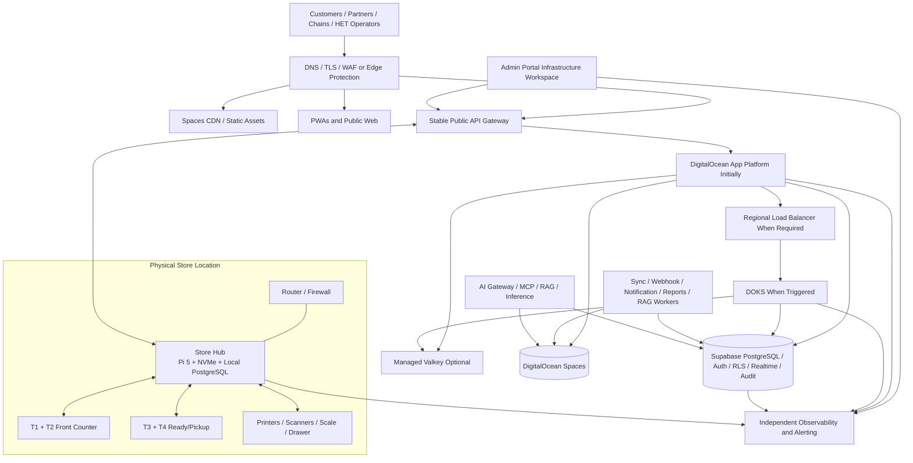

# KitLuy Ecosystem Infrastructure — Phase 1 Laundry Specification

| Field | Value |
|---|---|
| **Filename** | `kitluy-ecosystem-infrastructure-phase1-spec-v1.0.0.md` |
| **Version** | `v1.0.0` |
| **Date** | 2026-07-25 |
| **Domain** | `kitluy-ecosystem-infrastructure` |
| **Phase** | Phase 1 — Laundry |
| **Owner** | HET / KitLuy Suite Project Owner |
| **Primary region** | Singapore / SGP1 unless an approved deployment record states otherwise |
| **Primary cloud providers** | Supabase and DigitalOcean |
| **Edge platform** | Raspberry Pi OS 64-bit / Linux ARM64 with KitLuy Store Hub |
| **Primary operator surface** | Infrastructure & Platform Operations workspace inside `kitluy-admin-pwa-portal` |
| **Status** | Canonical target infrastructure specification; not implementation evidence |
| **Core scaling decision** | Kubernetes-ready from day one; do not operate Kubernetes from day one |
| **Locales / currencies / timezone** | Khmer and English; KHR and USD; `Asia/Phnom_Penh` |

> **Mission:** Provide a secure, observable, cost-efficient and progressively scalable cloud-and-edge foundation that keeps KitLuy Stores operational offline, supports the Phase 1 Laundry products, and can grow into high-traffic, multi-team and multi-region operations without rewriting the application platform.

> **Rebuild Test:** A qualified infrastructure engineer with no previous KitLuy context must be able to reconstruct the Phase 1 cloud, edge, networking, security, deployment, scaling, monitoring, backup and operating model from this specification, approved infrastructure-as-code, migrations, secrets references, runbooks and evidence packages.

> **Implementation truth:** Nothing in this specification is `IMPLEMENTED` merely because it is documented. Implementation requires verified repositories, applied infrastructure and database changes, executable tests, deployed environments, monitoring evidence, restore evidence and approved pilot or production records.

---

# Source Authority, Evidence and Reconciliation

## Authority order

When sources conflict, apply this order:

1. Current project-owner decisions and the active KitLuy Project Instructions.
2. Applied migrations, verified repository code and tests, infrastructure state, deployment records and production evidence.
3. This infrastructure specification after approval.
4. Current Store Hub and Phase 1 product specifications.
5. Current KitLuy Suite Rebuild and Business Bibles.
6. Approved handoffs and the Master Feature Registry.
7. Evidence-based competitor analyses and product classifications.
8. Competitor clone/rebuild documents as design references only.
9. Superseded planning.

No competitor-derived topology, service, threshold, price, database design or vendor choice becomes KitLuy product truth without adoption through an owner decision or this approved specification.

## Governing source baseline

This specification consolidates:

- Current KitLuy Project Instructions: eight-phase vertical roadmap, Digital Store-first model, one Store per primary vertical, shared Core, offline Store Hub, source-of-truth rules, Cambodia requirements and completion gates.
- `Infrastructure upgrade version.txt`: progressive DigitalOcean scaling, App Platform first, Kubernetes readiness, DOKS migration triggers, load balancing, CDN, database pooling and Infrastructure Command Center requirements.
- `kitluy-storehub-phase1-spec-v1.0.0.md`: Store Hub authority, HET-managed hardware identity, PKI, provisioning, LAN operation, sync, signed releases, A/B rollback and replacement-first recovery.
- `kitluy-admin-pwa-portal-phase1-spec-v3.0.0.md`: HET-only control plane, provisioning, fleet, releases, infrastructure operations, support, audit and human approvals.
- Admin multi-team RBAC decision: team-aware, permission-based, resource-scoped and environment-scoped access with separation of duties and four-eyes approval.
- `kitluy-suite-rebuild-bible-v3.0.0.md`: Supabase/DigitalOcean ownership, technology stack, repository shape, File Service, AI Gateway, MCP, RAG, monitoring and deployment foundations, except where later owner decisions supersede it.
- Digital Store and Store Location decision: cloud configuration projects down to edge Locations; transactions and operational events return to KitLuy.
- Owner-locked T1–T4 Laundry model and smartphone-simple provisioning sequence.
- Phase 1 product specifications for Admin, Chain, Partner, Partner App, POS Desktop, POS Mobile, Storefront, B2B Website and Store Hub.

## Evidence labels

| Label | Meaning |
|---|---|
| `OWNER-LOCKED` | Explicit current owner decision. A versioned owner decision is required to change it. |
| `APPROVED TARGET` | Required target behavior that still needs build and verification evidence. |
| `SPECIFIED IN v1` | Concrete infrastructure contract established here to make the target buildable. |
| `OPTIONAL / TRIGGERED` | Prepared or permitted only after a documented trigger and approval. |
| `DEFERRED` | Excluded from the Phase 1 operating baseline. |
| `REJECTED` | Prohibited architecture or operating pattern. |
| `[REQUIRED: ...]` | Missing production-specific value that must not be guessed. |
| `IMPLEMENTED` | Reserved for verified infrastructure, repository, migration, test, deployment and operational evidence. |

## Superseded and rejected assumptions

- Kubernetes is not required for the initial Phase 1 launch.
- Kubernetes readiness is mandatory for all applicable cloud services from their first production release.
- Infrastructure Operations remains a first-class workspace in Admin Portal; a separate infrastructure PWA is not a Phase 1 product.
- Monitoring must remain operational even when Admin Portal is unavailable.
- Store operations do not write directly to Supabase during normal in-store operation; POS clients use the Store Hub.
- Supabase Storage is not the primary heavy-file store.
- Containers and pods never own authoritative persistent business data.
- Generic key-value or JSON storage is not authoritative for payments, finance, inventory, custody or audit.
- Valkey/Redis-compatible storage is acceleration and coordination infrastructure, not authoritative business truth.
- A public IP address, MAC address or copied operating-system image is not a trusted device identity.
- Connectors never receive direct production-database access.
- A multi-region frontend is not presented as full multi-region resilience until database, files, queues, credentials and recovery are also proven.

---

# Part 0 — Rebuild and Bring-Up Sequence

Execute in this order. A later step is not complete when an earlier dependency remains unverified.

## 0.1 Authority and environment approval

1. Approve this specification and record unresolved values.
2. Confirm environment inventory: local, development, staging, pilot, production and disaster recovery.
3. Confirm production region, domains, DNS owner, TLS policy and provider accounts.
4. Confirm the production Supabase organization/project model and DigitalOcean project model.
5. Confirm RPO, RTO, retention, support hours and incident severity policy.
6. Confirm production access owners and the final multi-team Admin RBAC matrix.

## 0.2 Repository and infrastructure-as-code

1. Create or validate the canonical `infra/` repository structure.
2. Implement reusable Terraform modules for DigitalOcean, domains, monitoring, service configuration and policy checks.
3. Keep Supabase project configuration, database migrations, functions and tests in version control.
4. Create environment-specific configuration manifests without committing secrets.
5. Add automated policy checks for public exposure, missing encryption, mutable image tags and unrestricted service accounts.

## 0.3 Cloud foundation

1. Create Supabase environments and configure Auth, PostgreSQL, RLS, Realtime, Edge Functions, audit/event tables and pgvector where approved.
2. Create the DigitalOcean project, Container Registry, App Platform applications, Spaces buckets, networking resources and alert channels.
3. Configure domain zones, TLS certificates, public API boundaries, redirect allowlists and CDN endpoints.
4. Configure central secrets storage and rotation ownership.
5. Configure structured logging, error tracking, uptime probes and independent alert delivery.

## 0.4 Shared platform services

Deploy in dependency order:

1. Identity and authorization integration.
2. Public/API gateway boundaries.
3. File Service.
4. Device Registry and Provisioning Service.
5. Configuration Projection Service.
6. Sync ingestion, acknowledgement and reconciliation workers.
7. Notification Service.
8. Release repository, signing and rollout services.
9. AI Gateway, MCP Server and RAG indexer, isolated from transactional workloads.
10. Infrastructure telemetry and incident ingestion.

## 0.5 Store edge bring-up

1. Build and sign the KitLuy OS image.
2. Enroll Store Hub hardware at HET.
3. Create Digital Store and Store Location.
4. Provision the Store Hub using the one-time code and hardware-backed trust flow.
5. Complete initial configuration and synchronization.
6. Provision T1–T4 terminal profiles and approved peripherals.
7. Validate offline operation, reconnect, duplicate handling and file/print queues.

## 0.6 Release and scale validation

1. Deploy production-like services to staging using the same container images intended for production.
2. Verify readiness, liveness, graceful shutdown and horizontal replica safety.
3. Run load tests, failure injection and database-connection tests.
4. Test App Platform autoscaling and worker separation.
5. Validate signed releases, canary/pilot promotion and rollback.
6. Validate that all production changes are authorized and audited.

## 0.7 Pilot and go-live

1. Pass security, tenancy, RBAC and separation-of-duties reviews.
2. Pass backup restore and replacement-Hub recovery rehearsals.
3. Verify independent alerts while Admin Portal is unavailable.
4. Verify cost dashboards and scaling limits.
5. Complete operator training and on-call handoff.
6. Approve one Laundry pilot.
7. Complete the Rebuild Test and go-live checklist.

---

# Part 1 — Infrastructure Product Identity and Boundaries

## 1.1 Definition

`kitluy-ecosystem-infrastructure` is the shared cloud, edge, network, security, deployment and operations foundation used by all KitLuy applications and vertical modules. It is an infrastructure domain, not a customer-facing product and not an independent Phase 1 PWA.

## 1.2 Infrastructure owns

- Environment and provider architecture.
- Cloud networking, domains, TLS and public ingress.
- Supabase and DigitalOcean resource configuration.
- Container platform and progressive scaling architecture.
- Infrastructure-as-code and environment manifests.
- Service discovery, health endpoints and load-balancing boundaries.
- Store Hub cloud control-plane services.
- Sync ingestion, durable jobs and retry infrastructure.
- File-storage and CDN infrastructure.
- Release repositories, artifact signatures and rollout systems.
- Secrets, certificates and machine identities.
- Monitoring, logging, tracing, alerting and incident tooling.
- Backup, disaster recovery and recovery rehearsals.
- Capacity, performance and infrastructure cost controls.
- Admin Portal Infrastructure & Platform Operations workspace contracts.

## 1.3 Infrastructure does not own

- Laundry workflow rules or UI.
- Partner, Chain or Store commercial decisions.
- Catalog, pricing or tax authorship.
- Payment, finance, inventory or audit business truth.
- Customer-facing marketing content.
- Storefront merchandising or checkout behavior.
- A statutory ERP/general ledger.
- Unrestricted support or operator access.
- Automatic approval of sensitive financial, security, compliance or production changes.

## 1.4 Operator surface decision

Phase 1 uses one HET internal operator surface:

```text
kitluy-admin-pwa-portal
└── Infrastructure & Platform Operations
    ├── Command Center
    ├── Services
    ├── Databases
    ├── Queues and Jobs
    ├── Storage
    ├── Fleet and Sync
    ├── Releases
    ├── Security
    ├── Backups and Recovery
    ├── Cost and Capacity
    └── Incidents
```

The infrastructure backend remains independently deployable. Admin Portal is a control and visibility client, not the monitoring engine, queue worker, device agent or release executor.

## 1.5 Dedicated team decision

A dedicated Infrastructure/Platform Operations team is supported from day one through robust Admin Portal RBAC, team-specific navigation, environment-scoped access and operating runbooks. A separate infrastructure PWA may be considered later only after objective security, availability, organizational or scale triggers.

---

# Part 2 — Architectural Principles

## 2.1 Digital Store control plane

The Partner creates and configures the Digital Store before physical hardware is provisioned. Store Locations receive authorized configuration projections. Physical and digital channels return transactions and events to KitLuy.

## 2.2 Cloud and edge authority

| Concern | Authority |
|---|---|
| Tenant, Digital Store, Location and approved configuration | KitLuy Cloud |
| Local Store operation before cloud acknowledgement | Store Hub |
| Finalized Store event after synchronization | Append-only event preserved at Hub and cloud |
| Cloud reports | Cloud read models with `data_as_of` and sync freshness |
| Long-term files | DigitalOcean Spaces plus Supabase metadata/permissions |
| Files during WAN loss | Store Hub local repository |
| Hardware trust | HET Device Registry and KitLuy PKI |
| Infrastructure operation | Authorized HET teams through Admin Portal and approved break-glass tools |

## 2.3 Offline-first rule

After provisioning, WAN or cloud failure must not stop approved local operations. T1–T4 communicate with the Store Hub over the Store LAN. Cloud synchronization is asynchronous and retry-safe.

## 2.4 Shared Core rule

The infrastructure is neutral across verticals. Laundry-specific behavior stays in the Laundry vertical and consuming applications. Infrastructure provides reusable identity, deployment, storage, synchronization, security and observability capabilities.

## 2.5 Progressive scaling rule

> Build Kubernetes-ready from day one, but do not operate Kubernetes from day one.

The initial operating platform uses managed services and horizontally scalable containers. DOKS, regional load balancing, global load balancing and multi-region deployment are activated only after measured triggers and approved evidence.

## 2.6 Stateless compute rule

Cloud application containers are replaceable and horizontally scalable. Authoritative data lives in approved relational stores, object storage or Store Hub local PostgreSQL. Local container filesystems are temporary only.

## 2.7 Append-only truth rule

Finalized payment, finance, inventory, custody, security and audit records are append-only or corrected by compensating records. Cache, queue or replica failures must not erase authoritative history.

## 2.8 Human-control rule

Sensitive production, financial, permission, compliance, security and recovery actions require authorized human confirmation. Defined high-risk actions require independent approval.

## 2.9 Truth and freshness rule

No operational dashboard may present demo, estimated, cached, stale, last-known, partial or replica data as authoritative live truth. Every relevant view must expose source, observation time, synchronization state and freshness.

---

# Part 3 — Target Ecosystem Topology



## 3.1 Traffic classes

| Traffic class | Examples | Priority |
|---|---|---|
| Store operational synchronization | Hub events, acknowledgements, configuration | Highest business continuity |
| Payment and transaction APIs | Booking/payment confirmation, webhook verification | Highest transactional |
| Auth and authorization | Login, token refresh, permission checks | Critical |
| Partner/Chain/Admin management | Back-office reads and approved mutations | High |
| Storefront and public website | Browsing, pre-intake, lead forms | High but isolatable |
| Notifications and webhooks | Email, Telegram, SMS, connector delivery | Asynchronous |
| Reports and exports | Aggregations, files, scheduled reports | Asynchronous/bounded |
| AI, RAG and indexing | Insights, retrieval, embeddings | Isolated and degradable |

Critical Store sync, transaction and auth resources must not be starved by AI, reporting or bulk export workloads.

---

# Part 4 — Environment Strategy

## 4.1 Required environments

| Environment | Purpose | Data policy | Change policy |
|---|---|---|---|
| `local` | Developer workstation and local integration | Synthetic only | Developer controlled |
| `development` | Shared engineering integration | Synthetic or approved masked fixtures | Frequent automated deployment |
| `staging` | Production-like verification | Synthetic, anonymized or approved test data | Controlled release candidate |
| `pilot` | Limited real Store cohort | Production data for approved pilot | Human approval and audit |
| `production` | Commercial operations | Authoritative production data | Strict approval and rollback |
| `disaster_recovery` | Restore and failover rehearsal | Restored or isolated copy | Break-glass/DR policy |

## 4.2 Isolation requirements

- Separate Supabase projects or equivalent hard isolation for development, staging and production.
- Separate DigitalOcean applications, secrets and service identities per environment.
- Separate Spaces buckets or hard namespace and credential isolation.
- Separate production and non-production domains.
- Production data must never be copied to lower environments without an approved masking process.
- Production service-role credentials are never available to local or development clients.

## 4.3 Environment naming

Recommended logical pattern:

```text
kitluy-{service}-{environment}
kitluy-{resource-class}-{environment}
```

Exact provider resource names remain `[REQUIRED: approved environment inventory]`.

## 4.4 Promotion path

```text
local
  -> development
  -> staging
  -> internal release channel
  -> pilot
  -> stable production
```

An artifact is rebuilt only when the build inputs change. Promotion should reuse immutable, verified artifacts.

---

# Part 5 — Provider Responsibility Model

## 5.1 Supabase owns

- PostgreSQL authoritative cloud data.
- Supabase Auth.
- PostgreSQL RLS.
- Realtime where approved.
- Edge Functions where they are the appropriate execution boundary.
- Core metadata, permissions, ownership, audit and event tables.
- pgvector metadata and indexes where AI/RAG is enabled.
- Connection pooling through the approved Supabase mode.
- Database backups/PITR according to the selected plan and tested policy.

## 5.2 DigitalOcean owns

- Web and PWA hosting.
- API and internal service compute.
- Worker compute.
- Container Registry.
- App Platform for initial managed deployment.
- DOKS when migration triggers are met.
- Regional and later Global Load Balancing when approved.
- Spaces object storage and CDN.
- Managed Valkey when approved.
- AI inference and supporting compute.
- Release artifacts and large operational files.
- Infrastructure-level monitoring and alerts available from the selected services.

## 5.3 Store Hub owns

- Local PostgreSQL.
- T1–T4 sessions and LAN authorization.
- Local operational transactions and event persistence.
- Local files, print queues and hardware adapters.
- Offline outbox/inbox and synchronization cursors.
- Signed release download and local terminal distribution.
- Local health, diagnostics and replacement checkpoints.

## 5.4 Provider-independence requirements

- Public API contracts must not expose provider-specific implementation details.
- AI provider calls pass through KitLuy AI Gateway.
- File access passes through KitLuy File Service contracts and signed object access.
- Cache and queue abstractions must permit migration without rewriting domain logic.
- Terraform modules and runbooks must document provider resources and exit considerations.

---

# Part 6 — Canonical Repository and Infrastructure-as-Code

## 6.1 Repository structure

```text
kitluy-suite/
├── apps/
│   ├── kitluy-b2b-website/
│   ├── kitluy-admin-portal/
│   ├── kitluy-chain-portal/
│   ├── kitluy-partner-portal/
│   ├── kitluy-partner-app/
│   ├── kitluy-pos-desktop-app/
│   └── kitluy-pos-mobile-app/
├── services/
│   ├── kitluy-api-gateway/
│   ├── kitluy-file-service/
│   ├── kitluy-notification-service/
│   ├── kitluy-sync-service/
│   ├── kitluy-device-registry-service/
│   ├── kitluy-provisioning-service/
│   ├── kitluy-release-service/
│   ├── kitluy-ai-gateway/
│   ├── kitluy-mcp-server/
│   ├── kitluy-rag-indexer/
│   └── kitluy-hub-agent/
├── packages/
│   ├── auth/
│   ├── rbac/
│   ├── api-contracts/
│   ├── edge-contracts/
│   ├── device-identity/
│   ├── sync-protocol/
│   ├── events/
│   ├── jobs/
│   ├── observability/
│   ├── file-contracts/
│   └── release-manifests/
├── supabase/
│   ├── migrations/
│   ├── functions/
│   ├── seed/
│   └── tests/
├── infra/
│   ├── terraform/
│   │   ├── modules/
│   │   └── environments/
│   ├── digitalocean/
│   ├── supabase/
│   ├── kubernetes/
│   ├── domains/
│   ├── monitoring/
│   ├── policies/
│   ├── kitluy-os-image/
│   └── manufacturing-station/
├── docs/
│   ├── architecture/
│   ├── runbooks/
│   ├── security/
│   ├── disaster-recovery/
│   ├── capacity/
│   └── bibles/
└── tests/
    ├── contract/
    ├── integration/
    ├── load/
    ├── security/
    ├── recovery/
    └── chaos/
```

## 6.2 Infrastructure-as-code rules

- Production infrastructure is created or changed through reviewed infrastructure-as-code except documented emergency actions.
- State storage, locking and access are restricted by environment.
- Plans are reviewed before apply.
- Production apply requires an authorized operator; high-risk changes require independent approval.
- Manual provider-console changes are detected and reconciled.
- Import existing resources instead of recreating them when adoption begins.
- Destroy operations are separately protected.

## 6.3 Policy checks

CI must reject:

- Public databases.
- Wildcard inbound rules without approved exception.
- Unencrypted storage.
- Mutable `latest` image references in production.
- Missing health checks.
- Services without resource limits or budgets.
- Production secrets in source control.
- Cross-environment credential reuse.
- Direct connector database credentials.
- Automatic production database migration on application startup.

---

# Part 7 — Domains, DNS, TLS and Edge Protection

## 7.1 Stable public boundaries

Recommended public boundaries include:

```text
www.[REQUIRED: domain]
app.[REQUIRED: domain]
admin.[REQUIRED: domain]
chain.[REQUIRED: domain]
partner.[REQUIRED: domain]
store.[REQUIRED: domain]
api.[REQUIRED: domain]
status.[REQUIRED: domain]
assets.[REQUIRED: domain]
```

Exact domains are owner-supplied values.

## 7.2 API abstraction rule

Clients use a stable public API domain and versioned contracts. They do not know whether a service runs on App Platform, a Droplet, DOKS or a future regional deployment.

## 7.3 DNS controls

- DNS changes require role permission, reason and audit.
- Production DNS uses least-privilege provider credentials.
- Records and certificate dependencies are documented.
- Critical DNS records are backed up or reproducible from code.
- TTL changes for migrations are planned and later restored.

## 7.4 TLS controls

- TLS is required for all public and cloud-to-cloud traffic.
- Store Hub cloud connections use mTLS.
- Certificate issuance, renewal and failure alerts are automated where possible.
- Private keys are stored in approved secret or key systems.
- Certificate revocation and rotation are rehearsed.

## 7.5 Edge protection

The approved edge layer must support, as applicable:

- DDoS protection supplied by the chosen provider.
- Rate limiting.
- Request-size limits.
- Bot and abuse controls for public forms and authentication.
- Origin protection.
- Security headers.
- Safe CORS allowlists.
- Webhook source/signature verification.

A specific third-party WAF is optional and requires an approved provider decision.

---

# Part 8 — Phase 1 Deployment Platform and Progressive Scaling

## 8.1 Initial deployment decision

Phase 1 uses DigitalOcean App Platform or equivalent managed DigitalOcean deployment for web applications, APIs and selected workers. This minimizes operating burden while preserving a migration path.

## 8.2 Initial workload placement

| Workload | Phase 1 placement |
|---|---|
| B2B Website | Static/web component with CDN |
| Admin, Chain and Partner PWAs | Static or web components |
| Storefront | Web service |
| Public/API gateway | App Platform service; production redundancy when commercially live |
| File Service | App Platform service |
| Device, provisioning and sync APIs | App Platform services or approved container services |
| Notification workers | Worker components |
| Sync/webhook/reconciliation workers | Worker components isolated from web traffic |
| Reports and scheduled cleanup | Scheduled jobs or on-demand workers |
| AI Gateway/MCP/RAG API | Separate services |
| RAG indexing and bulk AI work | Separate workers with independent limits |
| Large files/media/releases | DigitalOcean Spaces |
| Authoritative cloud database | Supabase |
| Store operations | Store Hub |

## 8.3 Autoscaling

Services may autoscale within approved minimum and maximum limits using supported CPU and HTTP metrics. Scaling boundaries are configuration, not ad-hoc operator judgment.

Required controls:

- Minimum replicas for critical services.
- Maximum replicas and cost guardrails.
- Cooldown and stabilization behavior.
- Readiness checks before traffic is sent.
- Graceful draining before scale-in.
- Alerting on sustained maximum capacity.
- Audit for changes to scaling policy.

## 8.4 Static traffic reduction

The following should bypass application compute where safe:

- Public images and thumbnails.
- Static JavaScript and CSS.
- Public Storefront media.
- Downloadable public documents.
- Release artifacts through authorized distribution paths.

Private files use short-lived signed access after authorization rather than API proxying when this does not weaken policy.

## 8.5 Scale-up order

Use this order before migrating platforms:

1. Fix inefficient queries and application hot paths.
2. Move static content to CDN/object storage.
3. Separate synchronous and asynchronous work.
4. Increase service replicas.
5. Adjust service size where justified.
6. Add approved cache and database pooling.
7. Add read models or read replicas for eligible workloads.
8. Evaluate DOKS when sustained evidence shows better operational or cost outcomes.

---

# Part 9 — Kubernetes Readiness and DOKS Migration

## 9.1 Mandatory readiness from first release

Every applicable backend service must have:

- A production Docker image.
- Immutable version tag and digest.
- `/health/live` and `/health/ready` endpoints.
- Dependency health surfaced separately from liveness.
- Graceful startup and shutdown.
- Safe concurrent replicas.
- Idempotent mutations and jobs.
- No authoritative local filesystem state.
- Externalized configuration and secrets.
- Structured logs and metrics.
- CPU/memory requests, limits and budgets documented.
- A separate migration job.
- Load-test profile.
- Network and permission policy.

## 9.2 Image portability

The same artifact should be deployable through:

```text
development container
  -> App Platform
  -> approved test Droplet where necessary
  -> DOKS staging
  -> DOKS production
```

Environment-specific configuration is injected; the image is not rebuilt for each environment.

## 9.3 DOKS migration triggers

DOKS is evaluated when one or more of these are sustained and documented:

- Several services continuously need many replicas.
- Worker types need independent node or resource scaling.
- App Platform cost is higher than an equivalent managed DOKS design for an approved comparison period.
- Canary, workload isolation or advanced rollout controls exceed the current platform.
- Custom network policy or service-mesh requirements become necessary.
- AI/RAG and transactional compute need stronger physical/resource isolation.
- Team capability and 24/7 support are ready to operate Kubernetes.
- Availability or compliance requirements justify the added complexity.

## 9.4 Proposed DOKS topology

```text
DOKS — SGP1
├── system node pool
│   ├── ingress
│   ├── certificate management
│   ├── metrics/log collectors
│   └── deployment controllers
├── web-api node pool
│   ├── API gateway
│   ├── Management API
│   ├── Commerce Store API
│   ├── Connector API
│   ├── File Service
│   └── Notification API
├── worker node pool
│   ├── sync workers
│   ├── webhook workers
│   ├── report workers
│   ├── reconciliation workers
│   └── notification workers
└── ai node pool — triggered only
    ├── AI Gateway support services
    ├── RAG indexers
    └── heavy AI jobs
```

## 9.5 Kubernetes controls

When DOKS is activated:

- Use namespaces by environment and/or trust boundary.
- Use NetworkPolicies.
- Use least-privilege service accounts.
- Use PodDisruptionBudgets for critical services.
- Use Horizontal Pod Autoscaler and Cluster Autoscaler within approved limits.
- Use topology spread and anti-affinity where justified.
- Use immutable images and admission policies.
- Encrypt and restrict secrets.
- Back up cluster configuration and persistent external dependencies.
- Do not move Supabase authoritative PostgreSQL into the cluster merely for uniformity.

## 9.6 Migration method

1. Deploy DOKS staging using the same images.
2. Run contract, load, security and failure tests.
3. Mirror non-sensitive traffic or use approved canary traffic.
4. Migrate one stateless service family at a time.
5. Keep the stable public API boundary.
6. Preserve rollback to the prior platform until exit criteria pass.
7. Record cost and reliability outcomes.

---

# Part 10 — Load Balancing and Traffic Management

## 10.1 Phase 1

App Platform handles service routing and replica distribution for workloads deployed there. Public endpoints remain stable.

## 10.2 Regional Load Balancer

Use a DigitalOcean Regional Load Balancer when the architecture uses Droplets or DOKS and a dedicated regional entry point is required.

Required behavior:

- Health-based backend selection.
- TLS policy and certificate lifecycle.
- Connection draining.
- Backend allowlists/security rules.
- Capacity monitoring.
- Stable public endpoint.
- Audited configuration changes.

## 10.3 Global Load Balancer

A Global Load Balancer is `OPTIONAL / TRIGGERED`. It is not Phase 1 proof of resilience by itself.

Activation requires:

- Approved secondary-region architecture.
- Database and file recovery/failover design.
- Queue, secret and certificate continuity.
- Tested DNS/global-routing behavior.
- Defined consistency and data-loss boundaries.
- Approved cost and support model.

## 10.4 Rate limits and protection classes

Rate limits must differ by identity and route class:

- Anonymous public routes.
- Authenticated user routes.
- Device/Hub routes.
- Internal service routes.
- Webhook callbacks.
- Bulk/export routes.
- AI routes.

Limits must return typed, retry-aware errors and must not cause duplicate client side effects.

---

# Part 11 — Service Inventory and Workload Classes

## 11.1 Critical synchronous services

- API Gateway.
- Identity/authorization integration.
- Management API write paths.
- Commerce/Storefront transaction paths used in Phase 1.
- Device and provisioning API.
- Sync acknowledgement API.
- File authorization API.

## 11.2 Asynchronous services

- Sync ingestion and reconciliation.
- Webhook delivery.
- Notifications.
- File transformation and malware scanning.
- Export generation.
- Reporting aggregation.
- Release distribution orchestration.
- RAG indexing and embeddings.
- AI non-interactive jobs.
- Cleanup and retention jobs.

## 11.3 Isolation classes

| Class | Rule |
|---|---|
| Transactional | Protected capacity; no bulk/AI co-location when avoidable |
| Store sync | Protected queue and worker capacity |
| Public web | Independently scalable |
| Back-office | Independently scalable; may degrade before Store sync |
| Bulk/reporting | Bounded concurrency and lower priority |
| AI/RAG | Separate budgets, queues and workers |
| Security/monitoring | Must remain available during application incidents |

## 11.4 Dependency policy

Each service declares:

- Required dependencies.
- Optional dependencies.
- Timeout and retry policy.
- Circuit-breaker/degraded behavior.
- Data authority.
- Idempotency scope.
- Alert thresholds.
- Owner team.
- Runbook.

---

# Part 12 — Events, Jobs, Queues and Cache

## 12.1 Durable job truth

Authoritative job state must be stored in relational job/event tables with:

- Job ID.
- Tenant/Digital Store/Location scope where relevant.
- Job type and schema version.
- Idempotency key.
- Status.
- Attempt count.
- Next-attempt time.
- Lease owner/expiry.
- Error classification.
- Result reference.
- Created/started/completed timestamps.
- Dead-letter reason.

## 12.2 Cache/Valkey role

Managed Valkey may be introduced for:

- Read-through cache.
- Rate-limit counters.
- Short-lived sessions where approved.
- Distributed locks.
- Temporary idempotency acceleration.
- Frequently requested configuration.
- Non-authoritative queue coordination.

It must not be the only store of payment, finance, inventory, custody, audit, provisioning or release truth.

## 12.3 Queue behavior

- At-least-once delivery is assumed unless a stronger mechanism is proven.
- Consumers are idempotent.
- Retries use bounded exponential backoff with jitter.
- Poison messages move to dead letter after policy limits.
- Operators can inspect and retry only with permission and audit.
- Bulk jobs have concurrency and cost limits.
- Critical Store sync queues are isolated from AI and export queues.

## 12.4 Domain events

Events are versioned, immutable and retry-safe. They include actor, source service/device, scope, correlation ID, idempotency key and schema version.

## 12.5 Webhooks

- Verify signatures and timestamps.
- Deduplicate provider event IDs.
- Persist receipt before asynchronous processing where required.
- Never trust provider payload without schema validation.
- Record delivery/retry/dead-letter history.
- Never expose database credentials to connector operators.

---

# Part 13 — Supabase Database and Data Access Architecture

## 13.1 Database role

Supabase PostgreSQL is the authoritative cloud relational system for KitLuy Core and approved vertical schemas. It is not a generic application cache.

## 13.2 Connection management

- Use the approved Supabase connection-pooling mode for scalable application traffic.
- Set per-service connection budgets.
- Do not allow every container replica to open an unbounded pool.
- Monitor active, idle, waiting and long-running connections.
- Terminate or remediate abandoned transactions.
- Review query plans and indexes before scaling compute solely to hide inefficient queries.

## 13.3 RLS and service identities

- Tenant, Digital Store, Location, user, role and device isolation is enforced in the database where applicable.
- Client applications use RLS-scoped access.
- Service-role access is server-only, tightly restricted and audited.
- Service identities are separate from human accounts.
- Internal workers receive only required schema/operation permissions.
- AI services never receive unrestricted database access.

## 13.4 Read scaling

Read replicas or dedicated read models may be used for reporting, analytics and read-heavy endpoints when approved.

Rules:

- Asynchronous replica data is labeled with source and `data_as_of`.
- Immediate read-after-write paths stay on the authoritative primary or approved consistent read model.
- Financial, payment and inventory decisions do not rely on an unlabeled stale replica.
- Replica lag is monitored and exposed to operators.

## 13.5 Migration rules

- Migrations are additive and backward compatible by default.
- Production migrations are applied only by authorized operators.
- AI may generate or review migration files but never auto-apply production migrations.
- Application startup does not automatically run production migrations.
- Expand/contract patterns are used for breaking changes.
- Each migration has validation, rollback/forward-fix and recovery documentation.
- Applied migration history is reconciled with repository state before release.

## 13.6 Database monitoring

Monitor:

- CPU and memory.
- Storage and I/O.
- Active/waiting connections.
- Query latency and slow queries.
- Lock waits and deadlocks.
- Transaction duration.
- Replication lag.
- WAL/storage growth.
- Backup/PITR status.
- RLS policy failures and suspicious access.

---

# Part 14 — File Storage, CDN and Data Lifecycle

## 14.1 Storage authority

```text
DigitalOcean Spaces = long-term object bytes
Supabase = metadata, ownership, permissions and audit
Store Hub = local operational repository and upload queue
Clients = temporary authorized cache
```

## 14.2 Bucket classes

Recommended logical classes:

| Class | Treatment |
|---|---|
| Public media | CDN-enabled, reviewed for public access |
| Private operational files | Private, signed access, permission checked |
| Restricted evidence | Stronger access, audit and retention |
| Release artifacts | Private, immutable/versioned and signed |
| RAG source files | Private, permission-scoped |
| Exports | Private, expiration/lifecycle policy |
| Backups | Restricted, separate credentials and retention |
| Logs/archives | Retention and access policy |

Exact bucket names are `[REQUIRED]`.

## 14.3 File Service controls

- Validate content type and size.
- Generate server-controlled object keys.
- Record checksums.
- Enforce malware scanning/quarantine where required.
- Generate thumbnails/derivatives asynchronously.
- Issue short-lived signed access.
- Record ownership, permission, classification and retention.
- Prevent clients from receiving long-lived storage credentials.

## 14.4 Store Hub file flow

1. Persist operational file locally.
2. Record checksum and local metadata.
3. Queue upload.
4. Retry after WAN recovery.
5. Deduplicate by file identity/checksum.
6. Receive cloud acknowledgement.
7. Apply local retention/watermark policy.

## 14.5 CDN rule

Use CDN for public/static assets to reduce compute traffic and latency. Private assets are not made public merely for CDN convenience.

---

# Part 15 — Store Edge, Device Control Plane and Synchronization

## 15.1 Store Hub dependency

The infrastructure must provide:

- Device Registry.
- Provisioning Service.
- PKI and certificate revocation.
- Edge Operations cloud gateway.
- Configuration Projection Service.
- Sync ingestion and acknowledgement workers.
- Release and manifest-signing services.
- Fleet telemetry and security-event ingestion.

## 15.2 Device trust

A trusted Store Hub requires:

```text
HET registry record
+ matching hardware manifest
+ manufacturing certificate
+ proof of hardware-backed private key
+ approved OS/security state
+ authorized Store assignment
```

A provisioning code authorizes an assignment attempt only; it does not create trust.

## 15.3 Cloud connection

- Hub initiates outbound mTLS.
- No public inbound Hub port is required.
- Certificates are scoped to device, Tenant, Digital Store, Location and profile.
- Revoked or mismatched devices fail closed.
- Unknown devices receive no Store configuration or operational data.

## 15.4 Sync contract

The sync protocol requires:

- UUID event IDs.
- Device-local monotonic sequence.
- Idempotency key.
- Aggregate version.
- Schema version.
- Payload checksum.
- Outbox/inbox cursors.
- Duplicate suppression.
- Bounded oldest-first replay.
- Dead-letter and reconciliation states.
- Explicit conflict handling.

Financial, payment, inventory, custody and audit conflicts never use generic last-write-wins.

## 15.5 Configuration projection

- Configuration is versioned and signed.
- Partial downloads never replace active configuration.
- Activation is atomic or rollback-capable.
- Hub reports active, staged and rejected versions.
- Cloud configuration is server-wins, but active local Store operations use the last valid approved configuration during WAN failure.

## 15.6 Fleet telemetry

Required Hub and terminal signals include:

- Heartbeat.
- Software and configuration version.
- Sync queue depth and oldest item age.
- Disk usage and storage watermark.
- CPU temperature and memory.
- Certificate expiry.
- Peripheral health.
- Security posture and integrity state.
- Release status.
- Last successful backup/checkpoint.

---

# Part 16 — Identity, Secrets, PKI and Admin RBAC

## 16.1 Human identity

Supabase Auth is the initial identity platform. Production operator access requires strong authentication and the approved MFA policy.

## 16.2 Multi-team authorization model

Authorization evaluates:

```text
actor
+ team membership
+ role assignment
+ explicit permission
+ resource scope
+ environment scope
+ approval policy
+ session security
```

The frontend never acts as the security boundary. API checks and database controls enforce authorization.

## 16.3 Infrastructure teams

Phase 1 supports at least:

- Platform Operations.
- Infrastructure and DevOps.
- Security Operations.
- Fleet and Hardware Operations.
- Release Operations.
- Support Operations.
- Finance and Billing.
- Integration Operations.
- AI Operations.
- Audit and Compliance.
- Executive Oversight.

## 16.4 Infrastructure role templates

| Role | Primary authority |
|---|---|
| `platform_owner` | Emergency and final platform authority |
| `platform_governance_admin` | RBAC, policy, retention and feature governance |
| `platform_ops_operator` | Services, queues, jobs, incidents and standard recovery |
| `infrastructure_operator` | DigitalOcean/Supabase infrastructure operations within scope |
| `security_operator` | Certificates, revocation, security incidents and access reviews |
| `fleet_operator` | Hub, terminal, peripheral and sync operations |
| `release_operator` | Artifact and rollout preparation |
| `release_approver` | Pilot/Stable promotion and high-risk rollback approval |
| `support_operator` | Tickets and standard diagnostics |
| `support_lead` | Consented elevated support sessions and escalation |
| `audit_reviewer` | Immutable audit review and export |
| `ops_readonly` | Monitoring without mutation |
| `executive_readonly` | Business, risk and cost oversight |

Roles are templates; permissions are not hardcoded around role names.

## 16.5 Permission examples

```text
platform.health.read
platform.jobs.retry
platform.safety_switch.toggle
platform.incident.declare
infrastructure.config.read
infrastructure.config.change
infrastructure.scale.change
infrastructure.region.enable
infrastructure.backup.restore
fleet.devices.read
fleet.devices.revoke
fleet.diagnostics.request
releases.artifact.register
releases.rollout.create
releases.promote.pilot
releases.promote.stable
releases.rollback
security.certificates.rotate
security.credentials.revoke
rbac.roles.manage
rbac.assignments.manage
audit.read
audit.export
```

## 16.6 Scope model

Assignments may be scoped to:

- Platform.
- Provider/project.
- Region.
- Environment.
- Service.
- Tenant/Partner.
- Digital Store.
- Store Location.
- Device group or device.
- Connector.

Production access is independent from staging access.

## 16.7 Four-eyes approval

Normally required for:

- Production migration approval.
- Stable release promotion.
- Broad rollout or rollback.
- Region enablement.
- Production scaling-limit increase above approved budget.
- Platform-wide safety switch.
- Certificate-authority change.
- Device identity replacement or wipe.
- Production connector enablement.
- Backup restore over an active production dataset.
- Owner-level RBAC assignment.
- Bulk access change.

The requester cannot approve the same request.

## 16.8 Temporary and break-glass access

Temporary access includes exact scope, reason, incident/ticket, approver, start, expiry and automatic revocation. Break-glass use triggers immediate alerts and retrospective review. Shared emergency accounts are rejected.

## 16.9 Secrets

- Secrets are stored in approved environment/provider secret systems.
- Secrets are never committed to source control or embedded in images.
- Human and service credentials are separate.
- Rotation ownership and interval are documented.
- Access is least privilege and environment scoped.
- Secret reads and changes are auditable where supported.
- Production credentials are not exposed to clients or Store terminals.

## 16.10 PKI

KitLuy PKI supports:

- Manufacturing certificates.
- Operational device certificates.
- Service certificates where approved.
- Rotation and revocation.
- Expiry monitoring.
- Non-exportable Store Hub private keys.
- Separate certificate generations and incident response.

Exact CA/HSM design remains `[REQUIRED]`.

---

# Part 17 — Observability, SLOs and Incident Response

## 17.1 Independent observability rule

Core monitoring and alerts must not depend on Admin Portal. Admin Portal consumes observability data, while provider consoles and approved monitoring tools remain available during Admin Portal failure.

## 17.2 Required signals

### Traffic

- Requests per second.
- Active connections.
- P50, P95 and P99 latency.
- Success/error rate.
- Rate-limit events.

### Compute

- Instance/pod count.
- CPU and memory.
- Restarts and crash loops.
- Autoscaling events.
- Saturation and throttling.

### Database

- Connection usage.
- Query latency.
- Slow queries.
- CPU, memory and I/O.
- Lock waits/deadlocks.
- Replica lag.
- Backup/PITR status.

### Queues and jobs

- Pending count.
- Oldest item age.
- Processing rate.
- Retry rate.
- Dead-letter count.
- Worker availability.

### Store edge

- Hub/terminal heartbeat.
- Sync backlog and oldest event.
- Disk/storage watermark.
- Peripheral status.
- Certificate expiry.
- Configuration/release version.

### Files and notifications

- Upload failures.
- Scan/quarantine failures.
- Storage growth.
- Delivery success/failure.
- Provider latency.

### AI

- Request volume.
- Latency.
- Model/provider error.
- Token/cost use where available.
- RAG/indexing backlog.
- Policy denials.

## 17.3 SLO framework

Exact numerical SLOs remain `[REQUIRED: approved Phase 1 SLOs]`. Each critical service must define:

- Availability target.
- Latency target.
- Error budget.
- Data freshness target.
- Recovery objective.
- Measurement source.
- Exclusions and maintenance policy.

## 17.4 Alert quality

Alerts must be actionable and include:

- Service/resource.
- Environment.
- Severity.
- Current value and threshold.
- Start time.
- Relevant dashboard.
- Runbook.
- Owner/on-call route.
- Correlation or incident ID.

## 17.5 Severity model

| Severity | Example | Response |
|---|---|---|
| `SEV-1` | Broad production outage, security compromise, payment/data-integrity risk | Immediate incident command and executive/security notification |
| `SEV-2` | Major service degradation, large Store cohort sync failure | Urgent response and active mitigation |
| `SEV-3` | Limited cohort/service degradation with workaround | Business-hours or on-call policy response |
| `SEV-4` | Warning, capacity trend, non-urgent defect | Planned remediation |

Exact response times are `[REQUIRED]`.

## 17.6 Incident lifecycle

```text
detect
-> acknowledge
-> classify
-> assign incident commander
-> contain
-> communicate
-> recover
-> verify
-> close
-> post-incident review
-> tracked remediation
```

High-impact actions during incidents remain authorized and audited.

---

# Part 18 — Capacity, Performance and Cost Management

## 18.1 Capacity planning principle

Scale decisions use measured traffic, latency, saturation, queue age, database pressure, reliability and sustained cost. Store count alone is not a sufficient migration trigger.

## 18.2 Capacity tiers

| Tier | Description | Expected architecture |
|---|---|---|
| Pilot | Limited Stores and controlled traffic | App Platform, Supabase, Spaces, basic workers |
| Early production | Growing Store cohort and public traffic | App Platform autoscaling, separated workers, CDN, pooling |
| Scale-up | Sustained replicas, queue pressure, read scaling | Managed Valkey, optimized read models, stronger load balancing |
| Kubernetes | Complex/sustained multi-service scaling | DOKS with independent node pools and HPA |
| Regional resilience | Region failure is unacceptable | Secondary-region and global-routing design after full DR proof |

## 18.3 Performance requirements

Every public or critical API family has:

- Expected request profile.
- Payload limits.
- P95/P99 targets.
- Concurrency assumptions.
- Database-query budget.
- Cache behavior.
- Timeout and retry policy.
- Load-test scenario.
- Degraded-mode behavior.

## 18.4 Cost controls

Track:

- Cost by provider, environment and service.
- Cost per active Store.
- Cost per 1,000 requests.
- Cost per synchronized event.
- Storage growth and egress.
- AI cost by tenant/use case where available.
- Idle resource cost.
- Autoscaling maximum exposure.
- Backup and retention cost.

## 18.5 Budget guardrails

- Autoscaling maximums require approved budgets.
- Unexpected cost spikes generate alerts.
- Non-production resources use schedules where safe.
- Scheduled jobs replace always-on services for periodic work where appropriate.
- Bulk export/report/AI concurrency is bounded.
- Cost optimization must not weaken data integrity, recovery or security.

## 18.6 Kubernetes economic gate

A DOKS migration proposal includes:

- Current App Platform cost.
- Projected DOKS compute, load balancer, storage and operator cost.
- Team on-call and maintenance capability.
- Reliability benefit.
- Migration and rollback cost.
- Minimum approved observation period.

---

# Part 19 — CI/CD, Artifacts and Release Management

## 19.1 Build pipeline

```text
source change
-> lint/type/test
-> dependency/security scan
-> build immutable artifact
-> generate checksum and SBOM
-> sign artifact
-> deploy development
-> integration tests
-> deploy staging
-> security/load/recovery checks
-> approval
-> pilot
-> stable
```

## 19.2 Artifact rules

- Immutable image/release identifiers.
- Cryptographic checksum.
- Signature verification.
- SBOM.
- Build provenance where supported.
- Environment-independent artifact.
- Release notes and compatibility manifest.
- Retention and revocation policy.

## 19.3 Database and application compatibility

Releases declare:

- Minimum/maximum schema version.
- API compatibility range.
- Store Hub protocol range.
- Terminal application range.
- Configuration schema range.
- Required feature flags.
- Rollback constraints.

## 19.4 Store edge releases

- Store Hub downloads once.
- Hub verifies signature and compatibility.
- Hub distributes approved terminal artifacts over LAN.
- A/B or equivalent rollback is required.
- Failed health checks revert automatically.
- Tampered or revoked artifacts are rejected.

## 19.5 Release channels

```text
Internal
-> Pilot
-> Stable
```

Promotion is an auditable state transition. Stable promotion requires an independent approver.

## 19.6 Emergency releases

Emergency releases still require:

- Incident reference.
- Authorized requester and approver according to emergency policy.
- Tested rollback or forward-fix plan.
- Target cohort.
- Post-release validation.
- Retrospective review.

---

# Part 20 — Backup, Disaster Recovery and Business Continuity

## 20.1 Data classes

| Data class | Primary protection |
|---|---|
| Supabase PostgreSQL | Provider backup/PITR plus tested logical recovery policy |
| Spaces objects | Versioning/lifecycle/backup policy by class |
| Secrets and PKI | Restricted backup/escrow and recovery procedure |
| Infrastructure code/state | Version control plus protected state backup |
| Container/release artifacts | Registry/Spaces retention and signature records |
| Store Hub PostgreSQL | Local checkpoint/backup and cloud-synchronized event recovery |
| Store Hub files | Local queue plus cloud object acknowledgement |
| Audit/security records | Append-only retention and protected export |

## 20.2 Required recovery scenarios

- Accidental application deployment failure.
- Failed database migration.
- Deleted or corrupted object.
- Supabase project/database service incident.
- DigitalOcean service incident.
- Lost credential or certificate compromise.
- Store Hub NVMe failure.
- Complete Store Hub failure.
- Store network/WAN outage.
- Admin Portal outage.
- Region-level unavailability.

## 20.3 Store Hub recovery

Production Store recovery is replacement-first:

1. Activate a pre-enrolled replacement Hub.
2. Verify hardware and operational certificate.
3. Restore approved configuration and recover synchronized state.
4. Reconnect terminals and peripherals.
5. Reconcile any pending local records from recoverable media according to runbook.
6. Quarantine the failed device.

Store staff do not replace production NVMe or reimage the Hub.

## 20.4 RPO and RTO

Exact objectives are `[REQUIRED]` by service/data class. They must be tested, not merely documented.

## 20.5 Restore testing

- Restore into an isolated environment.
- Validate record counts, checksums and critical queries.
- Validate RLS and access controls after restore.
- Validate application compatibility.
- Record duration and data-loss boundary.
- Track remediation for missed objectives.

## 20.6 Multi-region gate

Do not claim active-active or multi-region recovery until all authoritative data, file, queue, identity, certificate, routing and operating procedures are tested end to end.

---

# Part 21 — Security Architecture

## 21.1 Zero-trust principles

- Authenticate every human, device and service.
- Authorize every sensitive action.
- Minimize standing privilege.
- Scope credentials by environment and service.
- Encrypt in transit and at rest.
- Record privileged activity.
- Fail closed when identity, permission or integrity cannot be verified.

## 21.2 Network security

- Default-deny where practical.
- No public database access.
- No public inbound Store Hub access.
- Restrict service-to-service paths.
- Separate public ingress from internal services.
- Keep management endpoints private or strongly authenticated.
- Use allowlists and provider firewalls where appropriate.

## 21.3 Application and supply-chain security

- Dependency scanning.
- Secret scanning.
- Static analysis.
- Container/image scanning.
- Signed artifacts.
- SBOM.
- Protected branches and required reviews.
- Restricted CI/CD credentials.
- Reproducible or traceable builds where possible.

## 21.4 Data security

- Classify public, internal, confidential, restricted and regulated data.
- Minimize PII exposure.
- Encrypt sensitive fields where policy requires.
- Restrict support access.
- Record exports.
- Apply approved retention and deletion policy.
- Do not place authoritative sensitive fields only in logs or JSON metadata.

## 21.5 Vulnerability and patch management

- Track supported versions for OS, runtime, database clients and dependencies.
- Define severity-based patch timelines `[REQUIRED]`.
- Test Store Hub OS and application updates through Internal and Pilot channels.
- Maintain emergency revocation capability.

## 21.6 Security events

Security events include:

- Failed privileged access.
- Unknown/mismatched device.
- Certificate failure/revocation.
- Secret exposure suspicion.
- Cross-tenant denial/anomaly.
- Unexpected infrastructure drift.
- Tampered release.
- Disabled secure-boot/integrity state.
- Break-glass use.

---

# Part 22 — Admin Portal Infrastructure & Platform Operations Workspace

## 22.1 Workspace boundary

The workspace is inside `kitluy-admin-pwa-portal`. It consumes versioned infrastructure APIs and observability sources. It does not directly embed provider root credentials or become the sole monitoring path.

## 22.2 Recommended routes

```text
/ops/command-center
/ops/services
/ops/databases
/ops/queues
/ops/jobs
/ops/storage
/ops/backups
/ops/migrations
/ops/security
/ops/incidents
/ops/costs
/ops/capacity

/status/cloud
/status/providers
/status/digital-stores
/status/locations
/status/hubs
/status/terminals
/status/connectors

/fleet/heartbeats
/fleet/sync
/fleet/diagnostics
/fleet/actions
/fleet/recovery

/releases/artifacts
/releases/channels
/releases/rollouts
/releases/installations
/releases/rollbacks
```

## 22.3 Command Center

The landing view must show:

- Current incidents.
- Critical service health.
- Hub and terminal outage counts.
- Sync backlog and oldest event.
- API latency/error rate.
- Queue/dead-letter pressure.
- Database connection/replica health.
- Release health.
- Certificate expiry.
- Backup/restore status.
- Cost anomaly and capacity risk.

## 22.4 Truth labels

Every health datum includes:

- Source system.
- Environment.
- Observed at.
- Last successful collection.
- Current, delayed, partial, unavailable or last-known state.
- Related incident or maintenance window.

## 22.5 Action controls

The workspace may initiate approved actions such as:

- Retry safe jobs.
- Pause/resume a rollout.
- Request diagnostics.
- Rotate/revoke a credential through approved workflow.
- Change scaling bounds through approval.
- Declare an incident.
- Trigger an approved restore rehearsal.

It must not provide a generic shell, unrestricted SQL console or unaudited provider-root access.

## 22.6 Separate-console extraction triggers

A future separate infrastructure console requires a versioned decision and evidence such as:

- Security policy requires strict separation from business administration.
- A 24/7 NOC/SOC needs an independent high-density interface.
- Admin Portal availability becomes an unacceptable shared failure domain.
- External managed-service operators need tightly restricted access.
- Infrastructure release cadence and code ownership become materially independent.
- Multi-region/multi-provider scale makes the shared frontend impractical.

---

# Part 23 — QA and Acceptance Matrix

## 23.1 Environment and isolation

| ID | Scenario | Expected result |
|---|---|---|
| `INFRA-QA-001` | Development credential used against production | Denied and alerted |
| `INFRA-QA-002` | Cross-tenant API/RLS probe | No data disclosure or mutation |
| `INFRA-QA-003` | Production service starts with missing secret | Fails closed; no partial unsafe operation |
| `INFRA-QA-004` | Manual provider drift | Detected and reconciled |
| `INFRA-QA-005` | Production data requested in development | Blocked without approved masked process |

## 23.2 Scaling and traffic

| ID | Scenario | Expected result |
|---|---|---|
| `INFRA-QA-006` | Public traffic spike | Autoscaling occurs within bounds; error/latency objectives maintained or clear degradation shown |
| `INFRA-QA-007` | Scale-in during active requests | Graceful drain; no lost accepted work |
| `INFRA-QA-008` | Worker backlog spike | Worker scaling/queue isolation protects synchronous APIs |
| `INFRA-QA-009` | AI workload saturation | Transactional and Store sync workloads remain protected |
| `INFRA-QA-010` | App Platform maximum reached | Alert fires with runbook and no silent capacity failure |
| `INFRA-QA-011` | DOKS staging deployment of existing image | Same contracts and behavior pass without application rewrite |

## 23.3 Database and cache

| ID | Scenario | Expected result |
|---|---|---|
| `INFRA-QA-012` | Replica lag | UI/API labels stale source; critical decision stays on primary |
| `INFRA-QA-013` | Valkey unavailable | Cache degrades safely; authoritative records remain intact |
| `INFRA-QA-014` | Database connection surge | Pool limits protect database; typed retry/degraded behavior |
| `INFRA-QA-015` | Long-running transaction | Detected and alerted |
| `INFRA-QA-016` | Failed migration | Release stops; rollback/forward-fix plan used |

## 23.4 Queue and event safety

| ID | Scenario | Expected result |
|---|---|---|
| `INFRA-QA-017` | Duplicate job delivery | One logical effect; duplicate recorded/suppressed |
| `INFRA-QA-018` | Poison message | Bounded retries then dead letter |
| `INFRA-QA-019` | Worker crash after side effect | Retry remains idempotent |
| `INFRA-QA-020` | Dead-letter retry by unauthorized user | Denied and audited |
| `INFRA-QA-021` | Queue acceleration store flushed | Durable relational job truth remains recoverable |

## 23.5 Files and CDN

| ID | Scenario | Expected result |
|---|---|---|
| `INFRA-QA-022` | Private object URL expired | Access denied |
| `INFRA-QA-023` | Public CDN cache purge | Updated asset becomes available within policy |
| `INFRA-QA-024` | Malicious upload | Quarantined; no public/private consumption |
| `INFRA-QA-025` | Duplicate Hub file upload | Single authoritative object/reference result |
| `INFRA-QA-026` | Spaces partial outage | Upload queue retries; UI exposes delayed state |

## 23.6 Security and RBAC

| ID | Scenario | Expected result |
|---|---|---|
| `INFRA-QA-027` | Infrastructure operator attempts billing action | Denied |
| `INFRA-QA-028` | Release requester approves own Stable promotion | Blocked |
| `INFRA-QA-029` | Staging admin attempts production scale change | Denied |
| `INFRA-QA-030` | Temporary access expires | Session/action immediately denied according to policy |
| `INFRA-QA-031` | Break-glass access used | Immediate alert, audit and retrospective-review task |
| `INFRA-QA-032` | Secret found in repository | CI fails and incident workflow starts |

## 23.7 Store edge and recovery

| ID | Scenario | Expected result |
|---|---|---|
| `INFRA-QA-033` | WAN loss during Store operation | Store continues locally through Hub |
| `INFRA-QA-034` | Large Hub backlog reconnects | Bounded oldest-first sync with visible progress |
| `INFRA-QA-035` | Duplicate Hub event | No duplicate cloud side effect |
| `INFRA-QA-036` | Unknown Pi with copied OS | Provisioning denied and security event raised |
| `INFRA-QA-037` | Hub release health check fails | Automatic rollback |
| `INFRA-QA-038` | Hub NVMe failure | Replacement-first recovery succeeds within approved RTO |

## 23.8 Monitoring and incidents

| ID | Scenario | Expected result |
|---|---|---|
| `INFRA-QA-039` | Admin Portal unavailable | Independent alerts and provider observability remain available |
| `INFRA-QA-040` | Synthetic API failure | Alert routes to correct team/runbook |
| `INFRA-QA-041` | Alert storm | Deduplication/grouping prevents operator overload |
| `INFRA-QA-042` | Incident declared | Timeline, commander, actions and communications recorded |
| `INFRA-QA-043` | Stale health metric | Marked delayed/last-known, never live |

## 23.9 Backup and release

| ID | Scenario | Expected result |
|---|---|---|
| `INFRA-QA-044` | Database restore rehearsal | Restored isolated environment passes validation |
| `INFRA-QA-045` | Deleted object restore | Object and metadata relationship recovered |
| `INFRA-QA-046` | Tampered container/release artifact | Signature/digest verification rejects it |
| `INFRA-QA-047` | Pilot rollout failure | Cohort rollback; Stable unaffected |
| `INFRA-QA-048` | Certificate rotation | Services/devices reconnect without unauthorized fallback |
| `INFRA-QA-049` | Region failover tabletop | Gaps explicitly recorded; no false multi-region claim |
| `INFRA-QA-050` | Full Rebuild Test | Qualified engineer reconstructs and operates the infrastructure from approved artifacts |

---

# Part 24 — Phase Gates and Go-Live

## 24.1 Phase gates

| Gate | Required evidence |
|---|---|
| **G0 — Authority** | Scope, provider ownership, RBAC, scaling decision, security rules and unresolved values approved |
| **G1 — Contract** | Topology, APIs, events, jobs, environments, IAM, PKI, backup, monitoring and migration contracts approved |
| **G2 — Build** | IaC, services, dashboards, Admin workspace, pipelines, tests and runbooks complete in development |
| **G3 — Integrated verification** | Cross-service, Store Hub, offline, scaling, security, restore, release and failure tests pass |
| **G4 — Pilot readiness** | Alerts, on-call, capacity, budgets, spares, support, rollback and go-live documentation ready |
| **G5 — Phase exit / Rebuild Test** | Pilot evidence approved and qualified engineer reconstructs and operates Phase 1 infrastructure |

## 24.2 Production go-live checklist

### Authority and access

- [ ] Environment inventory approved.
- [ ] Production owners and on-call contacts recorded.
- [ ] Multi-team RBAC and environment scopes tested.
- [ ] Four-eyes policies active.
- [ ] Break-glass procedure tested.

### Cloud

- [ ] Supabase production project configured and validated.
- [ ] DigitalOcean project and applications configured.
- [ ] Domains, DNS and TLS validated.
- [ ] Spaces buckets and policies validated.
- [ ] Container Registry and artifact signing active.
- [ ] App Platform minimum/maximum scaling approved.

### Data

- [ ] Migrations applied by authorized operator.
- [ ] RLS isolation tests passed.
- [ ] Connection pooling and budgets tested.
- [ ] Backup/PITR enabled according to approved plan.
- [ ] Restore rehearsal passed.

### Edge

- [ ] Device Registry and PKI active.
- [ ] Provisioning and configuration projection tested.
- [ ] Hub mTLS and revocation tested.
- [ ] T1–T4 offline workflow passed.
- [ ] Sync backlog/reconnect passed.
- [ ] Replacement-Hub runbook passed.

### Operations

- [ ] Independent monitoring active.
- [ ] Admin Command Center active.
- [ ] Alerts route to correct teams.
- [ ] Incident runbooks and status communication ready.
- [ ] Cost and capacity dashboards active.
- [ ] Release rollback tested.
- [ ] Support and escalation handoff complete.

### Evidence

- [ ] Load-test results archived.
- [ ] Security-test results archived.
- [ ] Restore evidence archived.
- [ ] Pilot approval recorded.
- [ ] Rebuild Test signed off.

---

# Part 25 — Feature Inventory

| Feature ID | Capability | Authority | Phase | Priority |
|---|---|---|---|---|
| `KL-INF-P1-001` | Supabase/DigitalOcean responsibility split | OWNER-LOCKED | Phase 1 | P0 |
| `KL-INF-P1-002` | Digital Store cloud control plane and Store Location edge model | OWNER-LOCKED | Phase 1 | P0 |
| `KL-INF-P1-003` | Store Hub offline local authority | OWNER-LOCKED | Phase 1 | P0 |
| `KL-INF-P1-004` | Environment isolation | SPECIFIED IN v1 | Phase 1 | P0 |
| `KL-INF-P1-005` | Infrastructure-as-code | SPECIFIED IN v1 | Phase 1 | P0 |
| `KL-INF-P1-006` | Stable API/DNS boundary | SPECIFIED IN v1 | Phase 1 | P0 |
| `KL-INF-P1-007` | App Platform initial deployment | APPROVED TARGET | Phase 1 | P0 |
| `KL-INF-P1-008` | Kubernetes-ready service standard | OWNER-LOCKED | Phase 1 | P0 |
| `KL-INF-P1-009` | Triggered DOKS migration | OWNER-LOCKED | Growth | P1 |
| `KL-INF-P1-010` | Regional Load Balancer when required | OPTIONAL / TRIGGERED | Growth | P1 |
| `KL-INF-P1-011` | Global Load Balancer and secondary region | DEFERRED / TRIGGERED | Later | P2 |
| `KL-INF-P1-012` | Spaces object storage and CDN | OWNER-LOCKED | Phase 1 | P0 |
| `KL-INF-P1-013` | Supabase connection pooling and budgets | SPECIFIED IN v1 | Phase 1 | P0 |
| `KL-INF-P1-014` | Read models/replicas with freshness labels | OPTIONAL / TRIGGERED | Growth | P1 |
| `KL-INF-P1-015` | Durable relational jobs/events | OWNER-LOCKED | Phase 1 | P0 |
| `KL-INF-P1-016` | Managed Valkey as non-authoritative acceleration | OPTIONAL / TRIGGERED | Growth | P1 |
| `KL-INF-P1-017` | Workload isolation for sync, transactions, reports and AI | SPECIFIED IN v1 | Phase 1 | P0 |
| `KL-INF-P1-018` | Device Registry, provisioning and PKI | OWNER-LOCKED | Phase 1 | P0 |
| `KL-INF-P1-019` | mTLS Store Hub cloud connection | OWNER-LOCKED | Phase 1 | P0 |
| `KL-INF-P1-020` | Versioned configuration projection | OWNER-LOCKED | Phase 1 | P0 |
| `KL-INF-P1-021` | Idempotent offline synchronization | OWNER-LOCKED | Phase 1 | P0 |
| `KL-INF-P1-022` | Signed artifacts and SBOM | SPECIFIED IN v1 | Phase 1 | P0 |
| `KL-INF-P1-023` | Internal/Pilot/Stable release channels | OWNER-LOCKED | Phase 1 | P0 |
| `KL-INF-P1-024` | Store Hub A/B rollback | OWNER-LOCKED | Phase 1 | P0 |
| `KL-INF-P1-025` | Independent observability and alerting | OWNER-LOCKED | Phase 1 | P0 |
| `KL-INF-P1-026` | Admin Portal Infrastructure Command Center | OWNER-LOCKED | Phase 1 | P0 |
| `KL-INF-P1-027` | Multi-team scoped Admin RBAC | OWNER-LOCKED | Phase 1 | P0 |
| `KL-INF-P1-028` | Four-eyes production approvals | OWNER-LOCKED | Phase 1 | P0 |
| `KL-INF-P1-029` | Append-only privileged audit | OWNER-LOCKED | Phase 1 | P0 |
| `KL-INF-P1-030` | Secrets management and rotation | SPECIFIED IN v1 | Phase 1 | P0 |
| `KL-INF-P1-031` | Backup/PITR and restore rehearsals | APPROVED TARGET | Phase 1 | P0 |
| `KL-INF-P1-032` | Replacement-first Store Hub recovery | OWNER-LOCKED | Phase 1 | P0 |
| `KL-INF-P1-033` | Capacity and cost dashboards | SPECIFIED IN v1 | Phase 1 | P1 |
| `KL-INF-P1-034` | Autoscaling budget guardrails | SPECIFIED IN v1 | Phase 1 | P1 |
| `KL-INF-P1-035` | Multi-region claim gate | SPECIFIED IN v1 | Later | P2 |
| `KL-INF-P1-036` | No direct connector database access | OWNER-LOCKED | Phase 1 | P0 |
| `KL-INF-P1-037` | No automatic production migration on startup | OWNER-LOCKED | Phase 1 | P0 |
| `KL-INF-P1-038` | No separate infrastructure PWA in Phase 1 | OWNER-LOCKED | Phase 1 | P0 |

---

# Appendix A — Required Production Values

The following must be approved before production go-live:

- `[REQUIRED: legal owner of provider accounts]`
- `[REQUIRED: production Supabase project reference and plan]`
- `[REQUIRED: production DigitalOcean project name and region]`
- `[REQUIRED: exact production domains]`
- `[REQUIRED: DNS provider and access policy]`
- `[REQUIRED: TLS/certificate authority policy]`
- `[REQUIRED: production App Platform application inventory]`
- `[REQUIRED: Container Registry names and retention]`
- `[REQUIRED: Spaces bucket names, regions and lifecycle rules]`
- `[REQUIRED: approved Valkey activation trigger and plan]`
- `[REQUIRED: production service replica minimums/maximums]`
- `[REQUIRED: API and worker resource sizes]`
- `[REQUIRED: database connection budgets per service]`
- `[REQUIRED: approved SLOs and alert thresholds]`
- `[REQUIRED: incident response times and on-call schedule]`
- `[REQUIRED: backup retention, PITR plan, RPO and RTO by data class]`
- `[REQUIRED: secrets manager and rotation intervals]`
- `[REQUIRED: PKI root/intermediate CA and HSM/secure-key design]`
- `[REQUIRED: production support-session policy]`
- `[REQUIRED: log retention and privacy policy]`
- `[REQUIRED: cost budgets and anomaly thresholds]`
- `[REQUIRED: DOKS economic/operational migration review period]`
- `[REQUIRED: secondary-region and global-routing re-entry gate]`

---

# Appendix B — Secret and Credential Classes

| Secret class | Examples | Rule |
|---|---|---|
| Public client configuration | Supabase public URL/anon key where intended | Still environment scoped; no privileged access |
| Backend database/service | Supabase service role, database credentials | Server only; tightly restricted and rotated |
| DigitalOcean | API token, Spaces keys, registry credentials | Least privilege by service/environment |
| Payment/provider | KHQR/payment credentials | Restricted, audited and provider-policy rotation |
| Notification | Telegram/SMS/email credentials | Service-specific and revocable |
| AI | Inference provider keys, routing config | AI Gateway only; cost/policy controlled |
| PKI | CA keys, operational signing keys | Highest protection; non-exportable/HSM where approved |
| Store device | Manufacturing/operational private keys | Generated non-exportably on device; never backed up as raw key |
| CI/CD | Deploy tokens, signing credentials | Short-lived or protected; no developer reuse |
| Monitoring | DSNs, ingest tokens | Environment scoped; cannot authorize business mutations |

---

# Appendix C — Logical Service Endpoints

Exact domains and routes remain in versioned API specifications. The infrastructure must support these logical boundaries:

```text
Public Web
- B2B Website
- Storefront

Human Management
- Admin Portal
- Chain Portal
- Partner Portal
- Partner App

Governed APIs
- Management API
- Commerce Store API
- Edge Operations API
- Connector API

Internal Services
- File Service
- Notification Service
- Sync Service
- Device Registry
- Provisioning Service
- Release Service
- AI Gateway
- MCP Server
- RAG Indexer

Edge
- Store Hub local /edge/v1
- Store Hub outbound cloud sync and configuration channels
```

---

# Appendix D — Deployment Mode Matrix

| Mode | Use | Allowed authority |
|---|---|---|
| App Platform | Phase 1 managed web/API/worker deployment | Stateless compute only |
| Scheduled job | Periodic cleanup/report/maintenance | Time-bounded job authority |
| Droplet | Exceptional service or diagnostic need with approval | Must follow hardening and IaC |
| DOKS | Triggered scale/complexity platform | Stateless services and approved internal components |
| Supabase Edge Function | Appropriate short-lived gateway/function paths | Scoped service authority |
| Supabase PostgreSQL | Authoritative cloud relational data | RLS and controlled service access |
| Spaces | Object bytes | Metadata/permission truth remains controlled by KitLuy |
| Store Hub | Local Store operational authority | Location-scoped offline operations |

---

# Appendix E — Reconciliation Register

| Item | Resolution in v1.0.0 |
|---|---|
| Separate infrastructure PWA | Rejected for Phase 1; use Admin Portal workspace |
| Dedicated infrastructure team | Approved through RBAC, navigation and runbooks |
| Kubernetes at launch | Rejected as default; readiness required |
| Kubernetes later | Triggered DOKS migration based on evidence |
| Load balancing | Managed platform first; Regional LB when topology requires; Global LB later |
| Redis/Valkey as job truth | Rejected; relational job/event truth required |
| Supabase Storage for heavy files | Rejected; use DigitalOcean Spaces |
| POS direct write to Supabase | Rejected for normal Store operations |
| Monitoring only through Admin Portal | Rejected; independent observability required |
| Multi-region frontend equals DR | Rejected |
| One broad Admin role | Rejected; granular multi-team RBAC required |
| Requester approves own high-risk action | Rejected |
| Automatic production migrations at app startup | Rejected |
| Provider-root credentials in Admin frontend | Rejected |
| Unknown Pi provisionable by code | Rejected |
| Store staff replaces Hub NVMe | Rejected; HET-only maintenance and replacement-first recovery |

---

# Appendix F — Definition of Done

Phase 1 infrastructure is complete only when:

1. Provider ownership, environments and authority boundaries are approved.
2. IaC reconstructs the approved environments without undocumented manual steps.
3. Supabase RLS and service identities pass tenant/isolation testing.
4. DigitalOcean services run immutable, signed, Kubernetes-ready images.
5. App Platform scaling, limits and cost guardrails are verified.
6. Critical APIs, workers and queues are idempotent and horizontally safe.
7. Store Hub provisioning, offline operation and synchronization pass.
8. File Service and Spaces lifecycle controls pass.
9. Multi-team Admin RBAC, scopes and four-eyes approvals pass.
10. Independent monitoring, alerts and incident response are operational.
11. Backup restore and replacement-Hub recovery pass approved objectives.
12. Release promotion and rollback pass.
13. Load, security, failure and recovery tests are archived.
14. One Laundry pilot is approved.
15. One qualified engineer passes the Rebuild Test using current documentation and artifacts.

---

# Version History

| Version | Date | Change |
|---|---|---|
| `v1.0.0` | 2026-07-25 | First dedicated KitLuy ecosystem infrastructure specification. Consolidates Supabase/DigitalOcean ownership, App Platform launch architecture, Kubernetes readiness and DOKS triggers, load balancing, object storage/CDN, database scaling, Store Hub cloud control plane, multi-team Admin RBAC, independent observability, cost controls, signed releases, backup/DR and Phase 1 completion gates. |
