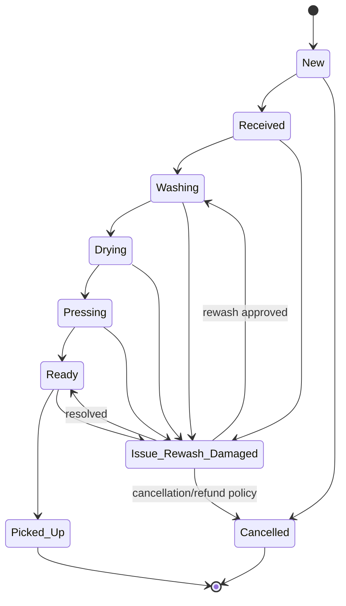

# KitLuy Partner App — Rebuild Bible

**Filename:** `kitluy-partner-app-rebuild-bible-v1.1.0.md`  
**Version:** v1.1.0  
**Date:** 2026-07-13  
**Product:** `kitluy-partner-app`  
**Owner:** HET / KitLuy Suite project owner  
**Audience:** Product owner, mobile engineers, backend engineers, QA, support, operators, and AI handoff agents  
**Primary industry:** Laundry Industry  
**Status:** Canonical rebuild-ready planning bible  
**Project boundary:** KitLuy-first. No active dependency on SroulERP, Netra, Rotanak, Prajna, HSAL, HSA, Canvar, PlantOS, or other future/sibling systems for MVP operation.  
**Naming rule:** Use **Partner**, not Seller. Use **Booking / Laundry Booking**, not Order, in mobile/business-facing UI.  
**Mobile goal:** Daily operations cockpit for a one-store Laundry Partner owner/manager. It does not replace `kitluy-partner-pwa-portal` and it is not `kitluy-pos-mobile-app`.

> **Mission:** This handbook must pass the **Rebuild Test**:  
> *If every person who built KitLuy Partner App disappeared tomorrow, could a single engineer with zero prior context reconstruct the product, infrastructure, database expectations, user flows, and business logic from this document alone?*  
> **Required answer:** Yes.

---

## Source Baseline Used for v1.1.0

- `rebuild-bible-ai-template(5).md`, uploaded 2026-07-13; structural authority for Parts 0–18 and Appendices A–D.
- `kitluy-partner-app-rebuild-bible-v1.0.0.md`, dated 2026-07-05; direct predecessor and content baseline.
- `kitluy-suite-ecosystem-rebuild-bible-v2.0.0.md`, dated 2026-07-01; ecosystem architecture, product boundaries, infrastructure, naming, and Laundry-first authority.
- `kitluy-partner-pwa-portal-rebuild-bible-v1.0.0.md`, dated 2026-07-03; full one-store back-office boundary and shared Partner read-model expectations.
- `kitluy-admin-pwa-portal-rebuild-bible-v2.0.0.md`, dated 2026-07-03; HET-only provisioning, platform operations, device, audit, and Integration Hub boundaries.
- `kitluy-chain-portal-rebuild-bible-v2.0.0.md`, dated 2026-07-03; chain catalog, standards, and store emergency-availability governance boundaries.
- Current Partner App implementation and handoff decisions through 2026-07-13, including fail-closed provider/repository seams, last-known mobile cache, Booking terminology, Finance truth labeling, and read-only Phase-1 Finance behavior.

### v1.1.0 Canonical Product Decisions

1. **Cockpit, not back office.** The app is an attention-first owner/manager daily-operations cockpit. Full configuration, bulk data work, exports, complex reconciliation, purchasing, role administration, and Integration Hub setup remain in `kitluy-partner-pwa-portal`.
2. **Owner/manager primary access.** `partner_owner` and `store_manager` are the default interactive mobile roles. `supervisor`, `accountant`, and `readonly` access is explicit and capability-limited. `cashier` and `laundry_staff` use POS/staff surfaces and are denied Partner App access by default.
3. **Mobile language is Booking.** User-facing mobile copy uses **Booking / Laundry Booking**. Backend `order` names may remain behind adapters. The mobile finishing status is **Pressing**, even when a legacy backend value is `ironing`.
4. **Fail-closed live data.** Missing providers, read models, permissions, or environment configuration produce `unavailable`/`partial` states, never fabricated zeroes and never unlabeled demo data.
5. **Finance truth is explicit.** `grossBilledTodayKhr` is labeled **Gross billed today**. It must never be relabeled as “Today’s sales.” Net sales, paid sales, cash, KHQR, variance, refunds, voids, balances, and reconciliation state are shown only when their authoritative read models provide them.
6. **Phase-1 Finance is read-only.** The Finance tab displays a role-scoped snapshot, KHQR readiness/status, balances, refund/void summary, cash variance, approval previews, and reconciliation checklist. It does not capture payment, generate KHQR, approve refund/void, reconcile, or alter financial records in Phase 1.
7. **Protected last-known cache.** The app retains the latest successfully loaded store snapshot so offline screens do not become blank. Cached values are browse-only, timestamped, role-scoped, cleared on logout, and never treated as current financial truth.
8. **Human confirmation remains mandatory.** AI can explain, summarize, prioritize, and draft a recommended action. It cannot refund, void, suspend, change pricing, alter finance, change staff permissions, or pause services without an authorized human action and audit trail.
9. **Cloud read path only in MVP.** Partner App reads cloud-projected state and local mobile cache. It does not directly connect to the Store Hub LAN in MVP.
10. **KitLuy-only scope.** Canvar and other channels may be configured in the Partner PWA Integration Hub later; the Partner App does not depend on Canvar, PlantOS, SroulERP, Netra, Rotanak, HSAL, HSA, or another sibling system to operate.

---

## 0. Front Matter — Rebuild Sequence

### REBUILD SEQUENCE — KitLuy Partner App v1.1.0

1. **Provision infrastructure**
   - Supabase project in Singapore / SGP1 region for PostgreSQL, Auth, Realtime, Edge Functions, RLS, audit/events, and pgvector if AI/RAG features are enabled.
   - DigitalOcean SGP1 for API/service hosting where needed.
   - DigitalOcean Spaces for images, evidence files, exports, generated PDFs, RAG source files, logs, and backups.
   - DigitalOcean Inference Engine as first LLM inference layer for KitLuy AI Gateway.
   - Mobile push provider: Firebase Cloud Messaging for Android and APNs for iOS through Expo Notifications or final native push provider.
   - Required exact values: `[REQUIRED: production Supabase project ref]`, `[REQUIRED: DigitalOcean project name]`, `[REQUIRED: Spaces bucket names]`, `[REQUIRED: mobile app bundle IDs]`, `[REQUIRED: production domains / API base URLs]`.

2. **Apply database migrations in order**
   - `000_enable_extensions.sql`
   - `001_kitluy_core_schema.sql`
   - `002_kitluy_admin_schema.sql`
   - `003_kitluy_chain_schema.sql`
   - `004_kitluy_partner_schema.sql`
   - `005_kitluy_pos_schema.sql`
   - `006_kitluy_laundry_vertical_schema.sql`
   - `007_kitluy_orders_payments_schema.sql`
   - `008_kitluy_devices_sync_schema.sql`
   - `009_kitluy_files_schema.sql`
   - `010_kitluy_ai_schema.sql`
   - `011_kitluy_events_audit_schema.sql`
   - `012_kitluy_notification_schema.sql`
   - `013_kitluy_partner_app_schema.sql`
   - `014_kitluy_rls_policies.sql`
   - `015_kitluy_indexes.sql`
   - `016_kitluy_seed_baseline.sql`
   - Production migrations are written by engineering and applied only by an authorized backend/operator. AI must not auto-apply production migrations.

3. **Seed baseline data**
   - Platform owner roles.
   - Partner App access roles: `partner_owner`, `store_manager`, optional capability-limited `supervisor`, `accountant`, and `readonly`.
   - `cashier` and `laundry_staff` remain POS/staff roles and are denied Partner App access by default.
   - Laundry vertical enum and default services.
   - Partner App mobile feature flags.
   - Laundry Booking display statuses: `New`, `Received`, `Washing`, `Drying`, `Pressing`, `Ready`, `Picked Up`, `Cancelled`, `Issue/Rewash/Damaged`.
   - Emergency pause reason codes.
   - Notification priority defaults.
   - AI prompt policies and MCP tool registry entries for Partner-safe actions.
   - Device types and push notification channel templates.

4. **Deploy API contracts / Edge Functions**
   - Auth/session helpers.
   - Partner App bootstrap/profile function.
   - Mobile dashboard snapshot function.
   - Booking list/detail functions.
   - Booking note/evidence functions.
   - Issue/Rewash/Damaged functions.
   - Emergency service pause functions.
   - Finance snapshot, finance-truth status, approval-preview, and reconciliation-checklist read functions.
   - Refund/void/cash-variance/reconciliation mutations are Phase 1.5 contracts, feature-flagged off by default, and must not be inferred from a read model.
   - Staff/status functions.
   - Inventory alert functions.
   - Store health/sync status functions.
   - Offline snapshot function.
   - Notification registration/read/deep-link functions.
   - File Service signed upload/download functions.
   - AI Gateway functions: daily summary, booking overload/staff capacity alert, finance explanation, low-stock explanation, sync/device explanation.

5. **Configure secrets and third-party credentials**
   - Supabase URL and anon key for client.
   - Supabase service role key for server functions only.
   - DigitalOcean Spaces access key/secret for File Service only.
   - DigitalOcean Inference Engine endpoint/key for AI Gateway only.
   - FCM/APNs/Expo push credentials.
   - ABA PayWay / KHQR credentials when payment integration is activated.
   - Telegram/SMS/email provider tokens when notifications are activated.
   - Maps/geocoding key if pickup/delivery/service area features are activated.
   - Never commit secrets.

6. **Build / image local hardware or nodes**
   - Partner App itself runs on iOS/Android and does not run on store hardware.
   - Store Hub/POS are sibling builds required for real store operation.
   - For end-to-end testing, image one Raspberry Pi 5 Store Hub and pair POS Desktop/Mobile, receipt printer, tag printer, scanner, scale, and optional controller.
   - Partner App reads Store Hub/POS status from cloud-synced heartbeat/sync data and local app cache; it does not connect directly to the LAN Hub in MVP unless a future local-discovery mode is explicitly designed.

7. **Pair / register clients to backend**
   - Register tenant and one Laundry store.
   - Create Partner owner/manager users.
   - Register Store Hub and POS devices.
   - Create employee records and POS permission cache.
   - Install Partner App on mobile device.
   - Login via Supabase Auth.
   - Register push token.
   - Verify role-scoped mobile bootstrap loads.
   - Verify sync freshness, store health, and latest snapshot display.

8. **Run QA validation scenarios**
   - Run all Partner App QA scenarios in Part 15, covering login, access roles, fail-closed providers, cache, Booking views, Pressing mapping, Issue/Rewash/Damaged, authoritative Finance labels, read-only Phase-1 finance, store health, AI overload alerts, push, emergency pause, and offline no-blank-screen behavior.

9. **Verify monitoring and alerting**
   - App crash/error telemetry.
   - Supabase Auth/DB/Realtime/Edge Function health.
   - Store Hub heartbeat and sync freshness.
   - POS heartbeat.
   - Mobile push delivery failures.
   - File upload failures.
   - AI Gateway latency/cost/errors.
   - Booking overload alert evaluation jobs.
   - Offline cache age and stale snapshot warnings.

10. **Go-live smoke test**
    - Admin creates tenant -> creates one Laundry store -> creates Partner owner/manager -> seeds Laundry templates -> registers Store Hub and POS -> POS creates a Laundry Booking -> POS records cash/deposit/KHQR/manual payment -> POS prints receipt/tag -> Booking moves through Received/Washing/Drying/Pressing/Ready -> Hub syncs cloud -> Partner App shows the latest role-scoped snapshot -> Finance labels gross billed as gross billed and marks missing truth as partial/unavailable -> approval preview is visible but Phase-1 mutation is unavailable -> app goes offline and browses timestamped cache -> app returns online and refreshes -> AI overload rule triggers -> owner confirms an enabled emergency pause action -> audit event appears -> push deep-link opens the correct Booking.

---

## Part 1 — Glossary

### 1.1 Platform Terms

| Term | Definition |
|---|---|
| KitLuy | Cambodia-first commerce operating ecosystem for SMEs, chains, and franchise businesses, starting with Laundry. |
| KitLuy Suite | Full product suite: Admin Portal, Chain Portal, Partner Portal, Partner App, POS Desktop App, POS Mobile App, Store Hub, File Service, AI Gateway, MCP Server, RAG Indexer, Notification Service, and shared backend. |
| KitLuy-only stage | Current stage where MVP features must be built inside KitLuy or as generic optional connectors. No active dependency on SroulERP, Netra, Rotanak, Prajna, HSAL, HSA, Canvar, PlantOS, or other sibling systems. |
| Cambodia-first | Product decisions prioritize Cambodian realities: Khmer-first UX, KHR-native money, KHQR readiness, offline-first operation, affordable hardware, and practical SME workflows. |
| Vertical | Industry-specific business bundle with schema delta, workflow, lifecycle, reports, hardware profile, feature index, and UI adjustments. Not a UI skin. |
| Laundry Industry | First active vertical and MVP baseline. |
| Tenant | Backend account representing a business customer organization using KitLuy. |
| Partner | Business/store owner or operator using KitLuy. Replaces retired term `Seller`. |
| Store | One physical business location using KitLuy. A store belongs to exactly one tenant and one vertical. |
| Partner App | This product: mobile daily-operations cockpit for one-store Laundry Partner owner/manager. |
| Partner Portal | Web/PWA back office for one store. Full configuration, data tables, exports, and heavier workflows stay here. |
| Store Hub | Raspberry Pi 5 local server at the store. Runs local PostgreSQL, Hub API, sync agent, file queue, employee/PIN cache, and device monitor. |
| Offline-first | Store operations continue during WAN/internet failure. POS writes to Store Hub first; Hub syncs to cloud when WAN returns. |
| Sync freshness | App indicator showing whether displayed cloud/mobile data is Fresh, Pending Sync, Stale, Offline, or Unknown relative to Store Hub sync status. |
| Last-known Store Cache | Local encrypted or protected mobile cache of the latest successfully loaded store snapshot so the app does not show blank screens offline. |
| Daily Operations Cockpit | Attention-first mobile surface that answers: What needs the owner/manager's attention now? It is not a compressed copy of every Partner PWA module. |
| Live Mode | Runtime mode connected to real KitLuy providers/read models. Demo fixtures must not silently substitute for live store truth. |
| Fail-Closed | Safety behavior where missing configuration, provider, read model, or permission returns unavailable/partial/denied rather than fabricated data or a permissive action. |
| Demo Fallback | Explicitly labeled non-production fixture state used for demos or isolated UI work. It must never be presented as live business truth. |
| Provider/Repository Seam | Mobile data-access boundary separating UI/view models from Supabase, Edge Function, mock, and cached implementations. It enables testing and prevents UI code from inventing business truth. |
| Finance Truth | Authoritative finance values produced by approved backend read models or ledgers. Derived values must be named according to what they actually measure. |
| Approval Preview | Read-only summary of a sensitive pending action, its amount, reason, requester, and required authority. A preview is not an approval mutation. |
| Domain Event | Immutable event representing meaningful state change, such as `booking_created`, `service_paused`, `hub_heartbeat_received`, or `refund_approved`. |
| Rebuild Test | Requirement that a single engineer with no prior context can reconstruct the system from this bible and referenced migrations. |

### 1.2 Product Terms

| Product | Definition |
|---|---|
| `kitluy-admin-portal` | HET/platform-owner web/PWA control plane for tenants, subscriptions, support, device registry, audit, platform health, Integration Hub, and AI governance. |
| `kitluy-chain-portal` | Web/PWA for chain/franchise owners: branch reports, catalog push, store availability governance, brand standards, compliance, chain rollups. |
| `kitluy-partner-portal` / `kitluy-partner-pwa-portal` | One-store web/PWA back office for services, staff, customers, inventory, finance, reports, settings, AI insights. |
| `kitluy-partner-app` | This product. Mobile companion/cockpit for daily store oversight, alerts, approvals, Booking visibility, finance snapshot, staff/store health, and AI summaries. |
| `kitluy-pos-desktop-app` | Fixed in-store POS terminal for staff. Handles Booking intake, payment capture, receipt/tag printing, shift, and offline writes via Store Hub. |
| `kitluy-pos-mobile-app` | Roaming mobile POS/status/pickup helper for staff. It is not Partner App. |
| `kitluy-hub-agent` | Store Hub service for local DB, sync, local APIs, device health, file queue, and offline queue. |
| `kitluy-file-service` | Service for DigitalOcean Spaces upload/download, file metadata, signed URLs, thumbnails, permissions, and audit. |
| `kitluy-ai-gateway` | KitLuy-native AI orchestration layer for RBAC, prompt policy, RAG, MCP routing, provider routing, safety, and audit. |
| `kitluy-mcp-server` | Internal approved tool/action server used by AI. Tool calls are permission-scoped and audited. |
| `kitluy-rag-indexer` | Worker that chunks/indexes documents and operational records for AI retrieval. |
| `kitluy-notification-service` | Internal service for push, Telegram, SMS, email, and in-app notifications. |

### 1.3 Booking and Laundry Terms

| Term | Definition |
|---|---|
| Laundry Booking | Main Partner App business-facing object. A customer laundry job with services, price lines, due/pickup dates, status lifecycle, payment state, receipt/tag references, photos, and issue records. Backend may still use `order` naming, but Partner App UI says Booking. |
| Booking Line | One service line inside a Laundry Booking: per-kg, per-piece, flat service, add-on, or adjustment. |
| Booking Number | Human-readable identifier shown in mobile UI. Format `[REQUIRED: final format; suggested BK-YYMMDD-NNN]`. |
| Backend Order | Existing backend/schema object that may represent the same entity as a Laundry Booking. Partner App maps backend order into `LaundryBookingViewModel`. |
| Service Catalog | Laundry service menu: per-kg, per-piece, flat, or add-on services. |
| Add-on | Extra handling or service such as express, stain removal, fragrance, hanger, delicate handling. |
| Laundry Tag | Printed physical label/slip attached to a Booking, bag, or garment for tracking. |
| Receipt | Customer proof of transaction, printed or digital. |
| Due Date | Target completion or pickup date/time based on service rules. |
| Pickup | Handover of ready laundry to customer. May be blocked if balance is due depending on policy. |
| Rewash | Exception workflow where laundry is processed again, often with additional supply usage and optional financial adjustment. |
| Damaged / Missing Item | Laundry exception requiring evidence, manager review, customer communication, possible refund/credit/compensation. |
| Issue / Rewash / Damaged | Combined exception status/category requiring attention. |
| Pressing | Partner App display label for the finishing/pressing workflow step. Legacy docs may say Ironing; Partner App displays Pressing. |
| Booking Overload | Condition where booking intake/workload exceeds current staff/processing capacity. |
| Staff Capacity Alert | AI/analytics alert indicating staffing is not enough for current or forecasted Booking volume. |

### 1.4 Finance Terms

| Term | Definition |
|---|---|
| KHR | Cambodian Riel. Display with `៛`. Store KHR money as integer fields unless a future ledger explicitly requires decimals. |
| KHQR | Cambodia QR payment standard. Used when payment integration is activated. |
| Deposit | Partial payment collected at drop-off. Balance due remains on the same Booking. |
| Balance Due | Amount still owed by customer. |
| Pay at Pickup | Booking is unpaid or partially paid at intake and settled when customer returns. |
| Customer Tab | Pay-later balance for regular/B2B/corporate customer. |
| Cash Drawer | Register cash control through POS shift: opening float, cash sales/refunds, cash in/out, counted cash, variance. |
| Shift | POS operating period with open/close and reconciliation/Z-report. |
| Finance Snapshot | Mobile summary of today sales, net sales, cash/KHQR/manual payments, deposits, balances, refunds, voids, variance, customer balances, and reconciliation status. |
| Reconciliation | Daily checklist matching Bookings, payments, receipts, cash drawer, refunds, balances, gateway pending items, and sync state. Full workflow is PWA-first; mobile shows snapshot/status and selected approvals. |
| Refund / Void | Append-only financial correction requiring permission, reason, and audit. |

### 1.5 Inventory and Employee Terms

| Term | Definition |
|---|---|
| Inventory Alert | Mobile alert for low stock, critical supply, pending adjustment approval, or unusual usage. |
| Stock Item | Store-owned supply such as detergent, softener, stain remover, bags, hangers, receipt roll, tag roll, labels, chemicals. |
| Movement Ledger | Immutable row-per-stock-change truth. Full ledger is PWA-first; Partner App shows snapshot/history summary. |
| Employee | Store staff member with role, status, POS access, time clock, activity, and permissions. |
| POS PIN | 4-6 digit staff PIN verified by Store Hub local cache. Raw PIN is never stored/logged. |
| Time Clock | Attendance clock-in/out record, separate from POS Shift. |
| Time Card | Attendance row for review, approval, adjustment, and payroll-prep export. |
| Staff Workload | Derived metric of active Bookings by stage compared with staff on shift and role/capability. |

### 1.6 AI Terms

| Term | Definition |
|---|---|
| AI Gateway | KitLuy service applying RBAC, prompt policy, retrieval, model routing, tool routing, safety rules, and audit. |
| RAG | Retrieval-Augmented Generation grounded in KitLuy documents and operational data. |
| MCP | Approved tool/action interface that AI may call through KitLuy MCP Server. |
| AI Daily Summary | Plain-language mobile summary of store health and required attention. |
| Booking Overload Score | Rule-based then AI-enhanced score based on booking intake, processing output, status queue pressure, due-soon/overdue pressure, issue pressure, and staff availability. |
| Human Confirmation | Required step before sensitive AI-suggested action is executed. AI can recommend; it cannot directly refund, void, change pricing, pause service, or modify financial/staff records without approval. |

### 1.7 External / Future Terms

| Term | Current Status |
|---|---|
| HSA Partner App | Used only as mobile UX reference pattern. HSA marketplace/escrow/logistics logic is not copied into KitLuy MVP. |
| SroulERP | Future ERP/back-office integration. Not MVP dependency. |
| Netra | Old external AI name. Replaced by KitLuy AI Gateway/RAG/MCP. |
| Rotanak | Old external loyalty dependency. Use KitLuy-native loyalty/future connector only. |
| HSAL | Old logistics dependency. Use future generic pickup/delivery connector only. |
| Canvar / Canvār | Future marketplace/e-commerce connector concept. Not MVP dependency. |
| Seller | Retired term. Use Partner. |

### 1.8 Feature-Index Terms

| Prefix | Meaning |
|---|---|
| `KPA-HOME-*` | Partner App Home dashboard features. |
| `KPA-BKG-*` | Laundry Booking features. |
| `KPA-ALT-*` | Alerts and notifications. |
| `KPA-FIN-*` | Finance snapshot and approvals. |
| `KPA-ACC-*` | Account hub. |
| `KPA-INV-*` | Inventory mobile views/alerts. |
| `KPA-EMP-*` | Employee/staff/shift mobile views. |
| `KPA-CUST-*` | Customer mini profile and actions. |
| `KPA-SYN-*` | Sync freshness and Store Health. |
| `KPA-OFF-*` | Offline cache and stale snapshot behavior. |
| `KPA-AI-*` | AI summaries and overload/staff capacity alerts. |
| `KPA-RBAC-*` | Mobile role-based access control. |
| `KPA-QA-*` | QA scenarios. |

---

## Part 2 — Business Overview

### 2.1 What It Is

KitLuy Partner App is the **mobile daily-operations cockpit** for one-store Laundry Partner owners and managers in Cambodia. It gives the owner/manager a fast phone view of today’s store health: Laundry Bookings, status queues, ready/overdue pickups, Issue/Rewash/Damaged cases, staff on shift, finance snapshot, low-stock warnings, Store Hub/POS sync freshness, support, and KitLuy AI summaries.

The interaction model is **attention first**: show critical exceptions, due/overdue work, workload pressure, money-control signals, staff coverage, and system freshness before navigation depth. The owner should understand the store in under one minute, then drill into the relevant Booking or alert.

In product terms: **mobile owner/manager operations cockpit + KitLuy Laundry business logic + Cambodia-first offline-aware UX**.

### 2.2 What It Is Not

KitLuy Partner App is **not** the POS. It does not replace counter Booking intake, cash/KHQR capture, receipt/tag printing, shift open/close, printer/scanner/scale operation, or Store Hub offline write authority. Those remain in `kitluy-pos-desktop-app`, `kitluy-pos-mobile-app`, and Store Hub.

It is **not** the full Partner PWA Portal. It does not replace deep configuration, full data tables, exports, full service catalog setup, purchase orders, full reconciliation, advanced reports, or heavy settings. The PWA remains the primary back-office.

It is **not** Admin Portal or Chain Portal. It cannot provision tenants platform-wide, set HET billing policy, manage global devices, push chain catalog, manage branch compliance, or view cross-store chain rollups.

It is **not** formal ERP/accounting, payment gateway, loyalty engine, logistics dispatcher, or marketplace admin. It does not configure Canvar or another sales channel; channel onboarding, credentials, catalog publishing, and connector policy belong to the Partner PWA Integration Hub.

### 2.3 Verticals / Modules

| Vertical | Stage | Partner App Behavior |
|---|---|---|
| Laundry | Active MVP | Full mobile daily-ops cockpit: Booking monitoring, statuses, issue flow, finance snapshot, staff/store health, inventory alerts, AI overload/staff alert, offline cache. |
| Café / Milk Tea | Future | Parked. Would need separate lifecycle, modifiers, kitchen/queue logic. |
| Restaurant | Future | Parked. Would need tables/courses/KDS-specific logic. |
| Retail | Future | Parked. Would need SKU/barcode/returns/shelf-inventory logic. |

Locked rule: **one store belongs to exactly one vertical**. A Laundry store cannot run Café/Restaurant/Retail under the same store record.

### 2.4 Product / Build Inventory

| Build | Audience | Form Factor | Scope | Partner App Relationship |
|---|---|---|---|---|
| `kitluy-admin-portal` | HET/platform owner | Web/PWA | Tenants, subscriptions, support, devices, audit, platform health, integrations. | Admin provisions/monitors; Partner App consumes store/user state only. |
| `kitluy-chain-portal` | Chain/franchise owner | Web/PWA | Multi-store branch reports, catalog push, standards, compliance. | Chain may push services/standards; Partner App handles local daily ops and emergency pause. |
| `kitluy-partner-portal` | One-store owner/manager | Web/PWA | Full one-store back-office: services, staff, customers, inventory, finance, reports, settings. | Partner App is mobile companion for daily monitoring/actions. |
| `kitluy-partner-app` | One-store owner/manager | Mobile | This build. Daily-ops cockpit, alerts, read-only finance truth, review queues, and selected phase-gated quick actions. | Owns mobile UX. |
| `kitluy-pos-desktop-app` | Store staff | Electron/Desktop/Pi | Counter operation, payment, receipt/tag, shift, local writes. | Source of many Booking/payment/status events. |
| `kitluy-pos-mobile-app` | Store staff | Mobile | Roaming POS/status/pickup helper. | Staff-facing POS mobile; not owner cockpit. |
| `kitluy-hub-agent` | Store infrastructure | Pi 5 service | Local DB, sync, LAN API, device/file queue. | Partner App reads cloud-synced health/freshness and cached snapshots. |
| `kitluy-file-service` | Internal service | Cloud | DigitalOcean Spaces file access, signed URLs, metadata, audit. | Partner App uploads/views evidence through it. |
| `kitluy-ai-gateway` | Internal service | Cloud | AI/RAG/MCP orchestration, safety, logging. | Partner App consumes summaries and overload/staff alerts. |
| `kitluy-notification-service` | Internal service | Cloud | Push/SMS/Telegram/email/in-app notifications. | Sends mobile alerts/deep links. |

### 2.5 Business Model

| Lever | Rule |
|---|---|
| Revenue model | SaaS subscription and optional add-ons. 0% order commission in current KitLuy stage. |
| Commerce/single-store plan | `[REQUIRED: final monthly KHR price]`. Previous assumptions are not hard-coded. |
| Chain plan | `[REQUIRED: final Chain plan pricing]`. |
| Trial | `[REQUIRED: final trial days]`. Older docs used 14 days. |
| Grace period | `[REQUIRED: final grace days]`. |
| Partner App entitlement | Included in Commerce/Chain plans unless HET later creates mobile/AI add-on policy. `[REQUIRED: final entitlement policy]`. |
| AI | Basic AI summary/overload warnings may be included; advanced assistant may be add-on. `[REQUIRED: pricing/limits decision]`. |
| Storage | Heavy file usage may require plan limits/add-ons. |
| Hardware | Store hardware sold/leased/procured separately. |
| Payment gateway | Cash/manual required; KHQR/ABA activated when connector and merchant credentials are ready. |

### 2.6 Moat / Defensibility

1. **Laundry-specific mobile depth:** Booking statuses, Pressing, ready/overdue pickups, garment/damage photos, issue/rewash flows, low-stock supply alerts, and cash/KHQR snapshots are tailored for laundry operations.
2. **Cambodia-first:** KHR integer display, Khmer-first readiness, KHQR readiness, phone-first owner/manager workflow, and practical offline awareness.
3. **Offline-aware user trust:** App never goes blank when mobile internet drops; it shows last-known store state with clear freshness.
4. **Store Hub/POS foundation:** Counter operations continue during WAN failure; Partner App sees cloud state and warns when stale.
5. **AI daily operations layer:** Booking overload/staff capacity alerts convert raw Booking throughput into manager action suggestions.
6. **Clear product separation:** Partner App is mobile cockpit, Partner PWA is back-office, POS is transaction system, Admin is platform control, Chain is multi-store HQ.

### 2.7 Ecosystem Position — Owned vs. Consumed

| Capability | Current Owner | Partner App Role |
|---|---|---|
| Mobile daily operations | Partner App | Owns. |
| Full back-office settings | Partner PWA Portal | Consumes/links; does not replace. |
| Booking/payment source events | POS + Store Hub | Reads synced state. POS/Hub remain transaction authority. Partner App may create only explicitly enabled manager-side notes, issue evidence, or approved quick actions. |
| Service availability / emergency pause | Partner scope, Chain-aware | Can perform local emergency pause with reason/audit. |
| Store Hub/POS health | Hub/POS + sync services | Reads cloud-reported heartbeat/sync state. |
| Files/photos | KitLuy File Service + DO Spaces | Uploads/downloads signed evidence. |
| AI summaries | KitLuy AI Gateway | Consumes AI outputs; sensitive actions require confirmation. |
| Notifications | KitLuy Notification Service | Registers push token, displays/deep-links alerts. |
| ERP/SroulERP | Future export integration | Not required for MVP. |
| HSA/HSAL/Rotanak/Netra | Removed/future references | No MVP dependency. |

### 2.8 Delivery Phases and Scope Boundary

| Phase | Canonical Scope | Explicitly Excluded |
|---|---|---|
| Phase 1 — Read-first cockpit | Home snapshot, Booking list/detail/timeline, alerts, staff-on-shift summary, inventory alerts, Store Health, role-scoped Finance snapshot, KHQR readiness/status, approval previews, last-known cache, AI daily summary/overload explanation, push deep links. | Payment capture, KHQR generation, refund/void approval, reconciliation completion, price changes, staff/RBAC changes, full catalog/settings, full exports. |
| Phase 1.5 — Controlled manager actions | Booking note, issue/evidence creation, emergency service pause, notification acknowledgement, and separately approved finance actions where backend contracts, feature flags, online state, re-auth, reason codes, and audit are complete. | Unreviewed AI actions, offline financial mutations, destructive edits, bulk configuration. |
| Phase 2 — Intelligence and channel awareness | Calibrated forecasting, richer AI explanations, optional channel-status cards, advanced anomaly detection, and approved workflow shortcuts. | Direct marketplace administration, direct Store Hub LAN writes, autonomous financial actions. |

A route appearing in this bible does not mean it is enabled in Phase 1. Every mutation must declare its phase and feature flag in Part 7 and Part 17.

---

## Part 3 — System Architecture & Topology

### 3.1 Topology Diagram

```text
                                      WAN / INTERNET
┌─────────────────────────────────────────────────────────────────────────────┐
│                         CLOUD — SUPABASE + DIGITALOCEAN                    │
│                                                                             │
│  ┌────────────────────────┐       ┌─────────────────────────────────────┐  │
│  │ Partner App            │──────▶│ Supabase SGP1                       │  │
│  │ iOS / Android / Expo   │ HTTPS │ - PostgreSQL                        │  │
│  │ local last-known cache │ WSS   │ - Auth / RLS                        │  │
│  └────────────┬───────────┘       │ - Realtime                          │  │
│               │                   │ - Edge Functions                    │  │
│               │                   │ - Audit / Events                    │  │
│               │                   │ - pgvector optional                 │  │
│               │                   └─────────────────────────────────────┘  │
│               │                                                             │
│  ┌────────────▼───────────┐       ┌─────────────────────────────────────┐  │
│  │ KitLuy Notification    │──────▶│ FCM/APNs/Expo Push                  │  │
│  │ Service                │       │ mobile delivery                      │  │
│  └────────────────────────┘       └─────────────────────────────────────┘  │
│                                                                             │
│  ┌────────────────────────┐       ┌─────────────────────────────────────┐  │
│  │ KitLuy File Service    │──────▶│ DigitalOcean Spaces                 │  │
│  │ signed URLs + metadata │       │ photos / evidence / docs / exports  │  │
│  └────────────────────────┘       └─────────────────────────────────────┘  │
│                                                                             │
│  ┌────────────────────────┐       ┌─────────────────────────────────────┐  │
│  │ KitLuy AI Gateway      │──────▶│ DigitalOcean Inference Engine       │  │
│  │ RAG + MCP + audit      │       │ provider-agnostic LLM first layer   │  │
│  └───────────┬────────────┘       └─────────────────────────────────────┘  │
│              │                                                              │
│  ┌───────────▼────────────┐                                                 │
│  │ KitLuy MCP Server      │ approved tools only                             │
│  └────────────────────────┘                                                 │
└───────────────────────────────────────▲─────────────────────────────────────┘
                                        │ WAN sync / HTTPS / WSS
                                        ▼
┌─────────────────────────────────────────────────────────────────────────────┐
│                                STORE LAN                                    │
│                                                                             │
│ ┌─────────────────────────────────────────────────────────────────────────┐ │
│ │ Store Hub — Raspberry Pi 5 8GB + NVMe                                   │ │
│ │ Local PostgreSQL + Hub API + Sync Agent + Device Monitor + File Queue    │ │
│ └──────────────┬───────────────────┬─────────────────────┬───────────────┘ │
│                │ LAN API           │ LAN API             │ LAN/USB         │
│ ┌──────────────▼──────────┐ ┌──────▼──────────────┐ ┌────▼──────────────┐ │
│ │ POS Desktop             │ │ POS Mobile          │ │ Devices           │ │
│ │ intake/payment/print    │ │ roaming POS/status  │ │ printer/tag/scale │ │
│ └─────────────────────────┘ └─────────────────────┘ └───────────────────┘ │
└─────────────────────────────────────────────────────────────────────────────┘
```

### 3.2 Data Flow Maps

#### 3.2.1 Mobile Bootstrap Flow

1. Partner App starts.
2. App loads cached session from SecureStore.
3. App calls `GET /partner-app/bootstrap` with Bearer JWT.
4. Edge function validates Supabase session and membership.
5. Response includes tenant/store/user role, feature flags, latest snapshot version, sync freshness, notification preferences, and minimum app version.
6. App renders Home with either fresh data or last-known cache.
7. If online, app refreshes dashboard snapshot and stores it locally with `data_as_of` timestamp.

#### 3.2.2 Booking Snapshot Flow

1. POS creates/updates Laundry Booking through Store Hub.
2. Store Hub stores local data and outbox events.
3. Hub syncs events to Supabase when WAN is available.
4. Supabase updates Booking read models.
5. Partner App subscribed to store channel receives event or polls `GET /partner-app/bookings`.
6. App updates Booking list, badge counts, and local cache.
7. If mobile is offline later, cached Booking list/detail remains browsable with stale banner.

#### 3.2.3 Emergency Pause Flow

1. Manager taps Home -> Emergency Pause.
2. App collects target service/add-on/intake type, reason, duration, note.
3. App calls `POST /partner-app/service-pause` with idempotency key.
4. Function checks role and store scope.
5. Function writes `kitluy_partner.store_service_availability_overrides` and audit log.
6. Function emits domain event `store_service_emergency_paused`.
7. Store Hub/POS receives sync and hides/blocks paused service.
8. Notification records created for owner/manager; app shows expiry timer.

#### 3.2.4 AI Booking Overload Flow

1. Scheduled job or on-demand app call collects Booking intake, status queue counts, output frequency, due/overdue pressure, issues, staff on shift, and historical baseline.
2. Rule-based engine computes overload score.
3. If score crosses threshold, AI Gateway may generate plain-language explanation.
4. Notification Service sends alert to owner/manager.
5. App deep-links alert to Home workload card.
6. Suggested actions are shown but require human confirmation.

#### 3.2.5 Offline Cache Flow

1. Every successful fetch writes cache record with `cache_key`, `store_id`, `role_scope`, payload hash, data_as_of, fetched_at, and expiry hint.
2. When app detects no internet, it switches to offline mode.
3. App displays “Offline — showing last updated data from [time].”
4. App allows browse-only access to cached Home, Bookings, Finance snapshot, Staff, Inventory alerts, Store Health, and latest AI summary.
5. Sensitive actions are disabled or stored as draft only.
6. When online returns, app refreshes all stale keys and invalidates cache if role/store/membership changed.

#### 3.2.5 Finance Snapshot Fail-Closed Flow

1. Finance screen requests the role-scoped Finance snapshot through `FinanceRepository`.
2. Repository calls the configured live provider and records request ID, store scope, and `data_as_of`.
3. Backend returns `truth_status = authoritative | partial | unavailable`, authoritative fields, and `missing_fields`.
4. Repository validates integer-KHR types and rejects malformed or cross-store payloads.
5. View model labels `gross_billed_today_khr` as **Gross billed today**; it does not rename it “Today’s sales.”
6. Missing fields render as unavailable, not `0`.
7. Last-known finance cache may be shown with timestamp and stale banner, but it is never used to authorize an action.
8. In Phase 1, approval previews are read-only and no refund/void/reconcile/capture/KHQR-generate method exists in the mobile provider interface.

#### 3.2.6 Provider / Repository / View-Model Flow

```text
Screen
  -> Feature hook/controller
    -> Repository interface
      -> Live provider | Demo provider | Cache provider
        -> Edge Function / Supabase read model / local protected snapshot
      <- validated domain model + truth/freshness metadata
    <- mobile view model
  <- UI state: loading | fresh | stale | partial | unavailable | denied
```

Rules:

- UI components never query privileged tables directly.
- Demo provider is selected only in an explicit demo build/profile and marks every payload `demo_fallback`.
- Live mode with missing environment/provider returns `unavailable`; it never falls back silently to demo.
- Repository validation must reject wrong store, tenant, role scope, negative impossible totals, decimal KHR, and malformed timestamps.
- Cache provider is browse-only and cannot implement mutation interfaces.

### 3.3 Offline-First Protocol

| Data Class | Offline Behavior | Conflict Policy |
|---|---|---|
| POS Booking creation/payment/status | Owned by POS/Hub local write path. Partner App does not replace this. | Hub sync protocol, idempotency, financial append-only. |
| Partner App cache | Browse last-known data; no blank screens. | Cache refresh wins; stale data never treated as zero. |
| Partner App notes/support drafts | May be stored as local draft with pending send label. | On reconnect create new record with timestamp; no silent overwrite. |
| Sensitive approvals | Block while offline unless backend later designs audited command queue. | No offline approval in v1 MVP. |
| Finance edits | Block while offline. | Financial records append-only and server-controlled. |
| AI summaries | Show cached summary labeled cached. | Refresh on online; AI output is advisory. |

**Idempotency key format:**

```text
partner_app:{device_id}:{user_id}:{action}:{yyyyMMddHHmmss}:{nonce}
```

**Cache key format:**

```text
kpa:{tenant_id}:{store_id}:{role}:{screen}:{version}
```

### 3.4 Hardware Placement

Partner App runs on mobile devices, but it depends on store hardware data produced by sibling systems.

| Component | Placement | Minimum / Rule |
|---|---|---|
| Partner App | Owner/manager phone/tablet | iOS/Android. Exact minimum OS `[REQUIRED]`. |
| Store Hub | Store LAN | Raspberry Pi 5 8GB + NVMe + active cooling + UPS. |
| POS Desktop | Store counter | Desktop/Pi/Electron terminal with receipt/tag printer, scanner, scale as needed. |
| POS Mobile | Store floor/roaming | Staff mobile POS/status helper. |
| Printers/scales/scanners | Store devices | POS/Hub owns connection and health. Partner App displays reported status only. |

### 3.5 Environment Promotion

| Environment | Purpose | Rules |
|---|---|---|
| Local | Mobile/frontend dev and mock backend | No production secrets. Mock/store fixtures allowed. |
| Dev | Integration with dev Supabase | Migrations may be applied by authorized dev operator only. |
| Staging | Release candidate | Production-like data shape; sanitized data; push sandbox. |
| Production | Live stores | No AI auto-apply migrations. No secret exposure. Human release approval required. |

---

## Part 4 — External Contracts & Integrations

### 4.1 Supabase Auth / Identity

#### 4.1.1 Purpose

Authenticate Partner App users and load their tenant/store membership and role.

#### 4.1.2 Authentication

- Supabase Auth phone OTP or email/password depending final policy.
- Session stored in SecureStore.
- JWT sent as `Authorization: Bearer <token>`.
- Refresh token stored securely.

#### 4.1.3 Contracts

`GET /partner-app/bootstrap`

```json
{
  "user_id": "uuid",
  "tenant_id": "uuid",
  "store_id": "uuid",
  "role": "partner_owner",
  "display_name": "Sokha Vann",
  "permissions": ["booking.read", "finance.snapshot.read"],
  "feature_flags": { "ai_overload_alert": true },
  "sync_freshness": { "state": "fresh", "data_as_of": "2026-07-05T09:00:00+07:00" }
}
```

#### 4.1.4 Error Handling

| Code | Meaning | App Behavior |
|---|---|---|
| 401 | Invalid/expired session | Clear session and require login. |
| 403 | No Partner App permission | Show access denied. |
| 426 | App version too old | Force update screen. |
| 500 | Backend error | Use cache if available; show retry. |

### 4.2 Supabase Realtime

#### Purpose

Receive Booking, alert, store health, and notification updates.

#### Channel Pattern

```text
store:{store_id}:partner_app
store:{store_id}:bookings
store:{store_id}:alerts
store:{store_id}:sync
```

#### Retry Policy

- Reconnect automatically with exponential backoff: 1s, 2s, 5s, 10s, 30s.
- If disconnected longer than 30s, show stale/live update warning.
- App still uses cached data.

### 4.3 KitLuy File Service / DigitalOcean Spaces

#### Purpose

Upload/view damage photos, garment photos, issue evidence, support attachments, generated PDFs.

#### Contract

`POST /file-service/signed-upload`

```json
{
  "tenant_id": "uuid",
  "store_id": "uuid",
  "target_type": "booking_issue",
  "target_id": "uuid",
  "filename": "damage-photo.jpg",
  "content_type": "image/jpeg",
  "size_bytes": 932000,
  "purpose": "damage_evidence"
}
```

Response:

```json
{
  "asset_id": "uuid",
  "upload_url": "https://...signed...",
  "expires_at": "2026-07-05T09:05:00+07:00",
  "headers": { "Content-Type": "image/jpeg" }
}
```

#### Error Handling

- 413: file too large -> show size error.
- 415: unsupported type -> show allowed formats.
- 403: role not allowed -> show permission error.
- Upload timeout -> retry max 3 times; keep local pending upload if user stays online.

### 4.4 KitLuy Notification Service / Push

#### Purpose

Register device tokens and deliver alerts/deep links.

`POST /partner-app/push/register`

```json
{
  "device_id": "uuid-or-generated-id",
  "platform": "ios",
  "push_provider": "expo",
  "push_token": "ExponentPushToken[...]",
  "app_version": "1.0.0",
  "timezone": "Asia/Phnom_Penh"
}
```

Notification payload:

```json
{
  "notification_id": "uuid",
  "priority": "critical",
  "type": "booking_overload",
  "title": "Booking overload risk",
  "body": "18 active bookings, only 2 staff on shift.",
  "deep_link": "kitluy://store/{store_id}/home/workload",
  "data_as_of": "2026-07-05T10:20:00+07:00"
}
```

### 4.5 KitLuy AI Gateway

#### Purpose

Provide daily summary, overload/staff capacity alerts, finance explanation, low-stock explanation, and sync/device explanation.

`POST /ai-gateway/partner-app/daily-summary`

```json
{
  "tenant_id": "uuid",
  "store_id": "uuid",
  "scope": "today",
  "language": "en",
  "include": ["bookings", "finance", "staff", "inventory", "sync"]
}
```

Response:

```json
{
  "summary_id": "uuid",
  "data_as_of": "2026-07-05T10:20:00+07:00",
  "summary": "Today looks busy. Pressing queue is slower than normal...",
  "alerts": [
    { "type": "booking_overload", "severity": "red", "recommendation": "Call 1 more staff or pause Express for 60 minutes." }
  ],
  "requires_confirmation": []
}
```

#### AI Failure Policy

AI failure never blocks store operations. Show: “AI summary unavailable; operational data remains available.”

### 4.6 ABA PayWay / KHQR

Partner App does not directly process counter payments in MVP. It reads payment status, payment method mix, KHQR pending/failure states, deposits, balances, refunds, and cash variance from KitLuy backend.

### 4.7 Maps / Geocoding

Optional for future pickup/delivery/service area features. Not MVP dependency.

### 4.8 Future Connectors

| Connector | MVP Status | Rule |
|---|---|---|
| ERP/SroulERP export | Future | Export readiness only; not active dependency. |
| Logistics pickup/delivery | Future | Generic connector only; not HSAL dependency. |
| Loyalty | Future | KitLuy-native or optional connector; not Rotanak dependency. |
| Marketplace/e-commerce | Future | Optional connector; not Canvar/HSA dependency. |

---

## Part 5 — Tech Stack & Repository Structure

### 5.1 Stack by Layer

| Layer | Stack | Notes |
|---|---|---|
| Mobile frontend | React Native + Expo | Locked current build direction for iOS/Android. |
| Routing | Expo Router | File-based mobile routes. |
| Language | TypeScript strict | No implicit any. |
| State | Zustand | Lightweight app/session/store state. |
| Server state/query cache | Query library behind repository hooks `[REQUIRED: final library]` | Must preserve freshness, request, partial/unavailable, and retry metadata. |
| Secure storage | Expo SecureStore | Session tokens and sensitive local metadata. |
| Local last-known cache | Platform-protected SQLite or encrypted key-value adapter `[REQUIRED: final adapter]` | Browse-only role-scoped snapshots; no financial authorization. |
| Data access | Provider + repository + composition seam | Live, demo, and cache implementations must be explicit and fail closed. |
| Push | expo-notifications + FCM/APNs | Final provider credentials required. |
| Camera/media | expo-image-picker / expo-camera | Evidence photos. |
| Backend | Supabase Edge Functions + optional DO services | Business functions, AI, file service, notifications. |
| Database | Supabase PostgreSQL 17+ | RLS, audit, read models. |
| Realtime | Supabase Realtime | Booking/alert/sync updates. |
| File storage | DigitalOcean Spaces via File Service | Heavy files. |
| AI | KitLuy AI Gateway + DO Inference Engine | Provider-agnostic. |
| CI/CD | EAS Build + GitHub Actions `[REQUIRED: final]` | App builds and release channels. |

### 5.2 Repository Layout

```text
kitluy-suite/
├─ apps/
│  ├─ kitluy-partner-app/
│  │  ├─ app/                         # Expo Router screens
│  │  │  ├─ (auth)/
│  │  │  ├─ (tabs)/
│  │  │  │  ├─ home.tsx
│  │  │  │  ├─ bookings.tsx
│  │  │  │  ├─ alerts.tsx
│  │  │  │  ├─ finance.tsx
│  │  │  │  └─ account.tsx
│  │  │  ├─ booking/[id].tsx
│  │  │  ├─ issue/[id].tsx
│  │  │  ├─ finance/variance/[id].tsx
│  │  │  └─ system/store-health.tsx
│  │  ├─ src/
│  │  │  ├─ components/
│  │  │  ├─ features/
│  │  │  │  ├─ home/
│  │  │  │  ├─ bookings/
│  │  │  │  ├─ alerts/
│  │  │  │  ├─ finance/
│  │  │  │  ├─ account/
│  │  │  │  ├─ offline-cache/
│  │  │  │  └─ ai/
│  │  │  ├─ data/
│  │  │  │  ├─ providers/             # live/demo/cache implementations
│  │  │  │  ├─ repositories/          # domain interfaces and validation
│  │  │  │  └─ composition/           # environment wiring; fail-closed defaults
│  │  │  ├─ services/
│  │  │  │  ├─ supabase.ts
│  │  │  │  ├─ api.ts
│  │  │  │  ├─ cache.ts
│  │  │  │  ├─ financeComposition.ts
│  │  │  │  ├─ notifications.ts
│  │  │  │  └─ files.ts
│  │  │  ├─ stores/
│  │  │  ├─ types/
│  │  │  ├─ utils/
│  │  │  └─ design/
│  │  ├─ assets/
│  │  ├─ app.config.ts
│  │  ├─ eas.json
│  │  ├─ package.json
│  │  └─ README.md
├─ services/
│  ├─ kitluy-file-service/
│  ├─ kitluy-ai-gateway/
│  ├─ kitluy-notification-service/
│  ├─ kitluy-mcp-server/
│  └─ kitluy-rag-indexer/
├─ supabase/
│  ├─ migrations/
│  └─ functions/
├─ docs/
│  └─ kitluy-partner-app-rebuild-bible-v1.1.0.md
└─ 00_AI_HANDOFF/
```

### 5.3 Build & Deploy Pipeline

```bash
cd apps/kitluy-partner-app
pnpm install
pnpm typecheck
pnpm lint
pnpm test
pnpm expo start
pnpm eas build --profile preview --platform android
pnpm eas build --profile preview --platform ios
```

Production release requires:

1. All QA scenarios pass.
2. App version bumped.
3. EAS builds signed.
4. Supabase functions deployed by authorized operator.
5. Production secrets verified.
6. Push credentials verified.
7. App Store / Play Store metadata prepared.

### 5.4 Secrets Inventory

| Secret / Env Var | Purpose | Consumed By | Rotation |
|---|---|---|---|
| `EXPO_PUBLIC_APP_ENV` | Explicit `development`, `demo`, `staging`, or `production` composition | Mobile app | Per build profile. |
| `EXPO_PUBLIC_SUPABASE_URL` | Supabase project URL | Mobile app | On project change. |
| `EXPO_PUBLIC_SUPABASE_ANON_KEY` | Browser/mobile-safe anon key | Mobile app | Per Supabase policy. |
| `SUPABASE_SERVICE_ROLE_KEY` | Privileged server access | Edge functions/services only | Quarterly or incident. |
| `DO_SPACES_ACCESS_KEY` | Object storage | File Service only | Quarterly. |
| `DO_SPACES_SECRET_KEY` | Object storage secret | File Service only | Quarterly. |
| `DO_INFERENCE_API_KEY` | LLM inference | AI Gateway only | Quarterly. |
| `FCM_SERVER_KEY` | Android push | Notification Service | Per provider policy. |
| `APNS_KEY_ID` / `APNS_TEAM_ID` / `APNS_PRIVATE_KEY` | iOS push | Notification Service | Per Apple policy. |
| `ABA_PAYWAY_*` | Payment status connector | Payment service/backend only | Per bank policy. |
| `TELEGRAM_BOT_TOKEN` | Future messaging notifications | Notification Service | On leak/change. |
| `SMS_PROVIDER_API_KEY` | Future SMS | Notification Service | Quarterly. |

### 5.5 Permanently Removed Decisions

| Removed / Not MVP | Reason |
|---|---|
| Seller naming | Replaced by Partner. |
| Order wording in Partner App UI | Replaced by Booking / Laundry Booking. Backend may still use order internally. |
| HSA escrow/payout logic | Marketplace logic not applicable to KitLuy Partner App. |
| Netra dependency | Replaced by KitLuy AI Gateway. |
| Rotanak dependency | Not MVP; future optional connector only. |
| HSAL dependency | Not MVP; generic future pickup/delivery connector only. |
| Supabase Storage as heavy file layer | Use DigitalOcean Spaces via File Service. |
| Partner App as POS | Rejected. POS Desktop/Mobile own transaction flow. |
| Partner App as full PWA replacement | Rejected. PWA remains full back-office. |
| Silent demo fallback in live mode | Rejected. Live mode fails closed and labels unavailable/partial truth. |
| Deriving “Today’s sales” from gross billed | Rejected. Gross billed remains explicitly labeled gross billed. |
| Direct Canvar/marketplace administration in Partner App | Rejected. Integration Hub is Partner PWA scope. |
| Phase-1 mobile finance mutations | Rejected. Phase 1 is read-only with previews; controlled mutations are Phase 1.5+ only. |

---

## Part 6 — Database Schema (Canonical)

### 6.1 Schema Inventory

| Schema | Owner | Purpose | Migration |
|---|---|---|---|
| `kitluy_core` | Core backend | Tenants, stores, memberships, roles, user profile links. | `001_kitluy_core_schema.sql` |
| `kitluy_partner` | Partner domain | Store config, app preferences, availability overrides, mobile snapshots. | `004_kitluy_partner_schema.sql`, `013_kitluy_partner_app_schema.sql` |
| `kitluy_laundry` | Laundry vertical | Laundry-specific services, garments, booking workflow metadata. | `006_kitluy_laundry_vertical_schema.sql` |
| `kitluy_orders` | POS/Booking domain | Backend order/booking records, lines, status events. | `007_kitluy_orders_payments_schema.sql` |
| `kitluy_payments` | Finance/payment | Tenders, payments, refunds, balances, customer tabs. | `007_kitluy_orders_payments_schema.sql` |
| `kitluy_inventory` | Inventory | Stock items, levels, movements, alerts. | `[REQUIRED: final migration mapping]` |
| `kitluy_employees` | Employee management | Employees, roles, time cards, activity. | `[REQUIRED: final migration mapping]` |
| `kitluy_devices` | Devices/sync | Hubs, POS devices, heartbeat, sync freshness. | `008_kitluy_devices_sync_schema.sql` |
| `kitluy_files` | Files | DigitalOcean Spaces metadata and permissions. | `009_kitluy_files_schema.sql` |
| `kitluy_ai` | AI/RAG/MCP | Prompt policies, AI logs, insights, overload alerts. | `010_kitluy_ai_schema.sql` |
| `kitluy_notifications` | Notifications | Push tokens, notifications, read state, deep links. | `012_kitluy_notification_schema.sql` |
| `kitluy_audit` | Audit/events | Audit logs and domain events. | `011_kitluy_events_audit_schema.sql` |

### 6.1.1 Accepted Partner Read Models

The current Partner backend baseline accepts these cloud read surfaces for Partner-scoped consumption. Live SQL remains authoritative for exact columns and names:

| Read Model | Purpose in Partner App | Required Scope |
|---|---|---|
| `partner_store_memberships` | Resolve active user, role, tenant, store, and membership state. | Current authenticated user and selected store only. |
| `partner_orders_read` | Booking list/detail source projection; app maps backend `order` to mobile `LaundryBookingViewModel`. | One store only. |
| `partner_customers_read` | Customer mini profile and Booking context. | Customers linked to the selected store. |
| `partner_services_read` | Effective Laundry services and availability labels. | Selected store; chain rules already resolved by backend. |
| `partner_service_addons_read` | Effective add-ons and display summaries. | Selected store. |

The Partner App must not invent a finance read model from Booking totals. Until an authoritative finance projection exists, finance fields are `partial` or `unavailable` and the UI must say so.

### 6.1.2 Canonical Partner App Finance Snapshot Contract

Target read-model/view name: `[REQUIRED: confirm live SQL name; recommended partner_finance_snapshot_read]`.

| Column | Type | Nullability | Rule |
|---|---|---|---|
| `tenant_id` | uuid | NOT NULL | RLS scope. |
| `store_id` | uuid | NOT NULL | Exactly one selected store. |
| `business_date` | date | NOT NULL | Asia/Phnom_Penh business date. |
| `data_as_of` | timestamptz | NOT NULL | Freshness source. |
| `truth_status` | text/enum | NOT NULL | `authoritative`, `partial`, or `unavailable`. |
| `gross_billed_today_khr` | bigint | nullable | Sum of billed gross when available; label exactly “Gross billed today.” |
| `net_sales_today_khr` | bigint | nullable | Only from canonical finance ledger/read model. |
| `cash_collected_today_khr` | bigint | nullable | Captured/posted cash only. |
| `khqr_collected_today_khr` | bigint | nullable | Confirmed KHQR only; pending is separate. |
| `other_collected_today_khr` | bigint | nullable | Confirmed non-cash/non-KHQR methods. |
| `deposits_collected_today_khr` | bigint | nullable | Deposits captured today. |
| `balance_due_total_khr` | bigint | nullable | Outstanding selected-store balance. |
| `refunds_today_khr` | bigint | nullable | Posted refunds only. |
| `voids_today_khr` | bigint | nullable | Posted void/correction summary according to ledger policy. |
| `signed_cash_variance_khr` | bigint | nullable | Counted minus expected; signed integer. |
| `reconciliation_state` | text/enum | nullable | `not_started`, `in_progress`, `attention`, `complete`, `unavailable`. |
| `khqr_readiness_state` | text/enum | nullable | Display/readiness only in Phase 1. |
| `missing_fields` | text[]/jsonb | NOT NULL default empty | Names unavailable authoritative fields. |
| `source_version` | text | NOT NULL | Projection contract version. |

All KHR values are integer KHR. `NULL` means unavailable; it must not be converted to zero.

### 6.2 Table Specifications — Partner App Critical Tables

Exact live SQL wins. Tables below are rebuild targets if live SQL is not yet finalized.

#### `kitluy_orders.orders` / Booking Source

Partner App maps this into `LaundryBookingViewModel`.

| Column | Type | Constraints | Notes |
|---|---|---|---|
| `id` | uuid | PK, default gen_random_uuid() | Backend ID. |
| `tenant_id` | uuid | NOT NULL, FK `kitluy_core.tenants.id` | RLS scope. |
| `store_id` | uuid | NOT NULL, FK `kitluy_core.stores.id` | Store scope. |
| `booking_number` | text | UNIQUE per store/date `[REQUIRED]` | Mobile displays Booking number. |
| `customer_id` | uuid | nullable FK | Optional walk-in/customer record. |
| `status` | text/enum | NOT NULL | Canonical backend value; app maps `ironing` to Pressing. |
| `due_at` | timestamptz | nullable | Due/ready target. |
| `pickup_at` | timestamptz | nullable | Pickup/handover time. |
| `payment_status` | text/enum | NOT NULL | unpaid/partial/paid/refunded/voided etc. |
| `gross_total_khr` | bigint | NOT NULL default 0 | Integer KHR. |
| `paid_total_khr` | bigint | NOT NULL default 0 | Integer KHR. |
| `balance_due_khr` | bigint | NOT NULL default 0 | Integer KHR. |
| `sync_status` | text/enum | NOT NULL | fresh/pending/stale/conflict. |
| `created_at` | timestamptz | NOT NULL default now() | Creation time. |
| `updated_at` | timestamptz | NOT NULL default now() | Updated trigger. |

#### `kitluy_orders.order_lines` / Booking Lines

| Column | Type | Constraints | Notes |
|---|---|---|---|
| `id` | uuid | PK | Line ID. |
| `order_id` | uuid | FK `kitluy_orders.orders.id` | Parent Booking. |
| `service_id` | uuid | FK service catalog | Service. |
| `pricing_model` | enum | NOT NULL | per_kg/per_piece/flat/add_on. |
| `quantity` | numeric(12,3) | nullable | Weight or count. |
| `unit_price_khr` | bigint | NOT NULL | Integer KHR. |
| `line_total_khr` | bigint | NOT NULL | Integer KHR. |
| `notes` | text | nullable | Staff/customer notes. |

#### `kitluy_orders.booking_status_events`

| Column | Type | Constraints | Notes |
|---|---|---|---|
| `id` | uuid | PK | Event ID. |
| `tenant_id` | uuid | NOT NULL | RLS. |
| `store_id` | uuid | NOT NULL | RLS. |
| `order_id` | uuid | FK | Backend order/Booking ID. |
| `from_status` | enum | nullable | Previous. |
| `to_status` | enum | NOT NULL | New status. |
| `actor_user_id` | uuid | nullable | User if known. |
| `source` | enum | NOT NULL | pos_desktop/pos_mobile/partner_app/system/hub. |
| `reason_code` | text | nullable | Required for exceptions/cancel. |
| `created_at` | timestamptz | NOT NULL | Event time. |

#### `kitluy_partner.store_service_availability_overrides`

| Column | Type | Constraints | Notes |
|---|---|---|---|
| `id` | uuid | PK | Override ID. |
| `tenant_id` | uuid | NOT NULL | Scope. |
| `store_id` | uuid | NOT NULL | Scope. |
| `service_id` | uuid | nullable | Null means all intake if `target_type='all_intake'`. |
| `target_type` | enum | NOT NULL | service/add_on/express/all_intake/online_intake. |
| `state` | enum | NOT NULL | paused/active. |
| `reason_code` | enum | NOT NULL | machine_down/staff_shortage/... |
| `note_internal` | text | nullable | Staff-only note. |
| `message_customer` | text | nullable | Future customer-facing text. |
| `starts_at` | timestamptz | NOT NULL | Start. |
| `expires_at` | timestamptz | nullable | Null only if until manual reopen. |
| `created_by` | uuid | NOT NULL | Actor. |
| `created_at` | timestamptz | NOT NULL default now() | Audit. |

#### `kitluy_partner.mobile_snapshots`

| Column | Type | Constraints | Notes |
|---|---|---|---|
| `id` | uuid | PK | Snapshot ID. |
| `tenant_id` | uuid | NOT NULL | Scope. |
| `store_id` | uuid | NOT NULL | Scope. |
| `snapshot_type` | enum | NOT NULL | home/bookings/finance/staff/inventory/store_health/ai. |
| `payload` | jsonb | NOT NULL | Server-provided snapshot. |
| `data_as_of` | timestamptz | NOT NULL | Freshness time. |
| `generated_at` | timestamptz | NOT NULL default now() | Generation time. |
| `expires_at` | timestamptz | nullable | Optional cache hint. |
| `schema_version` | integer | NOT NULL default 1 | App parser version. |

#### `kitluy_ai.partner_app_alerts`

| Column | Type | Constraints | Notes |
|---|---|---|---|
| `id` | uuid | PK | Alert ID. |
| `tenant_id` | uuid | NOT NULL | Scope. |
| `store_id` | uuid | NOT NULL | Scope. |
| `alert_type` | enum | NOT NULL | booking_overload/staff_shortage/low_stock/etc. |
| `severity` | enum | NOT NULL | green/amber/red/critical. |
| `score` | numeric(5,2) | nullable | Risk score. |
| `input_summary` | jsonb | NOT NULL | Feature inputs used. |
| `message` | text | NOT NULL | Human-readable alert. |
| `recommendation` | text | nullable | Suggested action. |
| `requires_confirmation` | boolean | NOT NULL default false | If action can be proposed. |
| `created_at` | timestamptz | NOT NULL | Created. |
| `resolved_at` | timestamptz | nullable | Resolved. |

#### `kitluy_notifications.mobile_push_tokens`

| Column | Type | Constraints | Notes |
|---|---|---|---|
| `id` | uuid | PK | Token ID. |
| `user_id` | uuid | NOT NULL | Auth user. |
| `tenant_id` | uuid | NOT NULL | Scope. |
| `store_id` | uuid | nullable | Store-specific device. |
| `device_id` | text | NOT NULL | Generated mobile ID. |
| `platform` | enum | NOT NULL | ios/android. |
| `push_provider` | enum | NOT NULL | expo/fcm/apns. |
| `push_token_hash` | text | NOT NULL | Store hash or encrypted value per policy. |
| `last_seen_at` | timestamptz | NOT NULL | Activity. |
| `is_active` | boolean | NOT NULL default true | Token state. |

### 6.3 Enum Catalog

#### Partner App Display Booking Status

```text
new
received
washing
drying
pressing
ready
picked_up
cancelled
issue_rewash_damaged
```

Display labels:

```text
New
Received
Washing
Drying
Pressing
Ready
Picked Up
Cancelled
Issue / Rewash / Damaged
```

Legacy mapping:

```text
ironing -> pressing display label Pressing
```

#### Emergency Pause Reason Codes

```text
machine_down
staff_shortage
supply_out
power_issue
water_issue
capacity_full
quality_issue
safety_issue
holiday_or_closure
other
```

#### Sync Freshness State

```text
fresh
pending_sync
stale
offline
unknown
```

#### Alert Severity

```text
green
amber
red
critical
```

#### Notification Priority

```text
critical
high
normal
info
```

### 6.4 RLS Policy Summary

All tenant/store tables must have RLS enabled.

Pattern:

```sql
USING (
  kitluy_core.is_service_role()
  OR (
    tenant_id = kitluy_core.current_tenant_id()
    AND store_id IN (SELECT store_id FROM kitluy_core.current_user_store_ids())
  )
)
```

Write operations for sensitive actions must use security-definer RPC/Edge Functions that validate role, store membership, permission, and audit requirements.

### 6.5 Migration Sequencing

See Part 0. If live migrations differ, live SQL wins and Appendix C must be updated.

### 6.6 Naming Conventions

| Rule | Convention |
|---|---|
| UI object | Booking / Laundry Booking. |
| Backend legacy object | `order` may remain internally. |
| View model | `LaundryBookingViewModel`. |
| Money | `*_khr` bigint/integer. |
| Time | `timestamptz`. |
| UUID | `gen_random_uuid()`. |
| Idempotency | Required for mobile mutations. |
| Audit events | `domain.action_past_tense`, e.g., `store_service_emergency_paused`. |

---

## Part 7 — API / Edge Function Specifications

### 7.1 Shared Requirements

Headers:

```http
Authorization: Bearer <supabase_jwt>
Content-Type: application/json
X-Idempotency-Key: partner_app:<device_id>:<user_id>:<action>:<timestamp>:<nonce>
X-Request-Id: <uuid>
```

Response error shape:

```json
{
  "error": {
    "code": "permission_denied",
    "message": "You do not have permission to approve refunds.",
    "details": {}
  },
  "request_id": "uuid"
}
```

### 7.1.1 Route and Phase Matrix

| Route | Phase | Auth | Idempotency | Side Effects / Truth Rule |
|---|---|---|---|---|
| `GET /partner-app/bootstrap` | 1 | Active mobile-entitled Partner role | No | Updates last-seen only; resolves role/store/feature flags. |
| `GET /partner-app/home-snapshot` | 1 | Owner/manager; limited optional roles | No | Read-only. Every section includes freshness/truth state. |
| `GET /partner-app/bookings` | 1 | Role-scoped | No | Read-only Booking projection. |
| `GET /partner-app/bookings/{id}` | 1 | Role-scoped | No | Read-only Booking detail and allowed-actions list. |
| `GET /partner-app/finance-snapshot` | 1 | Owner/accountant; manager limited | No | Read-only; missing values remain null/unavailable. |
| `GET /partner-app/finance/approval-previews` | 1 | Authorized reviewer | No | Read-only; never changes request status. |
| `POST /partner-app/push/register` | 1 | Any mobile-entitled role | Required | Upserts token/device metadata. |
| `POST /partner-app/notification/read` | 1 | Recipient | Required | Marks recipient notification read. |
| `POST /partner-app/bookings/{id}/note` | 1.5 | Owner/manager/supervisor permission | Required | Append-only note + audit. Online only. |
| `POST /partner-app/bookings/{id}/issue` | 1.5 | Owner/manager/supervisor permission | Required | Issue/evidence event + audit. No silent financial change. |
| `POST /partner-app/service-pause` | 1.5 | Owner/authorized manager | Required | Availability override + Hub/POS sync + audit. |
| `POST /partner-app/finance/refund-approval` | 1.5 | Owner/explicit finance authority | Required | Feature-flagged off by default; append-only decision and audit. |
| `POST /partner-app/finance/cash-variance-ack` | 1.5 | Owner/explicit finance authority | Required | Acknowledgement/decision only; never rewrites original shift values. |
| `POST /ai-gateway/partner-app/overload-check` | 1 | System or owner/manager | Required for on-demand | Advisory result + AI audit; no operational mutation. |

Common response codes:

| Code | Meaning |
|---|---|
| `200` | Read/action completed. |
| `201` | Append-only resource created. |
| `400` | Malformed request/header. |
| `401` | Missing/expired authentication. |
| `403` | Role, store scope, feature flag, or re-auth requirement failed. |
| `404` | Scoped resource not found; do not reveal cross-tenant existence. |
| `409` | Idempotency replay conflict or state-transition conflict. |
| `422` | Valid shape but business rule failed. |
| `429` | Rate limited. |
| `500` | Internal error; mutation outcome must be queryable by request/idempotency key. |
| `503` | Required provider/read model unavailable; UI must fail closed. |

### 7.2 `GET /partner-app/bootstrap`

Purpose: load user/store/role/session context.

Auth: any active Partner App role.

Response: see Part 4.1.3.

Side effects: update device/session last seen.

### 7.3 `GET /partner-app/home-snapshot`

Purpose: mobile Home dashboard.

Query:

```text
store_id=uuid&business_date=YYYY-MM-DD
```

Response:

```json
{
  "store": { "store_id": "uuid", "name": "Hello Laundry", "state": "open" },
  "sync": { "state": "fresh", "data_as_of": "2026-07-05T10:00:00+07:00" },
  "bookings": {
    "today_count": 42,
    "active_count": 18,
    "ready_count": 6,
    "overdue_pickup_count": 2,
    "issue_count": 1,
    "by_status": { "new": 3, "received": 4, "washing": 6, "drying": 4, "pressing": 5, "ready": 6 }
  },
  "finance": {
    "truth_status": "partial",
    "gross_billed_today_khr": 1180000,
    "net_sales_today_khr": null,
    "cash_collected_today_khr": 600000,
    "khqr_collected_today_khr": 350000,
    "balance_due_total_khr": 140000,
    "missing_fields": ["net_sales_today_khr"]
  },
  "staff": { "clocked_in_count": 3, "active_shift_count": 1 },
  "inventory": { "critical_low_stock_count": 2 },
  "ai": { "overload_severity": "amber", "summary": "Pressing queue is slower than usual." }
}
```

### 7.4 `GET /partner-app/bookings`

Purpose: list Laundry Bookings.

Query:

```text
store_id=uuid&tab=active&search=&cursor=&limit=30
```

Response:

```json
{
  "items": [
    {
      "booking_id": "uuid",
      "booking_number": "BK-260705-001",
      "customer_name": "Sophea",
      "status": "pressing",
      "status_label": "Pressing",
      "service_summary": "Wash & Fold 6kg + Express",
      "due_at": "2026-07-05T16:00:00+07:00",
      "payment_status": "partial",
      "balance_due_khr": 20000,
      "has_issue": false,
      "sync_state": "fresh"
    }
  ],
  "next_cursor": null,
  "data_as_of": "2026-07-05T10:00:00+07:00"
}
```

### 7.5 `GET /partner-app/bookings/{booking_id}`

Purpose: Booking detail.

Response includes customer, booking lines, payment summary, timeline, photos, tags/receipts, notes, issue state, audit summary, and allowed actions.

### 7.6 `POST /partner-app/bookings/{booking_id}/note`

Purpose: add internal note.

Body:

```json
{ "note": "Customer called; pickup tomorrow morning." }
```

Offline: can be drafted locally but not synced until online.

### 7.7 `POST /partner-app/bookings/{booking_id}/issue`

Purpose: create/update Issue/Rewash/Damaged record.

Auth: owner/manager/supervisor with permission.

Body:

```json
{
  "issue_type": "damaged",
  "description": "Small tear on sleeve before pressing.",
  "evidence_asset_ids": ["uuid"],
  "proposed_resolution": "rewash_or_discount",
  "customer_visible": false
}
```

### 7.8 `POST /partner-app/service-pause`

Purpose: emergency pause service/add-on/intake.

Auth: owner/manager with permission.

Body:

```json
{
  "store_id": "uuid",
  "target_type": "service",
  "service_id": "uuid",
  "reason_code": "machine_down",
  "duration_minutes": 60,
  "note_internal": "Washer #2 is down.",
  "message_customer": "Wash & Fold temporarily unavailable."
}
```

Side effects: write availability override, audit event, notification, sync to Hub/POS.

### 7.9 `GET /partner-app/finance/approval-previews`

Purpose: return read-only pending refund, void, cash-variance, or reconciliation items that the current role may review.

Auth: owner or an explicitly authorized manager/accountant. `readonly` receives `403` or an empty capability response according to policy.

Response example:

```json
{
  "items": [
    {
      "preview_id": "uuid",
      "type": "refund_request",
      "booking_id": "uuid",
      "amount_khr": 20000,
      "reason_code": "damaged_item",
      "requested_by": "uuid",
      "requested_at": "2026-07-13T09:10:00+07:00",
      "required_authority": "partner_owner",
      "mutation_enabled": false
    }
  ],
  "data_as_of": "2026-07-13T09:15:00+07:00"
}
```

Side effects: none.

### 7.9A `POST /partner-app/finance/refund-approval`

Purpose: Phase 1.5 only. Approve/decline an existing refund or void request after backend mutation readiness is approved.

Auth: owner or authorized accountant/manager.

Body:

```json
{
  "booking_id": "uuid",
  "request_id": "uuid",
  "decision": "approved",
  "reason_code": "damaged_item",
  "note": "Approved partial refund after manager review."
}
```

Offline: blocked. The route must return `403 feature_not_enabled` while the Phase-1 read-only flag is active.

### 7.10 `GET /partner-app/finance-snapshot`

Purpose: mobile Finance tab.

Response follows Part 6, §6.1.2 and includes `truth_status`, `data_as_of`, authoritative nullable fields, `missing_fields`, KHQR display/readiness, approval-preview counts, and reconciliation checklist. The endpoint must never return an unlabeled calculated “today sales” value.

### 7.11 `GET /partner-app/store-health`

Purpose: Store Hub/POS/sync/mobile cache health.

Response includes Hub heartbeat, POS heartbeat, sync queue count, file queue, stale state, printer/scale status if available.

### 7.12 `POST /partner-app/push/register`

Purpose: register mobile push token. See Part 4.4.

### 7.13 `POST /partner-app/notification/read`

Purpose: mark notification as read.

### 7.14 `POST /ai-gateway/partner-app/overload-check`

Purpose: evaluate booking overload and staff capacity.

Auth: system scheduled job or owner/manager on-demand.

Body:

```json
{
  "tenant_id": "uuid",
  "store_id": "uuid",
  "window_minutes": 60,
  "include_recommendation": true
}
```

Response:

```json
{
  "severity": "red",
  "score": 82.5,
  "message": "Booking overload risk: 18 active bookings, only 2 staff on shift.",
  "recommendation": "Call 1 more staff or pause Express for 60 minutes.",
  "inputs": { "active_bookings": 18, "staff_on_shift": 2, "pressing_queue": 9 }
}
```

---

## Part 8 — Business Logic & Computation Rules

### 8.1 Entity Hierarchy

```text
Tenant
└─ Store (vertical = laundry)
   ├─ Partner users / roles / memberships
   ├─ Services / pricing / availability
   ├─ Store Hub
   │  ├─ POS Desktop devices
   │  ├─ POS Mobile devices
   │  └─ local sync queue
   ├─ Laundry Bookings
   │  ├─ Booking lines
   │  ├─ status events
   │  ├─ payment/tender records
   │  ├─ receipt/tag references
   │  ├─ garment/damage photos
   │  └─ issue/rewash/damaged records
   ├─ Employees / shifts / time clocks
   ├─ Inventory stock / movements / alerts
   ├─ Finance snapshots / reconciliation
   └─ Notifications / AI alerts / audit logs
```

### 8.2 Immutable Rules

| Rule | Detail |
|---|---|
| One store = one vertical | Laundry store cannot run Café/Restaurant/Retail under same store record. |
| Partner App uses Booking wording | User-facing mobile language must say Booking / Laundry Booking. |
| Owner/manager primary access | Owner and manager are default Partner App roles; staff/cashier roles are denied by default. |
| Live mode fails closed | Missing provider/read model/environment never falls back silently to demo or zero-valued truth. |
| Finance labels match source | Gross billed is not called sales; null is not converted to zero. |
| Phase-1 finance is read-only | No mobile payment capture, KHQR generation, refund/void approval, reconciliation completion, or financial mutation. |
| Pressing display | Partner App shows Pressing, not Ironing. |
| POS owns transaction flow | Partner App cannot replace POS intake/payment/printing/offline writes. |
| PWA owns deep back-office | Partner App cannot replace full Partner Portal configuration/exports. |
| KHR integer money | No decimals in KHR display/storage. |
| Financial records append-only | Refund/void/corrections require new rows/audit, not destructive edits. |
| AI cannot execute sensitive actions directly | Human confirmation and audit required. |
| No blank offline screen | App must display last-known cache when offline. |

### 8.3 Booking State Machine



### 8.4 Status Transition Rules

| From | To | Allowed Source | Guard |
|---|---|---|---|
| New | Received | POS/Hub, optional Partner if allowed | Booking accepted/received. |
| Received | Washing | POS/production | Intake complete. |
| Washing | Drying | POS/production | Washing complete. |
| Drying | Pressing | POS/production | Drying complete. |
| Pressing | Ready | POS/production | Final QA/press complete. |
| Ready | Picked Up | POS | Balance paid/allowed by policy. |
| Any active | Issue/Rewash/Damaged | POS/Partner manager | Reason/evidence required. |
| New/Received | Cancelled | POS/Partner manager | Reason required; finance policy checked. |

### 8.5 Money Model

- Store all KHR amounts as integer bigint: `gross_total_khr`, `paid_total_khr`, `balance_due_khr`.
- Display: `៛` + comma-separated integer.
- Do not show `.00`.
- Partner App displays store finance truth, not marketplace payout/escrow.
- `gross_billed_today_khr` means billed gross and must be labeled **Gross billed today**.
- `net_sales_today_khr` is displayed only when an authoritative ledger/read model provides it.
- `NULL`/missing finance values render as unavailable, never zero.
- A cached finance snapshot always shows `data_as_of` and cannot authorize an action.

Formula examples:

```text
gross_total_khr = sum(booking_line.line_total_khr)
net_sales_khr = gross_total_khr - discounts_khr - refunds_khr
balance_due_khr = gross_total_khr - paid_total_khr - approved_credit_khr
signed_cash_variance_khr = counted_cash_khr - expected_cash_khr
```

### 8.6 Offline Cache Computation

Cache validity:

```text
cache_state = online ? fresh_from_server : last_known
cache_age_minutes = now - data_as_of
if cache_age_minutes > threshold then show stale warning
```

Rules:

- Missing cached list is not interpreted as zero.
- Stale finance values must show `data_as_of`.
- Logout clears local cache.
- Role/membership change invalidates sensitive cache on next online bootstrap.

### 8.7 AI Booking Overload Rule

MVP is deterministic/rule-based before advanced AI.

Inputs:

| Input | Meaning |
|---|---|
| `new_bookings_per_hour` | Intake pressure. |
| `active_bookings_count` | Current total workload. |
| `status_queue_counts` | Count by New/Received/Washing/Drying/Pressing/Ready. |
| `avg_status_movement_minutes` | Processing speed. |
| `completed_bookings_per_hour` | Output frequency. |
| `due_soon_count` | Bookings due soon. |
| `overdue_count` | Late pickup/completion pressure. |
| `issue_count` | Exceptions consuming staff. |
| `staff_clocked_in_count` | Available staff. |
| `staff_role_capacity` | Optional role/capability weighting. |
| `historical_baseline` | Same day/time normal volume. |

Score:

```text
workload_pressure = active_bookings_count / max(1, staff_clocked_in_count)
queue_pressure = max(status_queue_counts.washing, status_queue_counts.drying, status_queue_counts.pressing)
slowdown_factor = avg_status_movement_minutes / historical_avg_status_movement_minutes
urgency_pressure = due_soon_count + (2 * overdue_count) + (2 * issue_count)
overload_score = weighted_sum(workload_pressure, queue_pressure, slowdown_factor, urgency_pressure, intake_vs_baseline)
```

Severity:

| Score | Severity | App Behavior |
|---|---|---|
| 0-39 | Green | Normal. |
| 40-59 | Amber | Watch. Show Home card. |
| 60-79 | Red | Send high-priority alert. Suggest action. |
| 80+ | Critical | Push critical alert. Suggest pause/staff action. |

### 8.8 Emergency Pause Logic

Targets:

- service
- add-on
- express only
- all new intake
- online booking intake only when connector exists

Required:

- reason code
- duration / expiry
- actor
- role
- audit event
- sync state

A chain catalog push must not reactivate an emergency-paused service. Effective service availability is:

```text
effective_available = chain_catalog_active
  AND store_service_enabled
  AND NOT emergency_pause_active
  AND within_business_hours
  AND capacity_available
```

### 8.9 Subscription Lifecycle

Partner App displays subscription/trial/suspension state if provided by backend, but does not manage billing policy.

States: `[REQUIRED: final subscription states]`, suggested: `trial`, `active`, `past_due`, `grace`, `suspended`, `cancelled`.

### 8.10 Tax / Compliance Stub

Tax policy is `[REQUIRED: final HET/accounting decision]`. Partner App should only display configured tax/fee summaries from backend if available. It must not calculate statutory reporting independently.

---

## Part 9 — Design System & UI Inventory

### 9.1 Core Tokens

Final KitLuy brand tokens require design sign-off. Temporary rebuild tokens:

| Token | Value | Usage |
|---|---|---|
| Primary | `[REQUIRED: KitLuy primary hex]` | Buttons, active tabs, links. |
| Primary Dark | `[REQUIRED]` | Pressed/gradient end. |
| Background | `#F5F7FA` | Page background placeholder. |
| Card | `#FFFFFF` | Cards. |
| Border | `#E8ECF0` | Dividers. |
| Text | `#1A1D21` | Primary text. |
| Text Secondary | `#6B7280` | Labels. |
| Success Green | `#10B981` | Success/healthy. |
| Danger Red | `#EF4444` | Critical/issues. |
| Warning Amber | `#F59E0B` | Pending/warning. |
| Purple | `#8B5CF6` | AI/Pressing/insight accents if approved. |

Typography: `[REQUIRED: KitLuy final font]`; if not chosen, use DM Sans only as temporary reference from HSA pattern.

### 9.2 Localization & Formatting

| Item | Rule |
|---|---|
| Currency | `fmtKHR(n) => '៛' + n.toLocaleString('en-US')`. No decimals. |
| Timezone | Asia/Phnom_Penh. |
| Date | Display local date/time; ISO in API. |
| Phone | Cambodia E.164 `+855...`. |
| Language fallback | Khmer -> English `[REQUIRED: final order]`. |
| Khmer support | Text must allow wider labels and non-Latin rendering. |

### 9.3 Screen Inventory

#### Bottom Tabs

| Tab | Feature Prefix | Purpose |
|---|---|---|
| Home | `KPA-HOME-*` | Daily store cockpit. |
| Bookings | `KPA-BKG-*` | Laundry Booking list/detail/timeline. |
| Alerts | `KPA-ALT-*` | Exceptions, push center, deep links. |
| Finance | `KPA-FIN-*` | Mobile finance snapshot and approvals. |
| Account | `KPA-ACC-*` | Store, customers, staff, inventory, reports, settings, health. |

#### Navigation Screens

| Screen | Purpose |
|---|---|
| `booking_detail` | Full Laundry Booking detail. |
| `booking_issue` | Issue/Rewash/Damaged detail and evidence. |
| `emergency_pause` | Pause service/intake. |
| `store_health` | Hub/POS/sync/cache status. |
| `finance_variance` | Cash variance review. |
| `refund_approval` | Refund/void approval. |
| `inventory_alert` | Low-stock/critical item detail. |
| `staff_status` | Clocked-in staff/workload. |
| `notification_center` | All alerts and read/unread. |
| `support_ticket` | Create/view support. |
| `ai_summary` | Daily AI summary and recommendations. |

### 9.4 Component Library

| Component | Purpose |
|---|---|
| `TopBar` | Screen header with title/back/action. |
| `BottomTabs` | Home/Bookings/Alerts/Finance/Account. |
| `FreshnessBanner` | Fresh/Pending/Stale/Offline/Unknown. |
| `BookingCard` | Mobile Booking list item. |
| `StatusPill` | Booking status. |
| `PaymentPill` | unpaid/partial/paid/refunded. |
| `SlaBar` | Due/overdue urgency. |
| `OverloadCard` | AI overload/staff capacity alert. |
| `StoreHealthCard` | Hub/POS/sync summary. |
| `FinanceSummaryCard` | Today sales/payment snapshot. |
| `LowStockCard` | Inventory alert. |
| `StaffOnShiftCard` | Employee snapshot. |
| `EmergencyPauseSheet` | Pause modal/bottom sheet. |
| `EmptyState` | No data. |
| `OfflineCacheBanner` | Last-known data banner. |

### 9.5 Wireframe References

- HSA reference: `hsa-partner-app-v3.3.4.jsx` only as UX pattern.
- KitLuy Partner App wireframe: `[REQUIRED: create kitluy-partner-app-v1.0.0-wireframe.jsx]`.

Renderer constraints for future wireframe-style code:

- Avoid optional chaining if using artifact viewer constraints.
- Use stable mock data maps.
- All user-facing text says Booking, not Order.
- All status text says Pressing, not Ironing.

---

## Part 10 — Security Model & RBAC

### 10.1 Role Definitions

| Role | Partner App Entitlement | Scope |
|---|---|---|
| `partner_owner` | Default allowed | Full one-store mobile cockpit. Sensitive Phase-1.5 actions still require feature flag, online state, reason, confirmation, and audit. |
| `store_manager` | Default allowed | Daily operations, Bookings, issues, staff/workload, Store Health, emergency actions when granted, and limited Finance. |
| `supervisor` | Optional explicit entitlement | Workflow/issue/staff workload and operational alerts only. No finance by default. |
| `accountant` | Optional explicit entitlement | Finance snapshot, balances, variance, reconciliation checklist, and approval previews according to permission. |
| `readonly` | Optional explicit entitlement | Non-financial read-only store/Booking/health views. Finance hidden by default. |
| `cashier` | Denied by default | Uses POS Desktop/Mobile. No Partner App entitlement unless a future policy explicitly creates one. |
| `laundry_staff` | Denied by default | Uses POS/staff workflow surfaces. |

### 10.2 Permission Matrix

| Capability | Owner | Manager | Supervisor* | Accountant* | Readonly* | Cashier/Staff |
|---|---|---|---|---|---|---|
| Home dashboard | ✓ | ✓ | ✓ limited | ✓ finance/health | ✓ non-finance |  |
| Booking list/detail | ✓ | ✓ | ✓ | finance context only | ✓ |  |
| Add Booking note (Phase 1.5) | ✓ | ✓ if granted | ✓ if granted |  |  |  |
| Create issue/evidence (Phase 1.5) | ✓ | ✓ | ✓ if granted |  |  |  |
| Emergency pause (Phase 1.5) | ✓ | ✓ if granted |  |  |  |  |
| Finance snapshot | ✓ | ✓ limited |  | ✓ |  |  |
| Approval previews | ✓ | conditional |  | conditional |  |  |
| Refund/void approval (Phase 1.5) | ✓ if enabled | conditional if enabled |  | conditional if enabled |  |  |
| Cash variance decision (Phase 1.5) | ✓ if enabled | conditional if enabled |  | conditional if enabled |  |  |
| Staff status/workload | ✓ | ✓ | ✓ | limited | ✓ limited |  |
| Inventory alerts | ✓ | ✓ | ✓ | view | ✓ |  |
| Store Health | ✓ | ✓ | ✓ | ✓ | ✓ |  |
| AI daily summary | ✓ | ✓ | operations only | finance explanation only | read-only if allowed |  |
| Full settings/catalog/RBAC |  |  |  |  |  |  |

`*` Optional roles require explicit mobile entitlement. Hidden capability is preferred over a disabled action when access is categorically unavailable.

### 10.3 Auth Model

- Partner App uses Supabase Auth session.
- Session persisted in SecureStore.
- POS staff PIN remains POS/Hub domain; Partner App does not use raw POS PIN for login.
- Sensitive mobile action may require re-auth or confirmation depending final policy.

### 10.4 Sensitive Action Gating

Sensitive Phase-1.5 actions (not enabled in Phase 1):

- refund approval
- void approval
- emergency pause
- financial correction
- cash variance approval
- issue/damage resolution affecting money
- role/staff changes (mostly PWA-first)
- evidence deletion (if supported)

Require:

1. Role permission.
2. Online state.
3. Reason code.
4. Audit event.
5. Idempotency key.
6. Human confirmation for AI-suggested action.
7. Feature flag and provider mutation capability explicitly enabled.
8. Read-after-write verification using request/idempotency key.

### 10.5 Audit Logging

Audit fields:

| Field | Meaning |
|---|---|
| `id` | Audit ID. |
| `tenant_id` / `store_id` | Scope. |
| `actor_user_id` | Auth user. |
| `actor_role` | Role at time. |
| `action` | e.g., `service_pause_created`. |
| `target_type` / `target_id` | Affected object. |
| `reason_code` | Required for sensitive actions. |
| `before_json` / `after_json` | State diff if applicable. |
| `request_id` | Correlation ID. |
| `created_at` | Timestamp. |

### 10.6 Encryption Standards

| Area | Rule |
|---|---|
| In transit | TLS 1.2+; prefer TLS 1.3. |
| Database | Supabase managed at-rest encryption. |
| Secrets | Never in client except public anon key. |
| Mobile session | SecureStore. |
| Local cache | Encrypt or platform-protected storage where supported. Sensitive finance cache role-scoped. |
| PII | Avoid unnecessary local persistence. Clear on logout. |

---

## Part 11 — Deployment & Infrastructure

### 11.1 Cloud Provisioning

- Supabase: Singapore / SGP1 `[REQUIRED: final project ref]`.
- DigitalOcean: SGP1 project `[REQUIRED]`.
- DigitalOcean Spaces buckets:
  - `[REQUIRED: public media bucket]`
  - `[REQUIRED: private evidence bucket]`
  - `[REQUIRED: export bucket]`
  - `[REQUIRED: rag source bucket]`
- AI: DigitalOcean Inference Engine first layer.
- Push: Expo/FCM/APNs credentials.

### 11.2 Local Node Provisioning

Partner App does not provision Store Hub, but end-to-end QA requires:

1. Raspberry Pi 5 8GB + NVMe.
2. Raspberry Pi OS Lite 64-bit.
3. Local PostgreSQL.
4. Hub API.
5. Sync agent.
6. Device monitor.
7. UPS and active cooling.
8. POS Desktop paired.

### 11.3 Client Registration

1. Install Partner App.
2. Login.
3. Bootstrap verifies user/tenant/store.
4. App generates `device_id`.
5. App registers push token.
6. Backend records device/platform/app version.
7. App downloads first store snapshot.
8. App writes cache.

### 11.4 Secrets Injection

- Mobile public env vars are build-time Expo public vars only.
- Service role/DO/AI/Push secrets stay in backend runtime environment.
- EAS secrets store used for build-only secrets if needed.
- No `.env` committed.

### 11.5 Certificate & Domain Management

- APIs served through Supabase/functions and DigitalOcean services with TLS.
- Custom domains `[REQUIRED]`.
- App deep link schemes:
  - `kitluy://store/{store_id}/booking/{booking_id}`
  - `kitluy://store/{store_id}/home/workload`
  - `kitluy://store/{store_id}/finance/variance/{id}`

---

## Part 12 — Monitoring, Observability & Alerting

### 12.1 Health Checks

| Component | Check | Frequency | Alert |
|---|---|---|---|
| Partner App API | `/health` | 1 min | 5 failures -> P1. |
| Supabase Edge Functions | Function health/log errors | 1 min | Error rate > 2% for 5 min. |
| Realtime | channel connect success | App session | Disconnect > 30s shows warning. |
| AI Gateway | latency/success/cost | per call | failure never blocks ops. |
| Notification Service | push success/failure | per batch | failure > 5% -> P2. |
| File Service | signed URL + upload confirmation | per request | failure > 2% -> P2. |

### 12.2 Heartbeat Semantics

| Heartbeat | Source | Missing Threshold | App Display |
|---|---|---|---|
| Store Hub | Hub -> cloud | `[REQUIRED: suggested 5 min]` | Hub offline warning. |
| POS Desktop | POS -> Hub/cloud | `[REQUIRED: suggested 5 min]` | POS status warning. |
| POS Mobile | POS Mobile -> Hub/cloud | `[REQUIRED]` | Device warning. |
| Mobile app | Partner App -> backend | on app open / periodic | Device last seen. |

### 12.3 Metrics

- active bookings by status
- new bookings per hour
- completed bookings per hour
- avg status movement minutes
- ready/overdue pickup count
- issue/rewash/damaged count
- staff clocked in count
- low-stock critical count
- cash variance amount
- sync queue age/count
- app crash rate
- push delivery rate
- AI alert precision feedback `[future]`

### 12.4 Alert Thresholds

| Alert | Threshold | Priority |
|---|---|---|
| Booking overload | score >= 60 | High/critical depending score. |
| Staff shortage | active bookings/staff ratio > `[REQUIRED]` | High. |
| Pressing queue slow | avg Pressing time > historical + `[REQUIRED]` | High. |
| Hub offline | heartbeat missing > `[REQUIRED]` | Critical. |
| Sync stale | data_as_of older than `[REQUIRED]` | High. |
| Critical low stock | below min threshold | High/critical. |
| Cash variance | abs variance > `[REQUIRED]` | Critical. |
| Ready waiting too long | Ready age > `[REQUIRED]` | High. |

### 12.5 Incident Runbooks

#### Hub Down

1. App shows Hub offline/stale data.
2. Owner checks Store Health.
3. Support contacted.
4. POS may be affected if Hub down; app remains cache-browse only.
5. After Hub returns, verify sync queue clears.

#### Internet Partition

1. POS/Hub continue local operation.
2. Partner App cloud data may become stale.
3. App shows last-known data and stale banner.
4. No sensitive mobile actions allowed while offline/stale.
5. On reconnect, refresh snapshot and clear warning.

#### Push Failure

1. Notification Service records failure.
2. App still shows in-app notification on next refresh.
3. If token invalid, app re-registers push token.
4. Support/ops reviews provider credentials if failure rate high.

---

## Part 13 — Backup & Disaster Recovery

### 13.1 Backup Schedule & Scope

| Asset | Backup | Retention |
|---|---|---|
| Supabase DB | Managed backups + manual pre-migration backup | `[REQUIRED]` |
| DigitalOcean Spaces | Versioning/lifecycle/backups `[REQUIRED]` | `[REQUIRED]` |
| Store Hub local DB | Local snapshot + cloud synced copy | `[REQUIRED]` |
| Mobile app cache | Not a backup source | Cleared on logout; rebuild from backend. |
| App releases | Git tags + EAS artifacts | Permanent. |

### 13.2 Restore Procedures

#### Mobile Device Lost

1. User installs app on new device.
2. Login via Supabase Auth.
3. Backend bootstrap validates membership.
4. New device registers push token.
5. Old device token can be revoked by user/admin.
6. Local cache on old device is inaccessible if device OS security holds; user should still sign out remotely if supported `[REQUIRED]`.

#### Cloud DB Corruption

1. Stop write traffic if needed.
2. Restore Supabase backup to point before corruption.
3. Verify RLS/audit/migrations.
4. Reconcile Hub outbox if stores continued offline.
5. Validate Partner App snapshots and finance records.

#### Store Rebuild

1. Re-register Store Hub/POS.
2. Sync cloud baseline down.
3. Verify Partner App Store Health.
4. Run go-live smoke test.

### 13.3 RPO / RTO Targets

| Tier | RPO | RTO |
|---|---|---|
| Mobile app cache | Not authoritative | Rebuilt on next login/refresh. |
| Cloud data | `[REQUIRED]` | `[REQUIRED]` |
| Store Hub outage | POS may stop if Hub down | `[REQUIRED]` |
| WAN outage | POS continues locally | Cloud stale until reconnect. |

### 13.4 Degraded Modes

| Failure | Partner App Behavior |
|---|---|
| Mobile offline | Browse last-known cache; block sensitive actions. |
| Cloud unavailable | Use cache; show unavailable warning. |
| Hub offline | Show Hub critical alert; data may be stale. |
| Push unavailable | In-app notification fallback. |
| AI unavailable | Show operational data; AI summary unavailable. |
| File upload unavailable | Keep draft/pending if possible; retry later. |

---

## Part 14 — Standard Operating Procedures

### 14.1 SOP — First Login

**Trigger:** Owner/manager receives app access.  
**Actor:** Partner owner/manager.

1. Install KitLuy Partner App.
2. Open app.
3. Enter phone/email per Auth policy.
4. Complete OTP/password flow.
5. App loads store membership.
6. Allow push notifications.
7. Confirm Home dashboard shows store name and sync freshness.

**Expected Result:** User sees Home dashboard with role-correct tabs.  
**Fallback:** If access denied, Admin/Partner PWA checks membership and role.

### 14.2 SOP — Browse Offline Cache

**Trigger:** Mobile loses internet.  
**Actor:** Owner/manager.

1. App detects offline state.
2. App shows “Offline — showing last updated data from [time].”
3. User browses Home, Bookings, Finance snapshot, Staff, Inventory, Store Health.
4. User avoids sensitive actions until online.
5. When internet returns, pull to refresh or wait for auto-refresh.

**Expected Result:** No blank screens; cached data is clearly marked.  
**Fallback:** If no cache exists, show first-use offline empty state explaining login/online refresh required.

### 14.3 SOP — Review Booking Issue

**Trigger:** Issue/Rewash/Damaged alert.  
**Actor:** Owner/manager/supervisor.

1. Tap alert.
2. App opens Booking Issue detail.
3. Review description, status, evidence photos, staff notes, payment impact.
4. Add note or upload additional evidence if allowed.
5. Choose action: rewash, resolve, request support, approve financial correction if allowed.
6. Confirm action with reason.

**Expected Result:** Issue state updated, audit logged, notification sent if needed.  
**Fallback:** If offline, browse only and draft note; no sensitive action.

### 14.4 SOP — Emergency Pause Service

**Trigger:** Machine down, staff shortage, supply out, power/water issue, capacity full, quality/safety issue.  
**Actor:** Owner/manager.

1. Home -> Emergency Pause.
2. Select target: service/add-on/express/all intake/online intake.
3. Select reason.
4. Select duration: 30/60/120 minutes, until reopened, or custom if allowed.
5. Add internal note.
6. Confirm.
7. Verify Home shows pause banner and Store Health shows sync pending/fresh.

**Expected Result:** Service blocked in effective availability; POS receives update after sync; audit event recorded.  
**Fallback:** If sync stale, show pending sync warning; if offline, block or save draft only.

### 14.5 SOP — Respond to Booking Overload Alert

**Trigger:** AI/analytics alert: overload or staff shortage.  
**Actor:** Owner/manager.

1. Tap overload alert.
2. Review active bookings, queue by status, staff on shift, due-soon/overdue count.
3. Review recommendation.
4. Choose manual action: call staff, move staff to bottleneck stage, pause service, delay express, contact support.
5. If using emergency pause, follow SOP 14.4.
6. Mark alert acknowledged when action taken.

**Expected Result:** Alert acknowledged and store action taken manually.  
**Fallback:** If AI unavailable, use rule-based workload card.

### 14.6 SOP — Review Finance Snapshot

**Trigger:** Owner checks daily money.  
**Actor:** Owner/manager/accountant.

1. Open Finance tab.
2. Check today sales, cash, KHQR/manual, deposits, balances, refunds, variance.
3. Open pending approvals if any.
4. For variance/refund/void, review reason and approve/decline if allowed.
5. Use PWA for full reconciliation/export.

**Expected Result:** Owner understands daily finance health without full desktop reconciliation.  
**Fallback:** If stale, app shows `data_as_of`; use POS/PWA once sync resumes.

### 14.7 SOP — Upload Evidence Photo

**Trigger:** Issue/damage/rewash evidence needed.  
**Actor:** Owner/manager/supervisor.

1. Open Booking Issue detail.
2. Tap Add Photo.
3. Capture or choose image.
4. App requests signed upload.
5. Upload to Spaces.
6. Confirm upload.
7. App links asset to issue.

**Expected Result:** Evidence appears in Booking detail and audit.  
**Fallback:** If upload fails, show retry and keep local pending preview until app session ends `[REQUIRED: final pending policy]`.

---

## Part 15 — QA Test Matrix & Acceptance Criteria

| ID | Scenario | Path | Pass Condition | Validator |
|---|---|---|---|---|
| KPA-QA-001 | Login and role load | Login -> Bootstrap | Correct store, role, tabs. | `GET /partner-app/bootstrap` returns role. |
| KPA-QA-002 | Home dashboard loads | Home | Bookings, staff, inventory, sync, and role-allowed finance labels visible. | Snapshot payload has expected truth/freshness keys. |
| KPA-QA-003 | No blank offline screen | Load app online -> airplane mode | Cached Home shown with offline banner. | Local cache exists; UI screenshot. |
| KPA-QA-004 | Cache timestamp | Offline Home | Shows last updated time. | `data_as_of` visible. |
| KPA-QA-005 | Cache clears on logout | Logout -> offline reopen | No sensitive data accessible. | Local cache wiped. |
| KPA-QA-006 | Booking list | Bookings tab | Booking cards render using Booking language. | UI contains “Booking”, not “Order”. |
| KPA-QA-007 | Booking detail | Tap Booking | Customer, lines, payment, timeline visible. | API returns detail; UI renders. |
| KPA-QA-008 | Pressing display | Backend status `ironing` or `pressing` | UI shows Pressing. | Mapper test passes. |
| KPA-QA-009 | Issue/Rewash/Damaged | Open issue | Evidence/status/actions visible. | Issue payload linked. |
| KPA-QA-010 | Ready alert deep-link | Tap push | Opens Ready Booking list/detail. | Deep link route correct. |
| KPA-QA-011 | Overdue alert deep-link | Tap push | Opens Overdue Booking view. | Deep link route correct. |
| KPA-QA-012 | Emergency pause | Home -> pause -> reason/duration | Pause row + audit event created. | Query override/audit tables. |
| KPA-QA-013 | Pause sync warning | Pause while sync stale | UI shows pending/stale warning. | Freshness banner visible. |
| KPA-QA-014 | Finance hidden by role | Login cashier/readonly | Cashier denied app access; readonly has no Finance tab by default. | Bootstrap capabilities + route guard test. |
| KPA-QA-015 | Phase-1 refund mutation disabled | Owner opens approval preview then attempts mutation | Preview loads; mutation returns `403 feature_not_enabled`; no ledger/audit decision row created. | API response + DB query. |
| KPA-QA-016 | Cash variance read-only | Owner opens Finance | Signed variance and checklist display; no approve/reconcile control in Phase 1. | UI capability assertion. |
| KPA-QA-017 | Low-stock alert | Seed low stock | Alert appears in Home/Alerts. | Inventory alert payload. |
| KPA-QA-018 | Staff shortage alert | Active bookings high, staff low | Red/critical alert appears. | Overload API returns severity. |
| KPA-QA-019 | Hub offline alert | Stop hub heartbeat | Store Health critical. | Heartbeat threshold crossed. |
| KPA-QA-020 | Stale sync warning | Old data_as_of | Stale banner, not zero values. | UI shows stale and previous values. |
| KPA-QA-021 | Push deep-link | Send test push | Correct screen opens. | Device route logs. |
| KPA-QA-022 | Customer mini profile | Open customer | History/balance/phone visible. | API payload. |
| KPA-QA-023 | KHR formatting | Display amounts | `៛1,000`, no decimals. | Unit test. |
| KPA-QA-024 | Khmer rendering | Switch Khmer/sample labels | No clipping critical text. | UI screenshot/manual. |
| KPA-QA-025 | Evidence upload | Upload damage photo | Asset row active, Booking linked. | File Service + DB query. |
| KPA-QA-026 | Sensitive offline block | Offline -> refund approve | Blocked with message. | UI test. |
| KPA-QA-027 | AI unavailable fallback | Simulate AI failure | Operational data remains. | Error toast, no crash. |
| KPA-QA-028 | App performance | Mid-range Android cold start | First usable screen < `[REQUIRED: target, suggested 3s]`. | Performance log. |
| KPA-QA-029 | Notification read state | Open notification center -> read | Badge decreases. | Notification read row. |
| KPA-QA-030 | Role change invalidates cache | Change role online -> reopen | Sensitive cached views restricted. | Bootstrap + cache invalidation test. |
| KPA-QA-031 | Finance fail-closed | Remove/deny finance read model then open Finance | Screen shows unavailable/partial with missing fields; no zeros or demo values presented as live. | Provider test + UI assertion. |
| KPA-QA-032 | Gross billed truth label | Provide only `gross_billed_today_khr` | UI says “Gross billed today”; phrase “Today’s sales” is absent. | View-model/unit screenshot test. |
| KPA-QA-033 | Live environment hostile-config proof | Launch live build with invalid provider env | App fails closed, no unapproved external request, and cached non-sensitive shell remains stable. | Network capture + provider test. |
| KPA-QA-034 | Approval preview is non-mutating | Open preview repeatedly | Request status, finance ledger, and audit decision count unchanged. | Before/after validator SQL. |
| KPA-QA-035 | Demo fallback isolation | Start demo profile then production profile | Demo payload visibly labeled; production cannot select demo provider. | Composition test. |
| KPA-QA-036 | Cross-store repository rejection | Inject payload for another store | Repository rejects payload; UI shows scoped error and stores no cache. | Unit test + cache inspection. |

---

## Part 16 — Go-Live Checklist

### 16.1 Infrastructure

- [ ] Production Supabase project ref configured.
- [ ] DigitalOcean project configured.
- [ ] Spaces buckets created.
- [ ] Edge functions deployed by authorized operator.
- [ ] RLS enabled for all Partner App-read tables.
- [ ] Realtime channels configured.
- [ ] File Service signed upload/download tested.
- [ ] AI Gateway endpoint configured.
- [ ] Push credentials configured.

### 16.2 Data & Config

- [ ] Tenant created.
- [ ] Laundry store created with vertical locked.
- [ ] Partner owner account created.
- [ ] Manager/accountant/supervisor test users created.
- [ ] Laundry services seeded.
- [ ] Booking statuses configured with Pressing display.
- [ ] Emergency pause reasons seeded.
- [ ] Notification categories seeded.
- [ ] AI prompt policy seeded.

### 16.3 Hardware / Store

- [ ] Store Hub imaged and online.
- [ ] POS Desktop paired.
- [ ] POS Mobile paired if used.
- [ ] Receipt printer tested.
- [ ] Tag printer tested.
- [ ] Scale/scanner tested if used.
- [ ] Sync heartbeat visible.

### 16.4 Mobile App

- [ ] iOS build signed.
- [ ] Android build signed.
- [ ] App version matches backend min version.
- [ ] Push permission tested.
- [ ] Login/session persistence tested.
- [ ] Offline cache tested.
- [ ] Cache clears on logout.

### 16.5 Validation

- [ ] All MVP QA scenarios pass.
- [ ] Booking language audited: no user-facing “Order” where it should say Booking.
- [ ] Pressing status audited: no user-facing “Ironing”.
- [ ] Finance RBAC verified.
- [ ] Sensitive offline actions blocked.
- [ ] AI overload alert test passes.
- [ ] Emergency pause audit test passes.

### 16.6 Pilot & Monitor

- [ ] Pilot store selected.
- [ ] Owner/manager trained.
- [ ] Support contact visible.
- [ ] Daily review cadence set.
- [ ] Crash/error dashboard monitored.
- [ ] Push delivery monitored.
- [ ] AI alerts reviewed for false positives.

---

## Part 17 — Module / Feature Inventory

### 17.1 Build-by-Build Feature Table

| Build | Capability | Partner App Relation |
|---|---|---|
| Admin Portal | Provision tenant/store/users/devices | Consumes provisioned user/store state. |
| Chain Portal | Catalog push, standards, branch oversight | Partner App respects effective services; can emergency pause locally. |
| Partner PWA Portal | Full store management | Partner App mirrors daily essentials and quick actions. |
| Partner App | Daily mobile cockpit | This build. |
| POS Desktop | Booking intake/payment/printing/shift | Source of Booking/payment/status events. |
| POS Mobile | Roaming POS/status helper | Staff operational mobile; separate from Partner App. |
| Store Hub | Offline write/sync/health | Partner App reads cloud health/sync state. |
| File Service | Evidence/files | Partner App uploads/views evidence. |
| AI Gateway | AI summaries/alerts | Partner App consumes AI outputs. |
| Notification Service | Push/in-app alerts | Partner App registers token and receives alerts. |

### 17.2 Feature IDs

| ID | Feature | MVP |
|---|---|---|
| KPA-HOME-001 | Mobile Home dashboard | Yes |
| KPA-HOME-002 | Store state open/busy/closed | Yes |
| KPA-HOME-003 | Workload card | Yes |
| KPA-BKG-001 | Booking list | Yes |
| KPA-BKG-002 | Booking detail | Yes |
| KPA-BKG-003 | Booking timeline | Yes |
| KPA-BKG-004 | Issue/Rewash/Damaged view | Yes |
| KPA-BKG-005 | Evidence upload | Yes |
| KPA-ALT-001 | Notification center | Yes |
| KPA-ALT-002 | Push deep links | Yes |
| KPA-FIN-001 | Role-scoped Finance snapshot | Yes, read-only |
| KPA-FIN-002 | Refund/void approval preview | Yes, read-only |
| KPA-FIN-003 | Signed cash variance + reconciliation checklist | Yes, read-only |
| KPA-FIN-004 | Finance truth/partial/unavailable state | Yes |
| KPA-FIN-005 | Refund/void approval mutation | Phase 1.5, off by default |
| KPA-FIN-006 | Cash variance/reconciliation decision | Phase 1.5, off by default |
| KPA-ACC-001 | Account hub | Yes |
| KPA-SYN-001 | Store Health | Yes |
| KPA-SYN-002 | Sync freshness banner | Yes |
| KPA-OFF-001 | Last-known store cache | Yes |
| KPA-OFF-002 | Offline no-blank screen | Yes |
| KPA-AI-001 | AI daily summary | Yes |
| KPA-AI-002 | Booking overload/staff alert | Yes |
| KPA-RBAC-001 | Role-based tabs/views | Yes |
| KPA-INV-001 | Low-stock alerts | Yes |
| KPA-EMP-001 | Staff on shift summary | Yes |
| KPA-CUST-001 | Customer mini profile | Phase 1.5 |
| KPA-ARCH-001 | Provider/repository/composition seam | Yes |
| KPA-ARCH-002 | Live-mode fail-closed composition | Yes |
| KPA-ARCH-003 | Demo provider isolation | Yes |

### 17.3 Mobile ↔ Web Parity Rules

Partner App is a **mobile companion**, not full parity.

| Area | Partner App | Partner PWA |
|---|---|---|
| Dashboard | Daily cockpit | Full dashboard and reports. |
| Bookings | Monitor/detail/alerts/actions | Full management/table/filter/export. |
| Finance | Read-only truth snapshot, KHQR readiness, approval previews, variance/checklist; Phase-1.5 controlled decisions only when enabled | Full ledger, reconciliation, exports, finance settings, and primary mutation workflows. |
| Inventory | Alerts/snapshot/approval | Full inventory module. |
| Employees | Staff-on-shift/workload | Full employee/RBAC/PIN/time-card module. |
| Services | Availability/pause/quick view | Full services/pricing/rules/templates. |
| Reports | Quick summaries | Full report builder/export. |
| Settings | Light preferences | Full settings. |

---

## Part 18 — Version History

| Version | Date | Author | Change Summary | Migration Files Affected | Reconciliation Items Closed |
|---|---|---|---|---|---|
| v1.0.0 | 2026-07-05 | ChatGPT + HET project owner | Initial KitLuy Partner App rebuild bible. Consolidates HSA mobile UX pattern into KitLuy Partner App scope; locks Booking naming, Pressing display, offline cache, AI overload/staff alerts, emergency pause, store health, mobile RBAC, and mobile/PWA boundary. | Proposed `013_kitluy_partner_app_schema.sql` plus related functions; exact migration pending engineering. | RC-001 to RC-006 established/closed in main body; unresolved exact values in Appendix C. |
| v1.1.0 | 2026-07-13 | ChatGPT + HET project owner | Canonical owner/manager daily-operations cockpit update. Locks primary app roles, attention-first scope, provider/repository fail-closed composition, protected last-known cache, accepted Partner read models, authoritative Finance truth labels, read-only Phase-1 Finance, approval previews, phase-gated mutations, and expanded QA. | No production migration auto-applied. Finance projection/mutation migrations remain `[REQUIRED]`; proposed Partner App migration sequence retained. | Clarifies RC-001/002. Adds finance/read-model and phase-gating work items. |

---

## Appendix A — Data Dictionary

### A.1 `LaundryBookingViewModel`

| Field | Type | Source | Notes |
|---|---|---|---|
| `booking_id` | uuid | `kitluy_orders.orders.id` | Backend ID. |
| `booking_number` | text | `kitluy_orders.orders.booking_number` | User-facing. |
| `customer_name` | text | customer/profile table | Nullable for walk-in. |
| `status` | enum | backend status mapped | App display uses Pressing. |
| `service_summary` | text | order lines/services | Compact card text. |
| `due_at` | timestamptz | booking due | Localized display. |
| `pickup_at` | timestamptz | booking pickup | Nullable. |
| `gross_total_khr` | bigint | Booking source | Booking gross; not automatically “sales.” |
| `paid_total_khr` | bigint | payment ledger | KHR integer. |
| `balance_due_khr` | bigint | derived/server | KHR integer. |
| `has_issue` | boolean | issue table | Badge. |
| `sync_state` | enum | sync/read model | Freshness. |

### A.2 Critical Enums

Booking display statuses:

```text
new, received, washing, drying, pressing, ready, picked_up, cancelled, issue_rewash_damaged
```

Emergency pause reasons:

```text
machine_down, staff_shortage, supply_out, power_issue, water_issue, capacity_full, quality_issue, safety_issue, holiday_or_closure, other
```

Alert priorities:

```text
critical, high, normal, info
```

Sync freshness:

```text
fresh, pending_sync, stale, offline, unknown
```

### A.3 Currency Rules

| Rule | Example |
|---|---|
| KHR primary | `៛10,000` |
| No decimals | Wrong: `៛10,000.00` |
| Comma separator | `៛1,250,000` |
| Integer storage | `1250000` |

---

## Appendix B — FAQ

### For Owners / Managers

**Q: Is Partner App replacing the Partner PWA Portal?**  
No. It is the mobile daily-operations cockpit. The PWA remains the full back-office.

**Q: Can I use the app when my phone is offline?**  
Yes, for browsing last-known store data. It will clearly show when data was last updated. Sensitive actions are blocked offline.

**Q: Why does the app say Booking instead of Order?**  
Because Booking is the preferred mobile/business-facing language for KitLuy Partner App. Backend may still use order internally.

**Q: Why Pressing, not Ironing?**  
Partner App standardizes the workflow label as Pressing.

**Q: Can AI pause my service automatically?**  
No. AI can recommend actions. Human confirmation, permission, enabled mutation contract, and audit are required.

**Q: Why does Finance sometimes say partial or unavailable?**  
Because the app fails closed when an authoritative finance read model or field is missing. It will not replace missing truth with zero or unlabeled demo data.

**Q: Can I approve a refund from the app in Phase 1?**  
No. Phase 1 shows approval previews only. Controlled finance decisions are Phase 1.5+ and remain disabled until backend, RBAC, re-auth, audit, and read-after-write validation are complete.

### For Engineers

**Q: Does Partner App talk directly to Store Hub?**  
Not in MVP. It reads cloud-synced state and local mobile cache. Direct LAN mode would be a future explicit design.

**Q: Can mobile create main counter Bookings?**  
Not as the primary POS flow. POS Desktop/Mobile own transaction intake and offline writes.

**Q: Where are heavy photos stored?**  
DigitalOcean Spaces through KitLuy File Service, with Supabase metadata.

### For Operators / Support

**Q: What happens if Hub is offline?**  
Partner App shows critical Store Health alert and cached/stale data. POS behavior depends on Hub state.

**Q: What happens if WAN is down but Hub works?**  
POS continues locally; Partner App cloud data may be stale until sync resumes.

---

## Appendix C — Reconciliation Register

| ID | Conflict / Open Item | Affected Parts | Resolution / Required Action | Owner | Target |
|---|---|---|---|---|---|
| RC-001 | Backend docs use Order, user prefers Booking in mobile UI. | Parts 1,6,7,8,9,17 | Main body resolves: UI uses Booking; backend may keep order with mapper. | Product/Engineering | v1.0.0 closed |
| RC-002 | Older docs use Ironing; Partner App uses Pressing. | Parts 1,6,8,9,15 | Main body resolves: app maps legacy `ironing` to Pressing display. | Product/Engineering | v1.0.0 closed |
| RC-003 | Exact KitLuy design tokens not final. | Part 9 | Finalize KitLuy primary colors/font. | Design | Before production release |
| RC-004 | Final protected local cache adapter not chosen. | Parts 5,8,10,13 | Select SQLite or encrypted key-value adapter and document migration/retention behavior. | Mobile Eng | Before production release |
| RC-005 | Final production IDs/domains/buckets unknown. | Parts 0,5,11 | Fill after infrastructure provisioning. | DevOps | Before production release |
| RC-006 | AI overload thresholds need calibration. | Parts 8,12,15 | Start with deterministic defaults; tune from pilot data without enabling autonomous actions. | Product/Data | Pilot + v1.2.0 |
| RC-007 | Commerce/Chain prices and trial/grace final values unknown. | Parts 2,8 | Confirm HET pricing policy. | HET | Before commercial launch |
| RC-008 | Tax/compliance policy not final. | Part 8 | Confirm accounting/tax treatment. | HET/Accounting | v1.2.0 |
| RC-009 | Direct LAN-to-Hub Partner App mode not decided. | Parts 3,13 | MVP excludes; evaluate later. | Engineering | Phase 2 |
| RC-010 | Canonical finance projection/view name and complete fields are not yet confirmed in live SQL. | Parts 6,7,8,15 | Backend creates/accepts the scoped finance read model; live SQL wins; update this bible without changing truth labels. | Backend | Before Finance production enablement |
| RC-011 | Phase-1.5 finance mutation contracts are intentionally disabled. | Parts 7,10,15,17 | Implement only after explicit approval, migration review, RLS, re-auth, audit, idempotency, and validator tests. | Product/Backend/Security | Phase 1.5 |
| RC-012 | Optional supervisor/accountant/readonly mobile entitlements require final product policy. | Parts 2,10,15 | Keep default-deny except owner/manager; enable per role only after acceptance matrix approval. | Product/Security | Before production release |

---

## Appendix D — Investor / Stakeholder Narratives

### Pitch Paragraph

KitLuy Partner App puts a Laundry store in the owner’s pocket. Instead of waiting to sit at a desktop, the owner/manager can see today’s Bookings, bottlenecks, ready pickups, staff coverage, finance snapshot, low-stock risks, Store Hub/POS health, and AI warnings directly from a phone. It is Cambodia-first, KHR-native, offline-aware, and built on KitLuy’s Store Hub/POS architecture.

### Problem Statement

Laundry store owners lose control when daily operations are spread across paper tickets, staff memory, POS screens, cash drawers, and manual status updates. They often do not know which Bookings are delayed, whether staff is enough, whether Pressing is overloaded, whether cash/KHQR numbers are normal, or whether sync/device issues are hiding data. Partner App solves this with a mobile daily-ops cockpit.

### Demo Script

1. Open Home: show Gross billed today only when available, active Bookings, ready pickups, and sync freshness.
2. Open Bookings: show New/Active/Ready/Issues tabs.
3. Open Booking Detail: show customer, services, payment, timeline, photos.
4. Trigger Pressing bottleneck: show AI overload/staff shortage alert.
5. Emergency-pause Express for 60 minutes with reason.
6. Go offline: app still browses last-known Home/Bookings/Finance with timestamp.
7. Return online: data refreshes and alerts clear/update.
8. Open Finance: see truth status, cash/KHQR/deposit/balance/cash variance snapshot, and read-only approval previews.
9. Open Store Health: see Hub/POS/sync/cache status.

### Traction / Ask Placeholders

- Pilot store: `[REQUIRED]`.
- Target market: Cambodian laundry SMEs and small chains.
- Ask: `[REQUIRED: internal resourcing / funding / engineering sprint ask]`.

---

## Final Checklist

- [x] Rebuild Sequence included.
- [x] Partner App boundary defined.
- [x] Partner App does not replace Partner PWA.
- [x] Partner App does not replace POS Mobile.
- [x] Booking naming locked for mobile UI.
- [x] Pressing display locked.
- [x] Offline last-known cache required.
- [x] AI overload/staff capacity alert included.
- [x] Emergency pause included.
- [x] Store Health included.
- [x] RBAC matrix included.
- [x] API/Edge Function specs included.
- [x] Provider/repository/composition seam specified.
- [x] Live-mode fail-closed behavior specified.
- [x] Finance truth labels and null/unavailable rules specified.
- [x] Phase-1 Finance locked read-only with approval previews.
- [x] Database target specs included with live-SQL-wins rule.
- [x] QA matrix included.
- [x] Go-live checklist included.
- [x] Appendix C tracks unresolved exact values.


---

## Canonical Authority Note

This v1.1.0 file is the product rebuild authority for `kitluy-partner-app` until superseded. Live SQL and accepted backend contracts win for exact database names and types; conflicts must be recorded in Appendix C. The Partner App remains a one-store owner/manager daily-operations cockpit, Laundry-first, KitLuy-only, cloud-read plus protected-cache, KHR-integer, RBAC-scoped, and human-confirmed for every sensitive action.
