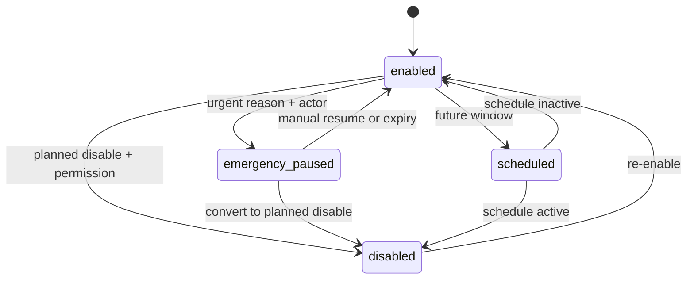
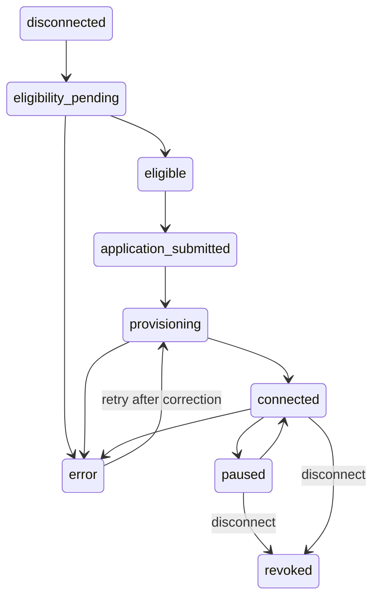

# KitLuy Partner PWA Portal — Rebuild Bible

**Filename:** `kitluy-partner-pwa-portal-rebuild-bible-v1.1.0.md`  
**Version:** v1.1.0  
**Date:** 2026-07-13  
**Product:** `kitluy-partner-pwa-portal` / `kitluy-partner-portal`  
**Owner:** HET / KitLuy Suite project owner  
**Audience:** Product owner, frontend engineers, backend engineers, QA, support, implementation operators, UI/UX, and AI handoff agents  
**Primary industry:** Laundry Industry  
**Status:** Canonical target-state rebuild bible with current implementation evidence and explicit required-value placeholders  
**Scope:** Full one-store web/PWA back office for one Laundry Partner owner/manager.  
**Naming rule:** Use **Partner**, not Seller. Any legacy `seller-portal` reference maps to `partner-portal`.  
**Business-facing object:** This PWA may use **Laundry Order** in dense tables and operational reports. `kitluy-partner-app` uses **Laundry Booking** and displays **Pressing** where the backend/portal status is `ironing`.  
**Build boundary:** The PWA owns deep configuration, complete data tables, exports, reconciliation, store-level controls, and Integration Hub. It does not replace the Partner App, POS Desktop, POS Mobile, Store Hub, Chain Portal, or Admin Portal.  
**Project boundary:** KitLuy-only and Laundry-first. No MVP dependency on SroulERP, Netra, Rotanak, Prajna, HSAL, HSA, Canvar, PlantOS, or another sibling/future system. Optional connectors are isolated behind Integration Hub contracts.  
**Infrastructure rule:** Supabase owns PostgreSQL/Auth/RLS/Edge Functions/Realtime/metadata. DigitalOcean owns app/service hosting, Spaces heavy-file storage, and the first AI inference layer. Supabase Storage is not the primary heavy-file layer.  
**Migration rule:** Engineering may write migrations; only an authorized backend/operator may apply production migrations. AI agents must never auto-apply production migrations.  
**Build philosophy:** Scaffold the complete MVP, Phase 1.5, and Phase 2 route/module map, while implementing in dependency order and failing closed where authoritative read models do not yet exist.

> **Mission:** This handbook must pass the **Rebuild Test**:  
> *If every person who built KitLuy Partner PWA Portal disappeared tomorrow, could a single engineer with zero prior context reconstruct the product, infrastructure, database expectations, UI, security model, and business logic from this document alone?*  
> **Required answer:** Yes, after every `[REQUIRED: ...]` deployment-specific value is supplied and the canonical migrations are present.

---

## Source Baseline Used for v1.1.0

1. `rebuild-bible-ai-template(4).md` — structural and rebuild-test requirements.
2. `kitluy-suite-ecosystem-rebuild-bible-v2.0.0.md` — ecosystem boundaries, Cambodia-first architecture, infrastructure ownership, AI/RAG/MCP rules.
3. `kitluy-admin-pwa-portal-rebuild-bible-v2.0.0.md` — HET-only Admin boundary, onboarding, support, device, connector, and audit ownership.
4. `kitluy-chain-portal-rebuild-bible-v2.0.0.md` — Chain/Partner catalog boundary and store-level service availability rules.
5. `kitluy-partner-pwa-portal-rebuild-bible-v1.0.0.md` — full one-store back-office baseline retained and reconciled here.
6. `kitluy-partner-app-rebuild-bible-v1.0.0.md` — mobile daily-operations boundary and web-versus-mobile responsibility split.
7. Current project decisions through 2026-07-13, including Partner naming, Laundry-first scope, Integration Hub sales-channel opt-in, one-store boundaries, KHR integer money, offline-first Store Hub authority, and provider-agnostic AI.

### Authority and Precedence

1. Live production SQL and applied migrations win for exact table names, types, constraints, and RLS.
2. This v1.1.0 bible wins for product scope, module boundaries, business behavior, UI intent, and target contracts unless a newer approved bible supersedes it.
3. Current accepted Partner read contracts are treated as implementation evidence: `partner_store_memberships`, `partner_orders_read`, `partner_customers_read`, `partner_services_read`, and `partner_service_addons_read`.
4. Finance, reconciliation, inventory, employee, Integration Hub, and AI modules must remain fail-closed until their authoritative read/write contracts exist. Demo or fallback values must never be presented as financial or operational truth.
5. Any unresolved deployment value is written as `[REQUIRED: ...]`; no engineer or AI should guess it.

---

## 0. Front Matter — Rebuild Sequence

### REBUILD SEQUENCE — KitLuy Partner PWA Portal v1.1.0

1. **Provision infrastructure**
   - Supabase project in Singapore / SGP1 region for PostgreSQL, Auth, Realtime, Edge Functions, RLS, audit/events, and pgvector if AI/RAG is enabled.
   - DigitalOcean SGP1 app/static hosting for Partner PWA frontend.
   - DigitalOcean Spaces for exports, receipt/invoice PDFs, issue photos, garment photos, inventory attachments, expense receipts, knowledge-base documents, and RAG source files.
   - DigitalOcean Inference Engine or provider-agnostic LLM endpoint for KitLuy AI Business Intelligence, if AI modules are enabled.
   - Required exact values: `[REQUIRED: production Supabase project ref]`, `[REQUIRED: DigitalOcean project name]`, `[REQUIRED: Spaces bucket names]`, `[REQUIRED: production domain]`.

2. **Apply database migrations in order**
   - `000_enable_extensions.sql`
   - `001_kitluy_core_schema.sql`
   - `002_kitluy_partner_schema.sql`
   - `003_kitluy_store_management_schema.sql`
   - `004_kitluy_laundry_vertical_schema.sql`
   - `005_kitluy_orders_payments_schema.sql`
   - `006_kitluy_devices_sync_schema.sql`
   - `007_kitluy_inventory_schema.sql`
   - `008_kitluy_employee_management_schema.sql`
   - `009_kitluy_finance_schema.sql`
   - `010_kitluy_reports_schema.sql`
   - `011_kitluy_files_schema.sql`
   - `012_kitluy_ai_schema.sql`
   - `013_kitluy_events_audit_schema.sql`
   - `014_kitluy_rls_policies.sql`
   - `015_kitluy_indexes.sql`
   - `016_kitluy_seed_baseline.sql`
   - `017_kitluy_store_service_availability_schema.sql`
   - `018_kitluy_integrations_schema.sql`
   - `019_kitluy_partner_read_contracts.sql`
   - `020_kitluy_partner_security_patches.sql`
   - `021_kitluy_partner_indexes.sql`
   - `022_kitluy_partner_seed_updates.sql`
   - The `017`–`022` names are the canonical logical order for this bible; replace them with exact live migration filenames after repository inspection without changing semantic order.
   - Production migrations are written by engineering and applied only by an authorized backend/operator. Do not auto-apply production migrations from AI tools.

3. **Seed baseline data**
   - Partner Portal membership roles: `partner_owner`, `store_manager`, `supervisor`, `accountant`, `readonly`.
   - POS/employee operational roles such as cashier and laundry staff remain employee/POS permission bundles and do not receive full Portal membership by default.
   - Laundry vertical enum and default statuses: `New`, `Received`, `Washing`, `Drying`, `Ironing`, `Ready`, `Picked Up`, `Cancelled`, `Issue/Rewash/Damaged`.
   - Default laundry service templates: Wash & Fold, Wash & Iron, Dry Clean, Press Only, Ironing, Stain Removal, Bedding/Blanket, Express Service.
   - Inventory categories, units, adjustment reasons, waste reasons, barcode namespace.
   - Finance settings defaults: KHR currency, payment method list, deposit/balance policies, refund/void reason codes, document numbering prefixes.
   - Employee permission seeds and POS permission cache seeds.
   - Report presets for daily sales, payments, orders, services, inventory, employee, and finance.
   - Store-level service availability reason codes: `machine_down`, `staff_shortage`, `supply_out`, `power_issue`, `water_issue`, `capacity_full`, `quality_issue`, `safety_issue`, `holiday_or_closure`, `other`.
   - Integration Hub connector registry and lifecycle states. Canvar Marketplace may be present as an optional sales-channel connector, disabled until eligibility and credentials are configured.

4. **Deploy API contracts / Edge Functions**
   - Core auth/session helpers.
   - Partner store profile and settings functions.
   - Store Management functions for services, pricing, order rules, templates, devices, notifications.
   - Inventory functions: item create/update, adjustment, count, history, usage deduction, suppliers, purchase orders, receipts, transfers, production, labels, import/export.
   - Employee functions: employee CRUD, roles, PIN reset/unlock/suspend, time-card adjustment, approvals, activity log, reports.
   - Finance functions: overview, export, refund request/approve, cash variance review, reconciliation run/complete, expenses, statements, settings.
   - Reports functions: overview, sales, orders, payments, shifts, services, customers, issues, consumables, exports, presets.
   - File service functions: signed upload, confirm upload, signed download, export file creation.
   - AI gateway functions if enabled: ask AI, report summary, reorder suggestion, staffing suggestion, finance insight.
   - Store service availability functions: enable, disable, emergency pause, resume, scheduled availability, effective-service read.
   - Integration Hub functions: eligibility, connect/apply, provision, pause, resume, disconnect, sync status, mapping, retry, and audit.
   - Current baseline read contracts that must remain available: `partner_store_memberships`, `partner_orders_read`, `partner_customers_read`, `partner_services_read`, `partner_service_addons_read`.
   - Finance truth endpoints must not be enabled until authoritative finance read models exist and are validated.

5. **Configure secrets and third-party credentials**
   - Supabase URL, anon key, service role key.
   - DigitalOcean Spaces access key/secret.
   - DigitalOcean Inference Engine key or chosen LLM provider key.
   - ABA PayWay / KHQR credentials when payment integration is activated.
   - Telegram/SMS/email provider tokens when notifications are activated.
   - Maps/geocoding key if delivery/service area maps are activated.
   - Canvar or other sales-channel connector credentials only inside server-side Integration Hub services; never expose raw values to the PWA.
   - Do not commit secrets. See Part 5, §5.4.

6. **Build / image local hardware or nodes**
   - Partner PWA Portal is cloud/web and does not run on store hardware.
   - Store Hub and POS devices are sibling builds but required for live store operation.
   - Image Raspberry Pi 5 Store Hub with local PostgreSQL, sync agent, Hub API, file queue, and device monitor.
   - Pair POS Desktop/Mobile, printers, scanners, scale, and optional conveyor/dispatch device. See Part 11.

7. **Pair / register clients to backend**
   - Register tenant and one laundry store.
   - Register Store Hub, POS terminals, POS mobile devices, printer/device records.
   - Create owner/manager users and employee records.
   - Create POS PINs and sync employee/permission cache to Store Hub.
   - Verify Hub heartbeat, POS sync, and Partner Portal sync freshness banners.

8. **Run QA validation scenarios**
   - Run Partner Portal route smoke tests.
   - Run Store Management configuration tests.
   - Run inventory movement-ledger, count, adjustment, usage deduction, PO/receipt, transfer, label tests.
   - Run employee PIN, time clock, role, permission, approval, offline sync tests.
   - Run finance calculation, refund, cash drawer, reconciliation, export, RBAC, stale sync tests.
   - Run report totals, export, masking, sync freshness tests.
   - See Part 15.

9. **Verify monitoring and alerting**
   - Edge function health.
   - Store Hub heartbeat.
   - POS terminal heartbeat.
   - Sync queue depth.
   - File upload failure rate.
   - Payment failure rate.
   - Export job queue.
   - AI gateway latency/cost/error rate.
   - Alert thresholds in Part 12.

10. **Go-live smoke test**
    - Create tenant -> create one Laundry store -> configure services/pricing -> set effective service availability -> configure order rules -> create employees/PINs -> sync Store Hub -> create POS Laundry Order -> collect cash/deposit -> print receipt/tag -> update status through production -> deduct inventory usage -> complete pickup -> close shift -> view Finance from authoritative read models -> run reconciliation -> export daily report -> verify Reports Overview -> verify audit log.
    - If a sales-channel connector is enabled, run a sandbox eligibility/provisioning/sync smoke test and verify the external channel receives only the approved projection.

---

## Part 1 — Glossary

### 1.1 Platform Terms

| Term | Definition |
|---|---|
| KitLuy | Cambodia-first commerce operating ecosystem for SMEs, starting with Laundry. |
| KitLuy Suite | The full suite: Admin Portal, Chain Portal, Partner Portal, Partner App, POS Desktop, POS Mobile, Store Hub, File Service, AI Gateway, MCP tools, RAG indexer, notification service. |
| Partner | A business/store owner using KitLuy. Replaces the retired term `Seller`. |
| Partner Portal | This product: the full web/PWA back office for exactly one active store context. Owns deep configuration, full tables, exports, reconciliation, Integration Hub, and one-store controls. |
| Partner App | Mobile daily-operations cockpit for one-store owners/managers. It consumes the same scoped backend but does not replace the PWA’s deep configuration, complete tables, exports, purchase orders, reconciliation, or Integration Hub. |
| Store | One physical business location. This bible covers one Laundry store context only. A user with multiple stores must use Chain Portal or explicitly switch into a separately authorized store context; no cross-store aggregate is exposed here. |
| Tenant | Backend business account using KitLuy. A tenant can own one or more stores, but this PWA resolves and enforces one active `store_id` per session/context. Business-facing text says Partner. |
| Store Hub | Local Raspberry Pi 5 server at the store. Runs local PostgreSQL, Hub API, sync agent, file queue, employee/PIN cache, and device monitor. |
| Offline-first | Store operations continue during WAN/internet failure. POS writes to Store Hub first; Hub syncs to cloud when WAN returns. |
| Sync freshness | UI indicator showing whether cloud data is fresh, pending, stale, offline, or unknown relative to Store Hub sync. Every operational and financial dashboard displays a data-as-of timestamp. |
| One-shot build | Product approach used for this version: scaffold and design MVP, Phase 1.5, and Phase 2 routes/modules from day one, while implementation follows dependency order and feature flags.
| PWA Offline Shell | Service worker/cache behavior that keeps static UI assets and approved last-successful read snapshots available. It does not grant offline mutation authority to the Portal.
| Current Read Contract | Approved store-scoped database view or endpoint used by the PWA. Current baseline views are `partner_store_memberships`, `partner_orders_read`, `partner_customers_read`, `partner_services_read`, and `partner_service_addons_read`.
| Fail-Closed Data State | UI state that shows unavailable/missing/stale truth instead of substituting demo values. Mandatory for Finance, inventory valuation, reconciliation, KHQR status, and other sensitive modules. |
| Rebuild Test | Standard requiring a single engineer with no prior context to reconstruct product, infrastructure, and business logic from this bible and referenced migrations. |

### 1.2 Product Terms

| Product | Definition |
|---|---|
| `kitluy-admin-portal` | HET/platform owner web app for tenants, subscriptions, billing, support, device registry, audit, and platform health. |
| `kitluy-chain-portal` | Multi-store brand/chain/franchise web app for branch performance, catalog push, compliance, and chain rollups. |
| `kitluy-partner-pwa-portal` | This product. A PWA web back office for one laundry store owner/manager. |
| `kitluy-partner-app` | Mobile daily-operations companion. It provides alerts, snapshots, approvals, Booking visibility, store health, and AI summaries; it does not duplicate the full PWA. |
| `kitluy-pos-desktop-app` | Fixed in-store POS terminal for staff. Handles order intake, payment, receipt/tag printing, shift, and offline store operation. |
| `kitluy-pos-mobile-app` | Mobile POS for roaming intake, pickup, scan/status, or line-busting. |
| `kitluy-hub-agent` | Store Hub service for local database, sync, device health, local APIs, and offline queue. |
| `kitluy-file-service` | Service for DigitalOcean Spaces upload/download, metadata, permissions, thumbnails, and export files. |
| `kitluy-ai-gateway` | KitLuy-native AI orchestration layer for RBAC, prompts, RAG, MCP/tool routing, audit, and model provider calls. |
| `kitluy-mcp-server` | Internal tool/action server used by AI for approved actions such as search orders, summarize sales, or draft reorder suggestion. |
| `kitluy-rag-indexer` | Worker that chunks/indexes documents and selected operational records for AI retrieval. |

### 1.3 Commerce and Laundry Terms

| Term | Definition |
|---|---|
| Laundry Order | Customer laundry job with services, price lines, due/pickup dates, status lifecycle, payment state, receipt, and tag records. |
| Service Catalog | Laundry service menu: per-kg, per-piece, flat, or add-on services. |
| Add-on | Special handling or extra service such as express, stain removal, fragrance, hanger, delicate handling. |
| Order Rules & Workflow | Store Management page defining order lifecycle, due-date rules, pickup policy, payment workflow, cancellation, issue/rewash/damaged rules, receipt/tag rules, inventory deduction triggers, and notification triggers. |
| Laundry Tag | Printed physical label/slip attached to a laundry order, bag, or garment for tracking. Distinct from inventory barcode labels. |
| Receipt | Customer proof of payment/order, printed or digital. |
| Due Date | Target completion or pickup date/time based on service rules. |
| Pickup | Handover of ready laundry to customer. May be blocked if balance is due depending on policy. |
| Rewash | Issue workflow where laundry is processed again, often with additional inventory usage and optional financial adjustment. |
| Damaged / Missing Item | Laundry exception requiring evidence, manager review, possible customer credit/refund/compensation. |
| Deposit | Partial payment collected at drop-off. Balance due remains on same order. |
| Pay at Pickup | Order is created unpaid or partially paid and settled when the customer returns. |
| Customer Tab | Pay-later balance, usually for B2B/hotel/spa/corporate customers. |
| B2B Account | Business customer with credit limit, settlement cycle, statements, and aging. |
| Cash Drawer | Register cash control: opening float, cash sales, cash refunds, cash in/out, counted cash, and variance. |
| Shift | POS operating period with cashier/staff, open/close times, cash float, expected cash, counted cash, and Z-report. |
| Z Report | End-of-shift/day printable financial summary. |

### 1.4 Inventory Terms

| Term | Definition |
|---|---|
| Inventory Management | Partner Portal module for shop-owned supplies, not customer garments. |
| Stock Item | Tracked supply item: detergent, softener, stain remover, bags, hangers, receipt roll, tag roll, barcode labels, chemicals, optional resale products. |
| Movement Ledger | Immutable row-per-stock-change truth. Stock level is current state; movement ledger is audit truth. |
| Stock Adjustment | Manual increase/decrease/set quantity with reason. |
| Inventory Count | Physical count session that snapshots expected quantity and posts variance movements. |
| Waste / Loss | Stock decrease due to spill, expired chemical, damaged packaging, staff mistake, machine cleaning, supplier defect, unknown variance, or other. |
| Purchase Order | Planned purchase request. Does not change stock until receipt is posted. |
| Stock Receipt | Received supplies. Posting creates purchase_received movement rows. |
| Transfer Order | Movement between stores. Partner Portal only sees current-store transfers; Chain Portal owns cross-store rollup. |
| Production / Mixing / Bundles | Creating produced inventory items from component inputs, e.g., stain mix or wash kit. |
| Usage Deduction | Inventory deduction triggered by laundry processing status, usually at Washing and optionally later statuses. |

### 1.5 Employee Terms

| Term | Definition |
|---|---|
| Employee Management | Dedicated module for one-store staff, roles, POS access, PIN, time clock, time cards, sales contribution, workload, approvals, and activity accountability. |
| POS PIN | 4–6 digit staff PIN used at POS and verified by Store Hub local cache. Raw PIN is never stored or logged. |
| Staff Session | POS login session for an employee/register/device. |
| Time Clock | Attendance clock-in/out record. Separate from POS Shift. |
| Time Card | Attendance row for review, approval, adjustment, and payroll-prep export. |
| Role | Permission bundle such as owner, manager, supervisor, accountant, cashier, laundry staff, readonly. |
| Permission Cache | Store Hub local cache of employees, roles, permissions, PIN hash/status, and version for offline POS enforcement. |
| Sensitive Action | Action requiring permission, reason, approval, or audit: refund, void, discount, tag reprint, time-card adjustment, PIN reset, role change, cash variance approval. |

### 1.6 Finance Terms

| Term | Definition |
|---|---|
| Finance Module | Top-level Partner Portal money-control workspace for one store. Not a POS and not an accounting general ledger. |
| Sales Ledger | Order-linked finance ledger showing gross, discounts, refunds, net, paid, balance, method, status, staff, receipt, and sync status. |
| Payment Ledger | Payment/tender ledger across cash, KHQR, ABA/manual, card/manual, deposit, balance, customer tab, refund, adjustment, payout. |
| Reconciliation | Daily checklist matching orders, payments, receipts, cash drawer, refunds, balances, gateway pending items, and sync state. |
| Refund / Void | Append-only financial correction requiring reason and audit. Paid order void routes through refund/adjustment. |
| Customer Balance | Amount owed by customer/B2B account, with aging and credit limit. |
| Payout | Settlement visibility for electronic payments when gateway/bank integration is enabled. |
| Expense | Simple store expense log for management/profit estimate; not formal ERP accounting. |
| Profitability | Operational estimate using net sales, supplies, expenses, payment fees, labor estimate. It is not formal P&L. |
| ERP / SroulERP Export Prep | Future daily summary/payment method/order detail export package. Not required for MVP operation. |

### 1.7 Reporting Terms

| Term | Definition |
|---|---|
| Reports Module | One-store business intelligence/report center. Separate from Finance because it includes operational and non-financial analysis. |
| Report Preset | Saved report filters for reuse. Does not grant additional permission. |
| Export Center | Report/finance/inventory/employee export workflow. Exports are audited and store scoped. |
| Sync Freshness Banner | Report header showing whether report data may be incomplete due to Hub/offline sync. |
| AI Summary | Future KitLuy-native plain-language summary of store data. |

### 1.8 Service Availability and Integration Terms

| Term | Definition |
|---|---|
| Store Service Availability | Store-owned operational state indicating whether a service can currently be sold or accepted. It is separate from whether the service exists in the catalog. |
| Emergency Service Pause | Immediate temporary disable action for machine failure, staff shortage, supply outage, utility issue, capacity overload, quality concern, safety concern, closure, or another recorded reason. |
| Effective Store Service | Final computed service state after combining catalog active state, Chain/HQ policy where applicable, store enabled state, emergency pause, effective dates, and schedule windows. POS and connected sales channels consume this projection. |
| Integration Hub | Partner Portal module where a one-store Partner discovers, applies for, connects, configures, monitors, pauses, and disconnects optional external services and sales channels. |
| Sales Channel | External customer-acquisition or transaction surface connected through Integration Hub, such as Canvar Marketplace or a future booking/ordering channel. |
| Canvar Marketplace | Optional future/current connector target. KitLuy remains the Partner operating system and source of truth; Canvar receives an approved marketplace projection and returns marketplace orders/events through contracts. It is not an MVP dependency. |
| Channel Projection | Deliberately limited public/operational dataset synchronized from KitLuy to a sales channel. It excludes tenant internals, subscription data, bank secrets, and unrelated store records. |
| Connector Lifecycle | `disconnected`, `eligibility_pending`, `eligible`, `application_submitted`, `provisioning`, `connected`, `paused`, `error`, `revoked`. |
| Credential Status | Partner-visible metadata such as missing/configured/expiring/expired/test_failed. Raw credentials remain server-side and are never rendered. |
| Channel Sync Job | Audited asynchronous unit that pushes or receives approved catalog, availability, booking/order, customer-message, or settlement signals. |

### 1.9 Hardware Terms

| Term | Definition |
|---|---|
| Raspberry Pi 5 Hub | Recommended local store hub hardware, minimum 8GB RAM, NVMe storage, active cooling, UPS. |
| POS Terminal | Device running POS Desktop, usually touchscreen plus receipt/tag printer, scanner, and scale. |
| T1 Intake / Cashier | Primary Laundry intake and handover terminal. Creates the Laundry Order, registers garments, bills the customer, collects deposit/full payment, and prints receipt/tags. |
| T2 Scan In | Logical mode on the shared conveyor terminal. Receives completed garments returning to the shop, verifies them, assigns conveyor positions, and marks them ready for pickup. |
| T3 Scan Out | Logical mode on the same physical conveyor terminal as T2. Retrieves garments for a customer, clears conveyor positions, and routes the handover to T1 for final confirmation, balance payment, and pickup. |
| Shared T2/T3 Terminal | One physical device with separate T2 and T3 modes, permissions, queues, layouts, and audit events. The modes must not be merged merely because the hardware is shared. |
| Receipt Printer | ESC/POS thermal printer used for customer receipts. |
| Tag Printer | Label printer for laundry tags; may use ESC/POS, TSPL, ZPL depending model. |
| USB Scale | Scale used for per-kg laundry pricing. Must support tare, stabilization, retry, and confidence state. |
| Barcode/QR Scanner | Scanner for order/tag lookup or inventory item scan. Keyboard wedge first; native HID later. |
| Conveyor Controller | Optional laundry dispatch/storage hardware controller; not required for MVP but interfaces should be ready. |
| UPS | Uninterruptible Power Supply recommended for Hub and core POS devices in Cambodia. |

### 1.10 External / Future Terms

| Term | Current Status |
|---|---|
| Supabase | Active cloud database/auth/realtime/edge-function backend. |
| DigitalOcean Spaces | Active file/export/document storage provider. |
| DigitalOcean Inference Engine | First LLM inference layer if AI is enabled; provider must remain swappable. |
| ABA PayWay / KHQR | Payment integration when activated. POS/backend capture payments; Partner Finance reads/reconciles. |
| Telegram/SMS/Email | Notification channels when activated. |
| SroulERP | Future ERP/back-office integration. Not MVP dependency. |
| Netra | Old external AI name; current stage converts AI into KitLuy-native AI or future integration. |
| Rotanak | Old external loyalty dependency; current stage uses KitLuy-native basic loyalty or future integration. |
| Prajna | Removed/future separate project, not KitLuy MVP dependency. |
| HSAL | Future/generic logistics connector; not active dependency. |
| Canvar | Optional sales-channel connector accessed through Integration Hub. It must never become a required dependency for core store operation. |


### 1.11 Feature-Index Terms

| Prefix | Meaning |
|---|---|
| `KPP-DASH-*` | Partner PWA dashboard and home. |
| `KPP-OPS-*` | Laundry Order, production, fulfillment, and capacity monitoring. |
| `KPP-CUST-*` | Customers, B2B, growth, and complaints. |
| `KPP-STORE-*` | Store profile, service catalog, pricing, order rules, templates, and availability. |
| `KPP-INV-*` | Inventory and supply control. |
| `KPP-EMP-*` | Employee, role, PIN, attendance, and approvals. |
| `KPP-FIN-*` | Operational finance and reconciliation. |
| `KPP-RPT-*` | Reports and exports. |
| `KPP-INT-*` | Integration Hub and sales channels. |
| `KPP-SYS-*` | Security, audit, support, knowledge, and settings. |
| `KPP-AI-*` | Partner-scoped AI summaries, insights, and explanations. |

---

## Part 2 — Business Overview

### 2.1 What it is

KitLuy Partner PWA Portal is the one-store operating back office for Cambodian laundry businesses. It is the owner/manager control panel that turns daily POS activity into manageable store operations: services, pricing, order monitoring, production flow, fulfillment, customers, B2B accounts, inventory supplies, employee access, time cards, finance, reports, AI summaries, settings, support, and future integrations.

In product terms: **Loyverse-style Back Office simplicity + KitLuy Laundry operational depth + Cambodia-first offline-aware commerce management.**

### 2.2 What it is not

It is not the POS. It does not replace counter order creation, cash/KHQR capture, receipt/tag printing at sale time, shift open/close on the register, or offline store write operations. Those belong to POS Desktop/Mobile and Store Hub.

It is not Admin Portal. It does not provision tenants, manage HET platform billing, control subscriptions across all customers, or operate device fleets platform-wide.

It is not Chain Portal. It does not own cross-store catalog push, branch comparisons, franchise royalties, or chain-wide compliance. It can prepare single-store data that Chain Portal reads later.

It is not formal ERP/accounting. Finance is operational store money control and export-prep. General ledger, payroll, procurement accounting, and tax filing belong to future ERP/SroulERP or accounting integration.

### 2.2.1 Non-Negotiable Scope Boundaries

- The Portal is **not a POS** and does not own walk-in intake, payment capture, receipt/tag printing, shift opening/closing, device drivers, or the authoritative offline write queue.
- The Portal is **not Chain Portal**. It cannot aggregate unrelated stores, push chain-wide policy, manage franchise contracts, or inspect another store merely because the same tenant owns it.
- The Portal is **not Admin Portal**. It cannot provision tenants, alter SaaS billing policy, view platform-wide fleet/support data, or bypass store RLS.
- The Portal is **not Partner App**. The App is the mobile daily-operations cockpit; the PWA remains the complete back-office and configuration authority.
- The Portal is **not a marketplace storefront**. It manages sales-channel opt-in through Integration Hub, while external channels own buyer-facing discovery and checkout.
- The Portal is **not a general ledger or payroll engine**. It provides operational finance, reconciliation, expense/profit estimates, and export preparation only.
- The Portal never stores heavy files directly in Supabase Storage as the primary file layer; it uses KitLuy File Service and DigitalOcean Spaces.

### 2.3 Verticals / Modules

| Vertical | Status | Partner Portal behavior |
|---|---|---|
| Laundry | Active Phase 1 and this bible’s scope | Full product. Services, order workflow, tag/receipt templates, production, pickup, inventory usage, employee accountability, finance, reports. |
| Café / Milk Tea | Future | Parked. Different order lifecycle, modifiers, recipes, queue/KDS. |
| Restaurant | Future | Parked. Tables, courses, split billing, kitchen workflow. |
| Retail | Future | Parked. SKU/barcode inventory, returns, shelf stock. |

Rule: a store belongs to one vertical. A laundry store cannot run café POS under the same store record.

### 2.4 Product / Build Inventory

| Build | Audience | Form factor | Scope |
|---|---|---|---|
| `kitluy-admin-portal` | HET/platform owner | Web | Platform-wide tenants, subscriptions, billing, support, devices, audit, platform health. |
| `kitluy-chain-portal` | Brand/chain/franchise owner | Web | Multi-store HQ, catalog push, branch reports, compliance, franchise/chain features. |
| `kitluy-partner-pwa-portal` | One-store owner/manager/accountant | Web/PWA | This build. One-store back office, store management, inventory, employee, finance, reports. |
| `kitluy-partner-app` | Owner/manager on phone | Mobile | Mobile companion for alerts, approvals, summaries, quick actions. |
| `kitluy-pos-desktop-app` | Store staff | Electron/desktop/Pi | Fixed register: orders, payment, receipt/tag printing, status updates, shift, offline operation. |
| `kitluy-pos-mobile-app` | Store staff | Mobile | Roaming POS/status/pickup helper; same order/payment logic as POS desktop. |
| `kitluy-hub-agent` | Store infrastructure | Raspberry Pi 5 service | Local DB, sync, LAN API, device monitor, employee/PIN cache, offline queue. |
| `kitluy-file-service` | Internal service | Cloud | File metadata, signed URLs, exports, documents, issue photos, attachments. |
| `kitluy-ai-gateway` | Internal service | Cloud | AI/RAG/MCP orchestration, permissions, prompt policy, audit. |
| `kitluy-notification-service` | Internal service | Cloud | Telegram/SMS/email/push/in-app notifications. |

### 2.5 Business Model

| Lever | Rule |
|---|---|
| Revenue model | SaaS subscription and optional add-ons. 0% order commission in current stage. |
| Commerce/single-store plan | `[REQUIRED: final monthly KHR price; previous working assumption used ៛30/store/month]` |
| Chain plan | `[REQUIRED: final HQ and per-store price; previous working assumption used ៛100 HQ + ៛50/store/month]` |
| Trial | `[REQUIRED: final trial days; previous documents used 14 days]` |
| Hardware | Store hardware sold, leased, or procured separately. `[REQUIRED: commercial hardware policy]` |
| AI | Basic AI summaries may be included; advanced AI recommendations may be add-on. `[REQUIRED: pricing decision]` |
| Storage | Heavy file/export/RAG storage may need plan limits. `[REQUIRED: storage policy]` |
| Payments | Cash required; KHQR/ABA activated per store/provider readiness. |

### 2.6 Moat / Defensibility

1. **Laundry-specific depth:** order tags, due dates, pickup rules, chain-of-custody, rewash/damage flows, supply usage deduction, B2B tabs, and cash/shift control.
2. **Cambodia-first UX:** KHR integer money, Khmer-ready text, KHQR readiness, phone formats, local workflows, offline sync awareness.
3. **Offline-first store architecture:** POS and Store Hub keep business operating during WAN outages; Partner Portal clearly labels freshness and pending sync.
4. **One-suite coverage:** store setup, customers, operations, inventory, employee, finance, reports, and future AI in one consistent system.
5. **Export/ERP readiness without ERP dependency:** the store can run today, while clean daily summaries and ledgers can feed SroulERP later.

### 2.7 Ecosystem Position

| Capability | Current owner | Partner Portal role |
|---|---|---|
| Store setup/services/pricing | KitLuy Partner | Owns write/config for one store. |
| POS order/payment capture | POS + Store Hub | Reads/monitors; does not capture counter payment directly. |
| Inventory supplies | KitLuy Partner | Owns one-store stock, movements, counts, suppliers, usage rules. |
| Employee access/time/activity | KitLuy Partner + POS/Hub | Configures employees/permissions/PINs; POS enforces and writes events. |
| Finance ledgers/reconciliation | KitLuy Partner Finance | Owns one-store money-control views, approvals, exports. |
| Reports | KitLuy Partner Reports | Owns one-store BI and exports. |
| AI BI | KitLuy AI Gateway | Partner consumes KitLuy-native AI summaries and recommendations. |
| File storage | DigitalOcean Spaces via File Service | Partner uploads/reads signed files through file service. |
| ERP/SroulERP | Future external/enterprise integration | Export prep only; no MVP dependency. |
| Loyalty/logistics/marketplace | Future/generic integrations | Optional later connectors; not MVP dependency. |

---

## Part 3 — System Architecture & Topology

### 3.1 Topology Diagram

```text
                                      WAN / INTERNET
┌─────────────────────────────────────────────────────────────────────────────┐
│                         CLOUD — SUPABASE + DIGITALOCEAN                    │
│                                                                             │
│  ┌────────────────────────┐       ┌─────────────────────────────────────┐  │
│  │ Partner PWA Portal     │──────▶│ Supabase SGP1                       │  │
│  │ DO App / static host   │ HTTPS │ - PostgreSQL                        │  │
│  │ Next.js + TypeScript    │ WSS   │ - Auth / RLS                        │  │
│  └────────────────────────┘       │ - Realtime                          │  │
│                                   │ - Edge Functions                    │  │
│  ┌────────────────────────┐       │ - Audit / Events                    │  │
│  │ Partner App            │──────▶│ - pgvector optional                 │  │
│  │ Daily-ops companion    │       └─────────────────────────────────────┘  │
│  └────────────────────────┘                                                 │
│                                                                             │
│  ┌────────────────────────┐       ┌─────────────────────────────────────┐  │
│  │ KitLuy File Service    │──────▶│ DigitalOcean Spaces                 │  │
│  │ signed URLs + metadata │       │ - documents                         │  │
│  └────────────────────────┘       │ - issue photos                      │  │
│                                   │ - garment photos                    │  │
│  ┌────────────────────────┐       │ - exports                           │  │
│  │ KitLuy AI Gateway      │──────▶│ - RAG source files                  │  │
│  │ RAG + MCP + audit      │       └─────────────────────────────────────┘  │
│  └───────────┬────────────┘                                                 │
│              │                                                              │
│  ┌───────────▼────────────┐       ┌─────────────────────────────────────┐  │
│  │ KitLuy MCP Server      │──────▶│ DigitalOcean Inference Engine       │  │
│  │ approved tools only    │       │ or provider-agnostic LLM endpoint   │  │
│  └────────────────────────┘       └─────────────────────────────────────┘  │
│                                                                             │
│  Optional integrations: ABA/KHQR, notifications, maps, ERP export           │
│  Integration Hub -> Canvar / future sales-channel projections                 │
└───────────────────────────────────────▲─────────────────────────────────────┘
                                        │ WAN sync / HTTPS / WSS
                                        ▼
┌─────────────────────────────────────────────────────────────────────────────┐
│                                STORE LAN                                    │
│                                                                             │
│ ┌─────────────────────────────────────────────────────────────────────────┐ │
│ │ Store Hub — Raspberry Pi 5 8GB + NVMe                                   │ │
│ │ - Local PostgreSQL                                                      │ │
│ │ - Hub API                                                               │ │
│ │ - Sync agent                                                            │ │
│ │ - Device monitor                                                        │ │
│ │ - Employee/PIN/permission cache                                         │ │
│ │ - Local file/upload queue                                               │ │
│ └──────────────┬───────────────────┬─────────────────────┬───────────────┘ │
│                │ LAN API           │ LAN API             │ LAN/USB         │
│ ┌──────────────▼──────────┐ ┌──────▼──────────────┐ ┌────▼──────────────┐ │
│ │ POS Desktop T1          │ │ POS Mobile          │ │ Devices           │ │
│ │ - order intake          │ │ - roaming intake    │ │ - receipt printer │ │
│ │ - payment               │ │ - scan/status       │ │ - tag printer     │ │
│ │ - receipt/tag printing  │ │ - pickup helper     │ │ - scanner/scale   │ │
│ │ - shift/time clock      │ │ - clock/status      │ │ - optional ctrl   │ │
│ └─────────────────────────┘ └─────────────────────┘ └───────────────────┘ │
└─────────────────────────────────────────────────────────────────────────────┘
```

LAN vs WAN rule: POS and Hub are LAN-local and continue working during WAN failure. Partner Portal is cloud/PWA and reads cloud state; it shows stale/pending/offline warnings when cloud is behind the store.

### 3.2 Data Flow Maps

#### Flow A — Configure service and order rules

1. Owner opens Partner Portal -> Store Management -> Services & Pricing or Order Rules & Workflow.
2. Browser sends authenticated request to Supabase/edge function.
3. Edge function validates role, tenant, store scope.
4. Function writes service/order-rule settings to cloud DB.
5. Domain event emitted: `store.service_updated` or `store.order_rules_updated`.
6. Hub downstream sync pulls new service/rule cache.
7. POS updates available services/rules on next sync.
8. Partner Portal displays “Synced to POS” or sync warning.

#### Flow B — POS laundry order -> Partner visibility

1. Cashier logs into POS using PIN; POS verifies through Store Hub local API.
2. Cashier creates laundry order, services, due date, customer, payment/deposit.
3. POS writes to Store Hub local PostgreSQL.
4. Store Hub writes outbox events: `order.created`, `payment.recorded`, `receipt.printed`, `tag.printed`.
5. Store Hub syncs events to Supabase when WAN is available.
6. Cloud tables/read models update.
7. Partner Portal Order Center, Finance, Reports, Customer profile, Employee Activity Log update through Realtime or refresh.
8. If WAN is down, Partner Portal shows last cloud state and sync freshness warning.

#### Flow C — Inventory usage deduction

1. Laundry staff updates order status to `Washing` on POS or production screen.
2. Store Hub checks order rules and inventory usage formulas.
3. Hub/edge function calculates usage deduction: e.g., detergent 40g/kg, softener 10ml/kg, bag 1/order.
4. Transaction locks stock level rows and writes immutable inventory movements with idempotency key.
5. Stock levels update; low-stock alerts recalculate.
6. Partner Inventory History, Overview, Consumables Report, and AI Reorder Suggestion inputs update after sync.

#### Flow D — Employee sensitive action approval

1. Cashier attempts action requiring approval, e.g., refund, void, high discount, tag reprint threshold.
2. POS checks permission through Store Hub.
3. If blocked, POS shows Manager Approval modal.
4. Manager enters PIN; Hub verifies permission cache.
5. POS requires reason code.
6. Action proceeds and append-only audit/finance/event rows are created locally.
7. Hub syncs to cloud.
8. Partner Employee Activity Log, Finance Refunds & Voids, and Reports update.

#### Flow E — Finance reconciliation

1. Owner opens Finance -> Reconciliation.
2. Edge function `partner-finance-reconciliation-run` calculates checklist: orders have payments/balance states, payments have receipts, shifts closed, cash variances reviewed, refunds reviewed, pending sync clear.
3. UI displays pass/warning/failed/pending sync states.
4. Owner resolves issues or acknowledges allowed warnings.
5. Edge function `partner-finance-reconciliation-complete` writes reconciliation run snapshot and audit event.
6. Export Center can create daily finance summary with data-as-of timestamp.

#### Flow F — File upload / evidence

1. Staff or manager attaches garment damage photo, expense receipt, invoice PDF, or document.
2. App requests signed upload URL from File Service.
3. File Service validates auth, scope, type, and creates pending metadata.
4. Client uploads directly to DigitalOcean Spaces.
5. Client confirms upload; File Service marks asset active and links to order/issue/expense/document.
6. Audit event records upload.


#### Flow G — Store Service Availability / Emergency Pause

1. Partner owner or store manager opens Store Management -> Service Availability.
2. Portal reads effective service state and policy locks for the active store only.
3. User disables, schedules, or emergency-pauses a service and supplies a reason; emergency pause may include `resume_at`.
4. Edge function verifies role, store scope, Chain/HQ lock, reason, and optimistic version.
5. Function writes an append-only availability override and recomputes the effective-service projection.
6. Domain event `store_service_emergency_paused`, `store_service_disabled`, or `store_service_reenabled` is emitted.
7. Store Hub pulls the new effective-service projection; POS hides or blocks the service.
8. Connected sales channels receive the same availability projection through an asynchronous Integration Hub sync job.
9. Portal shows cloud save status and downstream sync freshness separately; a saved cloud override is not labeled “applied at POS/channel” until acknowledgement arrives.

#### Flow H — Integration Hub / Canvar Sales-Channel Connection

1. Partner opens System -> Integration Hub -> Sales Channels -> Canvar Marketplace.
2. Portal requests an eligibility assessment for the active store.
3. Server validates profile completeness, vertical support, catalog readiness, service availability, refund/support policy, contact details, permission, consent, and connector configuration.
4. Partner reviews the exact data projection and explicitly submits connection/apply consent.
5. Integration service creates a connection record and provisions the external shop/profile using server-side credentials; the Partner does not re-enter duplicate business identity data.
6. Mapping rows bind KitLuy services/catalog records to external listing identifiers.
7. Initial sync job pushes approved public profile, catalog, availability, payment eligibility, refund/support summary, and media references.
8. External channel returns provisioning/listing results and later order/event webhooks with idempotency signatures.
9. Portal displays connection state, last successful sync, failed items, retry controls, and disconnect/pause controls.
10. Core POS/Partner operations remain available even when the connector or external channel is down.

### 3.3 Offline-First Protocol

| Rule | Policy |
|---|---|
| Write path | POS and Store Hub own local operational writes. Partner Portal critical mutations are cloud-only. |
| Capture | POS writes local DB row and outbox event with idempotency key. |
| Batch | Hub groups outbox events into sync batches. Recommended batch size: 50 events. |
| Idempotency key format | `{device_id}:{local_counter}:{timestamp_ms}` for POS/Hub events; `{client_id}:{uuid}` for portal submit attempts. |
| Upstream sync | Hub pushes to Supabase edge functions / sync endpoint. |
| Downstream sync | Hub pulls service catalog, order rules, employees, roles, PIN cache, settings, inventory formulas. |
| Financial data | Append-only. Corrections create new rows/events, not silent edits. |
| Operational data | Last-write-wins only for safe non-financial settings, with audit. |
| Counts and stale data | If inventory/employee/finance count/report starts while offline events are pending, show stale warning. |
| Partner Portal offline | Cache the app shell and optionally the last successful read snapshot with age/source labels. Do not permit financial, catalog, employee, availability, connector, or other business mutations offline in MVP. Never show blank screens when a safe cached snapshot exists; never label it current. |

Conflict classes:

| Data class | Conflict policy |
|---|---|
| Orders/payments/refunds/receipts | Append-only; first financial record remains, corrections reference original. |
| Inventory movements | Immutable movement ledger; reverse/correction movement required. |
| Employee time-card adjustments | Append-only adjustment record with old/new values. |
| Store settings/rules | Versioned update; newer version wins; audit event retained. |
| Duplicate idempotency key same payload | Return original result. |
| Duplicate idempotency key different payload | Reject conflict and require manual review. |

### 3.4 Hardware Placement per Laundry Store

| Component | Placement | Spec / rule |
|---|---|---|
| Partner PWA Portal | Owner/manager browser | Cloud/PWA, no local hardware. |
| Store Hub | Store LAN | Raspberry Pi 5 8GB + NVMe 128/256GB+, active cooling, UPS. |
| T1 POS Desktop | Intake/cashier counter | Creates Laundry Orders, registers garments, bills, collects deposit/full payment, prints receipt/tags, and completes final pickup confirmation. |
| Shared T2/T3 POS Desktop | Conveyor/return station | Same physical terminal with separate T2 Scan In and T3 Scan Out logical modes, permissions, queues, layouts, and audit. |
| POS Mobile | Staff phones/tablets | Roaming order/status/pickup helper. |
| Receipt printer | Counter | ESC/POS thermal printer. |
| Tag printer | Counter/production | Label printer, TSPL/ZPL/ESC-POS depending model. |
| Scale | Intake counter | USB scale for per-kg pricing. |
| Scanner | Counter/production/pickup | Keyboard wedge first-phase. |
| Conveyor/controller integration | Return/pickup area | Optional controller hardware; logical T2/T3 conveyor workflows remain supported even when assignment is manual. |

Cambodia climate rule: Hub and POS devices need ventilated enclosure, copper heatsink/active fan, and UPS/surge protection.

### 3.5 Environment Promotion

| Stage | Purpose | Frontend | Backend | Data |
|---|---|---|---|---|
| Dev | Local development | Next.js dev server in pnpm/Turbo workspace | Supabase local/branch | Seeded mock/demo data; truth-sensitive modules clearly flagged |
| Staging | Pre-prod QA | DigitalOcean staging app | Staging Supabase | Full QA seed store |
| Prod | Live | DigitalOcean SGP1 / CDN | Production Supabase | Real tenant/store data |

Promotion rules:

1. Migrations move Dev -> Staging -> Prod by authorized operator.
2. Secrets are injected via environment or managed secret store; never committed.
3. Frontend builds are immutable artifacts with version labels.
4. Edge functions are versioned and deployed after migrations.
5. Seed scripts must be idempotent.
6. Production deploy requires QA checklist in Part 15 and go-live checklist in Part 16.

---

## Part 4 — External Contracts & Integrations

### 4.1 Supabase Auth / Database / Realtime

#### 4.1.1 Purpose

Supabase provides Auth, PostgreSQL, RLS, Edge Functions, Realtime, and optional pgvector. Partner Portal uses Supabase for all authenticated cloud reads/writes.

#### 4.1.2 Authentication

- Portal users authenticate via Supabase Auth. Preferred primary login: phone OTP or email/OTP based on final product decision.
- JWT is sent as `Authorization: Bearer <token>`.
- Edge functions verify JWT and store membership.
- Service role key is only used server-side.

#### 4.1.3 Request / Response Contracts

Common authenticated request headers:

```http
Authorization: Bearer <jwt>
Content-Type: application/json
Idempotency-Key: <optional-for-mutations>
X-Kitluy-Store-Id: <store_uuid>
```

Common response envelope:

```json
{
  "ok": true,
  "data": {},
  "meta": {
    "request_id": "uuid",
    "generated_at": "2026-07-03T10:00:00+07:00",
    "sync_freshness": {
      "sync_state": "fresh",
      "last_successful_sync_at": "2026-07-03T09:59:00+07:00",
      "pending_outbox_events": 0
    }
  }
}
```

Error envelope:

```json
{
  "ok": false,
  "error": {
    "code": "PERMISSION_DENIED",
    "message": "You do not have permission for this action.",
    "details": {}
  }
}
```

#### 4.1.4 Error Handling & Retry

- GET/read failures: retry 3 times with backoff 1s, 2s, 4s.
- Mutations: require idempotency key; retry only if network failure before response.
- Realtime disconnect: show stale indicator and fall back to polling every 30–60s.
- 401/403: redirect/login or restricted state.

#### 4.1.5 Webhook Events

Supabase edge functions may receive payment gateway callbacks or file confirmations. All inbound webhooks must verify signatures or shared secrets and enforce idempotency.

#### 4.1.6 Sandbox vs Production

- Dev/staging use separate Supabase project or branch.
- Production uses `[REQUIRED: production project ref]`.
- Service role keys differ per environment.

### 4.2 DigitalOcean Spaces / File Service

#### 4.2.1 Purpose

Stores uploads and generated files: garment photos, issue evidence, expense receipts, receipt/invoice PDFs, export CSV/PDF, knowledge-base docs, RAG source files.

#### 4.2.2 Authentication

- Client never receives Spaces permanent keys.
- Client requests signed upload/download from `kitluy-file-service`.
- File Service uses Spaces access key/secret server-side.

#### 4.2.3 Request / Response Contracts

Request signed upload:

```json
{
  "store_id": "uuid",
  "asset_type": "issue_photo",
  "entity_type": "laundry_issue",
  "entity_id": "uuid",
  "filename": "shirt-damage.jpg",
  "content_type": "image/jpeg",
  "size_bytes": 245000
}
```

Response:

```json
{
  "asset_id": "uuid",
  "upload_url": "signed-url",
  "expires_at": "2026-07-03T10:10:00+07:00",
  "storage_path": "private/assets/tenant/store/2026/07/asset-id.jpg"
}
```

Confirm upload:

```json
{
  "asset_id": "uuid",
  "etag": "string",
  "size_bytes": 245000
}
```

#### 4.2.4 Error Handling & Retry

- Signed upload URL expiry: default 10 minutes.
- Upload failure: client retries once; if still fails, asset remains `pending` and can be cleaned by job.
- File metadata is authoritative in DB; object without active metadata is not displayed.

#### 4.2.5 Webhook Events

No required inbound webhook for MVP. Optional object storage event later for thumbnail generation.

#### 4.2.6 Sandbox vs Production

Use separate buckets or prefixes per environment: `dev/`, `staging/`, `prod/`.

### 4.3 ABA PayWay / KHQR

#### 4.3.1 Purpose

Payment provider for KHQR/card/ABA integrations when activated. POS/backend initiates and captures payments. Partner Finance reads, reconciles, and displays payment state.

#### 4.3.2 Authentication

- Provider credentials stored in edge-function secrets.
- Browser never calls PayWay directly.
- Webhook/callback endpoint verifies provider signature per final ABA contract.

#### 4.3.3 Request / Response Contracts

Exact provider request/response must be finalized during integration. Logical payment record consumed by Partner Finance:

```json
{
  "payment_id": "uuid",
  "order_id": "uuid",
  "payment_method": "khqr",
  "provider": "aba_payway",
  "provider_reference": "ABA-REF-123",
  "amount_khr": 125000,
  "status": "captured",
  "paid_at": "2026-07-03T10:00:00+07:00",
  "received_by_staff_id": "uuid"
}
```

#### 4.3.4 Error Handling & Retry

- Payment creation timeout: POS shows retry/fallback to cash.
- Webhook duplicate: idempotent by provider reference.
- Pending status longer than threshold: Finance alert `gateway_payment_pending`.
- Failed gateway: does not mark order paid.

#### 4.3.5 Webhook Events

Inbound payment statuses: `payment_succeeded`, `payment_failed`, `payment_cancelled`, `payment_refunded` or provider equivalents. Store raw payload in audit/log table for support.

#### 4.3.6 Sandbox vs Production

Sandbox credentials and test QR flows differ. `[REQUIRED: final ABA sandbox URLs and test behavior]`.

### 4.4 Messaging: Telegram / SMS / Email / Push

#### 4.4.1 Purpose

Notifications for order received, ready for pickup, late pickup, payment reminder, issue/damaged notice, promo campaign, B2B statement reminder, staff/internal alerts.

#### 4.4.2 Authentication

- Provider tokens stored server-side.
- Notification Service sends messages; browser requests templated sends.

#### 4.4.3 Request / Response Contracts

Send notification request:

```json
{
  "store_id": "uuid",
  "template_key": "order_ready",
  "channel": "telegram",
  "recipient": "+85512345678",
  "entity_type": "order",
  "entity_id": "uuid",
  "variables": {
    "customer_name": "Sophea",
    "order_number": "L-1042",
    "balance_due_khr": 45000
  }
}
```

Response:

```json
{
  "notification_id": "uuid",
  "status": "queued"
}
```

#### 4.4.4 Error Handling & Retry

- Retry transient provider failures 3 times with exponential backoff.
- Permanent failure writes `notification_failed` with reason.
- Failed notification appears in Messages / Attention Required.

#### 4.4.5 Webhook Events

Optional delivery receipts: `delivered`, `failed`, `read` if provider supports.

#### 4.4.6 Sandbox vs Production

Staging must route to test numbers or disable external send by default.

### 4.5 KitLuy AI Gateway

#### 4.5.1 Purpose

AI summaries and recommendations: daily store summary, finance anomalies, inventory reorder suggestions, staffing suggestions, report explanations, customer win-back prompts.

#### 4.5.2 Authentication

- Partner Portal calls AI Gateway with JWT.
- AI Gateway verifies role/store scope and prompt policy.
- Model provider keys stay server-side.

#### 4.5.3 Request / Response Contracts

Ask AI:

```json
{
  "store_id": "uuid",
  "surface": "finance_ai_assistant",
  "question": "Why is cash variance negative today?",
  "date_range": { "date_from": "2026-07-03", "date_to": "2026-07-03" }
}
```

Response:

```json
{
  "answer": "Cash variance is -៛10,000. The main contributors are one cash refund and one cash-out entry. Review shift SH-20260703-01.",
  "confidence": "medium",
  "sources": [
    { "type": "finance_shift", "id": "uuid" },
    { "type": "cash_movement", "id": "uuid" }
  ],
  "suggested_actions": ["Open shift detail", "Run reconciliation"]
}
```

#### 4.5.4 Error Handling & Retry

- AI failure never blocks operations.
- Timeout target: `[REQUIRED: final AI timeout; suggested 20s]`.
- On failure show “AI summary unavailable; operational data remains available.”

#### 4.5.5 Webhook Events

None for MVP.

#### 4.5.6 Sandbox vs Production

Dev may use mock AI responses. Production must log cost, latency, model, prompt policy, tool calls.

### 4.6 Maps / Geocoding

Optional for future service areas, pickup/delivery, B2B accounts.

- Purpose: store location, service area, delivery/pickup map.
- MVP status: optional/not required.
- Integration contract: `[REQUIRED: provider decision]`.

### 4.7 Partner Integration Hub / Sales-Channel Connectors

#### 4.7.1 Purpose

Integration Hub lets the one-store Partner connect optional services without creating and maintaining duplicate merchant accounts manually. The first strategic sales-channel pattern is Canvar Marketplace; every future connector must reuse the same eligibility, consent, projection, lifecycle, mapping, sync, webhook, audit, and disconnect controls.

#### 4.7.2 Authentication

- Partner requests use Supabase JWT and require `integrations.view` or `integrations.manage` for the active store.
- Connector provider credentials are server-side only, encrypted or stored in the managed secret layer.
- Outbound requests use provider API key, OAuth client credential, or signed service token according to the connector adapter.
- Inbound webhooks require signature verification, timestamp tolerance of `[REQUIRED: final seconds]`, event-id idempotency, and replay protection.
- The PWA receives credential status and connection metadata only; it never receives raw secrets or refresh tokens.

#### 4.7.3 Eligibility Request / Response

`POST /partner-integrations/{connector_key}/eligibility`

```json
{
  "store_id": "uuid",
  "requested_capabilities": ["public_profile", "catalog", "availability", "orders", "messages"]
}
```

```json
{
  "connector_key": "canvar_marketplace",
  "eligible": false,
  "connection_state": "eligibility_pending",
  "checks": [
    {"key": "business_profile_complete", "status": "pass"},
    {"key": "catalog_ready", "status": "pass"},
    {"key": "refund_policy_present", "status": "fail", "action_route": "/store-management/policies"}
  ],
  "projection_fields": ["store_name", "logo", "location_label", "services", "availability", "refund_summary", "support_contact"]
}
```

#### 4.7.4 Connect / Pause / Disconnect Contracts

`POST /partner-integrations/{connector_key}/connect`

```json
{
  "store_id": "uuid",
  "consent_version": "2026-07-13",
  "accepted_projection_fields": ["public_profile", "catalog", "availability", "orders"],
  "idempotency_key": "portal-client-id:uuid"
}
```

Success returns `202` with `connection_id`, `state=provisioning`, and `status_url`. Replay with the same idempotency key and payload returns the original result. Same key with a different payload returns `409 IDEMPOTENCY_CONFLICT`.

`POST /partner-integrations/{connector_key}/pause` requires a reason and prevents new outbound listing/order acceptance according to connector capability while preserving audit/history.

`POST /partner-integrations/{connector_key}/disconnect` requires explicit owner confirmation, reason, and a provider-specific consequence preview. Disconnect never deletes KitLuy store data.

#### 4.7.5 Projection Boundary

Allowed projection classes:

```text
Public store identity: display name, logo, public location label, public contact route
Verification: approved status/tier supplied by KitLuy/Admin policy
Catalog: channel-approved services/items, public descriptions, media references, price/availability
Policy: refund/issue summary, COD/KHQR eligibility, support route
Operational: external-order acknowledgement and fulfillment status required by the connector
```

Never project:

```text
tenant_id or internal membership details
subscription/billing state
bank credentials or KHQR setup secrets
internal employee/PIN data
cash drawer, finance reconciliation, margin, expense, or payroll data
unrelated customer records or another store's data
internal audit/support notes
AI prompts, embeddings, or private documents
```

#### 4.7.6 Error Handling & Retry

| Failure | Behavior |
|---|---|
| Provider timeout | 10-second request timeout; retry async with exponential backoff and jitter. |
| 429 / provider throttling | Respect `Retry-After`; connector circuit opens after `[REQUIRED: threshold]`. |
| 4xx validation error | Mark item failed, show actionable field-level issue, no blind retry. |
| 401/403 credential error | Mark credential status `test_failed` or `expired`; disable automated retries until operator action. |
| Duplicate webhook | Return 200 with prior result; do not duplicate order/event. |
| Partial catalog sync | Preserve successful mappings, record failed items, allow scoped retry. |
| External outage | Core KitLuy operations continue; queue bounded retries and alert after threshold. |

#### 4.7.7 Sandbox vs Production

- Each connector has separate sandbox and production configuration, credentials, endpoints, webhook secrets, connection records, and external identifiers.
- Sandbox never sends production customer data or creates production-visible listings.
- Production activation requires Admin connector readiness plus Partner consent and a successful sandbox/test connection when the provider supports it.

### 4.8 Future ERP / SroulERP Export

#### 4.8.1 Purpose

Future export/sync of daily finance summaries, payment method summaries, order-level details, customer tabs, expenses, and corrections.

#### 4.8.2 Authentication

MVP: manual CSV/PDF export. Future: API token/OAuth connector.

#### 4.8.3 Posting Package Contract

```json
{
  "posting_package_id": "uuid",
  "source_system": "kitluy-partner-finance",
  "tenant_id": "uuid",
  "store_id": "uuid",
  "business_date": "2026-07-03",
  "currency": "KHR",
  "posting_level": "daily_summary",
  "idempotency_key": "store_uuid_2026-07-03_daily_summary_v1",
  "totals": {
    "gross_sales_khr": 1250000,
    "discounts_khr": 40000,
    "refunds_khr": 30000,
    "net_sales_khr": 1180000,
    "cash_collected_khr": 600000,
    "electronic_collected_khr": 440000,
    "customer_tab_increase_khr": 140000,
    "expenses_khr": 120000,
    "cash_variance_khr": -10000
  },
  "payment_breakdown": [
    { "method": "cash", "amount_khr": 600000 },
    { "method": "khqr", "amount_khr": 350000 },
    { "method": "aba", "amount_khr": 90000 }
  ],
  "metadata": {
    "generated_at": "2026-07-03T23:10:00+07:00",
    "data_as_of": "2026-07-03T23:08:00+07:00",
    "reconciliation_id": "uuid",
    "generated_by": "uuid"
  }
}
```

#### 4.8.4 Error Handling & Retry

Future connector must be idempotent. Same idempotency key returns existing package or updates status, never duplicates posting.

#### 4.8.5 Webhook Events

Future statuses: `exported`, `imported`, `posted`, `failed`.

#### 4.8.6 Sandbox vs Production

Not MVP. Use file export in first release.

---

## Part 5 — Tech Stack & Repository Structure

### 5.1 Stack by Layer

| Layer | Stack | Notes |
|---|---|---|
| Frontend | Next.js PWA + React + strict TypeScript + utility CSS/design-system package; exact versions pinned in `pnpm-lock.yaml` | Full one-store back office, role-based routes, server/client boundaries, PWA shell. |
| State/data | Supabase JS, TanStack Query or equivalent | Cache server data; show sync freshness. |
| Backend | Supabase Edge Functions (Deno) plus optional Node services on DigitalOcean | Mutations, exports, AI, file service. |
| Database | PostgreSQL 17+ on Supabase | RLS, schemas, views, materialized views. |
| Realtime | Supabase Realtime | Order updates, sync status, dashboard refresh. |
| File storage | DigitalOcean Spaces | Attachments, documents, exports. |
| AI | KitLuy AI Gateway + provider-agnostic LLM endpoint | Optional but scaffolded. |
| Store Hub | Raspberry Pi OS Lite 64-bit, PostgreSQL local, Node/Go/Rust sync agent `[REQUIRED: final runtime]` | Offline-first POS write layer. |
| POS | Electron/React for desktop, React Native/Expo for mobile `[REQUIRED: final stack confirmation]` | Sibling products. |
| Hosting | DigitalOcean App Platform SGP1; CDN/static assets as appropriate | Next.js/PWA hosting. |
| CI/CD | `[REQUIRED: GitHub Actions / DO pipeline decision]` | Build/test/deploy. |

### 5.2 Repository Layout

```text
kitluy-suite/
├─ apps/
│  ├─ kitluy-partner-pwa-portal/
│  │  ├─ src/
│  │  │  ├─ app/
│  │  │  ├─ layouts/
│  │  │  ├─ navigation/
│  │  │  ├─ modules/
│  │  │  ├─ shared/
│  │  │  ├─ services/
│  │  │  ├─ styles/
│  │  │  └─ tests/
│  │  ├─ public/
│  │  ├─ package.json
│  │  ├─ next.config.ts
│  │  └─ middleware.ts
│  ├─ kitluy-partner-app/
│  ├─ kitluy-pos-desktop-app/
│  ├─ kitluy-pos-mobile-app/
│  ├─ kitluy-admin-portal/
│  └─ kitluy-chain-portal/
├─ services/
│  ├─ kitluy-file-service/
│  ├─ kitluy-ai-gateway/
│  ├─ kitluy-mcp-server/
│  ├─ kitluy-rag-indexer/
│  └─ kitluy-notification-service/
├─ supabase/
│  ├─ migrations/
│  ├─ functions/
│  └─ seed/
├─ packages/
│  ├─ shared-ui/
│  ├─ shared-types/
│  ├─ money-formatting/
│  ├─ rbac/
│  └─ printer-driver/
├─ infra/
│  ├─ digitalocean/
│  ├─ supabase/
│  └─ monitoring/
└─ docs/
   ├─ rebuild-bibles/
   ├─ module-specs/
   └─ qa/
```

### 5.2.1 Partner PWA Module Tree

```text
src/modules/
├─ dashboard/
├─ ai-insights/
├─ messages/
├─ operations/
│  ├─ order-center/
│  ├─ production/
│  ├─ fulfillment/
│  └─ capacity/
├─ customers-growth/
│  ├─ customers/
│  ├─ b2b-accounts/
│  ├─ marketing/
│  ├─ loyalty/
│  ├─ subscriptions/
│  └─ complaints-reviews/
├─ store-management/
│  ├─ services-pricing/
│  ├─ service-availability/
│  ├─ add-ons-special-handling/
│  ├─ order-rules-workflow/
│  ├─ store-profile/
│  ├─ business-hours/
│  ├─ receipt-templates/
│  ├─ laundry-tag-templates/
│  ├─ payment-methods/
│  ├─ pos-devices-registers/
│  ├─ notifications/
│  ├─ language-currency/
│  └─ data-import-export/
├─ inventory-management/
│  ├─ overview/
│  ├─ stock-items/
│  ├─ purchase-orders/
│  ├─ stock-receipts/
│  ├─ transfer-orders/
│  ├─ stock-adjustments/
│  ├─ inventory-counts/
│  ├─ production-mixing-bundles/
│  ├─ inventory-history/
│  ├─ inventory-valuation/
│  ├─ label-printing/
│  ├─ waste-loss/
│  ├─ suppliers/
│  ├─ import-export/
│  ├─ ai-reorder-suggestions/
│  ├─ approval-workflow/
│  └─ settings/
├─ employee-management/
│  ├─ overview/
│  ├─ employees/
│  ├─ roles-access/
│  ├─ pos-pin-access/
│  ├─ time-clock/
│  ├─ time-cards/
│  ├─ shifts/
│  ├─ sales-by-employee/
│  ├─ workload-by-hour/
│  ├─ attendance/
│  ├─ approvals/
│  ├─ activity-log/
│  ├─ scheduling/
│  ├─ payroll-export/
│  ├─ labor-cost/
│  ├─ overtime-rules/
│  ├─ incentives/
│  ├─ training-checklist/
│  └─ ai-staffing-recommendation/
├─ finance/
│  ├─ overview/
│  ├─ sales-ledger/
│  ├─ payment-ledger/
│  ├─ cash-drawer/
│  ├─ shift-finance/
│  ├─ reconciliation/
│  ├─ refunds-voids/
│  ├─ deposits-balances/
│  ├─ customer-tabs/
│  ├─ b2b-statements/
│  ├─ payouts/
│  ├─ documents/
│  ├─ taxes-fees/
│  ├─ expenses/
│  ├─ profitability/
│  ├─ export-center/
│  ├─ finance-alerts/
│  ├─ ai-finance-assistant/
│  ├─ erp-export-prep/
│  └─ settings/
├─ reports/
└─ system/
   ├─ integration-hub/
   │  ├─ overview/
   │  ├─ sales-channels/
   │  ├─ canvar-marketplace/
   │  ├─ connection-detail/
   │  ├─ mappings/
   │  ├─ sync-jobs/
   │  └─ connector-audit/
   ├─ knowledge-base/
   ├─ security/
   ├─ audit-log/
   ├─ support/
   └─ settings/
```

### 5.3 Build & Deploy Pipeline

Frontend:

```bash
cd "Y:/HET_GOOGLE_DRIVE/001_Business_Folder/002_Hello Evolution Technology Co,. Ltd/00X_Project Folder/KITLUY_SUITE_PROJECT/KITLUY-SUITE-REPO (MAIN)"
pnpm install --frozen-lockfile
pnpm --filter kitluy-partner-pwa-portal typecheck
pnpm --filter kitluy-partner-pwa-portal lint
pnpm --filter kitluy-partner-pwa-portal test
pnpm --filter kitluy-partner-pwa-portal build
```

Deploy:

1. Build the versioned Next.js PWA artifact. Use server deployment by default; use static export only if the live route/data model supports it and the repo explicitly configures it.
2. Deploy to DigitalOcean App Platform in SGP1 or the approved equivalent.
3. Set public env vars: `NEXT_PUBLIC_SUPABASE_URL`, `NEXT_PUBLIC_SUPABASE_ANON_KEY`, `NEXT_PUBLIC_APP_ENV`, `NEXT_PUBLIC_APP_VERSION`. Server-only secrets must not use the `NEXT_PUBLIC_` prefix.
4. Verify service worker/manifest.
5. Smoke test `/dashboard`, `/orders`, `/inventory`, `/employee-management`, `/finance`, `/reports`.

Edge functions:

```bash
supabase functions deploy <function-name> --project-ref [REQUIRED]
supabase secrets set KEY=value --project-ref [REQUIRED]
```

Migrations:

```bash
supabase db push --project-ref [REQUIRED]
```

### 5.4 Secrets Inventory

| Secret | Purpose | Consumed by | Rotation |
|---|---|---|---|
| `SUPABASE_URL` | Supabase endpoint | Frontend/services | On project migration |
| `SUPABASE_ANON_KEY` | Public client key | Frontend | On compromise/project policy |
| `SUPABASE_SERVICE_ROLE_KEY` | Server-side privileged operations | Edge functions/services only | 90 days or on staff change |
| `DO_SPACES_KEY` | Object storage access | File Service | 90 days |
| `DO_SPACES_SECRET` | Object storage secret | File Service | 90 days |
| `DO_SPACES_BUCKET_PRIVATE` | Private assets bucket | File Service | On bucket change |
| `DO_INFERENCE_API_KEY` | AI inference | AI Gateway | 90 days |
| `ABA_PAYWAY_API_KEY` | Payment gateway | Payment edge functions | Per ABA policy |
| `ABA_PAYWAY_SECRET` | Payment signature/secret | Payment edge functions | Per ABA policy |
| `TELEGRAM_BOT_TOKEN` | Telegram notifications | Notification Service | On compromise |
| `SMS_PROVIDER_API_KEY` | SMS notifications | Notification Service | 90 days |
| `EMAIL_PROVIDER_API_KEY` | Email notifications | Notification Service | 90 days |
| `MAPS_API_KEY` | Maps/service areas | Maps service | 90 days |
| `INTEGRATION_HUB_SIGNING_KEY` | Signs internal connector jobs/webhook handoff | Integration service only | 90 days |
| `CANVAR_API_BASE_URL` | Canvar adapter endpoint | Integration service only | On environment change |
| `CANVAR_CLIENT_ID` | Canvar connector identity | Integration service only | Per provider policy |
| `CANVAR_CLIENT_SECRET` | Canvar connector secret | Integration service only | 90 days or provider policy |
| `CANVAR_WEBHOOK_SECRET` | Verify Canvar inbound events | Integration webhook service only | 90 days |
| `AI_PROMPT_POLICY_SECRET` | AI policy signing | AI Gateway | 90 days |

Never include secret values in repo, docs, or client bundle.

### 5.5 Permanently Removed / Deferred Decisions

| Decision | Status | Reason |
|---|---|---|
| Use `Seller` as product name | Removed | Official naming is Partner. |
| Make Partner Portal a POS replacement | Rejected | POS owns counter/offline writes. Partner Portal is back office. |
| Depend on SroulERP for MVP | Rejected | Finance must work standalone; ERP export later. |
| Depend on Netra for AI | Replaced | Use KitLuy-native AI Gateway or future integration. |
| Depend on Rotanak for loyalty | Replaced | Use KitLuy-native loyalty basics or future integration. |
| Build generic retail inventory first | Rejected | Laundry supply/cost control first. |
| Build full double-entry accounting in Partner Portal | Rejected | Belongs to ERP/accounting system. |
| Build every advanced page as operationally live before ledgers | Rejected | One-shot scaffold yes; implementation still follows ledger-first dependencies. |
| Treat Partner App as a full mobile clone of the PWA | Rejected | App is daily-operations companion; deep back-office remains PWA-first. |
| Let Canvar or another channel read live private KitLuy tables | Rejected | Channels consume approved asynchronous projections through Integration Hub. |
| Allow Portal offline financial/configuration writes | Rejected for MVP | Store Hub/POS own offline writes; PWA caches shell/safe read snapshots only. |
| Show demo/fallback values as finance truth | Permanently rejected | Truth-sensitive modules fail closed until authoritative read models exist. |

---

## Part 6 — Database Schema (Canonical Logical Draft)

### 6.1 Schema Inventory

| Schema | Owner | Purpose | Migration |
|---|---|---|---|
| `kitluy_core` | Platform | tenants, stores, users, memberships, shared helpers | `001_kitluy_core_schema.sql` |
| `kitluy_partner` | Partner Portal | store management, customers, services, settings, templates | `002_kitluy_partner_schema.sql` |
| `kitluy_laundry` | Laundry vertical | order lifecycle, garment/issues, production, fulfillment | `004_kitluy_laundry_vertical_schema.sql` |
| `kitluy_orders` | POS/commerce | orders, order lines, payments, receipts, shifts | `005_kitluy_orders_payments_schema.sql` |
| `kitluy_sync` | Hub/sync | devices, heartbeats, sync batches, outbox/inbox | `006_kitluy_devices_sync_schema.sql` |
| `kitluy_inventory` | Inventory module | stock items, levels, movements, counts, PO, receipts, transfers, production | `007_kitluy_inventory_schema.sql` |
| `kitluy_employee` | Employee module | employees, roles, permissions, PINs, time clock, approvals | `008_kitluy_employee_management_schema.sql` |
| `kitluy_finance` | Finance module | finance read models, reconciliation, expenses, tabs, documents, exports | `009_kitluy_finance_schema.sql` |
| `kitluy_reports` | Reports module | report views, export jobs, presets, audit events | `010_kitluy_reports_schema.sql` |
| `kitluy_files` | File service | file metadata, signed access, attachment links | `011_kitluy_files_schema.sql` |
| `kitluy_ai` | AI module | ai alerts, prompts, retrieval logs, tool call logs | `012_kitluy_ai_schema.sql` |
| `kitluy_events` | Audit/events | domain events, audit logs, idempotency records | `013_kitluy_events_audit_schema.sql` |

### 6.2 Table Specifications

This section gives canonical logical tables. Exact physical names may adapt to existing migration conventions, but table semantics and constraints are canonical.

#### 6.2.1 Core Tables

##### `kitluy_core.tenants`

| Column | Type | Constraints | Notes |
|---|---|---|---|
| `id` | uuid | PK default gen_random_uuid() | Tenant/business account. |
| `display_name` | text | NOT NULL | Business name. |
| `status` | tenant_status | NOT NULL default `active` | Trial/active/grace/suspended/etc. |
| `created_at` | timestamptz | NOT NULL default now() | Created time. |
| `updated_at` | timestamptz | NOT NULL default now() | Updated time. |

##### `kitluy_core.stores`

| Column | Type | Constraints | Notes |
|---|---|---|---|
| `id` | uuid | PK | Store. |
| `tenant_id` | uuid | NOT NULL FK tenants(id) | Tenant scope. |
| `store_code` | text | NOT NULL unique per tenant | Human code. |
| `store_name` | text | NOT NULL | Display name. |
| `vertical_type` | vertical_type | NOT NULL immutable | Must be `laundry` here. |
| `timezone` | text | NOT NULL default `Asia/Phnom_Penh` | Store local time. |
| `currency` | text | NOT NULL default `KHR` | Currency. |
| `status` | store_status | NOT NULL default `active` | active/inactive/suspended. |
| `created_at` | timestamptz | NOT NULL | Created. |
| `updated_at` | timestamptz | NOT NULL | Updated. |

Immutable rule: `vertical_type` cannot be changed after store creation.

#### 6.2.2 Store Management Tables

##### `kitluy_partner.service_categories`

| Column | Type | Constraints | Notes |
|---|---|---|---|
| `id` | uuid | PK | Category. |
| `tenant_id` | uuid | NOT NULL | Scope. |
| `store_id` | uuid | NOT NULL | Store. |
| `name` | text | NOT NULL | e.g., Washing, Dry Cleaning. |
| `sort_order` | integer | NOT NULL default 0 | UI order. |
| `is_active` | boolean | NOT NULL default true | Soft state. |

##### `kitluy_partner.services`

| Column | Type | Constraints | Notes |
|---|---|---|---|
| `id` | uuid | PK | Service. |
| `tenant_id` | uuid | NOT NULL | Scope. |
| `store_id` | uuid | NOT NULL | Store. |
| `category_id` | uuid | FK service_categories(id) | Category. |
| `service_name` | text | NOT NULL | Wash & Fold, Dry Clean. |
| `pricing_type` | pricing_type | NOT NULL | per_kg, per_piece, flat, add_on. |
| `base_price_khr` | integer | NOT NULL default 0 | KHR integer. |
| `turnaround_hours` | integer | NULL | Default turnaround. |
| `is_active` | boolean | NOT NULL default true | Availability. |
| `created_at` | timestamptz | NOT NULL | Created. |
| `updated_at` | timestamptz | NOT NULL | Updated. |

##### `kitluy_partner.order_rules`

| Column | Type | Constraints | Notes |
|---|---|---|---|
| `id` | uuid | PK | One active row per store/version. |
| `tenant_id` | uuid | NOT NULL | Scope. |
| `store_id` | uuid | NOT NULL | Store. |
| `version` | integer | NOT NULL | Increment on update. |
| `status_sequence_json` | jsonb | NOT NULL | Enabled statuses and rules. |
| `due_date_rules_json` | jsonb | NOT NULL | Turnaround, cutoffs, holiday effects. |
| `pickup_rules_json` | jsonb | NOT NULL | Pickup block/override/confirmation. |
| `payment_workflow_json` | jsonb | NOT NULL | Paid/deposit/pay-at-pickup/tab policies. |
| `cancellation_rules_json` | jsonb | NOT NULL | Cancel/void/approval rules. |
| `issue_rules_json` | jsonb | NOT NULL | Rewash/damage/missing/evidence/finance triggers. |
| `print_rules_json` | jsonb | NOT NULL | Receipt/tag/reprint rules. |
| `inventory_deduction_rules_json` | jsonb | NOT NULL | Deduction triggers. |
| `notification_triggers_json` | jsonb | NOT NULL | Message triggers. |
| `updated_by` | uuid | NOT NULL | Actor. |
| `updated_at` | timestamptz | NOT NULL | Time. |

##### `kitluy_partner.store_service_availability_overrides`

| Column | Type | Constraints | Notes |
|---|---|---|---|
| `id` | uuid | PK | Override record. |
| `tenant_id` | uuid | NOT NULL | RLS scope. |
| `store_id` | uuid | NOT NULL | Active one-store scope. |
| `service_id` | uuid | NOT NULL FK services(id) | Service. |
| `availability_state` | service_availability_state | NOT NULL | enabled, disabled, emergency_paused, scheduled. |
| `reason_code` | text | NULL/required by state | Required for disabled/emergency pause. |
| `reason_note` | text | NULL | Free-text explanation. |
| `effective_from` | timestamptz | NOT NULL | Start. |
| `effective_until` | timestamptz | NULL | Optional auto-resume. |
| `source` | availability_source | NOT NULL | partner_portal, partner_app, pos, chain_policy, admin. |
| `created_by` | uuid | NOT NULL | Actor. |
| `created_at` | timestamptz | NOT NULL | Append-only creation time. |

##### `kitluy_partner.effective_store_services` (projection/view)

Computes the final service state from catalog active state, Chain/HQ locks when applicable, store override, emergency pause, time window, and schedule. POS/Hub and Integration Hub consume this projection; clients must not reimplement the precedence algorithm independently.

#### 6.2.3 Orders and Laundry Tables

##### `kitluy_orders.orders`

| Column | Type | Constraints | Notes |
|---|---|---|---|
| `id` | uuid | PK | Order. |
| `tenant_id` | uuid | NOT NULL | Scope. |
| `store_id` | uuid | NOT NULL | Store. |
| `order_number` | text | NOT NULL unique per store | Human number. |
| `customer_id` | uuid | NULL | Linked customer. |
| `current_status` | laundry_order_status | NOT NULL default `new` | Lifecycle. |
| `payment_status` | payment_status | NOT NULL default `unpaid` | Finance state. |
| `gross_amount_khr` | integer | NOT NULL default 0 | Before discount/refund. |
| `discount_amount_khr` | integer | NOT NULL default 0 | Discounts. |
| `refund_amount_khr` | integer | NOT NULL default 0 | Refunds/credits. |
| `net_amount_khr` | integer | NOT NULL default 0 | gross - discounts - refunds. |
| `paid_amount_khr` | integer | NOT NULL default 0 | Captured payments. |
| `balance_due_khr` | integer | NOT NULL default 0 | net - paid. |
| `deposit_amount_khr` | integer | NOT NULL default 0 | Deposit. |
| `due_at` | timestamptz | NULL | Due/pickup target. |
| `ready_at` | timestamptz | NULL | Ready timestamp. |
| `picked_up_at` | timestamptz | NULL | Pickup timestamp. |
| `created_by_employee_id` | uuid | NULL | Employee actor. |
| `staff_session_id` | uuid | NULL | POS session. |
| `sync_status` | sync_status | NOT NULL default `synced` | Cloud sync state. |
| `created_at` | timestamptz | NOT NULL | Created. |
| `updated_at` | timestamptz | NOT NULL | Updated. |

##### `kitluy_orders.order_lines`

| Column | Type | Constraints | Notes |
|---|---|---|---|
| `id` | uuid | PK | Line. |
| `order_id` | uuid | NOT NULL FK orders(id) | Parent. |
| `service_id` | uuid | NOT NULL FK services(id) | Service. |
| `pricing_type` | pricing_type | NOT NULL | per_kg/per_piece/flat/add_on. |
| `quantity` | numeric(12,3) | NOT NULL | kg/pieces/units. |
| `unit_price_khr` | integer | NOT NULL | KHR integer. |
| `line_total_khr` | integer | NOT NULL | quantity x price with rules. |
| `notes` | text | NULL | Service note. |

##### `kitluy_orders.payments`

| Column | Type | Constraints | Notes |
|---|---|---|---|
| `id` | uuid | PK | Payment/tender/refund. |
| `tenant_id` | uuid | NOT NULL | Scope. |
| `store_id` | uuid | NOT NULL | Store. |
| `order_id` | uuid | NULL FK orders(id) | Linked order. |
| `shift_id` | uuid | NULL | Linked shift. |
| `payment_type` | payment_type | NOT NULL | order_payment, deposit, balance, tab_payment, refund, adjustment, payout. |
| `payment_method` | payment_method | NOT NULL | cash, khqr, aba, card_manual, bank_transfer, customer_tab, split, store_credit, other. |
| `amount_khr` | integer | NOT NULL | Positive collected, negative refund/credit. |
| `status` | payment_record_status | NOT NULL | pending/captured/failed/refunded/etc. |
| `gateway_reference` | text | NULL | External ref. |
| `reason_code` | text | NULL | Required for refund/void/adjustment. |
| `received_by_employee_id` | uuid | NULL | Staff actor. |
| `approved_by_user_id` | uuid | NULL | Approval actor. |
| `idempotency_key` | text | UNIQUE NULL | Dedup. |
| `created_at` | timestamptz | NOT NULL | Record time. |

#### 6.2.4 Inventory Tables

##### `kitluy_inventory.items`

| Column | Type | Constraints | Notes |
|---|---|---|---|
| `id` | uuid | PK | Stock item. |
| `tenant_id` | uuid | NOT NULL | Scope. |
| `store_id` | uuid | NOT NULL | Store. |
| `category_id` | uuid | FK | Category. |
| `item_name` | text | NOT NULL | Supply name. |
| `item_type` | inventory_item_type | NOT NULL | consumable/packaging/etc. |
| `sku` | text | NULL unique per store | SKU. |
| `barcode` | text | NULL unique per store | Inventory barcode. |
| `unit_of_measure` | inventory_unit | NOT NULL | kg/g/liter/ml/pcs/roll/etc. |
| `track_stock` | boolean | NOT NULL default true | Tracking. |
| `average_cost_khr` | integer | NULL | Cost. Permission-gated. |
| `minimum_stock_qty` | numeric(12,3) | NULL | Min stock. |
| `reorder_point_qty` | numeric(12,3) | NULL | Reorder threshold. |
| `target_stock_qty` | numeric(12,3) | NULL | Target stock. |
| `default_supplier_id` | uuid | NULL | Supplier. |
| `is_critical` | boolean | NOT NULL default false | Critical alert. |
| `is_active` | boolean | NOT NULL default true | Soft deactivate. |

##### `kitluy_inventory.stock_levels`

| Column | Type | Constraints | Notes |
|---|---|---|---|
| `id` | uuid | PK | Stock state. |
| `tenant_id` | uuid | NOT NULL | Scope. |
| `store_id` | uuid | NOT NULL | Store. |
| `item_id` | uuid | NOT NULL FK items(id) | Item. |
| `quantity_on_hand` | numeric(12,3) | NOT NULL default 0 | Current qty. |
| `average_cost_khr` | integer | NULL | Cost snapshot. |
| `total_value_khr` | integer | NULL | qty x avg cost. |
| `stock_status` | stock_status | NOT NULL default `normal` | normal/reorder/low/out. |
| `last_movement_id` | uuid | NULL | Last movement. |
| `last_counted_at` | timestamptz | NULL | Count. |
| `updated_at` | timestamptz | NOT NULL | Updated. |

##### `kitluy_inventory.movements`

| Column | Type | Constraints | Notes |
|---|---|---|---|
| `id` | uuid | PK | Immutable movement. |
| `tenant_id` | uuid | NOT NULL | Scope. |
| `store_id` | uuid | NOT NULL | Store. |
| `item_id` | uuid | NOT NULL | Item. |
| `movement_type` | inventory_movement_type | NOT NULL | opening/purchase/adjust/count/waste/usage/etc. |
| `source_type` | text | NOT NULL | adjustment, receipt, count, transfer, production, order_usage. |
| `source_id` | uuid | NULL | Source record. |
| `quantity_before` | numeric(12,3) | NOT NULL | Before. |
| `quantity_delta` | numeric(12,3) | NOT NULL | Change. |
| `quantity_after` | numeric(12,3) | NOT NULL | After. |
| `unit_cost_khr` | integer | NULL | Cost snapshot. |
| `total_cost_delta_khr` | integer | NULL | Cost impact. |
| `reason_code` | text | NULL | Required for manual/waste. |
| `actor_user_id` | uuid | NULL | Portal user. |
| `device_id` | uuid | NULL | POS/Hub source. |
| `order_id` | uuid | NULL | Order usage. |
| `idempotency_key` | text | UNIQUE NULL | Duplicate protection. |
| `created_at` | timestamptz | NOT NULL | Immutable creation time. |

Movement rows are immutable. Corrections create reversal/correction movement.

#### 6.2.5 Employee Tables

##### `kitluy_employee.employees`

| Column | Type | Constraints | Notes |
|---|---|---|---|
| `id` | uuid | PK | Employee. |
| `tenant_id` | uuid | NOT NULL | Scope. |
| `store_id` | uuid | NOT NULL | Store. |
| `auth_user_id` | uuid | NULL | Portal login optional. |
| `employee_code` | text | NULL unique per store | Code. |
| `display_name` | text | NOT NULL | Name. |
| `phone_e164` | text | NULL | Phone. |
| `job_title` | text | NULL | Job. |
| `status` | employee_status | NOT NULL default `active` | invited/active/suspended/archived. |
| `start_date` | date | NULL | Start. |
| `end_date` | date | NULL | End. |
| `notes` | text | NULL | Internal notes. |
| `created_at` | timestamptz | NOT NULL | Created. |
| `updated_at` | timestamptz | NOT NULL | Updated. |

Do not hard-delete employees with history.

##### `kitluy_employee.roles`

| Column | Type | Constraints | Notes |
|---|---|---|---|
| `id` | uuid | PK | Role. |
| `tenant_id` | uuid | NOT NULL | Scope. |
| `store_id` | uuid | NULL | Null allows tenant-level future role. |
| `role_key` | text | NOT NULL | partner_owner, cashier, etc. |
| `role_name` | text | NOT NULL | Display. |
| `role_type` | role_type | NOT NULL | system/custom. |
| `is_active` | boolean | NOT NULL default true | Active. |

##### `kitluy_employee.pins`

| Column | Type | Constraints | Notes |
|---|---|---|---|
| `id` | uuid | PK | PIN record. |
| `employee_id` | uuid | NOT NULL FK employees(id) | Employee. |
| `store_id` | uuid | NOT NULL | Store. |
| `pin_hash` | text | NOT NULL | Hash only, never raw PIN. |
| `pin_status` | pin_status | NOT NULL default `active` | active/locked/reset_required/suspended. |
| `failed_attempts` | integer | NOT NULL default 0 | Lockout. |
| `locked_until` | timestamptz | NULL | Lock. |
| `last_used_at` | timestamptz | NULL | Last use. |
| `last_changed_at` | timestamptz | NOT NULL | Changed. |

##### `kitluy_employee.time_clock_entries`

| Column | Type | Constraints | Notes |
|---|---|---|---|
| `id` | uuid | PK | Time entry. |
| `tenant_id` | uuid | NOT NULL | Scope. |
| `store_id` | uuid | NOT NULL | Store. |
| `employee_id` | uuid | NOT NULL | Employee. |
| `clock_in_at` | timestamptz | NOT NULL | Start. |
| `clock_out_at` | timestamptz | NULL | End. |
| `break_minutes` | integer | NOT NULL default 0 | Break. |
| `total_minutes` | integer | NULL | Calculated. |
| `status` | time_clock_status | NOT NULL default `clocked_in` | State. |
| `source_device_id` | uuid | NULL | POS/Hub. |
| `created_offline` | boolean | NOT NULL default false | Offline. |
| `sync_status` | sync_status | NOT NULL default `pending` | Sync state. |

#### 6.2.6 Finance Tables

##### `kitluy_finance.order_summary_v` (view/read model)

Fields mirror `finance_order_summary`: order id, tenant/store, customer, status, payment status, gross/discount/refund/net/paid/balance/deposit amounts, due/pickup dates, staff, sync status.

##### `kitluy_finance.payments_v` (view/read model)

Fields mirror `finance_payment`: payment id, order, shift, customer, type, method, amount, status, gateway reference, staff, approval, reason, timestamps, sync status.

##### `kitluy_finance.reconciliation_runs`

| Column | Type | Constraints | Notes |
|---|---|---|---|
| `id` | uuid | PK | Reconciliation. |
| `tenant_id` | uuid | NOT NULL | Scope. |
| `store_id` | uuid | NOT NULL | Store. |
| `business_date` | date | NOT NULL | Date. |
| `gross_sales_khr` | integer | NOT NULL | Snapshot. |
| `net_sales_khr` | integer | NOT NULL | Snapshot. |
| `collected_khr` | integer | NOT NULL | Snapshot. |
| `cash_variance_khr` | integer | NOT NULL default 0 | Variance. |
| `unresolved_count` | integer | NOT NULL default 0 | Issues. |
| `pending_sync_count` | integer | NOT NULL default 0 | Pending. |
| `checklist_json` | jsonb | NOT NULL | Checks. |
| `status` | reconciliation_status | NOT NULL | draft/completed/warnings/reopened. |
| `completed_by_user_id` | uuid | NULL | Actor. |
| `completed_at` | timestamptz | NULL | Time. |

#### 6.2.7 Reports Tables

##### `kitluy_reports.export_jobs`

| Column | Type | Constraints | Notes |
|---|---|---|---|
| `id` | uuid | PK | Export. |
| `tenant_id` | uuid | NOT NULL | Scope. |
| `store_id` | uuid | NOT NULL | Store. |
| `report_id` | text | NOT NULL | Report ID. |
| `format` | text | NOT NULL | csv/pdf/xlsx later. |
| `status` | export_status | NOT NULL default `queued` | queued/running/ready/failed/expired. |
| `filters` | jsonb | NOT NULL default `{}` | Applied filters. |
| `requested_by` | uuid | NOT NULL | Actor. |
| `row_count` | integer | NULL | Count. |
| `storage_path` | text | NULL | Private path. |
| `created_at` | timestamptz | NOT NULL | Created. |
| `completed_at` | timestamptz | NULL | Done. |

##### `kitluy_reports.report_presets`

| Column | Type | Constraints | Notes |
|---|---|---|---|
| `id` | uuid | PK | Preset. |
| `tenant_id` | uuid | NOT NULL | Scope. |
| `store_id` | uuid | NOT NULL | Store. |
| `user_id` | uuid | NOT NULL | Owner. |
| `report_id` | text | NOT NULL | Report. |
| `name` | text | NOT NULL | Name. |
| `filters` | jsonb | NOT NULL default `{}` | Filters. |
| `is_default` | boolean | NOT NULL default false | Default. |

#### 6.2.8 Current Accepted Partner Read Contracts

These are implementation-evidence contracts and must remain store-scoped:

| View | Purpose | Minimum Scope Columns |
|---|---|---|
| `partner_store_memberships` | Resolve current user membership and active store authorization. | `user_id`, `tenant_id`, `store_id`, `role_key`, `membership_status` |
| `partner_orders_read` | One-store Laundry Order list/detail projection. | `tenant_id`, `store_id`, order identity, status, due/pickup, totals, payment summary, sync timestamps |
| `partner_customers_read` | One-store customer projection. | `tenant_id`, `store_id`, customer identity, contact masking fields, visit/order summary |
| `partner_services_read` | Store service catalog projection. | `tenant_id`, `store_id`, service identity, pricing, effective availability, version |
| `partner_service_addons_read` | Store add-on projection. | `tenant_id`, `store_id`, add-on identity, price, active/effective state |

Rules:

1. Every view must enforce tenant/store scope through RLS or a security-barrier pattern plus server authorization.
2. Client-supplied `store_id` is never trusted without membership validation.
3. The PWA may adapt these views into UI view models but must not infer missing financial truth.
4. Any replacement view requires a versioned migration and compatibility plan.

#### 6.2.9 Finance Read-Model Gate

Finance routes remain fail-closed until authoritative read models cover at least:

```text
daily gross billed
net sales after discounts/refunds
captured payments by method
unpaid/deposit/balance due
cash expected/count/variance
refund/void summary
KHQR/payment-provider state
reconciliation checklist source rows
```

`grossBilledTodayKhr` or another derived billed amount must never be labeled “Today’s sales” unless the finance contract defines that equivalence.

#### 6.2.10 Files, AI, Events

`kitluy_files.assets`, `kitluy_ai.ai_alerts`, `kitluy_events.domain_events`, and `kitluy_events.audit_logs` are shared tables. All must include `tenant_id`, `store_id` where applicable, `actor_user_id` if available, `created_at`, and metadata.

#### 6.2.11 Integration Hub Tables

##### `kitluy_integrations.partner_connections`

| Column | Type | Constraints | Notes |
|---|---|---|---|
| `id` | uuid | PK | Connection. |
| `tenant_id` | uuid | NOT NULL | Scope. |
| `store_id` | uuid | NOT NULL | Exactly one store. |
| `connector_key` | text | NOT NULL | e.g. `canvar_marketplace`. |
| `state` | connector_state | NOT NULL | Lifecycle. |
| `external_account_id` | text | NULL | Provider identifier. |
| `credential_status` | credential_status | NOT NULL | Metadata only. |
| `consent_version` | text | NOT NULL | Accepted projection/terms version. |
| `capabilities` | text[] | NOT NULL | Approved connector capabilities. |
| `last_successful_sync_at` | timestamptz | NULL | Freshness. |
| `last_error_code` | text | NULL | Non-secret error code. |
| `created_by` | uuid | NOT NULL | Actor. |
| `created_at` | timestamptz | NOT NULL | Created. |
| `updated_at` | timestamptz | NOT NULL | Updated. |

Unique key: `(store_id, connector_key)` for active/non-revoked connection according to implementation policy.

##### `kitluy_integrations.channel_catalog_mappings`

Maps `store_id + connector_key + local_entity_type + local_entity_id` to external identifiers, sync version, status, and last error. Mapping history is retained for audit and replay safety.

##### `kitluy_integrations.sync_jobs`

Append-oriented queue/job record containing direction, capability, object count, idempotency key, status, attempt count, timestamps, summary, and non-secret error metadata.

##### `kitluy_integrations.channel_events`

Verified inbound/outbound event ledger with provider event ID, signature verification result, normalized event type, payload hash, processing status, linked local entity, and timestamps. Sensitive raw payload retention follows connector policy.

### 6.3 Enum Catalog

```text
vertical_type: laundry, cafe, restaurant, retail
store_status: active, inactive, suspended
sync_status: synced, pending, conflict, stale, offline
laundry_order_status: new, received, washing, drying, ironing, ready, picked_up, cancelled, issue_rewash_damaged
payment_status: unpaid, deposit_paid, paid, partially_refunded, refunded, voided, tab_open
payment_method: cash, khqr, aba, card_manual, bank_transfer, customer_tab, split, store_credit, other
payment_type: order_payment, deposit, balance, tab_payment, refund, adjustment, payout
payment_record_status: pending, captured, failed, cancelled, refunded, partially_refunded, voided, settlement_pending, settled
pricing_type: per_kg, per_piece, flat, add_on
inventory_item_type: consumable, packaging, printing_supply, retail_resale, produced_item, chemical_mix, equipment_consumable, other
inventory_unit: kg, g, liter, ml, pcs, roll, pack, bottle, box, set, other
stock_status: normal, reorder, low, out, inactive
inventory_movement_type: opening_balance, purchase_received, stock_adjustment_increase, stock_adjustment_decrease, inventory_count_variance_increase, inventory_count_variance_decrease, waste_recorded, usage_deducted, transfer_out, transfer_in, transfer_cancelled, production_input_consumed, production_output_created, label_printed, cost_revaluation, reversal
employee_status: invited, active, suspended, archived
pin_status: active, locked, reset_required, suspended
role_type: system, custom
staff_session_status: active, locked, closed, expired
time_clock_status: clocked_in, complete, missing_clock_out, adjusted, approved, rejected
reconciliation_status: draft, completed, completed_with_warnings, reopened
export_status: queued, running, ready, failed, expired
service_availability_state: enabled, disabled, emergency_paused, scheduled
availability_source: partner_portal, partner_app, pos, chain_policy, admin
connector_state: disconnected, eligibility_pending, eligible, application_submitted, provisioning, connected, paused, error, revoked
credential_status: missing, configured, expiring, expired, test_failed, not_required
integration_job_status: queued, running, partially_succeeded, succeeded, failed, dead_lettered, cancelled
```

### 6.4 RLS Policy Summary

RLS is enabled on every tenant/store scoped table. Pattern:

```sql
-- conceptual policy
USING (
  kitluy_core.is_service_role()
  OR (
    tenant_id = kitluy_core.current_tenant_id()
    AND store_id IN (SELECT store_id FROM kitluy_core.current_user_store_ids())
  )
)
```

Mutation functions also validate tenant/store membership server-side and do not rely solely on client-provided IDs.

### 6.5 Migration Sequencing

See Part 0. Production migration order is locked. If any migration fails, stop and fix before continuing. Do not skip migrations.

### 6.6 Naming Conventions

| Item | Convention |
|---|---|
| Table names | snake_case plural. |
| IDs | uuid default gen_random_uuid(). |
| Money | integer KHR columns ending `_khr`. |
| Timestamps | `timestamptz`. |
| Soft delete | `is_active`, `status`, or archived state; do not hard-delete operational records. |
| Idempotency | `{device_id}:{local_counter}:{timestamp_ms}` for local events; uuid key for portal. |
| Audit events | `<domain>.<action>` e.g., `finance.refund_requested`. |
| Routes | lower kebab-case. |

---

## Part 7 — API / Edge Function Specifications

### 7.1 Shared Requirements

All mutation endpoints require:

```http
Authorization: Bearer <jwt>
Content-Type: application/json
Idempotency-Key: <uuid-or-device-key>
X-Kitluy-Store-Id: <store_uuid>
```

All mutation endpoints must:

1. Validate user session.
2. Validate tenant/store membership.
3. Validate permission.
4. Use idempotency.
5. Write domain/audit events.
6. Return standard response envelope.

### 7.2 Store Management Functions

#### `POST /partner-store-service-upsert`

Auth: owner/manager with `settings.service_catalog.update`.

Request:

```json
{
  "store_id": "uuid",
  "service_id": "uuid-or-null",
  "service_name": "Wash & Fold",
  "pricing_type": "per_kg",
  "base_price_khr": 4000,
  "turnaround_hours": 24,
  "is_active": true
}
```

Side effects: upsert service, write `store.service_updated`, push downstream sync event.

#### `POST /partner-store-service-availability-set`

Auth: `partner_owner` or `store_manager` with `services.availability.manage`; supervisor only if explicitly granted.

Request:

```json
{
  "store_id": "uuid",
  "service_id": "uuid",
  "availability_state": "emergency_paused",
  "reason_code": "machine_down",
  "reason_note": "Dry-clean machine awaiting technician",
  "effective_from": "2026-07-13T10:00:00+07:00",
  "effective_until": "2026-07-13T18:00:00+07:00",
  "expected_version": 12,
  "idempotency_key": "portal-client-id:uuid"
}
```

Responses:

- `200`: effective-service projection and downstream sync status.
- `400`: invalid time/reason/state.
- `401`: unauthenticated.
- `403`: permission/store/Chain-policy denial.
- `409`: version or idempotency conflict.
- `422`: service not eligible for local override.
- `500`: server failure with correlation ID.

Side effects: append availability override, recompute effective projection, audit, domain event, Hub downstream sync, sales-channel availability sync job. Replay returns original result.

#### `POST /partner-store-order-rules-update`

Auth: owner/manager with `settings.store.update`.

Request:

```json
{
  "store_id": "uuid",
  "version": 3,
  "status_sequence": ["new", "received", "washing", "drying", "ironing", "ready", "picked_up"],
  "due_date_rules": { "default_turnaround_hours": 24, "express_turnaround_hours": 6, "same_day_cutoff": "11:00" },
  "pickup_rules": { "block_if_unpaid": true, "manager_override": true },
  "payment_workflow": { "allow_deposit": true, "minimum_deposit_percent": 30, "allow_pay_at_pickup": true, "allow_customer_tab": true },
  "cancellation_rules": { "reason_required": true, "paid_order_routes_to_refund": true },
  "issue_rules": { "photo_required_for_damage": true, "manager_review_required": true },
  "print_rules": { "tag_reprint_reason_required": true, "tag_reprint_manager_threshold": 2 },
  "inventory_deduction_rules": { "deduct_at": "washing", "final_check_at": "ready" },
  "notification_triggers": { "order_ready": true, "late_pickup": true, "payment_reminder": true }
}
```

Response: updated version. Side effects: audit, downstream sync.

### 7.3 Inventory Functions

#### `POST /inventory-item-create`

Auth: `inventory.item.create`.

Request: see Part 4 inventory examples.

Side effects:
- create item.
- create stock level.
- if opening stock > 0, create `opening_balance` movement.
- emit `inventory.item_created`.

#### `POST /inventory-stock-adjust`

Auth: owner/manager/supervisor depending threshold.

Request:

```json
{
  "store_id": "uuid",
  "reason_code": "spilled",
  "note": "Softener spilled during refill",
  "lines": [
    { "item_id": "uuid", "adjustment_type": "decrease", "quantity": 2.0 }
  ]
}
```

Side effects: immutable movements, stock level update, audit.

#### `POST /inventory-usage-deduct`

Caller: Store Hub/POS sync endpoint or server function.

Request:

```json
{
  "store_id": "uuid",
  "order_id": "uuid",
  "status_trigger": "washing",
  "service_lines": [
    { "service_id": "uuid", "quantity": 7.5, "unit_basis": "kg" }
  ]
}
```

Idempotent by order/status/formula key.

### 7.4 Employee Functions

#### `POST /employee/create`

Auth: `employee.profile.create`.

Request:

```json
{
  "store_id": "uuid",
  "display_name": "Lina",
  "phone_e164": "+85512345678",
  "employee_code": "EMP-001",
  "job_title": "Cashier",
  "role_ids": ["uuid"],
  "start_date": "2026-07-03"
}
```

Side effects: employee row, role assignment, audit.

#### `POST /employee/pin/reset`

Auth: `employee.pin.reset`.

Request:

```json
{
  "employee_id": "uuid",
  "new_pin": "123456",
  "reason": "New employee setup"
}
```

Rules: validate PIN, hash server/trusted Hub side, never log raw PIN, sync cache update.

#### `POST hub.local/api/pos/staff/verify-pin`

Caller: POS to Store Hub LAN.

Request:

```json
{
  "store_id": "uuid",
  "register_id": "uuid",
  "pin": "123456",
  "device_id": "uuid",
  "idempotency_key": "device-counter-timestamp"
}
```

Response:

```json
{
  "ok": true,
  "employee": {
    "id": "uuid",
    "display_name": "Lina",
    "roles": ["cashier"],
    "permissions": ["pos.order.create", "pos.payment.collect"]
  },
  "staff_session_id": "uuid",
  "permission_version": 12
}
```

### 7.5 Finance Functions

#### `POST /partner-finance-overview-get`

Auth: owner/manager/accountant finance view.

Request:

```json
{
  "store_id": "uuid",
  "date_from": "2026-07-03",
  "date_to": "2026-07-03",
  "timezone": "Asia/Phnom_Penh"
}
```

Response summary:

```json
{
  "currency": "KHR",
  "gross_sales_khr": 1250000,
  "net_sales_khr": 1180000,
  "collected_khr": 1040000,
  "pending_balance_khr": 140000,
  "refunds_khr": 30000,
  "discounts_khr": 40000,
  "cash_expected_khr": 610000,
  "cash_counted_khr": 600000,
  "cash_variance_khr": -10000,
  "unreconciled_count": 2,
  "pending_sync_count": 0,
  "last_sync_at": "2026-07-03T15:42:00+07:00"
}
```

#### `POST /partner-finance-refund-request`

Auth: manager/owner or requester role.

Request:

```json
{
  "store_id": "uuid",
  "order_id": "uuid",
  "payment_id": "uuid",
  "refund_type": "partial",
  "amount_khr": 20000,
  "reason_code": "damaged_garment_compensation",
  "note": "Customer approved partial compensation.",
  "evidence_asset_ids": ["uuid"]
}
```

Rules: validate refundable amount, reason, permission; append-only request/audit.

#### `POST /partner-finance-reconciliation-run`

Auth: finance view/reconcile.

Request:

```json
{
  "store_id": "uuid",
  "business_date": "2026-07-03",
  "include_pending_sync": true
}
```

Response includes checklist pass/warning/failed/pending sync.

### 7.6 Reports Functions

#### `POST /partner-report-sales`

Auth: report permission.

Request:

```json
{
  "filters": {
    "store_id": "uuid",
    "date_range": { "date_from": "2026-07-01", "date_to": "2026-07-03", "timezone": "Asia/Phnom_Penh" },
    "service_ids": [],
    "staff_ids": [],
    "payment_methods": []
  },
  "pagination": { "limit": 100 }
}
```

Response includes `report_id`, `generated_at`, `sync_freshness`, `summary`, `rows`, `next_cursor`.

#### `POST /partner-report-export-create`

Auth: export permission.

Request:

```json
{
  "report_id": "KPLR-002",
  "format": "csv",
  "filters": { "store_id": "uuid", "date_range": { "date_from": "2026-07-01", "date_to": "2026-07-03" } }
}
```

Side effects: export job, private file, audit event.

### 7.7 Integration Hub Functions

| Route | Auth | Purpose | Primary Side Effects |
|---|---|---|---|
| `POST /partner-integrations/{connector}/eligibility` | integrations.view | Evaluate prerequisites. | Read-only assessment + audit access event. |
| `POST /partner-integrations/{connector}/connect` | owner + explicit confirmation | Create/apply/provision connection. | Connection, consent, provisioning job, audit. |
| `POST /partner-integrations/{connector}/pause` | owner/manager per policy | Pause connector/capability. | State update, provider action/job, audit. |
| `POST /partner-integrations/{connector}/resume` | owner/manager per policy | Resume after checks. | State update, health test, sync job, audit. |
| `POST /partner-integrations/{connector}/disconnect` | owner + explicit consequence confirmation | Revoke/disconnect external channel. | Provider revoke/deactivate, state history, audit; no core-data deletion. |
| `POST /partner-integrations/{connector}/sync-retry` | integrations.manage | Retry failed objects/job. | New job referencing original; no mutation of original job. |
| `GET /partner-integrations/{connector}/status` | integrations.view | Connection, credential, mapping, and sync freshness. | Read only. |
| `POST /integration-webhooks/{connector}` | verified provider signature | Receive external events. | Event ledger, idempotent normalization, local workflow event. |

All connector routes enforce one active `store_id`, capability allow-list, projection policy, idempotency, and audit. Sensitive actions are never executed by AI without explicit human confirmation.

### 7.8 File Functions


Covered in Part 4. Signed upload/download only.

### 7.9 AI Functions

#### `POST /ai/ask`

Auth: module-specific AI permission.

Request includes surface, store, question, date range. AI Gateway applies RBAC, retrieves grounded context, optionally calls MCP tools, logs prompt and cost.

---

## Part 8 — Business Logic & Computation Rules

### 8.1 Entity Hierarchy

```text
Tenant
└── Store (vertical_type = laundry)
    ├── Store Management settings
    ├── Services / Pricing / Order Rules
    ├── Customers / B2B Accounts
    ├── Orders
    │   ├── Order Lines
    │   ├── Payments
    │   ├── Receipts / Documents
    │   ├── Status Events
    │   └── Issues / Photos / Tags
    ├── Inventory Items
    │   ├── Stock Levels
    │   └── Inventory Movements
    ├── Employees
    │   ├── Roles / Permissions / PIN
    │   ├── Staff Sessions
    │   ├── Time Clock / Time Cards
    │   └── Activity Events
    ├── Finance Ledgers / Reconciliation
    └── Reports / Exports
```

### 8.2 Immutable Rules

1. One store = one vertical. `vertical_type` is immutable.
2. Partner Portal is one-store scope unless a future chain delegation explicitly scopes context.
3. Customer garments are not inventory items.
4. Inventory movements are immutable.
5. Financial records are append-only after finalization.
6. Employee history is never hard-deleted once operational records exist.
7. Raw PIN is never stored, returned, or logged.
8. POS operations must not require WAN if Store Hub is available and local cache is valid.
9. Partner Portal must show sync freshness for store data derived from POS/Hub.
10. KHR money is stored as integer KHR for Partner Portal modules.

### 8.3 State Machines

#### 8.3.1 Laundry Order Status

```text
New -> Received -> Washing -> Drying -> Ironing -> Ready -> Picked Up
  \         \          \          \        \        \
   \         \          \          \        \        -> Issue/Rewash/Damaged
    \         \          \          \        -> Cancelled (guarded)
     \         \          \          -> Cancelled (guarded)
      \         \          -> Cancelled/Rewash (guarded)
       \         -> Cancelled (if not processed)
        -> Cancelled
```

Guards:

| Transition | Guard / side effect |
|---|---|
| New -> Received | Intake confirmed, staff actor recorded. |
| Received -> Washing | Can trigger inventory usage deduction. |
| Washing -> Drying | Status actor recorded. |
| Drying -> Ironing | Optional inventory deduction if configured. |
| Ironing -> Ready | Ready timestamp; customer ready notification trigger. |
| Ready -> Picked Up | Payment policy checked; pickup actor recorded. |
| Any active -> Issue/Rewash/Damaged | Reason and optional photo/evidence; manager review if configured. |
| Any active -> Cancelled | Reason required; finance rule decides void/refund. |

#### 8.3.2 Inventory Movement

```text
source action -> validate -> lock stock level -> create movement -> update stock level -> recalc status -> audit/domain event
```

Posted movement cannot be edited/deleted. Correction creates reversal/correction movement.

#### 8.3.3 Employee Lifecycle

```text
invited -> active -> suspended -> active
active -> archived
suspended -> archived
```

Archived employee cannot login but remains visible in historical reports.

#### 8.3.4 PIN Lifecycle

```text
reset_required -> active -> locked -> active
active -> suspended
locked -> suspended
```

Failed attempts update locally and sync to cloud.

#### 8.3.5 Finance Reconciliation

```text
draft -> completed
completed -> reopened -> completed_with_warnings
            \-> completed
```

Cannot complete with critical pending sync unless owner override policy allows.

#### 8.3.6 Store Service Availability



Precedence, highest first:

1. Admin safety suspension where legally/operationally required.
2. Chain/HQ hard lock for chain-managed service, if applicable.
3. Active store emergency pause.
4. Active store planned disable/schedule.
5. Catalog active state.

Every transition requires actor, timestamp, source, and audit. Emergency pause requires reason; auto-resume requires an explicit `effective_until` and still emits a resume event.

#### 8.3.7 Integration Connector Lifecycle



- `revoked` is terminal for that connection record; reconnect creates a new lifecycle record or version according to implementation policy.
- Connector failure never suspends core KitLuy operation.
- External orders/events are idempotent and mapped to local records only after signature, scope, and capability validation.

### 8.4 Money Model

| Rule | Policy |
|---|---|
| Storage | Integer KHR in `_khr` columns. |
| Display | `៛` symbol, comma thousands, no decimals. |
| Negative display | Use clear labels: `Refund: -៛20,000`. |
| Percentage | Round to 2 decimals. |
| Exchange rate | Not MVP. USD secondary display later only with explicit rate source. |

Core formulas:

```text
gross_amount_khr = sum(order_line.line_total_khr)
net_amount_khr = gross_amount_khr - discount_amount_khr - refund_amount_khr
balance_due_khr = net_amount_khr - paid_amount_khr
average_order_value_khr = net_sales_khr / paid_order_count
expected_cash_khr = opening_float_khr + cash_sales_khr + cash_in_khr - cash_refunds_khr - cash_out_khr
cash_variance_khr = counted_cash_khr - expected_cash_khr
collection_rate = collected_khr / net_sales_khr
refund_rate = refund_amount_khr / gross_sales_khr
inventory_stock_value_khr = quantity_on_hand * average_cost_khr
estimated_profit_khr = net_sales_khr - estimated_supplies_khr - expenses_khr - payment_fees_khr - labor_estimate_khr
```

### 8.5 Order -> Payment -> Receipt Flow

1. POS creates order in local Hub.
2. POS adds order lines from service catalog.
3. POS calculates gross, discounts, net.
4. Customer pays full/deposit/balance/tab/cash/KHQR according to payment workflow rules.
5. POS creates payment row(s).
6. POS prints or queues receipt/tag.
7. Hub syncs order/payment/document events.
8. Cloud read models update Finance, Reports, Customer, Employee Activity.
9. Corrections use refund/void/adjustment rows, never silent edits.

### 8.6 Inventory Deduction Rules

Default laundry usage formulas:

```text
Wash & Fold per kg:
- Detergent: 40g/kg
- Softener: 10ml/kg
- Laundry bag: 1/order

Dry Clean per piece:
- Garment cover: 1/piece
- Tag: 1/piece

Stain Removal:
- Stain remover: 20ml/item

Rewash:
- same as original wash or manager-confirmed actual usage
```

Deduction timing:

| Status | Default deduction |
|---|---|
| New | No |
| Received | No or reserve only if configured |
| Washing | Yes |
| Drying | Optional |
| Ironing | Optional |
| Ready | Confirm/finalize |
| Picked Up | No |
| Cancelled | No or reversal if usage already occurred |
| Issue/Rewash/Damaged | Yes for rewash if configured |

### 8.7 Subscription Lifecycle

Partner Portal displays store subscription/trial status but Admin Portal owns billing.

```text
trial -> active -> grace -> suspended -> reactivated
```

Required final values:

- Trial days: `[REQUIRED: confirm final trial duration]`.
- Grace period: `[REQUIRED: confirm grace period]`.
- Suspension behavior: Partner Portal read-only except billing/support? `[REQUIRED]`.

### 8.8 Conflict Resolution

| Data | Policy |
|---|---|
| Financial documents | Append-only; corrections reference original. |
| Inventory ledger | Append-only movement ledger. |
| Time cards | Adjustments with old/new values; no overwrite history. |
| Store settings | Versioned update; latest version active; audit retained. |
| Offline employee permission | Local cache applies until sync; if suspended in cloud while offline, flag review after reconnect. |
| Report/export stale data | Include data-as-of timestamp and sync warning. |

### 8.9 Tax / Compliance Stub

MVP has tax/fee placeholders only. Finance can show Taxes & Fees page with configurable summary/export, but no formal tax filing or legal compliance engine. Future ERP/SroulERP or accounting integration owns formal compliance.

---

## Part 9 — Design System & UI Inventory

### 9.1 Core Tokens

| Token | Value |
|---|---|
| Primary color | `[REQUIRED: confirm KitLuy primary hex; working proposal #0EA5E9]` |
| Sidebar background | `[REQUIRED: confirm exact; working proposal #0F172A]` |
| Content background | `[REQUIRED: confirm exact; working proposal #F8FAFC]` |
| Card background | `#FFFFFF` working proposal |
| Success | `#16A34A` working proposal |
| Warning | `#F59E0B` working proposal |
| Danger | `#DC2626` working proposal |
| Info | `#2563EB` working proposal |
| Font | `[REQUIRED: confirm; working proposal DM Sans + Khmer fallback]` |
| Radius | 12px cards, 8px buttons working proposal |
| Grid | 16px base spacing |
| Breakpoints | mobile < 768, tablet 768–1024, desktop >= 1024 working proposal |

### 9.2 Mirror / Source Banners

Current stage avoids external read-only Netra/Rotanak dependencies. If future integration data is shown, use banners:

| Source | Banner rule |
|---|---|
| KitLuy AI | Purple/AI badge, source and generated time. |
| Future ERP/SroulERP export status | Neutral/blue “External accounting export” badge. |
| Future loyalty provider | Gold/source badge if read-only. |
| Payment gateway | Provider badge with last sync/settlement status. |

### 9.3 Localization & Formatting

| Item | Rule |
|---|---|
| Currency | `៛1,250,000`, integer KHR, no decimals. |
| Date | `DD/MM/YYYY` for UI, ISO in APIs. |
| Timezone | `Asia/Phnom_Penh`. |
| Phone | E.164 storage `+855...`, local display optional. |
| Languages | Khmer-first ready; English during development; Chinese optional later. |
| CSV | UTF-8 with Khmer-safe text. |
| Text expansion | Avoid fixed-width labels; support longer Khmer strings. |

### 9.4 Screen Patterns

| Pattern | Rule |
|---|---|
| App shell | Dark sidebar, white/light content, topbar search/sync/user. |
| Module page | Title, helper text, sync freshness where relevant, filters, actions, KPIs, table/cards. |
| Tables | Sticky header, filters, sort, pagination, row drawer. |
| Detail drawer | Summary, timeline, linked docs, audit, actions. Mobile becomes full-screen. |
| Finance pages | Always show date range and sync freshness. Every number drillable. |
| Inventory pages | Show stock status, movement history, cost fields permission-gated. |
| Employee pages | Never show raw PIN; reasons required for sensitive actions. |
| Reports | Shared ReportPageShell and export controls. |

### 9.4.1 One-Store Context Bar

Every authenticated screen displays or can reveal:

```text
Store name
Store code
Laundry vertical badge
Sync freshness state
Data-as-of timestamp
Connection/offline warning when relevant
```

The Portal must never silently switch stores. A tenant with multiple stores requires an explicit authorized context switch or Chain Portal; every route/API request is rebound to the selected store and revalidated.

### 9.4.2 Integration Hub Screen Pattern

- Connector cards show logo/name, capability summary, connection state, credential status, last sync, and primary action.
- Connection wizard shows eligibility checklist, exact projected data, consent version, consequence preview, and confirmation.
- Connection detail separates Profile/Catalog/Availability/Orders/Messages capability status.
- Sync failures show item-level actionable errors and scoped retry.
- Raw credentials, provider secrets, internal IDs, and private payloads are never rendered.

### 9.4.3 Service Availability Screen Pattern

- Separate “Catalog Active” from “Currently Available.”
- Show the reason and expiry for active pauses.
- Emergency pause action uses large warning treatment, requires reason, and previews POS/channel impact.
- A service saved in cloud but not acknowledged by Hub/channel shows `Pending downstream sync`, not `Applied`.

### 9.5 Wireframe References

Primary UI direction:

- EcomPulse-style back-office shell.
- Loyverse Back Office simplicity benchmark.
- Storeflow/InventoryFlow style for inventory module.
- Existing KitLuy dark-sidebar / sky-blue identity.

Exact Figma/source filenames used as inspiration are referenced in project UI/UX folders. `[REQUIRED: final selected Figma file IDs and exported design names]`.

### 9.6 App-Specific Brand Overrides

Partner Portal should feel owner-friendly, not enterprise-admin-heavy. Avoid POS cashier button layout as the main web design. POS UI remains touch-first and operational; Partner Portal remains dashboard/table/back-office oriented.

---

## Part 10 — Security Model & RBAC

### 10.1 Role Definitions

| Role | Scope | Description |
|---|---|---|
| `partner_owner` | One store context | Full Partner Portal authority, sensitive settings, roles, Integration Hub consent/disconnect, finance, reconciliation, exports. |
| `store_manager` | One store context | Daily back-office management, service availability, staff/inventory, finance review, threshold approvals, connector operations where delegated. |
| `supervisor` | One store context | Operational oversight, production/status reports, limited employee/inventory approvals, optional availability pause permission. |
| `accountant` | One store context | Finance, reconciliation preparation, statements, expenses, and finance exports; no service/employee/connector authority unless explicitly added. |
| `readonly` | One store context | Permission-filtered read-only access; sensitive fields remain masked. |
| POS employee roles | Store Hub/POS | Cashier, laundry staff, and other operational permission bundles. They are employee/POS roles, not Portal membership roles by default. |
| `support_readonly` | Admin-mediated | HET support session with reason, approval, time limit, visible banner, and immutable audit. |

### 10.2 Permission Matrix Summary

| Capability | Owner | Manager | Supervisor | Accountant | Readonly |
|---|---:|---:|---:|---:|---:|
| View dashboard/operations | ✓ | ✓ | ✓ | finance subset | ✓ filtered |
| Store profile/business hours | ✓ | ✓ | view |  | view |
| Services & Pricing update | ✓ | ✓ |  |  |  |
| Emergency service pause/resume | ✓ | ✓ | delegated |  |  |
| Order Rules update | ✓ | ✓ |  |  |  |
| Inventory view | ✓ | ✓ | ✓ | cost-limited | limited |
| Inventory adjustments/count post | ✓ | ✓ | threshold/delegated |  |  |
| Employees view/create/edit | ✓ | ✓ | limited |  |  |
| Role/PIN management | ✓ | ✓ | limited PIN unlock if delegated |  |  |
| Finance overview/ledger | ✓ | ✓ |  | ✓ | optional masked |
| Refund/void approval | ✓ | threshold/delegated | request only | review only |  |
| Reconciliation complete/reopen | ✓ | delegated |  | prepare/delegated |  |
| Reports | ✓ | ✓ | operational | finance/export | limited |
| Sensitive exports | ✓ | delegated |  | ✓ finance |  |
| Integration Hub view | ✓ | ✓ | view |  | view optional |
| Connect/disconnect sales channel | ✓ | delegated connect/pause; disconnect owner by default |  |  |  |
| Security/settings | ✓ | limited |  |  |  |

### 10.3 PIN / Auth Model

Portal users authenticate via Supabase Auth. Staff POS authentication uses PIN against Store Hub local cache.

PIN rules:

- Length 4–6 digits.
- Do not allow 0000, 1111, 1234, or phone suffix if configured.
- Store only Argon2id or equivalent hash.
- Never display existing PIN.
- Failed attempts lock PIN after `[REQUIRED: final threshold; suggested 5]` attempts.
- Unlock/reset requires owner/manager and audit.

### 10.4 Sensitive Action Gating

Actions requiring reason and/or approval:

```text
Refund
Void
High discount
Damage credit
Rewash credit
Cash variance approval
Tag reprint after threshold
Receipt reissue
Time-card adjustment
Role change
PIN reset/unlock/suspend
Finance settings update
Integration connect/disconnect, consent change, or credential reset
Service emergency pause beyond delegated threshold
Credit limit update
Inventory high-value adjustment/count variance
Export sensitive reports
```

### 10.5 Audit Logging

Audit fields:

| Field | Description |
|---|---|
| `id` | UUID. |
| `tenant_id` | Scope. |
| `store_id` | Store. |
| `actor_user_id` | Portal user if applicable. |
| `employee_id` | POS employee if applicable. |
| `actor_role` | Role snapshot. |
| `event_type` | Domain action. |
| `target_type` | order/payment/shift/item/employee/etc. |
| `target_id` | Target UUID. |
| `before_json` | Previous state if applicable. |
| `after_json` | New state if applicable. |
| `reason_code` | Required for sensitive actions. |
| `amount_impact_khr` | If money impact. |
| `device_id` / `register_id` | POS/Hub source. |
| `created_offline` | True if local event. |
| `sync_status` | pending/synced/conflict. |
| `created_at` | Timestamp. |

### 10.6 Encryption Standards

| Area | Requirement |
|---|---|
| In transit | TLS 1.2+ minimum, TLS 1.3 preferred. |
| Database | Supabase-managed encryption at rest. |
| Files | DigitalOcean Spaces private buckets for sensitive files. Signed URLs only. |
| PINs | Strong hash; raw PIN never stored/logged/sent to cloud logs. |
| Secrets | Environment/secret store only; no client exposure. |
| PII | Minimize exports; mask customer phone for limited roles. |

---

## Part 11 — Deployment & Infrastructure

### 11.1 Cloud Provisioning

| Resource | Requirement |
|---|---|
| Supabase project | `[REQUIRED: project ref]`, region Singapore/SGP1, PostgreSQL 17+ recommended. |
| DigitalOcean app/static | SGP1 hosting for Partner PWA. |
| DigitalOcean Spaces | Private bucket(s) for files/exports/docs. |
| AI runtime | DO Inference Engine or swappable provider endpoint. |
| Domains | `[REQUIRED: production domain]`, staging domain, local dev URL. |
| Monitoring | Supabase logs, DO logs, optional external log/uptime provider. |

### 11.2 Local Node Provisioning

Store Hub setup summary:

1. Flash Raspberry Pi OS Lite 64-bit.
2. Install PostgreSQL, Node/runtime, sync agent, Hub API, file queue, device monitor.
3. Configure static/reserved LAN IP.
4. Configure environment: Supabase URL, service credentials, store ID, device ID.
5. Bootstrap local schema/cache.
6. Start services via systemd.
7. Verify heartbeat to cloud.
8. Verify POS can reach Hub LAN API.

### 11.3 Terminal Pairing

1. Register POS device in Admin/Store Management.
2. POS boots and asks for Hub IP or discovery.
3. POS sends pairing request with device serial and pairing code.
4. Hub validates and assigns register ID.
5. Cloud records device/register binding.
6. POS downloads service catalog, order rules, employee/PIN cache, printer config.
7. Print test receipt/tag.

### 11.4 Secrets Injection

- Frontend: only public Supabase URL/anon key and environment flags.
- Edge functions/services: secrets injected using Supabase secrets or DO env vars.
- Hub: local `.env` or managed provisioning script; protect file permissions.
- Never place service-role key in browser bundle.

### 11.5 Certificate & Domain Management

- Use managed SSL via DigitalOcean/Cloudflare `[REQUIRED: final DNS provider]`.
- Force HTTPS.
- PWA manifest uses production domain.
- Staging domain isolated from production data.

---

## Part 12 — Monitoring, Observability & Alerting

### 12.1 Health Checks

| Component | Endpoint | Frequency | Healthy response |
|---|---|---:|---|
| Partner PWA | `/health` or static root | 1 min | 200. |
| Supabase Edge | `/functions/v1/health` | 1 min | `{ ok: true }`. |
| Store Hub | heartbeat event | 30–60s | latest heartbeat within threshold. |
| File Service | `/health` | 1 min | storage reachable. |
| AI Gateway | `/health` | 5 min | model provider reachable or degraded. |
| Notification Service | `/health` | 5 min | provider status available. |

### 12.2 Heartbeat Semantics

| Source | Interval | Missing threshold | Alert |
|---|---:|---:|---|
| Store Hub | 30s recommended | > 5 min | P1 store offline. |
| POS terminal | 60s recommended | > 10 min during store hours | P2 terminal offline. |
| Printer/device monitor | 60s recommended | > 10 min or error state | P2/P3 depending device. |
| Sync agent | every sync cycle | queue age > 30 min | P1 stale data. |

### 12.3 Log Aggregation

Logs:

- Edge function logs: Supabase.
- Frontend errors: `[REQUIRED: frontend error logger]`.
- Hub logs: local file + periodic upload if configured.
- Audit/domain events: DB tables.
- Export jobs and AI requests: DB logs.

Retention:

- Application logs: `[REQUIRED: retention policy]`.
- Audit/finance/employee sensitive events: suggested 7 years or business policy.

### 12.4 Metrics & Dashboards

| Metric | Purpose |
|---|---|
| active stores online | Store health. |
| sync queue depth | Offline/stale risk. |
| order events/min | Usage. |
| payment failure rate | Payment health. |
| export job failures | Reporting health. |
| file upload failures | Evidence/document health. |
| inventory negative stock attempts | Inventory control. |
| employee failed PIN attempts | Security. |
| finance cash variance count | Money control. |
| AI cost/latency/errors | AI governance. |

### 12.5 Alert Thresholds

| Alert | Threshold |
|---|---|
| Hub offline | no heartbeat > 5 min during store hours. |
| Critical pending sync | queue age > 30 min or > 100 events. |
| Payment gateway pending | payment pending > 10 min. |
| Export failure | 3 consecutive failures for same store/user. |
| Failed PIN attempts | PIN locked or > 5 failures. |
| Cash variance high | exceeds finance threshold, default `[REQUIRED]`. |
| Inventory critical stockout | critical item stock_status = out. |
| File upload stuck | pending asset > 30 min. |

### 12.6 Incident Runbooks

#### Hub down

1. Verify power/UPS.
2. Verify network switch/cables.
3. Reboot Hub.
4. Check `systemctl status kitluy-hub-agent` and PostgreSQL.
5. If NVMe failure suspected, replace Hub and restore local sync cache from cloud.
6. Keep POS in safe read-only/offline error mode; do not create new writes without Hub.

#### Internet partition

1. Store continues local POS operation.
2. Partner Portal shows stale/offline state.
3. Use cash/offline-capable flows.
4. When WAN returns, Hub burst-syncs queued events.
5. Manager runs reconciliation after sync.

#### Integration connector outage

1. Keep POS, Partner Portal core modules, and Store Hub operational.
2. Mark connector capability degraded and show last successful sync.
3. Queue bounded retries with exponential backoff; prevent unbounded backlog.
4. Alert Partner after `[REQUIRED: connector threshold]` and HET after platform threshold.
5. Permit manual scoped retry after provider recovery.
6. Reconcile external events using provider event IDs and payload hashes.

#### Payment gateway timeout

1. POS marks payment pending/failed according to timeout.
2. Offer cash fallback.
3. Finance shows gateway pending if callback later resolves.
4. Reconciliation flags mismatches.

---

## Part 13 — Backup & Disaster Recovery

### 13.1 Backup Schedule & Scope

| Data | Backup | Frequency | Retention |
|---|---|---:|---|
| Supabase DB | Managed backup + manual export | Daily minimum | `[REQUIRED]` |
| DigitalOcean Spaces | Versioning/lifecycle policy | Continuous/object-level | `[REQUIRED]` |
| Hub local DB | Local snapshot + cloud source of truth | Daily or on boot/sync | `[REQUIRED]` |
| Hub config | Secure backup of device/store config | On change | Store lifetime |
| Export files | Private storage retention | 30 days suggested | configurable |
| Audit logs | DB backups | Daily | 7 years suggested |

### 13.2 Restore Procedures

#### Hub hardware failure

1. Provision replacement Pi 5 + NVMe.
2. Flash OS and install Hub agent.
3. Register replacement hardware in Admin/Device Registry.
4. Pull store configuration and latest cloud data.
5. Pair POS devices to new Hub.
6. Run order creation and sync smoke test.

#### Cloud DB corruption

1. Stop writes if corruption confirmed.
2. Identify restore point.
3. Restore Supabase backup to staging first.
4. Validate tenant/store integrity.
5. Promote restored DB or replay missing events.
6. Run QA smoke tests before reopening.

#### Total store rebuild

1. Recreate Hub and terminals.
2. Pair devices.
3. Pull cloud store data.
4. Test printers/scales.
5. Validate employees/PIN cache.
6. Run sample cash order and sync.

#### Accidental tenant deletion

Hard delete should be blocked. If deleted via operator error:

1. Stop writes.
2. Restore backup to staging.
3. Extract tenant/store rows and related data.
4. Reinsert under same IDs if possible.
5. Validate RLS and app access.

### 13.3 RPO / RTO Targets

| Scenario | RPO | RTO |
|---|---:|---:|
| WAN outage | 0 local data loss if Hub healthy | Store continues locally |
| Hub failure | Last synced cloud state + local backup | 2–4 hours target |
| Cloud outage | Local POS continues; portal unavailable/stale | provider dependent |
| DB corruption | Last successful backup | `[REQUIRED]` |

### 13.4 Degraded Modes

| Failure | Available |
|---|---|
| WAN down | POS cash orders, PIN login, time clock, local status updates, printing. Portal stale. |
| Hub down | Partner Portal cloud reads available; POS new writes blocked. |
| Payment gateway down | Cash payments, pay-at-pickup, manual record if policy allows. |
| File service down | Core orders continue; photo/upload/export delayed. |
| AI down | AI features unavailable; operations unaffected. |

---

## Part 14 — Standard Operating Procedures

### 14.1 Provision New Laundry Store

**Trigger:** New Partner subscribes / store onboarding.  
**Actor:** HET operator or authorized setup manager.

Steps:

1. Create tenant/business account.
2. Create store with `vertical_type = laundry`.
3. Seed laundry service categories and default services.
4. Seed order statuses and default order rules.
5. Configure currency KHR and timezone Asia/Phnom_Penh.
6. Create owner user and assign `partner_owner`.
7. Create default roles and permissions.
8. Configure receipt/tag templates.
9. Register Hub and POS devices.
10. Create initial employees/PINs.
11. Sync Hub.
12. Run test cash order and sync.

Expected result: Partner Portal dashboard loads, POS can create test order, Hub shows healthy.

Fallback: If Hub sync fails, verify store ID, network, service key, and migration state.

### 14.2 Configure Services & Pricing

**Trigger:** Store wants to edit laundry services/prices.  
**Actor:** Owner/manager.

Steps:

1. Open Store Management -> Services & Pricing.
2. Create or edit service.
3. Select pricing type: per_kg, per_piece, flat, add_on.
4. Enter KHR price.
5. Set turnaround hours.
6. Save.
7. Confirm sync-to-POS status.

Expected result: POS service list updates after Hub sync.

Fallback: If POS does not update, check sync freshness and Hub downstream logs.

### 14.3 Configure Order Rules & Workflow

**Trigger:** Store sets business rules.  
**Actor:** Owner/manager.

Steps:

1. Open Store Management -> Order Rules & Workflow.
2. Review status sequence.
3. Set due date/turnaround rules.
4. Configure pickup block if unpaid.
5. Configure deposit/pay-at-pickup/customer-tab policies.
6. Configure cancellation, rewash/damaged, receipt/tag reprint rules.
7. Configure inventory deduction trigger.
8. Configure notification triggers.
9. Save and audit.
10. Verify POS rule cache updates.

Expected result: POS enforces the rules and Partner Portal displays active version.

Fallback: Roll back to previous active order_rules version.

### 14.4 Add Employee and PIN

**Trigger:** New staff member.  
**Actor:** Owner/manager.

Steps:

1. Open Employee Management -> Employees.
2. Click Add Employee.
3. Enter name, phone, code, job title.
4. Assign role.
5. Save.
6. Open POS PIN Access.
7. Set/reset PIN.
8. Sync Store Hub cache.
9. Staff tests POS login.

Expected result: Staff can login with permitted actions.

Fallback: If PIN fails, verify PIN status, employee status, permission cache version.

### 14.5 Daily Opening

**Trigger:** Store opens.  
**Actor:** Manager/cashier.

Steps:

1. Manager opens Dashboard.
2. Check Hub sync health.
3. Check low stock alerts.
4. Check missing clock-outs/pending approvals.
5. Staff clock in on POS.
6. Cashier opens POS shift with opening float.
7. Manager verifies Finance Cash Drawer open shift.

Expected result: Store ready for orders.

Fallback: If Hub offline, troubleshoot Hub before taking new orders.

### 14.6 Order Intake

**Trigger:** Customer drops off laundry.  
**Actor:** Cashier.

Steps:

1. Staff logs into POS with PIN.
2. Select/create customer.
3. Create order.
4. Add services and add-ons.
5. Confirm due/pickup date.
6. Take payment, deposit, tab, or pay-at-pickup according to rules.
7. Print receipt/tag.
8. Order enters `New` or `Received`.

Expected result: Order visible in POS and later in Partner Portal after sync.

Fallback: If WAN down, continue via Hub/local; Partner Portal will show stale until sync.

### 14.7 Process Laundry Order

**Trigger:** Staff starts processing.  
**Actor:** Laundry staff/supervisor.

Steps:

1. Scan tag or open production queue.
2. Move status to Washing.
3. Inventory usage deduction triggers if configured.
4. Move through Drying, Ironing, Ready.
5. Attach issue/rewash/damaged record if needed.
6. Notify customer when Ready.

Expected result: Production board updates and inventory movements appear after sync.

Fallback: If stock deduction fails due to negative stock, follow stock policy/manager override.

### 14.8 Pickup and Balance Collection

**Trigger:** Customer returns.  
**Actor:** Cashier/pickup staff.

Steps:

1. Search/scan order.
2. Verify status Ready.
3. Check balance due.
4. Collect balance if required.
5. Confirm pickup.
6. Issue balance receipt if payment made.
7. Mark Picked Up.

Expected result: Order balance is zero if paid; pickup actor recorded.

Fallback: If unpaid and policy blocks pickup, manager override required.

### 14.9 Refund / Void

**Trigger:** Customer refund, void, or compensation.  
**Actor:** Manager/owner.

Steps:

1. Open Finance -> Refunds & Voids.
2. Select original order/payment.
3. Choose refund/void/credit type.
4. Enter amount and reason.
5. Attach evidence if required.
6. Submit request.
7. Authorized role approves.
8. System creates append-only finance record/document.

Expected result: Ledger updates, original record remains, audit created.

Fallback: If refund exceeds balance, system blocks and shows allowable amount.

### 14.10 Close Shift / Reconcile Day

**Trigger:** End of shift/day.  
**Actor:** Cashier/manager/owner.

Steps:

1. Cashier closes POS shift.
2. Count cash.
3. POS calculates expected/variance.
4. Manager reviews variance if needed.
5. Owner opens Finance -> Reconciliation.
6. Resolve checklist failures.
7. Mark day reconciled.
8. Export daily finance report.
9. Verify reports and sync freshness.

Expected result: Day has reconciliation record and export if needed.

Fallback: If pending sync blocks reconciliation, wait for sync or owner override according to policy.

### 14.11 Emergency-Pause and Resume a Service

**Trigger:** A service cannot be accepted or fulfilled safely/within promise.  
**Actor:** Partner owner or store manager; supervisor only if delegated.

1. Open Store Management -> Service Availability.
2. Select the affected service and choose Emergency Pause.
3. Select the reason code, add a note, and set an expected resume time when known.
4. Review impact: POS intake, connected sales channels, existing orders, and customer messaging.
5. Confirm the action.
6. Verify cloud status changes immediately and Hub/POS acknowledgement arrives.
7. When resolved, resume manually or verify scheduled auto-resume.

**Expected result:** Effective service becomes unavailable for new intake while existing orders remain visible and manageable; audit/domain/sync events exist.  
**Fallback:** If Hub acknowledgement does not arrive, contact store staff to stop intake manually, keep the Portal state, inspect sync health, and do not mark the change applied locally.

### 14.12 Connect a Sales Channel from Integration Hub

**Trigger:** Partner wants to opt into Canvar or another available sales channel.  
**Actor:** Partner owner; manager only when policy delegates connection but owner remains required for disconnect where configured.

1. Open System -> Integration Hub -> Sales Channels.
2. Open the connector and run eligibility.
3. Resolve every failed prerequisite using linked setup routes.
4. Review projected data, capabilities, terms/consent version, and disconnect consequences.
5. Confirm Connect/Apply.
6. Monitor provisioning and initial sync.
7. Resolve item-level sync errors and retry only failed items.
8. Verify the external sandbox/production shop/listing projection.
9. Verify an external test event/order maps idempotently back into KitLuy if that capability is enabled.

**Expected result:** Connection reaches `connected`, mappings exist, last sync is successful, and no private/internal fields are exposed.  
**Fallback:** Pause the connector, preserve the job/audit trail, correct eligibility/credential/provider errors, and retry. Core store operations continue.

### 14.13 Inventory Count


**Trigger:** Weekly/monthly count.  
**Actor:** Manager/staff.

Steps:

1. Open Inventory -> Inventory Counts.
2. Start full/category/partial count.
3. Enter counted quantities.
4. Review variance.
5. Post count.
6. System creates variance movements.
7. Reports update.

Expected result: Stock levels reconcile with movement ledger.

Fallback: If offline usage synced late, show stale expected warning.

---

## Part 15 — QA Test Matrix & Acceptance Criteria

| ID | Name | Path | Pass Condition | Validator |
|---|---|---|---|---|
| QA-001 | Login and dashboard | Owner logs in -> opens dashboard | Dashboard loads store-scoped KPIs and sync freshness | API `/partner-dashboard` returns store_id only |
| QA-002 | Service pricing sync | Edit Wash & Fold price -> POS sync | Service price updates in cloud and Hub cache | DB service row + Hub sync event |
| QA-003 | Order rules update | Change pickup block unpaid -> save | New order rule version active; POS enforces | `order_rules.version` incremented |
| QA-004 | Cash order happy path | POS creates paid cash order | Order, payment, receipt, tag, staff session created; Partner sees synced | DB order/payment/docs |
| QA-005 | Deposit/balance order | POS creates deposit order -> balance at pickup | Finance shows deposit and balance; final balance zero after pickup | finance_order_summary |
| QA-006 | Pay at pickup | POS creates unpaid order -> ready -> pay at pickup | Finance pending balance until captured payment | finance sales/payments |
| QA-007 | Production status | Received -> Washing -> Drying -> Ironing -> Ready | Status events with employee ID; production board updates | status event table |
| QA-008 | Inventory usage deduction | Washing status on Wash & Fold 7.5kg | Detergent/softener/bag movements created once | inventory_movements idempotency |
| QA-009 | Low stock alert | Deduction crosses threshold | Stock status low/out; alert appears | stock_levels status |
| QA-010 | Stock adjustment | Manager decreases stock with reason | Movement created; no silent edit | movement row + audit |
| QA-011 | Inventory count | Start count -> post variance | Variance movements created; count immutable | count status posted |
| QA-012 | Employee PIN login | Cashier enters active PIN | Staff session created; allowed POS actions visible | staff_session row |
| QA-013 | Failed PIN lockout | Enter wrong PIN repeatedly | PIN locked, login denied | employee_pins status |
| QA-014 | Offline PIN login | WAN off, Hub on, employee login | Login succeeds via local cache; event queued | Hub outbox event |
| QA-015 | Time clock | Clock in/out on POS | Time card complete; total minutes calculated | time_clock_entries |
| QA-016 | Manager approval | Cashier requests refund/discount | Manager PIN + reason required; audit records requester/approver | audit events |
| QA-017 | Tag reprint reason | Reprint tag | Reason stored; employee count increments | tag.reprinted event |
| QA-018 | Finance overview | Owner opens Finance | Gross/net/collected/balance/cash variance correct | finance overview endpoint |
| QA-019 | Cash drawer calculation | Shift close with variance | expected_cash and variance formulas correct | shift summary |
| QA-020 | Reconciliation | Run daily reconciliation | Checklist statuses correct; cannot complete with critical pending sync unless allowed | reconciliation_runs |
| QA-021 | Refund append-only | Approve partial refund | Refund row created; original payment remains | payments + audit |
| QA-022 | Export finance CSV | Export daily finance | File generated, private signed URL, audit event | export_jobs + audit |
| QA-023 | Reports totals | Open Sales/Orders/Payments reports | Totals match source transactions | report endpoints |
| QA-024 | RBAC store isolation | User sends another store_id | Server rejects | 403/STORE_SCOPE_INVALID |
| QA-025 | Staff finance access | Staff opens Finance route | Restricted or own-shift only | UI + API 403 |
| QA-026 | Customer phone masking | Limited report role views customers | Phone masked | UI snapshot/API payload |
| QA-027 | File upload | Attach issue photo | Asset active, linked to issue, audit logged | file metadata |
| QA-028 | Offline sync recovery | Create order offline, restore WAN | Events sync once; no duplicates | idempotency table |
| QA-029 | KHR formatting | Finance/report pages | All money uses `៛` and no decimals | UI test |
| QA-030 | End-to-end store day | Open shift -> orders -> production -> pickup -> close -> reconcile -> export | All core modules update correctly | smoke test checklist |
| QA-031 | One-store route isolation | Multi-store tenant user alters route/body `store_id` to another store without membership | API returns 403; no data from target store; audit/correlation captured | membership/RLS validation query |
| QA-032 | Emergency service pause | Pause Dry Clean with `machine_down`, then refresh POS/Portal | Effective projection unavailable; POS blocks new selection; existing orders unchanged; audit/event exists | effective-service view + Hub acknowledgement |
| QA-033 | Scheduled resume | Emergency pause with expiry -> wait/advance clock | Service returns enabled once, resume event emitted, channel sync queued | override/projection/event rows |
| QA-034 | Integration eligibility fail | Canvar connector missing refund policy | Connect blocked; actionable failed check; no external account created | eligibility API + connections table empty |
| QA-035 | Integration connect and projection | Complete eligibility -> connect sandbox -> initial sync | Connection `connected`; only allow-listed projection fields sent; mappings/jobs/audit exist | connector mock capture + DB rows |
| QA-036 | Duplicate connector webhook | Send same signed external event twice | One normalized event/order effect; second returns prior result | channel_events unique provider event ID |
| QA-037 | Connector outage isolation | Simulate provider timeout during catalog/availability sync | Job retries/degrades; POS/Portal core operation unaffected; last-success timestamp retained | integration job/health + core smoke |
| QA-038 | Finance fail-closed | Remove/deny authoritative finance read model | UI shows unavailable/missing truth, not zero/demo/sales claim | UI test + network response |
| QA-039 | Safe PWA offline snapshot | Load dashboard, go offline, reopen | Shell and safe last snapshot render with age/offline label; mutation actions disabled | service-worker/cache/UI test |
| QA-040 | Partner App/PWA boundary | Inspect PWA and App route inventories | Deep config/export/Integration Hub exist PWA-first; App links or summarizes without duplicate authority | route/feature inventory test |
| QA-041 | Shared T2/T3 logical separation | Use same physical terminal, switch T2 Scan In -> T3 Scan Out | Separate permissions, queues, layouts, and audit events preserved; T2 assigns position, T3 clears it, T1 finalizes pickup | Hub/POS event ledger + conveyor assignment query |

---

## Part 16 — Go-Live Checklist

### 16.1 Infrastructure

- [ ] Supabase project provisioned in correct region.
- [ ] Database migrations applied in order.
- [ ] RLS enabled on tenant/store scoped tables.
- [ ] Edge functions deployed.
- [ ] Realtime channels verified.
- [ ] DigitalOcean Spaces buckets created.
- [ ] File service signed upload/download tested.
- [ ] Partner PWA deployed to staging/production domain.
- [ ] Secrets injected and verified.

### 16.1.1 Current Read-Contract Gate

- [ ] `partner_store_memberships` validates the signed-in user and active store.
- [ ] `partner_orders_read`, `partner_customers_read`, `partner_services_read`, and `partner_service_addons_read` are deployed, RLS-tested, and versioned.
- [ ] Finance routes are disabled or fail-closed until authoritative finance read models pass QA.
- [ ] No demo/fallback data can be mistaken for production truth.

### 16.2 Data & Config

- [ ] Tenant created.
- [ ] Laundry store created with immutable `vertical_type = laundry`.
- [ ] Services/pricing seeded.
- [ ] Add-ons and special handling configured.
- [ ] Order Rules & Workflow configured.
- [ ] Receipt and tag templates configured.
- [ ] Payment methods configured.
- [ ] Inventory categories/units/reasons seeded.
- [ ] Employee roles/permissions seeded.
- [ ] Finance settings seeded.
- [ ] Report presets seeded.

### 16.3 Hardware

- [ ] Store Hub imaged.
- [ ] Hub UPS tested.
- [ ] POS Desktop paired.
- [ ] POS Mobile paired if used.
- [ ] Receipt printer tested.
- [ ] Tag printer tested.
- [ ] Scale tested.
- [ ] Scanner tested.
- [ ] Thermal/cooling validated.
- [ ] Sync heartbeat visible.

### 16.4 People

- [ ] Owner account created.
- [ ] Manager account created.
- [ ] Employees created.
- [ ] POS PINs assigned.
- [ ] Staff trained on order intake.
- [ ] Staff trained on tag/receipt print.
- [ ] Manager trained on refunds/voids.
- [ ] Owner trained on Finance/Reconciliation/Reports.
- [ ] SOPs printed or accessible in Knowledge Base.

### 16.4.1 Integration Hub (when any connector is enabled)

- [ ] Eligibility checklist and consent copy approved.
- [ ] Sandbox credentials and webhook signature test pass.
- [ ] Projection allow-list verified; forbidden fields absent.
- [ ] Pause/resume/disconnect consequences tested.
- [ ] Provider outage does not affect core store operation.

### 16.5 Validation

- [ ] Cash order test passed.
- [ ] Deposit/balance test passed.
- [ ] Pay-at-pickup test passed.
- [ ] Production status test passed.
- [ ] Inventory deduction test passed.
- [ ] Employee PIN/time clock test passed.
- [ ] Refund/void approval test passed.
- [ ] Reconciliation test passed.
- [ ] Export test passed.
- [ ] Offline order/sync test passed.
- [ ] RBAC isolation test passed.

### 16.6 Pilot & Monitor

- [ ] Soft launch window defined.
- [ ] Monitoring dashboard open.
- [ ] Support escalation contact defined.
- [ ] First-day reconciliation scheduled.
- [ ] Backup/restore process verified.
- [ ] Daily feedback log created.

---

## Part 17 — Module / Feature Inventory

### 17.1 Build-by-Build Feature Table

| Build | Capabilities | Depends on |
|---|---|---|
| Partner PWA Portal | Full one-store dashboard, store/service availability, operations monitor, customers, inventory, employees, finance, reports, exports, Integration Hub, security/support | Store-scoped Supabase contracts, edge functions, File Service, sync metadata, optional AI/connectors |
| Partner App | Daily-operations snapshots, alerts, Booking visibility, selected approvals, store/finance/staff health, AI summaries | Mobile-scoped Partner APIs, push, local last-known cache |
| POS Desktop | T1 intake/cashier plus shared T2 Scan In/T3 Scan Out modes, payment, shift, receipt/tag, conveyor assignment/retrieval, offline writes | Store Hub, printer/scale/scanner, employee cache, optional conveyor controller |
| POS Mobile | Roaming POS, scan/status, pickup helper | Store Hub, mobile permissions |
| Store Hub | Local DB, sync, employee/PIN cache, inventory deduction, device monitor | Cloud sync, POS LAN APIs |
| Admin Portal | Tenant/subscription/device/support | Core/admin schemas |
| Chain Portal | Multi-store rollups/catalog push/chain reports | Partner/store data rollups |

### 17.2 Feature-ID System

| Prefix | Area |
|---|---|
| `KPP-DASH-*` | Dashboard/Home |
| `KPP-OPS-*` | Operations |
| `KPP-CUST-*` | Customers/Growth |
| `KPP-STORE-*` | Store Management, service catalog, and availability |
| `KPP-INV-*` | Inventory Management |
| `KPP-EMP-*` | Employee Management |
| `KPP-FIN-*` | Finance |
| `KPP-RPT-*` | Reports |
| `KPP-INT-*` | Integration Hub and sales channels |
| `KPP-SYS-*` | System |
| `KPP-AI-*` | AI |

### 17.3 One-Shot Module Inventory

| Module | Full one-shot capability |
|---|---|
| Home | Dashboard, AI Insights, Messages. |
| Operations | Order Center, Production, Fulfillment, Capacity. |
| Customers & Growth | Customers, B2B Accounts, Marketing, Loyalty, Subscriptions, Complaints & Reviews. |
| Store Management | Services & Pricing, effective Service Availability, emergency pause/resume, Add-ons, Order Rules & Workflow, Store Profile, Business Hours, Receipt Templates, Laundry Tag Templates, Payment Methods, POS Devices, Notifications, Language/Currency, Import/Export. |
| Inventory Management | Overview, Stock Items, Purchase Orders, Stock Receipts, Transfers, Adjustments, Counts, Production/Mixing/Bundles, History, Valuation, Labels, Waste/Loss, Suppliers, Import/Export, AI Reorder, Approvals, Settings. |
| Employee Management | Overview, Employees, Roles & Access, POS PIN, Time Clock, Time Cards, Shifts, Sales by Employee, Workload, Attendance, Approvals, Activity Log, Scheduling, Payroll Export, Labor Cost, Overtime, Incentives, Training, AI Staffing. |
| Finance | Overview, Sales Ledger, Payment Ledger, Cash Drawer, Shift Finance, Reconciliation, Refunds & Voids, Deposits & Balances, Customer Tabs, B2B Statements, Payouts, Documents, Taxes & Fees, Expenses, Profitability, Export Center, Alerts, AI Assistant, ERP Export Prep, Settings. |
| Reports | Overview, Sales, Orders, Due & Overdue, Payments, Shifts, Staff, Services, Customers, Issues & Rewash, Consumables, Inventory, Employee, Finance, Exports, Presets, AI Summary. |
| Integration Hub | Connector catalog, eligibility, consent, Canvar/future sales channels, capability configuration, mappings, sync jobs, errors/retry, pause/resume/disconnect, connector audit. |
| System | Knowledge Base, Security, Audit Log, Settings, Support. |

### 17.3.1 Release Priority Matrix

| Capability group | MVP / Phase 1 | Phase 1.5 | Phase 2 |
|---|---|---|---|
| Dashboard and sync freshness | Core KPIs, due/ready/issue, data-as-of | richer comparisons | AI narratives and forecasting |
| Store Management | profile, hours, services, pricing, add-ons, order rules, availability, receipt/tag/payment settings | approvals/version history | advanced optimization |
| Operations | Order Center, status/issue monitoring, pickup/overdue | capacity and workload | predictive SLA risk |
| Customers | profiles, history, contact, notes | B2B tabs/statements | campaigns/loyalty/subscriptions |
| Inventory | stock items, movement ledger, adjustments, counts, usage deduction, low stock | suppliers, PO/receipt, waste, labels | mixing/bundles, valuation, AI reorder |
| Employees | employees, portal roles, POS PIN, time clock/cards, activity | scheduling, approvals, workload | labor cost, overtime, incentives, AI staffing |
| Finance | authoritative overview, sales/payment ledgers, cash/shift, deposit/balance, refund/void, reconciliation, export | expenses, statements, payout visibility | profitability estimates, AI explanation, ERP export package |
| Reports | sales, orders, payment, shift, service, customer, issue, inventory | presets and advanced exports | AI summary and anomaly explanation |
| Integration Hub | connector framework and disabled registry | Canvar sandbox/production connector when approved | additional sales channels and provider ecosystem |
| AI | basic daily summary from authorized truth | low-stock/staff/overdue explanations | advanced recommendations; all actions confirmation-gated |

### 17.4 Mobile ↔ Web Parity Rules

Partner App and Partner PWA share the same one-store authorization boundary and business vocabulary, but they are **not full form-factor clones**.

PWA-first authority:

```text
Complete service catalog and pricing configuration
Order Rules & Workflow
Full customer/B2B tables
Purchase orders, receipts, counts, valuation and detailed inventory
Employee roles/access, full time cards, scheduling and exports
Full Finance ledgers, reconciliation, expenses and exports
Advanced Reports and presets
Integration Hub and sales-channel connection management
Security, audit, knowledge and heavy settings
```

Partner App priority:

```text
Dashboard and daily summary
Ready/overdue/issue Laundry Bookings
Selected approvals
Finance snapshot and alerts
Staff/store/sync health
Low-stock alerts
Emergency service pause where authorized
Push notifications and AI operational summaries
Last-known safe mobile cache
```

The App may deep-link to the PWA for heavy workflows. Neither product may create a second source of truth.

---

## Part 18 — Version History

| Version | Date | Author | Change Summary | Migration Files Affected | Reconciliation Items Closed |
|---|---|---|---|---|---|
| v1.1.0 | 2026-07-13 | HET / ChatGPT planning | Reconciled one-store PWA boundary, Partner App split, Next.js/pnpm direction, accepted Partner read contracts, fail-closed Finance gate, store service availability, Integration Hub/Canvar sales-channel pattern, expanded APIs/schema/SOP/QA/security. | Logical 000–022 sequence; exact live filenames for 017–022 remain `[REQUIRED: repository confirmation]` | RC-001 through RC-007 retained/reframed; new RC-008–RC-014 added |
| v1.0.0 | 2026-07-03 | HET / KitLuy planning | Initial complete Partner PWA Portal rebuild bible, one-shot full scope with Order Rules & Workflow, Inventory, Employee, Finance, Reports. | 000–016 proposed migrations | N/A |

---

## Appendix A — Data Dictionary

### A.1 `kitluy_core.stores`

| Column | Type | Notes |
|---|---|---|
| id | uuid | Store ID. |
| tenant_id | uuid | Parent tenant. |
| store_code | text | Human code. |
| store_name | text | Display. |
| vertical_type | enum | Immutable, `laundry`. |
| timezone | text | `Asia/Phnom_Penh`. |
| currency | text | `KHR`. |

### A.2 `kitluy_orders.orders`

| Column | Type | Notes |
|---|---|---|
| id | uuid | Order ID. |
| order_number | text | Store-visible order number. |
| current_status | laundry_order_status | new/received/washing/drying/ironing/ready/picked_up/cancelled/issue. |
| payment_status | payment_status | unpaid/deposit_paid/paid/etc. |
| gross_amount_khr | integer | Gross amount. |
| net_amount_khr | integer | Gross - discounts - refunds. |
| paid_amount_khr | integer | Captured payments. |
| balance_due_khr | integer | Net - paid. |
| due_at | timestamptz | Due/pickup target. |

### A.3 `kitluy_inventory.movements`

| Column | Type | Notes |
|---|---|---|
| id | uuid | Movement ID. |
| item_id | uuid | Stock item. |
| movement_type | inventory_movement_type | opening/purchase/adjust/count/waste/usage/etc. |
| quantity_before | numeric | Before. |
| quantity_delta | numeric | Change. |
| quantity_after | numeric | After. |
| reason_code | text | Required for manual/waste. |
| idempotency_key | text | Dedup. |

### A.4 `kitluy_employee.employees`

| Column | Type | Notes |
|---|---|---|
| id | uuid | Employee ID. |
| display_name | text | Staff name. |
| status | employee_status | invited/active/suspended/archived. |
| employee_code | text | Unique per store if present. |
| auth_user_id | uuid | Nullable for POS-only staff. |

### A.5 `kitluy_employee.pins`

| Column | Type | Notes |
|---|---|---|
| employee_id | uuid | Employee. |
| pin_hash | text | Hash only. |
| pin_status | pin_status | active/locked/reset_required/suspended. |
| failed_attempts | integer | Lockout count. |

### A.6 `kitluy_finance.reconciliation_runs`

| Column | Type | Notes |
|---|---|---|
| business_date | date | Reconciled date. |
| gross_sales_khr | integer | Snapshot. |
| net_sales_khr | integer | Snapshot. |
| collected_khr | integer | Snapshot. |
| cash_variance_khr | integer | Snapshot. |
| checklist_json | jsonb | Checklist. |
| status | reconciliation_status | draft/completed/warnings/reopened. |

### A.7 `kitluy_reports.export_jobs`

| Column | Type | Notes |
|---|---|---|
| report_id | text | Report/finance/inventory export ID. |
| format | text | csv/pdf/xlsx later. |
| filters | jsonb | Export filters. |
| storage_path | text | Private file path. |
| status | export_status | queued/running/ready/failed/expired. |

---

### A.8 `kitluy_partner.store_service_availability_overrides`

| Column | Type | Notes |
|---|---|---|
| `store_id` | uuid | One-store scope. |
| `service_id` | uuid | Affected service. |
| `availability_state` | service_availability_state | enabled/disabled/emergency_paused/scheduled. |
| `reason_code` | text | Required for pause/disable. |
| `effective_from` | timestamptz | Start. |
| `effective_until` | timestamptz | Optional auto-resume. |
| `source` | availability_source | Actor surface. |
| `created_by` | uuid | Actor. |

### A.9 `kitluy_integrations.partner_connections`

| Column | Type | Notes |
|---|---|---|
| `store_id` | uuid | Exactly one store. |
| `connector_key` | text | Adapter identifier. |
| `state` | connector_state | Lifecycle. |
| `external_account_id` | text | Provider ID, nullable. |
| `credential_status` | credential_status | Metadata, never secret. |
| `capabilities` | text[] | Approved capabilities. |
| `last_successful_sync_at` | timestamptz | Freshness. |
| `consent_version` | text | Projection/terms acceptance. |

## Appendix B — FAQ

### For owners

**Q: Can I run the store from Partner Portal only?**  
A: No. Partner Portal is the full back office, but POS Desktop/Mobile and Store Hub remain required for counter operation, device integration, and authoritative offline writes.

**Q: Can I see who did what?**  
A: Yes. Employee Management and Activity Log record staff actions, PIN sessions, approvals, tag reprints, status updates, and time cards.

**Q: Can I know who still owes money?**  
A: Yes. Finance -> Deposits & Balances and Customer Tabs show unpaid balances and aging.

**Q: Can the store work without internet?**  
A: POS and Hub continue local operation. The PWA can retain its shell and an approved last snapshot, clearly labeled offline/stale, but does not accept offline business mutations in MVP.


**Q: Can I connect the store to Canvar without entering all business data again?**  
A: The intended Integration Hub flow reuses the approved KitLuy store profile and catalog projection after eligibility and explicit consent. Provider-specific missing fields may still require completion.

**Q: Can I manage multiple stores here?**  
A: No aggregate or cross-store control is allowed. Partner Portal enforces one active store context. Use Chain Portal for multi-store management.

### For staff

**Q: Do I need a Partner Portal login?**  
A: Not always. POS-only staff can use POS PIN without full portal account.

**Q: Can I refund or void?**  
A: Only if role permits, usually manager/owner approval with reason.

### For engineers

**Q: What is the source of truth for stock?**  
A: Inventory movements are audit truth; stock level is current summary.

**Q: What is the source of truth for finance?**  
A: Orders/payments/refunds/documents are append-only source data; finance read models summarize them.

**Q: Where is ERP integration?**  
A: Future export/sync prep only. Do not make core Finance depend on ERP.

---

## Appendix C — Reconciliation Register

| ID | Conflict / Open Required Value | Affected Parts | Recommended Resolution | Owner | Target Version |
|---|---|---|---|---|---|
| RC-001 | Final Commerce Plan price not confirmed. | Part 2, Part 8 | Confirm final monthly KHR pricing. | HET | v1.1.1 |
| RC-002 | Final trial/grace period not confirmed. | Part 2, Part 8 | Confirm trial days and suspension behavior. | HET | v1.1.1 |
| RC-003 | Exact production Supabase/DO project IDs unknown. | Part 0, Part 5, Part 11 | Fill after infrastructure provisioning. | Engineering | v1.1.1 |
| RC-004 | Exact design token hex values and font stack need final sign-off. | Part 9 | Confirm from final design system. | Design | v1.1.1 |
| RC-005 | Payment gateway exact ABA contract still required. | Part 4 | Insert final vendor endpoints/schema after integration. | Engineering/Finance | v1.1.1 |
| RC-006 | Final POS/Hub runtime stack needs confirmation. | Part 5, Part 11 | Confirm Node/Go/Rust runtime and service names. | Engineering | v1.1.1 |
| RC-007 | Final tax policy and fee treatment unknown. | Part 8, Finance | Keep Taxes & Fees as summary/stub until policy confirmed. | HET/Accounting | v1.2.0 |
| RC-008 | Exact live repository framework versions and Next.js router mode require confirmation from `package.json`/lockfile. | Part 5 | Record exact pinned versions and build commands after repo inspection. | Frontend lead | v1.1.1 |
| RC-009 | Exact applied migration filenames for service availability and Integration Hub are not yet confirmed. | Part 0, Part 6, Part 18 | Inspect live migrations; replace logical names without auto-applying production. | Backend lead | v1.1.1 |
| RC-010 | Authoritative Finance read models for Partner Portal are incomplete/not evidenced. | Part 6, Part 7, Part 15 | Define, migrate, RLS-test, and validate finance read models; keep Finance fail-closed until then. | Backend/Finance | v1.2.0 |
| RC-011 | Connector webhook timestamp tolerance, retry thresholds, circuit breaker, and retention require provider-specific values. | Part 4, Part 12 | Complete per connector adapter and sandbox validation. | Integration lead | connector release |
| RC-012 | Final Canvar service-vs-product projection and external order contract require joint KitLuy/Canvar sign-off. | Part 4, Part 6, Part 7 | Approve capability schema and versioned mapping contract. | Product/Integration | Canvar connector v1 |
| RC-013 | Safe PWA last-snapshot cache content, encryption, and retention require threat-model sign-off. | Part 3, Part 10, Part 13 | Define allow-listed cached fields and purge policy. | Security/Frontend | v1.2.0 |
| RC-014 | Portal terminology decision between “Laundry Order” and “Laundry Booking” requires final UX consistency pass; backend mapping remains unchanged. | Part 1, Part 9 | Approve route/label glossary; Partner App remains Booking-first. | Product/UIUX | v1.1.1 |

---

## Appendix D — Investor / Stakeholder Narratives

### Pitch paragraph

KitLuy Partner PWA Portal is the owner back office for Cambodia-first laundry operations. It turns a traditional laundry shop from paper tickets and cash drawers into a managed operating system: service pricing, order workflow rules, customer memory, staff accountability, inventory supply control, finance reconciliation, reports, and AI business insights. It works with an offline-first POS/Store Hub architecture so the shop can continue operating even when internet is unreliable.

### Problem statement

Laundry SMEs lose money and trust through missing orders, unclear cash, untracked staff actions, late pickups, unmanaged supplies, rewash/damage issues, and poor reporting. Generic POS systems handle checkout, but they rarely understand laundry workflows: per-kg/per-piece pricing, due dates, tags, rewash, pickup balance, B2B tabs, and supply usage.

### Demo script

1. Owner opens Dashboard: sees revenue, active orders, ready pickup, low stock, cash variance.
2. Owner opens Store Management: configures Wash & Fold pricing and Order Rules.
3. Cashier creates POS order with deposit and tag print.
4. Partner Portal Order Center shows synced order.
5. Production moves order to Washing; inventory deducts detergent/softener/bag.
6. Employee Management shows staff actions and time card.
7. Finance shows deposit/balance and later pickup payment.
8. Owner runs Reconciliation and exports daily finance report.
9. Reports show service performance and issue/rewash trends.

### Traction / ask placeholders

- Pilot stores: `[REQUIRED]`.
- Target first vertical: Laundry.
- Expansion path: Café, restaurant, retail after Laundry MVP stability.
- Ask: `[REQUIRED: fundraising / internal resourcing ask]`.

---

## Final Checklist

- [x] Rebuild Sequence can be followed linearly.
- [x] Partner/Seller naming resolved to Partner.
- [x] Store Management includes Order Rules & Workflow.
- [x] Inventory Management includes MVP + Phase 1.5 + Phase 2 scope.
- [x] Employee Management includes MVP + Phase 1B + Phase 2 scope.
- [x] Finance includes P0 + P1 + P2 scope and ERP export prep without dependency.
- [x] Reports include one-store BI and exports.
- [x] Partner Portal versus Partner App responsibilities are explicit.
- [x] Store-level service availability and emergency pause are defined.
- [x] Integration Hub and Canvar/future sales-channel contracts are defined without creating an MVP dependency.
- [x] Current Partner read contracts and Finance fail-closed gate are recorded.
- [x] POS/Hub/Partner boundaries are explicit.
- [x] Offline-first behavior is described.
- [x] KHR/KHQR/Cambodia-first principles are stated.
- [x] Appendix C contains required open values.
