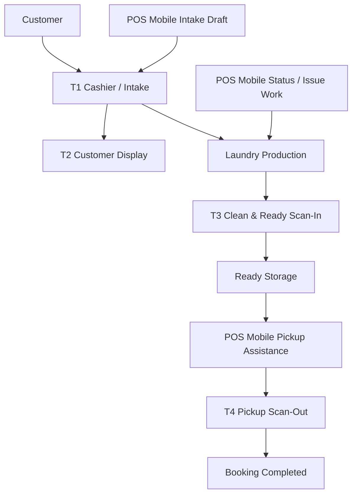
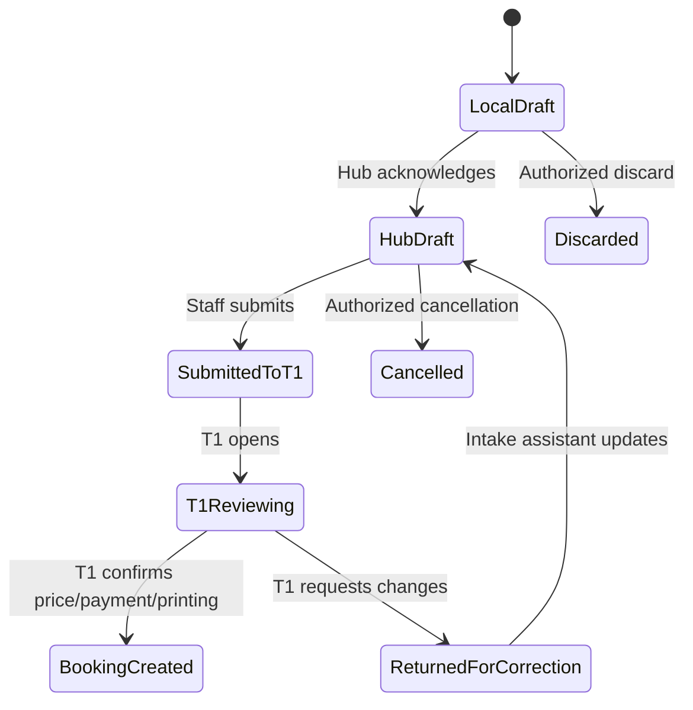
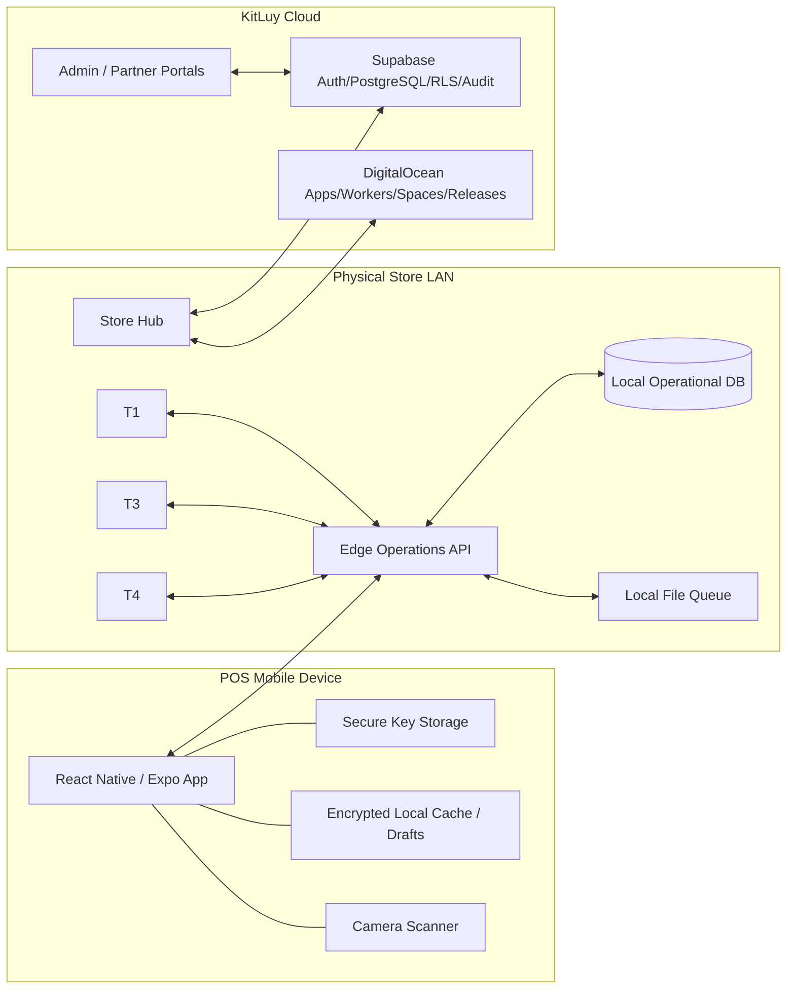
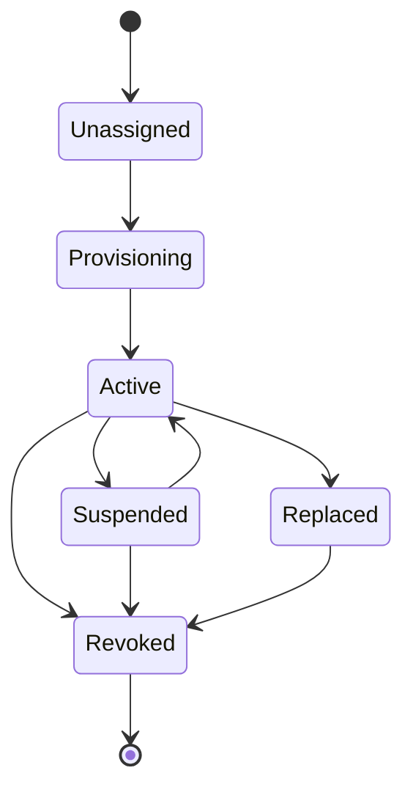

# KitLuy POS Mobile App — Phase 1 Laundry Specification

| Field | Value |
|---|---|
| **Filename** | `kitluy-pos-mobile-app-phase1-spec-v2.2.0.md` |
| **Product** | `kitluy-pos-mobile-app` |
| **Target version** | **v2.2.0** |
| **Active vertical** | Phase 1 — Laundry |
| **Document date** | 2026-07-25 |
| **Owner** | HET / KitLuy Suite Project Owner |
| **Primary users** | Laundry store staff, cashiers, supervisors, and store managers performing approved roaming operations |
| **Form factor** | React Native + Expo mobile application |
| **Status** | Canonical target-state product specification; not implementation evidence |
| **Authority** | Current KitLuy Project Instructions and owner-locked decisions override older bibles and competitor-derived planning |
| **Release position** | Consolidated v2.2.0 target; v2.0.0 and v2.1.0 capabilities are included without requiring separate public releases |

> **Mission:** Deliver a secure, scan-first, Store-Hub-bound mobile staff application that extends Phase 1 Laundry operations without replacing or bypassing the fixed T1–T4 terminal architecture.

> **Rebuild Test:** A qualified engineer with no prior context must be able to reconstruct the v2.2.0 product boundary, screens, permissions, local behavior, Hub contracts, failure handling, release process, and QA obligations from this specification and its referenced shared contracts.

---

## Status and Evidence Discipline

This document defines an **approved target specification**. It does not prove that repositories, migrations, APIs, tests, signed builds, pilot deployments, or production operations exist.

The term **IMPLEMENTED** must not be used for a capability in this specification unless all applicable evidence exists:

1. Verified repository implementation.
2. Applied and validated migrations where schema changes are required.
3. Automated and integrated test evidence.
4. Signed build and deployment evidence.
5. Device certification evidence where hardware behavior is involved.
6. Pilot or production evidence where operational readiness is claimed.

Unresolved deployment-specific values are written as `[REQUIRED: ...]`. They must not be guessed during implementation.

---

# 0. Rebuild Sequence

Execute in this order. A later step must not be treated as complete when its dependencies remain unverified.

1. **Confirm authority and scope**
   - Confirm this v2.2.0 specification is the active POS Mobile Phase 1 document.
   - Confirm the current T1–T4 owner lock.
   - Confirm one Digital Store belongs to one primary vertical.
   - Confirm the Store Hub is active before mobile device activation.
   - Resolve every item in Appendix E marked `[REQUIRED: ...]` that blocks development or release.

2. **Confirm shared contracts**
   - Tenant, Digital Store, Store Location, user, employee, role, device, and vertical isolation.
   - Laundry Booking, customer, service, garment, status, issue, payment-summary, file, and audit contracts.
   - Device provisioning and certificate contracts.
   - Edge Operations API version and compatibility policy.
   - Store Hub local authority, sync, idempotency, and conflict rules.

3. **Prepare development environments**
   - Development Supabase project for Auth, PostgreSQL, RLS, metadata, audit, and Realtime where required.
   - Development Store Hub runtime and local database.
   - Development DigitalOcean services for file/release artifacts where required.
   - Test Tenant, Laundry Digital Store, Store Location, staff roles, services, customers, Bookings, devices, and tags.

4. **Apply approved additive migrations**
   - Device assignment/profile delta.
   - Mobile session and device-health delta.
   - Mobile intake-draft delta.
   - Mobile scan/pickup-assist delta.
   - Offline mutation receipt and conflict delta if not already shared.
   - Audit/event additions.
   - Do not duplicate authoritative Booking, payment, inventory, or finance truth.

5. **Deploy Store Hub contracts**
   - Versioned Edge Operations API.
   - Mobile bootstrap projection.
   - Device certificate exchange.
   - Booking/customer search projection.
   - Intake-draft, scan, status, issue, pickup-assist, file-intent, and diagnostic operations.
   - Idempotency receipts and reconnect reconciliation.

6. **Build the mobile application**
   - React Native + Expo application.
   - Signed development, internal, pilot, and stable channels.
   - Secure device storage.
   - Encrypted local database/cache.
   - Camera scanning, file capture, LAN connectivity, and device-health modules.

7. **Provision the first certified pilot device**
   - Create device assignment in Partner Portal or approved Admin workflow.
   - Install the signed build.
   - Complete cloud bootstrap and Hub binding.
   - Validate camera, storage, network, notifications, clock, and secure key storage.
   - Confirm the device receives only the assigned Laundry profile and permissions.

8. **Run end-to-end Laundry workflows**
   - Booking lookup.
   - Mobile intake draft sent to T1.
   - Tag/Booking scan resolution.
   - Allowed production status transition.
   - Issue/rewash/damage evidence.
   - Pickup-assist session handed to T4.
   - Hub-only operation during WAN failure.
   - Safe degraded behavior during Hub loss.

9. **Run security, offline, recovery, and upgrade validation**
   - Cross-Tenant, cross-Store, cross-Location, cross-role, and cross-device negative tests.
   - Revoked/lost device test.
   - Duplicate action and replay test.
   - App restart with pending local drafts.
   - Hub restart and endpoint rediscovery.
   - Update, rollback, and incompatible-contract test.

10. **Pass pilot and Rebuild Test**
    - Monitoring and support runbooks are active.
    - Device support matrix is approved.
    - Staff training materials are approved.
    - Pilot evidence is reviewed.
    - One qualified engineer reconstructs and operates the product from current documentation and contracts.

---

# 1. Authority, Scope, and Conflict Resolution

## 1.1 Authority Order

Use the following precedence:

1. Current Project Owner decisions and current KitLuy Project Instructions.
2. Applied migrations, verified code/tests, signed releases, and production evidence.
3. This POS Mobile v2.2.0 specification.
4. Current KitLuy Rebuild and Business Bibles where they do not conflict with newer owner decisions.
5. Approved product handoffs and shared API/data contracts.
6. Evidence-based competitor analyses and product classifications.
7. Competitor clone/rebuild documents as design references only.
8. Superseded planning.

## 1.2 Owner-Locked T1–T4 Reconciliation

The authoritative Phase 1 Laundry terminal model is:

| Terminal | Canonical role | Authority |
|---|---|---|
| **T1** | POS Cashier / Intake Terminal | Customer intake, authoritative Booking creation, price/payment workflow, deposit/full payment, receipt and garment-tag printing |
| **T2** | Customer Display Screen | Customer-facing Booking, service, total, KHQR/payment, and pickup information; no production authority |
| **T3** | Clean & Ready Scan-In Terminal | Quality/count verification, Ready storage assignment, and authoritative Ready-for-Pickup custody event |
| **T4** | Customer Pickup Scan-Out Terminal | Customer verification, balance handling when authorized, final garment scan-out, pickup completion, and custody release |

This specification supersedes all older references where:

- T2 means Scan-In.
- T3 means Scan-Out.
- only three logical Laundry terminals exist.
- T2 and T3 share a production terminal model.
- final pickup returns to T1 after a legacy scan-out flow.

## 1.3 POS Mobile Boundary

`kitluy-pos-mobile-app` is a **roaming staff edge client**. It owns:

- mobile Booking and customer lookup;
- mobile intake assistance and draft capture;
- camera barcode/QR scanning;
- approved production-status updates;
- QA, issue, rewash, damage, and evidence capture;
- pickup preparation and retrieval assistance;
- device/session status, diagnostics, and reconnect UX;
- bounded safe local drafts during temporary Hub loss;
- role-scoped staff workflows delegated by KitLuy Core and the Laundry vertical.

It must not own:

- Partner owner/manager cockpit behavior;
- full Partner Portal configuration;
- platform or Chain administration;
- authoritative T1 payment/printing workflow;
- T2 customer-display behavior;
- authoritative T3 Ready Scan-In;
- authoritative T4 Pickup Scan-Out or Booking completion;
- cash-drawer operation, shift close, or financial reconciliation;
- refunds, voids, compensation, or autonomous sensitive actions;
- public Storefront administration;
- direct production-database access;
- direct operational writes to Supabase during normal physical-store operation.

## 1.4 One Store, One Vertical

A POS Mobile device is assigned to exactly one active Store Location profile at a time. The assigned Store belongs to exactly one primary vertical.

A Laundry profile must not expose Restaurant, Retail, Pharmacy, Grocery, or Supermarket workflows. Future profiles are separately entitled, versioned, documented, and tested.

## 1.5 Version Composition

The owner selected v2.2.0 as the direct target. The release combines the intended increments below into one specification:

| Included capability set | v2.2.0 treatment |
|---|---|
| Product boundary, Hub-first architecture, device identity, staff access | Included |
| Laundry Booking lookup, mobile intake draft, scanning, status, issue, pickup assistance | Included |
| Encrypted local resilience, reconnect/conflict UX, certified device profile, revocation, release hardening | Included |
| Separate public shipment of v2.0.0 or v2.1.0 | Not required |

The version number is a target contract, not evidence that prior versions were released.

---

# 2. Product Definition

## 2.1 Product Statement

> **KitLuy POS Mobile v2.2.0 is a secure, Hub-bound, scan-first mobile staff application for roaming Laundry intake assistance, Booking lookup, production-status work, issue evidence, and pickup preparation. It extends POS Desktop while preserving the fixed T1–T4 authority model.**

## 2.2 Phase 1 Business Problem

Laundry stores need staff to move around the counter, production area, storage area, and customer pickup area without carrying paper lists or returning to a fixed terminal for every lookup.

The mobile application must reduce walking and repeated data entry while preserving:

- custody control;
- payment authority;
- printer/scale authority;
- Store Hub local truth;
- employee accountability;
- device accountability;
- offline continuity;
- simple installation and supportability.

## 2.3 Product Goals

1. Make Booking and customer lookup scan-first and fast.
2. Let staff capture intake information before the customer reaches T1.
3. Let authorized staff update non-custody production states from the work area.
4. Let staff capture issue, rewash, damage, and garment evidence at the point of work.
5. Let pickup staff prepare retrieval without prematurely completing pickup.
6. Continue approved operation when internet access fails but Store Hub remains reachable.
7. Fail clearly and safely when the Store Hub cannot be reached.
8. Make every sensitive action attributable to Tenant, Store, Location, employee, device, session, and timestamp.
9. Support Khmer and English, KHR and USD, and Asia/Phnom_Penh.
10. Reuse shared Core and Laundry contracts without duplicating business truth in the app.

## 2.4 Non-Goals

The v2.2.0 Phase 1 release does not provide:

- a replacement for T1–T4;
- unattended customer self-service;
- a Partner management dashboard;
- full catalog, service, pricing, employee, inventory, finance, report, or connector configuration;
- mobile cash drawer or shift close;
- mobile receipt or garment-tag printer authority;
- mobile scale authority for final priced weight;
- mobile KHQR generation or payment capture;
- card-present or offline-card capture;
- final Ready custody creation;
- final pickup custody release;
- autonomous refunds, voids, credits, compensation, or financial adjustments;
- Restaurant tableside ordering in the Laundry profile;
- Retail receiving/count workflows except future separately entitled profiles;
- arbitrary unsupported Android devices or peripherals.

## 2.5 Success Outcomes

The product is successful when pilot evidence shows that:

- staff can find a Booking by tag, receipt, phone, or Booking reference;
- intake assistants can prepare accurate drafts that T1 finalizes without re-entry;
- production staff can record allowed statuses and issues at the work area;
- pickup staff can prepare the correct garment set and hand the workflow to T4;
- WAN loss does not stop Hub-connected approved workflows;
- duplicate or replayed mutations do not create duplicate business events;
- revoked devices lose access promptly;
- the app never presents local drafts or cached information as authoritative Hub truth;
- T1–T4 authority violations are blocked by server-side permission and state checks.

---

# 3. Actors, Roles, and Permissions

## 3.1 Primary Actors

| Actor | Primary use |
|---|---|
| Laundry staff | Scan tags, view assigned work, update allowed statuses, capture issue evidence |
| Intake assistant | Prepare customer and garment intake drafts for T1 |
| Pickup assistant | Locate Ready Bookings, verify retrieval details, prepare T4 handoff |
| Cashier | Use roaming lookup and intake assistance; final T1 authority remains on POS Desktop |
| Supervisor | Review exceptions and perform approved protected actions with reason/approval |
| Store manager | Manage operational oversight, device activation assistance, and approved override actions |
| HET support operator | Device health/support only through approved support-access controls; no silent store operation |

## 3.2 Authentication Layers

A successful action requires all applicable layers:

1. Valid KitLuy user identity or approved employee credential.
2. Active Tenant membership.
3. Active Store and Store Location assignment.
4. Active employee record.
5. Active device assignment.
6. Valid device certificate.
7. Active mobile session.
8. Assigned vertical profile: `laundry_phase1`.
9. Required capability permission.
10. Valid workflow state and current aggregate version.
11. Manager confirmation where policy requires it.

## 3.3 Role Capability Matrix

Legend: `V` view, `A` act, `M` manager approval, `—` denied.

| Capability | Laundry staff | Intake assistant | Pickup assistant | Cashier | Supervisor | Store manager |
|---|---:|---:|---:|---:|---:|---:|
| Booking/customer lookup | V | V | V | V | V | V |
| View role-safe balance/payment status | V | V | V | V | V | V |
| Create/edit local intake draft | — | A | — | A | A | A |
| Submit intake draft to T1 | — | A | — | A | A | A |
| Create authoritative Booking | — | — | — | — | — | — |
| Capture final payment | — | — | — | — | — | — |
| Print receipt/tag | — | — | — | — | — | — |
| Scan/resolve Booking or garment tag | A | A | A | A | A | A |
| Update allowed production status | A | — | — | A | A | A |
| Mark Ready through T3 custody event | — | — | — | — | — | — |
| Capture issue/rewash/damage evidence | A | A | A | A | A | A |
| Start pickup-assist session | — | — | A | A | A | A |
| Verify customer for pickup preparation | — | — | A | A | A | A |
| Complete T4 final scan-out | — | — | — | — | — | — |
| Request protected exception | A | A | A | A | A | A |
| Approve protected mobile action | — | — | — | — | M | M |
| View device/sync diagnostics | V | V | V | V | V | V |
| Change Store/Location assignment | — | — | — | — | — | — |

The server must deny unauthorized actions even when a client UI is modified or outdated.

## 3.4 Protected Actions

Protected mobile actions require a review screen containing target, impact, reason, actor, device, and approver.

Examples:

- override a mismatched garment count for a non-final helper workflow;
- reopen a mobile intake draft after T1 review started;
- submit an issue without a normally required photo because the camera is unavailable;
- cancel a pickup-assist session after retrieval began;
- discard a pending local action after conflict review;
- transfer an active mobile session to a replacement device.

A protected mobile action must never grant T1, T3, or T4 authority to the mobile app.

---

# 4. T1–T4 and POS Mobile Operating Model

## 4.1 Canonical Flow



## 4.2 Mobile Assistance Rules

| Workflow | POS Mobile role | Authoritative terminal |
|---|---|---|
| Customer pre-intake | Capture draft and evidence | T1 finalizes Booking |
| Pricing | Display Hub-calculated draft estimate only where allowed | T1 confirms authoritative price |
| Deposit/payment | Display status or balance only | T1 or T4 according to approved policy |
| Receipt/tag | Request/prepare information only | T1 printing authority |
| Customer display | None | T2 |
| Production status | Allowed non-custody transitions | Core/Hub state machine |
| Ready storage | View and assist only | T3 authoritative scan-in |
| Pickup preparation | Start retrieval helper, verify expected items | T4 authoritative scan-out |
| Booking completion | None | T4 |

## 4.3 Custody Guardrails

The following events cannot originate from POS Mobile in v2.2.0:

- `ready_scan_in_completed`;
- `ready_storage_assigned` as the authoritative custody event;
- `pickup_scan_out_completed`;
- `garment_custody_released`;
- `booking_completed_by_pickup`;
- authoritative payment settlement;
- authoritative refund, void, or compensation.

POS Mobile may produce helper events such as `pickup_assist_started` or `garment_retrieval_prepared`, but those events never change final custody or finance truth.

---

# 5. Functional Scope

## 5.1 Device Provisioning and Activation

### Required user experience

```text
Add POS Mobile device
→ Install signed KitLuy app
→ Choose language
→ Connect to internet and Store Wi-Fi
→ Sign in or enter/scan provisioning code
→ Confirm assigned Digital Store and Store Location
→ Create secure device identity
→ Discover and verify the assigned Store Hub
→ Download Laundry profile and approved cache
→ Test camera, storage, LAN and notifications
→ Become Active
```

### Rules

- The Digital Store and Store Location must already exist.
- The Store Hub must be active and initially synchronized.
- A Partner or authorized HET operator creates the mobile-device assignment.
- The installer cannot choose a different Store, vertical, or privilege profile.
- Device keys are generated on-device and stored in OS-protected secure storage.
- A provisioning code is short-lived, one-time, Store-scoped, and auditable.
- The Hub identity is verified by UUID, certificate, Tenant, Digital Store, and Store Location.
- IP address or hostname locates the Hub but does not establish trust.
- Activation is blocked when certification checks fail.

### Connection priority

1. Assigned Hub private IP.
2. Assigned Hub hostname.
3. Automatic LAN discovery.
4. Last successful verified Hub IP.
5. Latest verified Hub endpoint reported through cloud provisioning metadata.
6. Manual IP recovery entry.

Manual IP is a recovery fallback. It must still pass certificate and scope verification.

## 5.2 Staff Sign-In and Session

### Features

- user sign-in during initial provisioning;
- employee PIN or approved fast staff unlock after device activation;
- explicit current employee and role display;
- session timeout and automatic screen lock;
- controlled employee switch;
- manager elevation for one action rather than permanent privilege escalation;
- session termination on certificate revocation, employee deactivation, or assignment removal;
- local authentication cache only for approved offline Hub-connected operation.

### Rules

- Shared staff accounts are prohibited.
- The app records both the KitLuy identity and active employee identity when they differ.
- Manager approval is action-scoped and expires immediately after use.
- A staff switch clears private search results, customer details, intake drafts not owned by the new actor, and temporary scan buffers according to policy.

## 5.3 Home and Scan Workspace

The Home route is scan-first.

### Required content

- Store, Location, employee, device, and current shift/status context.
- Hub connectivity and WAN state.
- Pending local draft/action count.
- Large Scan action.
- Manual Booking/reference entry.
- Recent permitted Bookings.
- Assigned or relevant operational tasks where supported.
- Quick actions: Intake Draft, Find Booking, Pickup Assist, Report Issue.

### Scan sources

- Booking QR/barcode.
- Receipt QR/barcode.
- Laundry bag tag.
- Garment tag.
- Customer pickup token.
- Storage location code for read-only helper use.

### Scan outcomes

- exact match;
- multiple match requiring selection;
- unknown code;
- wrong Store/Location;
- invalid or revoked code;
- already completed or cancelled Booking;
- tag expected at T3/T4 only;
- stale local result requiring Hub confirmation;
- permission denied.

No scan result may silently trigger a business mutation.

## 5.4 Booking Search and Details

### Search methods

- Booking number.
- Customer phone.
- Customer name where policy allows.
- Receipt/tag scan.
- Pickup token.
- Status filter.
- Due date or pickup date.

### Booking detail sections

1. Header: Booking reference, customer, status, due/pickup time.
2. Service lines and add-ons.
3. Garment/piece/weight summary.
4. Role-safe payment summary: total, paid, balance, status.
5. Production timeline.
6. Ready-storage summary when available.
7. Issues, rewash, damage, and notes.
8. Photos/evidence according to permission.
9. Notifications summary where available.
10. Sync/source indicator and Hub revision.
11. Available actions determined by state, role, and device profile.

### Truth labeling

- `Hub live` means confirmed from the assigned Hub.
- `Cached` means the app is showing the last authorized local snapshot.
- `Pending` means one or more local safe drafts/actions await Hub acknowledgement.
- `Conflict` means human review is required.
- `Unavailable` is distinct from zero, empty, or no balance.

## 5.5 Mobile Intake Assistance

POS Mobile does not create the authoritative Phase 1 Booking. It creates an **Intake Draft** that T1 reviews and finalizes.

### Intake Draft contents

- selected or new customer candidate;
- customer phone and name;
- service candidates;
- per-piece garment descriptions;
- approximate piece count;
- optional preliminary weight when manually entered and clearly labeled non-authoritative;
- add-ons and handling notes;
- stain, damage, missing-button, color-run, delicate, or special-care observations;
- requested due/pickup time;
- pickup/delivery note where enabled;
- garment and condition photos;
- intake assistant and device identity;
- draft timestamp and Store/Location;
- draft version and idempotency key.

### Intake Draft lifecycle



### T1 handoff

The submission creates a visible T1 intake queue item. T1 must:

- verify customer;
- verify actual weight/pieces;
- verify services/add-ons;
- calculate/confirm price;
- apply allowed discount/promotion;
- collect deposit/full payment or approved pay-at-pickup arrangement;
- print receipt and garment tags;
- create the authoritative Booking.

### Restrictions

- Draft totals are estimates, not financial truth.
- Mobile cannot open a cash drawer.
- Mobile cannot generate a final receipt/tag.
- Mobile cannot set a draft directly to `Received` as an authoritative Booking.
- Duplicate drafts are detected by idempotency key and matching context.

## 5.6 Production Status Assistance

POS Mobile may update only approved non-custody Laundry workflow states.

### Example allowed transitions

The exact state machine is owned by the Laundry vertical contract. The initial target may include:

- Received → Washing.
- Washing → Drying.
- Drying → Pressing.
- Pressing → QA.
- Any active production state → Issue Review.
- Issue Review → Rewash.
- Rewash → Washing.
- Issue Review → Manager Review.

### Prohibited transitions

- Any state → Ready through POS Mobile.
- Ready → Picked Up through POS Mobile.
- Any state → Completed through POS Mobile.
- Any financial reversal or settlement transition.

### Status mutation requirements

- current Hub revision/precondition;
- employee and device identity;
- allowed state transition;
- reason code where required;
- optional note;
- evidence requirement where configured;
- idempotency key;
- Hub receipt;
- immutable audit event.

## 5.7 QA, Issue, Rewash, Damage, and Evidence

### Issue categories

- stain remains;
- rewash required;
- garment damaged;
- garment missing;
- garment count mismatch;
- wrong garment/customer risk;
- color run;
- shrinkage concern;
- machine/process issue;
- packaging issue;
- customer instruction conflict;
- other with required note.

### Evidence features

- camera photo capture;
- multiple photos per issue subject to policy;
- annotation or structured note;
- garment/tag association;
- Booking association;
- severity;
- observed production stage;
- staff/device/time identity;
- manager review status;
- local pending-upload indicator;
- checksum and confirmed-upload state.

### Rules

- Evidence is not a financial compensation decision.
- The app cannot promise compensation to a customer.
- Sensitive issue evidence follows file-retention and access rules.
- A failed file upload does not silently discard the issue record.
- The Hub stores required operational copies and queues cloud upload.

## 5.8 Pickup Assistance

POS Mobile helps staff find and prepare a Booking for T4.

### Pickup Assist flow

```text
Scan/search pickup reference
→ Confirm Booking is Ready
→ Show storage locations and expected garment set
→ Verify customer using approved identifier
→ Retrieve and scan/check garments as a helper checklist
→ Display mismatches, issues, and balance warning
→ Send prepared session to T4
→ T4 performs final verification, payment policy, scan-out, and completion
```

### Pickup Assist record

- Booking ID/reference;
- customer verification method and result;
- expected items;
- prepared/retrieved item checklist;
- storage positions viewed;
- mismatch/exception details;
- balance status label;
- assisting employee/device;
- start/end timestamps;
- handoff target T4;
- status: `started`, `preparing`, `blocked`, `ready_for_t4`, `handed_to_t4`, `cancelled`, `expired`.

### Restrictions

- No final custody release.
- No final Booking completion.
- No payment capture.
- No cash handling.
- No clearing of Ready-storage assignment.
- No override of T4 scan requirements.
- Customer identity verification on mobile is a preparation step; T4 performs final approval according to policy.

## 5.9 Shift and Store Status

The route name may be `Shift / Status`, but v2.2.0 is not a cash-shift application.

### Included

- current employee/session;
- assigned Store/Location;
- open Store operational status;
- current T1 shift identifier where exposed as context;
- Hub state;
- WAN state;
- last successful Hub contact;
- app version and release channel;
- device certificate expiry/status;
- local pending count and oldest pending age;
- camera/storage/network self-tests;
- support code and diagnostic bundle request.

### Excluded

- opening float;
- pay-in/pay-out;
- expected cash;
- counted cash;
- cash variance;
- shift close;
- Z report;
- drawer open.

## 5.10 Diagnostics and Support

### Self-service diagnostics

- reconnect to assigned Hub;
- rediscover Hub;
- verify certificate;
- verify clock/timezone;
- camera test;
- local storage health;
- notification permission check;
- local network reachability;
- app/update status;
- pending-action inspector;
- safe local cache reset after confirmation;
- generate redacted diagnostic bundle.

### Support rules

- Support never receives direct production-database credentials.
- Remote support requires an authorized, time-bounded access grant where interaction is needed.
- Diagnostic bundles redact customer PII, payment details, credentials, and file content by default.
- A support operator cannot impersonate a store employee silently.
- Every support action is audited.

---

# 6. Navigation and Screen Inventory

## 6.1 Primary Navigation

| Tab | Purpose |
|---|---|
| **Intake / Scan** | Scan-first home, intake draft, quick lookup, issue capture |
| **Bookings** | Search, filters, detail, status and issue actions |
| **Pickup Helper** | Ready Booking search, retrieval preparation, T4 handoff |
| **Shift / Status** | Employee/session and Store/Hub/device health context |
| **More** | Diagnostics, pending actions, support, app information, sign out |

Navigation items are hidden or disabled according to capability permissions and profile entitlements. Server authorization remains authoritative.

## 6.2 Route Inventory

| Route ID | Screen | Required state |
|---|---|---|
| `KPM-SCR-001` | Launch / integrity check | Always |
| `KPM-SCR-002` | Language selection | First run / settings |
| `KPM-SCR-003` | Sign in | Provisioning or expired identity |
| `KPM-SCR-004` | Provisioning code / QR | Unassigned device |
| `KPM-SCR-005` | Store/Location confirmation | Provisioning |
| `KPM-SCR-006` | Hub discovery and verification | Provisioning/recovery |
| `KPM-SCR-007` | Device capability tests | Provisioning/diagnostics |
| `KPM-SCR-008` | Activation complete | Provisioning success |
| `KPM-SCR-009` | Employee PIN unlock | Active device |
| `KPM-SCR-010` | Intake / Scan home | Authorized session |
| `KPM-SCR-011` | Scanner camera | Camera permission |
| `KPM-SCR-012` | Scan resolution | Match result |
| `KPM-SCR-013` | Booking search | Authorized session |
| `KPM-SCR-014` | Booking list/filter | Search result |
| `KPM-SCR-015` | Booking detail | Permissioned Booking |
| `KPM-SCR-016` | Intake draft customer | Intake permission |
| `KPM-SCR-017` | Intake draft services/garments | Intake permission |
| `KPM-SCR-018` | Intake draft photos/notes | Intake permission |
| `KPM-SCR-019` | Intake draft review | Intake permission |
| `KPM-SCR-020` | Submit to T1 | Valid draft and Hub state |
| `KPM-SCR-021` | Production status transition | Status permission |
| `KPM-SCR-022` | Report issue | Issue permission |
| `KPM-SCR-023` | Evidence capture | Issue/intake permission |
| `KPM-SCR-024` | Pickup search | Pickup permission |
| `KPM-SCR-025` | Pickup preparation | Ready Booking |
| `KPM-SCR-026` | Customer verification | Pickup preparation |
| `KPM-SCR-027` | Garment retrieval checklist | Pickup preparation |
| `KPM-SCR-028` | Handoff to T4 | Valid prepared session |
| `KPM-SCR-029` | Shift / Status | Active session |
| `KPM-SCR-030` | Pending actions | Pending local data |
| `KPM-SCR-031` | Conflict detail | Conflict exists |
| `KPM-SCR-032` | Device diagnostics | Authorized session |
| `KPM-SCR-033` | Update required | Incompatible/mandatory release |
| `KPM-SCR-034` | Device revoked | Revocation |
| `KPM-SCR-035` | Support and diagnostic bundle | Authorized session |
| `KPM-SCR-036` | App information / licenses | Always after activation |

## 6.3 Critical Empty and Failure States

Every major screen must distinguish:

- loading;
- no results;
- unauthorized;
- unavailable;
- cached;
- stale;
- pending;
- conflict;
- Hub unreachable;
- WAN unavailable but Hub available;
- device revoked;
- app incompatible;
- certificate expired;
- profile disabled;
- Store/Location inactive.

Zero, empty, unavailable, and unauthorized must never share the same presentation.

---

# 7. Component Inventory

## 7.1 App Shell Components

- `MobileAppShell`
- `StoreContextHeader`
- `EmployeeSessionBadge`
- `HubStatusBanner`
- `WanStatusIndicator`
- `SyncPendingBadge`
- `ProfileBadge`
- `BottomNavigation`
- `ProtectedActionSheet`
- `ManagerApprovalSheet`
- `GlobalErrorBoundary`
- `MandatoryUpdateGate`
- `RevokedDeviceGate`

## 7.2 Scan Components

- `PrimaryScanButton`
- `CameraScannerView`
- `ManualCodeEntry`
- `ScanTargetFrame`
- `ScanResultCard`
- `ScanMismatchCard`
- `DuplicateScanWarning`
- `WrongStoreWarning`
- `ScannerPermissionRecovery`
- `FlashlightControl`
- `BatchHelperChecklist`

## 7.3 Booking Components

- `BookingSummaryCard`
- `CustomerIdentityCard`
- `ServiceLineList`
- `GarmentSummary`
- `PaymentStatusSummary`
- `BalanceDueWarning`
- `ProductionTimeline`
- `IssueSummaryCard`
- `StorageLocationList`
- `SourceFreshnessBadge`
- `AvailableActionsPanel`

## 7.4 Intake Components

- `CustomerCandidateForm`
- `ServiceSelector`
- `GarmentPieceEditor`
- `ApproximateWeightField`
- `HandlingNoteEditor`
- `ConditionChecklist`
- `EvidenceCaptureGrid`
- `DueTimeSelector`
- `DraftEstimatePanel`
- `T1HandoffReview`

## 7.5 Status and Issue Components

- `AllowedTransitionList`
- `StatusTransitionReview`
- `ReasonCodePicker`
- `IssueTypePicker`
- `SeveritySelector`
- `GarmentAssociationPicker`
- `PhotoEvidenceCard`
- `PendingUploadBadge`
- `ManagerReviewState`

## 7.6 Pickup Components

- `ReadyBookingCard`
- `CustomerVerificationPanel`
- `ExpectedGarmentChecklist`
- `RetrievalProgress`
- `StoragePositionCard`
- `PickupMismatchPanel`
- `T4HandoffCard`
- `PickupAssistExpiryTimer`

## 7.7 Offline and Diagnostic Components

- `LocalDraftBadge`
- `PendingActionList`
- `OldestPendingAge`
- `ConflictResolutionCard`
- `RetryStatus`
- `HubEndpointCard`
- `CertificateStatusCard`
- `CameraTestCard`
- `StorageHealthCard`
- `NetworkTestCard`
- `DiagnosticBundleCard`

---

# 8. UX, Localization, and Accessibility

## 8.1 Interaction Principles

1. Scan first; manual entry remains available.
2. The app shows the current Store, employee, device, and Hub state persistently.
3. One primary action per screen.
4. Sensitive actions show impact and require confirmation.
5. Cached and pending data are visually distinct from Hub-confirmed data.
6. T1, T3, and T4 handoffs use explicit language; generic “Complete” buttons are prohibited.
7. Error messages explain what happened, what remains safe, and what the user can do next.
8. Staff never need to understand IP addresses during normal setup.
9. The app never silently switches to cloud operational authority.
10. Every action that is not accepted by the Hub is labeled clearly.

## 8.2 Canonical Action Labels

Use:

- `Send to T1 for Review`
- `Update Production Status`
- `Report Issue`
- `Prepare for T4`
- `Hand Off to T4`
- `Retry with Store Hub`
- `Save Local Draft`
- `Discard Local Draft`

Do not use on POS Mobile:

- `Create Final Booking`
- `Collect Payment`
- `Print Receipt`
- `Mark Ready`
- `Complete Pickup`
- `Release Garments`
- `Close Shift`

## 8.3 Localization

| Area | Rule |
|---|---|
| Languages | Khmer and English required |
| Layout | Support at least 40% text expansion from concise English labels |
| Currency | KHR and USD; consume shared money/currency contract |
| Timezone | `Asia/Phnom_Penh` |
| Date | `DD/MM/YYYY` unless an approved locale preference overrides |
| Time | 24-hour or approved locale setting; operational timestamps include date when ambiguity exists |
| Phone | Cambodia-first, stored in normalized international format where supported |
| Booking terminology | Use `Booking` / `Laundry Booking` in staff-facing mobile UX |
| Production term | Use `Pressing` in mobile UX when backend compatibility uses `ironing` |

## 8.4 Accessibility

- Minimum primary touch target: 48 × 48 logical pixels; preferred 56 × 56 for high-frequency actions.
- Text and icons must not be the only signal for connectivity, success, or error.
- Camera scanning includes sound, haptic, and visible feedback with user controls.
- All forms support screen-reader labels and logical focus order.
- Color contrast must meet `[REQUIRED: approved accessibility standard, target WCAG 2.2 AA]`.
- Reduced-motion behavior is supported.
- Critical alerts remain understandable with sound disabled.
- Khmer font rendering is tested on every certified device profile.

## 8.5 Privacy at the Counter and Floor

- Customer phone is partially masked in lists.
- Full customer details require a justified detail view.
- Sensitive evidence is not shown in recent-item widgets.
- The app locks after `[REQUIRED: inactivity duration]`.
- Screenshots or screen recording on sensitive routes follow `[REQUIRED: mobile privacy policy]`.
- Notifications shown on the lock screen contain no sensitive customer or financial information.

---

# 9. Architecture and Technology

## 9.1 Technology Baseline

| Layer | Target |
|---|---|
| Mobile framework | React Native + Expo + TypeScript |
| Build/release | Expo EAS or approved equivalent with signed channels |
| State management | `[REQUIRED: engineering selection consistent with shared frontend standards]` |
| Local database | Encrypted SQLite-compatible store or approved equivalent |
| Secure secrets | OS Keychain/Keystore/Secure Enclave-backed storage where available |
| Camera scanning | Approved camera barcode/QR module with certified-device tests |
| Network | Store LAN to assigned Store Hub; TLS plus device authentication |
| Cloud Auth/metadata | Supabase according to shared KitLuy contracts |
| Heavy files | DigitalOcean Spaces through File Service; no client-held Spaces secret |
| Store operational authority | Store Hub local database and Edge Operations API |
| Timezone | Asia/Phnom_Penh |
| Release channels | Internal → Pilot → Stable |

Exact library versions must be recorded in the repository lockfile and release evidence. This document does not authorize unsupported library substitutions that weaken secure storage, offline integrity, or device certification.

## 9.2 Runtime Topology



## 9.3 Authority Paths

### Normal operational write path

```text
POS Mobile
→ authenticated Edge Operations API request
→ Store Hub authorization and state validation
→ Store Hub local transaction/event
→ Hub acknowledgement to POS Mobile
→ asynchronous Hub-to-cloud synchronization
```

### File path

```text
POS Mobile captures file
→ encrypted local temporary file
→ Store Hub file intent and local operational copy
→ Hub/File Service upload queue
→ DigitalOcean Spaces object
→ Supabase metadata/permission/audit
→ confirmed upload state returned through Hub
```

### Prohibited path

```text
POS Mobile
-X→ direct production Postgres
-X→ direct Supabase service-role write
-X→ direct DigitalOcean Spaces credential
-X→ public Commerce Store API for physical-store mutations
-X→ connector database access
```

## 9.4 Local Data Classes

| Class | Examples | Local behavior |
|---|---|---|
| Secure credential | device key, certificate reference, refresh material | OS-protected secure storage; never plain SQLite |
| Bootstrap projection | Store/Location, employee permissions, service/status reference | Encrypted cache with version and expiry |
| Hub-confirmed read cache | recent Bookings and lookup results | Encrypted, bounded, labeled cached |
| Local draft | intake draft, issue note, pending evidence | Encrypted, resumable, actor/device scoped |
| Pending safe mutation | approved non-financial action awaiting Hub | Encrypted, bounded, idempotent |
| Temporary media | photos awaiting Hub/File Service acceptance | Encrypted where platform supports; deleted after confirmed retention policy |
| Diagnostics | crash and health metadata | Redacted; no customer content by default |

## 9.5 Repository Blueprint

```text
apps/
  kitluy-pos-mobile-app/
    app/ or src/
      navigation/
      screens/
        provisioning/
        auth/
        intake/
        scan/
        bookings/
        production/
        issues/
        pickup/
        status/
        diagnostics/
      components/
      features/
      services/
        edge-api/
        provisioning/
        device-identity/
        secure-storage/
        local-database/
        sync/
        files/
        telemetry/
      domain/
        booking/
        customer/
        laundry/
        issue/
        pickup-assist/
        device/
      i18n/
      design-system/
      tests/
    app.config.*
    eas.json
    package.json

packages/
  kitluy-domain-contracts/
  kitluy-edge-api-client/
  kitluy-auth-client/
  kitluy-device-contracts/
  kitluy-mobile-design-system/
  kitluy-i18n/
  kitluy-observability/

docs/
  product/pos-mobile/
  api/edge-operations/
  hardware/certified-mobile/
  qa/pos-mobile/
  runbooks/pos-mobile/
```

Shared packages must contain neutral Core logic. Laundry-only terminology and workflows remain in the Laundry profile/module.

---

# 10. Edge Operations API Contract

## 10.1 Contract Rules

- Version every route and event.
- Authenticate the user/employee and device.
- Scope every request to Tenant, Digital Store, Store Location, and vertical profile.
- Require an idempotency key for every mutation.
- Include client operation ID, device ID, session ID, employee ID, app version, and contract version.
- Return an authoritative Hub receipt for accepted mutations.
- Use optimistic preconditions for mutable aggregates.
- Never use generic success when the request is queued, pending approval, or only locally saved.
- Keep errors machine-readable and user-safe.
- Audit sensitive and denied actions.
- Remain backward compatible through additive changes or explicit compatibility gates.

## 10.2 Proposed Route Families

These routes define the target contract family. Exact base URLs and naming require contract approval.

### Bootstrap and session

| Method | Target route | Purpose |
|---|---|---|
| `POST` | `/edge/v1/mobile/sessions/start` | Start employee/device session |
| `POST` | `/edge/v1/mobile/sessions/switch-employee` | Controlled employee switch |
| `POST` | `/edge/v1/mobile/sessions/end` | End session |
| `GET` | `/edge/v1/mobile/bootstrap` | Store/profile/reference projection |
| `GET` | `/edge/v1/mobile/capabilities` | Effective role/device/profile capabilities |

### Booking and customer lookup

| Method | Target route | Purpose |
|---|---|---|
| `GET` | `/edge/v1/bookings/search` | Search scoped Bookings |
| `GET` | `/edge/v1/bookings/{booking_id}` | Role-safe Booking detail |
| `POST` | `/edge/v1/scans/resolve` | Resolve scanned code without mutation |
| `GET` | `/edge/v1/customers/search` | Search customer candidates |
| `GET` | `/edge/v1/customers/{customer_id}` | Role-safe customer summary |

### Intake drafts

| Method | Target route | Purpose |
|---|---|---|
| `POST` | `/edge/v1/mobile/intake-drafts` | Create Hub draft |
| `PATCH` | `/edge/v1/mobile/intake-drafts/{draft_id}` | Update draft with version precondition |
| `POST` | `/edge/v1/mobile/intake-drafts/{draft_id}/submit-to-t1` | Create T1 queue handoff |
| `POST` | `/edge/v1/mobile/intake-drafts/{draft_id}/cancel` | Cancel draft with reason |
| `GET` | `/edge/v1/mobile/intake-drafts/{draft_id}` | Retrieve draft and T1 state |

### Status and issues

| Method | Target route | Purpose |
|---|---|---|
| `GET` | `/edge/v1/bookings/{booking_id}/allowed-transitions` | Return state/role/device-safe actions |
| `POST` | `/edge/v1/bookings/{booking_id}/status-transition-requests` | Apply allowed non-custody transition |
| `POST` | `/edge/v1/bookings/{booking_id}/issues` | Create issue/rewash/damage record |
| `PATCH` | `/edge/v1/issues/{issue_id}` | Update permitted issue fields |
| `POST` | `/edge/v1/issues/{issue_id}/manager-review-request` | Request review |

### Pickup assistance

| Method | Target route | Purpose |
|---|---|---|
| `POST` | `/edge/v1/mobile/pickup-assists` | Start helper session |
| `GET` | `/edge/v1/mobile/pickup-assists/{id}` | Read helper session |
| `POST` | `/edge/v1/mobile/pickup-assists/{id}/verify-customer` | Record preparation verification |
| `POST` | `/edge/v1/mobile/pickup-assists/{id}/check-item` | Update helper checklist |
| `POST` | `/edge/v1/mobile/pickup-assists/{id}/report-mismatch` | Record mismatch |
| `POST` | `/edge/v1/mobile/pickup-assists/{id}/handoff-to-t4` | Create T4 handoff |
| `POST` | `/edge/v1/mobile/pickup-assists/{id}/cancel` | Cancel/expire helper session |

### Files and diagnostics

| Method | Target route | Purpose |
|---|---|---|
| `POST` | `/edge/v1/files/intents` | Create Hub-controlled file intent |
| `POST` | `/edge/v1/files/{intent_id}/chunks-or-upload` | Approved local upload protocol |
| `GET` | `/edge/v1/files/{file_id}/status` | Confirm retention/upload state |
| `POST` | `/edge/v1/mobile/heartbeats` | Device/app health heartbeat |
| `GET` | `/edge/v1/mobile/device-status` | Assignment/certificate/update state |
| `POST` | `/edge/v1/mobile/diagnostic-bundles` | Create redacted diagnostic bundle |

## 10.3 Mutation Envelope

```json
{
  "operation_id": "uuid-or-approved-monotonic-id",
  "idempotency_key": "device-scoped-unique-key",
  "contract_version": "edge-v1",
  "tenant_id": "uuid",
  "digital_store_id": "uuid",
  "location_id": "uuid",
  "device_id": "uuid",
  "session_id": "uuid",
  "employee_id": "uuid",
  "client_created_at": "timestamptz",
  "aggregate_id": "uuid",
  "expected_aggregate_version": 12,
  "payload": {}
}
```

The client-supplied scope is never trusted by itself. The Hub resolves effective scope from the authenticated device/session and rejects mismatch.

## 10.4 Hub Receipt

```json
{
  "operation_id": "uuid",
  "status": "accepted",
  "hub_receipt_id": "uuid",
  "aggregate_id": "uuid",
  "aggregate_version": 13,
  "accepted_at": "timestamptz",
  "event_ids": ["uuid"],
  "cloud_sync_state": "pending"
}
```

Valid statuses include:

- `accepted`;
- `duplicate_replayed`;
- `rejected_permission`;
- `rejected_state`;
- `rejected_precondition`;
- `rejected_scope`;
- `requires_manager_approval`;
- `requires_t1`;
- `requires_t3`;
- `requires_t4`;
- `temporarily_unavailable`.

A local save is not a Hub receipt.

---

# 11. Data and Read-Model Requirements

## 11.1 Authoritative Shared Entities Consumed

POS Mobile consumes but does not own:

- Tenant;
- Digital Store;
- Store Location;
- user and membership;
- employee and role;
- device and assignment;
- Laundry service and add-on;
- customer;
- Laundry Booking;
- Booking line/service/garment;
- payment and balance summary;
- status history;
- issue/rewash/damage;
- T3 Ready custody and storage assignment;
- T4 pickup custody and completion;
- file metadata and grants;
- audit events.

## 11.2 Mobile-Specific Target Records

The canonical schema owner must decide whether these live in shared Core/Edge schemas. This specification defines behavior, not final SQL.

| Target record | Purpose |
|---|---|
| `mobile_device_profiles` | Certified profile, vertical, capabilities, minimum app/contract version |
| `mobile_device_assignments` | Tenant/Store/Location/profile assignment and status |
| `mobile_device_credentials` | Certificate/public-key metadata; never raw private key |
| `mobile_sessions` | Device + employee session, start/end, status, last activity |
| `mobile_intake_drafts` | Hub-accepted draft header |
| `mobile_intake_draft_lines` | Services/add-ons/garment candidate lines |
| `mobile_intake_draft_evidence` | File references and draft association |
| `mobile_pickup_assists` | Non-authoritative retrieval preparation session |
| `mobile_pickup_assist_items` | Helper checklist state |
| `mobile_operation_receipts` | Idempotency and Hub acknowledgement |
| `mobile_conflicts` | Reconnect/precondition conflicts requiring review |
| `mobile_heartbeats` or shared device heartbeat | App/device health and last contact |

## 11.3 Read Models

Required Hub projections:

- `pos_mobile_bootstrap_read`;
- `pos_mobile_recent_bookings_read`;
- `pos_mobile_booking_detail_read`;
- `pos_mobile_customer_search_read`;
- `pos_mobile_allowed_transitions_read`;
- `pos_mobile_ready_booking_read`;
- `pos_mobile_device_status_read`;
- `pos_mobile_pending_handoffs_read`.

Names are target suggestions and require schema contract approval. Read models must include:

- source authority;
- Hub revision;
- `as_of` timestamp;
- Store/Location scope;
- permission-filtered fields;
- stale/partial indicators when applicable.

## 11.4 Money and Payment Data

POS Mobile must consume the shared authoritative Money contract. Minimum behavior:

- no floating-point money;
- currency code always present;
- KHR and USD supported;
- amounts labeled as total, paid, balance, refund, or adjustment rather than generic “sales”;
- payment status separated from Booking status;
- cached payment data never authorizes handover or settlement;
- no local recalculation overrides Hub/Core calculation.

Exact database types and rounding rules remain owned by the shared Core money contract and must be documented before implementation.

---

# 12. Offline, Sync, and Conflict Behavior

## 12.1 Connectivity States

| State | Hub | WAN | Allowed behavior |
|---|---:|---:|---|
| `online_synced` | Available | Available | Full approved profile; Hub remains write authority |
| `hub_local_only` | Available | Unavailable | Full approved local workflows that do not require live external provider confirmation |
| `hub_reconnecting` | Intermittent | Any | Read cache plus bounded safe local drafts/actions; clear pending state |
| `hub_unavailable` | Unavailable | Available or unavailable | No authoritative mutations; local draft/evidence capture only where allowed |
| `cloud_only_no_hub` | Unavailable | Available | Provisioning/recovery and limited diagnostics; no physical-store operational write |
| `revoked` | Any | Any | Lock app; no business data access |
| `incompatible` | Any | Any | Mandatory update or compatibility recovery; no unsafe mutation |

## 12.2 Safe Local Actions During Temporary Hub Loss

Allowed subject to policy:

- create/edit an intake draft locally;
- capture condition/issue photos locally;
- write notes linked to a local draft;
- prepare a pickup checklist without claiming Hub acceptance;
- queue a non-financial status-transition request only if the server contract explicitly permits it and a precondition is stored.

Never queued as offline-authoritative mobile actions:

- payment capture;
- refund or void;
- final discount/price override;
- authoritative Booking creation;
- Ready Scan-In;
- Pickup Scan-Out;
- final Booking completion;
- storage-position release;
- manager approval without the manager/device authorization exchange required by policy.

## 12.3 Pending Action UX

Show:

- pending count;
- oldest pending age;
- action type;
- local creation time;
- whether it is a draft or mutation request;
- retry state;
- blocking conflict;
- last Hub attempt;
- clear label: `Not yet accepted by Store Hub`.

## 12.4 Reconnect Processing

1. Verify Hub identity and certificate.
2. Refresh effective assignment and capabilities.
3. Pull current aggregate revisions for pending actions.
4. Submit oldest eligible action first.
5. Use original idempotency key.
6. Store Hub receipt.
7. Mark accepted, duplicate, rejected, or conflicted.
8. Upload pending files through Hub-controlled intents.
9. Refresh affected read models.
10. Retain audit/reconciliation metadata according to policy.

## 12.5 Conflict Rules

| Conflict | Required handling |
|---|---|
| Aggregate version changed | Do not overwrite; show current Hub state and local intent |
| Booking already cancelled/completed | Reject mutation; preserve local note for review |
| Employee permission removed | Reject and lock affected action |
| Device assignment changed | Stop sync and require reprovisioning |
| Duplicate idempotency key | Return original receipt |
| T1 already finalized intake draft | Mobile becomes read-only for that draft |
| T3/T4 completed authoritative custody action | Pickup/Ready helper session closes or refreshes |
| File accepted but metadata pending | Keep pending state; do not re-upload blindly |

Inventory, payment, finance, and custody truth must never use generic last-write-wins.

## 12.6 Local Retention

All values require approved policy:

- recent Booking cache limit: `[REQUIRED]`;
- intake draft retention: `[REQUIRED]`;
- pending safe action maximum count: `[REQUIRED]`;
- maximum pending age: `[REQUIRED]`;
- temporary media retention after confirmed upload: `[REQUIRED]`;
- diagnostic log retention: `[REQUIRED]`.

When limits are reached, the app must block additional unsafe accumulation and explain the recovery action. It must not silently delete unacknowledged user work.

---

# 13. Security and Privacy

## 13.1 Security Principles

- Deny by default.
- Validate authorization on the Hub for every operation.
- Bind identity to user/employee, device, Store, Location, and profile.
- Keep private keys on-device.
- Use short-lived sessions and revocable device credentials.
- Encrypt sensitive local data at rest.
- Use TLS and device authentication over LAN.
- Never ship service-role, Spaces secret, provider secret, or database credential in the app.
- Log sensitive actions and denied attempts.
- Require human confirmation for sensitive financial, permission, safety, or compliance actions.
- Minimize customer and financial data retained on the device.

## 13.2 Device Credential Lifecycle



### Revocation triggers

- lost or stolen device;
- employee misuse;
- certificate compromise;
- unsupported OS/security state;
- Store/Location closure;
- assignment removal;
- failed integrity checks;
- device replacement.

### Revocation behavior

- terminate sessions;
- block Hub operations;
- remove access to protected cache;
- wipe app data when remote-wipe support is available and approved;
- record last seen, last successful sync, app version, and pending-data status;
- create an asset/support case where required.

## 13.3 Local Security

- Private keys and refresh material are stored only in OS secure storage.
- Local database uses encryption or an approved protected-storage design.
- Media files use protected application storage and are not exposed to the public gallery by default.
- Debug logging is disabled or redacted in stable releases.
- Rooted/jailbroken device policy: `[REQUIRED: block, warn, or restricted mode]`.
- Clipboard use for customer and credential data is restricted.
- Backup/export of the local database is disabled unless encrypted and explicitly approved.

## 13.4 Network Security

- No public inbound port on POS Mobile.
- Hub connections verify certificate and scope, not only IP.
- Guest Wi-Fi must not route to the Store Hub.
- The app rejects an untrusted Hub with a matching IP but invalid identity.
- Discovery responses are treated as candidates until cryptographically verified.
- Certificate rotation supports overlap and recovery without disabling offline store operation unnecessarily.

## 13.5 Privacy

- Only role-required customer fields are returned.
- Search results use masking.
- Issue evidence access is permission-scoped.
- Support bundles exclude customer content by default.
- Analytics do not collect garment photos, customer notes, phone numbers, or payment details.
- Privacy access/deletion/export obligations remain governed by shared KitLuy policy and append-only legal/financial retention rules.

---

# 14. Certified Device and Hardware Profile

## 14.1 Phase 1 Device Strategy

- Android is the recommended store-floor profile.
- iOS may be supported where local networking, camera scanning, secure storage, background behavior, and release operations pass certification.
- Rugged Android is recommended for production-floor use.
- Arbitrary hardware support is rejected.
- Generic Android compatibility does not imply HET certification or support.

## 14.2 Minimum Certification Categories

| Category | Required evidence |
|---|---|
| OS | Approved minimum/maximum versions and security update policy |
| CPU/RAM | Stable app, camera, local encryption, and sync performance |
| Storage | Sufficient protected space and low-storage behavior |
| Camera | Reliable supported barcode/QR formats in store lighting |
| Wi-Fi | Stable Store LAN roaming and reconnect |
| Secure storage | Working Keychain/Keystore-backed credentials |
| Battery | Full-shift target and charging behavior |
| Screen | Khmer readability, glove/touch behavior where needed |
| Notifications | Assignment/update/revocation behavior |
| Device management | Install, update, revoke, inventory, health |
| Ruggedness | Drop/water/dust target if sold as rugged profile |
| Support lifecycle | Vendor availability, replacement and end-of-support date |

Exact device families and minimum OS versions are `[REQUIRED: certification decision]`.

## 14.3 Peripheral Policy

Phase 1 POS Mobile relies primarily on the built-in camera and Store Hub-managed fixed peripherals.

Not required for v2.2.0:

- direct cash drawer;
- direct receipt printer;
- direct garment-tag printer;
- direct authoritative scale;
- direct payment terminal.

Optional Bluetooth/HID scanners may be added only after:

- device/peripheral certification;
- profile entitlement;
- disconnect/reconnect QA;
- duplicate scan protection;
- support matrix update;
- no bypass of Hub hardware authority.

## 14.4 Device Health

The app reports role-safe health metadata:

- device ID and model;
- OS version;
- app version/build;
- profile version;
- certificate state;
- last Hub contact;
- last cloud provisioning contact;
- pending count/age;
- storage pressure;
- camera permission/health;
- battery/charging state where allowed;
- crash-free session indicator;
- update channel.

The target active heartbeat interval is **120 seconds** when the app is active. Operational alert thresholds and background limitations require certification by OS/profile; the Admin/Partner fleet view should flag an assigned active device missing beyond the approved threshold.

---

# 15. Files and Media

## 15.1 Supported File Classes

- intake garment-condition photo;
- issue/rewash/damage photo;
- pickup mismatch photo where policy allows;
- diagnostic bundle;
- optional document evidence approved by the Laundry workflow.

## 15.2 File Rules

- DigitalOcean Spaces stores long-term bytes.
- Supabase/shared metadata owns file identity, ownership, permission, checksum, lifecycle, and audit.
- Store Hub keeps required local operational copies and manages the upload queue.
- POS Mobile never holds cloud storage credentials.
- Every file has Tenant, Digital Store, Location, Booking/issue context, uploader employee, device, checksum, MIME type, size, and capture time.
- EXIF/GPS handling follows `[REQUIRED: privacy policy]`.
- File status distinguishes local-only, accepted-by-Hub, uploading, uploaded, failed, quarantined, and deleted/retained.
- Failed uploads remain visible and retry-safe.
- Thumbnail/preview behavior must not expose inaccessible full-resolution content.

## 15.3 Image Quality

Required target policy:

- preserve enough detail for garment/issue evidence;
- compress for store bandwidth and storage control;
- avoid destructive compression that hides damage evidence;
- strip unnecessary metadata;
- calculate checksum before/after controlled transformations;
- exact dimensions, size limits, and formats: `[REQUIRED: File Service policy]`.

---

# 16. Payments, Finance, and Customer Handover

## 16.1 Read-Only Mobile Finance Scope

POS Mobile may show role-safe:

- Booking total;
- paid amount;
- balance due;
- payment status;
- deposit status;
- KHQR pending/confirmed/failed status if supplied by authoritative payment contract;
- handover block reason.

## 16.2 Prohibited Mobile Finance Actions

- cash payment capture;
- KHQR generation or confirmation action;
- card capture;
- offline card capture;
- refund;
- void;
- discount override;
- deposit adjustment;
- cash movement;
- reconciliation;
- shift close;
- financial record deletion or overwrite.

## 16.3 Balance Warnings

Pickup Helper shows one of:

- `Paid`;
- `Balance due — complete at T4`;
- `Payment confirmation pending`;
- `Payment status unavailable — T4 must verify`;
- `Handover blocked by Store policy`.

Cached payment status can never authorize final release.

## 16.4 Human Confirmation

Any future mobile payment or finance capability requires:

- explicit owner-approved scope;
- provider/security/legal review;
- certified device profile;
- authoritative payment contract;
- reconciliation rules;
- human confirmation;
- updated specification and major/minor version decision;
- pilot evidence.

---

# 17. Observability, Monitoring, and Support

## 17.1 Mobile Metrics

Collect privacy-safe operational metrics:

- active assigned devices;
- activation success/failure;
- Hub discovery time;
- Hub connection success rate;
- certificate errors;
- scan resolution success/failure;
- Booking search latency;
- intake-draft submission success;
- pending-action count and age;
- conflict count by type;
- file upload backlog;
- crash-free sessions;
- app version distribution;
- revoked/incompatible devices;
- battery/storage health where permitted.

## 17.2 Business Safety Signals

Alert or surface:

- mobile action attempting T1/T3/T4-only authority;
- repeated wrong-Store scans;
- repeated denied permission actions;
- device with unacknowledged pending work beyond policy;
- lost/stolen revocation not acknowledged by Hub;
- incompatible app/Hub contract;
- certificate nearing expiry;
- excessive issue submissions or unusual mismatch pattern for operational review;
- file evidence repeatedly failing upload.

Operational signals are not automatic accusations. Human review is required.

## 17.3 Logs

Each operation log includes:

- correlation ID;
- operation ID;
- app build;
- contract version;
- Tenant/Store/Location identifiers;
- device/session/employee identifiers;
- route/action category;
- outcome/error code;
- latency;
- Hub receipt ID when accepted;
- no raw secrets;
- no full customer PII by default.

## 17.4 Support Runbooks

Required runbooks:

- device will not provision;
- app cannot find Hub;
- certificate mismatch;
- wrong Store/Location assignment;
- employee cannot sign in;
- camera will not scan;
- local storage full;
- pending actions will not reconcile;
- duplicate draft/action;
- device lost/stolen;
- mandatory update failed;
- app rollback;
- Hub replacement/reprovisioning;
- diagnostic bundle collection;
- safe device retirement.

---

# 18. Release, Deployment, and Update Strategy

## 18.1 Release Channels

```text
Development
→ Internal
→ Pilot
→ Stable
```

A release must not skip required evidence gates.

## 18.2 Mobile Release Evidence

Every release records:

- semantic version;
- platform build number;
- application/bundle identifier;
- source commit;
- dependency lockfile checksum;
- signing identity/profile;
- EAS/native build record;
- supported device profiles;
- minimum/maximum OS policy;
- Edge Operations API compatibility range;
- Store Hub minimum version;
- schema/migration impact;
- feature flags/entitlements;
- security scan results;
- automated test summary;
- pilot/stable approval;
- rollback target.

## 18.3 Compatibility

The app and Hub exchange:

- app semantic version;
- app build number;
- mobile profile version;
- Edge contract version;
- Hub version;
- minimum compatible versions;
- mandatory update flag;
- feature capability list.

Incompatible clients must fail closed for mutations while preserving safe support/recovery access.

## 18.4 Update Behavior

- Signed update only.
- Signature and checksum verification before activation.
- Internal → Pilot → Stable promotion.
- Staged percentage/store targeting where supported.
- Mandatory update only when security or compatibility requires it.
- Local drafts and pending actions are migrated or protected before update.
- Rollback must not corrupt the local database or lose unacknowledged work.
- Store Hub may distribute approved managed releases where the device-management architecture supports it; public app-store distribution remains possible for certified profiles.

## 18.5 Feature Flags and Entitlements

Minimum flags:

- `pos_mobile_enabled`;
- `pos_mobile_laundry_phase1`;
- `pos_mobile_intake_draft`;
- `pos_mobile_production_status`;
- `pos_mobile_issue_evidence`;
- `pos_mobile_pickup_assist`;
- `pos_mobile_safe_local_queue`;
- `pos_mobile_optional_scanner`;
- `pos_mobile_diagnostics`.

Flags do not bypass permissions, device assignment, vertical scope, or contract compatibility.

---

# 19. QA and Acceptance Matrix

## 19.1 Provisioning and Device Identity

| ID | Scenario | Pass condition |
|---|---|---|
| `KPM-QA-001` | Provision valid assigned device | Device becomes Active only after cloud assignment and Hub verification |
| `KPM-QA-002` | Use expired provisioning code | Rejected; no partial active credential |
| `KPM-QA-003` | Attempt different Store assignment | Rejected and audited |
| `KPM-QA-004` | Discover malicious Hub on same LAN | Certificate/scope verification rejects it |
| `KPM-QA-005` | Manual IP points to wrong Hub | Rejected despite reachable IP |
| `KPM-QA-006` | Revoke device | Session ends and protected cache becomes inaccessible according to policy |
| `KPM-QA-007` | Rotate certificate | Device reconnects through approved rotation path |

## 19.2 Authentication and Permission

| ID | Scenario | Pass condition |
|---|---|---|
| `KPM-QA-010` | Employee PIN unlock | Correct role/capabilities loaded |
| `KPM-QA-011` | Disabled employee | Access denied locally/Hub as policy permits |
| `KPM-QA-012` | Cross-Store Booking reference | No unauthorized Booking data returned |
| `KPM-QA-013` | Staff calls manager-only route | Server denies and audits |
| `KPM-QA-014` | Manager elevation | Applies to one action and expires |
| `KPM-QA-015` | Employee switch | Temporary data and action context are cleared/scoped correctly |

## 19.3 Booking and Scanning

| ID | Scenario | Pass condition |
|---|---|---|
| `KPM-QA-020` | Scan valid Booking tag | Correct scoped Booking shown without mutation |
| `KPM-QA-021` | Scan unknown tag | Clear unknown state; no fabricated match |
| `KPM-QA-022` | Scan wrong-Location tag | Blocked or role-safe warning according to contract |
| `KPM-QA-023` | Repeated scan | No duplicate action |
| `KPM-QA-024` | Camera permission denied | Manual entry and recovery guidance available |
| `KPM-QA-025` | Khmer/English label scan workflow | Labels/layout render correctly |

## 19.4 Intake Draft

| ID | Scenario | Pass condition |
|---|---|---|
| `KPM-QA-030` | Create intake draft online | Hub draft and receipt created once |
| `KPM-QA-031` | Save local draft with Hub unavailable | Clearly local; no authoritative Booking ID |
| `KPM-QA-032` | Reconnect and submit local draft | One Hub draft created with original idempotency key |
| `KPM-QA-033` | Submit to T1 | T1 queue item visible; mobile cannot finalize |
| `KPM-QA-034` | T1 finalizes while mobile open | Mobile refreshes read-only finalized state |
| `KPM-QA-035` | Approximate weight differs from T1 | T1 authoritative value wins; audit preserves draft |
| `KPM-QA-036` | Duplicate submission retry | Original receipt returned; no duplicate queue item |

## 19.5 Production and Issues

| ID | Scenario | Pass condition |
|---|---|---|
| `KPM-QA-040` | Allowed status transition | Hub validates and records one event |
| `KPM-QA-041` | Invalid state transition | Rejected with current state returned |
| `KPM-QA-042` | Attempt mark Ready | Rejected with `requires_t3` |
| `KPM-QA-043` | Report issue with required photo | Issue and file intent persist through Hub |
| `KPM-QA-044` | Upload interrupted | Issue remains; upload resumes without duplicate file |
| `KPM-QA-045` | Compensation attempt | No mobile capability exists; action denied |

## 19.6 Pickup Assistance

| ID | Scenario | Pass condition |
|---|---|---|
| `KPM-QA-050` | Start Ready pickup assist | Non-authoritative helper session created |
| `KPM-QA-051` | Booking not Ready | Helper blocked with reason |
| `KPM-QA-052` | Garment mismatch | Session blocked and issue path available |
| `KPM-QA-053` | Balance due | Warning shown; no mobile payment action |
| `KPM-QA-054` | Hand off to T4 | T4 receives prepared session and revalidates |
| `KPM-QA-055` | Attempt complete pickup | Rejected with `requires_t4` |
| `KPM-QA-056` | T4 completes while helper open | Helper closes/refreshes without duplicate custody event |

## 19.7 Offline and Recovery

| ID | Scenario | Pass condition |
|---|---|---|
| `KPM-QA-060` | WAN lost, Hub available | Approved workflows continue locally |
| `KPM-QA-061` | Hub temporarily lost | Only safe local drafts/actions remain available |
| `KPM-QA-062` | App restarts with local draft | Draft recovers with actor/device scope |
| `KPM-QA-063` | Hub revision changes before retry | Conflict shown; no overwrite |
| `KPM-QA-064` | Same operation replayed | Original Hub receipt returned |
| `KPM-QA-065` | Pending limit reached | App blocks unsafe accumulation and preserves existing work |
| `KPM-QA-066` | Hub endpoint changes | Verified rediscovery reconnects safely |

## 19.8 Security and Privacy

| ID | Scenario | Pass condition |
|---|---|---|
| `KPM-QA-070` | Inspect app package | No service-role/provider/storage secret present |
| `KPM-QA-071` | Copy local DB from device | Protected/encrypted data cannot be read without required keys |
| `KPM-QA-072` | Tamper with client scope IDs | Hub ignores/rejects mismatched scope |
| `KPM-QA-073` | Access evidence without permission | Denied and audited |
| `KPM-QA-074` | Diagnostic bundle | PII/content redacted by default |
| `KPM-QA-075` | Lock-screen notification | No sensitive data shown |

## 19.9 Release and Device Certification

| ID | Scenario | Pass condition |
|---|---|---|
| `KPM-QA-080` | Install unsigned/tampered build | Rejected by distribution/integrity controls |
| `KPM-QA-081` | Incompatible Hub contract | Mutation blocked with update/recovery guidance |
| `KPM-QA-082` | Upgrade with pending local draft | Draft preserved/migrated |
| `KPM-QA-083` | Rollback | App starts safely with compatible local data |
| `KPM-QA-084` | Certified device matrix | Camera, LAN, secure storage, Khmer, battery, update tests pass |
| `KPM-QA-085` | Unsupported device | Explicit unsupported/restricted state; no supportability claim |

## 19.10 Performance Targets

Exact service-level values require pilot approval:

- cold start target: `[REQUIRED]`;
- employee unlock target: `[REQUIRED]`;
- LAN Booking lookup p95: `[REQUIRED]`;
- camera scan-to-result p95: `[REQUIRED]`;
- intake draft save p95: `[REQUIRED]`;
- reconnect discovery target: `[REQUIRED]`;
- crash-free session target: `[REQUIRED]`;
- full-shift battery target: `[REQUIRED]`.

Performance must be measured on every certified device profile under realistic store LAN conditions.

---

# 20. Feature Inventory

| Feature ID | Capability | Priority | Phase 1 v2.2.0 |
|---|---|---:|---:|
| `KPM-P1-001` | Signed mobile application shell | P0 | Required |
| `KPM-P1-002` | Device assignment and profile | P0 | Required |
| `KPM-P1-003` | Secure device identity/certificate | P0 | Required |
| `KPM-P1-004` | Smartphone-simple provisioning | P0 | Required |
| `KPM-P1-005` | Hub discovery and verified binding | P0 | Required |
| `KPM-P1-006` | Employee PIN/session and switch | P0 | Required |
| `KPM-P1-007` | Server-enforced capabilities | P0 | Required |
| `KPM-P1-008` | Scan-first Home | P0 | Required |
| `KPM-P1-009` | Camera barcode/QR scanning | P0 | Required |
| `KPM-P1-010` | Booking/customer search | P0 | Required |
| `KPM-P1-011` | Role-safe Booking detail | P0 | Required |
| `KPM-P1-012` | Mobile intake local/Hub draft | P0 | Required |
| `KPM-P1-013` | Customer candidate capture | P0 | Required |
| `KPM-P1-014` | Service/garment/add-on draft capture | P0 | Required |
| `KPM-P1-015` | Garment condition evidence | P0 | Required |
| `KPM-P1-016` | Submit draft to T1 | P0 | Required |
| `KPM-P1-017` | Allowed production status transitions | P1 | Required |
| `KPM-P1-018` | Issue/rewash/damage workflow | P0 | Required |
| `KPM-P1-019` | File-intent/upload state | P0 | Required |
| `KPM-P1-020` | Ready Booking pickup search | P0 | Required |
| `KPM-P1-021` | Customer verification preparation | P0 | Required |
| `KPM-P1-022` | Garment retrieval helper checklist | P0 | Required |
| `KPM-P1-023` | Handoff to T4 | P0 | Required |
| `KPM-P1-024` | T1/T3/T4 authority enforcement | P0 | Required |
| `KPM-P1-025` | Hub/WAN/freshness indicators | P0 | Required |
| `KPM-P1-026` | Encrypted local cache and drafts | P0 | Required |
| `KPM-P1-027` | Bounded safe local action queue | P1 | Required for v2.2 hardening |
| `KPM-P1-028` | Idempotency receipts | P0 | Required |
| `KPM-P1-029` | Conflict review UX | P0 | Required |
| `KPM-P1-030` | Device diagnostics | P1 | Required |
| `KPM-P1-031` | Remote revocation/session kill | P0 | Required |
| `KPM-P1-032` | App/Hub compatibility gate | P0 | Required |
| `KPM-P1-033` | Internal/Pilot/Stable release channels | P0 | Required |
| `KPM-P1-034` | Khmer/English | P0 | Required |
| `KPM-P1-035` | KHR/USD and Asia/Phnom_Penh | P0 | Required |
| `KPM-P1-036` | Accessibility baseline | P1 | Required |
| `KPM-P1-037` | Privacy-safe telemetry | P1 | Required |
| `KPM-P1-038` | Redacted diagnostic bundle | P1 | Required |
| `KPM-P1-039` | Certified device profile/support matrix | P0 | Required before pilot |
| `KPM-P1-040` | Rebuild/QA/go-live documentation | P0 | Required |

## 20.1 Traceability Anchors

- `KL-POSM-001` — Roaming intake/scan/pickup helper.
- `KPM-INT-001` — Hub-bound commerce/operation contract consumption.
- `KPM-INT-002` — Phase-gated vertical workflows and entitlements.
- `KL-LV-103` — Certified Android terminal profile.

Future Restaurant items such as handheld/tableside ordering remain Phase 2 planning candidates and are not enabled in the Laundry profile.

---

# 21. Phase Gates, Pilot, and Go-Live

## G0 — Authority

Required:

- v2.2.0 target approved;
- T1–T4 lock reflected;
- one Store/one vertical reflected;
- product boundaries approved;
- decision/conflict register updated;
- prohibited finance/custody actions documented.

## G1 — Contract

Required:

- shared entities/read models approved;
- Edge Operations API approved;
- device/certificate contract approved;
- state transition and T1/T3/T4 enforcement approved;
- idempotency/conflict policy approved;
- file contract approved;
- permission matrix approved;
- additive migration plan approved;
- feature flags/entitlements approved.

## G2 — Build

Required:

- application code;
- Hub endpoints;
- migrations/seeds;
- screens/components;
- secure storage/local DB;
- camera/file modules;
- automated unit/component/contract tests;
- signed internal build.

## G3 — Integrated Verification

Required:

- real Store Hub integration;
- T1 intake handoff;
- T3/T4 authority denial tests;
- WAN-loss and Hub-loss tests;
- app/Hub restart tests;
- duplicate/replay tests;
- file upload recovery;
- cross-scope security tests;
- device revocation;
- update/rollback;
- certified-device matrix.

## G4 — Pilot Readiness

Required:

- pilot Stores/devices approved;
- monitoring/alerts active;
- staff training completed;
- support runbooks and escalation active;
- release rollback ready;
- privacy/security review complete;
- required values in Appendix E closed or explicitly accepted.

## G5 — Phase Exit / Rebuild Test

Required:

- pilot evidence approved;
- no unresolved P0 defect;
- reconciliation and audit evidence reviewed;
- documentation updated;
- one qualified engineer rebuilds and operates the app from approved sources;
- owner approves Stable promotion.

## 21.1 Go-Live Checklist

- [ ] Digital Store and Store Location active.
- [ ] Store Hub active, healthy, and synchronized.
- [ ] T1–T4 assignments valid.
- [ ] POS Mobile device assigned and certified.
- [ ] Signed Stable build installed.
- [ ] Device certificate valid.
- [ ] Employee roles/PINs verified.
- [ ] Camera scan test passed.
- [ ] Intake draft → T1 test passed.
- [ ] Production status test passed.
- [ ] Issue/file test passed.
- [ ] Pickup helper → T4 test passed.
- [ ] T3/T4 authority denial test passed.
- [ ] WAN-loss test passed.
- [ ] Hub reconnect test passed.
- [ ] Revocation test passed.
- [ ] Monitoring and support contacts active.
- [ ] Backup/recovery and rollback evidence recorded.
- [ ] Staff training sign-off recorded.
- [ ] Owner/pilot approval recorded.

---

# 22. Future Roadmap and Deferred Scope

## 22.1 Post-Pilot v2.x Candidates

These require evidence and version decisions:

- optional certified HID/Bluetooth scanner;
- richer task assignment;
- approved consumables count helper;
- approved route/pickup-delivery staff profile;
- mobile label reprint request routed to T1/T3/T4 rather than direct printing;
- additional issue annotation tools;
- managed-device kiosk/lock-task mode;
- expanded background health reporting.

## 22.2 Phase 2 Restaurant Profile

Future POS Mobile profile may include:

- handheld Restaurant ordering;
- tableside ordering;
- table/check/seat context;
- modifier and course selection;
- send/fire actions;
- Hub LAN operation;
- certified devices.

This is not included in `laundry_phase1` and requires the Café/Restaurant vertical contract, profile entitlement, schema/API delta, QA, and updated documentation.

## 22.3 Later Retail Profiles

Future profiles may support:

- receiving;
- cycle/full/blind counts;
- shelf/barcode work;
- price/label verification;
- expiry/lot work where approved;
- inventory exceptions.

They remain phase-gated and must never weaken Phase 1 Laundry isolation or Store Hub authority.

## 22.4 Rejected Patterns

- unrestricted hardware compatibility claim;
- direct production-database access;
- direct public-commerce write path for store operations;
- mobile replacement of T1–T4 without owner decision;
- hidden background mutation after employee sign-out;
- generic last-write-wins for money, inventory, or custody;
- offline card capture;
- customer/garment/media telemetry for advertising or unrelated analytics;
- fabricated live data when Hub truth is unavailable.

---

# Appendix A — State Machines

## A.1 Device State

```text
unassigned
→ provisioning
→ active
→ suspended
→ active | revoked | replaced
→ retired
```

## A.2 Mobile Intake Draft

```text
local_draft
→ hub_draft
→ submitted_to_t1
→ t1_reviewing
→ booking_created | returned_for_correction | cancelled
```

## A.3 Pending Local Action

```text
local_pending
→ submitting
→ accepted | duplicate_replayed | rejected | conflict
conflict
→ resolved_resubmit | resolved_discard | resolved_superseded
```

## A.4 Pickup Assist

```text
started
→ preparing
→ ready_for_t4 | blocked | cancelled | expired
ready_for_t4
→ handed_to_t4
handed_to_t4
→ closed_after_t4_result
```

Pickup Assist never transitions directly to `picked_up` or `booking_completed`.

---

# Appendix B — Server-Side Guardrail Matrix

| Attempt | Required response |
|---|---|
| Mobile final Booking creation | `requires_t1` |
| Mobile payment capture | `requires_t1_or_t4_payment_surface` |
| Mobile mark Ready | `requires_t3` |
| Mobile assign authoritative Ready storage | `requires_t3` |
| Mobile final pickup scan-out | `requires_t4` |
| Mobile Booking completion | `requires_t4` |
| Mobile refund/void | `permission_denied_finance_surface` |
| Wrong Store/Location | `scope_mismatch` |
| Revoked device | `device_revoked` |
| Unsupported profile | `profile_not_entitled` |
| Stale aggregate revision | `precondition_conflict` |
| Duplicate operation | `duplicate_replayed` with original receipt |

---

# Appendix C — Domain Events

Target versioned events:

- `pos_mobile_device_provisioned.v1`
- `pos_mobile_device_activated.v1`
- `pos_mobile_device_suspended.v1`
- `pos_mobile_device_revoked.v1`
- `pos_mobile_session_started.v1`
- `pos_mobile_session_ended.v1`
- `mobile_intake_draft_created.v1`
- `mobile_intake_draft_updated.v1`
- `mobile_intake_draft_submitted_to_t1.v1`
- `mobile_intake_draft_returned.v1`
- `mobile_scan_resolved.v1`
- `laundry_status_transition_requested.v1`
- `laundry_status_transition_accepted.v1`
- `laundry_issue_reported.v1`
- `laundry_issue_evidence_attached.v1`
- `pickup_assist_started.v1`
- `pickup_assist_item_checked.v1`
- `pickup_assist_blocked.v1`
- `pickup_assist_handed_to_t4.v1`
- `pos_mobile_action_queued.v1`
- `pos_mobile_action_reconciled.v1`
- `pos_mobile_conflict_detected.v1`
- `pos_mobile_diagnostic_bundle_created.v1`

Events are Tenant/Store/Location scoped, versioned, idempotent, retry-safe, and auditable. Helper events do not replace authoritative Booking, payment, Ready, or pickup events.

---

# Appendix D — Error Code Catalog

| Code | Meaning | User treatment |
|---|---|---|
| `DEVICE_UNASSIGNED` | No active assignment | Start provisioning |
| `DEVICE_REVOKED` | Device access removed | Lock and contact manager |
| `DEVICE_CERT_INVALID` | Certificate invalid/expired | Recovery flow |
| `HUB_NOT_FOUND` | Assigned Hub not discovered | Retry/discovery/manual fallback |
| `HUB_IDENTITY_MISMATCH` | Reached wrong/untrusted Hub | Block and warn |
| `HUB_CONTRACT_INCOMPATIBLE` | App/Hub versions incompatible | Mandatory update/recovery |
| `SCOPE_MISMATCH` | Tenant/Store/Location mismatch | Block and audit |
| `PROFILE_NOT_ENTITLED` | Workflow not enabled | Hide/block capability |
| `PERMISSION_DENIED` | Employee lacks capability | Explain and offer manager request where allowed |
| `REQUIRES_T1` | T1-only action | Send to T1 |
| `REQUIRES_T3` | T3-only action | Direct staff to T3 |
| `REQUIRES_T4` | T4-only action | Hand off to T4 |
| `PRECONDITION_CONFLICT` | Hub state changed | Show comparison/review |
| `DUPLICATE_REPLAYED` | Existing operation receipt found | Show accepted original result |
| `BOOKING_NOT_READY` | Pickup helper not allowed | Show current state |
| `BALANCE_REQUIRES_VERIFICATION` | Payment truth not sufficient | T4 verification required |
| `LOCAL_PENDING_LIMIT` | Local queue/draft limit reached | Reconnect or resolve pending work |
| `FILE_UPLOAD_PENDING` | File accepted locally, cloud pending | Preserve visible pending state |
| `FILE_REJECTED` | File fails policy/security | Explain and preserve issue record |

---

# Appendix E — Required Owner and Engineering Values

The following values are intentionally unresolved because supplied sources do not establish them:

1. Production/staging app bundle identifiers.
2. Final application display name in Khmer and English.
3. Minimum supported Android version.
4. Minimum supported iOS version if iOS is enabled.
5. Initial certified device models.
6. Ruggedness standard for recommended devices.
7. Local database encryption implementation.
8. State-management and networking libraries.
9. Rooted/jailbroken device policy.
10. Session inactivity timeout.
11. PIN retry/lockout policy.
12. Provisioning-code lifetime and retry limits.
13. Device certificate lifetime and rotation overlap.
14. Hub API exact base URL and route naming.
15. Idempotency key canonical format.
16. Local draft, cache, queue, media, and log retention limits.
17. Maximum safe pending-action count and age.
18. File size, format, image dimensions, and compression policy.
19. EXIF/GPS handling policy.
20. Accessibility compliance standard approval.
21. Performance SLOs.
22. Stable release approval roles.
23. Mobile device commercial/support/warranty policy.
24. MDM/managed-device approach.
25. Background heartbeat behavior per OS.
26. Push-notification provider and lock-screen policy.
27. Exact manager-approval policy and reason-code catalog.
28. Pilot Stores, devices, duration, and exit criteria.
29. Production monitoring alert thresholds.
30. Privacy retention and data-subject handling requirements.

No engineer or AI agent may silently convert these placeholders into approved product truth.

---

# Appendix F — Source Traceability and Reconciliation

## F.1 Current Binding Sources

1. Current KitLuy Project Instructions — vertical roadmap, Digital-First model, Store Hub authority, evidence rules, shared Core, localization, source-of-truth, and completion requirements.
2. Owner-locked Laundry Terminal Architecture (T1–T4), effective 2026-07-21.
3. Owner-locked Smartphone-Simple Device Provisioning Principle, effective 2026-07-21.
4. `kitluy-suite-rebuild-bible-v3.0.0.md` — product boundary, Store Hub architecture, POS Mobile form factor, shared contracts, security, QA, and release baseline, except superseded T1/T2/T3 material.
5. `kitluy-suite-ecosystem-business-bible-v1.0.0.md` — roaming staff POS positioning and business boundaries, except superseded terminal language.
6. `kitluy-admin-pwa-portal-rebuild-bible-v2.0.0.md` — device registry, fleet, heartbeat, support, revocation, and platform operations.
7. `kitluy-partner-pwa-portal-rebuild-bible-v1.1.0.md` — one-store configuration, Laundry rules, staff, customer, finance, and fail-closed truth boundaries.
8. `kitluy-vs-woocommerce-product-implementation-backlogs-v1.0.md` — `KPM-INT-001` Hub-bound Edge Operations contract and `KPM-INT-002` phase-gated vertical enablement.
9. `kitluy-vs-loyverse-classification-by-suite-product-v0.1.md` and evidence analysis — certified Android profile, reconnect UX, revocation, signed releases, and unsupported-hardware guardrail.
10. `kitluy-lightspeed-product-implementation-backlogs-v0.1.md` — supporting POS Mobile obligations for certified handheld workflows without bypassing Hub authority.
11. `kitluy-master-feature-registry-v0.2.md/.csv/.json` — future Phase 2 handheld Restaurant capability ownership; not enabled in Phase 1.

## F.2 Explicit Reconciliation Decisions

| Conflict | Resolution in this specification |
|---|---|
| Older suite bible says T2 Scan-In and T3 Scan-Out | Superseded by owner-locked T2 CDS, T3 Ready Scan-In, T4 Pickup Scan-Out |
| Older suite bible sends pickup back to T1 | T4 is authoritative for final pickup scan-out/completion under current lock |
| “POS Mobile shares payment logic” could imply capture | v2.2.0 consumes read-only payment status; it does not capture or settle payment |
| “Mobile intake” could imply authoritative Booking | v2.2.0 creates Intake Draft; T1 creates/finalizes authoritative Booking |
| “Pickup helper” could imply completion | v2.2.0 prepares and hands off; T4 completes |
| Generic offline mobile behavior | Hub remains authority; mobile keeps only bounded safe local drafts/actions during Hub loss |
| Hardware-agnostic mobile | Rejected; only certified profiles are supported |
| Future Restaurant handheld features | Remain Phase 2 profile candidates, disabled in Laundry Phase 1 |

---

# Appendix G — Documentation Deliverables

Before Stable release, update or create:

- POS Mobile v2.2.0 product specification — this document.
- POS Mobile UI/UX screen specification and prototypes.
- Certified device and peripheral support matrix.
- Store Hub Edge Operations API contract.
- Device provisioning and certificate contract.
- POS Mobile RBAC and approval matrix.
- Laundry state-transition and T1–T4 custody matrix.
- Offline/reconnect/conflict specification.
- File/media policy and recovery tests.
- Mobile privacy and local-retention policy.
- Release/signing/update/rollback runbook.
- Device lost/stolen/revocation runbook.
- Staff training guide.
- Support troubleshooting guide.
- QA evidence package mapped to `KPM-QA-*`.
- Pilot and go-live checklist.
- Rebuild Bible and Business Bible updates correcting legacy terminal references.
- Feature registry and source traceability updates.

---

# Version History

| Version | Date | Status | Summary |
|---|---|---|---|
| v2.2.0 | 2026-07-25 | Target specification | Direct consolidated Phase 1 Laundry target: Hub-bound roaming staff workflows, intake drafts, scanning, production/issue work, pickup assistance, T1–T4 guardrails, offline resilience, certified devices, security, release, and QA |

---

# Final Product Lock Summary

**Product:** `kitluy-pos-mobile-app`  
**Version:** `v2.2.0`  
**Vertical:** Phase 1 — Laundry  
**Primary actor:** Roaming store staff  
**Operational authority:** Assigned Store Hub  
**Core purpose:** Intake assistance, scan/lookup, approved status work, issue evidence, pickup preparation, and line-busting  
**Hard boundary:** Does not replace or bypass T1, T2, T3, or T4  
**Release status:** Approved target specification only; implementation status requires repository, migration, test, signed-build, pilot, and deployment evidence.
