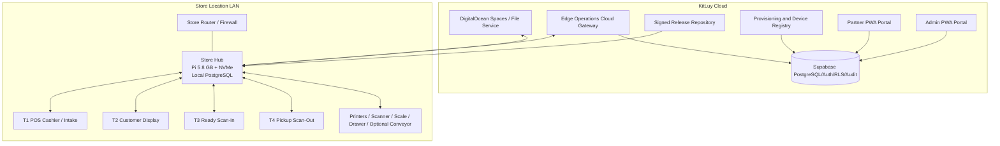
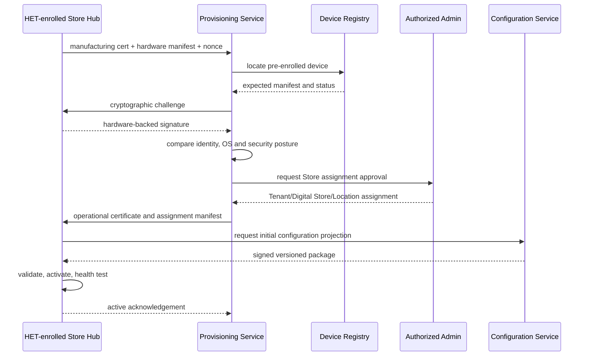

# KitLuy Store Hub — Phase 1 Laundry Specification

**Filename:** `kitluy-storehub-phase1-spec-v1.0.0.md`  
**Version:** v1.0.0  
**Date:** 2026-07-25  
**Product:** KitLuy Store Hub / `kitluy-hub-agent`  
**Owner:** HET / KitLuy Suite Project Owner  
**Primary vertical:** Phase 1 — Laundry  
**Primary deployment:** Raspberry Pi 5, Linux ARM64, local PostgreSQL  
**Status:** OWNER-APPROVED TARGET SPECIFICATION; not implementation evidence  
**Decision dependencies:** Digital-First Store model, T1–T4 Laundry model, smartphone-simple provisioning, closed HET managed-device adoption, replacement-first recovery  
**Audience:** Product owner, solution architects, backend engineers, edge engineers, DevOps, security engineers, POS engineers, QA, support, HET installation and repair teams

> **Mission:** A qualified engineer with no previous KitLuy context must be able to reconstruct, provision, operate, diagnose, update, recover and validate the Phase 1 Store Hub from this specification, approved migrations, API contracts and deployment instructions.

---

## Source, authority and evidence discipline

This specification consolidates the current KitLuy project instructions and the following source families:

- `kitluy-suite-rebuild-bible-v3.0.0.md`
- `kitluy-suite-ecosystem-business-bible-v1.0.0.md`
- `kitluy-admin-pwa-portal-rebuild-bible-v2.0.0.md`
- `kitluy-partner-pwa-portal-rebuild-bible-v1.1.0.md`
- `Device Management & Provisioning System.txt`
- `Project Instruction Writing.txt`
- `kitluy-concept-design-1.txt`
- `kitluy-master-feature-registry-v0.2.md`
- `kitluy-store-hub-managed-device-security-lock-and-build-spec-v1.0.0.md`
- Evidence-based KitLuy comparison and implementation backlog packages for WooCommerce, Toast, Shopify, Lightspeed and Loyverse

Authority order:

```text
1. Current owner decisions and current KitLuy Project Instructions
2. Applied migrations, verified repository code, executable tests and deployment evidence
3. This Store Hub specification
4. Current KitLuy Rebuild and Business Bibles
5. Approved product specifications and handoffs
6. Evidence-based competitor analyses and classifications
7. Competitor clone documents and superseded planning
```

Evidence rules:

- This file defines the approved target contract.
- It does not prove that code, migrations, hardware images, certificates, tests or deployments exist.
- A capability must not be labeled `IMPLEMENTED` until repository, migration, test, deployment and production or pilot evidence exists.
- Unknown deployment-specific values use `[REQUIRED: ...]`. Engineers and AI agents must not silently guess them.
- Any live implementation conflict must be recorded in the reconciliation register before changing production behavior.

### Superseded material

The older three-terminal Laundry model is superseded. Phase 1 uses four logical roles:

- T1 POS Cashier / Intake
- T2 Customer Display Screen
- T3 Clean & Ready Scan-In
- T4 Customer Pickup Scan-Out

T2 is not a production terminal. T3 and T4 may share one physical device but remain separate permissioned modes, workflows and audit streams.

---

# Part 0 — Rebuild and bring-up sequence

Execute in this order.

1. **Approve exact deployment values**
   - Production and staging Supabase project references
   - DigitalOcean project, registry, release repository and Spaces buckets
   - Production domains and certificate authorities
   - PostgreSQL, Node.js and Raspberry Pi OS versions
   - Network ports and firewall rules
   - Certificate expiry and rotation policies
   - Offline retention, backup, RPO and RTO values
   - Supported printer, scanner, scale and UPS models

2. **Prepare cloud control-plane services**
   - Device Registry
   - Provisioning Service
   - Certificate Authority integration
   - Edge Operations API gateway
   - Configuration Projection Service
   - Sync ingestion and acknowledgement workers
   - Release repository and manifest-signing service
   - Fleet health and security-event ingestion

3. **Apply cloud migrations in authorized order**
   - Core Tenant, Digital Store and Location schema
   - Device registry and hardware identity schema
   - Device credentials, assignments and provisioning sessions
   - Release, configuration and command schema
   - Sync, event, audit, file and recovery schema
   - RLS, indexes, constraints and seed profiles

4. **Build the KitLuy OS image**
   - Approved Raspberry Pi OS 64-bit base
   - Hardened Linux configuration
   - PostgreSQL
   - `kitluy-hub-agent`
   - Local Edge Operations API
   - Sync engine
   - Hardware adapter service
   - Print and file queues
   - Device monitor
   - Update agent and A/B rollback support
   - Factory-enrollment agent

5. **Enroll Store Hub hardware at HET**
   - Inspect Pi and NVMe
   - Record hardware identifiers
   - Install and verify approved image
   - Generate non-exportable hardware-backed key
   - Issue manufacturing certificate
   - Run hardware and security QA
   - Mark device `provisioning_eligible`

6. **Create a Digital Store and Store Location**
   - Select Laundry vertical
   - Configure catalog, pricing, staff, payment rules and receipt/tag templates
   - Create Location and provisioning package

7. **Provision the Store Hub**
   - Power on
   - Select language
   - Connect to network
   - Enter one-time provisioning code
   - Verify factory identity and cryptographic challenge
   - Assign Tenant, Digital Store and Location
   - Issue operational certificate
   - Download configuration
   - Perform initial synchronization
   - Run local health checks
   - Mark Hub `active`

8. **Provision terminals and peripherals**
   - T1 + T2 front-counter profile
   - T3 + T4 ready/pickup profile
   - Receipt and tag printers
   - Scanners
   - Scale
   - Cash drawer where applicable
   - Optional conveyor interface

9. **Run Phase 1 acceptance tests**
   - Online and offline Booking
   - Cash, deposit and KHQR-state handling
   - Receipt and tag printing
   - T2 display privacy
   - T3 custody and ready verification
   - T4 pickup and final handover
   - WAN loss, Hub restart, terminal reconnect, duplicate delivery and sync recovery
   - Cloned NVMe and unknown-device rejection
   - A/B update and rollback
   - Replacement Hub recovery

10. **Pilot and approve go-live**
    - Security review
    - Restore rehearsal
    - Support handoff
    - Operator training
    - Monitoring and alert verification
    - Rebuild Test sign-off

---

# Part 1 — Product identity and boundaries

## 1.1 Product definition

The KitLuy Store Hub is a managed local edge appliance deployed at a physical Store Location. It is the local operational authority after provisioning and keeps approved Store operations running when public internet or cloud services are unavailable.

The Store Hub is more than an IoT gateway. It hosts local business state, validates commands, persists operational transactions, coordinates T1–T4, drives local peripherals, queues files and prints, and synchronizes with KitLuy Cloud asynchronously.

## 1.2 Canonical identity

| Field | Value |
|---|---|
| Product name | KitLuy Store Hub |
| Runtime/service | `kitluy-hub-agent` |
| Product type | Managed internal edge build |
| Primary hardware | Raspberry Pi 5, 8 GB RAM, 256 GB NVMe minimum recommendation |
| OS | Approved 64-bit Raspberry Pi OS or approved Linux ARM64 image |
| Local database | PostgreSQL |
| Cloud relationship | Configuration projection down; transactions and events up |
| Primary API | Edge Operations API over authenticated Store LAN and mTLS cloud connections |
| Primary vertical | Laundry Phase 1 |

## 1.3 The Hub owns

- Local operational PostgreSQL
- Local command validation and transaction boundaries
- T1–T4 device sessions and LAN authorization
- Laundry Booking, custody and pickup execution while offline
- Local operational event ledger
- Print queue and duplicate suppression
- Local file repository and upload queue
- Peripheral discovery, configuration and health
- Store Location configuration activation
- Outbox/inbox synchronization and cloud acknowledgements
- Signed release download and local distribution
- Hub and terminal health reporting
- Recovery checkpoints and support diagnostics

## 1.4 The Hub does not own

- Tenant or Digital Store creation
- Cloud identity-provider accounts
- Platform-wide RBAC policy design
- Subscription billing authority
- Public Storefront or marketplace truth
- Cloud configuration authorship
- Statutory accounting or complete ERP functions
- Arbitrary third-party plugin execution
- Direct third-party production-database access
- Autonomous approval of financial, compliance or security-sensitive changes

## 1.5 Authority split

| Data class | Authoritative owner |
|---|---|
| Tenant, Digital Store, Location and approved configuration | KitLuy Cloud |
| Local operational transaction before cloud acknowledgement | Store Hub |
| Finalized local operational and custody events | Append-only Hub ledger, then cloud replica |
| Cloud reports | Cloud read models with explicit `data_as_of` and sync freshness |
| Files while WAN is unavailable | Store Hub local repository |
| Long-term file storage | DigitalOcean Spaces, with cloud metadata and permissions |
| Device factory trust | HET Device Registry and KitLuy PKI |
| Terminal role assignment | Cloud configuration, enforced locally by Hub |

---

# Part 2 — Phase 1 scope

## 2.1 Required capabilities

Phase 1 Store Hub must support:

- Digital Store-first Location provisioning
- Closed HET-only hardware enrollment
- Composite device identity and certificate trust
- Local PostgreSQL authority
- T1–T4 authenticated LAN operation
- Customer and Laundry Booking lookup
- Per-piece, per-weight and mixed service lines
- Garment, bag and tag tracking
- Deposits, balances, cash and approved KHQR states
- Receipts and laundry tags
- T3 Ready Scan-In and storage-position assignment
- T4 Pickup Scan-Out and handover
- Rewash, damage, missing-item and quality exceptions
- Local files and evidence photos
- Durable print queue
- Printer, scanner, scale, display and drawer adapters
- Versioned configuration projection
- Outbox/inbox synchronization
- Idempotency, cursors and deterministic replay
- Health, logs, diagnostics and recovery
- Signed staged releases and A/B rollback
- Pre-enrolled replacement-Hub recovery

## 2.2 Explicitly outside Phase 1

- Restaurant KDS, tables, checks, tabs and kitchen firing
- Retail self-checkout
- Pharmacy controlled-item workflows
- Open public plugin marketplace
- Arbitrary code inside the Hub transaction path
- Direct connectors to the local or cloud production database
- Cloud-only printing
- Offline card capture
- Hub-authored catalog or pricing configuration
- Automatic approval of unknown Raspberry Pi hardware
- Store-staff NVMe replacement or reimaging
- A Laundry production display presented as T2

## 2.3 Optional Phase 1 depth

These may be prepared in the architecture but require separate release approval:

- Conveyor controller integration
- Dedicated Laundry Production Display
- Terminal-side short-lived queue for brief Hub LAN loss
- Advanced power-loss telemetry
- TPM remote attestation beyond key proof
- Multi-Hub high availability

---

# Part 3 — Deployment topology



## 3.1 Store LAN rules

- Gigabit Ethernet is primary for the Hub.
- Wi-Fi is an optional fallback, not the preferred operational link.
- Router-managed DHCP reservations are recommended.
- The Hub advertises a signed discovery record on the LAN.
- Terminals cache the assigned Hub UUID, certificate fingerprint, hostname and last successful IP.
- Manual IP entry is a recovery fallback only.
- IP address never establishes trust.
- No public inbound internet port is required.
- The Hub initiates outbound mTLS connections to approved KitLuy endpoints.

## 3.2 Network containment

The production Hub must not become a general-purpose bridge:

- IP forwarding disabled
- NAT disabled
- Network bridging disabled
- Default-deny host firewall
- Only required LAN services exposed
- Only approved outbound destinations permitted where practical
- No Supabase service-role key on POS terminals
- No direct production DB credentials exposed to terminals or connectors
- Time-limited, consented and audited support access only

## 3.3 Recommended network segmentation

```text
Store Router / Firewall
├── Customer or guest network
├── Business office network
└── KitLuy operational VLAN
    ├── Store Hub
    ├── T1/T2 terminal
    ├── T3/T4 terminal
    └── Approved peripherals
```

---

# Part 4 — Hardware profile

## 4.1 Store Hub reference bill of materials

| Component | Minimum target | Production recommendation |
|---|---|---|
| Compute | Raspberry Pi 5, 8 GB | Raspberry Pi 5, 8 GB |
| Storage | 256 GB NVMe | Industrial/high-endurance 256 GB or greater NVMe |
| NVMe interface | Approved Pi 5 M.2 HAT | HET-certified model |
| Network | Gigabit Ethernet | Gigabit Ethernet with managed router reservation |
| Power | Official-quality USB-C PSU | Approved PSU plus UPS and surge protection |
| Cooling | Active cooling | Vented, tamper-evident enclosure with active cooling |
| Key protection | Secure element or TPM | HET-certified non-exportable key module |
| Time | NTP plus RTC optional | RTC recommended where prolonged WAN loss is expected |
| Enclosure | Protected | Locked or tamper-evident mounting |

## 4.2 Terminal reference profiles

| Profile | Physical recommendation | Logical roles |
|---|---|---|
| Front Counter | Pi 5 4 GB or approved terminal, touchscreen, secondary display | T1 + paired T2 |
| Ready/Pickup | Pi 5 4 GB or approved terminal, scanner | T3 + T4 separate modes |
| High-volume | Multiple certified terminals | Multiple T1/T2, T3 and T4 instances |

## 4.3 Supported peripheral classes

- ESC/POS receipt printers
- TSPL, ZPL or approved label/tag printers
- USB, serial or HID scales
- Keyboard-wedge and HID barcode/QR scanners
- Printer-driven cash drawers
- Secondary customer displays
- Optional approved conveyor controller
- UPS telemetry where supported

Every physical model requires a hardware profile containing driver, firmware, interface, capabilities, health tests and certification evidence.

---

# Part 5 — Software architecture

## 5.1 Runtime components

```text
kitluy-hub-agent
├── bootstrap-service
├── identity-agent
├── local-api-gateway
├── auth-session-service
├── configuration-agent
├── laundry-command-service
├── event-ledger
├── sync-engine
├── file-queue-service
├── print-service
├── hardware-adapter-service
├── discovery-service
├── terminal-session-service
├── release-agent
├── health-agent
└── support-diagnostics-agent
```

## 5.2 Recommended service management

- System services managed by `systemd`
- Dedicated least-privilege Linux service users
- Automatic restart with bounded backoff
- Watchdog and health dependencies
- Structured logs to local rotating storage
- No service runs as root unless technically required and explicitly reviewed

## 5.3 Filesystem layout

```text
/opt/kitluy/
├── current/                 # active application release
├── releases/                # verified release bundles
├── config/                  # encrypted operational configuration
├── certs/                   # public certs and protected key references
├── manifests/               # device, config and release manifests
├── adapters/                # signed hardware adapters
├── support/                 # generated diagnostic bundles
└── bin/

/var/lib/kitluy/
├── postgres/
├── files/
│   ├── pending/
│   ├── active/
│   └── quarantine/
├── print-queue/
├── sync/
│   ├── outbox/
│   ├── inbox/
│   └── dead-letter/
├── backups/
└── update-state/

/var/log/kitluy/
```

Exact paths may change only through an approved migration and recovery plan.

---

# Part 6 — Managed-device identity and security

## 6.1 Closed HET enrollment

Only devices physically processed by HET may become trusted KitLuy devices.

```text
HET receives device
→ inspect and record hardware
→ install approved KitLuy OS
→ generate hardware-backed key
→ issue manufacturing certificate
→ run security and hardware QA
→ mark provisioning_eligible
→ ship to Store or spare inventory
```

Installing a copied KitLuy OS on an unknown Pi must not make it provisionable.

## 6.2 Trust equation

```text
Trusted KitLuy Device
=
Pre-existing HET registry record
+ matching hardware manifest
+ valid manufacturing certificate
+ proof of non-exportable private-key possession
+ approved secure-boot and OS state
+ authorized Store assignment
```

## 6.3 Identity hierarchy

### Hardware device identity

Persists while the original Pi board and hardware-backed key remain intact:

- `kitluy_device_id`
- Raspberry Pi factory DUID
- Raspberry Pi board serial
- Board model and revision
- Secure-element or TPM identity
- Manufacturing public-key fingerprint

### Installation identity

Changes when storage or OS installation changes:

- `installation_id`
- NVMe serial, model and capacity
- OS image release and SHA-256
- Bootloader version
- Secure-boot signing generation
- Storage-encryption generation
- Installation technician and station

### Store assignment identity

Changes when assigned, moved, replaced or decommissioned:

- `assignment_id`
- Tenant ID
- Digital Store ID
- Store Location ID
- Device profile
- Operational certificate
- Assignment generation

## 6.4 Required identifiers

| Identifier | Classification | Mismatch behavior |
|---|---|---|
| KitLuy device UUID | Root | Hard reject |
| Pi factory DUID | Root | Hard reject |
| Pi board serial | Root | Hard reject |
| Secure-element identity | Root | Hard reject |
| Hardware-backed public key | Root | Hard reject |
| Manufacturing certificate | Root | Hard reject |
| NVMe serial | Installation | Quarantine; HET maintenance required |
| OS image hash | Installation | Hard reject or recovery mode |
| Secure-boot state | Installation | Hard reject |
| Factory MAC addresses | Supporting mandatory evidence | Quarantine on unexplained mismatch |
| Linux machine ID | Supporting | Clone alert |
| Filesystem UUID | Supporting | Clone or reimage alert |
| IP address | Operational only | Never trusted as identity |

## 6.5 Cryptographic keys

- Private keys must be generated inside a TPM, secure element or approved non-exportable key store.
- Private keys must never be uploaded, exported, logged or included in backups.
- Cloud authentication uses mTLS and challenge-response proof.
- Manufacturing and operational certificates are separate.
- Certificate revocation must take effect at the cloud gateway and during local terminal trust checks.

## 6.6 Manufacturing certificate

Permitted only to:

- Contact provisioning endpoints
- Submit hardware manifest and attestation
- Request approved bootstrap updates
- Request Store assignment

It cannot access customer, Booking, payment or finance data.

## 6.7 Operational certificate

Bound to:

- Device ID
- Tenant
- Digital Store
- Store Location
- Device type and profile
- API scopes
- Credential generation
- Validity period

## 6.8 Secure boot and system integrity

Production Hubs must target:

- KitLuy-signed boot chain
- Approved secure-boot key generation
- Verified read-only system partition using `dm-verity` or equivalent
- Encrypted writable operational-data partition
- Signed application and hardware-adapter bundles
- A/B release partitions or equivalent rollback design
- Disabled unnecessary boot modes and debug interfaces

Irreversible OTP or debug-lock operations require a tested HET manufacturing runbook and recovery proof.

## 6.9 Unknown or mismatched device behavior

```text
PROVISIONING_DENIED
→ no Store configuration
→ no operational certificate
→ no customer, Booking or payment data
→ device quarantined
→ immutable security event
→ HET alert
```

The Admin Portal must not provide an “approve unknown Raspberry Pi” action.

---

# Part 7 — Device and provisioning lifecycle

## 7.1 Lifecycle states

```text
received
→ inspected
→ hardware_recorded
→ imaging
→ image_verified
→ factory_enrolled
→ tested
→ provisioning_eligible
→ assigned
→ active
```

Exceptional states:

```text
maintenance_required
quarantined
suspended
revoked
lost
stolen
failed
replaced
decommissioned
destroyed
```

## 7.2 Provisioning sequence



## 7.3 Provisioning code boundary

A provisioning code:

- Is short-lived
- Is single-use
- Is bound to an approved device and intended Store context
- Authorizes an assignment attempt only
- Does not create hardware trust
- Cannot bypass certificate or hardware mismatch

## 7.4 Initial synchronization

The Hub becomes `active` only after:

- Operational certificate installed
- Location configuration activated
- Required catalog and pricing snapshot present
- Required staff and role projection present
- Receipt/tag templates verified
- Device profile loaded
- Local database migrations complete
- Outbox and inbox initialized
- Local API and discovery healthy
- Time synchronization acceptable
- Required peripherals pass or receive an approved waiver

## 7.5 Terminal pairing

Connection priority:

```text
1. Assigned Hub private IP
2. Assigned Hub hostname
3. Signed automatic LAN discovery
4. Last successful Hub IP
5. Latest Hub IP reported through cloud
6. Manual IP recovery override
```

A terminal must verify:

- Hub device UUID
- Hub operational certificate
- Tenant
- Digital Store
- Store Location
- Assigned terminal profile
- Certificate revocation state

## 7.6 Terminal profiles

| Profile | Allowed roles | Notes |
|---|---|---|
| `laundry_front_counter` | T1 + paired T2 | T2 has no independent financial authority |
| `laundry_ready_pickup` | T3 + T4 | Separate modes, permissions and event types |
| `laundry_t3_dedicated` | T3 only | Medium/high-volume deployment |
| `laundry_t4_dedicated` | T4 only | Medium/high-volume deployment |

---

# Part 8 — Local data model

Exact DDL belongs in versioned migrations. The following logical entities are mandatory.

## 8.1 Device and configuration

- `hub_device`
- `hub_installation`
- `hub_assignment`
- `hub_credentials`
- `terminal_devices`
- `terminal_sessions`
- `hardware_profiles`
- `hardware_instances`
- `configuration_packages`
- `configuration_activations`
- `release_manifests`
- `release_installations`

## 8.2 Operational core

- `customers`
- `laundry_bookings`
- `laundry_booking_lines`
- `laundry_garments`
- `laundry_bags`
- `laundry_tags`
- `laundry_status_history`
- `laundry_exceptions`
- `storage_positions`
- `storage_assignments`
- `custody_events`
- `payments`
- `payment_attempts`
- `receipts`
- `shifts`
- `cash_movements`

## 8.3 Edge infrastructure

- `local_events`
- `sync_outbox`
- `sync_inbox`
- `sync_cursors`
- `sync_conflicts`
- `dead_letter_items`
- `print_jobs`
- `print_attempts`
- `local_assets`
- `file_upload_jobs`
- `peripheral_bindings`
- `peripheral_health`
- `device_heartbeats`
- `security_events`
- `support_sessions`

## 8.4 Authoritative data rules

- Financial, payment, custody and audit events are append-only.
- Corrections use compensating events, not destructive updates.
- Inventory or consumable movements use ledgers, never generic last-write-wins quantity replacement.
- Configuration is versioned and server-wins.
- JSON may store optional diagnostics but not authoritative core fields.
- Every local record is scoped to Tenant, Digital Store and Location.
- Every sensitive event records actor, device, session, timestamp and reason where applicable.

## 8.5 Event envelope

```json
{
  "event_id": "uuid",
  "tenant_id": "uuid",
  "digital_store_id": "uuid",
  "location_id": "uuid",
  "hub_device_id": "uuid",
  "terminal_device_id": "uuid|null",
  "actor_id": "uuid|null",
  "aggregate_type": "laundry_booking",
  "aggregate_id": "uuid",
  "event_type": "laundry.booking_created",
  "aggregate_version": 1,
  "occurred_at": "2026-07-25T09:00:00+07:00",
  "business_date": "2026-07-25",
  "local_sequence": 10423,
  "idempotency_key": "location:{location_id}:hub:{hub_id}:seq:10423",
  "schema_version": 1,
  "payload_sha256": "hex",
  "payload": {}
}
```

---

# Part 9 — Edge Operations API

## 9.1 API principles

- Versioned under `/edge/v1`
- mTLS or device-session authentication
- Tenant, Digital Store, Location, role and device scope enforced
- Idempotency required for mutations
- Typed errors
- Correlation IDs
- Retry-safe results
- Complete audit for sensitive operations
- No direct terminal access to local PostgreSQL

## 9.2 Required route families

### Health and identity

```text
GET  /edge/v1/health
GET  /edge/v1/identity
GET  /edge/v1/config/status
POST /edge/v1/session/open
POST /edge/v1/session/refresh
POST /edge/v1/session/close
```

### Customer and Booking

```text
GET  /edge/v1/customers/search
POST /edge/v1/customers
GET  /edge/v1/bookings/{id}
POST /edge/v1/bookings
POST /edge/v1/bookings/{id}/lines
POST /edge/v1/bookings/{id}/confirm-intake
POST /edge/v1/bookings/{id}/status-events
```

### Payments and documents

```text
POST /edge/v1/bookings/{id}/payments
GET  /edge/v1/bookings/{id}/payment-state
POST /edge/v1/bookings/{id}/receipts
POST /edge/v1/bookings/{id}/tags
```

### T3 Ready Scan-In

```text
POST /edge/v1/ready-scan/sessions
POST /edge/v1/ready-scan/{session_id}/items
POST /edge/v1/ready-scan/{session_id}/exceptions
POST /edge/v1/ready-scan/{session_id}/storage
POST /edge/v1/ready-scan/{session_id}/complete
```

### T4 Pickup Scan-Out

```text
POST /edge/v1/pickup-scan/sessions
POST /edge/v1/pickup-scan/{session_id}/verify-customer
POST /edge/v1/pickup-scan/{session_id}/items
POST /edge/v1/pickup-scan/{session_id}/payment
POST /edge/v1/pickup-scan/{session_id}/complete
```

### Hardware and print

```text
GET  /edge/v1/peripherals
POST /edge/v1/peripherals/discover
POST /edge/v1/peripherals/{id}/test
POST /edge/v1/print-jobs
GET  /edge/v1/print-jobs/{id}
POST /edge/v1/print-jobs/{id}/retry
```

### Sync and support

```text
GET  /edge/v1/sync/status
POST /edge/v1/sync/request
GET  /edge/v1/diagnostics/summary
POST /edge/v1/support-sessions/authorize
POST /edge/v1/support-sessions/{id}/revoke
```

## 9.3 Mutation response pattern

```json
{
  "request_id": "uuid",
  "idempotency_key": "string",
  "result": "accepted",
  "aggregate_id": "uuid",
  "aggregate_version": 4,
  "local_event_ids": ["uuid"],
  "accepted_at": "timestamptz",
  "sync_state": "pending_cloud_sync"
}
```

---

# Part 10 — Laundry T1–T4 orchestration

## 10.1 T1 POS Cashier / Intake

T1 responsibilities:

- Authenticate staff and active shift
- Search or create customer
- Capture garments, bags, piece count and weight
- Select services and add-ons
- Apply approved pricing and discounts
- Record due and pickup expectations
- Capture deposit, full payment or approved pay-at-pickup state
- Print receipt and laundry tags
- Create custody intake events
- Display live customer-safe information to T2

T1 succeeds after local Hub persistence. Cloud acknowledgement is not on the critical path.

## 10.2 T2 Customer Display Screen

T2 may display:

- Store identity
- Current customer-safe Booking lines
- Weight and quantities
- Discounts and totals
- Deposit and balance
- KHQR payload and payment state
- Receipt choice
- Pickup reference
- Completion or thank-you state

T2 must not display:

- Other customers’ data
- Staff PINs or internal notes
- Full customer history
- Device secrets
- Internal fraud or security flags

T2 has no independent Booking, payment or production authority.

## 10.3 T3 Clean & Ready Scan-In

T3 must verify:

- Booking identity
- Expected garment or bag count
- Actual count
- Quality-control result
- Packaging condition
- Rewash, damage or missing-item exceptions
- Storage, rack, shelf or conveyor position
- Staff and terminal identity

A Booking cannot become `Ready` with unresolved blocking exceptions unless an authorized manager performs an action-scoped override with reason and audit.

Required events include:

```text
laundry_ready_scan_started
laundry_item_ready_scanned
laundry_ready_count_verified
laundry_storage_position_assigned
laundry_booking_marked_ready
customer_ready_notification_requested
```

## 10.4 T4 Customer Pickup Scan-Out

T4 lookup may use:

- Phone number
- Customer ID
- Booking number
- Receipt barcode or QR
- Laundry tag barcode
- Bag barcode
- Pickup QR
- Customer name with secondary verification
- Storage position

Final completion must verify:

- Customer or authorized collector identity
- Booking is Ready
- Expected and actual scanned items
- Storage position consistency
- Remaining balance and payment policy
- No unresolved blocking exception
- Staff and terminal identity
- Handover confirmation

Required events include:

```text
laundry_pickup_started
laundry_customer_verified
laundry_storage_retrieval_started
laundry_item_scanned_out
laundry_pickup_count_verified
laundry_balance_collected
laundry_handover_confirmed
laundry_booking_picked_up
laundry_storage_position_cleared
```

## 10.5 Chain-of-custody rule

Every intake, scan, count, storage assignment, exception, retrieval and handover is append-only, actor-scoped and device-scoped.

---

# Part 11 — Offline operation and synchronization

## 11.1 Offline authority

During WAN failure:

- T1–T4 continue through the Hub LAN
- Cash transactions continue
- Approved KHQR states follow documented degraded behavior
- Receipts and tags continue printing
- Customer and Booking lookup uses local data
- T3/T4 custody workflows continue
- Files remain local and queued
- Cloud portals become stale and must show freshness

## 11.2 Outbox

Every local mutation produces an immutable outbox item in the same local database transaction.

Outbox requirements:

- Ordered local sequence
- Unique event ID
- Idempotency key
- Payload hash
- Retry count
- Next-attempt time
- Last error
- Cloud acknowledgement
- Dead-letter state

## 11.3 Inbox

Cloud-to-Hub messages include:

- Versioned configuration packages
- Device revocation data
- Certificate and trust updates
- Approved commands
- Release manifests
- Notification acknowledgements
- Reconciliation responses

Inbox messages must be signature-verified, deduplicated and applied transactionally.

## 11.4 Conflict policy

| Data class | Policy |
|---|---|
| Finance and payment | Append-only, explicit reconciliation or compensating events |
| Custody and pickup | Append-only; operator review for inconsistent sequence |
| Inventory movement | Ledger-based; no LWW quantity overwrite |
| Configuration | Versioned cloud/server-wins package |
| Device status | Latest signed observation with history retained |
| Safe profile metadata | Version comparison and audited LWW only where approved |

## 11.5 Sync phases

```text
collect local batch
→ validate envelope and hashes
→ push oldest unacknowledged events
→ cloud deduplicates and applies
→ receive per-event result
→ persist acknowledgements
→ pull signed inbox messages
→ apply configuration or commands
→ update sync cursor and health
```

## 11.6 Reconnect UX

The Hub and terminals must distinguish:

- LAN unavailable
- Hub unavailable
- WAN unavailable
- Cloud degraded
- Payment provider unavailable
- Sync backlog
- Configuration activation failure
- Peripheral failure

Do not present cached or stale cloud data as live truth.

---

# Part 12 — Printing, files and peripherals

## 12.1 Durable print service

Print jobs must be persisted before dispatch.

Required fields:

- Print job ID
- Document type
- Template version
- Target printer/profile
- Payload checksum
- Copy count
- Status
- Attempt history
- Duplicate-suppression key
- Actor and device

States:

```text
queued → dispatching → printed
                 ↘ failed → retrying → dead_letter
```

A retry must not silently print duplicate financial or custody documents. Reprint requires an explicit reprint event and reason where policy requires it.

## 12.2 Printer fallback

Fallback must be profile-driven and auditable:

- Receipt printer to approved backup receipt printer
- Tag printer to approved backup tag printer
- No automatic cross-document fallback that produces an invalid format
- User-visible destination before confirming reprint

## 12.3 Local file repository

The Hub stores operational files needed during offline operation:

- Garment and damage photos
- Receipt and tag render artifacts
- Booking attachments
- Local thumbnails
- Support evidence
- Pending exports where approved

Files require:

- Asset ID
- Tenant/Digital Store/Location scope
- MIME and size
- SHA-256 checksum
- Local path
- Upload status
- Cloud object key when confirmed
- Retention class
- Encryption state

Cloud metadata must not claim that a file is available in Spaces before upload confirmation.

## 12.4 Scale handling

Scale readings record:

- Device ID
- Raw reading
- Tare
- Stable reading
- Unit
- Stability/confidence state
- Captured-at timestamp
- Actor and terminal

Unstable readings must be clearly marked and must not silently become authoritative weight.

## 12.5 Peripheral health

Health states:

```text
unknown
ready
busy
degraded
disconnected
misconfigured
unsupported
maintenance_required
```

Admin and Partner surfaces consume cloud-reported health with freshness labels. The Hub retains the local authoritative observation.

---

# Part 13 — Configuration projection

## 13.1 Configuration package

A package includes:

- Package ID and version
- Tenant, Digital Store and Location
- Required minimum Hub version
- Catalog and pricing versions
- Staff and role projection
- Terminal assignments
- Payment configuration
- Receipt and tag templates
- Peripheral profiles
- Feature flags and entitlements
- Checksums and signature
- Activation deadline or policy

## 13.2 Activation

```text
download
→ verify signature
→ verify checksums
→ verify compatibility
→ stage in transaction
→ run validators
→ atomically activate
→ retain previous version
→ acknowledge cloud
```

Partial packages must never become active.

## 13.3 Rollback

- Keep at least the previous known-good configuration.
- Rollback is automatic when activation health checks fail.
- Rollback event is audited.
- Sensitive configuration rollback may require authorized human confirmation.

---

# Part 14 — Software releases and updates

## 14.1 Release channels

```text
Internal → Pilot → Stable
```

## 14.2 Release manifest

Each release must contain:

- Release ID and semantic version
- Target product and hardware profile
- Architecture `linux-arm64`
- Package hashes
- Signature
- Minimum compatible config/schema versions
- Migration plan
- Rollback plan
- Health checks
- Release notes
- Promotion state

## 14.3 Distribution

- Hub downloads each approved release once.
- Hub verifies signature and hashes.
- Hub stages the release locally.
- Hub distributes approved terminal packages over LAN.
- Terminals verify packages independently.
- Installation occurs only within approved policy or maintenance window.

## 14.4 A/B rollback

```text
active slot A
→ install candidate to slot B
→ reboot or switch
→ run health checks
→ promote B when healthy
→ revert to A on failure
```

Database migrations must be additive and backward-compatible where possible. A release must not be promoted when rollback cannot preserve authoritative records.

## 14.5 Emergency revocation

KitLuy may block a release or credential generation through signed revocation data. High-impact action requires authorized human approval and immutable audit.

---

# Part 15 — Security model and RBAC

## 15.1 Principal types

- HET internal user
- Partner owner or manager
- Store staff user
- Hub machine identity
- Terminal machine identity
- Cloud service identity
- Approved connector identity
- Time-limited support session

## 15.2 Local authorization

Every mutation checks:

- Active device certificate
- Valid terminal session
- Tenant, Digital Store and Location match
- Assigned device profile
- User role and permission
- Shift or workflow state
- Required action-scoped approval
- Idempotency key

## 15.3 Sensitive actions

Require explicit authorization, reason and audit:

- Manager override
- Payment reversal or adjustment
- Pickup with missing tags/items
- Ready override with unresolved exception
- Certificate rotation
- Device quarantine removal
- Storage replacement registration
- Support access
- Release rollback override
- Data export or destructive maintenance

## 15.4 Security events

Examples:

```text
unknown_device_provisioning_attempted
hardware_manifest_mismatch_detected
certificate_reuse_detected
cloned_installation_identity_detected
secure_boot_validation_failed
device_quarantined
device_revoked
support_session_started
support_session_expired
unauthorized_terminal_role_attempted
```

## 15.5 Secrets

- No privileged cloud secret in browser/Electron bundles
- Hub secrets stored in protected OS configuration or hardware-backed storage
- POS terminals receive scoped device/session credentials only
- Private keys never included in logs or support bundles
- Secrets rotated through versioned, auditable procedures

---

# Part 16 — Observability and support

## 16.1 Health domains

- Hardware temperature, power and storage
- PostgreSQL health and disk usage
- Hub Agent process health
- LAN API availability
- Terminal sessions and heartbeats
- Peripheral health
- Sync backlog and age
- File upload backlog
- Print queue and failures
- Certificate and secure-boot compliance
- Release and configuration versions

## 16.2 Required metrics

```text
hub_uptime_seconds
hub_cpu_temperature_celsius
hub_disk_free_bytes
hub_postgres_connections
hub_api_request_latency_ms
hub_sync_outbox_depth
hub_sync_oldest_pending_seconds
hub_sync_dead_letter_count
hub_file_upload_pending_count
hub_print_queue_depth
hub_terminal_connected_count
hub_peripheral_failure_count
hub_certificate_days_remaining
hub_release_version
hub_config_version
```

Exact thresholds are `[REQUIRED: approved monitoring thresholds]`.

## 16.3 Logs

- Structured JSON
- Correlation and request IDs
- Actor and device IDs where safe
- No secrets or full sensitive payloads
- Local rotation and retention policy
- Upload summaries when WAN returns
- Security logs separated from routine operational logs where practical

## 16.4 Support sessions

A remote support session requires:

- Authorized HET operator
- Store consent where appropriate
- Explicit scope
- Start and expiry time
- Signed command channel
- Complete command and output audit
- Automatic expiration
- Immediate revocation capability

Persistent unrestricted shell access is prohibited.

---

# Part 17 — Backup, recovery and replacement

## 17.1 Backup layers

- Cloud-authoritative synchronized data
- Encrypted Hub backup/checkpoint
- Configuration and release manifests
- Device registry and credential history
- Local pending event and file queues

## 17.2 Backup rules

- Finalized local records remain append-only.
- Backups are encrypted and integrity-checked.
- Restore procedures preserve event IDs and idempotency.
- A restore must not cause duplicate payments, receipts, notifications or custody events.
- Exact local backup cadence, retention, RPO and RTO are `[REQUIRED: owner-approved values]`.

## 17.3 Production failure policy

> Replace the complete Store Hub first; repair the failed unit later at HET.

```text
Hub failure
→ suspend or revoke failed Hub credential
→ select pre-enrolled replacement Hub
→ assign replacement to same Location
→ restore config and synchronized state
→ restore approved encrypted checkpoint where available
→ reconnect T1–T4
→ validate peripherals and workflows
→ reconcile pending operations
→ resume Store
→ return failed unit to HET
```

## 17.4 NVMe failure

Store staff do not replace the NVMe.

At HET:

- Confirm original Pi board and secure-element identity
- Retire failed NVMe record
- Install approved replacement NVMe
- Create new installation ID
- Install approved KitLuy OS
- Generate new storage-encryption material
- Verify original hardware-backed device key
- Rotate affected certificates if required
- Run full QA
- Return the unit to spare inventory

The permanent device ID may remain only when the original Pi board and root hardware key remain intact.

## 17.5 Board or secure-element replacement

A changed board or root key creates a new KitLuy device:

- New device ID
- New hardware enrollment
- New key and certificate
- Old credential revoked
- Old device marked `replaced` or `retired`
- Historical audit linkage preserved

## 17.6 Recovery validation

Before Store operation resumes:

- Hub active and identity compliant
- Configuration current
- Required local records present
- T1–T4 authenticated
- Printers, scanner and scale tested
- Pending payments reviewed
- Custody and storage positions reconciled
- Sync backlog progressing
- Cloud views display correct freshness

---

# Part 18 — Failure and degraded-mode matrix

| Failure | Store behavior | Required response |
|---|---|---|
| WAN unavailable | Continue approved local operations | Queue sync/files; show WAN-offline state |
| Cloud API degraded | Continue local operations | Backoff; preserve outbox |
| Hub unavailable | Normal operational writes blocked | Diagnose/restart or replace Hub |
| Terminal unavailable | Other terminals continue | Replace/reprovision terminal |
| Printer unavailable | Persist print job | Use approved fallback or controlled reprint |
| Scale unavailable | Manual flow only if policy permits | Record override and reason |
| KHQR provider unavailable | Show unavailable/pending accurately | Cash or approved alternative; never fabricate success |
| Disk nearing full | Restrict noncritical files first | Alert; support intervention |
| Database corruption suspected | Stop sensitive writes | Recovery or replacement process |
| Certificate expired/revoked | Authentication denied | HET rotation/recovery |
| Hardware identity mismatch | Quarantine | HET physical inspection |
| Cloned NVMe detected | Reject | Security incident and credential review |
| Release health check fails | Roll back | Preserve records and report failure |
| Configuration package invalid | Keep current known-good config | Reject package and alert |

---

# Part 19 — Admin and Partner Portal integration

## 19.1 Admin Portal owns

- HET device inventory
- Hardware identity manifest
- Manufacturing enrollment
- Certificate issuance and revocation
- Provisioning eligibility
- Store assignment approval
- Fleet health
- Security incidents
- Release channel and rollout control
- Replacement and decommission workflows
- Audited remote-support authorization

## 19.2 Partner Portal owns

- Select existing Digital Store and Location
- Request or view approved Hub assignment
- Create terminal role assignments
- View operational health and freshness
- Run guided peripheral tests
- View recovery status
- Request HET support

Partner users cannot:

- Approve unknown hardware
- Change factory identity
- Replace root keys
- Register a new NVMe
- Override secure boot
- Bypass certificate mismatch
- Directly edit local PostgreSQL

## 19.3 Truth labels

Portal health information must include:

- Source
- Observed at
- Last cloud sync
- Last Hub heartbeat
- Current/last-known label
- Any partial or degraded state

---

# Part 20 — Feature inventory

| Feature ID | Capability | Authority | Phase | Priority |
|---|---|---|---|---|
| `KL-HUB-P1-001` | Store Hub local operational authority | OWNER-LOCKED | Phase 1 | P0 |
| `KL-HUB-P1-002` | Raspberry Pi 5 + NVMe managed appliance | OWNER-LOCKED | Phase 1 | P0 |
| `KL-HUB-P1-003` | Local PostgreSQL operational database | OWNER-LOCKED | Phase 1 | P0 |
| `KL-HUB-P1-004` | Closed HET hardware enrollment | OWNER-LOCKED | Phase 1 | P0 |
| `KL-HUB-P1-005` | Composite device identity | OWNER-LOCKED | Phase 1 | P0 |
| `KL-HUB-P1-006` | Hardware-backed non-exportable key | OWNER-LOCKED | Phase 1 | P0 |
| `KL-HUB-P1-007` | Manufacturing and operational certificates | OWNER-LOCKED | Phase 1 | P0 |
| `KL-HUB-P1-008` | Fail-closed provisioning and quarantine | OWNER-LOCKED | Phase 1 | P0 |
| `KL-HUB-P1-009` | Smartphone-simple Hub provisioning | OWNER-LOCKED | Phase 1 | P0 |
| `KL-HUB-P1-010` | Store LAN discovery and terminal pairing | OWNER-LOCKED | Phase 1 | P0 |
| `KL-HUB-P1-011` | T1–T4 authenticated LAN API | OWNER-LOCKED | Phase 1 | P0 |
| `KL-HUB-P1-012` | T1 Booking intake and local persistence | APPROVED TARGET | Phase 1 | P0 |
| `KL-HUB-P1-013` | T2 customer-safe display projection | OWNER-LOCKED | Phase 1 | P0 |
| `KL-HUB-P1-014` | T3 Ready Scan-In and storage assignment | OWNER-LOCKED | Phase 1 | P0 |
| `KL-HUB-P1-015` | T4 Pickup Scan-Out and handover | OWNER-LOCKED | Phase 1 | P0 |
| `KL-HUB-P1-016` | Append-only custody event ledger | OWNER-LOCKED | Phase 1 | P0 |
| `KL-HUB-P1-017` | Offline outbox/inbox and cursors | APPROVED TARGET | Phase 1 | P0 |
| `KL-HUB-P1-018` | Idempotency and deterministic replay | OWNER-LOCKED | Phase 1 | P0 |
| `KL-HUB-P1-019` | Versioned cloud configuration projection | OWNER-LOCKED | Phase 1 | P0 |
| `KL-HUB-P1-020` | Offline operational file repository | APPROVED TARGET | Phase 1 | P0 |
| `KL-HUB-P1-021` | Durable print queue and duplicate suppression | APPROVED TARGET | Phase 1 | P1 |
| `KL-HUB-P1-022` | Printer/scanner/scale/drawer adapters | APPROVED TARGET | Phase 1 | P1 |
| `KL-HUB-P1-023` | Health, diagnostics and fleet telemetry | APPROVED TARGET | Phase 1 | P1 |
| `KL-HUB-P1-024` | Signed release distribution | OWNER-LOCKED | Phase 1 | P0 |
| `KL-HUB-P1-025` | A/B update and rollback | OWNER-LOCKED | Phase 1 | P0 |
| `KL-HUB-P1-026` | Replacement-first recovery | OWNER-LOCKED | Phase 1 | P0 |
| `KL-HUB-P1-027` | HET-only NVMe repair/reimage | OWNER-LOCKED | Phase 1 | P0 |
| `KL-HUB-P1-028` | Pre-enrolled replacement inventory | OWNER-LOCKED | Phase 1 | P1 |
| `KL-HUB-P1-029` | Network containment | OWNER-LOCKED | Phase 1 | P0 |
| `KL-HUB-P1-030` | Audited, time-limited support access | APPROVED TARGET | Phase 1 | P1 |

---

# Part 21 — QA and acceptance matrix

## 21.1 Provisioning and identity

| ID | Scenario | Expected result |
|---|---|---|
| `HUB-QA-001` | Provision an eligible HET-enrolled Hub | Correct Store assignment and operational certificate issued |
| `HUB-QA-002` | Unknown Pi with copied KitLuy OS | Rejected and quarantined |
| `HUB-QA-003` | Copied NVMe on another Pi | Hardware/key mismatch; rejected |
| `HUB-QA-004` | Reused provisioning code | Rejected with immutable event |
| `HUB-QA-005` | Correct identifiers but invalid certificate | Rejected |
| `HUB-QA-006` | Certificate copied without hardware-backed key | Challenge fails |
| `HUB-QA-007` | Secure-boot or OS hash mismatch | Recovery mode or rejection; no Store data |
| `HUB-QA-008` | Same device identity active twice | Duplicate detected; quarantine and alert |

## 21.2 Offline and sync

| ID | Scenario | Expected result |
|---|---|---|
| `HUB-QA-009` | WAN loss during T1 Booking | Booking, receipt and tag persist locally |
| `HUB-QA-010` | WAN loss during T3/T4 | Custody continues through Hub LAN |
| `HUB-QA-011` | Hub restart with pending outbox | No lost or duplicated event |
| `HUB-QA-012` | Duplicate cloud delivery | Same result returned; no duplicate side effect |
| `HUB-QA-013` | Configuration package partially downloaded | Current config remains active |
| `HUB-QA-014` | Reconnect with large backlog | Oldest-first bounded sync and clear progress UX |
| `HUB-QA-015` | Financial conflict | Explicit reconciliation; no LWW overwrite |

## 21.3 Laundry workflows

| ID | Scenario | Expected result |
|---|---|---|
| `HUB-QA-016` | T1 per-weight Booking | Stable scale reading and price version recorded |
| `HUB-QA-017` | T2 sees current customer Booking | Correct customer-safe projection only |
| `HUB-QA-018` | T3 count mismatch | Ready blocked; exception recorded |
| `HUB-QA-019` | T3 unresolved damage | Ready blocked unless audited override |
| `HUB-QA-020` | T4 wrong customer tag | Pickup blocked |
| `HUB-QA-021` | T4 unpaid required balance | Handover blocked or approved payment collected |
| `HUB-QA-022` | T3 and T4 share device | Mode isolation and separate audit verified |

## 21.4 Printing, files and hardware

| ID | Scenario | Expected result |
|---|---|---|
| `HUB-QA-023` | Printer disconnect after job accepted | Job retained and retryable |
| `HUB-QA-024` | Retry same print command | Duplicate suppressed unless explicit reprint |
| `HUB-QA-025` | Offline garment photo | Stored locally, uploaded once after WAN recovery |
| `HUB-QA-026` | Scale unstable | Reading not silently accepted |
| `HUB-QA-027` | Approved fallback printer | Correct destination and audited fallback |

## 21.5 Release, recovery and security

| ID | Scenario | Expected result |
|---|---|---|
| `HUB-QA-028` | Install signed release | Health checks pass and release promoted |
| `HUB-QA-029` | Tampered release package | Signature/hash failure; rejected |
| `HUB-QA-030` | Candidate release fails health | Automatic rollback |
| `HUB-QA-031` | Production NVMe failure | Replacement Hub restores Store operation |
| `HUB-QA-032` | HET repairs same board with new NVMe | New installation identity; original device ID retained only when root identity matches |
| `HUB-QA-033` | Pi board replacement | New KitLuy device identity required |
| `HUB-QA-034` | Expired support session | Access automatically denied |
| `HUB-QA-035` | Attempt IP forwarding or bridge enablement | Policy/test fails and security alert produced |

---

# Part 22 — Phase gates

| Gate | Required evidence |
|---|---|
| **G0 — Authority** | Owner locks, terminology, scope, security policy and unresolved values recorded |
| **G1 — Contract** | Schema, APIs, events, certificates, state machines, permissions, migrations and rollback approved |
| **G2 — Build** | Hub image, services, migrations, Admin/Partner surfaces and automated tests complete in development |
| **G3 — Integrated verification** | T1–T4, peripherals, offline, sync, security, cloned-device, release and recovery tests pass |
| **G4 — Pilot readiness** | Monitoring, support, spares, backup/restore, training and go-live runbooks ready |
| **G5 — Phase exit / Rebuild Test** | Pilot evidence approved and one qualified engineer reconstructs and operates the Hub from current documentation |

No capability is complete at UI-only or planning-only stage.

---

# Part 23 — Go-live checklist

## Device and security

- [ ] Hub exists in HET Device Registry
- [ ] Hardware manifest verified
- [ ] Manufacturing certificate valid
- [ ] Operational certificate issued
- [ ] Secure boot compliant
- [ ] Approved KitLuy OS and Hub version
- [ ] No duplicate identity
- [ ] Device assigned to correct Tenant, Digital Store and Location

## Local operation

- [ ] PostgreSQL healthy
- [ ] Configuration activated
- [ ] T1/T2 paired
- [ ] T3/T4 paired
- [ ] Receipt printer tested
- [ ] Tag printer tested
- [ ] Scanner tested
- [ ] Scale tested
- [ ] Cash drawer tested where applicable
- [ ] Local file repository healthy

## Workflow

- [ ] Online Booking passed
- [ ] Offline Booking passed
- [ ] Deposit/payment passed
- [ ] Receipt and tags passed
- [ ] T2 privacy passed
- [ ] T3 Ready Scan-In passed
- [ ] T4 Pickup Scan-Out passed
- [ ] Exception and override audit passed

## Recovery

- [ ] WAN recovery passed
- [ ] Hub restart recovery passed
- [ ] Duplicate delivery test passed
- [ ] A/B rollback passed
- [ ] Replacement-Hub runbook rehearsed
- [ ] Backup restore verified

## Operations

- [ ] Monitoring and alerts active
- [ ] Support escalation contacts recorded
- [ ] Spare Hub availability confirmed
- [ ] Store staff trained
- [ ] HET sign-off recorded

---

# Part 24 — Required implementation artifacts

A complete implementation package must contain:

```text
apps-or-services/
└── kitluy-hub-agent/

packages/
├── edge-contracts/
├── device-identity/
├── sync-protocol/
├── hardware-adapters/
├── print-contracts/
└── release-manifests/

supabase/
└── migrations/
    ├── devices-and-identities.sql
    ├── provisioning-and-assignments.sql
    ├── sync-and-events.sql
    ├── files-and-print.sql
    ├── releases-and-config.sql
    ├── rls-and-audit.sql
    └── seeds-hardware-profiles.sql

infra/
├── kitluy-os-image/
├── systemd/
├── firewall/
├── secure-boot/
├── ab-update/
└── manufacturing-station/

docs/
├── factory-enrollment-sop.md
├── store-provisioning-sop.md
├── terminal-pairing-sop.md
├── nvme-repair-sop.md
├── replacement-hub-sop.md
├── certificate-rotation-sop.md
├── incident-response.md
└── go-live-checklist.md

tests/
├── contract/
├── integration/
├── offline/
├── hardware/
├── security/
├── clone-resistance/
├── recovery/
└── release-rollback/
```

---

# Appendix A — Proposed device registry fields

```text
devices
- id
- asset_number
- device_kind
- device_profile
- lifecycle_status
- trust_status
- created_at
- retired_at

device_hardware_identifiers
- id
- device_id
- identifier_type
- normalized_value_hash
- is_factory_identifier
- first_observed_at
- last_observed_at
- is_current
- retired_at

device_installations
- id
- device_id
- installation_generation
- nvme_serial
- nvme_model
- os_release_id
- os_image_sha256
- secure_boot_generation
- storage_key_generation
- installed_at
- installed_by
- status

device_credentials
- id
- device_id
- credential_type
- public_key_fingerprint
- certificate_serial
- issuer
- issued_at
- expires_at
- status
- revoked_at
- revocation_reason
- rotation_generation

device_assignments
- id
- device_id
- tenant_id
- digital_store_id
- location_id
- device_profile
- assignment_generation
- assigned_at
- ended_at
- status
```

---

# Appendix B — Proposed status enums

```text
device_lifecycle_status:
received
inspected
hardware_recorded
imaging
image_verified
factory_enrolled
tested
provisioning_eligible
assigned
active
maintenance_required
quarantined
suspended
revoked
lost
stolen
failed
replaced
decommissioned
destroyed

sync_state:
idle
pending
syncing
degraded
blocked
dead_letter

print_job_status:
queued
dispatching
printed
failed
retrying
dead_letter
cancelled

configuration_status:
downloaded
verified
staged
active
rejected
rolled_back

release_status:
available
downloaded
verified
staged
installing
healthy
failed
rolled_back
revoked
```

---

# Appendix C — Required decisions and values

- `[REQUIRED: exact production domains]`
- `[REQUIRED: production certificate authority and HSM design]`
- `[REQUIRED: approved TPM or secure-element model]`
- `[REQUIRED: Raspberry Pi OS release and support lifecycle]`
- `[REQUIRED: PostgreSQL major version]`
- `[REQUIRED: Node.js LTS version]`
- `[REQUIRED: local LAN ports and discovery protocol details]`
- `[REQUIRED: certificate validity and rotation intervals]`
- `[REQUIRED: monitoring thresholds]`
- `[REQUIRED: local backup cadence and retention]`
- `[REQUIRED: Phase 1 RPO and RTO]`
- `[REQUIRED: offline retention duration and storage watermark policy]`
- `[REQUIRED: approved receipt, tag printer and scale models]`
- `[REQUIRED: Hub and terminal hardware warranty/replacement SLA]`
- `[REQUIRED: final KHQR degraded-mode policy]`
- `[REQUIRED: Hub-authoritative offline receipt/Booking numbering policy]`

---

# Appendix D — Reconciliation register

| Item | Current resolution |
|---|---|
| Older three-terminal model | Superseded by owner-locked T1–T4 model |
| T2 as Scan-In | Rejected; T2 is Customer Display Screen |
| T3 as Scan-Out | Superseded; T3 is Ready Scan-In and T4 is Pickup Scan-Out |
| Provision arbitrary Pi with code | Rejected; closed HET enrollment required |
| Hardware ID alone as authentication | Rejected; hardware-backed key and certificate required |
| Store staff replaces NVMe | Rejected; HET-only maintenance |
| Wait for failed Hub repair | Rejected for production recovery; replace complete Hub first |
| Cloud-dependent Store operation | Rejected after provisioning |
| Cloud-only printing | Rejected |
| Direct connector database access | Rejected |
| Offline card capture | Rejected by current owner decision |

---

# Appendix E — Definition of done

The Phase 1 Store Hub is complete only when:

1. Scope and security decisions are approved and versioned.
2. Hardware identity, certificate and provisioning contracts are implemented.
3. Local schema and Edge Operations API are migrated and tested.
4. T1–T4 operate over LAN without WAN.
5. Finance, payment, custody and audit records are append-only and reconcilable.
6. Files, printing and peripherals survive restart and reconnect.
7. Unknown hardware, cloned NVMe and copied certificates fail closed.
8. Signed releases and A/B rollback pass.
9. Replacement-Hub recovery passes within the approved RTO.
10. Monitoring, support, security and recovery runbooks are operational.
11. A Laundry pilot is approved.
12. One qualified engineer passes the Rebuild Test using current documentation and artifacts.

---

# Version history

| Version | Date | Change |
|---|---|---|
| v1.0.0 | 2026-07-25 | First consolidated Phase 1 Store Hub specification. Incorporates four-terminal Laundry architecture, smartphone-simple provisioning, closed HET managed-device adoption, composite hardware identity, hardware-backed keys, fail-closed provisioning, offline authority, signed releases, A/B rollback and replacement-first recovery. |
