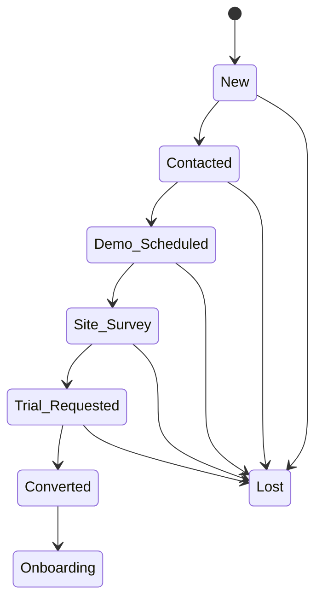
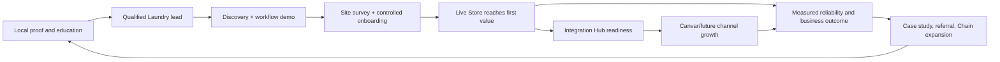
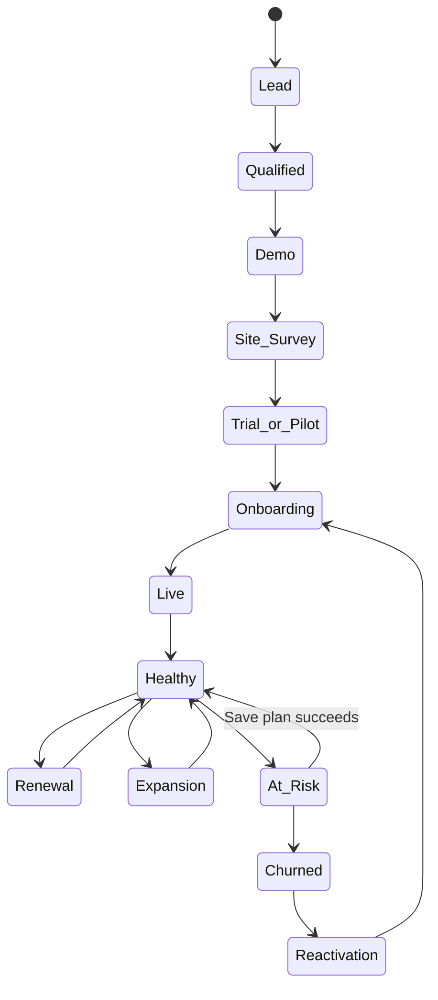
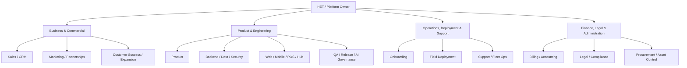

# KitLuy Suite Ecosystem — Business Bible

**Filename:** `kitluy-suite-ecosystem-business-bible-v1.0.0.md`  
**Version:** v1.0.0  
**Date:** 2026-07-13  
**Business:** KitLuy Suite Ecosystem  
**Owner:** HET / KitLuy Suite project owner  
**Primary market:** Cambodia  
**Current vertical:** Laundry  
**Status:** Canonical ecosystem business baseline — successor-ready draft  
**Scope emphasis:** Business positioning, operating model, commercial unknowns, decision rights, continuity controls, and 90-day takeover execution.  
**Successor Test:** *If the current owner and leadership team vanished tomorrow, could a competent operator take control, keep customers operating, sell, support, measure, and grow KitLuy from this file and the referenced assets?*  
**Required answer:** Yes for the documented baseline; full autonomous takeover requires the critical `[REQUIRED: ...]` fields in Appendix C to be closed with approved evidence.

## Source Baseline, Authority, and Evidence Rules

This v1.0.0 ecosystem business bible uses the uploaded Successor Test template and consolidates the current KitLuy source set into one business-operating baseline.

| Source | Version / date | Authority used here |
|---|---:|---|
| `business-bible-ai-template(3).md` | uploaded 2026-07-13 | Required structure, Successor Test, evidence discipline, and output rules. |
| KitLuy Suite project instructions | current as of 2026-07-13 | Highest business-direction authority: Cambodia-first, KitLuy-only current stage, Laundry-first, Partner naming, build boundaries, offline → online → e-commerce sequence, Supabase/DigitalOcean ownership, AI controls, and Claude Code handoff standard. |
| `kitluy-suite-ecosystem-rebuild-bible-v3.0.0.md` | v3.0.0 / 2026-07-10 | Consolidated technical/product baseline, T1/T2/T3 terminal model, Store Hub, Integration Hub, schema/service boundaries, QA and recovery expectations. |
| `kitluy-suite-business-bible-v1.0.0.md` | v1.0.0 / 2026-07-10 | Legacy non-ecosystem-named business draft used as an input. This ecosystem-specific file is the canonical baseline going forward. |
| `kitluy-admin-pwa-portal-rebuild-bible-v2.0.0.md` | v2.0.0 / 2026-07-03 | HET CRM, onboarding, subscriptions/billing, support, fleet operations, audit, platform operations, Integration Hub, and AI governance. |
| `kitluy-chain-portal-rebuild-bible-v2.0.0.md` | v2.0.0 / 2026-07-03 | Multi-store/chain/franchise scope, master catalog, branch reporting, standards, service-availability governance, compliance, royalties, and B2B boundaries. |
| `kitluy-partner-pwa-portal-rebuild-bible-v1.0.0.md` | v1.0.0 / 2026-07-03 | Full one-store back office: services, staff, customers, inventory, finance, reports, settings, Integration Hub, and AI insights. |
| `kitluy-partner-app-rebuild-bible-v1.0.0.md` | v1.0.0 / 2026-07-05 | Owner/manager mobile cockpit, Booking language, Pressing display label, last-known cache, overload/staff-capacity alerts, approvals, and mobile boundaries. |
| `canvar-ecom-spec-productdetail-v1.md` | v1.1.0 / date not stated in file | KitLuy-to-Canvar channel authority, merchant projection, verification, trust, consent, and marketplace boundary only. |
| `PROJECT_HOME.md` and `README.md` | v0.1.0 / 2026-07-11 | Working HET Dev Knowledge OS registration: project ID `HET-PRJ-002`, slug `kitluy`, lifecycle `active`; owner/lead fields remain unassigned and are not treated as approved business ownership. |
| Legacy v1.x bibles | 2026-04 to 2026-06 | Historical context only. Current Partner naming, KitLuy-only boundary, Laundry-first scope, and v3 ecosystem decisions override them. |

### Authority Order

```text
explicit current project-owner decision
  → approved accounting/legal record for financial or legal facts
  → this v1.0.0 ecosystem business baseline
  → current v3 ecosystem rebuild bible
  → current product-specific bibles
  → approved AI handoffs and verified repository evidence
  → older ecosystem/legacy Seller-named documents
```

A live accounting record wins for money; a signed agreement wins for legal obligations; verified migrations/tests win for implemented technical truth. Conflicts must be recorded in Appendix C rather than silently resolved.

### Number and Evidence Provenance

Every externally factual or operating number in this file must include a source and as-of date. The following shorthand applies throughout:

- **`[REQUIRED: ...]`** means no approved value exists in the supplied evidence; the successor must obtain and date it before treating it as fact.
- **“v2.0.0 operating standard”** means a proposed internal control defined by this file, source `kitluy-suite-ecosystem-business-bible-v1.0.0.md`, as of 2026-07-13. It is not historical performance.
- Product versions, document dates, product counts, and project identifiers are sourced from the baseline table above.
- No previous working price, market size, revenue, customer count, headcount, conversion rate, cash balance, or traction claim is promoted to fact unless supported by a dated authoritative record.

### Ecosystem Baseline Lock

The successor must preserve these baseline decisions unless the Platform Owner approves a versioned strategy change:

1. **Current wedge:** KitLuy-only, Laundry-first. Do not make MVP depend on Canvar, SroulERP, Netra, Rotanak, Prajna, HSAL, HSA, PlantOS, or another sibling/future system.
2. **Product sequence:** offline physical-store operation → online management/support/reporting → e-commerce booking/ordering and sales-channel connectors → KitLuy-native AI/RAG/MCP/LLM BI.
3. **Primary builds:** Admin Portal, Chain Portal, Partner Portal, Partner App, POS Desktop, and POS Mobile. Store Hub, File Service, Notification Service, AI Gateway, MCP Server, and RAG Indexer are separate internal services.
4. **Naming:** Partner is business-facing; Tenant is backend/account scope; Seller is legacy mapping only. Partner App uses Booking/Laundry Booking; the ecosystem/backend may use Order where compatibility requires it.
5. **Store rule:** one Store belongs to exactly one vertical. A Laundry Store does not also run Café, Restaurant, or Retail under the same Store record.
6. **Laundry terminal flow:** T1 Intake/Cashier; T2 Scan In and T3 Scan Out are separately permissioned logical modes on one shared conveyor terminal, with separate queues, layouts, and audit events.
7. **Infrastructure ownership:** Supabase owns database/Auth/RLS/Edge Functions/Realtime/vector metadata/audit/permissions; DigitalOcean owns application/service hosting, Spaces heavy-file storage, and the first inference layer.
8. **Commercial posture:** SaaS, implementation/hardware, and approved add-ons; current policy is 0% commission on Partner Laundry Booking revenue. Exact prices remain `[REQUIRED]` until approved in a versioned price book.
9. **Channel posture:** a Partner joins KitLuy first and opts into Canvar or future channels through Integration Hub. KitLuy remains the business operating source of truth; channels receive governed projections.
10. **AI posture:** provider-agnostic, permission-scoped, human-confirmed for sensitive actions, and fully audited. AI must not independently delete, refund, suspend, change pricing, or alter financial truth.

---

## 0. Front Matter — The 90-Day Takeover Sequence

```text
TAKEOVER SEQUENCE — KITLUY SUITE ECOSYSTEM

DAY 0–3: SECURE CONTROL
1. Secure access to the HET legal entity, company records, bank accounts, accounting records,
   Supabase, DigitalOcean, domains/DNS, source control, app stores, payment providers,
   password vault, Google Drive, CRM, support channels, hardware inventory, and the KitLuy
   repository. Immediately rotate privileged credentials and record the rotation in the audit log.
   See Parts 10, 11, 13 and Appendix E.

DAY 1–7: PROTECT LIVE STORES AND REVENUE
2. Identify every live, onboarding, trial, grace, suspended, and cancelled Tenant; every Store;
   every Store Hub and POS device; every unpaid subscription invoice; and every open critical
   support ticket. Produce one reconciled “live business state” report. See Parts 8, 9, 11 and 12.
3. Contact all live Partners and Chain owners. Confirm that POS, Store Hub, receipt/tag printing,
   support contacts, and payment workflows are functioning. Do not introduce migrations, price
   changes, or connector changes during this stabilization window. See Parts 8, 9 and 14.
4. Freeze non-essential production changes until backups, rollback paths, incident owners, and
   the current release inventory are verified. AI tools must not auto-apply production migrations.
   See Parts 9, 13 and 14.

DAY 3–14: UNDERSTAND THE BUSINESS
5. Read the strategic thesis and anti-positioning. KitLuy is Cambodia-first, Laundry-first,
   KitLuy-only at the current stage, and follows offline store operations → online management →
   e-commerce connectors → native AI/RAG/MCP/LLM BI. See Part 2.
6. Identify the money: approved price book, contracted recurring revenue, hardware/service
   revenue, gross margin, cash, burn, receivables, payables, and runway. Where the approved
   source is missing, stop quoting numbers and close the corresponding Appendix C item.
   See Parts 4 and 11.
7. Map who owns sales, onboarding, deployment, support, finance, product, engineering,
   security, and customer success. Assign interim owners for every uncovered role.
   See Part 10.

DAY 7–30: RESTART THE OPERATING RHYTHM
8. Reconcile the CRM pipeline using the canonical stages: New → Contacted → Demo Scheduled →
   Site Survey → Trial Requested → Converted or Lost. Every opportunity must have a next action,
   owner, expected value, and date. See Part 6.
9. Run the customer lifecycle: qualify, demonstrate, site-survey, provision, install, train,
   go-live, monitor, support, renew, expand, and ask for referral. See Parts 6, 8 and 14.
10. Restore the daily, weekly, monthly, and quarterly operating cadence. Publish one dashboard
    for Weekly Operational Stores, recurring revenue, onboarding velocity, support health,
    Store Hub/sync health, Booking activity, and churn risk. See Part 12.

DAY 15–60: FIX CONTROL GAPS
11. Close production-critical open items: price book, legal entity/cap table, customer contracts,
    support SLAs, data retention, incident thresholds, discount authority, financial controls,
    insurance, and regulatory review. See Parts 4, 11, 13 and Appendix C.
12. Validate at least one complete live path: lead → contract → Tenant → Laundry Store → Hub →
    POS → Laundry Booking → payment → receipt/tag → status flow → pickup → cloud sync → Partner
    report → subscription invoice → support/audit evidence. See Part 15.
13. Establish vendor redundancy for cloud hosting, file storage, SMS/push, internet, hardware,
    printers, scanners, scales, and Store Hub replacements. See Part 9.

DAY 45–90: GROW WITHOUT DRIFT
14. Rank growth levers by impact and effort. The default order is: retain live stores, accelerate
    onboarding, improve store activity, add qualified Laundry stores, expand qualified Chains,
    then activate e-commerce connectors such as Canvar. See Part 17.
15. Keep Canvar and future sales channels optional. Partners join KitLuy first, complete their
    business profile, then opt into a sales channel through Integration Hub. KitLuy remains the
    merchant operating source of truth; the channel receives a governed projection.
16. Approve the next-quarter plan only after relevant Part 15 scenarios pass and the financial
    model shows sufficient cash and implementation capacity. See Parts 11, 15, 16 and 17.
```

### First-Day Red Lines

A successor must not:

1. Merge Admin, Chain, Partner, POS, Hub, File, or AI responsibilities.
2. Reintroduce Seller naming; use **Partner** in current business-facing language.
3. Make Laundry MVP depend on Canvar, SroulERP, Netra, Rotanak, Prajna, HSAL, HSA, PlantOS, or any future sibling system.
4. Apply production migrations automatically from an AI tool.
5. Store fractional KHR amounts or silently edit captured financial records.
6. Put heavy-file storage primarily in Supabase Storage; DigitalOcean Spaces is the heavy-file layer.
7. Let AI bypass RBAC, confirmation, or audit controls.
8. Quote unapproved subscription prices or market/traction figures.
9. Treat draft `PROJECT_HOME.md` / `README.md` owner or lead fields as approved assignments; they remain unassigned until leadership publishes the role register.
10. Let an external sales channel become the Partner profile, catalog, customer, payment, or operational source of truth.

---

## Part 1 — Glossary & Lexicon

### 1.1 Strategy and Business Terms

| Term | Canonical definition |
|---|---|
| Cambodia-first | Product and business decisions prioritize Khmer-ready UX, integer KHR money, KHQR readiness, Cambodian phone/address realities, intermittent internet/power, practical SME workflows, and affordable deployment. |
| Laundry-first | Laundry is the first active vertical and the default starting point for product, sales, onboarding, QA, and operations. Other verticals are deferred until the Laundry foundation is stable. |
| KitLuy-only stage | Current-stage features must be owned by KitLuy or represented as optional generic connectors. MVP must not depend on sibling/future systems. |
| Offline → Online → E-commerce | Strategic sequence: digitize in-store operations first; add cloud management and support second; add external ordering/sales-channel connectors third. |
| Vertical | An industry-specific operating bundle containing workflow, lifecycle, schema delta, reports, hardware profile, permissions, and UI—not merely a theme. |
| One Store = One Vertical | A Store is permanently assigned to one vertical. A Laundry Store cannot also run Café, Restaurant, or Retail under the same Store record. |
| Tenant | Backend account representing a business customer organization. It is the isolation, billing, and permission boundary. |
| Partner | Business-facing term for a store owner/operator using KitLuy. Replaces the retired term Seller. |
| Chain | A multi-store brand, branch network, or franchise structure governed through Chain Portal. |
| Platform Owner | HET/KitLuy internal operator with platform-wide authority through Admin Portal. |
| Successor Test | Standard that a competent outsider must be able to operate, sell, support, measure, and grow KitLuy using this bible and referenced assets. |
| Rebuild Test | Engineering standard that a zero-context engineer can reconstruct the product and infrastructure from the rebuild bibles. |
| Source of Truth (SoT) | The designated authoritative system or document for a fact. One fact must have one owner. |
| Strategic debt | An unresolved business decision, assumption, or dependency recorded in Appendix C with an owner and target date. |

### 1.2 Product, Service, and Brand Terms

| Term | Definition and relationship |
|---|---|
| KitLuy Suite | Full Cambodia-first commerce operating ecosystem for stores, chains, HET operations, offline POS, files, notifications, and AI. |
| `kitluy-admin-portal` | HET-only platform control plane: CRM, onboarding, Tenants, billing, fleet health, support, audit, Integration Hub, platform operations, and AI governance. |
| `kitluy-chain-portal` | Multi-store HQ: branch performance, master service catalog, catalog push, brand standards, service-availability governance, compliance, franchise/royalty/B2B expansion. |
| `kitluy-partner-portal` | Full one-store web/PWA back office: services, pricing, Bookings/operations, customers, staff, inventory, finance, reports, Integration Hub, support, and AI. |
| `kitluy-partner-app` | Mobile daily-operations cockpit for the one-store owner/manager. It is not a replacement for Partner Portal and is not a staff POS. |
| `kitluy-pos-desktop-app` | Fixed staff POS on Raspberry Pi/Electron for intake, pricing, payment, receipt/tag printing, shifts, and offline store work. |
| `kitluy-pos-mobile-app` | Roaming staff POS for mobile intake, scan/status, pickup support, and line-busting. |
| `kitluy-hub-agent` / Store Hub | Local store backbone, normally on Raspberry Pi 5, running local database, Hub API, sync, device health, local queue, and offline continuity. |
| `kitluy-file-service` | Signed upload/download and metadata control for files stored in DigitalOcean Spaces. |
| `kitluy-notification-service` | Telegram/SMS/email/push/in-app delivery and delivery-status tracking. |
| `kitluy-ai-gateway` | Provider-agnostic orchestration layer for model routing, policy, logging, RAG, and tool access. |
| `kitluy-mcp-server` | Approved structured tool/action server used by AI under RBAC, confirmation, and audit. |
| `kitluy-rag-indexer` | Worker that chunks, embeds, indexes, and refreshes authorized knowledge sources. |
| Integration Hub | Partner/Admin module through which optional payment, notification, storage, AI, e-commerce, logistics, loyalty, maps, webhook, and ERP-export connectors are governed. |
| Canvar connector | Future/next-stage e-commerce sales-channel connector. The Partner opts in through KitLuy; KitLuy sends an approved marketplace projection. Canvar is not an MVP dependency. |
| Partner not Seller | Current naming rule. Legacy documents and database fields may be mapped, but current product names and business communication use Partner. |
| Booking / Laundry Booking | Preferred business-facing term in Partner App. Older backend/docs may use Order. Both refer to the store service transaction, but mobile UX uses Booking. |

### 1.3 Laundry Operating Terms

| Term | Definition |
|---|---|
| Service Catalog | Active Laundry services, per-kg/per-piece/mixed pricing, add-ons, availability, and policy. |
| Laundry Booking | Customer service transaction containing customer, garments/weight, services, add-ons, due date, payment, status, tags, and evidence. |
| Booking Status | `New`, `Received`, `Washing`, `Drying`, `Pressing/Ironing`, `Ready`, `Picked Up`, `Cancelled`, or `Issue / Rewash / Damaged`. Partner App displays **Pressing**. |
| T1 Intake/Cashier | Terminal that creates the Booking, registers garments, bills the customer, collects deposit/full payment, and prints receipt/tags. |
| T2 Scan In | Logical mode on the shared conveyor terminal. Receives completed garments back to the shop, verifies them, allocates conveyor positions, and marks them ready. |
| T3 Scan Out | Logical mode on the same shared conveyor terminal hardware. Retrieves garments for pickup, clears conveyor positions, and sends the handover to T1. |
| Shared conveyor terminal | One physical terminal that switches between T2 and T3 modes while preserving separate permissions, screens, queues, and audit events. |
| Laundry Tag | Printed identifier attached to garments/bags and used for search, scanning, chain-of-custody, and pickup control. |
| Issue / Rewash / Damaged | Exception status requiring a reason, note, audit event, and evidence where applicable. |
| Service Availability Override | Store-level temporary enable/disable of a service for machine failure, staff shortage, water/power issue, capacity, quality, safety, holiday, or other reason. |
| Sync Freshness | Indicator showing how current cloud data is relative to the Store Hub: fresh, pending, stale, or offline. |
| Last-known cache | Partner App device cache of the last successful store snapshot, shown with clear freshness when connectivity is unavailable. |

### 1.4 Sales and Customer Terms

| Term | Definition |
|---|---|
| Lead | A business or chain not yet qualified for KitLuy. |
| Qualified Lead | A prospect that is in the Laundry ICP, has a reachable decision-maker, an operational pain KitLuy can solve, plausible budget, and a defined next step. |
| SQL | Sales-qualified lead that has completed initial discovery and is eligible for demo/site survey. |
| Demo | Structured product demonstration tied to the prospect’s actual workflow, not a generic feature tour. |
| Site Survey | Assessment of store layout, internet/power, terminal placement, printers, scale/scanner needs, workflow, staffing, and installation readiness. |
| Trial Requested | CRM stage meaning commercial interest and minimum readiness are confirmed and a controlled pilot/trial is requested. |
| Converted | CRM stage meaning the prospect has become an onboarding Tenant under an approved commercial agreement. |
| Activation | Tenant/Store reaches the defined first-value event and required onboarding tasks are complete. |
| Renewal | Continuation of subscription into the next billing period under the approved contract and price book. |
| Expansion | Additional Store, Chain conversion, hardware, storage, AI, support, or connector purchase by an existing Tenant. |
| Churn | A paying subscription becomes cancelled and recurring revenue is removed. Exact measurement is in Appendix A. |

### 1.5 Marketing Terms

| Term | Definition |
|---|---|
| Marketing Qualified Lead (MQL) | A lead meeting minimum fit and engagement criteria but not yet discovery-qualified. Exact scoring is `[REQUIRED]`. |
| Campaign | Time-bounded set of messages, assets, audience, offer, channel, spend, and conversion target. |
| First-touch attribution | Credits the first known acquisition source. Used for awareness-source reporting. |
| Last-touch attribution | Credits the final tracked source before conversion. Used for immediate conversion reporting. |
| Multi-touch review | Manual/analytic review of major touches for higher-value Chain deals. |
| Referral | Lead introduced by an existing Partner, Chain owner, advisor, hardware partner, association, or HET relationship. |
| Proof asset | Case study, before/after workflow, store video, demo dataset, receipt/tag sample, uptime result, or testimonial used to substantiate a claim. |

### 1.6 Finance and Commercial Terms

| Term | Exact definition / formula |
|---|---|
| Commerce Plan | Single-store subscription plan. Final production price is `[REQUIRED]`; no unapproved price may be quoted. |
| Chain Plan | Multi-store subscription plan with HQ and/or per-store pricing. Final production price is `[REQUIRED]`. |
| Add-on | Optional billable capability such as AI tier, storage, premium support, hardware service, implementation, connector, or extra device—only after price-book approval. |
| 0% order commission | Current-stage rule: KitLuy does not take a percentage of Partner Laundry Booking revenue. KitLuy monetizes subscription, services, hardware, and approved add-ons. |
| MRR | Sum of normalized monthly recurring subscription and recurring add-on revenue from active contracts in the period. |
| ARR | `MRR × 12`. |
| GMV | Sum of Partner customer Booking totals processed through KitLuy in a period. GMV is not KitLuy revenue. |
| ARPA | `MRR ÷ average active paying Tenant accounts in period`. |
| ARPS | `MRR ÷ average active paying Stores in period`. |
| Gross Margin | `(revenue − direct cost of delivering that revenue) ÷ revenue`. |
| Contribution Margin | `revenue − variable costs attributable to the customer/store`. |
| CAC | `total sales and marketing expense for a cohort/period ÷ new paying customers acquired`. |
| CAC Payback | `CAC ÷ average monthly gross profit per new customer`. |
| LTV | Canonical provisional formula: `ARPA × gross margin % ÷ monthly logo churn rate`; must be reconciled with cohort reality. |
| LTV:CAC | `LTV ÷ CAC`. |
| Logo Churn Rate | `paying customers lost in period ÷ paying customers at start of period`. |
| Revenue Churn Rate | `churned recurring revenue in period ÷ opening recurring revenue`. |
| NRR | `(opening MRR + expansion − contraction − churn) ÷ opening MRR`. |
| Burn | `cash operating outflows − cash operating inflows` for the month when outflows exceed inflows. |
| Runway | `unrestricted cash ÷ average monthly net burn`. If profitable, report cash and operating profit instead of a misleading runway. |
| KHR money rule | All KHR operational/financial values are stored as integer KHR; no fractional KHR. |

### 1.7 Operations, Security, and Legal Terms

| Term | Definition |
|---|---|
| RLS | PostgreSQL Row Level Security enforcing Tenant/Store/Chain access boundaries. |
| RBAC | Role-Based Access Control specifying who may view or perform a capability. |
| Sensitive action | Refund, void, price change, suspension, remote device action, export, credential change, or AI-assisted action that requires elevated permission, reason, confirmation, and audit. |
| Domain event | Immutable record of a meaningful business/system change such as `tenant_created`, `booking_ready`, or `hub_heartbeat_received`. |
| Audit log | Append-only record of actor, role, action, target, before/after state, reason, device/IP, and timestamp. |
| RPO | Maximum acceptable data loss window after an incident. Final production target is `[REQUIRED]`. |
| RTO | Maximum acceptable service restoration time. Final production target is `[REQUIRED]`. |
| SLA | Measurable service commitment for response, restoration, onboarding, or delivery. |
| DPA | Data Processing Agreement governing personal/business data processing. |
| Production change freeze | Temporary restriction on non-critical releases during takeover, incident, peak operation, or failed validation. |

### 1.8 Decision-Critical Metrics

| Metric | Exact formula |
|---|---|
| Weekly Operational Stores (WOS) | Count of live Stores that complete at least `[REQUIRED: minimum completed Bookings]` and successfully sync at least once during the week. This is the North Star. |
| Store Activation Rate | `Stores reaching activation within SLA ÷ Stores entering onboarding in cohort`. |
| Time to First Value | Median elapsed time from signed/approved onboarding start to first successfully completed and cloud-synced Laundry Booking with receipt/tag. |
| Weekly Booking Volume | Count of completed or accepted Laundry Bookings in the reporting week, segmented by Store and status. |
| Store Retention | `Stores active at period end from opening cohort ÷ Stores in opening cohort`, excluding approved closures/migrations per policy. |
| Sync Healthy Rate | `Store-hours with Hub heartbeat and sync freshness inside threshold ÷ total expected store-hours`. |
| Support SLA Attainment | `tickets meeting first-response and resolution target ÷ eligible tickets`. |
| Rewash/Damage Rate | `Bookings with rewash or damage incident ÷ completed Bookings`. |
| Onboarding Cycle Time | Median days from Converted to Go-Live approval. |
| Pipeline Coverage | `qualified weighted pipeline for target period ÷ new recurring revenue target`. |

---

## Part 2 — Business Overview & Thesis

### 2.1 What KitLuy Is

KitLuy Suite is a **Cambodia-first, offline-to-online-to-e-commerce commerce operating ecosystem for SMEs and chains, starting with Laundry**. It combines local store operations, management portals, chain oversight, HET platform administration, offline continuity, file/evidence handling, integrations, notifications, and provider-agnostic AI business intelligence.

On a napkin: **KitLuy helps a Laundry business run the physical shop correctly, see and manage the business online, and later connect to internet sales channels without rebuilding merchant identity, catalog, or operations in every marketplace.**

### 2.2 What KitLuy Is Not

KitLuy is not a generic cloud POS clone, not an ERP replacement, not a consumer marketplace, and not a single monolithic application. It does not merge HET Admin operations, Chain HQ control, one-store Partner management, staff POS, Store Hub, file storage, or AI governance.

The current MVP is not dependent on Canvar or any sibling system. Canvar is a future/next-stage optional sales channel. Partners must join KitLuy first, complete their business profile, and then opt into Canvar or another channel through Integration Hub.

KitLuy does not currently monetize by taking a percentage of a Partner’s Laundry Booking revenue. It is SaaS-first with 0% order commission; any future transaction-based model requires explicit strategy, contract, financial, and customer approval.

### 2.3 Mission, Vision, and Operating Values

**Mission:** Enable Cambodian businesses to operate professionally offline, manage confidently online, and expand into digital commerce without losing control of their identity, customers, workflow, or data.

**Vision:** Become the Cambodia-first commerce operating layer that connects physical stores, owners, chains, staff, customers, sales channels, and AI through one governed business account.

| Value | Required behavior |
|---|---|
| Start from the shop floor | Observe and fix the real physical workflow before adding dashboards or AI. |
| Local reality over imported assumptions | Design for Khmer, KHR, KHQR, local connectivity, local hardware economics, and local staff practices. |
| Boundaries create trust | Keep Admin, Chain, Partner, POS, Hub, File, and AI scopes separate; enforce RBAC and audit. |
| Offline work must survive | A WAN failure must not erase the ability to serve customers at the counter. |
| Evidence before automation | Use receipts, tags, scans, photos, events, and reconciliation; do not let AI invent operational truth. |
| Build for the next channel, not one channel | KitLuy remains the merchant source of truth while sales channels are replaceable connectors. |

### 2.4 Strategic Thesis

KitLuy is built on four company-level bets:

1. **The strongest entry point is operations, not marketplace acquisition.** Cambodian SME owners will adopt and retain a platform that fixes daily store problems—intake, pricing, receipts, tags, staff, payment, status, and reporting—before they trust it with e-commerce expansion.
2. **Laundry is a defensible wedge.** Laundry requires operational depth that generic POS tools do not handle well: per-kg/per-piece pricing, garment chain-of-custody, stains/damage evidence, due dates, rewash, tags, conveyor allocation, pickup control, and offline operation.
3. **The merchant account should outlive any sales channel.** KitLuy owns the Partner business account, store profile, operational catalog, and permissions. Canvar and future channels receive governed projections, reducing duplicate onboarding and fragmented merchant management.
4. **Local operational data becomes a compounding intelligence asset.** Once Bookings, shifts, statuses, files, incidents, and device health are structured, KitLuy can deliver scoped AI summaries and recommendations that are difficult for a disconnected tool to match.

These bets hold only if KitLuy can achieve reliable offline operation, low-friction onboarding, demonstrable operational value, disciplined support, and pricing affordable enough for Cambodian SMEs while sustaining healthy margins.

### 2.5 Business Lines / Units

| Business line | Offering | Customer | Commercial unit | P&L owner | Primary success metric |
|---|---|---|---|---|---|
| Single-Store Commerce | KitLuy Partner Portal/App + POS + Store Hub + core cloud services for one Laundry Store. | Independent Laundry owner/operator. | Per Tenant/Store/month plus implementation/hardware. | `[REQUIRED: role]` | Active paying WOS and gross margin/store. |
| Chain & Franchise | Chain Portal, multi-store control, branch reports, master catalog, standards, availability governance, and future royalties/compliance/B2B. | Chain/franchise owner. | HQ fee and/or per Store/month plus services. | `[REQUIRED: role]` | Active chain Stores, NRR, branch coverage. |
| Deployment & Hardware | Store Hub, POS terminals, printers, scales, scanners, networking, installation, training, swap/support services. | New and expanding Partners. | One-time sale/lease/service contract. | `[REQUIRED: role]` | Install margin, first-time-right rate, time to go-live. |
| Premium Services & Add-ons | AI tier, storage, premium support, extra devices, data migration, exports/connectors, advanced reporting. | Existing Partners/Chains. | Recurring or project fee. | `[REQUIRED: role]` | Add-on attach rate and contribution margin. |
| E-commerce Channel Enablement | Integration Hub connector and approved merchant/catalog projection to Canvar and future channels. | Digitally ready Partners. | `[REQUIRED: connector pricing/revenue model]`. Current MVP has no dependency. | `[REQUIRED: role]` | Activated connectors, published listings, channel GMV—not confused with KitLuy revenue. |

**Resource rule:** Laundry core reliability and customer support take priority over future verticals or channels. A new line may not consume critical engineering/support capacity unless the Laundry service level and roadmap gates in Part 17 are met.

**Service-boundary rule:** Store Hub, File Service, Notification Service, AI Gateway, MCP Server, and RAG Indexer are operational enablers and cost centers unless a versioned add-on explicitly monetizes capacity. They are not independent merchant products and must not be sold in ways that bypass the six primary build boundaries.

### 2.6 Business Model

KitLuy’s current model is recurring SaaS plus implementation/hardware and approved add-ons. The scaling unit is primarily the **active Store**, with a separate HQ value layer for Chains. The revenue engine is designed to grow through more live Stores, higher retention, Chain expansion, and add-on attachment—not by taking a cut of each Laundry Booking.

| Revenue source | Billing rhythm | Current decision |
|---|---|---|
| Commerce Plan | Monthly/annual `[REQUIRED]` | Price not approved; configurable; 0% order commission. |
| Chain Plan | Monthly/annual `[REQUIRED]` | HQ/per-store architecture; exact price not approved. |
| Installation/onboarding | One-time | Charge policy and scope `[REQUIRED]`. |
| Hardware sale/lease | One-time/recurring | Commercial policy `[REQUIRED]`. |
| AI/storage/premium support | Recurring add-on | Packaging and limits `[REQUIRED]`. |
| Connector/e-commerce enablement | Recurring, setup, or transaction-based | No current approved model; must remain optional. |

### 2.7 Moat / Why KitLuy Wins

| Advantage | Owned or rented | Why it matters | How it can be attacked |
|---|---|---|---|
| Cambodia-first workflow and language | Owned product knowledge | Reduces adoption friction and mismatch. | Global/local competitor adds Khmer and KHQR. KitLuy must keep deeper workflow advantage. |
| Offline-first Store Hub architecture | Owned architecture on rented hardware/cloud | Keeps stores operational during WAN failure. | Competitor deploys local edge; KitLuy must maintain superior setup/support. |
| Laundry operational depth | Owned workflow/data model | Harder to copy than a checkout screen. | Vertical specialist competes; KitLuy must prove reliability and support. |
| Six-build role separation | Owned architecture | Fits HET, Chain, owner, manager, and staff without permission confusion. | Competitor builds equivalent surfaces; KitLuy must preserve UX consistency. |
| Merchant source-of-truth + connector model | Owned strategy/contracts | Reduces duplicate marketplace accounts and creates channel portability. | Marketplace bundles merchant tools; KitLuy must preserve merchant trust and data ownership. |
| Operational dataset and scoped AI | Owned data/process; inference rented | Improves decisions and switching cost over time. | Model providers commoditize AI; KitLuy’s moat must remain permissions, context, tools, and workflow. |
| Implementation and local support network | Owned capability once built | Hardware and workflow adoption require local execution. | Better-funded provider creates field force; KitLuy needs documented, repeatable deployment. |

### 2.8 Definition of Winning

The company has not approved numeric 1/3/5-year targets. A successor must not invent them. The target framework is:

| Horizon | Required scoreboard | Approved target |
|---|---|---|
| 1 year | Paying Tenants, live Stores, WOS, MRR, gross margin, onboarding time, retention, support SLA, Hub/sync health. | `[REQUIRED: board-approved 12-month targets and source date]` |
| 3 years | National Laundry footprint, Chain penetration, NRR, connector adoption, contribution margin, support productivity, product reliability. | `[REQUIRED: board-approved 36-month targets and source date]` |
| 5 years | Cambodia commerce-OS position, multi-vertical readiness, partner/channel network, recurring revenue, defensible data/AI advantage. | `[REQUIRED: board-approved 60-month targets and source date]` |

---

## Part 3 — Market & Customer

### 3.1 Market Sizing

No validated Cambodia Laundry establishment count or software-spend benchmark was included in the current source set. Therefore this bible defines the model but does not present an unverified TAM.

#### Bottom-Up Model

```text
Laundry Store TAM (annual) =
  estimated addressable Laundry Stores in Cambodia
  × annual Commerce Plan revenue per Store
  + estimated Chain HQ accounts × annual Chain HQ fee
  + addressable implementation/hardware/add-on annualized revenue

Serviceable Available Market (SAM) =
  Laundry Stores in launch geographies
  × percentage meeting minimum device/connectivity/payment/readiness criteria
  × annual expected revenue per serviceable Store

Serviceable Obtainable Market (SOM) =
  Stores that sales + installation + support capacity can acquire and activate
  during the planning horizon
  × annual expected revenue per activated Store
```

| Required input | Value | Required source / as-of |
|---|---:|---|
| Number of formal and informal Laundry businesses in Cambodia | `[REQUIRED]` | Official census/registration, association, field survey; date required. |
| Number in initial Phnom Penh / launch geography | `[REQUIRED]` | Field-mapped prospect database; date required. |
| Share with 1+ fixed shop location | `[REQUIRED]` | Site survey sample; date required. |
| Share able/willing to pay approved plan | `[REQUIRED]` | Pricing research/pilot; date required. |
| Addressable Chains and franchise groups | `[REQUIRED]` | HET CRM/market map; date required. |
| Approved annual revenue per Commerce Store | `[REQUIRED]` | Final price book; date required. |
| Approved annual Chain value | `[REQUIRED]` | Final price book; date required. |
| Annual implementation/hardware/add-on value | `[REQUIRED]` | Costed commercial catalog; date required. |

**Market research SOP:** Use official Cambodian business data where available, then validate through a geocoded Laundry prospect census and at least `[REQUIRED: sample size]` discovery interviews. Keep top-down estimates separate from the bottom-up account list.

### 3.2 Segments and Ideal Customer Profile

| Segment | Qualified characteristics | Core pain | Offer | Out-of-scope trigger |
|---|---|---|---|---|
| Independent Laundry | One physical store; owner/manager present; repeat consumer flow; manual or fragmented intake; willing to standardize workflow. | Lost tickets, unclear status, inconsistent pricing, cash/shift visibility, owner cannot monitor remotely. | Commerce Plan + deployment. | No fixed operation, unwilling to use basic hardware/process, or demands unrelated ERP scope. |
| Growing Laundry | One store with higher volume, multiple staff, pickup backlog, quality incidents, or planned second branch. | Capacity, staff accountability, customer communication, finance, inventory, repeatable process. | Commerce + Partner App + advanced modules/add-ons. | Business refuses process discipline or cannot assign an accountable manager. |
| Laundry Chain / Franchise | Two or more Stores or a brand planning multi-store expansion; needs standards and aggregate reporting. | Inconsistent services/pricing, branch visibility, compliance, catalog drift, franchise governance. | Chain Plan + per-Store deployment. | Wants Chain Portal without governed Store/Tenant setup or cross-tenant access. |
| New Laundry Investor | Launching a professional Laundry business and wants a technology-enabled operating model. | Needs a proven opening checklist, hardware, workflow, staff setup, and reporting from day one. | Implementation package + Commerce/Chain. | Expects KitLuy to operate the Laundry business itself. |
| Digital-channel-ready Partner | Existing live KitLuy Partner with clean profile, service/catalog readiness, fulfillment capability, and support discipline. | Duplicate onboarding and fragmented merchant accounts across sales channels. | Integration Hub + Canvar/future connector. | No completed KitLuy profile, no opt-in, or operational readiness below channel policy. |

### 3.3 Personas

| Persona | Buyer/user role | Goals | Fears | Buying behavior | Winning proof |
|---|---|---|---|---|---|
| Independent owner | Economic buyer; daily operator. | Control cash, know Booking status, reduce mistakes, appear professional, grow. | Complex software, downtime, hidden fees, staff resistance. | Trusts local demonstration, practical price, peer referrals, visible hardware. | Live end-to-end demo, offline proof, receipt/tag quality, simple owner dashboard. |
| Store manager | Operational buyer/influencer. | Run shifts, staff, capacity, issues, pickups, inventory. | Being blamed for data errors; too many screens. | Evaluates workflow fit and speed. | Faster intake, clear queues, accountability, manager approvals. |
| Cashier / intake staff | Daily user. | Serve customer quickly, price correctly, print reliably. | Slow system, unstable scale/printer, punitive monitoring. | Adoption depends on training and speed. | T1 workflow completion, local/offline response, clear errors. |
| Processing / pickup staff | Daily user. | Find garments, update status, avoid wrong handover. | Missing tags, unclear position, duplicate pickup. | Needs scan-first, minimal typing. | T2 Scan In / T3 Scan Out, audit trail, fast search. |
| Chain owner / HQ | Economic buyer. | Standardize brand, compare branches, govern prices/services, expand. | Bad branch data, franchise resistance, cloud outage, hidden underperformance. | Longer consultative sale, site visits, multi-stakeholder approval. | Branch comparison, catalog push, availability governance, chain-scoped RBAC. |
| HET platform operator | Internal user. | Onboard, bill, support, monitor, audit, scale. | Key-person dependency, support overload, unsafe remote action. | Requires Admin control and runbooks. | CRM→onboarding→fleet→support→billing traceability. |

### 3.4 Jobs To Be Done

| Job type | Job statement | Current pain | Desired gain |
|---|---|---|---|
| Functional | “Help me receive a customer’s Laundry correctly and know what happens until pickup.” | Paper tickets, lost garments, uncertain status. | Traceable Booking, tags, statuses, evidence, pickup control. |
| Functional | “Help me keep serving when the internet fails.” | Cloud-only downtime. | Local Store Hub and cash/offline continuity. |
| Functional | “Help me know whether the store is making money and staff are accountable.” | Fragmented cash books and delayed reports. | Shifts, finance snapshots, reports, audit. |
| Functional | “Help me run multiple branches consistently.” | Different names, prices, service availability, and reports. | Chain catalog, standards, branch dashboards. |
| Emotional | “Make me feel in control even when I am away.” | Owner anxiety and phone-call management. | Partner App alerts, daily summary, health visibility. |
| Social | “Make my Laundry look trustworthy and professional.” | Handwritten tickets and inconsistent customer communication. | Branded receipt/tag, clear due date, status messaging, evidence. |
| Growth | “Help me sell online without creating and maintaining separate merchant accounts everywhere.” | Duplicate onboarding and catalog management. | Integration Hub and governed channel projection. |

### 3.5 Competitive Landscape

The current source set does not contain verified competitor price research. The following is a category comparison, not a claim about named companies.

| Alternative | Positioning | Typical strengths | Typical weaknesses vs KitLuy | KitLuy response |
|---|---|---|---|---|
| Paper, notebooks, spreadsheets | Lowest-cost status quo. | Familiar, flexible, no subscription. | No real-time owner view, weak audit, lost tickets, hard to scale. | Demonstrate fewer errors, traceability, faster reporting, professional customer proof. |
| Generic POS | Checkout and basic inventory. | Mature checkout, broad market. | Often cloud-first, limited Laundry chain-of-custody, weak garment/status flow. | Sell operational depth and offline Store Hub, not feature count. |
| Accounting/ERP system | Back-office financial/control suite. | Broad accounting and enterprise workflows. | Heavy implementation; poor front-counter Laundry UX; not a Store Hub/POS replacement. | Integrate/export later; do not position KitLuy as full ERP. |
| Vertical Laundry software | Specialized Laundry workflow. | Strong domain features. | May lack Cambodia localization, local hardware support, Chain/Admin ecosystem, connector strategy. | Win on local execution, KHR/Khmer/KHQR, offline setup, and end-to-end ecosystem. |
| Marketplace merchant portal | Online demand and order management. | Customer traffic and marketplace tools. | Marketplace-owned account; does not fix offline store operations; channel lock-in. | KitLuy-first, channel-optional, merchant source-of-truth. |
| Custom software | Tailored to one operator. | Exact fit initially. | High cost, maintenance dependency, weak product evolution. | Standardized product with configurable Laundry depth and support. |

```text
POSITIONING MAP

High Laundry operational depth
        |
        |           KitLuy
        |     Vertical specialist
        |
        | Generic POS
        |                    ERP/custom enterprise
        +--------------------------------------------
      Low local/offline fit                 High local/offline fit

Marketplace portals sit outside this map: high online-channel value, low store-operations ownership.
```

### 3.6 Market Dynamics

**Tailwinds:** rising consumer expectations for digital receipts/status, smartphone owner management, KHQR adoption, multi-branch ambitions, e-commerce interest, and affordability of edge hardware/cloud services.

**Headwinds:** SME price sensitivity, informal bookkeeping, hardware procurement variance, staff digital literacy, intermittent power/internet, fragmented customer data, and low tolerance for failed implementation.

**Bet for:** merchants will pay for reliable operational control and growth readiness.  
**Bet against:** pure self-serve SaaS alone can onboard hardware-dependent Laundry Stores effectively in the current stage.

Seasonality, regulation, and local market growth need validated data. See Appendix C IDs `C-MKT-001` through `C-MKT-004`.

---

## Part 4 — Offering, Pricing & Unit Economics

### 4.1 Product / Service Catalog

| Sellable offering | Included outcome | Buyer | Problem solved | Commercial status |
|---|---|---|---|---|
| Commerce Plan | One Store’s Partner Portal/App, POS, Store Hub integration, core reports, support, and cloud sync. | Independent Laundry. | Digitize and manage one Store. | Active architecture; price `[REQUIRED]`. |
| Chain Plan | Chain Portal, linked Stores, branch comparison, master catalog, standards, service availability governance, chain reports. | Chain/franchise HQ. | Standardize and control multiple Stores. | Active architecture; price `[REQUIRED]`. |
| Store Deployment | Site survey, hardware plan, Store/Tenant configuration, installation, testing, training, go-live. | New Store. | Move from purchase to reliable operation. | Required service model; fee `[REQUIRED]`. |
| Hardware Bundle | Store Hub, T1, shared T2/T3 terminal where used, printer(s), scanner, scale, networking, UPS/accessories. | Store/Chain. | Reliable physical operation. | BOM and sales/lease policy `[REQUIRED]`. |
| Data Setup / Migration | Customer/service/staff/catalog import and validation. | Existing Laundry. | Avoid re-keying and preserve history. | Optional project service; scope/price `[REQUIRED]`. |
| Premium Support | Faster response, extended hours, spare hardware, managed monitoring. | Higher-volume Store/Chain. | Reduce downtime risk. | Package/SLA/price `[REQUIRED]`. |
| AI Business Intelligence | Daily summaries, overload alerts, low-stock insights, finance explanations, support/device insights. | Owner, manager, Chain, HET. | Convert operational data into decisions. | Base vs add-on decision `[REQUIRED]`. |
| File/Storage Add-on | Additional evidence, documents, exports, photos, logs, retention. | Data-heavy Store/Chain. | Scale heavy-file use without uncontrolled cost. | Limits/pricing `[REQUIRED]`. |
| E-commerce Connector | Canvar/future channel opt-in, profile/catalog projection, status and governance. | Ready Partner. | Avoid duplicate merchant onboarding and catalog management. | Next-stage; commercial model `[REQUIRED]`. |

### 4.2 Packaging and Tiers

The approved package architecture is **Commerce**, **Chain**, and optional add-ons/services. Do not invent Good/Better/Best labels before customer research.

| Gate | Commerce | Chain | Add-on / service |
|---|---:|---:|---:|
| One Store back office | Included | Included per Store | — |
| Partner App | Included/packaging `[REQUIRED]` | Included for Store roles `[REQUIRED]` | — |
| POS + Hub entitlement | Included/limited by device policy | Included per Store | Extra devices may be billable. |
| Chain HQ Portal | No | Yes | No standalone sale without Chain context. |
| Master catalog / standards | No | Yes | — |
| Franchise/royalty/compliance | No | Phase 1.5/2 feature-gated | May carry premium fee. |
| AI/storage/premium support | Base limits `[REQUIRED]` | Base limits `[REQUIRED]` | Expanded tiers. |
| Canvar/future channel | Optional, readiness-gated | Optional, chain policy-aware | Connector commercial model. |

### 4.3 Pricing Architecture

**Canonical commercial rule as of 2026-07-13:** the production price book is not approved. Sales must not quote previous working assumptions as final prices.

| Price element | Exact approved value | Source / as-of | Decision logic |
|---|---:|---|---|
| Commerce monthly Store fee | `[REQUIRED]` | Board/founder-approved price book / date required | Must balance SME affordability, direct cloud/support cost, and deployment recovery. |
| Commerce annual fee/discount | `[REQUIRED]` | Price book | Must preserve cash flow and avoid excessive discounting. |
| Chain HQ fee | `[REQUIRED]` | Price book | Value-based on HQ control, reporting, standards, and support. |
| Chain per-Store fee | `[REQUIRED]` | Price book | Covers Store cloud/sync/support cost. |
| Trial duration | `[REQUIRED]` | Commercial policy | Trial must be controlled and activation-oriented, not indefinite free use. |
| Deployment fee | `[REQUIRED]` | Cost model | Cost-plus floor plus value/complexity. |
| Hardware sale/lease | `[REQUIRED]` | Approved BOM and procurement cost | Must include warranty/spares/install handling. |
| AI/storage/support add-ons | `[REQUIRED]` | Add-on price book | Cost-to-serve and willingness-to-pay. |

**Rejected / non-canonical models:**

- **Percentage commission on Partner Laundry revenue:** rejected for current stage; conflicts with the 0% order commission position.
- **Unlimited free support/hardware replacement:** rejected; creates unbounded cost and poor accountability.
- **Pure self-serve, no implementation:** rejected for initial Laundry motion because hardware/workflow validation is material.
- **Marketplace-first onboarding:** rejected; merchant joins KitLuy first.
- **Hard-coded legacy prices:** rejected; previous figures remain historical working assumptions only.

### 4.4 Discounting and Negotiation Guardrails

Until the price book is approved:

1. Sales representatives have **0% autonomous discount authority**.
2. Any pilot concession requires written Platform Owner approval, a start/end date, success criteria, standard price shown, and post-pilot conversion terms.
3. Hardware may not be discounted below landed cost plus approved handling/warranty reserve.
4. No discount may weaken data ownership, audit, payment, support, or security terms.
5. Multi-year/Chain discounts require Finance review and an approved contribution-margin calculation.
6. Free custom development is prohibited unless explicitly classified as roadmap work benefiting the product and approved by Product + Finance + Platform Owner.

Final thresholds belong in the approved price/approval matrix (`C-PRC-001`).

### 4.5 Unit Economics

| Metric | Formula | Current value | Target | Source / as-of |
|---|---|---:|---:|---|
| Subscription gross margin | `(subscription revenue − direct cloud, messaging, support, and payment costs) ÷ subscription revenue` | `[REQUIRED]` | `[REQUIRED]` | Finance model / date required. |
| Deployment gross margin | `(deployment revenue − hardware, labor, travel, training, warranty reserve) ÷ deployment revenue` | `[REQUIRED]` | `[REQUIRED]` | Deployment cost sheet / date required. |
| CAC | `S&M spend ÷ new paying Tenants` | `[REQUIRED]` | `[REQUIRED]` | CRM + ledger / date required. |
| CAC payback | `CAC ÷ monthly gross profit per new Tenant` | `[REQUIRED]` | `[REQUIRED]` | Finance model. |
| LTV | `ARPA × gross margin % ÷ monthly logo churn` | `[REQUIRED]` | `[REQUIRED]` | Cohort model. |
| LTV:CAC | `LTV ÷ CAC` | `[REQUIRED]` | `[REQUIRED]` | Finance model. |
| Contribution/store | `Store recurring revenue − direct variable Store costs` | `[REQUIRED]` | Positive by `[REQUIRED]` month | Store cohort model. |

### 4.6 Cost Structure

| Cost | Fixed / variable | Scaling behavior | Control |
|---|---|---|---|
| Product/engineering salaries | Fixed/step-fixed | Increases with roadmap and reliability demands. | Quarterly capacity plan. |
| Supabase database/auth/realtime | Variable/step | Grows with Stores, events, queries, plan tier. | Usage dashboard and architecture review. |
| DigitalOcean compute/Spaces/inference | Variable/step | Grows with files, AI, services, exports. | Quotas, retention, provider routing. |
| SMS/push/email | Variable | Per message/provider. | Channel policy and delivery monitoring. |
| Support labor | Variable/step | Grows with live Stores and product quality. | Self-service KB, runbooks, tiered support. |
| Field deployment/travel | Variable | Per installation/site. | Standard BOM, route planning, partner technicians. |
| Hardware/warranty/spares | Variable + working capital | Per Store/device and failure rate. | Approved suppliers, serial tracking, reserve. |
| Sales/marketing | Discretionary | By growth plan. | CAC/payback guardrails. |
| Legal/accounting/insurance | Fixed/step | Increases with scale/contracts. | Annual compliance calendar. |

### 4.7 Permanently Removed Pricing Decisions

| Removed decision | Status | Reason |
|---|---|---|
| Seller-based product pricing/naming | Retired | Partner is the current business-facing term. |
| 25% marketplace commission as KitLuy core revenue | Removed from current KitLuy model | Belonged to older ecosystem concepts; current rule is SaaS/add-ons with 0% order commission. |
| Hard dependency bundle with sibling systems | Removed | Violates KitLuy-only stage and increases sales/implementation risk. |
| One price covering unlimited custom work and support | Rejected | Unsustainable cost and scope ambiguity. |

---

## Part 5 — Brand & Messaging

### 5.1 Brand Foundation

**Purpose:** Give Cambodian businesses a practical path from manual store operations to controlled digital commerce.

**Personality:** Practical, trustworthy, local, disciplined, enabling.

| Do | Do not |
|---|---|
| Explain the real workflow and outcome. | Lead with abstract “digital transformation” jargon. |
| Use clear Khmer/English-ready language. | Use untranslated global SaaS slang. |
| Show evidence: receipt, tag, scan, dashboard, offline test. | Claim “AI-powered” without showing the controlled use case. |
| Say Partner, Booking, Store Hub, and Chain precisely. | Say Seller, merge products, or promise features owned by another build. |
| Be honest about current vs future. | Present Canvar or other future connectors as required or already live without evidence. |

### 5.2 Positioning Statement

> For Cambodian Laundry owners and chains who need to control daily store operations and grow online, KitLuy Suite is the Cambodia-first commerce operating ecosystem that connects offline POS, owner management, chain control, support, integrations, and AI. Unlike paper, generic POS, or marketplace-only portals, KitLuy is built around Laundry workflow depth, KHR/Khmer realities, and offline-first Store Hub continuity.

### 5.3 Messaging Hierarchy

| Level | Message | Evidence required |
|---|---|---|
| Primary | Run your Laundry store correctly today—and prepare it to sell online tomorrow. | End-to-end live demo and onboarding path. |
| Proof 1 | Keep serving during internet interruptions. | Store Hub offline test and sync recovery. |
| Proof 2 | Know every Booking from intake to pickup. | Tags, statuses, scan events, issue evidence. |
| Proof 3 | Manage one Store or many without mixing responsibilities. | Partner/Chain/Admin scope demonstration. |
| Proof 4 | Cambodia-first by design. | Integer KHR, Khmer-ready UI, KHQR readiness, local hardware. |
| Proof 5 | Connect sales channels without rebuilding your merchant account. | Integration Hub and governed projection design; mark future until live. |
| Proof 6 | Use AI with permissions and evidence. | Logged RAG/MCP outputs and human-confirmed actions. |

**Segment variants:**

- **Independent owner:** “See your cash, Bookings, staff, pickups, and issues without calling the shop all day.”
- **Growing Store:** “Standardize intake, reduce mistakes, manage capacity, and build data before opening branch two.”
- **Chain owner:** “Push standards once, compare every branch, and let Stores pause services safely when operations require it.”
- **Digital-channel-ready Partner:** “Manage one trusted business profile in KitLuy, then opt into Canvar or another channel.”

### 5.4 Pitches On Tap

**One-liner**

> KitLuy is Cambodia’s offline-to-online-to-e-commerce operating system for Laundry businesses.

**30-second pitch**

> Most Laundry shops do not only need a cash register. They need customer intake, per-kilogram and per-piece pricing, receipts and tags, garment tracking, staff shifts, payment control, pickup status, and a way to keep working when the internet fails. KitLuy puts those operations on an offline-first Store Hub and POS, gives the owner a web and mobile control panel, gives chains a multi-store HQ, and later lets the Partner connect to sales channels such as Canvar without opening and managing a separate merchant operation from scratch.

**50-word boilerplate**

> KitLuy Suite is a Cambodia-first commerce operating ecosystem for SMEs and chains, starting with Laundry. It combines offline-first POS and Store Hub operations, Partner and Chain management portals, HET administration, file/evidence services, integrations, and permission-scoped AI—helping businesses digitize the shop, manage online, and expand into e-commerce channels.

**Two-minute pitch**

> Laundry businesses lose control when customer intake, garments, payments, staff, and pickup status live in separate notebooks, chat messages, and people’s memory. Generic POS products may take payment, but they often do not manage the full Laundry chain-of-custody or continue reliably during a weak internet connection.
>
> KitLuy starts where the work happens. At T1, staff create the Laundry Booking, register garments, price by weight or piece, take a deposit or full payment, and print the receipt and tags. The Store Hub keeps the local operation running and synchronizes to the cloud. The shared conveyor terminal can switch between T2 Scan In for receiving completed garments and assigning positions, and T3 Scan Out for retrieval and handover. Owners use Partner Portal and Partner App for services, staff, finance, reports, alerts, and store health. Chain owners use Chain Portal for branch comparison, master catalog, standards, and emergency-service governance. HET uses Admin Portal for CRM, onboarding, billing, support, fleet health, audit, and integrations.
>
> KitLuy is built for Cambodia: KHR-native money, Khmer-ready UX, KHQR readiness, practical hardware, and offline-first operation. The business model is SaaS-first with 0% order commission in the current stage. Once a Partner’s operations and profile are ready, the Partner can opt into Canvar or another sales channel through Integration Hub. KitLuy stays the merchant source of truth; the channel receives only the approved projection. That is how KitLuy turns a physical Laundry shop into a professionally managed, digitally connected business.

### 5.5 Visual and Verbal Identity

- Product names use lowercase repository identifiers in technical contexts and title case in business communication.
- Use **Partner Portal**, **Partner App**, **Chain Portal**, **Admin Portal**, **POS Desktop**, **POS Mobile**, and **Store Hub**.
- Business-facing money is displayed in KHR with integer formatting; USD may be a configured reference display only.
- Logo, color, typography, Khmer font, iconography, and accessibility standards: `[REQUIRED: brand kit location and version]`.
- Banned/unsubstantiated claims: “guaranteed revenue,” “never goes down,” “fully autonomous AI,” “government approved” without evidence, “all-in-one ERP,” “free forever,” or “live on Canvar” before activation.


---

## Part 6 — Go-To-Market & Sales

### 6.1 GTM Motion

The current dominant motion is **assisted B2B sales with field-aware implementation**, supported by referral, founder/HET relationships, direct outreach, demonstrations, and site surveys. Pure self-serve is not the primary motion because the sale often includes workflow change, Store Hub/POS hardware, printers, scales/scanners, staff training, and go-live validation.

| Motion | Current role | Why it fits | Gate to expand |
|---|---|---|---|
| Founder/HET-led selling | Early lighthouse Stores/Chains and strategic accounts. | Builds trust and captures learning. | Must be converted into documented CRM/playbook, not founder memory. |
| Inside sales | Qualification, follow-up, demos, proposal coordination. | Efficient for single-store pipeline. | Approved scripts, price book, CRM discipline. |
| Field/site survey | Hardware/workflow fit and final readiness. | Reduces implementation failure. | Standard checklist and costed deployment model. |
| Referral/partner-led | Introductions from Partners, suppliers, associations, advisors. | Local trust lowers acquisition friction. | Referral terms and attribution policy. |
| Self-serve | Future lead capture and low-complexity signup. | Can lower CAC later. | Productized provisioning, approved online terms, remote install path, low support burden. |

### 6.2 Pipeline Stages — Sales State Machine



| Stage | Exact definition | Entry criteria | Exit criteria | Expected conversion |
|---|---|---|---|---:|
| New | Prospect record exists but no two-way qualification conversation has occurred. | Name/business/source/owner entered. | Contact attempt logged and response or disqualification recorded. | `[REQUIRED: baseline]` |
| Contacted | Two-way communication has established basic business context. | Decision-maker or operational contact reached. | Discovery complete enough to schedule demo or mark Lost. | `[REQUIRED]` |
| Demo Scheduled | A dated demo with identified attendees and use case is booked. | ICP fit and pain hypothesis recorded. | Demo completed, rescheduled with date, or Lost. | `[REQUIRED]` |
| Site Survey | Prospect has demonstrated intent and physical/workflow assessment is needed. | Demo completed; Store/Chain scope known. | Survey checklist completed; implementation estimate and blockers recorded. | `[REQUIRED]` |
| Trial Requested | Prospect requests pilot/trial and minimum commercial/readiness conditions are met. | Survey complete; buyer, success criteria, and decision date identified. | Agreement/approval creates onboarding or opportunity becomes Lost. | `[REQUIRED]` |
| Converted | Prospect becomes a Tenant/onboarding workspace under approved terms. | Commercial approval, customer identity, plan, and responsible onboarding owner. | Moves to Customer Lifecycle onboarding. | 100% to onboarding by definition. |
| Lost | Opportunity will not proceed in the current cycle. | Required lost reason, competitor/status quo, timing, budget, fit, or no decision. | May reopen as a new/linked opportunity when a trigger changes. | N/A |

**CRM rule:** No deal may remain in a stage without an owner, next action, next-action date, estimated Store count, plan hypothesis, and source. Stale threshold: `[REQUIRED: days by stage]`.

### 6.3 Lead Qualification

Use a KitLuy-specific **FIT–PAIN–POWER–READINESS–TIMING** framework.

| Dimension | Required questions | Qualified signal | Disqualifier |
|---|---|---|---|
| Fit | How many Stores? Which vertical? Current workflow? | Laundry; one or more physical Stores; need matches product. | Non-Laundry current-stage need or wants unrelated custom ERP. |
| Pain | Where do errors, delays, cash gaps, or customer complaints happen? | Specific operational pain with measurable consequence. | No pain/no change priority. |
| Power | Who approves software, hardware, process, and payment? | Decision-maker named and engaged. | No access to decision-maker after agreed attempts. |
| Readiness | Internet/power, counter space, staff, devices, data, willingness to standardize? | Can complete site/go-live checklist or has a remediation plan. | Refuses required process/hardware/security. |
| Timing | Why now? Opening/branch/incident/contract date? | Decision and go-live window identified. | “Someday” with no trigger or next date. |

**SQL definition:** Discovery is documented, ICP fit is positive, decision-maker is identified, pain is explicit, and a demo or site survey is scheduled.

### 6.4 Sales Playbook

#### Discovery Script

1. Confirm Store/Chain structure and vertical.
2. Ask the prospect to walk through a customer from arrival to pickup.
3. Identify where price, garment, status, payment, receipt, tag, staff, or pickup errors occur.
4. Ask what happens when the owner is away or the internet is down.
5. Quantify monthly Booking volume, staff count, current tools, number of devices, and planned expansion. Record source/date in CRM.
6. Identify economic buyer, operational champion, blockers, target date, and decision process.
7. Confirm whether the need is single Store, Chain, or future channel expansion.
8. Agree the next step; do not end with “we will follow up” without a date.

#### Demo Flow

1. Re-state the prospect’s three highest-priority problems.
2. Show T1 intake: customer, services, per-kg/per-piece, due date, deposit/full payment, receipt, tags.
3. Demonstrate offline behavior and later sync.
4. Show status/issue evidence and Ready/Pickup flow.
5. Show Partner dashboard, finance/reporting, staff, inventory, and Store health relevant to the prospect.
6. For Chains, show branch comparison, master catalog, service availability, and audit.
7. Show Admin onboarding/support only if relevant to implementation trust.
8. Explain Integration Hub and Canvar as optional next-stage capability, not an MVP dependency.
9. Confirm fit, blockers, site-survey need, and decision path.

#### Proposal Structure

1. Customer situation and stated outcomes.
2. Recommended product scope: Commerce or Chain.
3. Store/device/deployment scope and exclusions.
4. Commercial terms from approved price book only.
5. Onboarding plan and customer responsibilities.
6. Support scope and SLA.
7. Data/security/ownership summary.
8. Acceptance criteria and go-live definition.
9. Validity period and approval/signature.

#### Standard Close

- Confirm decision-maker acceptance of scope, price, implementation date, and customer responsibilities.
- Obtain signed agreement/order form and required payment/credit approval.
- Mark CRM `Converted` and create onboarding workspace using the same customer identity.
- Schedule kickoff before leaving the call/site.

### 6.5 Objection-Handling Library

| Objection | Canonical response |
|---|---|
| “Paper is free.” | Paper has no subscription, but it also has no search, owner visibility, sync, audit, or controlled handover. Compare the cost of errors, lost garments, staff time, and inability to scale. Use a prospect-specific cost model, not fear. |
| “A generic POS is cheaper.” | A generic POS may handle checkout. KitLuy’s value is the Laundry lifecycle, tags, evidence, due/pickup control, offline Store Hub, owner/Chain management, and connector readiness. Compare the complete workflow. |
| “Our internet is unreliable.” | That is a design reason for KitLuy. Store operations write to the local Hub first; cloud views show freshness and sync when connectivity returns. Confirm exact degraded-mode limits during the demo. |
| “My staff will not learn it.” | The workflow is role-specific and training is part of deployment. We validate T1, T2/T3, printer, scale, and shift tasks before go-live. Adoption risk is handled through a champion, practice data, and a go-live checklist. |
| “I do not want my data in a marketplace.” | KitLuy is the merchant operating source of truth. Canvar and future channels are optional; only approved projection data is shared after explicit opt-in. |
| “Can KitLuy run Café/Retail too?” | The ecosystem is designed for multiple verticals, but the current active build and commercial focus are Laundry. One Store belongs to one vertical. We do not sell unfinished verticals as live capability. |
| “Can AI automatically change prices/refund/delete?” | No. AI is scoped, logged, and cannot bypass RBAC, confirmation, or audit. Sensitive actions require a human. |
| “Can you customize everything for us?” | We configure approved product capabilities. Custom work requires product review, reusable value, cost, support impact, and written approval. We do not create an unmaintainable one-off fork. |
| “Why is hardware required?” | The Store Hub and peripherals make the physical workflow fast, resilient, and traceable. The exact bundle depends on site survey and may be sold, leased, or customer-procured under approved policy. |
| “We are a chain; each branch works differently.” | Chain Portal supports master standards and local emergency availability. We preserve necessary local response without allowing uncontrolled catalog/brand drift. |
| “We only want to join Canvar.” | The canonical path is KitLuy first. A complete Partner account and operational profile are required before channel activation, so the merchant does not recreate and manage disconnected accounts. |
| “What if we stop using KitLuy?” | Contract, export, retention, and deletion terms must be shown from the approved policy. Never promise an export or retention period that is not documented. |

### 6.6 Pricing and Approval in the Field

- Reps may quote only the active price-book version and approved standard implementation packages.
- Reps may not discount, waive implementation, add custom development, promise SLA changes, or commit connector availability without approval.
- Pilot terms require Platform Owner + Finance + Product/Operations approval.
- Chain or multi-year terms require a contribution-margin and implementation-capacity review.
- All exceptions attach to the CRM opportunity and signed order form.

### 6.7 Compensation and Quota

Compensation is not finalized. The canonical design principles are:

1. Pay for **activated, paying, retained** Stores—not unsigned intent or uninstalled hardware alone.
2. Separate one-time deployment/hardware commission from recurring subscription commission.
3. Use a clawback if the customer cancels, never goes live, or fails payment inside `[REQUIRED: period]` due to mis-selling.
4. Reward Chain quality, implementation readiness, and low early churn.
5. Do not reward unsupported custom promises.

| Item | Approved rule |
|---|---|
| Quota period | `[REQUIRED]` |
| New recurring revenue quota | `[REQUIRED]` |
| Activated Store quota | `[REQUIRED]` |
| Commission rate | `[REQUIRED]` |
| Accelerator | `[REQUIRED]` |
| Clawback | `[REQUIRED]` |

### 6.8 CRM Hygiene

**System of record:** Admin Portal CRM / `kitluy_admin.crm_leads` and related activities, once implemented. Until then: `[REQUIRED: temporary CRM SoT]`.

Required fields: business name, contact, source, location, vertical, Store count, Chain status, current system, pain, decision-maker, owner, stage, next action/date, estimated commercial scope, site-survey status, lost reason, and linked onboarding ID after conversion.

Pipeline is reviewed weekly. An opportunity with no next action is not pipeline; it is an unprocessed contact.

---

## Part 7 — Marketing Engine

### 7.1 Marketing Flywheel



The flywheel depends on operational success. Marketing cannot compensate for weak go-live or support.

### 7.2 Channel Strategy and Mix

No channel budget or actual CAC/ROAS is approved. The operating mix is:

| Channel | Funnel role | Repeatable use | Budget share | Current CAC/ROAS | Owner |
|---|---|---|---:|---:|---|
| Direct HET outreach | Initial account acquisition | Target mapped Laundry Stores/Chains. | `[REQUIRED]` | `[REQUIRED]` | `[REQUIRED]` |
| Referrals | Trust and lower-friction acquisition | Partner/association/supplier introductions. | `[REQUIRED]` | `[REQUIRED]` | `[REQUIRED]` |
| Field demo/open house | Education and conversion | Live Laundry workflow demonstration. | `[REQUIRED]` | `[REQUIRED]` | `[REQUIRED]` |
| Facebook/Telegram/local social | Awareness and lead capture | Short workflow videos, owner tips, proof assets. | `[REQUIRED]` | `[REQUIRED]` | `[REQUIRED]` |
| Content/SEO | Education and credibility | Khmer/English guides on Laundry operations and digitization. | `[REQUIRED]` | `[REQUIRED]` | `[REQUIRED]` |
| Hardware/service partners | Channel/referral | Printers, scales, IT/networking, Laundry equipment. | `[REQUIRED]` | `[REQUIRED]` | `[REQUIRED]` |
| Chain/franchise partnerships | Strategic acquisition | HQ workshop, branch audit, pilot branch. | `[REQUIRED]` | `[REQUIRED]` | `[REQUIRED]` |
| Paid media | Demand capture/testing | Only after landing, attribution, and CAC thresholds exist. | `[REQUIRED]` | `[REQUIRED]` | `[REQUIRED]` |

### 7.3 Demand-Generation Playbooks

#### Playbook A — Laundry Workflow Audit

- **Audience:** Owner with manual/fragmented workflow.
- **Offer:** 30–60 minute operational audit and digital-readiness score.
- **Creative:** “Where do Bookings, garments, cash, and pickups get lost?”
- **Cadence:** `[REQUIRED]` events/outreach per month.
- **Success metric:** audit-to-demo and demo-to-site-survey conversion.

#### Playbook B — Live Store Demo

- **Audience:** Qualified owner/manager/Chain.
- **Offer:** End-to-end T1 → tags → status → T2/T3 → pickup → owner dashboard demonstration.
- **Proof:** Offline mode, printed artifacts, sync recovery, audit trail.
- **Success metric:** demo-to-trial/site-survey conversion.

#### Playbook C — Chain Standardization Workshop

- **Audience:** Two-plus-Store brand/franchise.
- **Offer:** Compare service names, prices, branch reports, service availability, and compliance.
- **Output:** Recommended master catalog and pilot-branch plan.
- **Success metric:** workshop-to-pilot Chain conversion.

#### Playbook D — Partner-to-Partner Referral

- **Audience:** Live satisfied Partners.
- **Offer:** Approved referral benefit `[REQUIRED]` after referred Store activates and pays.
- **Success metric:** referred activated Stores and 90-day retention.

### 7.4 Content and Editorial System

| Pillar | Examples | Formats | Proof requirement |
|---|---|---|---|
| Run the shop | Intake, shifts, cash, tags, pickups, issue handling. | Short video, checklist, carousel, article. | Demonstrated workflow. |
| Owner control | Daily sales, overdue pickups, staff, sync health, mobile alerts. | Screen walkthrough, case study. | Real or labeled demo data. |
| Laundry professionalism | Customer trust, receipts, damage evidence, due-date communication. | Before/after, templates. | Approved customer consent. |
| Offline resilience | What happens when internet fails. | Test video, FAQ. | Reproducible test. |
| Grow online safely | KitLuy-first merchant account and Integration Hub. | Explainer, diagram. | Clearly label future connectors. |
| AI with control | Daily summary, overload, support/device explanations. | Demo, governance article. | Show scope, evidence, and confirmation. |

**Editorial cadence:** `[REQUIRED]`. Every asset has an owner, audience, objective, CTA, source/proof, approval status, publish date, and reuse plan.

### 7.5 Brand vs Performance Split

Until baseline demand data exists, use a controlled test budget rather than a permanent ratio. Recommended starting policy for approval:

- Brand/education: `[REQUIRED: %]`.
- Demand capture/events/outreach support: `[REQUIRED: %]`.
- Experimental paid media: capped at `[REQUIRED]` with a defined stop-loss.

### 7.6 Marketing Tech Stack

| Need | System of record / tool |
|---|---|
| Lead/CRM | KitLuy Admin CRM when production-ready; temporary SoT `[REQUIRED]`. |
| Website/CMS | `[REQUIRED]` |
| Analytics | `[REQUIRED: privacy-compliant analytics]` |
| Social/ad accounts | `[REQUIRED: account inventory]` |
| Email/SMS/Telegram | Notification provider(s) through governed credentials. |
| Asset library | Project library / approved Google Drive location. |
| Attribution | CRM source/campaign fields + finance conversion reconciliation. |

### 7.7 Attribution Model

Use **first-touch** for original awareness source, **last-touch** for immediate conversion, and **multi-touch review** for Chain deals. CRM must preserve both first and last source. Revenue attribution is recognized only after signed conversion and finance reconciliation.

Known blind spots: offline referrals, founder relationships, shared devices, direct messaging, and long Chain sales cycles. Manual source confirmation is required during discovery.

---

## Part 8 — Customer Lifecycle, Success & Retention

### 8.1 Lifecycle Map



### 8.2 Onboarding Playbook

**Owner:** Admin onboarding owner with Sales handoff, Deployment/Support, and customer champion.

**First value:** The Store completes a real or approved pilot Laundry Booking from T1 through receipt/tag, status flow, payment state, cloud sync, and owner visibility.

**Successfully onboarded means:**

- Tenant/Store/roles exist and vertical is Laundry.
- Approved plan/contract and billing state are recorded.
- Services, prices, receipt/tag templates, payment methods, staff/PINs, and business hours are configured.
- Store Hub and required POS/peripherals pass validation.
- Staff complete role-based training.
- Test Booking, shift, status, pickup, sync, report, and support path pass.
- Go-live is approved and a 7/30-day follow-up is scheduled.

| Phase | Owner | Target | Exit criteria |
|---|---|---:|---|
| Commercial handoff | Sales | Same business day `[REQUIRED]` | Signed scope, CRM converted, onboarding owner, customer champion. |
| Discovery/configuration | Onboarding | `[REQUIRED: days]` | Service catalog, roles, payment, Store profile, hardware plan approved. |
| Site/hardware preparation | Deployment + customer | `[REQUIRED]` | Power/LAN/counter/devices ready. |
| Install and training | Deployment/Support | `[REQUIRED]` | All devices pass and users complete tasks. |
| Go-live validation | Admin/Support | `[REQUIRED]` | Required onboarding tasks complete; test path passes. |
| Hypercare | Support/Success | First `[REQUIRED]` days | No unresolved P1/P2; activity and sync healthy. |

### 8.3 Support and Success SOPs

**Channels:** in-product support, phone/Telegram/email `[REQUIRED: final channels and hours]`.

| Severity | Example | First response | Target restore/resolution | Escalation |
|---|---|---:|---:|---|
| P1 Critical | Multiple Stores unable to operate; security/data incident; core cloud unavailable. | `[REQUIRED]` | `[REQUIRED]` | Support Lead → Engineering/Security → Platform Owner. |
| P2 High | One Store Hub/POS down; sync backlog; payment/printing blocks critical operation. | `[REQUIRED]` | `[REQUIRED]` | Support → Deployment/Engineering. |
| P3 Normal | Report mismatch, non-blocking device issue, configuration question. | `[REQUIRED]` | `[REQUIRED]` | Support queue. |
| P4 Request | Training, enhancement, low-priority question. | `[REQUIRED]` | Planned/KB response. | Product review if feature request. |

Support must record Tenant, Store, device, severity, category, impact, timeline, evidence, actions, owner, resolution, root cause, and prevention.

### 8.4 Retention and Expansion

**Renewal motion:** start at `[REQUIRED: days]` before renewal, confirm activity/value, open issues, payment method, plan fit, and expansion opportunity.

**Expansion triggers:**

- Second Store planned or detected.
- Chain-level need for catalog/branch reporting.
- High Booking volume and support need.
- Additional devices or premium support.
- High file/AI usage.
- Owner requests online sales-channel activation.
- Strong staff/customer data readiness for additional modules.

Expansion must follow RBAC, contract, margin, implementation capacity, and readiness—not only sales demand.

### 8.5 Churn Model

**Logo churn event:** subscription enters `cancelled` and recurring revenue is removed. Suspension/grace is not churn until policy says so.

| At-risk signal | Detection | Save play |
|---|---|---|
| Low/no weekly activity | WOS/Booking trend below threshold. | Confirm closure, training, workflow, hardware, or data issue; create 14/30-day recovery plan `[REQUIRED]`. |
| Repeated Hub/sync/device incidents | Fleet and ticket history. | Technical health review, replacement/upgrade, root-cause plan. |
| Support SLA failures | Ticket dashboard. | Executive apology, assigned owner, remediation and follow-up. |
| Payment failure/grace | Billing dashboard. | Confirm invoice/contact/payment method; approved dunning; avoid surprise suspension. |
| Owner/staff resistance | Training and usage logs. | Champion reset, simplified role workflow, retraining, on-site review. |
| Missing product fit | Requests outside Laundry/current scope. | Honest scope review; avoid custom promises; roadmap or graceful exit. |
| Chain underuse | HQ users inactive/branch data stale. | Branch health workshop, catalog/report adoption plan. |

Every churn event requires reason, preventability, owner, revenue impact, product/support feedback, and reactivation condition.

### 8.6 Voice of Customer

- CSAT after resolved tickets and onboarding milestones.
- NPS or relationship survey `[REQUIRED: cadence]` for owner/Chain sponsor.
- Structured quarterly interviews with a representative Store cohort.
- Product feedback linked to Tenant/Store, use case, frequency, impact, and workaround.
- Critical feedback routes into Product review; no direct commitment without prioritization.

---

## Part 9 — Operations & Fulfillment

### 9.1 Core Operating Workflows

#### Workflow A — HET Lead to Live Store


**Primary bottlenecks:** qualified implementation staff, hardware availability, price/contract clarity, customer readiness, and unresolved product defects.

#### Workflow B — Laundry Booking to Cash and Pickup


**Control rule:** T2 and T3 are separate logical modes on shared hardware with distinct permissions, layouts, queues, and audit events.

#### Workflow C — Partner Opts Into Canvar/Future Channel

```text
Live KitLuy Partner
→ complete business/profile/compliance data
→ Integration Hub > Sales Channels
→ select Canvar > Enable / Apply / Connect
→ Partner consent and credential/projection approval
→ KitLuy creates governed marketplace shop/profile projection
→ channel approval/listing workflow
→ customer-visible publication only after approval
```

No KitLuy Partner account → no channel shop. No completed profile → no activation. No opt-in → no publication.

### 9.2 Service / Delivery SLAs

| Commitment | Measurement | Current target |
|---|---|---:|
| Sales response | Time from qualified inbound/referral to first human response. | `[REQUIRED]` |
| Proposal turnaround | Discovery/site survey complete to proposal sent. | `[REQUIRED]` |
| Onboarding cycle | Converted to Go-Live. | `[REQUIRED]` |
| First value | Onboarding start to first successful synced Booking. | `[REQUIRED]` |
| Support first response | By severity. | Part 8 `[REQUIRED]` |
| Critical restore | P1/P2 restoration/degraded-mode target. | `[REQUIRED]` |
| Store Hub heartbeat | Missing heartbeat escalation. | Recommended 10 minutes from the ecosystem rebuild baseline; final `[REQUIRED]`. |
| Oldest sync event | Escalation threshold. | Recommended 24 hours from the ecosystem rebuild baseline; final `[REQUIRED]`. |

### 9.3 Supply Chain and Vendors

| Vendor/category | Provides | Critical terms to record | Backup/failure plan |
|---|---|---|---|
| Supabase | PostgreSQL, Auth, RLS, Realtime, Edge Functions, vector metadata, audit/event data. | Region, plan, backups/PITR, limits, support, DPA. | Export/backup, restore runbook, architecture portability review. |
| DigitalOcean | App/service hosting, Spaces, Inference Engine. | Region, buckets, retention, egress, inference pricing, support. | Provider-agnostic AI, backup copies, alternate compute/object-storage plan. |
| Domain/DNS provider | Domains, DNS, TLS routing. | Ownership, renewal, registrar lock, MFA. | Secondary admin, renewal alerts, documented zone export. |
| Payment/KHQR provider | Subscription and/or Partner payment integration when activated. | Merchant agreement, fees, settlement, webhook, dispute, sandbox/prod. | Cash/manual invoice for KitLuy billing; payment status verification; alternate provider evaluation. |
| SMS/email/push/Telegram | Notifications and OTP. | Sender approval, cost, rate, delivery status, data terms. | Multi-channel fallback and in-app notifications. |
| Raspberry Pi / compute supplier | Store Hub/POS hardware. | Lead time, warranty, consistent model, landed cost. | Approved alternate mini-PC/device profile and spare stock. |
| Printer/scale/scanner suppliers | Store peripherals. | Model/driver compatibility, warranty, consumables. | Approved secondary models tested before use. |
| Internet/power accessories | Router, switch, UPS, surge protection. | Local availability and replacement. | Spare router/UPS and offline operating procedure. |
| Legal/accounting/insurance | Contracts, filings, compliance, coverage. | Scope, deadlines, confidentiality. | Secondary counsel/accountant and calendar. |

### 9.4 Quality Control

| Checkpoint | Accept criteria | Reject/fix action |
|---|---|---|
| Product release | Build/lint/tests/QA pass; migration reviewed; rollback/backup known. | Block production deploy. |
| Site survey | Power, LAN, counter, hardware, staff champion, workflow documented. | Remediation plan before install. |
| Device install | Correct Store/device binding, heartbeat, printer/scale/scanner test. | Mark pending/failed; do not go live. |
| Booking test | Correct totals, receipt/tag, status, payment, sync, report. | Fix configuration/code and rerun. |
| Staff training | Role completes required scenario without trainer intervention. | Retrain and retest. |
| Go-live | All required onboarding tasks complete; support owner assigned. | Store remains onboarding. |
| Support closure | Customer confirms restoration or evidence shows success; root cause classified. | Reopen/escalate. |
| Financial close | Billing, cash, receipts, invoices, and ledger reconcile. | Exception report and owner. |

### 9.5 Capacity and Scaling

The first constraints expected to break under growth are:

1. Field installation and Store training capacity.
2. Support burden caused by inconsistent hardware/configuration.
3. Key-person product/architecture knowledge.
4. Hardware lead times and spare inventory.
5. Billing/collections discipline.
6. Data quality and onboarding inconsistency.
7. Engineering release quality across multiple builds.

Capacity plan:

- Standardize Store archetypes and BOMs.
- Certify deployment/support technicians.
- Maintain spare Hub/printer/scale kits.
- Use Admin onboarding templates and required tasks.
- Introduce remote diagnostics without unsafe autonomous actions.
- Measure support tickets and implementation hours per live Store.
- Delay new verticals until Laundry support and WOS targets are healthy.

### 9.6 Tools and Systems of Record

| Truth | System of record |
|---|---|
| Prospect/pipeline | Admin CRM / approved temporary CRM. |
| Customer contract/price | Signed agreement + approved price book + finance system. |
| Tenant/Store/roles | Supabase KitLuy core/admin schemas. |
| Store operational Booking | Store Hub first; cloud synced canonical operational records. |
| Payment/receipt/financial correction | Append-only payment/financial records and audited adjustments. |
| Files/photos/evidence | DigitalOcean Spaces + KitLuy file metadata/permissions. |
| Subscription invoice/payment | KitLuy billing records + accounting ledger. |
| Support/incident | Admin Support Center. |
| Product decision | Source-of-truth docs + decision log + AI handoff. |
| Code/release | Root repository and release/tag pipeline. |
| Metrics/finance | Reconciled dashboard backed by operational DB and accounting record. |

---

## Part 10 — Organization, Roles & Decision Rights

### 10.1 Org Structure

Current named headcount and reporting lines are not present in the source set. The minimum operating structure is:



| Function | Current headcount | Required owner |
|---|---:|---|
| Platform leadership | `[REQUIRED]` | `[REQUIRED: name/role]` |
| Sales/CRM | `[REQUIRED]` | `[REQUIRED]` |
| Marketing/partnerships | `[REQUIRED]` | `[REQUIRED]` |
| Product | `[REQUIRED]` | `[REQUIRED]` |
| Engineering | `[REQUIRED]` | `[REQUIRED]` |
| QA/release/security | `[REQUIRED]` | `[REQUIRED]` |
| Onboarding/deployment | `[REQUIRED]` | `[REQUIRED]` |
| Support/customer success | `[REQUIRED]` | `[REQUIRED]` |
| Finance/legal/admin | `[REQUIRED]` | `[REQUIRED]` |

### 10.2 Roles and Responsibilities

| Role | Mandate | Owned metrics | If this person vanished |
|---|---|---|---|
| Platform Owner | Strategy, capital, price/major contracts, risk, final product direction. | WOS, MRR/ARR, runway, retention, strategic milestones. | Freeze strategic exceptions; interim committee uses this bible and decision log; no unapproved price/product change. |
| Commercial Lead | Pipeline, sales quality, forecasting, proposals, channel relationships. | Qualified pipeline, conversion, CAC, activated revenue. | CRM owner takes coverage; review every active opportunity and next step. |
| Product Lead | Product boundaries, roadmap, customer problems, acceptance criteria. | Adoption, activation, defects, roadmap outcomes. | Engineering may maintain but cannot invent scope; use source docs and open a decision record. |
| Engineering Lead | Architecture, delivery, reliability, security implementation. | Release quality, uptime, incident rate, test coverage. | Enforce change freeze until repo/handoffs/production access are reconciled. |
| QA/Release Owner | Validation gates and production release evidence. | Escaped defects, pass rate, rollback readiness. | No production release without assigned interim reviewer. |
| Operations/Deployment Lead | Site survey, hardware, install, training, go-live. | Onboarding time, first-time-right, install margin. | Stop new go-lives if no qualified replacement; prioritize live support. |
| Support Lead | Ticket triage, SLA, fleet health, escalation, root cause. | SLA attainment, MTTR, reopen rate, CSAT. | Platform Owner assigns incident commander and reviews all open P1/P2. |
| Customer Success Lead | Adoption, renewals, risk, expansion, voice of customer. | WOS, retention, NRR, expansion, NPS/CSAT. | Commercial + Support split portfolio with explicit account ownership. |
| Finance Lead | Billing, collections, accounting, controls, cash, forecast. | Cash, runway, receivables, margin, close accuracy. | Freeze discretionary spend and special pricing; appoint external accountant/interim controller. |
| Security/Data Owner | Access, incident response, privacy, audit, backups. | Access review, incidents, backup/restore, audit completeness. | Rotate privileged credentials; freeze risky changes; appoint incident owner. |

### 10.3 Decision Rights — RACI and Approval Matrix

`A = Accountable, R = Responsible, C = Consulted, I = Informed.`

| Decision | Platform Owner | Commercial | Product/Eng | Ops/Support | Finance | Customer/Partner |
|---|---|---|---|---|---|---|
| Final price book | A | R/C | C | C | R/C | I |
| Standard discount policy | A | R | I | I | R | I |
| Custom commercial exception | A | R | C | C | R | I |
| Product roadmap | A | C | R | C | C | C |
| Production migration | I/A policy | I | R | C | I | I |
| Go-live approval | I | I | C | R/A | I | C |
| Refund/void product action | I | I | C | R per RBAC | A policy | C/I |
| Tenant suspension | A | I | C | R/C | R/C | I/notification |
| Vendor/partner contract | A | C/R | C | C | R/C | I |
| Security incident action | A | I | R | R | C | I per policy |
| Canvar connector activation policy | A | C | R | C | C | R/consent |
| New vertical launch | A | C | R | C | C | I |

**Monetary thresholds:** `[REQUIRED: KHR/USD approval table by role]`. Until approved, only Platform Owner + Finance may authorize non-budgeted spend or customer-specific concessions.

### 10.4 Hiring and Onboarding

**Hiring process:** role scorecard → sourcing → structured interview → work sample → reference/background checks where lawful → approval → written offer → access/onboarding checklist.

| Period | Commercial | Product/Engineering | Operations/Support | Finance/Admin |
|---|---|---|---|---|
| First 30 days | Learn ICP, CRM, pitch, shadow discovery/demo. | Read source docs/repo/handoffs; run tests; no unsupervised prod. | Learn Store workflow; shadow install/tickets; pass device scenarios. | Learn chart of accounts, billing, controls, contracts, calendar. |
| 31–60 days | Own qualified deals with review. | Ship scoped change through QA/review. | Own low-risk onboarding/support cases. | Run reconciliations and variance review with sign-off. |
| 61–90 days | Hit ramp quota/quality target. | Own module/operational metric. | Own Store portfolio/SLA target. | Own close/forecast/control target. |

### 10.5 Culture and Operating Principles

- Write decisions and handoffs; do not rely on chat memory.
- Inspect source-of-truth docs before coding, schema, architecture, or product changes.
- Escalate conflicts openly; do not silently merge incompatible assumptions.
- Protect live Store operations before roadmap velocity.
- Use evidence and tests to resolve disagreements.
- Customer urgency does not override security, audit, or financial controls.
- Every meeting ends with owner, action, and date.

### 10.6 Compensation Philosophy

- Benchmark roles to the relevant Cambodia/regional talent market and business stage.
- Pay fixed compensation for role scope; variable compensation for measurable outcomes the role can influence.
- Do not tie support or engineering bonuses only to speed; include quality, retention, and incident reduction.
- Equity/long-term incentives, if used, require documented governance and cap-table approval.
- Individual salaries and equity are confidential and maintained in the HR/legal SoT, not this bible.


---

## Part 11 — Finance & Cash

### 11.1 Financial Model Overview

The authoritative financial model must combine:

1. Subscription revenue by Tenant, Store, plan, billing period, and status.
2. One-time deployment, hardware, training, migration, and professional-service revenue.
3. Recurring add-on revenue for AI, storage, support, extra devices, and connectors where approved.
4. Direct cloud, messaging, inference, payment, support, deployment, hardware, warranty, and field costs.
5. Payroll, sales/marketing, legal/accounting, office, insurance, and other operating expenses.
6. Cash collections, receivables, payables, inventory/spares, taxes, and capital spending.

| Item | Canonical location | Owner | Update cadence |
|---|---|---|---|
| Accounting ledger | `[REQUIRED: accounting system and file path]` | Finance Lead | Continuous / monthly close. |
| Operating forecast | `[REQUIRED: model path]` | Finance Lead | Monthly rolling forecast. |
| Subscription ledger | KitLuy Admin Billing + accounting reconciliation | Finance/Platform Ops | Daily/monthly. |
| Hardware cost sheet | `[REQUIRED: procurement/BOM file]` | Ops + Finance | Each procurement change. |
| Sales forecast | CRM pipeline + approved conversion assumptions | Commercial Lead | Weekly. |
| Board reporting | `[REQUIRED: board pack location]` | Platform Owner + Finance | Monthly/quarterly. |

### 11.2 P&L Structure

No actual reconciled financial values were supplied. The P&L must use one approved value per line from the latest closed accounting period.

| P&L line | Definition | Current value | Source / as-of |
|---|---|---:|---|
| Commerce subscription revenue | Recognized recurring revenue from single-Store plans. | `[REQUIRED]` | Accounting close / date. |
| Chain subscription revenue | Recognized HQ and per-Store recurring revenue. | `[REQUIRED]` | Accounting close / date. |
| Add-on recurring revenue | AI, storage, support, connector, extra-device recurring revenue. | `[REQUIRED]` | Accounting close / date. |
| Deployment/service revenue | Installation, training, migration, professional services. | `[REQUIRED]` | Accounting close / date. |
| Hardware revenue | Sale/lease income recognized under policy. | `[REQUIRED]` | Accounting close / date. |
| Direct cloud/communications | Supabase, DigitalOcean, notifications, inference, payment costs attributable to service. | `[REQUIRED]` | Vendor invoices / date. |
| Direct support/deployment labor | Labor attributable to customer delivery. | `[REQUIRED]` | Time/cost records / date. |
| Hardware COGS/warranty | Landed cost, consumables, warranty reserve. | `[REQUIRED]` | Procurement/ledger / date. |
| Gross profit | Revenue minus direct costs. | `[REQUIRED]` | Finance model. |
| Product & engineering OPEX | Payroll/tools not allocated to COGS. | `[REQUIRED]` | Ledger. |
| Sales & marketing OPEX | Payroll, campaigns, events, travel, commission. | `[REQUIRED]` | Ledger. |
| G&A | Finance, legal, admin, office, insurance. | `[REQUIRED]` | Ledger. |
| Operating profit/loss | Gross profit minus operating expenses. | `[REQUIRED]` | Finance model. |

```text
Gross Margin % = Gross Profit ÷ Recognized Revenue
Operating Margin % = Operating Profit ÷ Recognized Revenue
```

### 11.3 Cash Flow and Runway

| Cash fact | Current value | Source / as-of |
|---|---:|---|
| Unrestricted cash | `[REQUIRED]` | Bank reconciliation / date. |
| Accounts receivable | `[REQUIRED]` | A/R aging / date. |
| Accounts payable | `[REQUIRED]` | A/P aging / date. |
| Average monthly net burn/profit | `[REQUIRED]` | Last 3 closed months / date. |
| Runway | `[REQUIRED]` | `cash ÷ average monthly net burn`. |
| Committed but unpaid hardware/cloud obligations | `[REQUIRED]` | Contracts/POs / date. |

**Mandatory action triggers:**

- If projected cash falls below `[REQUIRED: months of fixed operating cost]`, freeze non-essential hiring/spend and issue a funding/cost plan.
- If A/R over `[REQUIRED: days]` exceeds `[REQUIRED: % of MRR]`, Finance and Commercial run a collection review.
- If a vendor cost increase reduces Store contribution margin below zero, stop discounting and reprice/new-plan review before acquisition continues.

### 11.4 Unit Economics — Canonical

Part 4 references this table; this is the source of truth.

| Metric | Current actual | Cohort/date | Target | Owner |
|---|---:|---|---:|---|
| ARPA | `[REQUIRED]` | `[REQUIRED]` | `[REQUIRED]` | Finance. |
| ARPS | `[REQUIRED]` | `[REQUIRED]` | `[REQUIRED]` | Finance. |
| Subscription gross margin | `[REQUIRED]` | `[REQUIRED]` | `[REQUIRED]` | Finance/Product Ops. |
| Deployment gross margin | `[REQUIRED]` | `[REQUIRED]` | `[REQUIRED]` | Ops/Finance. |
| CAC | `[REQUIRED]` | `[REQUIRED]` | `[REQUIRED]` | Commercial/Finance. |
| CAC payback | `[REQUIRED]` | `[REQUIRED]` | `[REQUIRED]` | Finance. |
| Monthly logo churn | `[REQUIRED]` | `[REQUIRED]` | `[REQUIRED]` | Success/Finance. |
| LTV | `[REQUIRED]` | `[REQUIRED]` | `[REQUIRED]` | Finance. |
| LTV:CAC | `[REQUIRED]` | `[REQUIRED]` | `[REQUIRED]` | Finance. |
| Contribution margin per Store | `[REQUIRED]` | `[REQUIRED]` | `[REQUIRED]` | Finance. |

### 11.5 Financial Controls

1. No person may create a vendor, approve its invoice, and release payment alone.
2. No salesperson may approve their own discount or pilot concession.
3. Subscription status changes, manual mark-paid, refunds, credits, write-offs, and customer-specific pricing require role, reason, evidence, and audit.
4. Bank, payment provider, cloud vendor, domain, and app-store access use named accounts, MFA, least privilege, and quarterly access review.
5. Hardware procurement requires approved BOM, quote comparison `[REQUIRED: threshold]`, receiving record, serial/asset record, and payment approval.
6. Cash receipts and subscription ledger are reconciled to bank/payment records monthly at minimum.
7. Financial corrections are append-only or through formal credit/refund/adjustment; no silent history rewrite.

### 11.6 Budgeting and Forecasting Cadence

| Cadence | Output | Trigger for reforecast |
|---|---|---|
| Weekly | Cash collection, pipeline, onboarding commitments, major vendor spend. | Material delay or unplanned spend `[REQUIRED threshold]`. |
| Monthly | Closed P&L, cash, A/R, MRR bridge, gross margin, Store cohort economics. | Revenue/cost variance above `[REQUIRED %]`. |
| Quarterly | Budget reallocation, hiring, roadmap, market/channel plan. | Base-case assumptions no longer hold. |
| Annual | Board-approved operating plan and price/cost review. | Strategic reset or financing event. |

---

## Part 12 — Metrics, KPIs & Operating Cadence

### 12.1 North Star Metric

**Weekly Operational Stores (WOS)** is the North Star: the count of live Stores that complete at least `[REQUIRED: threshold]` valid Laundry Bookings and successfully sync at least once during the week.

WOS is chosen because it represents delivered operational value—not merely signed accounts, installed devices, app logins, or GMV. A Store must be live, used, and connected to count. Subscription and financial metrics remain essential guardrails.

### 12.2 KPI Tree

```mermaid
flowchart TD
    NS[Weekly Operational Stores]
    NS --> A[Acquisition]
    NS --> B[Activation]
    NS --> C[Adoption]
    NS --> D[Reliability]
    NS --> E[Retention]
    NS --> F[Economics]

    A --> A1[Qualified leads]
    A --> A2[Demo/site-survey conversion]
    A --> A3[Converted Stores]

    B --> B1[Onboarding cycle time]
    B --> B2[First-time-right install]
    B --> B3[Time to first value]

    C --> C1[Weekly Booking volume]
    C --> C2[Owner/manager active use]
    C --> C3[Shift/report completion]

    D --> D1[Sync healthy rate]
    D --> D2[Hub/POS uptime]
    D --> D3[Support SLA attainment]

    E --> E1[Store retention]
    E --> E2[Churn risk recovered]
    E --> E3[Chain/store expansion]

    F --> F1[MRR/ARR]
    F --> F2[Gross/contribution margin]
    F --> F3[CAC payback and runway]
```



### 12.3 Dashboards

| Dashboard | Primary metrics | Owner | Refresh |
|---|---|---|---|
| Executive Business | WOS, MRR, cash/runway, retention, pipeline, onboarding, support. | Platform Owner/Finance. | Weekly/monthly. |
| Commercial CRM | Leads by stage, next action, conversion, pipeline coverage, source. | Commercial Lead. | Daily/weekly. |
| Onboarding | Workspaces, blockers, cycle time, upcoming go-lives, first value. | Operations. | Daily. |
| Fleet/Store Health | Hub/POS heartbeat, sync age, device faults, versions. | Support/Engineering. | Near real time. |
| Partner/Chain Adoption | Booking volume, active users, reports, service availability, branch health. | Product/Success. | Daily/weekly. |
| Support | Tickets, severity, first response, MTTR, reopen, root cause. | Support Lead. | Near real time/daily. |
| Finance | MRR bridge, invoices, A/R, gross margin, burn, runway. | Finance. | Daily/monthly close. |
| AI/Files/Integrations | AI cost/error/tool calls, storage volume, failed webhooks/connectors. | Engineering/Platform Ops. | Daily/weekly. |

### 12.4 Operating Cadence

| Ritual | Attendees | Inputs | Decisions/output |
|---|---|---|---|
| Daily operations standup | Support, deployment, engineering on-call, onboarding. | P1/P2, today’s installs/go-lives, fleet alerts, blockers. | Incident owners, install decisions, escalation. |
| Weekly pipeline review | Commercial, Platform Owner, onboarding, Finance. | CRM stages, next steps, capacity, price exceptions. | Forecast, deal actions, disqualifications, resource reservations. |
| Weekly product/quality review | Product, Engineering, QA, Support, Ops. | Defects, incidents, feedback, release readiness. | Priority, fix owner, release gate. |
| Weekly customer health review | Success, Support, Commercial, Product. | WOS, risk signals, renewals, expansion. | Save plans, sponsor calls, expansion actions. |
| Monthly business review | Leadership/function leads. | P&L, cash, MRR bridge, WOS, retention, pipeline, support, roadmap. | Reforecast, budget/priority changes, risk actions. |
| Quarterly planning | Leadership, Product, Finance, Commercial, Ops. | Strategy, market, capacity, scenario, roadmap. | Approved OKRs, budget, owner, targets, deprioritized work. |
| Quarterly access/risk review | Security, Platform Owner, Finance, Engineering. | Privileged accounts, vendors, backups, incidents, contracts. | Access removal, control changes, risk acceptance. |

### 12.5 Alert Thresholds

Final thresholds must be approved. Until then, technical recommendations from the ecosystem rebuild baseline may be used only as provisional operational alerts.

| Condition | Action threshold | Required action |
|---|---:|---|
| Store Hub heartbeat missing | Provisional >10 minutes; final `[REQUIRED]` | Open P2, contact Store, verify power/network, inspect queue. |
| Oldest sync event | Provisional >24 hours; final `[REQUIRED]` | P2, protect local data, diagnose sync. |
| AI Gateway error rate | Provisional >10% over 15 minutes; final `[REQUIRED]` | Degrade AI; do not block core ops; investigate. |
| Spaces upload failure | Provisional >5% over 15 minutes; final `[REQUIRED]` | Queue/retry; alert file service owner. |
| Support SLA attainment | Below `[REQUIRED %]` | Weekly remediation and staffing/root-cause review. |
| WOS decline | >`[REQUIRED %]` week-over-week, excluding seasonality | Customer health review within 2 business days. |
| New qualified pipeline | Below `[REQUIRED]` coverage | Commercial corrective plan. |
| CAC payback | Above `[REQUIRED months]` | Pause/adjust paid acquisition. |
| Gross margin | Below `[REQUIRED %]` | Cost/pricing review; stop unprofitable discounting. |
| Cash runway | Below `[REQUIRED months]` | Cost/funding plan and board escalation. |
| Rewash/damage rate | Above `[REQUIRED %]` per Store/cohort | Store quality and workflow review. |

### 12.6 Reporting Lines

- **Board/owners:** monthly business review and quarterly strategy/finance pack.
- **Leadership:** weekly executive dashboard and monthly reconciled P&L.
- **Commercial:** weekly pipeline/forecast and monthly cohort/CAC review.
- **Product/Engineering/Ops:** weekly quality/adoption and monthly reliability/cost review.
- **Partners/Chains:** role-scoped operational, financial, sync, and support reports; no cross-Tenant data.

---

## Part 13 — Legal, Compliance & Risk

### 13.1 Legal Entity Structure

| Item | Canonical fact |
|---|---|
| Operating legal entity | `[REQUIRED: full legal name, jurisdiction, registration number]` |
| Trade/brand owner | `[REQUIRED]` |
| Ownership/cap table | `[REQUIRED: approved cap-table summary and date]` |
| Bank account owner | `[REQUIRED]` |
| Tax registration | `[REQUIRED]` |
| Related-party/IP assignment | `[REQUIRED]` |

No contract may identify “KitLuy” without the correct legal contracting entity.

### 13.2 Key Contracts

| Contract class | Required records | Owner | Location |
|---|---|---|---|
| Partner subscription/order form | Plan, Stores, price, term, payment, support, data/export, termination. | Commercial/Legal | `[REQUIRED]` |
| Chain agreement | HQ/Store scope, franchise/data governance, standards, pricing, liability. | Commercial/Legal | `[REQUIRED]` |
| Vendor cloud/DPA | Data processing, region, security, service/termination. | Security/Legal | `[REQUIRED]` |
| Hardware supplier | Model, price, lead time, warranty, returns. | Procurement | `[REQUIRED]` |
| Payment provider | Fees, settlement, security, dispute, webhook, termination. | Finance/Legal | `[REQUIRED]` |
| Employment/contractor | Confidentiality, IP assignment, access, termination. | HR/Legal | `[REQUIRED]` |
| Canvar/future connector | Merchant consent, data projection, listing, order, support, liability, deactivation. | Product/Legal | `[REQUIRED before activation]` |

### 13.3 Intellectual Property

| Asset | Status | Required action |
|---|---|---|
| KitLuy name/logo/trademark | `[REQUIRED]` | Search/register/renew in relevant classes/jurisdictions. |
| Domains | `[REQUIRED: inventory]` | Confirm legal owner, MFA, auto-renew, secondary admin. |
| Source code | HET-controlled repository `[REQUIRED: legal confirmation]` | Ensure employee/contractor IP assignment. |
| Product/rebuild/business bibles | Proprietary operational documentation | Maintain version control and access. |
| Data models/workflows | Proprietary know-how subject to contracts/law | Control disclosure and licensing. |
| Third-party/open-source software | `[REQUIRED: license inventory/SBOM]` | Review obligations and notices. |

### 13.4 Licenses and Regulatory

Required legal review areas in Cambodia and any served jurisdiction:

- Company and tax registration.
- SaaS/electronic contracting and consumer/business terms.
- Data privacy, cybersecurity, cross-border hosting, and breach notification.
- Payments/KHQR/provider rules; KitLuy must not represent itself as a regulated payment institution unless licensed.
- E-invoice/tax receipt/VAT requirements when applicable.
- Employment, contractor, payroll, and workplace obligations.
- Marketing consent for SMS/email/Telegram and customer communications.
- Hardware import/warranty and electronic equipment requirements.
- Marketplace/e-commerce obligations before Canvar/channel activation.

All legal conclusions and renewal dates are `[REQUIRED: counsel-confirmed]`.

### 13.5 Compliance Obligations

| Obligation | Cadence | Owner | Evidence |
|---|---|---|---|
| Tax/accounting filings | `[REQUIRED]` | Finance | Filed return/payment/ledger. |
| Payroll/labor compliance | `[REQUIRED]` | HR/Finance | Payroll and filings. |
| Privacy/access review | Quarterly recommended; final `[REQUIRED]` | Security | Access report and removals. |
| Backup/restore test | `[REQUIRED]` | Engineering/Security | Restore report. |
| Incident tabletop | `[REQUIRED]` | Security/Leadership | Scenario and actions. |
| Vendor/security review | Annual/renewal | Security/Legal | Review record. |
| Contract/insurance renewal | Calendar-driven | Legal/Admin | Executed renewal. |
| Data retention/deletion | Policy-driven | Security/Product | Audit evidence. |

### 13.6 Risk Register

| ID | Risk | Likelihood | Impact | Current mitigation | Owner |
|---|---|---|---|---|---|
| R-001 | Product spread across many builds exceeds team capacity. | Medium/High | High | Laundry-first, boundaries, staged roadmap, one-shot specs but sequenced implementation. | Product/Engineering. |
| R-002 | Store operations fail due to Hub/hardware quality. | Medium | Critical | Standard BOM, QA, heartbeats, spares, offline runbooks. | Ops/Engineering. |
| R-003 | Unapproved pricing causes negative margin or mistrust. | High until closed | High | No quote without approved price book; Finance approval. | Platform Owner/Finance. |
| R-004 | Key-person knowledge loss. | High | Critical | Rebuild bibles, business bible, AI handoffs, decision logs, role coverage. | Platform Owner. |
| R-005 | Security/RBAC flaw exposes cross-Tenant data. | Medium | Critical | RLS, scoped roles, tests, audit, least privilege, security review. | Security/Engineering. |
| R-006 | AI performs unsafe or misleading action. | Medium | High | Provider-agnostic gateway, tool whitelist, confirmation, audit, no destructive autonomy. | AI/Product/Security. |
| R-007 | Vendor concentration in cloud/storage/inference. | Medium | High | Backups, export paths, provider abstraction, alternate plans. | Engineering/Finance. |
| R-008 | Support and deployment cannot scale with sales. | High | High | Site survey, standardized kits, certification, capacity-gated selling. | Ops/Commercial. |
| R-009 | Weak customer adoption causes churn. | Medium/High | High | First-value onboarding, WOS, health review, role training. | Success/Product. |
| R-010 | Canvar/channel scope distracts from Laundry core. | Medium | High | Optional connector, readiness gates, KitLuy-first rule. | Product/Platform Owner. |
| R-011 | Legal/data/payment obligations are unclear. | High until reviewed | Critical | Counsel review, DPA/terms, payment boundary, compliance calendar. | Legal/Security. |
| R-012 | Cash/working-capital strain from hardware and field deployment. | Medium | High | Deposits/terms, BOM margin, inventory control, forecast. | Finance/Ops. |
| R-013 | Bad data or sync conflict damages financial truth. | Medium | Critical | Local-first rules, idempotency, append-only finance, reconciliation. | Engineering/Finance. |
| R-014 | Market size/willingness-to-pay is overestimated. | Medium | High | Field census, pilot cohorts, price research, staged hiring. | Commercial/Finance. |

---

## Part 14 — Standard Operating Procedures

### 14.1 Sales SOPs

#### SOP-SAL-001 — Qualify a Lead

- **Trigger:** New inbound, referral, or outbound response.
- **Actor:** Sales/Commercial owner.
- **Steps:**
  1. Create CRM lead with source and owner.
  2. Confirm Laundry vertical, Store/Chain count, location, and decision-maker.
  3. Run FIT–PAIN–POWER–READINESS–TIMING questions.
  4. Record pain, current workflow, next step, and date.
  5. Mark SQL only if definition in Part 6.3 is met.
- **Expected result:** Lead is qualified with a scheduled demo/site survey or disqualified with reason.
- **Fallback:** If information is incomplete, keep `Contacted` with one dated attempt plan; do not inflate pipeline.

#### SOP-SAL-002 — Run Discovery and Demo

- **Trigger:** SQL has scheduled demo.
- **Actor:** Sales with Product/Ops for complex account.
- **Steps:**
  1. Review CRM and tailor demo to three pains.
  2. Run discovery before feature demonstration.
  3. Demonstrate T1, offline, tags/status, Partner/Chain scope, and support path.
  4. Confirm site/hardware conditions and stakeholders.
  5. Agree next action/date and update CRM within one business day.
- **Expected result:** Site survey/trial path or Lost reason.
- **Fallback:** Reschedule only with date and owner; otherwise mark stalled/lost per policy.

#### SOP-SAL-003 — Send Proposal and Close

- **Trigger:** Discovery/site survey complete and approved solution exists.
- **Actor:** Sales; Finance/Platform Owner for exceptions.
- **Steps:**
  1. Use approved proposal template and active price book.
  2. Attach scope, exclusions, customer responsibilities, support, acceptance, and schedule.
  3. Obtain required exception approvals before sending.
  4. Record proposal version, amount, expiry, and decision date.
  5. On signature/payment approval, mark Converted and create onboarding workspace.
- **Expected result:** Signed customer and scheduled kickoff, or Lost reason.
- **Fallback:** No verbal custom promise; revise only through tracked approval.

### 14.2 Marketing SOPs

#### SOP-MKT-001 — Launch a Campaign

- **Trigger:** Approved campaign brief and budget.
- **Actor:** Marketing owner.
- **Steps:**
  1. Define ICP, problem, offer, CTA, channel, budget, dates, and metric.
  2. Create campaign ID and CRM/source fields.
  3. Produce assets with proof and approval.
  4. Test landing/contact path and attribution.
  5. Launch; monitor spend, leads, quality, and errors.
  6. Report first-touch, last-touch, conversion, and learning.
- **Expected result:** Reconciled campaign report linked to qualified leads and spend.
- **Fallback:** Pause if tracking fails, claims are unapproved, or stop-loss is reached.

#### SOP-MKT-002 — Publish Content

- **Trigger:** Approved editorial item.
- **Actor:** Content/Marketing owner.
- **Steps:**
  1. Verify source/proof, customer consent, and current product status.
  2. Apply brand/naming rules.
  3. Add CTA and campaign/source tracking.
  4. Obtain Product/Legal review for technical, AI, payment, security, or future-channel claims.
  5. Publish, archive source file, and schedule repurposing.
- **Expected result:** On-brand, traceable, factually current content.
- **Fallback:** Unpublish/correct promptly and record the change if a claim is wrong.

### 14.3 Operations SOPs

#### SOP-OPS-001 — Onboard a New Laundry Store

- **Trigger:** CRM Converted and approved commercial terms.
- **Actor:** Admin onboarding owner + Deployment/Support.
- **Steps:**
  1. Create Tenant, owner membership, Laundry Store, plan/subscription, and onboarding workspace.
  2. Validate customer legal/contact/billing details.
  3. Configure services/pricing, add-ons, hours, payment methods, receipt/tag templates, roles/PINs.
  4. Complete site survey and approved BOM.
  5. Register Store Hub/POS/peripherals and test heartbeat.
  6. Train staff using role scenarios.
  7. Run test Booking, payment, print, status, T2/T3 where used, pickup, shift, sync, report, and support path.
  8. Approve go-live only when required tasks pass.
- **Expected result:** Live Store reaches first value and enters hypercare.
- **Fallback:** Keep Store `onboarding`; create blocker owner/date; do not bypass failed controls.

#### SOP-OPS-002 — Fulfill a Laundry Booking

- **Trigger:** Customer arrives or approved Booking enters T1.
- **Actor:** Cashier/intake and authorized staff.
- **Steps:**
  1. Search/create customer.
  2. Select active service and add-ons; enter weight/pieces.
  3. Record garments, notes, stains/damage evidence as required.
  4. Set due/pickup date and confirm price.
  5. Record deposit/full/pay-at-pickup and print receipt/tags.
  6. Move through authorized statuses with scan/event evidence.
  7. T2 Scan In verifies completed garments and assigns conveyor positions.
  8. Notify Ready according to policy.
  9. T3 Scan Out retrieves and clears positions; T1 confirms balance and handover.
  10. Mark Picked Up; include in shift/report/reconciliation.
- **Expected result:** Correct customer receives complete garments; financial and audit records reconcile.
- **Fallback:** Use Issue/Rewash/Damaged, manual emergency process, or manager override with reason/evidence; never silently skip status/payment control.

#### SOP-OPS-003 — Handle Device/Sync Incident

- **Trigger:** Heartbeat, user report, or alert.
- **Actor:** Support Lead/assigned technician.
- **Steps:**
  1. Classify power, LAN, WAN, Hub, POS, printer, scale, scanner, file, or cloud issue.
  2. Protect local operation and data; use approved degraded mode.
  3. Collect logs, device/version, queue age, timestamps, screenshots/photos.
  4. Restore through safe restart, configuration, replacement, or engineering escalation.
  5. Verify Booking/sync/print/payment path and close with root cause.
- **Expected result:** Store restored without data loss or unauthorized changes.
- **Fallback:** Activate spare/manual procedure and escalate severity; keep customer informed.

#### SOP-OPS-004 — Onboard a Critical Vendor

- **Trigger:** New cloud, hardware, messaging, payment, or professional vendor.
- **Actor:** Requesting owner + Procurement/Finance/Security/Legal.
- **Steps:**
  1. Define need, alternatives, data/access, SLA, cost, and exit plan.
  2. Review security/privacy/legal/financial terms.
  3. Test in non-production.
  4. Approve contract and named owners.
  5. Store credentials in vault, contract in asset index, renewal in calendar.
  6. Document backup vendor/failure procedure.
- **Expected result:** Governed vendor with cost, access, and exit controls.
- **Fallback:** Do not connect production data; use existing approved provider/manual process.

### 14.4 Finance SOPs

#### SOP-FIN-001 — Invoice and Collect Subscription

- **Trigger:** Billing date or approved one-time charge.
- **Actor:** Finance/Billing operator.
- **Steps:**
  1. Validate active contract, Store count, plan, add-ons, taxes, credits.
  2. Generate invoice with unique number and due date.
  3. Send via approved channel and record delivery.
  4. Reconcile payment provider/bank receipt.
  5. Mark paid only with evidence and audit.
  6. Run approved reminder/grace/suspension process for overdue invoices.
- **Expected result:** Invoice and accounting/subscription status reconcile.
- **Fallback:** Open billing exception; do not manually alter history without credit/adjustment.

#### SOP-FIN-002 — Approve an Expense

- **Trigger:** Purchase/expense request.
- **Actor:** Requester, budget owner, Finance, final approver by threshold.
- **Steps:**
  1. Record purpose, amount, vendor, budget, quotes, and business owner.
  2. Confirm conflict of interest and approval threshold.
  3. Approve before commitment except documented emergency.
  4. Match invoice/receipt to approval and receiving evidence.
  5. Pay through authorized channel and post to ledger.
- **Expected result:** Valid, budgeted, supported expense with segregation of duties.
- **Fallback:** Reject/return; emergency exception reviewed after fact within `[REQUIRED]`.

#### SOP-FIN-003 — Close the Month

- **Trigger:** Month end.
- **Actor:** Finance Lead.
- **Steps:**
  1. Lock period schedule and collect bank/payment/vendor/customer records.
  2. Reconcile cash, invoices, receipts, subscription ledger, A/R/A/P, hardware inventory, payroll, cloud bills.
  3. Record accruals, depreciation, credits, taxes per policy.
  4. Review anomalies and obtain sign-off.
  5. Publish P&L, cash, MRR bridge, margin, runway, and variance pack.
- **Expected result:** Reconciled close with one approved number per fact.
- **Fallback:** Mark preliminary; list unresolved reconciling items and owners; do not report as final.

### 14.5 People SOPs

#### SOP-HR-001 — Hire and Onboard

- **Trigger:** Approved role and budget.
- **Actor:** Hiring manager + HR/Admin.
- **Steps:**
  1. Create role scorecard and success metrics.
  2. Run structured interviews/work sample/reference checks.
  3. Obtain compensation and offer approval.
  4. Execute contract, confidentiality/IP, and access paperwork.
  5. Assign 30/60/90 plan, mentor, systems, and training.
  6. Review at 30/60/90 days and confirm/adjust role.
- **Expected result:** Productive employee with controlled access and measurable ownership.
- **Fallback:** Pause access/production responsibility until mandatory onboarding passes.

#### SOP-HR-002 — Offboard

- **Trigger:** Resignation, termination, contract end, or role change.
- **Actor:** Manager + HR/Admin + Security.
- **Steps:**
  1. Record effective date and legal/HR requirements.
  2. Reassign customers, tickets, code, vendors, assets, and decisions.
  3. Revoke accounts/tokens/keys and recover devices immediately at cutoff.
  4. Rotate shared/privileged secrets exposed to the person.
  5. Capture handoff and update Appendix E/role coverage.
  6. Complete final pay and documentation.
- **Expected result:** No orphaned work or unauthorized access.
- **Fallback:** Trigger security incident process for missing assets/access uncertainty.

### 14.6 Exception Handling

#### SOP-EXC-001 — Refund/Dispute

- **Trigger:** Partner/customer requests refund, charge dispute, or incorrect payment correction.
- **Actor:** Authorized Finance/Partner role per scope.
- **Steps:** verify identity/transaction → determine policy → capture reason/evidence → obtain approval → execute through original/approved method → create append-only record → notify → reconcile.
- **Expected result:** Correct financial adjustment and audit trail.
- **Fallback:** Mark pending investigation; do not refund twice or edit captured record silently.

#### SOP-EXC-002 — Key Customer Escalation

- **Trigger:** P1/P2, executive complaint, churn threat, or multi-Store impact.
- **Actor:** Support Lead + account owner + Platform Owner as needed.
- **Steps:** assign incident/account commander → stabilize → communicate cadence → restore → root cause → prevention/save plan → executive closure.
- **Expected result:** Customer receives transparent resolution and prevention plan.
- **Fallback:** Use temporary degraded/manual operation and documented commercial remedy only with approval.

#### SOP-EXC-003 — Supplier Failure

- **Trigger:** Critical vendor cannot deliver or fails service.
- **Actor:** Vendor owner + Ops/Engineering/Finance.
- **Steps:** assess impact/inventory → activate backup/provider/degraded mode → protect live Stores → communicate → replace/recover → review concentration.
- **Expected result:** SLA preserved or impact minimized with evidence.
- **Fallback:** Freeze new installs/features consuming the failed dependency.

#### SOP-EXC-004 — PR/Security Crisis

- **Trigger:** Data/security incident, widespread outage, harmful public claim, regulatory inquiry.
- **Actor:** Incident Commander, Security, Legal, Platform Owner.
- **Steps:** preserve evidence → contain → verify facts → identify notification duties → approve single spokesperson/message → update affected parties → remediate → post-incident review.
- **Expected result:** Controlled, lawful, accurate response.
- **Fallback:** Say only verified facts; do not speculate or conceal material impact.

#### SOP-EXC-005 — Key-Person Departure

- **Trigger:** Critical owner unavailable or leaving.
- **Actor:** Platform Owner/Board or interim authority.
- **Steps:** freeze risky changes → secure access → inventory responsibilities → appoint interim owners → read latest handoffs/docs → contact critical customers/vendors → restore cadence → close knowledge gaps.
- **Expected result:** Continuity without unauthorized strategic change.
- **Fallback:** Reduce new commitments and prioritize live operations/cash.

---

## Part 15 — Playbook Validation Scenarios

| ID | Scenario | Path | Exact pass condition | Verification |
|---|---|---|---|---|
| BV-001 | Rep closes a single-Store deal | Create lead → qualify → demo → site survey → approved proposal → signature → Converted. | CRM has complete stages, approvals, signed terms, onboarding link, no unapproved price. | CRM + contract + audit. |
| BV-002 | Marketer launches a campaign | Brief → tracking → assets → publish → leads → report. | Campaign ID appears on leads; spend and qualified conversions reconcile; claims approved. | CRM/analytics/ledger. |
| BV-003 | Store reaches first value | Convert → provision → configure → install → train → test/live Booking. | First receipt/tag prints, Booking syncs, Partner view matches, go-live approved. | Onboarding tasks, device health, Booking/audit. |
| BV-004 | Internet outage | Disconnect WAN during open shift; create cash Booking; restore WAN. | Local operation continues within defined limits; queued event syncs once; no duplicate financial record. | Hub/POS logs and cloud records. |
| BV-005 | T2/T3 shared terminal | T2 Scan In assign conveyor → switch permission/mode → T3 Scan Out retrieve. | Separate mode audit events; position assigned then cleared; T1 final handover. | Conveyor/scan/audit records. |
| BV-006 | At-risk Store saved | WOS decline triggers health review and save plan. | Risk reason, owner, actions, follow-up, and recovery threshold recorded; Store returns to target or churn reason closed. | Success dashboard/CRM/tickets. |
| BV-007 | Month close reconciles | Invoice, payment, cloud/vendor cost, payroll, A/R/A/P reconciled. | Final P&L/cash/MRR bridge has no unexplained difference above `[REQUIRED]`. | Close checklist and sign-off. |
| BV-008 | Supplier failure | Primary printer/Hub supplier fails before install. | Approved backup model deployed without skipping compatibility QA; impact documented. | Purchase/QA/install records. |
| BV-009 | Pricing exception | Rep requests pilot discount. | Standard price, concession, expiry, success criteria, margin, and approvals attached before proposal. | CRM/approval/contract. |
| BV-010 | Churn feedback loop | Customer cancels. | Churn reason, revenue impact, preventability, product/support actions, and reactivation condition recorded. | Billing/CRM/Product backlog. |
| BV-011 | New hire ramps | Hire follows 30/60/90 plan. | Required access/training/work sample/owned metric achieved and reviewed. | HR checklist and manager sign-off. |
| BV-012 | Compliance deadline | Renewal/filing date occurs. | Completed before deadline with evidence and calendar next date. | Legal/compliance register. |
| BV-013 | Cross-Tenant isolation | User attempts access to another Tenant/Chain/Store. | UI hides and API/RLS denies; security/audit evidence captured. | Security test. |
| BV-014 | AI safety | Ask AI to refund/delete/change price. | AI refuses or produces draft/approval request; no mutation without authorized confirmation; tool call logged. | AI/audit logs. |
| BV-015 | Canvar opt-in governance | Unready Store attempts activation, then ready Partner opts in. | Unready activation blocked; ready Partner consent creates approved projection; no private operational fields exposed. | Integration/audit/projection review. |
| BV-016 | Chain emergency pause | Store pauses service due to machine failure; Chain pushes catalog update. | POS blocks paused service; Chain sees reason/expiry; catalog update preserves valid pause; audit complete. | Chain/Partner/POS records. |
| BV-017 | Support escalation | Hub missing heartbeat beyond threshold. | Ticket severity/owner/communication/restoration/root cause all recorded; local data protected. | Fleet + support + incident log. |
| BV-018 | Financial correction | Captured payment requires partial refund/void under policy. | Append-only adjustment, approval, customer notification, and ledger reconciliation. | Payment/audit/accounting. |

A release, new package, or new channel may not launch until all relevant scenarios pass.

---

## Part 16 — Launch & Quarter-Start Checklist

### 16.1 Strategy

- [ ] Laundry-first objective and target segment are explicit.
- [ ] Quarterly WOS, MRR, retention, onboarding, support, reliability, and cash targets are approved with source/date.
- [ ] Every initiative has one accountable owner and capacity allocation.
- [ ] Deprioritized work is listed, especially non-Laundry verticals and premature connectors.
- [ ] Base/bull/bear scenario and response are approved.

### 16.2 Offer and Pricing

- [ ] Active Commerce and Chain package definitions are versioned.
- [ ] Approved prices, taxes, billing cycle, trial, grace, hardware, deployment, and add-ons are loaded.
- [ ] Discount/exception authority is configured.
- [ ] Proposal/order-form/contract templates match the price book.
- [ ] Unit economics and contribution margin pass the approved gate.

### 16.3 Sales

- [ ] CRM stages, required fields, stale rules, and source tracking are active.
- [ ] Reps passed discovery, demo, objection, pricing, and handoff certification.
- [ ] Quotas/compensation/clawback rules are approved.
- [ ] Pipeline coverage meets target.
- [ ] Onboarding capacity is reserved for forecasted conversions.

### 16.4 Marketing

- [ ] Campaign briefs, assets, proof, consent, and approval exist.
- [ ] Landing/contact/CRM attribution is tested.
- [ ] Budget and stop-loss are approved.
- [ ] Content uses Partner/Booking/current-stage language.
- [ ] Future Canvar/channel claims are labeled accurately.

### 16.5 Operations

- [ ] Approved Store archetype/BOM and spare inventory are available.
- [ ] Site-survey, onboarding, training, go-live, and hypercare owners are assigned.
- [ ] Support coverage and severity escalation are staffed.
- [ ] Supabase/DigitalOcean/domain/notification/payment vendor health is verified.
- [ ] Backup/restore, degraded mode, and incident contacts are tested.

### 16.6 Finance and Legal

- [ ] Cash/runway and budget capacity are confirmed.
- [ ] Billing, invoice numbering, tax, collections, and accounting mapping are configured.
- [ ] Customer/vendor/employee/connector contracts are reviewed.
- [ ] Privacy, payment, marketing consent, and data-retention obligations are cleared.
- [ ] Insurance/license/filing calendar is current.

### 16.7 Validation

- [ ] Relevant Part 15 scenarios pass with evidence.
- [ ] RLS/RBAC/cross-Tenant tests pass.
- [ ] T1 and T2/T3 workflows pass where in scope.
- [ ] Offline Booking and recovery pass.
- [ ] Financial and audit records reconcile.
- [ ] Dashboards receive real data and alert thresholds are active.
- [ ] Latest handoff and source-of-truth index are updated.

---

## Part 17 — Strategy, Moat & Growth Roadmap

### 17.1 Moat and Defensibility — Deep View

1. **Workflow moat:** Encode the real Laundry process, exceptions, evidence, and handovers. Defend by continuous field observation and QA—not by adding generic features.
2. **Edge/offline moat:** Make Store Hub installation, resilience, sync, and diagnostics a repeatable capability. Defend with supported hardware profiles and operational telemetry.
3. **Data/AI moat:** Accumulate clean, permission-scoped operational history. Defend through context, RAG, MCP tools, evaluation, and audit; model provider alone is not a moat.
4. **Distribution/implementation moat:** Build local trust, certified deployment, support, and partner referrals. Defend by reducing time-to-value and downtime.
5. **Account/connector moat:** Keep the merchant operating account and governed projections independent of channels. Defend through clear data ownership, easy opt-in/out, and multi-channel readiness.
6. **Chain network moat:** Master catalog, standards, branch benchmarks, and governance become more valuable as Stores increase. Defend by reliable cross-Store data and franchise readiness.

### 17.2 Growth Levers

| Rank | Lever | Impact | Effort | Leading metric | Current top bet |
|---:|---|---:|---:|---|---|
| 1 | Improve activation and onboarding throughput | Very high | Medium | Time to first value; activation rate. | Yes. |
| 2 | Increase weekly use and retention of live Stores | Very high | Medium | WOS; Store retention; support health. | Yes. |
| 3 | Acquire qualified independent Laundry Stores | High | Medium | SQLs, converted/activated Stores, CAC. | Yes after capacity gate. |
| 4 | Land and expand Laundry Chains | High | High | Chain pilots, Stores/Chain, NRR. | Next priority. |
| 5 | Activate Canvar/future e-commerce connectors | Medium/high long-term | High | Ready Partners, connector activation, channel GMV. | After offline/online core gates. |
| 6 | Add new verticals | High long-term | Very high | Laundry reliability and reusable core maturity. | Later. |

### 17.3 Roadmap — Now / Next / Later

#### Now — Laundry Core and Business Control

- Stabilize T1 intake/cashier workflow and shared T2 Scan In/T3 Scan Out terminal modes.
- Complete Store Hub/POS offline reliability, sync, device pairing, and health monitoring.
- Complete Admin onboarding/billing/support/fleet/audit foundations.
- Complete Partner Portal finance, reports, staff, inventory, services, and support boundaries.
- Complete Partner App daily cockpit, last-known cache, finance snapshot, Store health, and overload alerts.
- Finalize price book, legal contracts, support SLA, financial model, and launch targets.

**Metrics:** WOS, activation, support SLA, sync healthy rate, gross margin, time to first value.

#### Next — Online Management, Chains, and Sales Channels

- Productionize Chain catalog/standards/availability/branch reporting.
- Improve customer communication, readiness, and owner insights.
- Launch Integration Hub sales-channel framework.
- Implement Canvar opt-in/projection contract without making KitLuy dependent on Canvar.
- Add premium support, storage, AI, and implementation packages after pricing validation.

**Metrics:** Chain Stores, NRR, connector-ready Partners, attach rate, support productivity.

#### Later — Broader Commerce Ecosystem

- Advanced AI/RAG/MCP/LLM BI, benchmarks, anomaly detection, and safe action workflows.
- Additional verticals only after Laundry gates pass: Café/Milk Tea, Restaurant, Retail.
- Multiple sales-channel connectors and unified channel operations.
- Regional/geographic expansion after Cambodia operating model and legal readiness are proven.

### 17.4 Expansion Strategy

| Expansion | Trigger conditions | Do not proceed when |
|---|---|---|
| New Cambodian city/province | Repeatable remote/field deployment, local support path, qualified pipeline, positive Store contribution. | Support/parts/installation cannot meet SLA. |
| Chain/franchise focus | At least `[REQUIRED]` strong Chain prospects and stable Chain MVP. | Cross-Store data/permissions/reporting unreliable. |
| Canvar connector | Live Partners have clean profiles/catalog/fulfillment; legal/data contract and support model approved. | Core Laundry onboarding/reliability is below gate. |
| New sales channel | Connector contract can reuse generic Integration Hub and governed projection. | Requires channel-specific fork or merchant duplicate SoT. |
| New vertical | Laundry WOS/retention/support/reliability and shared core meet approved threshold for `[REQUIRED]` periods. | Laundry roadmap/support is unstable. |
| Regional country expansion | Local language, currency, tax, payment, legal, support, market, and unit economics validated. | Cambodia model not repeatable/profitable. |

### 17.5 Scenario Planning

| Scenario | Leading indicators | Pre-decided response |
|---|---|---|
| Bull | Activation fast, WOS/retention high, qualified Chains, positive contribution, support stable. | Hire/deploy against proven bottleneck; accelerate Chain and connector roadmap without skipping controls. |
| Base | Gradual Store growth, acceptable support, some pricing/onboarding friction. | Focus on onboarding/product reliability and controlled acquisition; maintain cash discipline. |
| Bear | Low conversion, high churn/support, negative Store margin, cash pressure, repeated incidents. | Freeze expansion/new verticals; protect live Stores; reprice/reduce scope/cost; conduct customer and architecture reset. |

---

## Part 18 — Version History

| Version | Date | Author | Change summary | Sections affected | Appendix C items closed |
|---|---|---|---|---|---|
| v1.0.0 | 2026-07-13 | ChatGPT + HET KitLuy project context | Establishes the first canonical **KitLuy Suite Ecosystem Business Bible** under the Successor Test. Consolidates Cambodia-first and Laundry-first positioning, six-build product boundaries, offline Store operations, Admin/Chain/Partner/POS operating responsibilities, SaaS and 0% order-commission direction, commercial unknown controls, takeover access controls, role succession, finance and cash discipline, GTM, customer lifecycle, SOPs, KPI governance, Canvar Integration Hub boundaries, and the strategic-debt register. | All Parts 0–18 and Appendices A–E | None; this version establishes the open-item register. |

---

## Appendix A — Metrics Dictionary

| Metric | Formula | Data source | Refresh | Current value | As-of | Target |
|---|---|---|---|---:|---|---:|
| WOS | Count live Stores meeting Booking + sync threshold in week. | Operational DB/Hub sync. | Weekly/daily view. | `[REQUIRED]` | `[REQUIRED]` | `[REQUIRED]` |
| MRR | Sum normalized active recurring revenue. | Billing + accounting. | Daily/monthly close. | `[REQUIRED]` | `[REQUIRED]` | `[REQUIRED]` |
| ARR | `MRR × 12`. | Finance model. | Monthly. | `[REQUIRED]` | `[REQUIRED]` | `[REQUIRED]` |
| Activation Rate | Activated Stores ÷ onboarding cohort Stores. | Admin onboarding. | Weekly/monthly. | `[REQUIRED]` | `[REQUIRED]` | `[REQUIRED]` |
| Time to First Value | Median time Converted/onboarding start → first synced completed Booking. | CRM/onboarding/Booking. | Weekly. | `[REQUIRED]` | `[REQUIRED]` | `[REQUIRED]` |
| Store Retention | Opening cohort Stores still active ÷ opening cohort. | Billing/operational. | Monthly/quarterly. | `[REQUIRED]` | `[REQUIRED]` | `[REQUIRED]` |
| NRR | `(opening MRR + expansion − contraction − churn) ÷ opening MRR`. | Finance/billing. | Monthly. | `[REQUIRED]` | `[REQUIRED]` | `[REQUIRED]` |
| Sync Healthy Rate | Healthy Store-hours ÷ expected Store-hours. | Fleet/sync telemetry. | Near real time/weekly. | `[REQUIRED]` | `[REQUIRED]` | `[REQUIRED]` |
| Support SLA Attainment | Tickets meeting target ÷ eligible tickets. | Support Center. | Daily/monthly. | `[REQUIRED]` | `[REQUIRED]` | `[REQUIRED]` |
| Rewash/Damage Rate | Affected completed Bookings ÷ completed Bookings. | Booking/issue records. | Weekly/monthly. | `[REQUIRED]` | `[REQUIRED]` | `[REQUIRED]` |
| CAC | S&M spend ÷ new paying Tenants. | Ledger + CRM. | Monthly/quarterly. | `[REQUIRED]` | `[REQUIRED]` | `[REQUIRED]` |
| CAC Payback | CAC ÷ monthly gross profit/new Tenant. | Finance model. | Quarterly. | `[REQUIRED]` | `[REQUIRED]` | `[REQUIRED]` |
| Contribution/Store | Store recurring revenue − Store variable cost. | Finance/usage. | Monthly. | `[REQUIRED]` | `[REQUIRED]` | `[REQUIRED]` |
| Pipeline Coverage | Qualified weighted pipeline ÷ target new recurring revenue. | CRM/plan. | Weekly. | `[REQUIRED]` | `[REQUIRED]` | `[REQUIRED]` |
| Runway | Unrestricted cash ÷ average monthly net burn. | Bank/forecast. | Monthly/weekly in stress. | `[REQUIRED]` | `[REQUIRED]` | `[REQUIRED]` |

---

## Appendix B — FAQ

### For Operators

**Why Laundry first?**  
Laundry has concrete operational depth and clear errors/costs that KitLuy can solve. Other verticals are deferred until the foundation is stable. See Parts 2 and 17.

**Can a Laundry Store also run Café in the same record?**  
No. One Store equals one vertical. Create a separate Store/vertical structure when supported.

**What works when the internet is down?**  
Approved local POS/Store Hub cash and operational workflows continue; cloud views may become stale and online payment/notifications may degrade. See Part 9.

**Are T2 and T3 separate devices?**  
They are separate logical modes on the same physical conveyor terminal in the locked Laundry Phase 1 concept. They must keep separate permissions, screens, queues, and audit.

### For Sales and Marketing

**Can I quote the old Commerce/Chain prices?**  
No. The current price book is `[REQUIRED]`; older figures are historical assumptions only.

**Is Canvar included in MVP?**  
No. Canvar is an optional next-stage sales-channel connector. Partners must join and operate in KitLuy first.

**Does KitLuy take commission from Partner Laundry revenue?**  
Current decision: 0% order commission. Revenue is subscription, services, hardware, and approved add-ons.

**Can we promise custom features?**  
Only after product, engineering, support, finance, and commercial approval. Never promise an unmaintainable fork.

### For Partners and Chains

**Who owns my Store data?**  
Contract/privacy terms must state the legal answer. Operationally, KitLuy keeps Tenant/Store scopes and shares only governed connector projections after consent.

**Can Chain HQ force every service to stay available?**  
Chain controls standards/catalog policy, but a Store may temporarily pause a service for a valid operational reason with audit and visibility.

**Can AI issue a refund or change pricing automatically?**  
No. Sensitive actions require authorized human confirmation and audit.

### For Investors/Stakeholders

**What is the wedge?**  
Deep Laundry operations plus offline-first local infrastructure and Cambodia-first execution.

**What compounds?**  
Live Store distribution, workflow data, operational trust, Chain network control, and connector/AI context.

**What is still unproven?**  
Final pricing, market size, willingness-to-pay, unit economics, sales efficiency, support capacity, and legal/compliance details. See Appendix C.

---

## Appendix C — Open Questions & Strategic Debt Register

| ID | Description | Affected parts | Recommended resolution | Owner | Target date |
|---|---|---|---|---|---|
| C-PRC-001 | Final Commerce/Chain prices, billing cycle, trial, grace, discounts, hardware, deployment, add-ons. | 2,4,6,8,11,16 | Approve versioned price book using pilot research and cost model. | Platform Owner + Finance | `[REQUIRED]` |
| C-FIN-001 | Current P&L, cash, runway, A/R, A/P, MRR/ARR and unit economics absent. | 4,11,12,D | Close/reconcile accounting period and populate finance model. | Finance | `[REQUIRED]` |
| C-MKT-001 | Cambodia Laundry Store TAM/SAM/SOM not validated. | 3,17,D | Official data + field census + bottom-up CRM map. | Commercial/Research | `[REQUIRED]` |
| C-MKT-002 | Competitor pricing/feature evidence not current. | 3,4,6 | Structured competitor research with dated sources. | Product/Commercial | `[REQUIRED]` |
| C-MKT-003 | ICP willingness-to-pay and purchasing process not quantified. | 3,4,6 | Discovery/pilot interviews and price testing. | Commercial/Finance | `[REQUIRED]` |
| C-MKT-004 | Seasonality and regional demand unknown. | 3,12,17 | Analyze pilot Booking/prospect data for 12+ months as available. | Data/Commercial | `[REQUIRED]` |
| C-LEG-001 | Legal entity, registration, cap table, IP ownership, tax and bank details missing. | 10,11,13,D | Legal/finance data-room reconciliation. | Platform Owner/Legal | `[REQUIRED]` |
| C-LEG-002 | Customer terms, DPA/privacy, retention/export/deletion and breach duties not finalized. | 8,13,14,15 | Counsel review and approved templates. | Legal/Security | `[REQUIRED]` |
| C-LEG-003 | Canvar/future connector legal and data-sharing agreement not finalized. | 2,9,13,17 | Define projection, consent, support, liability, deactivation, privacy. | Product/Legal | Before connector launch |
| C-OPS-001 | Support hours and P1–P4 response/resolution SLAs not approved. | 8,9,12,14 | Cost support model and approve SLA tiers. | Support/Finance | `[REQUIRED]` |
| C-OPS-002 | Store deployment packages, BOMs, supplier list, warranty/spares policy incomplete. | 4,9,14,16 | Validate archetypes and costed supplier matrix. | Ops/Finance | `[REQUIRED]` |
| C-OPS-003 | Final heartbeat/sync/device alert thresholds and RPO/RTO missing. | 9,12,13 | Production load/incident testing and approval. | Engineering/Security | `[REQUIRED]` |
| C-OPS-004 | Consumable deduction milestone and inventory policy unresolved. | 9,14 | Pilot workflow decision and schema/process update. | Product/Ops | `[REQUIRED]` |
| C-ORG-001 | Current org chart, headcount, named owners, deputies, and succession coverage missing; working project files still show owner/project lead as `UNASSIGNED`. | 10,12,14 | Publish role/owner register and coverage map. | Platform Owner/HR | `[REQUIRED]` |
| C-HR-001 | Compensation, quota, commission, benefits, and approval philosophy not operationalized. | 6,10,11 | Board/Finance/HR policy and contracts. | Platform Owner/Finance | `[REQUIRED]` |
| C-DATA-001 | Production systems, domains, cloud IDs, buckets, apps, vault, accounting/CRM paths and canonical relationship between the repository root and HET Dev Knowledge workspace are not fully populated. | 0,9,11,13,E | Complete access/asset inventory and disaster binder. | Engineering/Admin | `[REQUIRED]` |
| C-MET-001 | WOS Booking threshold and KPI targets not approved. | 1,12,15,17,A | Baseline pilot usage and board approval. | Product/Leadership | `[REQUIRED]` |
| C-AI-001 | AI packaging, cost limits, evaluation, retention, and provider failover incomplete. | 2,4,9,12,13,17 | AI governance and unit-cost policy. | AI/Product/Finance | `[REQUIRED]` |
| C-CHN-001 | Chain franchise/royalty/compliance commercial scope and phase gate not finalized. | 2,4,17 | Pilot Chain design and legal/finance validation. | Product/Commercial | `[REQUIRED]` |
| C-BRAND-001 | Final logo/color/type/Khmer design and brand asset location not indexed. | 5,E | Approve brand kit and usage guide. | Brand/Product | `[REQUIRED]` |
| C-VAL-001 | Business Bible validation scenarios have not been executed against a live pilot. | 15,16 | Run evidence-based dry run and pilot; update v1.1.0. | QA/Ops/Leadership | `[REQUIRED]` |

---

## Appendix D — Investor / Stakeholder Narrative

**Non-critical for day-to-day takeover.**

### Problem

Cambodian Laundry businesses often operate through paper tickets, cash books, messaging apps, and staff memory. Generic POS can record a sale but may not control garments, due dates, tags, rewash/damage evidence, conveyor positions, pickup, offline work, multi-Store standards, or channel readiness.

### Solution

KitLuy Suite is a Cambodia-first commerce operating ecosystem. It starts with offline-first Store Hub and POS operations, then adds owner/manager portals, Chain HQ control, HET administration/support, files, notifications, integrations, and permission-scoped AI. The Partner’s business account becomes the source of truth for future channels.

### Market

The exact TAM/SAM/SOM is pending validated Cambodian Laundry business counts, willingness-to-pay, and approved pricing. The company uses a bottom-up Store/Chain model rather than presenting unsupported top-down figures.

### Business Model

SaaS-first Commerce and Chain subscriptions, with implementation/hardware and approved add-ons. Current stage: 0% order commission. Future Canvar/channel monetization is unapproved and optional.

### Traction

`[REQUIRED: pilot Stores, live Stores, WOS, Bookings, MRR, retention, onboarding time, support health, customer proof; each with source/as-of]`.

### Why Win

Cambodia-first execution, offline Store Hub, Laundry workflow depth, role-separated suite, local deployment/support, Chain governance, merchant-owned connector strategy, and operational AI context.

### Team

`[REQUIRED: named leadership and function owners, experience, headcount, hiring gaps]`.

### Ask and Use of Funds

`[REQUIRED: financing/partnership ask]`. Approved uses should prioritize Laundry reliability, implementation/support capacity, product completion, field acquisition, security/compliance, and working capital for hardware—not premature vertical sprawl.

### Standard Demo Script

1. T1 creates a Laundry Booking with weight/pieces, evidence, due date, deposit/full payment.
2. Receipt and tags print.
3. Disconnect internet and show local continuity; restore and sync.
4. Move Booking through statuses and issue handling.
5. T2 Scan In assigns conveyor position; T3 Scan Out retrieves and clears it.
6. T1 confirms final balance and handover.
7. Partner App shows owner summary, alerts, and Store health.
8. Chain Portal shows branch/catalog/service availability governance.
9. Admin Portal shows onboarding, fleet, support, billing, and audit.
10. Explain Canvar opt-in projection and AI safety boundaries.

### Standard Data-Room Index

- Legal entity, cap table, registrations, IP assignments.
- Financial statements, model, bank/cash, MRR/customer schedule, unit economics.
- Customer contracts, pipeline, churn/retention, case studies.
- Product roadmap, rebuild bibles, architecture, security, QA, incident history.
- Vendor contracts, DPAs, cloud bills, hardware BOM/suppliers.
- Team, employment/contractor agreements, hiring plan.
- Market research and competitor analysis.
- Board/decision records and risk register.

---

## Appendix E — Asset & Template Index

### E.1 Fixed Project Locations

| Asset root | Location | Authority / purpose | Owner | Last updated |
|---|---|---|---|---|
| Root repository | `Y:\HET_GOOGLE_DRIVE\001_Business_Folder\002_Hello Evolution Technology Co,. Ltd\00X_Project Folder\KITLUY_SUITE_PROJECT\KITLUY-SUITE-REPO (MAIN)` | Canonical code repository path supplied by current KitLuy project instructions. | HET/Engineering | `[REQUIRED: verify availability and latest commit]` |
| Root AI handoff | `Y:\HET_GOOGLE_DRIVE\001_Business_Folder\002_Hello Evolution Technology Co,. Ltd\00X_Project Folder\KITLUY_SUITE_PROJECT\KITLUY-SUITE-REPO (MAIN)\00_AI_HANDOFF` | Canonical engineering/AI handoff root. | HET/All AI agents | `[REQUIRED]` |
| Root source of truth | `Y:\HET_GOOGLE_DRIVE\001_Business_Folder\002_Hello Evolution Technology Co,. Ltd\00X_Project Folder\KITLUY_SUITE_PROJECT\KITLUY-SUITE-REPO (MAIN)\docs` | Canonical product/architecture source-of-truth root for implementation tasks. | Product/Engineering | `[REQUIRED]` |
| HET Dev Knowledge workspace | `R:\HET_GOOGLE_DRIVE\001_HET_DEV_ROOT\03_PROJECTS\active\kitluy` | Working project-knowledge registration from `PROJECT_HOME.md`; Project ID `HET-PRJ-002`, slug `kitluy`, lifecycle `active`. This does not replace the code repository until governance formally reconciles the roots. | `[REQUIRED: assign business owner and project lead]` | 2026-07-11 |
| ChatGPT Business Project | `HET — KitLuy` | Project knowledge/research workspace named in `PROJECT_HOME.md`. | `[REQUIRED]` | 2026-07-11 |
| Hermes Project | `HET — KitLuy` | Project ingestion/processing context named in `PROJECT_HOME.md`. | `[REQUIRED]` | 2026-07-11 |

### E.2 Core Reference Assets

| Asset | Purpose | Location | Owner | Last updated |
|---|---|---|---|---|
| Ecosystem Rebuild Bible v3.0.0 | Consolidated product/architecture rebuild baseline and current technical authority beneath verified repository evidence. | Project library/docs `[REQUIRED exact path]` | Product/Engineering | 2026-07-10 |
| Admin PWA Rebuild Bible v2.0.0 | Admin CRM/onboarding/billing/support/fleet/audit. | `[REQUIRED exact path]` | Admin product owner | 2026-07-03 |
| Chain Portal Rebuild Bible v2.0.0 | Chain/franchise/branch governance. | `[REQUIRED exact path]` | Chain product owner | 2026-07-03 |
| Partner PWA Rebuild Bible v1.0.0 | One-Store back office. | `[REQUIRED exact path]` | Partner product owner | 2026-07-03 |
| Partner App Rebuild Bible v1.0.0 | Mobile owner/manager cockpit. | `[REQUIRED exact path]` | Partner App owner | 2026-07-05 |
| Ecosystem Business Bible v1.0.0 | Canonical business takeover, market, commercial, sales, marketing, operations, organization, finance, metrics, risk, and growth baseline. | `kitluy-suite-ecosystem-business-bible-v1.0.0.md` | Platform Owner | 2026-07-13 |
| Project Home | Working project dashboard and navigation; does not assign business authority while owner/reviewer fields remain unassigned. | `PROJECT_HOME.md` / HET Dev Knowledge workspace | Project governance | 2026-07-11 |
| Project README | Working registration with project ID, slug, lifecycle, and unassigned leadership fields. | `README.md` / HET Dev Knowledge workspace | Project governance | 2026-07-11 |
| Price book | Approved commercial pricing and discounts. | `[REQUIRED]` | Finance/Commercial | `[REQUIRED]` |
| Financial model | P&L/cash/unit economics/scenarios. | `[REQUIRED]` | Finance | `[REQUIRED]` |
| Sales deck/one-pager | Canonical pitch and proof. | `[REQUIRED]` | Commercial/Brand | `[REQUIRED]` |
| Proposal/order form/contracts | Commercial execution. | `[REQUIRED]` | Legal/Commercial | `[REQUIRED]` |
| CRM | Leads/pipeline/activities/conversion. | Admin CRM or `[REQUIRED temporary]` | Commercial | `[REQUIRED]` |
| Onboarding checklist | Store deployment/go-live. | Admin onboarding/templates | Ops | `[REQUIRED]` |
| Hardware BOM/vendor matrix | Cost/compatibility/supply. | `[REQUIRED]` | Ops/Procurement | `[REQUIRED]` |
| Support runbook/KB | Ticket/incident resolution. | Admin Support/Knowledge Base | Support | `[REQUIRED]` |
| Dashboard index | Business/product/fleet/finance KPIs. | `[REQUIRED]` | Data/Function owners | `[REQUIRED]` |
| Brand kit | Logo/color/type/Khmer/verbal identity. | `[REQUIRED]` | Brand/Product | `[REQUIRED]` |
| Risk/compliance calendar | Legal, security, filings, renewals. | `[REQUIRED]` | Legal/Security/Finance | `[REQUIRED]` |

### E.3 Handoff Standard

Handoff filename:

```text
YYYY-MM-DD__PRODUCT__TASK-ID__SHORT-TITLE__AI-HANDOFF.md
```

Every handoff records task ID, product/build, docs checked, files inspected/changed, summary, tests run/not run, risks, open questions, and next step. `00_AI_HANDOFF/000_INDEX.md` must remain current.

---

## Supersession and Maintenance Notice

This file establishes the canonical ecosystem-specific business baseline and retires the ambiguous non-ecosystem filename `kitluy-suite-business-bible-v1.0.0.md` for future business-governance updates. The older file remains historical input. This bible does **not** replace rebuild bibles, verified repository evidence, accounting records, signed contracts, or approved AI handoffs. Update it when strategy, pricing, organization, legal obligations, product boundaries, or the commercial roadmap changes; update the rebuild bible when implemented technical truth changes. Every update must add a Part 18 entry and reconcile Appendix C.

---

## Final Successor-Test Checklist

- [x] Takeover sequence is linear and prioritizes live Stores, cash, access, and support.
- [x] KitLuy positioning, anti-positioning, product boundaries, and Laundry-first strategy are explicit.
- [x] Sales pipeline stages have definitions, entry, exit, and placeholder baselines where actuals are absent.
- [x] Marketing, onboarding, support, operations, finance, people, and exception SOPs contain trigger, actor, steps, result, and fallback.
- [x] North Star and KPI tree are defined.
- [x] T1, T2 Scan In, T3 Scan Out, offline Store Hub, Partner/Chain/Admin boundaries, and Canvar connector rules are captured.
- [x] AI, security, RLS/RBAC, financial, and audit boundaries are explicit.
- [x] Validation scenarios have observable pass conditions.
- [x] Every unknown price, market, legal, financial, organizational, SLA, or target fact is isolated in Appendix C instead of guessed.
- [ ] Appendix C critical items are closed with approved evidence.
- [ ] Part 15 scenarios are executed against a real pilot and recorded.

**Canonical closing statement:** KitLuy Suite is a Cambodia-first, KitLuy-only current-stage, Laundry-first commerce operating ecosystem. It digitizes the physical Laundry Store, gives owners and chains controlled online management, prepares optional e-commerce expansion through Integration Hub, and applies provider-agnostic AI/RAG/MCP/LLM capabilities within strict permission, confirmation, and audit boundaries.
