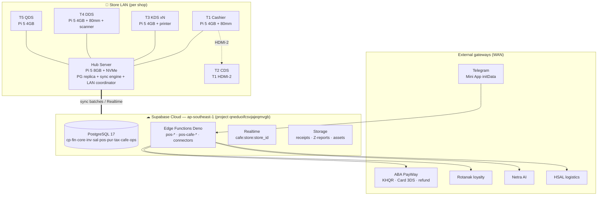

# KitLuy Suite — Rebuild Bible

**Version:** v1.0.0
**Filename:** `kitluy-suite-rebuild-bible-md-v1.0.0.md`
**Author:** Het Sovannara · Founder, HET Digital Ecosystem
**Generated against template:** `rebuild-bible-ai-template.md`
**Status:** Active — canonical reconstruction reference for the KitLuy Suite

> **Rebuild Test:** *If every person who built this system disappeared tomorrow, could a single engineer with zero prior context reconstruct the entire product, infrastructure, and business logic from this document alone?* — The answer must be **yes**.
>
> **Conflict policy (template rule 4):** Parts 0–18 are canonical and contain **no unresolved conflicts**. Where live SQL and an earlier spec disagree, **live SQL wins** in the body and the conflict is logged in **Appendix C — Reconciliation Register**. Unknown exact values are marked `[REQUIRED: …]` rather than guessed.

---

## Part 0 — Rebuild Sequence (Read This First)

The exact linear order to resurrect a single KitLuy store (café vertical) from a blank machine and a fresh cloud account. Each step references the canonical part that details it.

```
REBUILD SEQUENCE — KitLuy Suite (café vertical, single store)

 1. PROVISION CLOUD
    - Supabase project, region ap-southeast-1, PostgreSQL v17.
    - Reference: Part 11 §11.1. Project ID: qneduoifcsvjajeqmvgb.

 2. APPLY DATABASE MIGRATIONS IN ORDER
    - 033b_tax_stub.sql         (tax foundation)
    - 034_inv_core.sql          (inventory: warehouses, items, stock)   [REQUIRED: confirm filename on disk]
    - 035_sal_core.sql          (sales: channels, orders, invoices, receipts) [REQUIRED: confirm filename on disk]
    - 036_pos_core.sql          (POS runtime core: stores→carts→tenders→sync)
    - 037_pur_core.sql          (procure-to-pay)
    - 038_trading_smoke.sql     (validators — run last, see Part 15)
    - 039_rls_trading.sql       (row-level security across trading core)
    - cafe_schema_init          (café deltas: modifiers, recipes, ingredients, T3/T4/tabs/stickers)
    - cafe_indexes_and_rls      (café indexes + RLS)
    - cafe_seed_modifier_examples (onboarding seed)
    - cp.franchise_agreements   (franchise delta — see Part 6 §6.1, Appendix C C-5)
    - Reference: Part 6 §6.5.

 3. SEED BASELINE DATA
    - tax.seed_cambodia_stub(tenant, env, company).
    - cp.tenants → cp.tenant_environments → fin.companies → pos.stores (set vertical_type='cafe').
    - inv.warehouses (one per store), link to store.
    - Reference: Part 8 §8.1, Part 14 §14.1.

 4. DEPLOY EDGE FUNCTIONS
    - Shared pos-* functions, then 25 café pos-cafe-* functions.
    - Ecosystem connectors: rotanak-*, netra-*, hsal-*, aba-payway-*.
    - Reference: Part 7.

 5. CONFIGURE SECRETS & THIRD-PARTY CREDENTIALS
    - ABA PayWay (orders + subscriptions), Telegram bot token, Rotanak/Netra/HSAL service keys.
    - Reference: Part 5 §5.4 (inventory), Part 11 §11.4 (injection).

 6. BUILD / IMAGE LOCAL HARDWARE
    - Hub Server (Pi 5 8GB + NVMe): OS, Node 20 + TS 5 sync engine, local PostgreSQL replica.
    - Reference: Part 11 §11.2, Part 3 §3.4.

 7. PAIR / REGISTER CLIENTS
    - Register T1–T5 as pos.registers; T2 on T1 HDMI-2; T3 station assignments + printer modes.
    - Reference: Part 11 §11.3.

 8. RUN QA VALIDATION SCENARIOS
    - Execute the 18 scenarios; all must pass (validators follow the 038 pattern).
    - Reference: Part 15.

 9. VERIFY MONITORING & ALERTING
    - Health checks live; heartbeat thresholds set; payment-failure + sync-lag alerts armed.
    - Reference: Part 12.

10. GO-LIVE SMOKE TEST
    - Offline pull-the-plug test; loyalty earn/redeem; Z-report to Telegram; first auto-bill at trial end.
    - Reference: Part 16.
```

A lone engineer follows steps 1→10 without opening any other document.

---

## Part 1 — Glossary

No term in Parts 2–18 is used before it is defined here. Conflicting definitions are not flagged inline (template rule 4) — they live in Appendix C.

### 1.1 Platform terms

| Term | Definition |
|---|---|
| **KitLuy** | ឃីត់លុយ ("count up"). A commerce SaaS for Cambodian SMEs across four verticals (laundry, café, restaurant, retail). "Cambodia's Shopify." Phase 2 of the HET Digital Ecosystem. |
| **HET Digital Ecosystem** | The parent ecosystem of sibling apps (HSA, KitLuy, Canvār, SroulApp, Rotanak, Netra, HSAL, Lineage Vault) sharing one identity, loyalty, AI, and payment substrate. |
| **Tenant** | Top-level account (`cp.tenants`). A brand, chain, franchise, or single-store SME. All data is tenant-scoped. |
| **Tenant Environment** | A prod/staging environment under a tenant (`cp.tenant_environments`). |
| **Company** | A legal entity under a tenant (`fin.companies`). The billing and accounting boundary. One tenant may hold many companies (e.g. one per franchisee). |
| **Store** | A physical shop (`pos.stores`). Belongs to a company; carries the immutable `vertical_type`; maps 1:1 to a Hub Server and a warehouse. |
| **Account** | A staff/user record in the control plane (`cp.accounts`). |
| **Party** | A customer record (`core.parties`). |
| **Vertical** | A complete industry bundle: schema delta + edge functions + terminal map + hardware + lifecycle + feature index + reporting taxonomy. Not a UI skin. |
| **vertical_type** | Immutable store column: `laundry` / `cafe` / `restaurant` / `retail`. Set at provisioning, never changed. |

### 1.2 Product terms (the six builds)

| Term | Definition |
|---|---|
| **kitluy-admin-portal** | Web. Platform owner (HET). Tenant/store provisioning, subscriptions, billing, support, audit. |
| **kitluy-chain-portal** | Web. Brand/chain/franchise owner. Manages the set of shops/stores; central menu push; franchise structure. |
| **kitluy-seller-portal** | Web. Single shop owner. Manages one shop: menu, recipes, inventory, hardware, staff, reports. |
| **kitluy-seller-app** | Mobile. The seller portal in mobile form — same scope, logic, backend. |
| **kitluy-pos-desktop-app** | Desktop (Electron on Pi 5 ARM64). The fixed terminals T1–T5. Vertical-neutral shell gated by `vertical_type`. |
| **kitluy-pos-mobile-app** | Mobile (RN + Expo). The desktop POS in mobile form — roaming register. |
| **Form-factor pairing** | Two builds that share one logic layer and differ only in presentation shell: `seller-portal↔seller-app`, `pos-desktop↔pos-mobile`. |

### 1.3 Commerce terms

| Term | Definition |
|---|---|
| **Register** | A terminal record (`pos.registers`); type fixed/mobile/tablet/kiosk/backoffice. |
| **Shift** | A cashier operating period (`pos.shifts`) opened with a float, closed with reconciliation + Z-report. |
| **Session** | A staff login on a register (`pos.sessions`) inside a shift; auto-locks on inactivity. |
| **Cart** | The order-in-progress (`pos.carts`); the financial source of truth; materializes into a sales invoice + receipt. |
| **Cart Line** | A line on a cart (`pos.cart_lines`): item/service/fee/discount/tip/adjustment. |
| **Tender** | A payment on a cart (`pos.tenders`): cash/khqr/aba/card/wallet/loyalty/credit_memo. Split = multiple rows. |
| **Tender Attempt** | A single authorization attempt on a tender (`pos.tender_attempts`); supports retries. |
| **Receipt Job** | A queued output (`pos.receipt_jobs`): thermal/SMS/email/archive. |
| **Offline Batch / Event** | The sync envelope (`pos.offline_sync_batches` / `pos.offline_sync_events`) carrying Hub-created operations to cloud with idempotency. |
| **Service Mode** | dine_in / takeaway / delivery. Drives downstream behaviour. |
| **Origin Channel** | walk_in / tma (v1.0.0). Where the order originates. |

### 1.4 Hardware & terminal terms

| Term | Definition |
|---|---|
| **Hub Server** | Per-store Pi 5 8GB + NVMe. Local PostgreSQL replica + sync engine + offline-first service layer + LAN coordinator. |
| **T1 Cashier** | Touch register (Pi 5 4GB + 80mm printer). HDMI-1 register, HDMI-2 → T2. |
| **T2 CDS** | Customer Display Screen (T1's HDMI-2; no separate Pi). |
| **T3 KDS** | Kitchen Display Screen. Multi-instance, one per station (Pi 5 4GB + printer: 80mm slip OR label). |
| **T4 DDS** | Dispatch/expediter screen (Pi 5 4GB + 80mm printer + QR scanner). |
| **T5 QDS** | Queue Display Screen (independent Pi 5 4GB). |
| **Slot** | Numbered pickup position on the T4 counter (4–12 configurable), broadcast to T5. |
| **Cup Sticker** | Label printed at T3 per cup; carries item/modifiers/`n/total`/QR (T4 scan + customer feedback). |
| **Packing List** | 80mm printout from T4 for takeaway/delivery; skipped for dine-in. |

### 1.5 Third-party terms

| Term | Definition |
|---|---|
| **Supabase** | Backend platform: PostgreSQL 17, Auth, Edge Functions (Deno), Realtime, Storage. |
| **ABA PayWay** | Payment gateway: KHQR deeplink + Card 3DS + refund. Rail for orders **and** subscription billing. |
| **KHQR** | Cambodia QR payment standard via Bakong, accessed through ABA PayWay. |
| **Rotanak** | Ecosystem loyalty engine. Owns tiers + Sleung Coins. KitLuy reads/calls; never writes rules. Gold mirror. |
| **Netra** | Ecosystem AI brain. Owns customer intel + campaigns. KitLuy reads; never trains. Purple mirror. |
| **HSAL** | Ecosystem logistics/driver platform. KitLuy fires a delivery booking after T4 consolidation. |
| **TMA** | Telegram Mini App. Customer pre-order surface using signed `initData`. |
| **Sleung Coin** | Spendable loyalty currency (Rotanak). Earn 1–3% by tier; redeem ≤30% per order. |
| **Angkorian Star** | Tier-rank unit (Silver→Gold→Platinum→Diamond→Black Diamond). |
| **Single Identity** | One `auth.users.id` UUID per person across the whole ecosystem. |

### 1.6 Feature-index terms

| Term | Definition |
|---|---|
| **KF** | KitLuy Feature; vertical-branched ID system. |
| **KF-LD-NNN / KF-CF-NNN** | Laundry / Café feature IDs. Café = 68 features across 12 domains (v1.0.0). |
| **KF-RS / KF-RT** | Reserved for future Restaurant / Retail verticals. |
| **Q-CF-NN** | A parked/open café decision tracked for a later iteration. |

---

## Part 2 — Business Overview

### 2.1 What it is

KitLuy is a commerce operating system for Cambodian SMEs — **"Cambodia's Shopify" for physical commerce.** It packages POS, inventory with ingredient-level COGS, KHQR payments, coalition loyalty, reporting, and multi-store management into a subscription that runs on affordable Raspberry Pi 5 hardware with an offline-first local architecture tuned for Cambodia (KHR-native, Khmer-first, KHQR-native, resilient to power/internet interruptions).

### 2.2 What it is not

- **Not** a generic global POS. Cambodia-first by design.
- **Not** an AI, loyalty, or logistics company. It **consumes** Netra (AI), Rotanak (loyalty), HSAL (delivery). It owns commerce execution only.
- **Not** a monolith. Four logical products across six builds.
- **Not** a marketplace. The ecosystem marketplace is Canvār, a sibling app.

### 2.3 Verticals (full bundles, not skins)

| Vertical | Status | Terminals | Lifecycle | Schema delta | Feature index |
|---|---|---|---|---|---|
| Laundry | Live (Phase 1) | 3 (T1,T2,T4) | 10-state | `laundry.*` | `KF-LD-*` |
| Café | Active build (Phase 2.0) | 5 (T1–T5) | 8-state | `cafe.*` + `ops.cafe_orders` | `KF-CF-*` (68) |
| Restaurant | Future | TBD | table/course | `restaurant.*` (TBD) | `KF-RS-*` (reserved) |
| Retail | Future | TBD | scan-and-go | `retail.*` (TBD) | `KF-RT-*` (reserved) |

Adding a vertical is a **major-version event** (new schema + functions + feature index + hardware + handbook), never a config toggle.

### 2.4 Product / build inventory

| Build | Platform | Audience | Scope | Pairs with |
|---|---|---|---|---|
| `kitluy-admin-portal` | Web (React 18 + Vite) | Platform owner (HET) | All tenants | — |
| `kitluy-chain-portal` | Web | Brand/chain/franchise owner | Set of shops/stores | — |
| `kitluy-seller-portal` | Web | Single shop owner | One shop | ↔ seller-app |
| `kitluy-seller-app` | Mobile (RN+Expo) | Single shop owner | One shop | = seller-portal |
| `kitluy-pos-desktop-app` | Desktop (Electron/Pi 5) | Store staff | Fixed terminals | ↔ pos-mobile |
| `kitluy-pos-mobile-app` | Mobile (RN+Expo) | Store staff | Roaming register | = pos-desktop |

Management hierarchy: **admin** (all) → **chain** (the shops) → **seller** (one shop) → **POS** (the counter).

### 2.5 Business model

SaaS subscription only; **0% commission** on merchant order revenue.

| Plan | Target | Price | Trial |
|---|---|---|---|
| Commerce | Single store | ៛30 / store / month | 14 days |
| Chain | Multi-store / franchise | ៛100 HQ + ៛50 / store / month | 14 days |

Billing rhythm: 14-day trial → monthly auto-bill via ABA PayWay stored card. Credits are no-refund, no-carry-over. Hardware is one-time merchant CapEx, outside the subscription (~$80 per terminal). Subscription lifecycle detail: Part 8 §8.7.

### 2.6 Moat / defensibility

1. **Coalition loyalty as infrastructure** — Sleung Coins (via Rotanak) earned at a KitLuy café spend across the whole ecosystem (HSA, Canvār, …). A network effect a standalone POS cannot replicate; it compounds with every app and merchant added.
2. **Ingredient-level recipe inventory** — modifiers fan out to ingredients; true per-cup COGS and wastage signals. Loyverse stops at item level.
3. **Pickup-pad + T4 dispatcher** — silent self-serve fulfilment via slip-QR scan; not natively supported by regional POS.

### 2.7 Ecosystem position — owned vs consumed

| Concern | Owned by KitLuy | Consumed from |
|---|---|---|
| Commerce execution (POS, carts, inventory, reporting) | ✓ | — |
| Identity | — | Shared `auth.users.id` (ecosystem) |
| Loyalty | — | Rotanak (gold mirror) |
| AI / customer intel | — | Netra (purple mirror) |
| Delivery dispatch | — | HSAL |
| Payments | — | ABA PayWay |

---

## Part 3 — System Architecture & Topology

### 3.1 Topology diagram



LAN boundary: everything inside `STORE` talks over local network through the Hub. WAN boundary: the Hub ↔ Cloud link and Cloud ↔ external gateways. Terminals never call external gateways directly; all third-party traffic is mediated by edge functions.

### 3.2 Data flow maps

**Walk-in order + KHQR payment:**
```
1. T1 → Hub: start_cart, add_cart_line(s) (local-first; instant)
2. T1 → EF pos-cafe-aba-khqr-init → ABA: create KHQR  → QR payload returned
3. T1 renders QR; T2 mirrors total + loyalty (Realtime/LAN)
4. Customer scans (Bakong); ABA confirms
5. T1 polls EF pos-cafe-aba-khqr-poll → ABA: status → captured
6. EF: add_tender + mark_tender_attempt_result(succeeded); cart → completed; sal.sales_invoice + sal.receipt materialized
7. EF pos-cafe-order-route-to-kds → fan items to T3 instances (per cafe.t3_assignments)
8. EF rotanak-coin-earn (on completion); Netra event emitted
9. Hub queues offline_sync_event(s) → cloud (idempotent)
```

**T4 consolidation → T5 → delivery handoff:**
```
1. T3 marks item ready → pos-cafe-item-set-status(ready_for_pickup) → cup sticker prints
2. T4 scans cup QR → pos-cafe-t4-scan-qr → counter n/total
3. (gate) Bag & Print disabled until n==total → pos-cafe-t4-bag-print (re-checks server-side) → packing list
4. T4 taps slot N → pos-cafe-t4-slot-assign → cafe.t4_slots updated → Realtime broadcast cafe:store:{id}
5. T5 receives broadcast → shows pad# at slot N
6. If delivery: pos-cafe-hsal-handoff → hsal-booking-create (linked by external_order_id)
7. Pickup → slot release → order completed (~5s after collected)
```

### 3.3 Offline-first protocol

- **Capture:** terminals write to the Hub's local PostgreSQL replica first; the UI never blocks on cloud.
- **Batch:** Hub groups local operations into `pos.offline_sync_batches`; each operation is a `pos.offline_sync_events` row.
- **Idempotency key format:** `{store_id}:{register_id}:{aggregate_type}:{aggregate_id}:{local_seq}` — deterministic, so a replayed batch cannot double-apply. (`pos.queue_offline_event` accepts an explicit `idempotency_key`; `pos.carts` also enforces `unique(tenant,env,company,store,register,offline_local_ref)`.)
- **Sync:** on connectivity, batches POST to cloud; statuses progress `queued → syncing → synced` (`offline_batch_status`).
- **Conflict resolution policy (per data class):**
  - **Operational data** (cart status, KDS state, slot state): **last-write-wins** at field level; unresolved cases surface as `conflicted` (never silently merged).
  - **Financial documents** (invoices, receipts, tenders): **append-only** — never overwritten, so they cannot conflict destructively.
- Detailed rules: Part 8 §8.8.

### 3.4 Hardware placement (café vertical)

| Node | Model | Storage | Role | Thermal/Power |
|---|---|---|---|---|
| Hub Server | Pi 5 8GB | NVMe 128/256GB | PG replica + sync + LAN coordinator | On UPS; mesh-vent aluminium case, copper heatsink, 3007 PWM blower fan (35°C+ ambient) |
| T1 | Pi 5 4GB | microSD 32GB | Register; HDMI-1 register, HDMI-2 → T2 | Same enclosure class |
| T2 | — | — | T1 HDMI-2 output (no Pi) | — |
| T3 ×N | Pi 5 4GB | microSD 32GB | KDS per station + printer | Same enclosure class |
| T4 | Pi 5 4GB | microSD 32GB | Expediter + 80mm + scanner | Same enclosure class |
| T5 | Pi 5 4GB | microSD 32GB | Queue display (independent) | Same enclosure class |

Laundry vertical: 3 Pi + 3 screens (T1,T2,T4). Scale tier (100K orders/day): replace Pi Hub with Intel/AMD mini-PC 32GB + PostgreSQL; schema unchanged.

### 3.5 Environment promotion

- **Dev → Staging → Prod** map to `cp.tenant_environments` rows plus separate Supabase environments. [REQUIRED: confirm whether staging is a separate Supabase project or a separate env within the same project.]
- **Migrations** move through `supabase/migrations/` in numeric order; written by Claude/Claude Code, **applied by the BE team only** (never auto-applied).
- **Secrets** are injected per environment (Part 11 §11.4); never committed.
- **Client builds** promote via EAS (mobile) and Electron packaging (desktop); see Part 5 §5.3.

---

## Part 4 — External Contracts & Integrations

Each integration is specified so it can be re-implemented without reading the vendor docs end-to-end. Exact vendor-specific values not in the source material are marked `[REQUIRED: …]`.

### 4.1 ABA PayWay (payments — orders + subscriptions)

- **4.1.1 Purpose** — KHQR (Bakong) deeplink payments, Card 3DS, and refunds for customer orders; recurring card billing for KitLuy subscriptions.
- **4.1.2 Authentication** — Merchant ID + API key + per-request HMAC hash. `[REQUIRED: exact hash algorithm (e.g. HMAC-SHA512), field concatenation order, and header names from ABA PayWay merchant integration pack.]`
- **4.1.3 Request/response contracts (KHQR init)** — handled by `pos-cafe-aba-khqr-init`:
  ```jsonc
  // Request (KitLuy → ABA)
  {
    "merchant_id": "string",
    "tran_id": "string",            // = cart_id or order_id
    "amount": "number",             // KHR integer at display layer
    "currency": "KHR",
    "payment_option": "abapay_khqr",
    "return_url": "string",
    "hash": "string"                // [REQUIRED: exact hash recipe]
  }
  // Response (ABA → KitLuy)
  {
    "status": { "code": "0", "message": "success" },
    "qr_string": "string",          // rendered at T1/T2
    "tran_id": "string"
  }
  ```
- **4.1.4 Error handling & retry** — Poll via `pos-cafe-aba-khqr-poll`. `[REQUIRED: exact timeout, poll interval, and max attempts.]` Recommended baseline: poll every 2s, timeout 120s, then mark tender attempt `expired` and allow retry. Tender attempts model retries (`pos.tender_attempts`); a tender is captured exactly once.
- **4.1.5 Webhook events** — `[REQUIRED: ABA PayWay webhook event names, payload shape, and signature verification method.]` If webhooks are unavailable, polling (4.1.4) is the source of truth.
- **4.1.6 Sandbox vs production** — `[REQUIRED: sandbox base URL, test merchant credentials, simulated success/fail triggers.]`

### 4.2 Telegram Mini App (TMA pre-order origin)

- **4.2.1 Purpose** — Customer pre-orders (dine-in/takeaway/delivery) from within Telegram; orders land in the T1 pending queue.
- **4.2.2 Authentication** — Telegram-issued `initData`, verified server-side. Verification: compute HMAC-SHA256 of the data-check-string using a key derived from the bot token (`HMAC_SHA256("WebAppData", bot_token)`), compare to the supplied `hash`. Reject if mismatch or stale `auth_date`.
- **4.2.3 Request/response contracts** — `pos-cafe-tma-menu-pull` returns categories/items/modifiers/combos/pricing JSON; `pos-cafe-tma-order-create` accepts the order with `initData`. See Part 7 for schemas.
- **4.2.4 Error handling & retry** — Invalid/stale `initData` → 401. Payment failure → order not created (no `pending_confirmation` row).
- **4.2.5 Webhook events** — TMA pushes customer notifications on each state transition (confirmed → in_prep → ready). `[REQUIRED: bot notification delivery mechanism — Bot API sendMessage vs Mini App push.]`
- **4.2.6 Sandbox vs production** — Use a test bot token in staging; `[REQUIRED: test bot handle.]`

### 4.3 Rotanak (loyalty — consumed, read + call)

- **4.3.1 Purpose** — Read tier + Sleung Coin balance; fire coin earn on completion; redeem with a 30% per-order cap. KitLuy never writes loyalty rules.
- **4.3.2 Authentication** — Service-to-service key over TLS via `rotanak-*` edge functions. `[REQUIRED: key name + rotation.]`
- **4.3.3 Request/response contracts** —
  ```jsonc
  // rotanak-profile-get
  Req: { "party_id": "uuid" }
  Res: { "tier": "Silver|Gold|Platinum|Diamond|Black Diamond", "coins": 0, "earn_rate_pct": 1 }
  // rotanak-coin-earn  (on order completion)
  Req: { "party_id": "uuid", "order_total_khr": 0, "source": "kitluy-cafe", "external_order_id": "string", "idempotency_key": "string" }
  Res: { "coins_earned": 0, "new_balance": 0 }
  // rotanak-coin-redeem  (cap 30% of order)
  Req: { "party_id": "uuid", "redeem_coins": 0, "order_total_khr": 0, "idempotency_key": "string" }
  Res: { "redeemed_khr": 0, "new_balance": 0, "capped": false }
  ```
- **4.3.4 Error handling & retry** — Loyalty failures must **not** block order completion; earn is fire-and-retry (idempotent). Redeem is validated at preview and re-validated at commit; over-cap → rejected.
- **4.3.5 Webhook events** — N/A (KitLuy is a caller; Rotanak owns state).
- **4.3.6 Sandbox vs production** — `[REQUIRED: Rotanak staging endpoint.]`

### 4.4 Netra (AI — consumed, read-only)

- **4.4.1 Purpose** — Read customer intelligence, recommendations, and active-campaign banners. KitLuy never trains models.
- **4.4.2 Authentication** — Service key over TLS via `netra-*` functions. `[REQUIRED: key name.]`
- **4.4.3 Request/response contracts** — `netra-recommendations-get`: `Req { party_id, store_id, context }` → `Res { recommendations[], campaign_banner }`. Rendered behind the purple mirror banner (Part 9 §9.2).
- **4.4.4 Error handling & retry** — AI failures are non-blocking; surfaces degrade gracefully to no-recommendation.
- **4.4.5 Webhook events** — N/A.
- **4.4.6 Sandbox vs production** — `[REQUIRED: Netra staging endpoint.]`

### 4.5 HSAL (logistics — delivery handoff)

- **4.5.1 Purpose** — Create a delivery booking after T4 slot assignment for delivery-mode orders; read driver assignment + ETA in read-only.
- **4.5.2 Authentication** — Service key over TLS via `hsal-*`. `[REQUIRED: key name.]`
- **4.5.3 Request/response contracts** —
  ```jsonc
  // hsal-booking-create
  Req: { "external_order_id": "string", "store_id": "uuid", "pickup_slot": 0, "items_summary": "string", "customer_ref": "string" }
  Res: { "hsal_booking_id": "uuid", "status": "assigned|searching", "eta_minutes": 0 }
  ```
  Café order and HSAL booking are linked by `external_order_id`.
- **4.5.4 Error handling & retry** — Booking failure surfaces at T4 as a retry prompt; the bagged order remains at its slot until a driver is assigned.
- **4.5.5 Webhook events** — HSAL pushes driver status (assigned/arrived/picked-up/delivered). `[REQUIRED: event names + signature.]`
- **4.5.6 Sandbox vs production** — `[REQUIRED: HSAL staging endpoint.]`

### 4.6 Supabase (identity, realtime, storage)

- **4.6.1 Purpose** — Auth (phone OTP, shared `auth.users.id`), Realtime (LAN/cloud broadcast `cafe:store:{store_id}`), Storage (receipts, Z-reports, marketing assets).
- **4.6.2 Authentication** — Supabase anon/service keys; RLS enforces tenant scope (Part 6 §6.4). Phone OTP for portal users; POS staff use device-bound PIN on top of a register session (Part 10 §10.3).
- **4.6.3 Request/response contracts** — Standard Supabase client + edge function invocation; all writes go through edge functions, never direct table writes.
- **4.6.4 Error handling & retry** — Realtime drop → T5 recovers via `pos-cafe-t5-broadcast-pull` on reconnect.
- **4.6.5 Webhook events** — N/A (internal).
- **4.6.6 Sandbox vs production** — Separate environment per `cp.tenant_environments`; see Part 3 §3.5.

### 4.7 Google Maps / HelloMap (delivery geocoding — via HSAL)

- **4.7.1 Purpose** — Address geocoding and routing for delivery. Owned by HSAL, not KitLuy; listed for completeness.
- **4.7.x** — `[REQUIRED: confirm whether KitLuy ever calls Maps directly or always via HSAL. Current assumption: always via HSAL.]`

---

## Part 5 — Tech Stack & Repository Structure

### 5.1 Stack by layer

| Layer | Technology |
|---|---|
| Web frontend (admin, chain, seller) | React 18 + TypeScript + Vite + Tailwind CSS v4 |
| Mobile (seller-app, pos-mobile) | React Native + Expo + TypeScript; Zustand; expo-sqlite; expo-print; EAS Build |
| Desktop POS (pos-desktop) | Electron 28.x + React 18 on Raspberry Pi 5 (ARM64) |
| Backend | Supabase — PostgreSQL 17, Auth, Edge Functions (Deno), Realtime, Storage |
| Hub Server | Node.js 20 + TypeScript 5; local PostgreSQL replica; sync engine; LAN broadcast via Realtime |
| Payments | ABA PayWay (KHQR + Card 3DS + refund) |
| Maps | Google Maps API (external) · HelloMap (sovereign, in development) — via HSAL |
| Hosting | DigitalOcean SGP1 (Supabase managed) |
| AI gateway (inside Netra) | Claude Haiku/Sonnet → Gemini Flash failover → Prājñā (Phase 4) |
| Messaging | Supabase Realtime (`messaging.*`); SroulApp Engine = Phase 3 replacement |
| Hardware OS | Raspberry Pi OS (ARM64) on Pi 5 nodes |

### 5.2 Repository layout (canonical)

```
kitluy/
├── supabase/
│   ├── migrations/          # 033b… 039 trading core, cafe_* deltas (BE team applies)
│   ├── functions/           # Deno edge functions: pos-*, pos-cafe-*, connectors
│   └── seed/                # tax.seed_cambodia_stub, modifier examples
├── apps/
│   ├── admin-portal/        # web (React18+Vite)
│   ├── chain-portal/        # web
│   ├── seller-portal/       # web   ─┐ shared logic layer
│   ├── seller-app/          # mobile ┘ (form-factor pairing)
│   ├── pos-desktop/         # Electron/Pi5 ─┐ shared logic layer
│   └── pos-mobile/          # RN+Expo       ┘ (form-factor pairing)
├── packages/
│   ├── shared-logic/        # cart math, money helper, state machines
│   ├── design-system/       # tokens, components (Sky Blue, DM Sans)
│   └── api-client/          # typed edge-function client
├── hub-server/              # Node20+TS5 sync engine, PG replica config
├── wireframes/              # kitluy-cafe-pos-terminals-wireframe-vX.Y.Z.jsx
└── docs/                    # handbooks, this rebuild bible
```
`[REQUIRED: confirm monorepo tool (Turborepo/Nx/pnpm workspaces) and exact directory names if they differ.]`

### 5.3 Build & deploy pipeline

| Artifact | Build | Deploy target |
|---|---|---|
| Web portals | Vite build | `[REQUIRED: host — Netlify/Vercel/DO]` |
| Mobile apps | EAS Build | Play Store + App Store |
| Desktop POS | Electron packager (ARM64) | Pi 5 image |
| Edge functions | Supabase functions deploy | Supabase (BE team) |
| Migrations | — | `supabase db push` by BE team only |
| Hub Server | Node build + systemd service | Pi 5 8GB image |

### 5.4 Secrets inventory (names only — never values)

| Secret | Purpose | Consumed by | Rotation |
|---|---|---|---|
| `SUPABASE_URL` | Project endpoint | all clients + functions | n/a |
| `SUPABASE_ANON_KEY` | Public client key | clients | on compromise |
| `SUPABASE_SERVICE_ROLE_KEY` | Server bypass key | edge functions, Hub | `[REQUIRED: cadence]` |
| `ABA_MERCHANT_ID` | ABA merchant | aba-payway-* functions | n/a |
| `ABA_API_KEY` / `ABA_HASH_SECRET` | ABA auth + HMAC | aba-payway-* functions | `[REQUIRED]` |
| `TELEGRAM_BOT_TOKEN` | TMA initData verify + notifications | tma-* functions | `[REQUIRED]` |
| `ROTANAK_SERVICE_KEY` | Loyalty calls | rotanak-* functions | `[REQUIRED]` |
| `NETRA_SERVICE_KEY` | AI reads | netra-* functions | `[REQUIRED]` |
| `HSAL_SERVICE_KEY` | Delivery booking | hsal-* functions | `[REQUIRED]` |

### 5.5 Permanently removed decisions (do not reconsider)

- **Zendrite** — removed. Not part of the stack.
- **Matrix** — removed. Messaging is Supabase Realtime now; SroulApp Engine is the Phase 3 replacement.

---

## Part 6 — Database Schema (Canonical)

**This chapter is clean (template rule 4 / §6 CRITICAL RULE): where the café spec and live SQL disagreed, live SQL wins here; the divergences are in Appendix C.**

### 6.1 Schema inventory

| Schema | Owner | Purpose | Source migration |
|---|---|---|---|
| `cp` | Platform | tenants, tenant_environments, accounts | referenced by 036 |
| `fin` | Platform | companies (billing/accounting entity) | referenced by 036 |
| `core` | Platform | parties (customers), RLS helpers (`is_service_role`, `current_tenant_id`) | referenced by 036/039 |
| `inv` | Trading-core | warehouses, items, stock, transfers | `034_inv_core.sql` |
| `sal` | Trading-core | sales_channels, sales_orders, sales_invoices, receipts | `035_sal_core.sql` |
| `pos` | Trading-core | stores, registers, shifts, sessions, carts, cart_lines, tenders, tender_attempts, receipt_jobs, offline_sync_batches, offline_sync_events | `036_pos_core.sql` |
| `pur` | Trading-core | purchase_requests/orders, goods_receipts, purchase_invoices, debit_notes, landed_costs (+ lines) | `037_pur_core.sql` |
| `tax` | Trading-core | regimes, jurisdictions, categories, company_registrations, codes, code_components, determination_rules, document_calculations, document_tax_lines | `033b_tax_stub.sql` |
| `cafe` | Café vertical | modifier_groups, modifiers, item_modifier_group_links, recipes, recipe_ingredients, ingredients, t3_assignments, t4_slots, tabs, cup_stickers | `cafe_schema_init` |
| `ops` | Café operational | cafe_orders (operational/KDS view keyed to a cart) | `cafe_schema_init` |
| `loyalty` | Rotanak | tiers, wallets, coins — **read-only mirror, owned externally** | external |

Franchise delta: `cp.franchise_agreements` (Part 6 §6.1 addition; tracked Appendix C C-5).

### 6.2 Table specifications

**`pos.stores`** — physical store.

| Column | Type | Null | Default | FK / Notes |
|---|---|---|---|---|
| `store_id` | uuid | NOT NULL | gen_random_uuid() | PK |
| `tenant_id` | uuid | NOT NULL | | → cp.tenants |
| `env_id` | uuid | NOT NULL | | → cp.tenant_environments |
| `company_id` | uuid | NOT NULL | | → fin.companies |
| `sales_channel_id` | uuid | NULL | | → sal.sales_channels |
| `warehouse_id` | uuid | NOT NULL | | → inv.warehouses |
| `store_code` | text | NOT NULL | | unique(tenant,env,company,store_code) |
| `store_name` | text | NOT NULL | | |
| `legal_name`, `phone`, `email` | text | NULL | | |
| `timezone_name` | text | NOT NULL | `Asia/Phnom_Penh` | |
| `primary_currency_code` | text(3) | NOT NULL | `USD` | accounting substrate (Part 8 §8.4) |
| `display_currency_code` | text(3) | NOT NULL | `KHR` | UI currency |
| `default_exchange_rate` | numeric(18,6) | NOT NULL | 4100 | |
| `is_active` | boolean | NOT NULL | true | |
| `metadata` | jsonb | NOT NULL | `{}` | |
| `created_by` | uuid | NULL | | → cp.accounts |
| `created_at`, `updated_at` | timestamptz | NOT NULL | now() | |
| `vertical_type` | enum | NOT NULL | | **IMMUTABLE** — laundry/cafe/restaurant/retail (KitLuy delta; Appendix C C-6) |

**`pos.carts`** — the order / financial source of truth.

| Column | Type | Null | Default | FK / Notes |
|---|---|---|---|---|
| `cart_id` | uuid | NOT NULL | gen_random_uuid() | PK |
| `tenant_id`,`env_id`,`company_id` | uuid | NOT NULL | | scope |
| `store_id`,`register_id`,`shift_id` | uuid | NOT NULL | | → pos.* |
| `session_id` | uuid | NULL | | → pos.sessions |
| `sales_channel_id` | uuid | NULL | | → sal.sales_channels |
| `party_id` | uuid | NULL | | → core.parties |
| `source_sales_order_id`/`source_sales_invoice_id` | uuid | NULL | | → sal.* |
| `cart_no` | text | NOT NULL | | unique(tenant,env,company,cart_no) |
| `cart_type` | pos.cart_type | NOT NULL | sale | |
| `status` | pos.cart_status | NOT NULL | open | |
| `currency_code`/`display_currency_code` | text(3) | NOT NULL | USD / KHR | |
| `exchange_rate` | numeric(18,6) | NOT NULL | 1 | |
| `subtotal_amount`…`change_due_amount` | numeric(18,4) | NOT NULL | 0 | totals block (Part 8 §8.4) |
| `tendered_at`,`completed_at`,`voided_at`,`cancelled_at` | timestamptz | NULL | | |
| `offline_origin` | boolean | NOT NULL | false | |
| `offline_local_ref` | text | NULL | | unique(tenant,env,company,store,register,offline_local_ref) |
| `sync_revision` | bigint | NOT NULL | 0 | |
| `sales_invoice_id`,`receipt_id` | uuid | NULL | | → sal.* (set on completion) |
| `notes` | text | NULL | | |
| `metadata` | jsonb | NOT NULL | `{}` | |
| `created_by` | uuid | NULL | | → cp.accounts |
| `created_at`,`updated_at` | timestamptz | NOT NULL | now() | |

**Other `pos` tables** (columns follow the same tenant-scoped pattern): `registers`, `shifts`, `shift_events`, `sessions`, `cart_lines`, `tenders`, `tender_attempts`, `receipt_jobs`, `offline_sync_batches`, `offline_sync_events`. Full per-column detail for the rebuild-critical ones is in Appendix A.

**`cafe` tables** (café vertical; FK targets are the reconciled live-SQL targets):

| Table | Key columns |
|---|---|
| `cafe.modifier_groups` | group_id PK, store_id→pos.stores, name_en, selection_rule(required_one/optional_one/optional_many), min_select, max_select, display_order |
| `cafe.modifiers` | modifier_id PK, group_id→cafe.modifier_groups, name_en, upcharge_khr int, available bool, display_order |
| `cafe.item_modifier_group_links` | (item_id→inv.items, group_id) composite PK, display_order |
| `cafe.recipes` | recipe_id PK, item_id→inv.items (one per item), modifier_variants jsonb, active bool |
| `cafe.recipe_ingredients` | (recipe_id, ingredient_id) composite PK, quantity decimal(10,3), unit(g/ml/unit) |
| `cafe.ingredients` | ingredient_id PK, store_id→pos.stores, name_en, unit, current_stock decimal(10,3), low_stock_threshold, reorder_point, cost_per_unit_khr int |
| `cafe.t3_assignments` | assignment_id PK, store_id→pos.stores, terminal_id→pos.registers (T3), category_id, printer_mode(receipt_80mm/label) |
| `cafe.t4_slots` | slot_id PK, store_id→pos.stores, slot_number, current_state(available/occupied/released_pending), current_order_id→ops.cafe_orders, assigned_at, released_at |
| `cafe.tabs` | tab_id PK, store_id→pos.stores, opened_by_user_id→cp.accounts, customer_name, table_reference, tab_type(cash/pre_auth_card), state(open/closed/completed), opened_at, closed_at |
| `cafe.cup_stickers` | sticker_id PK (=QR base), order_id→ops.cafe_orders, order_line_id, position_index, position_total, printed_at, scanned_at_t4_at, scanned_by_customer_at |

**`ops.cafe_orders`** — café operational state layered on a cart (Part 8 §8.5):

| Column | Type | Notes |
|---|---|---|
| order_id | uuid PK | |
| cart_id | uuid | → pos.carts (financial truth link; Appendix C C-3) |
| store_id | uuid | → pos.stores |
| customer_id | uuid NULL | → core.parties (guest = null) |
| service_mode | enum | dine_in/takeaway/delivery |
| origin_channel | enum | walk_in/tma |
| current_state | enum | 8 states (Part 8 §8.3) + voided/comped/refunded |
| state_log | jsonb | append-only |
| subtotal_khr…total_khr | integer | derived from cart numeric, rounded KHR (Part 8 §8.4) |
| payment_method | enum | cash/khqr/card/tab/tma_prepaid |
| aba_payway_ref | text NULL | |
| external_order_id | text NULL | HSAL link |
| hsal_booking_id | uuid NULL | → hsal.bookings (delivery) |
| tab_id | uuid NULL | → cafe.tabs |
| table_reference | text NULL | |
| created_by_user_id | uuid | → cp.accounts |
| created_at, updated_at, completed_at | timestamptz | |

### 6.3 Enum catalog

**pos** — `register_type`(fixed,mobile,tablet,kiosk,backoffice) · `shift_status`(open,closing,closed,cancelled) · `shift_event_type`(opening_float,pay_in,pay_out,safe_drop,float_adjustment,variance,drawer_open) · `session_status`(active,locked,closed,expired) · `cart_type`(sale,return,deposit,pickup_balance) · `cart_status`(open,held,checkout,completed,voided,cancelled,sync_pending,synced) · `cart_line_type`(item,service,fee,discount,tip,adjustment) · `tender_method`(cash,khqr,aba,card,wallet,loyalty,credit_memo,other) · `tender_status`(pending,authorized,captured,failed,cancelled,refunded) · `tender_attempt_status`(initiated,pending,succeeded,failed,expired,cancelled) · `receipt_job_channel`(thermal_print,sms,email,digital_archive) · `receipt_job_status`(queued,processing,completed,failed,cancelled) · `offline_batch_status`(queued,syncing,synced,failed,conflicted,cancelled) · `offline_event_status`(pending,synced,failed,conflicted,cancelled).

**pur** — `purchase_request_status`(draft,submitted,approved,rejected,converted,cancelled) · `purchase_order_status`(draft,submitted,approved,partially_received,fully_received,partially_billed,fully_billed,closed,cancelled) · `goods_receipt_status`(draft,received,inspected,posted,cancelled) · `purchase_invoice_status`(draft,pending_match,approved,posted,partially_paid,paid,cancelled) · `debit_note_status`(draft,approved,posted,settled,cancelled) · `landed_cost_status`(draft,allocated,posted,cancelled).

**cafe / ops** — `selection_rule`(required_one,optional_one,optional_many) · `printer_mode`(receipt_80mm,label) · `slot_state`(available,occupied,released_pending) · `tab_type`(cash,pre_auth_card) · `tab_state`(open,closed,completed) · `service_mode`(dine_in,takeaway,delivery) · `origin_channel`(walk_in,tma) · `cafe_order_state`(created,sent_to_kds,in_prep,ready_for_pickup,at_t4_consolidation,assigned_to_slot,collected,completed) + side(voided,comped,refunded) · `payment_method`(cash,khqr,card,tab,tma_prepaid).

**franchise (delta)** — `billing_mode`(brand_consolidated,franchisee_direct) · `menu_push_rights`(full,approve,none) · `agreement_status`(active,suspended,terminated).

### 6.4 RLS policy summary

Per `039_rls_trading.sql`, every tenant-scoped table enables RLS with:
```sql
USING      (core.is_service_role() OR tenant_id = core.current_tenant_id())
WITH CHECK (core.is_service_role() OR tenant_id = core.current_tenant_id())
```
- `core.is_service_role()` — bypass for postgres/service_role.
- `core.current_tenant_id()` — session-injected tenant scope.
- Migration is idempotent (drops existing policies before create).
- Café tables follow the identical pattern, scoped by the store's tenant. RLS is **enabled** on all tenant-scoped tables.

### 6.5 Migration sequencing

```
BASELINE (trading core):
  033b_tax_stub.sql
  034_inv_core.sql          [REQUIRED: confirm present]
  035_sal_core.sql          [REQUIRED: confirm present]
  036_pos_core.sql
  037_pur_core.sql
VALIDATION:
  038_trading_smoke.sql     (run after baseline; Part 15)
SECURITY:
  039_rls_trading.sql
VERTICAL DELTA (café):
  cafe_schema_init
  cafe_indexes_and_rls
  cafe_seed_modifier_examples
PLATFORM DELTA:
  cp.franchise_agreements   (Appendix C C-5)
```
Migrations are applied **in this order, by the BE team only**.

### 6.6 Naming conventions

- **Schema-prefixed table names mandatory**: `pos.stores`, never `stores`.
- **PK**: `<entity>_id uuid default gen_random_uuid()`.
- **Timestamps**: `timestamptz`, `created_at`/`updated_at` default `now()`; `touch_updated_at()` trigger per schema.
- **Money (storage)**: `numeric(18,4)`; **money (display)**: KHR integer (Part 8 §8.4).
- **KHR-native columns**: suffix `_khr`, type `integer`.
- **Idempotency key**: `{store_id}:{register_id}:{aggregate_type}:{aggregate_id}:{local_seq}`.
- **Document numbers**: `next_doc_number(tenant, company, series_code)` per schema.

---

## Part 7 — API / Edge Function Specifications

All writes go through Deno edge functions; apps never write tables directly. RLS enforcement is at the **DB layer** (Part 6 §6.4); functions additionally validate role/PIN scope. Functions are written by Claude/Claude Code and **deployed by the BE team only**.

### 7.1 Shared / core functions

| Slug | Method | Auth | Purpose | Side effects |
|---|---|---|---|---|
| `pos-pin-verify` | POST | register session | Verify staff PIN | reads cp.accounts; issues PIN scope |
| `pos-shift-open` | POST | cashier PIN | Open shift w/ float | `pos.open_shift`; shift_event opening_float |
| `pos-shift-close` | POST | cashier/manager PIN | Close shift, variance, Z | `pos.close_shift`; receipt_job; Telegram push |
| `pos-receipt-reprint` | POST | cashier PIN | Reprint a receipt | receipt_job |
| `pos-hardware-heartbeat` | POST | device token | Terminal/printer heartbeat | health store (Part 12 §12.2) |

### 7.2 Café domain functions (25)

Representative full spec for the two most rebuild-critical functions; the rest are tabulated.

**`pos-cafe-order-create`**
- **Route:** `POST /pos-cafe-order-create`
- **Auth:** cashier PIN scope (walk-in) OR verified TMA initData (origin tma).
- **Headers:** `Content-Type: application/json`, `Idempotency-Key: <key>`, `Authorization: Bearer <jwt>`.
- **Request body:**
  ```jsonc
  {
    "store_id": "uuid",
    "register_id": "uuid",
    "shift_id": "uuid",
    "party_id": "uuid|null",
    "service_mode": "dine_in|takeaway|delivery",
    "origin_channel": "walk_in|tma",
    "lines": [
      { "item_id": "uuid", "qty": 1,
        "modifiers": [ { "modifier_id": "uuid" } ],
        "notes": "string|null" }
    ],
    "table_reference": "string|null",
    "idempotency_key": "string"
  }
  ```
- **Responses:** `200 { order_id, cart_id, current_state:"created", subtotal_khr, total_khr }` · `400` validation · `401` auth · `409` idempotency replay (returns the original order) · `422` business rule (e.g. 86'd item) · `500`.
- **Side effects:** `pos.start_cart` + `pos.add_cart_line(s)`; creates `ops.cafe_orders`; triggers `pos-cafe-order-route-to-kds`; on payment completion materializes `sal.sales_invoice` + `sal.receipt`.
- **Idempotency:** same key → returns the original order, no duplicate cart.
- **RLS point:** DB layer (tenant via session); function validates store/register belong to the caller's tenant.

**`pos-cafe-t4-bag-print`**
- **Route:** `POST /pos-cafe-t4-bag-print`
- **Auth:** expediter (or manager) PIN scope.
- **Headers:** `Content-Type: application/json`, `Authorization: Bearer <jwt>`.
- **Request body:** `{ "order_id": "uuid" }`
- **Responses:** `200 { packing_list_escpos, printed:true }` · `409 { error:"cups_incomplete", scanned, total }` (hard gate) · `401` · `500`.
- **Side effects:** generates packing-list ESC-POS; dispatches to T4 printer; transitions order toward `assigned_to_slot`.
- **Idempotency:** re-print is safe; gate re-checked server-side (UI lock not trusted).
- **RLS point:** DB layer + expediter scope.

**Remaining café functions:**

| Slug | Method | Auth | Purpose / side effects |
|---|---|---|---|
| `pos-cafe-order-route-to-kds` | internal | system | Fan lines to T3 per cafe.t3_assignments |
| `pos-cafe-item-set-status` | POST | barista PIN | Update line in_prep/ready_for_pickup; triggers sticker |
| `pos-cafe-sticker-print` | POST | system/barista | ESC-POS/PDF sticker to T3 printer |
| `pos-cafe-t4-scan-qr` | POST | expediter PIN | Resolve sticker QR; return n/total |
| `pos-cafe-t4-slot-assign` | POST | expediter PIN | Update cafe.t4_slots; Realtime broadcast cafe:store:{id} |
| `pos-cafe-t4-slot-release` | POST | expediter PIN | Release slot to pool |
| `pos-cafe-t5-broadcast-pull` | GET | device token | T5 boot recovery of ready/almost lists |
| `pos-cafe-tab-open` | POST | cashier PIN | Open tab |
| `pos-cafe-tab-add-items` | POST | cashier PIN | Append items; route to T3 |
| `pos-cafe-tab-close` | POST | cashier PIN | Capture payment; consolidated receipt |
| `pos-cafe-tma-confirm` | POST | cashier PIN | Confirm pending TMA → created + route |
| `pos-cafe-recipe-deduct` | internal | system | Deduct ingredients on ready; resolve modifier variants |
| `pos-cafe-low-stock-check` | POST/cron | system | Threshold check; emit alerts; auto-86 |
| `pos-cafe-waste-log` | POST | manager PIN | Waste entry + reason + cost |
| `pos-cafe-modifier-group-upsert` | POST | shop owner | Seller-portal modifier authoring |
| `pos-cafe-recipe-upsert` | POST | shop owner | Seller-portal recipe authoring |
| `pos-cafe-tma-menu-pull` | GET | public | Menu JSON for TMA |
| `pos-cafe-tma-order-create` | POST | TMA initData | TMA order entry |
| `pos-cafe-hsal-handoff` | POST | system | Fire HSAL booking (delivery) |
| `pos-cafe-aba-khqr-init` | POST | cashier PIN | KHQR init via ABA; return QR |
| `pos-cafe-aba-khqr-poll` | GET | cashier PIN | Poll payment confirmation |
| `pos-cafe-x-report` | GET | cashier PIN | X-report payload |
| `pos-cafe-z-report` | POST | cashier/manager PIN | Z-report; persist to Storage; ESC-POS |

Ecosystem connectors (`rotanak-*`, `netra-*`, `hsal-*`, `aba-payway-*`) are specified in Part 4.

---

## Part 8 — Business Logic & Computation Rules

### 8.1 Entity hierarchy (authoritative)

```
cp.tenants (brand/chain/franchise/SME)
  └─ cp.tenant_environments (prod/staging)
       └─ fin.companies (legal/billing entity)
            └─ pos.stores (vertical_type; 1:1 Hub + warehouse)
                 └─ pos.registers (T1–T5)
                      └─ pos.shifts → pos.sessions → pos.carts → pos.cart_lines / pos.tenders
```
Customers = `core.parties`; staff = `cp.accounts`; stock location = `inv.warehouses`.

### 8.2 Immutable rules (architectural, not configurable)

1. **1 Store = 1 Vertical**, permanently (`vertical_type` immutable). Multi-vertical operators run multiple stores.
2. **All writes through edge functions** — apps never write tables directly.
3. **Single identity** — one `auth.users.id` UUID per person across the ecosystem.
4. **KitLuy consumes, never builds** AI/loyalty/logistics.
5. **Financial documents are append-only** (invoices, receipts, tenders).
6. **Display currency is KHR integer**, always (§8.4).
7. **Hub is the sole LAN coordinator** — terminals never talk peer-to-peer.

### 8.3 State machines

**Café order — 8 states (+3 side):**
```
created → sent_to_kds → in_prep → ready_for_pickup
  → at_t4_consolidation → assigned_to_slot → collected → completed
side: voided | comped | refunded
delivery branch: assigned_to_slot → hsal_dispatched → collected → completed
```
| State | Trigger | Side effect |
|---|---|---|
| created | T1 payment OR TMA confirm | cart created |
| sent_to_kds | Hub fans items | T3 cards appear |
| in_prep | T3 taps in-prep | timer starts |
| ready_for_pickup | T3 taps ready | sticker prints; **recipe deduction fires (§8.6)** |
| at_t4_consolidation | T4 scans first cup | counter starts |
| assigned_to_slot | all cups scanned + slot tapped | packing list (takeaway/delivery); T5 broadcast |
| collected | pickup confirmed | slot released |
| completed | ~5s after collected | loyalty earn + Netra event |

**Subscription:** `provisioned → trial(14d) → active → grace(3d) → suspended → (active on pay) ; any → retention(30d) → deleted` (§8.7).

**Cart:** `open → (held) → checkout → completed | voided | cancelled` with `sync_pending/synced` for offline-origin carts.

### 8.4 Money model (the canonical decision)

- **Decision:** money is **stored** as `numeric(18,4)` with `primary_currency_code` (default `USD`), `display_currency_code` (default `KHR`), and a per-store `default_exchange_rate` (default `4100`). Money is **displayed** as **KHR integer only** (`៛60,000`, no decimals, comma thousands).
- **Rejected alternative:** `bigint` KHR-cents storage — rejected because the trading core must support multi-currency accounting and FX; a single-currency integer store would not.
- **Rounding:** conversion to KHR-integer happens **once**, at the storage→display boundary, via a single shared helper `formatKHR(amount, rate)` in `packages/shared-logic`. Café `_khr` columns are derived at write time using this same rounding, so the `numeric` ledger and the `_khr` integers never drift.
- **Total formulas** (per cart line, then cart):
  ```
  line_subtotal   = qty * unit_price
  line_net        = line_subtotal + surcharge_amount - discount_amount
  line_tax        = line_net * (tax_percent/100)
  line_total      = line_net + line_tax
  cart.subtotal   = Σ line_subtotal
  cart.discount   = Σ line discounts (+ order-level discount)
  cart.tax        = Σ line_tax
  cart.total      = cart.subtotal - cart.discount + cart.surcharge + cart.tax
  cart.balance_due= cart.total - cart.paid_amount
  cart.change_due = max(0, cart.paid_amount - cart.total)   // cash
  ```
  Computed by `pos.compute_cart_line_amounts` + `pos.rebuild_cart_totals` (Part 7, Part 6 §6.2).
- **USD shadow:** shown only at final totals when configured: `៛60,000 (~$15.00)`.

### 8.5 Cart → invoice → receipt flow

```
1. pos.start_cart(...)                       → pos.carts (status open)
2. pos.add_cart_line(...) × N                → pos.cart_lines; triggers compute + rebuild_cart_totals
3. pos.add_tender(...) [+ add_tender_attempt / mark_tender_attempt_result for KHQR/card]
4. balance_due == 0 → cart status completed
5. materialize sal.sales_invoice + sal.receipt; cart.sales_invoice_id / receipt_id set
6. ops.cafe_orders carries operational state keyed by cart_id (café view; Appendix C C-3)
```
Split tender = multiple `pos.tenders` rows; the cart completes when cumulative captured = total.

### 8.6 Inventory deduction rules

- Deduction fires at **`ready_for_pickup`**, not at `created` — abandoned/voided orders never wrongly deduct.
- `cafe.recipes.modifier_variants` (jsonb) resolves modifier-driven swaps: e.g. `+Pearls → +X g pearls`; `50% sugar → 0.5 × syrup`.
- `pos-cafe-recipe-deduct` decrements `cafe.ingredients.current_stock`.
- **Per-cup COGS** = Σ(deducted qty × `cost_per_unit_khr`).
- Crossing `low_stock_threshold` → `pos-cafe-low-stock-check` emits an alert and auto-86's dependent items (real-time T1 update).
- `voided` reverses any deduction already applied.

### 8.7 Subscription lifecycle

| State | Rule |
|---|---|
| provisioned → trial | 14-day free trial on store provisioning |
| trial → active | auto-bill via ABA PayWay stored card at trial end, monthly thereafter |
| active → grace | on failed payment; **3-day** grace; data retained |
| grace → suspended | still unpaid → terminals read-only, no new orders; in-flight orders complete |
| suspended → active | on successful payment |
| any → retention | cancellation → **30-day** retention → deleted |
Credits are no-refund, no-carry-over. Franchise billing target is derived from `cp.franchise_agreements.billing_mode` (§8 / Part 6 §6.1).

### 8.8 Conflict resolution (per data class)

| Data class | Policy |
|---|---|
| Operational (cart status, KDS, slot) | Last-write-wins at field level; unresolved → `conflicted` status, surfaced for human review |
| Financial (invoice, receipt, tender) | Append-only; never overwritten → cannot conflict destructively |
| Inventory counts | Reconciliation is an explicit posted event; sync never silently overwrites a posted count |
Idempotency key (Part 3 §3.3, Part 6 §6.6) guarantees replayed batches do not double-apply.

### 8.9 Tax / compliance stub

- `tax.*` is a deliberate **stub** to unblock POS/sales/purchasing before the full tax engine.
- Path: `tax.resolve_tax_code(...) → tax.calculate_tax_stub(...) → tax.upsert_document_calculation(...)`; `tax.seed_cambodia_stub(...)` seeds a Cambodia baseline.
- Café v1.0.0: VAT is a single configurable line if enabled. Future hook: swap the stub calculator for the full engine without changing call sites.

---

## Part 9 — Design System & UI Inventory

### 9.1 Core tokens

| Token | Value |
|---|---|
| Primary | Sky Blue `#0EA5E9` |
| Primary dark | `#0284C7` |
| Dark sidebar | `#0F172A` |
| Success / Warning / Danger | `#10B981` / `#F59E0B` / `#EF4444` |
| Font | DM Sans |
| Card radius | 12px |
| Base grid | 16px |
| Breakpoints | `[REQUIRED: confirm web breakpoint set; mobile is RN/Expo native]` |

### 9.2 Mirror banners (read-only source indicators)

| Source | Banner color | Placement |
|---|---|---|
| Rotanak loyalty | Gold `#F5A623` | Top of every loyalty page (loyalty is read-only; Rotanak owns it) |
| Netra AI / intelligence | Purple `#8B5CF6` | Top of every intelligence page (AI is read-only; Netra owns it) |

Banners are functional, not decorative: they signal "mirrored, not editable here."

### 9.3 Localization & formatting

- **Currency:** ៛ (U+17DB), KHR integer, comma thousands (`៛60,000`). USD shadow at final totals only when configured.
- **Date:** `DD/MM/YYYY`. **Timezone:** `Asia/Phnom_Penh` (UTC+7). **Locale:** `en-KH`.
- **Phone:** E.164 (`+855 12 345 678`); reject spaces/invalid.
- **Languages:** English (primary) → Khmer (secondary, Khmer Unicode, **+40% wider** containers) → Chinese (tertiary where applicable).

### 9.4 Terminal / screen patterns

| Terminal | Layout | Touch / behaviour |
|---|---|---|
| T1 Cashier | Menu grid left, cart right; modifier bottom-sheet | Large tiles; light mode |
| T2 CDS | Dark, large type, customer-facing | Idle = marketing carousel; loyalty + total prominent |
| T3 KDS | Dark grid; pad badges; status colors (new red / in-prep amber / ready green) | Large targets for gloved hands |
| T4 DDS | Light; cup-counter progress bar | Primary button **hard-locked** until n==total |
| T5 QDS | Dark; huge pad + slot numbers; Now/Almost sections | Audio chime configurable; marketing footer |

### 9.5 Wireframe references & renderer constraints

- Reference artifact: `kitluy-cafe-pos-terminals-wireframe-v1.0.0.jsx` (22 anchor screens across T1–T5).
- Renderer constraints (artifact/Figma Make): no optional chaining (`?.`); no `const [x,setX]=useState()` (use `var s=useState(); var x=s[0]; var setX=s[1]`); page components defined **before** the `ROUTES` object; JSX attribute concatenation in braces; file < ~270KB.

### 9.6 App-specific brand overrides (siblings, reference)

Rotanak Gold `#F5A623` · Netra Purple `#8B5CF6` · SroulApp Emerald+Gold · HelloHR Midnight Glass (Aptos) · HelloESA Indigo+Orange. KitLuy uses the core Sky Blue identity.

---

## Part 10 — Security Model & RBAC

### 10.1 Role definitions

| Role | Home product | Scope |
|---|---|---|
| Platform Admin | admin-portal | All tenants |
| Brand/Chain Owner | chain-portal | All stores under the brand |
| Shop Owner | seller-portal / seller-app | One store |
| Manager | seller-portal + POS | One store; elevated POS actions |
| Cashier | pos (T1) | Register operations |
| Barista/Kitchen | pos (T3) | KDS only |
| Expediter | pos (T4) | Dispatch/slots only |

### 10.2 Permission matrix

| Capability | Plat Admin | Brand | Shop Owner | Manager | Cashier | Barista | Expediter |
|---|---|---|---|---|---|---|---|
| Provision tenant/store | ✓ | | | | | | |
| Subscription/billing | ✓ | franchise-scoped | | | | | |
| Franchise agreements | ✓ | ✓ | | | | | |
| Push central menu | | ✓ | | | | | |
| Cross-store reports | ✓ | ✓ | | | | | |
| Edit menu/recipes (one store) | ✓ | ✓ | ✓ | ✓ | | | |
| Manage staff/PINs (store) | ✓ | ✓ | ✓ | ✓ | | | |
| Inventory + reconciliation | ✓ | ✓ | ✓ | ✓ | | | |
| Open/close shift | | | ✓ | ✓ | ✓ | | |
| Take order + payment (T1) | | | ✓ | ✓ | ✓ | | |
| Void / refund | | | ✓ | ✓ | PIN→mgr | | |
| Discount / comp | | | ✓ | ✓ | PIN→mgr | | |
| KDS status / 86 (T3) | | | ✓ | ✓ | | ✓ | |
| T4 scan / bag / slot | | | ✓ | ✓ | | | ✓ |
| Pause/resume TMA | | | ✓ | ✓ | | | |

### 10.3 PIN / auth model

- **POS staff:** 4-digit PIN on a **device-bound register session**; session auto-locks after inactivity (`pos.sessions`).
- **Portal users:** full Supabase auth (phone OTP primary), shared `auth.users.id`.
- A cashier session can perform cashier actions; elevated actions require a **manager PIN** even within that session.

### 10.4 Sensitive action gating

| Action | Gate |
|---|---|
| Void | Manager PIN + reason code |
| Refund | Manager PIN + reason code + references original order |
| Discount/comp above threshold | Manager PIN |
| Shift close with variance | Logged; `[REQUIRED: variance threshold requiring manager sign-off]` |

### 10.5 Audit logging

Every sensitive/PIN-gated action logs to the audit store (KF-CF-064) with: **actor** (account_id), **action**, **target** (entity + id), **before/after** state, **timestamp** (timestamptz), **store/tenant** scope. `state_log` on `ops.cafe_orders` additionally records every order transition.

### 10.6 Encryption standards

- **In transit:** TLS. `[REQUIRED: pin minimum TLS version, recommend TLS 1.2+.]`
- **At rest:** Supabase-managed Postgres encryption. `[REQUIRED: confirm at-rest encryption + key management for Hub NVMe.]`
- **PII:** `[REQUIRED: field-level hashing policy for phone/customer PII, if any.]`
- **Secrets:** never in repo; injected per Part 11 §11.4.

---

## Part 11 — Deployment & Infrastructure

### 11.1 Cloud provisioning

- Provider: Supabase (managed, DigitalOcean SGP1). Region `ap-southeast-1`. Project ID `qneduoifcsvjajeqmvgb`. PostgreSQL **v17**.
- Storage buckets: receipts, Z-reports, marketing assets. `[REQUIRED: exact bucket names + retention.]`
- Realtime channel: `cafe:store:{store_id}` for T4→T5.

### 11.2 Local node provisioning (Hub Server)

```
1. Flash Raspberry Pi OS (ARM64) to NVMe (Pi 5 8GB).
2. Install Node.js 20 + TypeScript 5; system deps.
3. Install PostgreSQL; configure local replica of the store's cloud data.
4. Deploy sync engine (hub-server/) as a systemd service; configure idempotency + batch sync to cloud.
5. Configure LAN coordinator + Realtime relay.
6. Mount on UPS; verify thermals (copper heatsink + 3007 PWM blower; 35°C+ ambient).
```
`[REQUIRED: exact OS image version, PostgreSQL version on Hub, replica mechanism (logical replication vs custom sync).]`

### 11.3 Terminal pairing

```
1. Boot terminal (Pi 5 4GB) into pos-desktop-app (Electron).
2. App requests pairing to the store Hub over LAN.
3. Hub issues a register record (pos.registers) → register_id + register_type.
4. T2 = T1 HDMI-2 (no pairing). T3 prompts station pin + printer_mode (cafe.t3_assignments).
5. Terminal authenticates to Hub each session; staff then enter PIN (pos.sessions).
```

### 11.4 Secrets injection

- Edge functions: Supabase function secrets. Hub: env file on the device (not in repo). Clients: build-time public keys only (anon key); never service role on a client.
- `[REQUIRED: confirm vault vs env-file policy and per-environment secret sets.]`

### 11.5 Certificate & domain management

- Domains: `[REQUIRED: portal domains].` QR infrastructure domain `qr.het.digital` (ecosystem) with iOS Universal Links + Android App Links.
- SSL: managed by host/CDN. `[REQUIRED: CDN + cert authority.]`

---

## Part 12 — Monitoring, Observability & Alerting

### 12.1 Health checks

- Edge function health endpoint + Hub health endpoint. `[REQUIRED: exact health route, frequency, expected response, timeout.]`

### 12.2 Heartbeat semantics

- Terminals + printers POST `pos-hardware-heartbeat` on an interval. `[REQUIRED: exact interval.]`
- Missing heartbeat → surfaced in seller portal hardware monitor; printer no-heartbeat triggers an alert (template example: **> 5 minutes → P2**; confirm).

### 12.3 Log aggregation

- Supabase function logs + Hub logs. `[REQUIRED: aggregation target, retention, searchable fields.]`

### 12.4 Metrics & dashboards

- Key metrics: orders/min, sync lag (batch queue depth/age), payment-failure rate, KDS prep time, T4 consolidation time. `[REQUIRED: visualization surface.]`

### 12.5 Alert thresholds

| Condition | Threshold | Severity |
|---|---|---|
| Printer no heartbeat | `[REQUIRED: e.g. > 5 min]` | P2 |
| Hub unreachable | `[REQUIRED]` | P1 |
| Sync lag (batch age) | `[REQUIRED]` | P2 |
| Payment failure rate | `[REQUIRED]` | P2 |
| Sync conflict count spike | `[REQUIRED]` | P2 |

### 12.6 Incident runbooks (top 3)

- **Hub down (P1):** failover is offline-mode on terminals (cash only); restore Hub from NVMe backup; replay unsynced batches; verify counts (Part 13 §13.2).
- **Internet partition:** operations continue offline against Hub; KHQR unavailable (cash continues); batches queue; auto-sync on reconnect.
- **Payment gateway timeout:** poll until timeout, mark tender attempt `expired`, allow retry or alternate tender; never double-capture (idempotency).

---

## Part 13 — Backup & Disaster Recovery

### 13.1 Backup schedule & scope

| Scope | Frequency | Retention |
|---|---|---|
| Cloud DB (Supabase) | `[REQUIRED: e.g. daily PITR]` | `[REQUIRED]` |
| Hub NVMe (local replica + configs) | `[REQUIRED]` | `[REQUIRED]` |
| Terminal configs (register, station, printer) | on change | versioned |
| Storage (receipts/Z-reports) | continuous (object store) | `[REQUIRED]` |

### 13.2 Restore procedures

- **Hub hardware failure:** swap Pi/NVMe; re-image (Part 11 §11.2); restore replica + configs; replay unsynced batches from terminals; reconcile cash.
- **Cloud DB corruption:** restore from PITR/backup to last good point; re-sync Hubs.
- **Total store rebuild:** follow Part 0 steps 6–10.
- **Accidental tenant deletion:** restore from backup within retention; `[REQUIRED: soft-delete vs hard-delete policy + restore window.]`

### 13.3 RPO / RTO targets

| Tier | RPO (max data loss) | RTO (max downtime) |
|---|---|---|
| Cloud | `[REQUIRED]` | `[REQUIRED]` |
| Hub (store) | `[REQUIRED]` | `[REQUIRED]` |

### 13.4 Degraded modes

| Failure | What still works |
|---|---|
| Internet offline | Full POS on Hub; cash payments; KDS; T4/T5; KHQR disabled; batches queue |
| Hub offline | Terminals enter limited offline cache mode; `[REQUIRED: confirm terminal-local fallback scope]`; cash only |
| ABA PayWay down | Cash + card-offline fallback `[REQUIRED]`; KHQR disabled |
| Rotanak/Netra down | Orders unaffected; loyalty earn retries later; AI surfaces degrade to none |

---

## Part 14 — Standard Operating Procedures (SOPs)

Each SOP: **Trigger · Actor · Steps · Expected Result · Fallback.**

### 14.1 Provisioning SOPs

**New store**
- **Trigger:** signed merchant / new branch. **Actor:** Platform Admin.
- **Steps:** 1) select/create tenant; 2) ensure company (franchise → franchisee company + `cp.franchise_agreements` w/ `billing_mode`); 3) create `pos.stores` (`vertical_type`, KHR display, rate); 4) create + link `inv.warehouses`; 5) queue Hub image; 6) register terminals; 7) start 14-day trial + store ABA card.
- **Expected result:** store boots into the correct vertical shell; trial active.
- **Fallback:** if boot shows wrong vertical, re-check `vertical_type` (immutable — if wrong, delete + recreate store).

**New franchisee**
- **Trigger:** franchise agreement signed. **Actor:** Platform Admin / Brand Owner.
- **Steps:** create franchisee `fin.company` under the brand tenant; create `cp.franchise_agreements` (billing_mode, royalty, menu_push_rights); provision stores.
- **Expected result:** franchisee stores roll up to the brand; billing target derived from `billing_mode`.
- **Fallback:** mismatched billing → correct `billing_mode`; re-derive invoice target.

### 14.2 Daily operations

**Open shift** — Trigger: store opens. Actor: Cashier. Steps: power Hub→terminals; T1 PIN; count float; Open shift. Result: register live. Fallback: if T1 won't reach Hub, check LAN/Hub power (Part 12 §12.6).

**Take order** — Trigger: customer orders. Actor: Cashier. Steps: select item → modifiers → add → (loyalty scan) → Pay → method → confirm. Result: order `created`, fires to T3, receipt prints. Fallback: KHQR timeout → retry/alternate tender.

**Void/refund** — Trigger: cancellation/return. Actor: Cashier + Manager. Steps: select void/refund → manager PIN → reason code → confirm. Result: inventory reversed (void); audit logged. Fallback: no manager → action blocked.

**KDS** — Trigger: card arrives. Actor: Barista. Steps: in-prep → make → Ready·print → apply sticker. Result: recipe deducts; item ready. Fallback: out of stock → 86 toggle.

**Expedite** — Trigger: items ready. Actor: Expediter. Steps: scan each cup → (gate) Bag&Print at n==total → assign slot → (delivery → HSAL). Result: T5 shows pad@slot. Fallback: cups incomplete → button stays locked.

**Close shift** — Trigger: store closes. Actor: Cashier. Steps: Shift Close → count drawer → enter ending cash → confirm. Result: Z-report prints + Telegram push; counters reset. Fallback: large variance → manager sign-off (`[REQUIRED: threshold]`).

### 14.3 Exception handling

- **Hardware failure:** Part 12 §12.6 + Part 13 §13.2.
- **Failed payment:** retry/alternate tender; never double-capture.
- **Subscription grace:** notify merchant; update card within 3 days or store suspends.
- **Ingredient stockout:** auto-86 on threshold; manual 86 from T3.
- **Sync conflict:** `conflicted` batch surfaced; human review; financial docs never overwritten.

### 14.4 Recovery SOPs

- **Restore from backup:** Part 13 §13.2. **Re-image terminal:** Part 11 §11.3. **Swap printer:** replace, re-test print, resume; reprint any missed stickers from T3.

---

## Part 15 — QA Test Matrix & Acceptance Criteria

18 scenarios. Validators follow the `038_trading_smoke.sql` pattern (JSONB `{passed, checks[]}`).

| ID | Name | Path (actions) | Pass condition (DB + UI) | Validator |
|---|---|---|---|---|
| QA-01 | Cash sale | open shift → cart → line → cash tender → complete | cart.status=completed; sal.sales_invoice + receipt exist; totals match; drawer event logged; UI shows change | SQL on pos.carts/sal.* |
| QA-02 | Service sale | cart w/ service line → tender → complete | line_type=service; no inventory deduction | SQL on cart_lines |
| QA-03 | KHQR digital | cart → khqr init → poll → captured | tender captured once; cart completed; T2 shows paid | API poll + SQL tenders |
| QA-04 | Split tender | part cash + part khqr | 2 tender rows; balance_due=0; completed | SQL tenders sum |
| QA-05 | Tender retry | khqr fail → retry → success | attempt failed then succeeded; single capture | SQL tender_attempts |
| QA-06 | Purchase cycle | PR→PO→GRN→PInvoice | statuses progress; 3-way match; stock+ on GRN | SQL pur.* + inv |
| QA-07 | Stock transfer | warehouse A→B | A decremented, B incremented; net 0 | SQL inv |
| QA-08 | Sales return | return vs invoice | return recorded; stock restored; refund tender | SQL sal + tenders |
| QA-09 | Café full flow | T1→T3 ready→T4 scan→slot→T5 | order traverses 8 states; T5 shows pad@slot | SQL ops.cafe_orders.state_log |
| QA-10 | T4 hard-gate | Bag&Print before all cups | button disabled; function returns 409 cups_incomplete; unlocks at n==total | API + UI |
| QA-11 | Recipe + modifiers | Large +Pearls 50% → ready | pearls + half-syrup deducted; COGS computed | SQL cafe.ingredients delta |
| QA-12 | Loyalty cap | redeem > 30% | earn fires on completion; redeem blocked >30% at preview + commit | API rotanak-* |
| QA-13 | Void RBAC | cashier void w/o mgr PIN | blocked; reason required; audit logged | API + audit |
| QA-14 | Vertical isolation | café store queries laundry-shaped data | RLS + scope returns nothing cross-vertical | SQL w/ tenant session |
| QA-15 | Franchise billing | brand vs franchisee billing_mode | invoice target derived correctly; no hardcoded payer | SQL cp.franchise_agreements |
| QA-16 | Subscription lifecycle | fail payment → grace → suspend → pay | grace 3d; suspend read-only, data retained; pay restores | state check |
| QA-17 | Offline sync | create offline → reconnect | batch syncs w/ idempotency; no duplicate; conflicts surfaced | SQL offline_sync_* |
| QA-18 | Money rounding | KHR display, USD primary, rate 4100 | numeric ledger exact; KHR integer on screen/receipt; no decimals; _khr matches rounded numeric | SQL + UI snapshot |

---

## Part 16 — Go-Live Checklist

### 16.1 Infrastructure
- [ ] Migrations applied in order (Part 6 §6.5); schemas present.
- [ ] RLS enabled + verified on every tenant-scoped table.
- [ ] Edge functions deployed (pos-*, 25 café, connectors).
- [ ] ABA PayWay configured (orders + subscriptions).
- [ ] Realtime `cafe:store:{store_id}` live.

### 16.2 Data & config
- [ ] Tenant/company/store created; `vertical_type=cafe` set.
- [ ] Franchise agreements + `billing_mode` set where applicable.
- [ ] Warehouse linked; exchange rate set; KHR-integer display verified end-to-end.
- [ ] Menu, modifiers, combos, recipes, ingredient catalog loaded.
- [ ] Receipt + cup-sticker templates configured; slot count set.

### 16.3 Hardware
- [ ] Hub imaged, on UPS, NVMe backup configured.
- [ ] T1–T5 paired; T2 on T1 HDMI-2; T3 station + printer modes set.
- [ ] All printers test-print (80mm + label); scanner paired at T4.
- [ ] Enclosure thermals validated (fan/heatsink) for ambient.

### 16.4 People
- [ ] Staff accounts + PINs; roles per Part 10 §10.2.
- [ ] Owner trained (seller portal/app); manager trained (void/refund + reconciliation).
- [ ] Cashier/barista/expediter trained on terminal SOPs (Part 14).

### 16.5 Validation
- [ ] All 18 QA scenarios pass (Part 15).
- [ ] Offline pull-the-plug test passes with clean sync.
- [ ] Loyalty earn/redeem verified vs Rotanak; gold banner present.
- [ ] Z-report prints + pushes to owner Telegram.

### 16.6 Pilot & monitor
- [ ] Soft-launch limited hours; heartbeats monitored.
- [ ] Daily reconciliation reviewed first week.
- [ ] Subscription auto-bill confirmed at trial end.

---

## Part 17 — Module / Feature Inventory

### 17.1 Build-by-build feature table

| Build | Capability area | Depends on (functions / DB) |
|---|---|---|
| admin-portal | Provisioning, subscriptions, billing, support, audit | cp.*, fin.*, pos.stores, cp.franchise_agreements, aba-payway-* |
| chain-portal | Store set, central menu push, franchise, cross-store reports | pos.stores (multi), cafe.* authoring, cp.franchise_agreements |
| seller-portal / seller-app | Menu, recipes, inventory, hardware, staff, reports, settings | pos-cafe-modifier-group-upsert, pos-cafe-recipe-upsert, cafe.*, pos-hardware-heartbeat, x/z-report |
| pos-desktop / pos-mobile | T1–T5 order/payment/KDS/dispatch/queue | pos-cafe-order-create, item-set-status, t4-* , aba-khqr-*, rotanak-* |

### 17.2 Feature-ID system

- Café features `KF-CF-001…068` across 12 domains (POS core, KDS, T4, T5, modifiers/combos, inventory/recipes, tabs/tables, payments/receipts, loyalty mirror, TMA, reports/shift, mobile). Cross-reference: KF-CF-019 ↔ QA-10 (T4 hard-gate); KF-CF-035 ↔ QA-11 (recipe deduction); KF-CF-051 ↔ QA-12 (redeem cap); KF-CF-064 ↔ Part 10 §10.5 (audit).
- Laundry features `KF-LD-*`; reserved `KF-RS-*` (restaurant), `KF-RT-*` (retail).

### 17.3 Mobile ↔ web parity rules

- `seller-portal ↔ seller-app`: **form-factor pairing** — same scope, logic, backend; only the shell differs. No feature divergence; seller-app adds mobile-native conveniences (push approvals, pause/resume TMA) but no scope the portal lacks.
- `pos-desktop ↔ pos-mobile`: **form-factor pairing** — same register logic; pos-mobile is a roaming T1-class register for line-busting.

---

## Part 18 — Version History

| Version | Date | Author | Change summary | Migrations affected | Reconciliation closed |
|---|---|---|---|---|---|
| v1.0.0 | 29 May 2026 | Het Sovannara | Initial Rebuild Bible to template spec: Parts 0–18 + Appendices A–D. Canonical schema chosen from live SQL; all conflicts isolated to Appendix C. | 033b, 034, 035, 036, 037, 038, 039, cafe_* (delta), cp.franchise_agreements (delta) | None yet (C-1…C-6 open) |

Linked artifacts: handbook `kitluy-suite-rebuild-bible-md-v1.0.0.md`; companion `kitluy-suite-ecosystem-handbook-md-v1.0.0.md`; wireframe `kitluy-cafe-pos-terminals-wireframe-v1.0.0.jsx`; café spec `kitluy-pos-cafe-handbook-md-v1.0.0.md`.

---

## Appendix A — Data Dictionary

Field-level reference for the rebuild-critical tables. (Full `pos.stores` and `pos.carts` are in Part 6 §6.2.)

### A.1 `pos.cart_lines`

| Column | Type | Null | FK / Notes |
|---|---|---|---|
| cart_line_id | uuid | NOT NULL | PK |
| cart_id | uuid | NOT NULL | → pos.carts |
| item_id | uuid | NULL | → inv.items (null for fee/discount/tip) |
| item_variant_id | uuid | NULL | variant |
| warehouse_id | uuid | NULL | → inv.warehouses |
| line_type | pos.cart_line_type | NOT NULL | item/service/fee/discount/tip/adjustment |
| qty | numeric(18,4) | NOT NULL | |
| unit_price | numeric(18,4) | NOT NULL | |
| surcharge_amount | numeric(18,4) | NOT NULL | default 0 |
| discount_amount | numeric(18,4) | NOT NULL | default 0 |
| tax_percent | numeric | NOT NULL | default 0 |
| line_total | numeric(18,4) | NOT NULL | computed (Part 8 §8.4) |

### A.2 `pos.tenders`

| Column | Type | Null | FK / Notes |
|---|---|---|---|
| tender_id | uuid | NOT NULL | PK |
| cart_id | uuid | NOT NULL | → pos.carts |
| tender_method | pos.tender_method | NOT NULL | cash/khqr/aba/card/wallet/loyalty/credit_memo/other |
| status | pos.tender_status | NOT NULL | pending→authorized→captured/failed/cancelled/refunded |
| amount | numeric(18,4) | NOT NULL | |
| captured_amount | numeric(18,4) | NULL | |

### A.3 `pos.offline_sync_events`

| Column | Type | Null | Notes |
|---|---|---|---|
| event_id | uuid | NOT NULL | PK |
| batch_no | text | NOT NULL | → batch |
| event_type | text | NOT NULL | operation type |
| aggregate_type | text | NOT NULL | e.g. cart, tender |
| aggregate_id | uuid | NOT NULL | |
| idempotency_key | text | NOT NULL | `{store}:{register}:{aggregate_type}:{aggregate_id}:{seq}` |
| status | pos.offline_event_status | NOT NULL | pending/synced/failed/conflicted/cancelled |
| payload | jsonb | NOT NULL | |

### A.4 `cafe.recipes` / `cafe.recipe_ingredients` / `cafe.ingredients`

See Part 6 §6.2. Critical: deduction at `ready_for_pickup`; `modifier_variants` jsonb; `cost_per_unit_khr` integer drives per-cup COGS.

### A.5 `ops.cafe_orders`

See Part 6 §6.2. Critical: `cart_id` links to financial truth; `current_state` (8 + side); `state_log` append-only; `_khr` integers derived from cart `numeric`.

### A.6 `cp.franchise_agreements` (delta)

| Column | Type | Notes |
|---|---|---|
| agreement_id | uuid PK | |
| brand_tenant_id | uuid | → cp.tenants |
| franchisee_company_id | uuid | → fin.companies |
| billing_mode | enum | brand_consolidated/franchisee_direct |
| royalty_pct | numeric | nullable |
| menu_push_rights | enum | full/approve/none |
| status | enum | active/suspended/terminated |
| start_date, end_date | date | |

---

## Appendix B — FAQ (Reference, Not Rebuild-Critical)

**Operators.** *Commission?* None — subscription only (Part 2 §2.5). *Internet down?* POS continues on the Hub; cash works; KHQR pauses (Part 13 §13.4). *Two cafés + a laundry?* One brand, three stores (Part 8 §8.2). *Manage from phone?* Yes — seller-app is the full portal (Part 17 §17.3).

**Staff.** *Login?* 4-digit PIN per register; manager PIN for void/refund (Part 10 §10.3). *Barista handles money?* No — T3 is order-only. *Customer knows it's ready?* T5 shows pad@slot (Part 3 §3.2).

**Investors.** *Revenue?* Flat SaaS per store, scales with store count (Part 2 §2.5). *Moat?* Coalition loyalty network effect (Part 2 §2.6). *Why Pi?* ~$80/terminal; local-first beats cloud latency (Part 3 §3.4).

**Engineers.** *Order financial truth?* `pos.carts → sal.*`; café state layers on top (Part 8 §8.5). *Integer or decimal?* `numeric(18,4)` storage, KHR-integer display (Part 8 §8.4). *Apply migrations?* No — BE team only (Part 6 §6.5). *Build own AI/loyalty?* No — consume Netra/Rotanak (Part 2 §2.7).

---

## Appendix C — Reconciliation Register (Technical Debt)

Every open conflict, ambiguity, or deferred decision. **No item here may leave an unresolved ⚠️ in Parts 0–18** — the body uses the recommended resolution; this register tracks closure.

| ID | Conflict | Affected parts | Recommended resolution | Owner | Target version |
|---|---|---|---|---|---|
| C-1 | Money: live SQL stores `numeric(18,4)` USD-primary; project rule + café spec mandate KHR-integer | Part 6 §6.2, Part 8 §8.4 | Storage stays decimal/multi-currency; display always KHR-integer via one shared helper; café `_khr` derived at write. (Adopted in body.) | BE + Founder | v1.1.0 (lock helper) |
| C-2 | Café FKs in café spec point to `core.stores`/`pos.items`/`pos.terminals`/`core.users` | Part 6 §6.2 | Rewrite to `pos.stores`/`inv.items`/`pos.registers`/`cp.accounts`. (Adopted in body.) | BE | v1.1.0 (migration) |
| C-3 | `ops.cafe_orders` vs `pos.carts` as order source of truth | Part 6 §6.2, Part 8 §8.5 | `pos.carts` = financial truth; `ops.cafe_orders` = operational view keyed by `cart_id`. (Adopted in body.) | BE | v1.1.0 |
| C-4 | Item/category home schema undefined in live SQL | Part 6 §6.1–6.2 | Decide `inv.items` + category vs new `menu.*`; café links depend on it. | BE | v1.1.0 |
| C-5 | Franchise layer absent from live SQL | Part 5 §5.2, Part 6 §6.1/6.5, Part 8 §8.7 | Add `cp.franchise_agreements`; derive subscription payer from `billing_mode`. | BE | v1.1.0 (migration) |
| C-6 | `vertical_type` column not yet in live `pos.stores` | Part 6 §6.2 | Add immutable enum `vertical_type` to `pos.stores`. | BE | v1.1.0 (migration) |
| C-7 | Migrations `034_inv_core.sql` / `035_sal_core.sql` listed but not confirmed on disk | Part 0, Part 6 §6.5 | Confirm files exist; they are referenced by `036`'s FKs. | BE | v1.0.1 |
| C-8 | All `[REQUIRED: …]` vendor specifics (ABA hash/webhook/sandbox, retry thresholds, monitoring thresholds, RPO/RTO, encryption, hosting, buckets) | Parts 4, 5, 11, 12, 13 | Fill from vendor packs + ops decisions; replace every `[REQUIRED]` marker. | Founder + BE | v1.1.0 |

---

## Appendix D — Investor / Stakeholder Narratives

**Non-critical for reconstruction.**

**Pitch.** Cambodia's SMEs run on cash drawers and paper. KitLuy turns a ~$150 Raspberry Pi into a full commerce OS — POS, ingredient-level inventory, KHQR payments, and a coalition loyalty program spanning an entire app ecosystem — for a flat monthly fee with zero commission, offline-first through power cuts and patchy internet. Live in laundry, launching in café, extensible to restaurant and retail.

**Problem.** No sales data, no inventory truth, no customer memory; imported POS priced for Western margins; per-shop stamp-card loyalty with no network effect; fragmented payments.

**Demo script.** Café 5-terminal flow: T1 order + modifiers → T2 loyalty preview → KHQR pay → T3 make + sticker → T4 scan (hard-gate) + slot → T5 pad@slot. (Detail: Part 3 §3.2.)

**Traction.** Laundry live; café in active build (pilot ~3 shops → ~50 by end of Phase 2.0); platform extends to restaurant/retail; ecosystem siblings compound the loyalty moat.

**Ask.** Funds vertical expansion (café→restaurant→retail) and ecosystem density (more apps → stronger coalition loyalty → lower merchant churn). Revenue scales with store count at near-zero marginal cost.

---

*End of KitLuy Suite — Rebuild Bible v1.0.0. A stranger with this file, a cloud account, and the referenced migration files can rebuild the system. Open items are tracked in Appendix C.*
