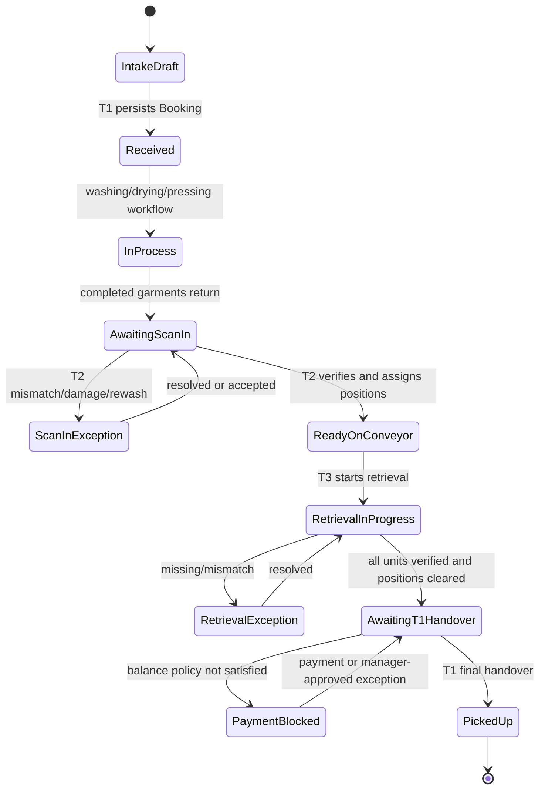

# KitLuy Suite Ecosystem — Rebuild Bible

**Filename:** `kitluy-suite-rebuild-bible-v3.0.0.md`  
**Version:** v3.0.0  
**Date:** 2026-07-10  
**Owner:** HET / KitLuy Suite project owner  
**Status:** Canonical consolidated rebuild specification  
**Scope:** Entire KitLuy Suite ecosystem, current clean-stage architecture  
**Primary industry:** Laundry Industry  
**Project boundary:** KitLuy-only for this stage. No active dependency on SroulERP, Netra, Rotanak, or Prajna.  
**Naming update:** `Seller` is retired as an official product name. Use `Partner` going forward.

> **Mission:** This handbook must pass the **Rebuild Test**: *If every person who built KitLuy Suite disappeared tomorrow, could a single engineer with zero prior context reconstruct the product, infrastructure, and business logic from this document alone?*  
> **Required answer:** Yes.


## Source Baseline, Authority, and Reconciliation Order

This v3.0.0 handbook consolidates the following planning authorities:

1. `kitluy-suite-ecosystem-rebuild-bible-v2.0.0.md` for the ecosystem baseline.
2. `kitluy-admin-pwa-portal-rebuild-bible-v2.0.0.md` for HET platform-owner operations.
3. `kitluy-chain-portal-rebuild-bible-v2.0.0.md` for multi-store, chain, franchise, catalog, and compliance scope.
4. `kitluy-partner-pwa-portal-rebuild-bible-v1.0.0.md` for one-store back-office scope.
5. `kitluy-partner-app-rebuild-bible-v1.0.0.md` for the owner/manager mobile daily-operations cockpit.
6. `kitluy-suite-business-bible-v1.0.0.md` for business positioning, operating model, commercial unknowns, and takeover controls.
7. `canvar-ecom-spec-productdetail-v1.md` only for the KitLuy-to-Canvar marketplace connector contract and public shop projection boundary.
8. Latest project-owner decisions recorded in KitLuy project conversations for Laundry terminal roles and naming.

Authority order for rebuild decisions:

```text
live repository migrations and tests
  -> this v3.0.0 ecosystem bible
  -> current product-specific bibles
  -> approved AI handoff notes
  -> older v2/v1 ecosystem documents
  -> legacy Seller-named documents
```

If live SQL or verified code conflicts with this document, the rebuild engineer must not silently choose. Record the conflict in Appendix C, preserve production data, and obtain project-owner approval before changing the canonical model.

### Locked v3.0.0 Decisions

- Current stage is KitLuy-only and Laundry-first.
- The product path is offline store operations -> online management -> e-commerce and marketplace expansion.
- `Partner` is the business-facing term. `Tenant` is the backend account boundary. `Seller` is legacy only.
- One store belongs to exactly one vertical. A Laundry store cannot also operate Cafe, Restaurant, or Retail under the same store record.
- Store operations are offline-first through the Store Hub. Cloud portals expose sync freshness and must not present stale cloud data as live truth.
- Supabase owns PostgreSQL, Auth, RLS, Edge Functions, Realtime, audit/event tables, vector metadata, ownership metadata, and permissions.
- DigitalOcean owns application/service hosting, Spaces heavy-file storage, and the first AI inference layer.
- Supabase Storage is not the primary heavy-file layer.
- AI is provider-agnostic, permission-scoped, logged, and human-confirmed for sensitive actions.
- Admin, Chain, Partner, POS, Hub, File, and AI responsibilities remain separate.
- The Partner App is an owner/manager operations cockpit. It does not replace the Partner PWA Portal and is not the POS Mobile App.
- In Partner App business-facing UX, use `Booking` or `Laundry Booking`; backend contracts may retain `order` for compatibility.
- POS Desktop Laundry Phase 1 uses three logical terminal roles: T1 Intake/Cashier, T2 Scan In, and T3 Scan Out. T2 and T3 are separate permissioned modes on the same physical shared conveyor terminal.
- Canvar and future sales channels are optional Integration Hub connectors. KitLuy remains the Partner source of truth; the channel receives approved projections, not unrestricted operational data.

---

## 0. Front Matter — Rebuild Sequence

### REBUILD SEQUENCE — KitLuy Suite Ecosystem v3.0.0

1. **Provision infrastructure**
   - Supabase project in Singapore / SGP1 region for database, Auth, Realtime, Edge Functions, pgvector, audit/event tables.
   - DigitalOcean SGP1 for web hosting, AI gateway services, MCP server, workers, and optional app services.
   - DigitalOcean Spaces for images, documents, uploads, RAG source files, exports, logs, and backups.
   - DigitalOcean Inference Engine as the first LLM inference layer.
   - Required exact project IDs, bucket names, and domains: `[REQUIRED: production Supabase project ref, DigitalOcean project name, Spaces bucket names, domains]`.

2. **Apply database migrations in order**
   - `000_enable_extensions.sql`
   - `001_kitluy_core_schema.sql`
   - `002_kitluy_admin_schema.sql`
   - `003_kitluy_chain_schema.sql`
   - `004_kitluy_partner_schema.sql`
   - `005_kitluy_pos_schema.sql`
   - `006_kitluy_laundry_vertical_schema.sql`
   - `007_kitluy_orders_payments_schema.sql`
   - `008_kitluy_inventory_schema.sql`
   - `009_kitluy_employee_finance_reports_schema.sql`
   - `010_kitluy_devices_sync_schema.sql`
   - `011_kitluy_files_schema.sql`
   - `012_kitluy_ai_rag_mcp_schema.sql`
   - `013_kitluy_integrations_notifications_schema.sql`
   - `014_kitluy_events_audit_schema.sql`
   - `015_kitluy_rls_policies.sql`
   - `016_kitluy_indexes_constraints.sql`
   - `017_kitluy_seed_baseline.sql`
   - `018_kitluy_laundry_conveyor_terminal_delta.sql`
   - `019_kitluy_canvar_connector_delta.sql`
   - If live applied migrations use different names, preserve history and create a reconciliation map.
   - Do not auto-apply production migrations from AI tools. Engineering writes migrations; an authorized operator applies them.

3. **Seed baseline data**
   - Platform owner roles.
   - Subscription plan catalog.
   - Laundry vertical enum and default service templates.
   - Default order statuses.
   - Default device/register types.
   - Default AI prompt policies and MCP tool registry.
   - See Part 16 and Part 6.

4. **Deploy API contracts / Edge Functions**
   - Core auth/session helpers.
   - Tenant and store provisioning.
   - Laundry order functions.
   - Payment functions.
   - Sync functions.
   - Device heartbeat functions.
   - File service functions.
   - AI gateway, RAG indexer, and MCP tool execution endpoints.
   - See Part 7.

5. **Configure secrets and third-party credentials**
   - Supabase URL, anon key, service role key.
   - DigitalOcean Spaces access key and secret key.
   - DigitalOcean Inference Engine endpoint/key.
   - ABA PayWay / KHQR credentials when activated.
   - Telegram/SMS/email provider tokens when activated.
   - Maps provider key if used.
   - See Part 5 and Part 11.

6. **Build / image local hardware or nodes**
   - Image Raspberry Pi 5 Store Hub.
   - Install OS, PostgreSQL, sync agent, hub API, device monitor.
   - Pair POS Desktop terminals, printers, scanners, scales, and optional conveyor controller.
   - See Part 11.

7. **Pair / register clients to backend**
   - Register tenant, store, hub, POS terminals, mobile devices.
   - Bind devices to store and role.
   - Verify heartbeats and sync status.
   - See Part 11.

8. **Run QA validation scenarios**
   - Run QA-001 through QA-050 covering Admin, Chain, Partner, POS, T1/T2/T3, offline sync, files, AI/RAG/MCP, payments, integrations, RBAC, recovery, and go-live readiness.
   - See Part 15.

9. **Verify monitoring and alerting**
   - Hub heartbeat.
   - POS terminal heartbeat.
   - Sync queue depth.
   - Edge function error rate.
   - Payment failures.
   - File upload failures.
   - AI gateway latency/cost/errors.
   - See Part 12.

10. **Go-live smoke test**
    - Create tenant -> create Laundry store -> register Hub -> pair T1 and shared T2/T3 terminal -> create Booking at T1 -> capture deposit/payment -> print receipt/tag -> process and return garments -> T2 Scan In/assign conveyor -> T3 Scan Out/retrieve -> T1 final balance/handover -> sync cloud -> verify Partner/Chain/Admin views -> ask scoped AI for summary -> close and reconcile shift.
    - See Part 16.

---

## Part 1 — Glossary

### 1.1 Platform Terms

| Term | Definition |
|---|---|
| KitLuy | Khmer-inspired commerce operating ecosystem for Cambodian businesses. For this stage, KitLuy is standalone and does not depend on SroulERP, Netra, Rotanak, or Prajna. |
| KitLuy Suite | The full KitLuy software ecosystem: Admin Portal, Chain Portal, Partner Portal, Partner App, POS Desktop App, POS Mobile App, shared backend, Store Hub, AI Gateway, MCP Server, File Service, and sync services. |
| KitLuy-only stage | The current development rule: all active features must be built inside KitLuy or treated as generic third-party integrations. No active dependency on sibling/future systems. |
| Cambodia-first | Product decisions prioritize Cambodian business realities: Khmer-first UX, KHR-native money, KHQR/payment readiness, offline-first operation, affordable hardware, and practical SME workflows. |
| Vertical | An industry-specific business bundle. A vertical includes workflow, schema delta, order lifecycle, reports, hardware profile, feature index, and UI adjustments. It is not merely a UI skin. |
| Laundry Industry | First active vertical and MVP baseline. All planning starts here unless explicitly changed. |
| Store | One physical business location using KitLuy. A store belongs to exactly one vertical. |
| Tenant | A business customer/account using KitLuy. One tenant may have one store, many stores, or a chain structure. |
| Partner | A business using KitLuy to operate, manage, and grow its store. Replaces the old term “Seller.” |
| Platform Owner | HET / KitLuy internal operator managing the entire platform through Admin Portal. |
| Chain | A multi-store brand, franchise, or branch network managed through Chain Portal. |
| Store Hub | Local Raspberry Pi 5 server at a store. Runs local PostgreSQL, sync agent, hub API, and device monitor. |
| Offline-first | Store operations continue during WAN/internet failure. POS writes to local hub first; hub syncs cloud when WAN returns. |
| Cloud backend | Supabase + DigitalOcean services used by KitLuy. Supabase is system-of-record database/auth/realtime/vector metadata; DigitalOcean handles compute/storage/inference. |
| Rebuild Test | Standard requiring a single engineer with no prior context to rebuild the product from this handbook and referenced migrations. |

### 1.2 Product Terms

| Product | Definition |
|---|---|
| `kitluy-admin-portal` | Web app for HET/platform owner. Manages tenants, subscriptions, billing, support, device registry, audit, platform health, and internal operations. |
| `kitluy-chain-portal` | Web app for brand, chain, or franchise owner. Manages multiple shops, branch performance, central catalog push, brand standards, compliance, and franchise structure. |
| `kitluy-partner-portal` | Web back office for one store/business owner. Replaces old `kitluy-seller-portal`. Manages services, catalog, staff, customers, orders, reports, store settings, and AI BI. |
| `kitluy-partner-app` | Mobile daily-operations companion for one-store owners/managers. Replaces old `kitluy-seller-app`. Shares the same scoped backend and core concepts but intentionally does not replace the full Partner Portal. |
| `kitluy-pos-desktop-app` | Fixed in-store POS terminal for staff. Electron + React on Raspberry Pi 5 / desktop-class terminal. Handles counter operations. |
| `kitluy-pos-mobile-app` | Roaming mobile POS for staff. Same order/payment logic as POS Desktop, mobile shell. Does not replace POS Desktop in phase 1. |
| `kitluy-file-service` | Internal service controlling DigitalOcean Spaces upload/download, file metadata, permissions, audit, thumbnails, and RAG source registration. |
| `kitluy-ai-gateway` | Internal AI orchestration service. Performs RBAC, prompt policy, RAG retrieval, MCP routing, provider routing, logging, and DigitalOcean Inference Engine calls. |
| `kitluy-mcp-server` | Server exposing approved KitLuy tools/actions to the AI layer. Tool calls are audited and permission-scoped. |
| `kitluy-rag-indexer` | Worker/service that converts documents and selected operational records into chunks and embeddings. |
| `kitluy-hub-agent` | Store Hub service handling local sync, hardware health, device pairing, local queueing, and cloud communication. |

### 1.3 Commerce Terms

| Term | Definition |
|---|---|
| Commerce Plan | Single-store subscription plan. Exact price: `[REQUIRED: final KHR price]`. Previous working assumption was ៛30/store/month; must be confirmed. |
| Chain Plan | Multi-store subscription plan. Exact price: `[REQUIRED: final KHR price]`. Previous working assumption was ៛100 HQ + ៛50/store/month; must be confirmed. |
| 0% commission | KitLuy does not take order revenue commission in the current stage. Revenue is SaaS/subscription/add-on based. |
| Subscription | Monthly SaaS billing for a tenant/store/chain. |
| Trial | Default trial duration: `[REQUIRED: final trial days; previous docs used 14 days]`. |
| KHR | Cambodian Riel. KitLuy displays KHR natively using `៛`. Internal storage uses integer KHR unless a future multi-currency ledger requires explicit decimals. |
| KHQR | Cambodia QR payment standard. Used for QR payment integration when activated. |
| Receipt | Customer-facing proof of transaction. May be printed, digital, or exported. |
| Laundry Tag | Physical label/slip attached to order or garment/bag for tracking. |
| Shift | Staff operating period on POS. Opened with cash float and closed with reconciliation/Z-report. |
| Order Status | Lifecycle state for laundry order. Recommended base statuses: New, Received, Washing, Drying, Ironing, Ready, Picked Up, Cancelled, Issue/Rewash/Damaged. |
| Chain-of-custody | Garment/order traceability from intake through processing, QA, packaging, and handover. |

### 1.4 Hardware Terms

| Term | Definition |
|---|---|
| Raspberry Pi 5 Hub | Recommended local store hub hardware. Minimum 8GB RAM, NVMe storage, active cooling, UPS. |
| POS Terminal | Physical device running POS Desktop. Usually touchscreen + printer/scanner/scale. |
| Receipt Printer | ESC/POS thermal printer used for receipts. |
| Tag Printer | Label printer for laundry tags. Supports printer-specific command languages such as ESC/POS, TSPL, or ZPL depending on model. |
| USB Scale | Scale used for per-kg laundry pricing. Must support tare, stabilization, retry, and confidence states. |
| Barcode/QR Scanner | Scanner used for order/tag lookup. Keyboard wedge is first-phase default; HID/native support later. |
| Cash Drawer | Optional drawer triggered through receipt printer pulse. |
| Conveyor Controller | Optional laundry dispatch/storage hardware controller. Not required for all MVP stores but schema and interfaces should be conveyor-ready. |
| UPS | Uninterruptible Power Supply. Recommended for hub and core POS device in Cambodian store environments. |

### 1.5 AI Terms

| Term | Definition |
|---|---|
| LLM | Large Language Model used for natural-language reasoning, reporting, summarization, and assistant workflows. |
| DigitalOcean Inference Engine | First inference layer for KitLuy LLM calls. The architecture must remain provider-agnostic. |
| RAG | Retrieval-Augmented Generation. AI answers are grounded in KitLuy documents and operational data retrieved from vector search and metadata filters. |
| MCP | Model Context Protocol-style tool interface that lets the AI safely call approved KitLuy tools/actions. |
| AI Gateway | KitLuy service that applies permissions, prompt policy, retrieval, model routing, tool routing, safety rules, and audit. |
| AI Business Intelligence | KitLuy-native AI layer for reporting, insights, anomaly detection, operational summaries, and decision support. |
| Prompt Policy | Templates and rules controlling what the AI may answer, retrieve, and do per product/role/scope. |
| Tool Call | A structured MCP action invoked by AI, such as search order, summarize sales, check device status, or draft notification. |

### 1.6 Removed / Future Terms

| Term | Current Status |
|---|---|
| SroulERP | Not active in current KitLuy stage. Do not design KitLuy MVP around it. Future enterprise integration may be parked. |
| Netra | Not active dependency. Old Netra AI references convert into KitLuy AI or future integration. |
| Rotanak | Not active dependency. Old Rotanak loyalty references convert into KitLuy-native basic loyalty or future integration. |
| Prajna | Not active dependency. Treat as future separate project if mentioned. |
| HSAL | Not active dependency. Logistics should be generic integration-ready, not HSAL-dependent. |
| Canvār | Future e-commerce/marketplace connector concept only; not active in MVP. |
| Seller | Retired official name. Old Seller Portal/App references map to Partner Portal/App. |

---

### 1.7 Laundry Terminal and Workflow Terms

| Term | Definition |
|---|---|
| Laundry Booking | Business-facing name for a customer laundry job. It contains customer, services, per-kg/per-piece lines, due date, payment state, tags, garments, photos, status, and issue history. Backend tables may use `order` for compatibility. |
| T1 Intake/Cashier | Fixed customer-facing POS mode. Creates the Laundry Booking, identifies or creates the customer, records garments, captures weight and piece counts, calculates charges, accepts deposit or full payment, prints receipt and tags, and performs final handover confirmation. |
| T2 Scan In | Shared conveyor terminal mode used when completed garments return to the shop. Staff scan and verify garments, assign conveyor positions, record discrepancies, and mark the Booking ready for pickup. |
| T3 Scan Out | Shared conveyor terminal mode used when staff retrieve garments for a customer. Staff locate and clear conveyor positions, verify all expected garments, and route the Booking to T1 for balance collection and handover. |
| Shared Conveyor Terminal | One physical terminal that can switch between T2 Scan In and T3 Scan Out. The modes share hardware but not permissions, queues, screen layouts, or audit event types. |
| Conveyor Position | A uniquely addressable physical storage position assigned to one garment, bag, or Booking unit while waiting for pickup. |
| Scan Event | Append-only chain-of-custody record capturing barcode/tag, actor, terminal mode, timestamp, source state, destination state, and optional conveyor position. |
| Garment Exception | Missing, extra, mismatched, damaged, rewash, or unscannable garment discovered during intake, processing return, retrieval, or handover. |
| Ready Verification | T2 confirmation that expected completed garments are present and assigned before the Booking becomes `Ready`. |
| Handover Verification | T1 final confirmation that garments retrieved by T3 match the Booking and payment policy is satisfied before `Picked Up`. |

### 1.8 Integration Hub and Sales-Channel Terms

| Term | Definition |
|---|---|
| Integration Hub | Partner and Admin module that manages optional connectors, credentials, consent, health, scopes, webhooks, and disconnect/revoke workflows. |
| Sales Channel | An external or KitLuy-owned destination that receives approved business/catalog projections and may return bookings/orders or status events. It is not the Partner system of record. |
| Canvar Marketplace | Optional e-commerce marketplace sales channel. A Partner opts in through Integration Hub; KitLuy provisions a marketplace shop projection after eligibility and approval. |
| Channel Connection | Versioned relationship between a tenant/store and one connector, including status, granted scopes, credential reference, sync cursor, webhook state, and last health test. |
| Public Shop Projection | Minimum buyer-facing business identity sent to a marketplace: display name, logo, location label, verified status, support contact, policies, payment/delivery capabilities, and approved catalog visibility. |
| Catalog Projection | Channel-safe representation of services/products, prices, variants, availability, media, and policies. Internal finance, staff, device, subscription, and security data are excluded. |
| Channel Order Ingress | Validated inbound order/booking message from a connected channel. It is normalized into a KitLuy Booking only after signature, deduplication, mapping, and policy checks. |
| Disconnect | Revocation of a channel connection. It stops new publishing and inbound processing according to policy without deleting historical audit records. |

### 1.9 Feature-Index Prefixes

| Prefix | Home scope |
|---|---|
| `KL-EC-*` | Ecosystem and shared architecture. |
| `KL-AP-*` | Admin Portal. |
| `KL-CP-*` | Chain Portal. |
| `KL-PP-*` | Partner PWA Portal. |
| `KL-PA-*` | Partner App. |
| `KL-POSD-*` | POS Desktop. |
| `KL-POSM-*` | POS Mobile. |
| `KL-HUB-*` | Store Hub / Hub Agent. |
| `KL-FILE-*` | File Service. |
| `KL-AI-*` | AI Gateway, RAG, MCP, and provider routing. |
| `KL-NTF-*` | Notification Service. |
| `KL-INT-*` | Integration Hub and channel connectors. |
| `KL-LDY-*` | Laundry vertical shared workflow. |


## Part 2 — Business Overview

### 2.1 What It Is

KitLuy Suite is a **Cambodia-first commerce operating ecosystem** for businesses that need to digitize offline operations, manage their business online, and eventually expand into e-commerce or marketplace-style channels. The first vertical is Laundry, where KitLuy gives shops a serious operational backbone: POS, customer/order management, pricing, receipt/tag printing, garment workflow, shifts, reports, offline-first continuity, and AI business intelligence.

KitLuy can be described as: **an offline-to-online-to-e-commerce operating system for Cambodian business industries, starting with Laundry.** It is not only a POS. It is the store operations, management portal, chain management, platform administration, data layer, and AI business intelligence foundation around the POS.

### 2.2 What It Is Not

KitLuy is not a generic global POS clone. It is Cambodia-first: KHR-native, Khmer-first, KHQR-ready, offline-first, and designed around affordable hardware and local operating realities.

KitLuy is not dependent on SroulERP, Netra, Rotanak, Prajna, HSAL, or Canvār in this stage. Old documents may mention them, but current v2.0.0 architecture treats them as removed, future, or generic integration concepts.

KitLuy is not a monolithic app. It is a suite with six deployable builds and shared services. Admin, Chain, Partner, and POS responsibilities must stay separate.

### 2.3 Verticals / Modules

| Vertical | Stage | Summary | Rule |
|---|---|---|---|
| Laundry | Active Phase 1 | POS, order intake, per-kg/per-piece pricing, tags, garment tracking, receipt, status workflow, shifts, reports, offline operation, AI BI. | Build first. |
| Café / Milk Tea | Future | Modifiers, queue, KDS, BOM/recipe, pickup board, KHQR fast checkout. | Park until Laundry MVP stable. |
| Restaurant | Future | Tables, course firing, KDS routing, split billing, reservations, recipe/cost control. | Park. |
| Retail | Future | SKU inventory, stock reservation, channel sync, returns, replenishment, unified commerce. | Park. |

**Locked rule:** One store belongs to one vertical. A laundry store cannot also run café POS under the same store record. Multi-vertical operators must create separate stores or separate chains.

### 2.4 Product / Build Inventory

| # | Build | Audience | Form Factor | Scope |
|---|---|---|---|---|
| 1 | `kitluy-admin-portal` | HET / platform owner | Web | God-view: tenants, subscriptions, billing, support, devices, audit, platform health, AI admin intelligence. |
| 2 | `kitluy-chain-portal` | Brand / chain / franchise owner | Web | Multi-store HQ, branch comparison, central catalog/service push, brand standards, compliance, chain reports. |
| 3 | `kitluy-partner-portal` | Individual business owner / one-store operator | Web | One-store back office: services, staff, customers, orders, reports, settings, AI BI. |
| 4 | `kitluy-partner-app` | Individual business owner / manager | Mobile | Mobile Partner Portal, same backend and scope, mobile-first alerts/approvals. |
| 5 | `kitluy-pos-desktop-app` | Store staff | Desktop / Electron | Fixed register: orders, payment, receipt/tag printing, shift, status updates, offline operation. |
| 6 | `kitluy-pos-mobile-app` | Store staff | Mobile | Roaming register, pickup/QA/status helper, mobile intake, line-busting. |
| 7 | `kitluy-hub-agent` | Store infrastructure | Raspberry Pi service | Local DB, sync engine, hardware health, LAN API, offline queue. |
| 8 | `kitluy-file-service` | Internal service | Cloud service/edge functions | DigitalOcean Spaces file control and metadata. |
| 9 | `kitluy-ai-gateway` | Internal service | Cloud service | AI orchestration, RAG, provider routing, audit, safety. |
| 10 | `kitluy-mcp-server` | Internal service | Cloud service | Approved AI tools/actions. |
| 11 | `kitluy-rag-indexer` | Internal worker | Cloud worker | Chunking, embedding, indexing source documents and operational knowledge. |
| 12 | `kitluy-notification-service` | Internal service | Cloud service | Telegram/SMS/email/push/in-app notifications. |

### 2.5 Business Model

| Lever | Rule |
|---|---|
| Revenue model | SaaS subscription first. 0% order commission in current stage. |
| Commerce/single-store plan | `[REQUIRED: final monthly KHR price]` |
| Chain plan | `[REQUIRED: final HQ fee and per-store monthly KHR price]` |
| Trial | `[REQUIRED: confirm trial duration; previous docs used 14 days]` |
| Hardware | Store hardware is sold, leased, or procured separately. Exact commercial policy required. |
| AI | AI BI may be included in base or offered as add-on tiers. `[REQUIRED: pricing decision]` |
| Storage | Heavy storage costs should be tracked and may become plan limits or add-ons. |
| Payments | Cash required in MVP; KHQR/ABA PayWay integration when activated. |

### 2.6 Moat / Defensibility

1. **Cambodia-first localization:** Khmer UX, KHR-native display, KHQR readiness, Cambodian phone formats, local business workflows.
2. **Offline-first architecture:** Pi 5 hub and local sync make KitLuy resilient to internet failure where cloud-only systems struggle.
3. **Laundry operational depth:** Tags, garment chain-of-custody, scale, rewash, damage photos, packaging, and conveyor-ready design are harder to copy than generic checkout.
4. **Six-build ecosystem:** Admin, Chain, Partner, POS Desktop, POS Mobile, and Partner App cover different business users without merging responsibilities.
5. **Native AI BI:** Built-in RAG/MCP/LLM architecture turns daily operational data into insights while keeping provider flexibility.
6. **DigitalOcean-aligned infrastructure:** Spaces and Inference Engine create scalable storage and AI runtime without managing GPUs or bloating Supabase storage.

### 2.7 Ecosystem Position — Owned vs. Future

| Capability | Current Owner | Current Status |
|---|---|---|
| POS, orders, services, catalog, payments, staff, customers | KitLuy | Owned, active. |
| Admin/Chain/Partner portals | KitLuy | Owned, active. |
| Store hub and offline sync | KitLuy | Owned, active. |
| AI BI, RAG, MCP, LLM orchestration | KitLuy | Owned, active. |
| Heavy file storage | DigitalOcean Spaces | Provider used by KitLuy. |
| LLM inference | DigitalOcean Inference Engine first | Provider used by KitLuy; must remain swappable. |
| Loyalty | KitLuy-native basic loyalty or future integration | Not Rotanak-dependent. |
| Logistics | Generic future integration | Not HSAL-dependent. |
| ERP/back-office | Future separate integration | Not SroulERP-dependent. |

---

### 2.8 Canonical Product Boundaries

| Build / service | Primary actor | Owns | Must not own |
|---|---|---|---|
| `kitluy-admin-portal` | HET platform owner and authorized internal operators | Tenant/store provisioning, subscriptions, support, platform health, connector governance, audit, fleet visibility | Store cashier workflow, chain commercial policy, day-to-day store management |
| `kitluy-chain-portal` | Chain/franchise owner and HQ roles | Multi-store comparison, master catalog, brand standards, availability policy, compliance, franchise/royalty features | Platform-wide administration, one-store cashier operation |
| `kitluy-partner-portal` | One-store owner/manager | Full store back office, services/pricing, employees, customers, inventory, finance, reports, settings, integrations | Platform-owner controls, multi-chain authority, staff checkout terminal |
| `kitluy-partner-app` | One-store owner/manager | Mobile daily oversight, approvals, alerts, Bookings, finance snapshot, staff/inventory/store health | Full configuration parity with PWA, checkout/register behavior |
| `kitluy-pos-desktop-app` | Store staff | Fixed POS, intake, payment, printing, T1/T2/T3 terminal workflows, shifts, offline operation | Owner back-office configuration, platform administration |
| `kitluy-pos-mobile-app` | Roaming store staff | Mobile intake/status/pickup assistance and line-busting within POS permissions | Partner owner cockpit, full fixed-terminal replacement in Phase 1 |
| `kitluy-hub-agent` | Machine/service identity | Local operational database, queue, sync, device pairing, LAN APIs, heartbeat | Business UI, cloud admin, AI policy decisions |
| `kitluy-file-service` | Internal service | Signed file access, object-key policy, metadata, authorization, lifecycle, checksums | Business workflow decisions, direct client secret exposure |
| `kitluy-ai-gateway` | Internal service | AI request policy, provider routing, RAG retrieval, MCP authorization, cost/latency logging | Direct unrestricted database access, autonomous sensitive mutation |
| `kitluy-mcp-server` | Internal service | Approved tool registry and audited tool execution | General application API replacement |
| `kitluy-rag-indexer` | Internal worker | Document normalization, chunking, embedding, index lifecycle | Source-document ownership, final authorization |
| `kitluy-notification-service` | Internal service | Template rendering, provider routing, delivery attempts, preference enforcement | Booking state changes or financial truth |

### 2.9 Laundry-First Operating Model

The first complete commercial product is the Laundry vertical. Phase 1 must support customers, Laundry Bookings, per-kilogram and per-piece pricing, add-ons, due and pickup dates, statuses, payments, receipts, laundry tags, shifts, daily sales, offline operation, Store Hub synchronization, device pairing, garment/damage photos, and a basic AI summary.

The customer and garment journey is anchored at T1. T1 creates and bills the Booking. Completed garments return to the shop through T2 Scan In, where they are verified and placed on the conveyor. Customer retrieval uses T3 Scan Out to clear conveyor positions and send the verified set to T1. T1 performs payment-policy enforcement and final handover. This separation prevents conveyor activity from silently changing financial truth.

### 2.10 Offline -> Online -> E-commerce Progression

```text
Stage A: Offline Store Operations
POS + Store Hub + printers/scanners/scale + local workflow truth

Stage B: Online Management
Admin + Chain + Partner PWA/App + cloud reports + support + monitoring

Stage C: E-commerce / Marketplace Expansion
Integration Hub + channel consent + catalog projection + inbound Booking normalization

Stage D: KitLuy-Native Intelligence
AI Gateway + RAG + MCP + provider-agnostic models + scoped BI and explanations
```

The stages are cumulative. Stage C must not become a prerequisite for Stage A. A laundry shop must continue to operate if Canvar, any future channel, the payment gateway, the AI provider, or the public internet is unavailable.

### 2.11 Business Model Guardrails

- Primary revenue is recurring SaaS subscription, implementation/onboarding, approved add-ons, support tiers, and optional hardware/service bundles.
- Current architecture assumes 0% KitLuy commission on a Partner's store revenue unless a future approved commercial policy explicitly introduces a channel/service fee.
- Exact plan prices, trial duration, installation fees, hardware margin, support SLAs, and channel fees are `[REQUIRED: commercial approval]` and must not be hardcoded before approval.
- Billing status may affect cloud management access, but suspension policy must never corrupt local operational records or silently delete Partner data.
- Marketplace economics are connector-specific. Canvar fees, if any, belong to an approved Canvar commercial contract and are not inferred inside KitLuy core.

### 2.12 Canvar and Future Channel Position

KitLuy is the merchant operating account and source of truth. Canvar is one optional sales channel. A Partner joins KitLuy first, completes the business profile and store setup, then enables Canvar through `Partner Portal -> Integration Hub -> Sales Channels -> Canvar Marketplace`.

Locked eligibility rules:

```text
No KitLuy Partner account -> no Canvar shop.
No completed KitLuy business profile -> no Canvar activation.
No Partner opt-in and consent -> no channel connection.
No approved catalog projection -> no buyer-visible listing.
Disconnect or suspension -> stop new publishing according to policy; retain audit history.
```

The connector sends only the minimum approved projection. Canvar must not receive POS PINs, staff records, raw device telemetry, subscription secrets, internal finance ledgers, bank setup internals, AI logs, or unrelated customer data.


## Part 3 — System Architecture & Topology

### 3.1 Topology Diagram

```text
                                WAN / INTERNET
┌─────────────────────────────────────────────────────────────────────────────┐
│                           DIGITALOCEAN / SUPABASE CLOUD                    │
│                                                                             │
│  ┌───────────────────────┐      ┌───────────────────────────────────────┐  │
│  │ Web Apps on DO SGP1   │      │ Supabase SGP1                         │  │
│  │ - Admin Portal        │─────▶│ - PostgreSQL                          │  │
│  │ - Chain Portal        │      │ - Auth / RLS                          │  │
│  │ - Partner Portal      │      │ - Realtime                            │  │
│  └───────────────────────┘      │ - Edge Functions                      │  │
│                                 │ - pgvector                            │  │
│  ┌───────────────────────┐      │ - Audit / Events                      │  │
│  │ Mobile Apps           │─────▶└───────────────────────────────────────┘  │
│  │ - Partner App         │                                                 │
│  │ - POS Mobile App      │      ┌───────────────────────────────────────┐  │
│  └───────────────────────┘      │ DigitalOcean Spaces                   │  │
│                                 │ - public media                        │  │
│  ┌───────────────────────┐      │ - private files                       │  │
│  │ KitLuy File Service   │─────▶│ - RAG source docs                     │  │
│  └───────────────────────┘      │ - backups / exports                   │  │
│                                 └───────────────────────────────────────┘  │
│  ┌───────────────────────┐      ┌───────────────────────────────────────┐  │
│  │ KitLuy AI Gateway     │─────▶│ DigitalOcean Inference Engine         │  │
│  │ RAG + MCP + audit     │      │ first LLM inference layer             │  │
│  └──────────┬────────────┘      └───────────────────────────────────────┘  │
│             │                                                               │
│  ┌──────────▼────────────┐                                                  │
│  │ KitLuy MCP Server     │                                                  │
│  │ approved tools only   │                                                  │
│  └───────────────────────┘                                                  │
└─────────────────────────────────────────────────────────────────────────────┘
                              ▲
                              │ WAN sync, HTTPS, WSS
                              ▼
┌─────────────────────────────────────────────────────────────────────────────┐
│                              STORE LAN                                      │
│                                                                             │
│  ┌───────────────────────────────────────────────────────────────────────┐  │
│  │ Store Hub — Raspberry Pi 5 8GB + NVMe                                 │  │
│  │ - Local PostgreSQL                                                    │  │
│  │ - Hub API                                                             │  │
│  │ - Sync Agent                                                          │  │
│  │ - Local file cache / upload queue                                     │  │
│  │ - Device monitor                                                      │  │
│  └───────────┬──────────────────────┬──────────────────────┬─────────────┘  │
│              │ LAN API               │ LAN API               │ LAN API        │
│  ┌───────────▼───────────┐  ┌────────▼─────────┐  ┌────────▼─────────────┐  │
│  │ POS Desktop T1        │  │ POS Mobile       │  │ Optional Devices      │  │
│  │ - order intake        │  │ - roaming POS    │  │ - receipt printer     │  │
│  │ - payment             │  │ - scan/status    │  │ - tag printer         │  │
│  │ - receipt/tag print   │  │ - pickup helper  │  │ - USB scale           │  │
│  └───────────────────────┘  └──────────────────┘  │ - scanner/conveyor    │  │
│                                                    └──────────────────────┘  │
└─────────────────────────────────────────────────────────────────────────────┘
```

### 3.2 Critical Data Flow Maps

#### 3.2.1 Laundry Order Creation — Walk-in Cash

1. Staff logs into POS Desktop using staff session/PIN.
2. POS Desktop calls Store Hub local API: `POST /local/orders/laundry/create`.
3. Hub writes order, order lines, customer link, due date, and initial status to local PostgreSQL.
4. Hub appends an outbox event with idempotency key.
5. POS prints receipt and tag using local printer bridge.
6. Hub sync agent pushes event to Supabase when WAN is available.
7. Supabase stores order and emits domain event.
8. Partner Portal and Admin Portal show synced order.
9. AI event pipeline can later use the event for BI summaries.

#### 3.2.2 Garment Photo Upload — Online

1. POS or mobile app captures garment damage/stain photo.
2. App requests signed upload from `kitluy-file-service`.
3. File Service checks user role, tenant, store, and file type.
4. File Service creates `kitluy_files.assets` metadata row with `status='pending'`.
5. File Service returns short-lived signed upload URL to DigitalOcean Spaces.
6. App uploads file directly to Spaces.
7. App confirms upload complete.
8. File Service verifies object metadata and marks asset `active`.
9. Order record references `asset_id`.
10. Audit log records upload.

#### 3.2.3 Garment Photo Upload — Offline

1. POS captures photo while WAN is down.
2. POS sends file to Store Hub local file cache.
3. Hub creates local pending asset metadata and upload queue item.
4. Order can proceed and tag/receipt can print.
5. When WAN returns, Hub asks File Service for signed upload URL.
6. Hub uploads file to DigitalOcean Spaces.
7. Hub syncs asset metadata to Supabase and links it to order.
8. Partner/Admin portals show photo after sync.

#### 3.2.4 RAG / AI Question

1. User asks in Admin/Chain/Partner/POS UI: “What caused rewash issues this week?”
2. UI sends request to KitLuy AI Gateway.
3. AI Gateway validates JWT, role, tenant/store/chain scope.
4. AI Gateway builds retrieval filters.
5. RAG layer queries Supabase pgvector and metadata tables.
6. Relevant chunks, order summaries, SOPs, and issue logs are returned.
7. AI Gateway calls DigitalOcean Inference Engine.
8. If a tool is needed, AI Gateway calls KitLuy MCP Server after permission check.
9. Response is returned with citations to internal records where possible.
10. Prompt, retrieval, cost, latency, and tool calls are logged.

### 3.3 Offline-First Protocol

| Rule | Canonical Policy |
|---|---|
| Write path | POS and store operations write to Store Hub first. |
| Cloud sync | Store Hub syncs to Supabase via outbox/inbox events. |
| Portal reads | Admin/Chain/Partner portals read cloud state; they may show sync freshness. |
| Terminal cloud access | POS terminals should not directly write to Supabase for store operations. |
| Idempotency key | `{device_id}:{local_counter}:{timestamp_ms}:{operation_type}` |
| Financial records | Append-only or first-write-wins; never blindly overwritten. |
| Operational records | Deterministic merge; default last-write-wins only for safe non-financial state. |
| Retry | Exponential backoff, max attempts `[REQUIRED: exact max]`, dead-letter after repeated failure. |
| Burst sync | Oldest batch first, capped rate to avoid overwhelming cloud. |
| Offline file cache | Store Hub stores files temporarily, then uploads when WAN returns. |

### 3.4 Hardware Placement — Laundry Phase 1

| Component | Minimum | Recommended | Notes |
|---|---|---|---|
| Store Hub | Raspberry Pi 5 8GB | Pi 5 8GB + NVMe 256GB + metal cooling case | Local DB and sync. |
| POS Desktop | Pi 5 4GB or mini PC | Pi 5 4GB/8GB touchscreen terminal | Fixed counter station. |
| POS Mobile | Android/iOS | Rugged Android recommended for store floor | Roaming intake/status. |
| Receipt Printer | ESC/POS 80mm | USB/Ethernet thermal printer | Cash drawer pulse optional. |
| Tag Printer | Barcode label printer | TSPL/ZPL/ESC/POS depending model | Template profiles required. |
| USB Scale | HID/serial scale | Stable-weight capable scale | Tare and confidence handling required. |
| Scanner | Keyboard wedge | HID/native later | Barcode/QR tag scan. |
| Conveyor | Optional | Interface-ready | Do not block MVP on conveyor. |
| UPS | 600VA+ | Hub + POS protected | Strongly recommended. |

### 3.5 Environment Promotion

| Environment | Purpose | Rules |
|---|---|---|
| Dev | Local development and mock data | Local Supabase or dev project; no production secrets. |
| Staging | Pre-production QA | Staging Supabase/DO Spaces/Inference; production-like RLS and migrations. |
| Production | Live merchants | Locked migrations, audited releases, backups, monitoring. |

Promotion rules:

1. Migrations must pass in Dev and Staging before Production.
2. Production migrations are applied by authorized operator only.
3. Secrets are environment-specific.
4. AI provider keys and Spaces keys must never be shipped to browser or POS client.
5. Releases must include rollback plan and migration impact summary.

---

### 3.6 Laundry Store Terminal Topology

```text
CUSTOMER COUNTER / FRONT OF HOUSE

  Customer
     |
     v
+----------------------+      LAN       +---------------------------+
| T1 Intake / Cashier  | <------------> | Store Hub                 |
| POS Desktop          |                | Raspberry Pi 5 + NVMe      |
| - create Booking     |                | local PostgreSQL           |
| - weight/pieces      |                | Hub API + sync queues      |
| - deposit/full pay   |                | device registry/cache      |
| - receipt and tags   |                +-------------+-------------+
| - final handover     |                              |
+----------+-----------+                              | LAN
           | printers / scale / scanner               |
           v                                           v
+----------------------+                    +---------------------------+
| Receipt/tag printer  |                    | Shared Conveyor Terminal  |
| USB scale / scanner  |                    | POS Desktop               |
+----------------------+                    | Mode T2: Scan In           |
                                            | Mode T3: Scan Out          |
                                            +-------------+-------------+
                                                          |
                                                          v
                                            +---------------------------+
                                            | Conveyor / pickup storage  |
                                            | position labels/barcodes   |
                                            +---------------------------+

WAN BOUNDARY
Store Hub -> encrypted outbound sync -> Supabase / DigitalOcean services
Cloud portals and apps never write directly into the local database.
```

T2 and T3 are logical modes on the same hardware. Mode switching requires an authenticated staff identity and permission check. The application must clear mode-specific temporary state when switching and must record `terminal_mode_changed` in the audit/event stream.

### 3.7 Canonical Transaction Data Flows

#### 3.7.1 T1 Booking Intake, Deposit, and Printing

1. Staff authenticates locally with device-bound POS PIN.
2. T1 obtains the active shift and cached store configuration from the Hub.
3. Staff searches/creates customer and enters per-kg, per-piece, or mixed service lines.
4. Scale readings are captured with device ID, raw value, tare, stable value, and confidence/stability metadata.
5. T1 creates a local Booking command with an idempotency key.
6. Hub validates service availability, price version, staff permission, and shift state inside one local transaction.
7. Hub persists Booking, lines, garment/bag records, due date, and initial event.
8. Cash/deposit/pay-at-pickup tender is persisted. Online KHQR is attempted only if WAN and connector health allow.
9. Receipt and laundry-tag print jobs are appended to the local print queue.
10. T1 returns success only after local persistence; cloud synchronization is not on the critical path.
11. Hub syncs the operation batch to cloud using immutable local event IDs.
12. Partner/Chain/Admin surfaces show the Booking only after cloud ingestion and show the cloud `data_as_of` timestamp.

#### 3.7.2 T2 Scan In and Conveyor Allocation

1. Staff signs into the shared terminal and selects T2 Scan In.
2. Staff scans a Booking, bag, or garment tag returned from processing.
3. Hub resolves expected garment units and latest custody state.
4. Staff confirms count and condition; any mismatch opens a Garment Exception before readiness.
5. Staff scans or selects an available conveyor position.
6. Hub creates append-only scan and position-assignment events inside one transaction.
7. When all required units satisfy the ready-verification rule, the Booking transitions to `Ready`.
8. Notification Service may queue a ready-for-pickup message after cloud sync or through an approved local-to-cloud event path.
9. T2 never captures final balance payment and never marks `Picked Up`.

#### 3.7.3 T3 Scan Out, Position Clearing, and T1 Handover

1. Staff signs into the shared terminal and selects T3 Scan Out.
2. Staff scans the customer receipt, Booking tag, phone lookup result, or approved pickup token.
3. Hub returns all assigned conveyor positions and expected garment units.
4. Staff retrieves and scans each unit; each successful scan creates a custody event.
5. Missing or mismatched units block completion and open a Garment Exception.
6. Once verified, Hub clears the occupied positions and sets `retrieval_state = awaiting_t1_handover`.
7. T1 receives the retrieval-ready signal on the local LAN.
8. T1 checks balance, payment policy, manager overrides, and customer confirmation.
9. T1 captures any remaining payment and records final handover.
10. Booking transitions to `Picked Up`; the receipt/audit trail records T3 retriever and T1 handover actor separately.

#### 3.7.4 Canvar Channel Activation and Shop Projection

1. Partner opens Integration Hub and selects Canvar Marketplace.
2. Backend checks business-profile completeness, store eligibility, unresolved compliance blocks, and Partner authority.
3. Partner reviews requested scopes and explicitly consents.
4. KitLuy creates a `channel_connection` in `pending_provisioning` with no raw secret in the client.
5. Connector service sends the public shop projection to Canvar using a signed server-to-server request.
6. Canvar responds with external shop ID and provisioning state.
7. KitLuy stores the external reference and moves the connection to `connected` only after verification.
8. Catalog publication is a separate approved action and uses versioned catalog projections.
9. Webhooks are verified, deduplicated, and normalized before they can create a KitLuy Booking.
10. Disconnect revokes future sync and credentials while preserving audit and historical external references.

### 3.8 Offline Event and Sync Envelope

All store-originated mutations use a common envelope:

```json
{
  "event_id": "uuid",
  "tenant_id": "uuid",
  "store_id": "uuid",
  "device_id": "uuid",
  "actor_id": "uuid",
  "aggregate_type": "laundry_booking",
  "aggregate_id": "uuid",
  "event_type": "laundry.booking_created",
  "aggregate_version": 1,
  "occurred_at": "2026-07-10T09:00:00+07:00",
  "local_sequence": 10423,
  "idempotency_key": "store:{store_id}:device:{device_id}:seq:10423",
  "payload": {},
  "payload_sha256": "hex",
  "schema_version": 1
}
```

Rules:

- `event_id`, `(device_id, local_sequence)`, and the domain idempotency key are unique.
- Financial and custody events are append-only.
- The Hub may retry a batch until cloud acknowledgement; the cloud must return the same result for a replay.
- A cloud acknowledgement stores remote ingest time but never rewrites `occurred_at`.
- Operational configuration received from cloud is versioned. POS applies a version only when all required records are present and checksum validation succeeds.
- Financial conflicts create an explicit conflict/adjustment workflow. They never use last-write-wins.
- Non-financial profile/configuration fields may use version comparison and audited last-write-wins only where the owning module permits it.

### 3.9 Environment and Release Promotion

```text
local developer branch
  -> unit/type/lint tests
  -> integration tests against isolated local/dev database
  -> staging build and migration dry run
  -> QA acceptance and security review
  -> production release approval
  -> authorized operator applies migrations
  -> application/service deployment
  -> smoke tests and monitored rollout
```

No AI agent, CI job, desktop client, or frontend build may auto-apply production database migrations. Production changes require an authorized human/operator and a recorded handoff or change ticket.


## Part 4 — External Contracts & Integrations

### 4.1 Supabase

#### 4.1.1 Purpose

Supabase is KitLuy’s system-of-record backend for PostgreSQL, Auth, RLS, Realtime, Edge Functions, metadata, pgvector, audit, and domain events.

#### 4.1.2 Authentication

- Browser/mobile clients use `SUPABASE_ANON_KEY` with RLS.
- Edge functions and backend services use `SUPABASE_SERVICE_ROLE_KEY` only server-side.
- Users authenticate through Supabase Auth with `[REQUIRED: final auth methods — phone OTP, email/password, SSO]`.

#### 4.1.3 Key Contracts

- JWT includes user id and role mapping.
- Tenant/store/chain scope resolved through `kitluy_core.memberships` or equivalent.
- RLS enforces tenant isolation.

#### 4.1.4 Error Handling

- Database transient errors: retry safe read operations.
- Mutation retries require idempotency key.
- RLS failures return 403 and must be logged as security event if unexpected.

#### 4.1.5 Webhooks

Supabase Edge Functions receive webhooks for payment, storage callbacks if used, and scheduled jobs.

#### 4.1.6 Sandbox vs Production

Use separate Supabase projects or branches for dev/staging/prod. Never mix staging auth users with production tenants.

### 4.2 DigitalOcean Spaces

#### 4.2.1 Purpose

DigitalOcean Spaces owns all heavy binary storage: images, documents, uploads, garment/stain/damage photos, compliance evidence, receipt PDFs, invoice PDFs, exports, logs, backups, and RAG source documents.

#### 4.2.2 Authentication

- Spaces access key and secret stored only in File Service / server environment.
- Browser/POS/mobile receives only short-lived signed upload/download URLs.

#### 4.2.3 Bucket Layout

```text
kitluy-prod-public
kitluy-prod-private
kitluy-prod-archive
kitluy-staging-public
kitluy-staging-private
kitluy-dev-private
```

Object key pattern:

```text
tenants/{tenant_id}/stores/{store_id}/orders/{order_id}/assets/{asset_id}/{filename}
tenants/{tenant_id}/stores/{store_id}/receipts/{receipt_id}.pdf
tenants/{tenant_id}/ai/source-documents/{document_id}/{filename}
```

#### 4.2.4 Error Handling

- Upload URL expiry: app requests a new signed URL.
- Multipart failure: File Service marks asset `failed_upload` and may retry.
- Missing object but active metadata: mark `orphaned_metadata` and alert.

#### 4.2.5 Webhook Events

If bucket event notifications are configured later, use them to verify upload completion and trigger thumbnails/indexing. MVP can use explicit app confirmation.

#### 4.2.6 Sandbox vs Production

Separate buckets by environment. Production private bucket must never expose direct public reads.

### 4.3 DigitalOcean Inference Engine

#### 4.3.1 Purpose

DigitalOcean Inference Engine is the first LLM inference layer for KitLuy AI. It handles model inference for chat, summaries, insights, RAG answers, and batch analysis. KitLuy must remain provider-agnostic.

#### 4.3.2 Authentication

- `DO_INFERENCE_API_KEY` stored only in AI Gateway.
- Browser/mobile/POS never call inference endpoint directly.

#### 4.3.3 Request / Response Contract

AI Gateway normalizes internal requests:

```json
{
  "request_id": "uuid",
  "tenant_id": "uuid",
  "actor_user_id": "uuid",
  "surface": "admin|chain|partner|pos",
  "task_type": "qa|summary|insight|tool_planning",
  "messages": [{"role": "user", "content": "Show today's unpaid orders"}],
  "retrieval_context": [{"source_type": "order", "source_id": "uuid", "text": "..."}],
  "policy": {"allow_tools": true, "max_tokens": 1200}
}
```

Normalized response:

```json
{
  "request_id": "uuid",
  "answer": "string",
  "tool_calls": [],
  "usage": {"input_tokens": 0, "output_tokens": 0},
  "model": "string",
  "latency_ms": 0
}
```

#### 4.3.4 Error Handling

- Timeout: `[REQUIRED: exact timeout]`, default recommendation 30 seconds for interactive requests.
- Fallback: route to alternate model/provider if configured.
- Rate limit: queue or degrade to non-AI response.
- AI failure must not block POS order workflow.

#### 4.3.5 Webhooks

No webhook required for interactive inference. Batch jobs may use worker polling.

#### 4.3.6 Sandbox vs Production

Use separate API keys, model routing policies, and cost budgets per environment.

### 4.4 ABA PayWay / KHQR

#### 4.4.1 Purpose

Payment integration for KHQR/card/online payment when activated. Cash must work in MVP.

#### 4.4.2 Authentication

Credentials stored in server-side payment functions only. Never on POS browser bundle or mobile app.

#### 4.4.3 Request / Response Contract

Payment create request:

```json
{
  "order_id": "uuid",
  "amount_khr": 12000,
  "currency": "KHR",
  "method": "khqr",
  "idempotency_key": "string"
}
```

Response:

```json
{
  "payment_id": "uuid",
  "status": "pending|authorized|captured|failed",
  "qr_payload": "string|null",
  "expires_at": "timestamptz"
}
```

#### 4.4.4 Error Handling

- Do not double-charge. Always check transaction status before retry.
- Gateway timeout leaves payment in `pending_verification` until confirmed.
- Cash fallback must be available.

#### 4.4.5 Webhook Events

Events: payment success, payment failure, refund success/failure. Verify signature, dedupe by gateway transaction id.

#### 4.4.6 Sandbox vs Production

`[REQUIRED: ABA PayWay sandbox/prod URLs and test behavior]`.

### 4.5 Notifications

#### 4.5.1 Purpose

Send merchant alerts, customer order-ready messages, support notices, AI summaries, and admin notifications.

#### 4.5.2 Channels

- Telegram first for merchant notifications where appropriate.
- SMS for customer pickup reminders if needed.
- Email for admin/support/billing.
- Push notifications for Partner App and POS Mobile later.
- In-app notifications for all portals.

#### 4.5.3 Error Handling

Delivery failures are logged and retried based on channel. Customer-critical messages show delivery state.

### 4.6 Maps

Maps may be used for chain locations, delivery zones, and future pickup/delivery requests. Provider: `[REQUIRED: choose Google Maps, Mapbox, OpenStreetMap, or sovereign map option]`. MVP Laundry counter POS does not depend on maps.

---

### 4.7 Integration Hub Control Plane

#### 4.7.1 Purpose

Integration Hub is the only supported path for enabling optional payment, notification, storage, AI, maps, logistics, loyalty, ERP export, e-commerce, and marketplace connectors. It centralizes consent, credential references, per-tenant/store scope, health checks, webhook state, audit, pause, disconnect, and reauthorization.

#### 4.7.2 Authentication and Secret Boundary

- Browser/mobile clients authenticate with Supabase user JWT.
- The backend verifies tenant/store membership and connector-management permission.
- Provider secrets are stored only in approved server-side secret management.
- Client responses expose `configured`, `expires_at`, `last_test_at`, and redacted account metadata, never raw secret values.
- Server-to-server requests use OAuth2, HMAC, signed JWT, or provider API key according to the connector adapter.
- Each connector adapter implements a common interface and may not read data outside its declared scopes.

#### 4.7.3 Canonical Connection Contract

```json
{
  "connector_key": "canvar_marketplace",
  "tenant_id": "uuid",
  "store_id": "uuid",
  "status": "draft|pending_consent|pending_provisioning|connected|degraded|paused|disconnected|revoked|failed",
  "requested_scopes": ["shop_profile:read", "catalog:read", "orders:write", "status:read"],
  "granted_scopes": ["shop_profile:read", "catalog:read"],
  "credential_ref": "secret-manager-reference",
  "external_account_id": "string|null",
  "external_store_id": "string|null",
  "last_sync_cursor": "string|null",
  "last_health_at": "timestamptz|null",
  "last_error_code": "string|null",
  "consented_by": "uuid",
  "consented_at": "timestamptz",
  "version": 1
}
```

#### 4.7.4 Error and Retry Policy

| Class | Policy |
|---|---|
| Validation / eligibility | No retry. Return typed error and corrective fields. |
| Authentication failure | Pause connector after one confirmed credential failure; require reauthorization. |
| Rate limit | Respect `Retry-After`; exponential backoff with jitter; maximum 8 attempts in 24 hours. |
| Provider 5xx / timeout | 5, 30, 120, 600, and 1800 second backoff; then dead-letter and mark degraded. |
| Duplicate webhook | Return 200 with original processing result; do not repeat side effects. |
| Schema mismatch | Quarantine payload, alert connector owner, preserve raw signed body and headers. |
| Partial catalog publish | Persist per-item result; retry failed items only; do not roll back successful external items without explicit policy. |

The default outbound timeout is 10 seconds for synchronous user actions and 30 seconds for asynchronous worker calls. Final provider-specific values may override these defaults only in the adapter specification.

### 4.8 Canvar Marketplace Connector

#### 4.8.1 Purpose

Canvar is a customer-facing marketplace channel. KitLuy provisions a verified shop projection and approved catalog after the Partner opts in. Canvar may return marketplace orders, cancellation requests, and public status events through signed contracts. KitLuy remains the operational system of record.

#### 4.8.2 Authentication

`[REQUIRED: final Canvar production authentication method and URLs]`.

Target contract:

- OAuth2 client credentials or mutually authenticated signed JWT between KitLuy Connector Service and Canvar Marketplace Backend.
- Every request includes `X-Kitluy-Request-Id`, `X-Kitluy-Timestamp`, and `Idempotency-Key`.
- Webhooks include `X-Canvar-Event-Id`, `X-Canvar-Timestamp`, `X-Canvar-Signature`, and `X-Canvar-Schema-Version`.
- Signature verification uses the raw request body and a rotated secret/public key.
- Reject timestamps outside a five-minute replay window unless the event ID was already accepted.

#### 4.8.3 Shop Provision Request

```json
{
  "schemaVersion": 1,
  "kitluyMerchantId": "uuid",
  "kitluyStoreId": "uuid",
  "businessName": "Registered business name",
  "storeName": "Public store name",
  "logoUrl": "https://signed-or-public-approved-url",
  "location": {
    "countryCode": "KH",
    "provinceCode": "string",
    "districtCode": "string|null",
    "publicLabel": "Phnom Penh"
  },
  "verificationStatus": "verified|pending|unverified",
  "supportContact": {
    "channel": "phone|telegram|in_app",
    "publicValue": "string"
  },
  "paymentCapabilities": ["khqr", "cod"],
  "deliveryCapabilities": ["pickup", "local_delivery"],
  "refundPolicySummary": "string",
  "termsAcceptedAt": "timestamptz"
}
```

Response:

```json
{
  "requestId": "string",
  "externalMerchantId": "string",
  "externalStoreId": "string",
  "status": "pending_review|active|rejected",
  "rejectionReasons": []
}
```

Fields explicitly excluded from the projection: tenant RLS identifiers beyond the canonical merchant/store references, staff identities, POS PINs, subscription/billing status, bank account details, KHQR credential internals, settlement data, device logs, AI prompts, raw audit logs, and unrelated customer information.

#### 4.8.4 Catalog Publish Contract

```json
{
  "projectionVersion": 12,
  "externalStoreId": "string",
  "items": [
    {
      "kitluyCatalogItemId": "uuid",
      "title": "string",
      "description": "string",
      "category": "string",
      "priceKhr": 12000,
      "compareAtPriceKhr": null,
      "pricingMode": "per_piece|per_kg|fixed|variant",
      "availability": "available|paused|sold_out",
      "media": [{"url": "string", "sha256": "hex", "sortOrder": 1}],
      "serviceArea": null,
      "policies": {"cancellation": "string", "refund": "string"}
    }
  ]
}
```

A projection is immutable by version. Corrections publish a higher version. A store emergency pause must propagate as an availability update but failure to reach Canvar must not prevent the local store from disabling the service.

#### 4.8.5 Inbound Marketplace Order

```json
{
  "eventId": "string",
  "eventType": "canvar.order.created",
  "occurredAt": "timestamptz",
  "externalOrderId": "string",
  "externalStoreId": "string",
  "buyer": {
    "externalBuyerId": "string",
    "name": "string",
    "phone": "string|null"
  },
  "lines": [
    {
      "externalLineId": "string",
      "kitluyCatalogItemId": "uuid",
      "quantity": 1,
      "unitPriceKhr": 12000,
      "lineTotalKhr": 12000
    }
  ],
  "totalKhr": 12000,
  "paymentState": "unpaid|authorized|paid|cod",
  "fulfillmentMode": "store_pickup|delivery",
  "customerNote": "string|null"
}
```

Processing rules:

1. Verify signature and schema version.
2. Deduplicate by `eventId` and `externalOrderId`.
3. Resolve the active channel connection and store.
4. Validate every catalog mapping and price policy.
5. Create a channel-ingress record before creating a KitLuy Booking.
6. If validation fails, acknowledge receipt only after persisting a rejected/quarantined result; do not create a partial Booking.
7. If accepted, create a KitLuy Booking with source `canvar_marketplace` and store external references.
8. Return an idempotent acceptance or rejection result.

#### 4.8.6 Disconnect and Data Retention

- Stop new catalog pushes and webhook order creation after the effective disconnect timestamp.
- Revoke or delete provider credentials according to provider policy.
- Preserve connection metadata, consent, external IDs, event IDs, and audit logs for `[REQUIRED: legal retention period]`.
- Do not delete locally created Bookings because the channel disconnects.
- Public listing unpublish behavior and grace period are `[REQUIRED: Canvar commercial/operational agreement]`.

### 4.9 Mobile Push Notifications

Partner App uses Expo Notifications, Firebase Cloud Messaging, and Apple Push Notification Service according to final mobile build configuration.

Canonical token registration:

```json
{
  "deviceId": "uuid",
  "platform": "android|ios",
  "pushProvider": "expo|fcm|apns",
  "pushToken": "string",
  "appVersion": "string",
  "locale": "km-KH|en-KH",
  "timezone": "Asia/Phnom_Penh"
}
```

Tokens are scoped to authenticated users and devices. Logout, permission revocation, invalid-token provider response, or device retirement disables the token. Notification payloads contain only minimum identifiers and deep-link routes; sensitive finance or customer detail is fetched after app authentication.


## Part 5 — Tech Stack & Repository Structure

### 5.1 Stack by Layer

| Layer | Technology |
|---|---|
| Web portals | React + TypeScript + Vite + Tailwind CSS |
| Web state | TanStack Query + Zustand |
| Forms/validation | React Hook Form + Zod |
| Mobile apps | React Native + Expo + TypeScript |
| POS Desktop | Electron + React + TypeScript + Vite |
| Store Hub | Raspberry Pi OS / Ubuntu Server ARM64 + PostgreSQL + Node.js/TypeScript hub agent |
| Backend database | Supabase PostgreSQL |
| Auth/RLS | Supabase Auth + PostgreSQL RLS |
| Edge Functions | Supabase Edge Functions / Deno TypeScript |
| Heavy storage | DigitalOcean Spaces |
| AI inference | DigitalOcean Inference Engine first, provider-agnostic adapter |
| Vector search | Supabase pgvector |
| AI orchestration | KitLuy AI Gateway |
| MCP tools | KitLuy MCP Server |
| CI/CD | GitHub Actions `[REQUIRED: confirm]` |
| Monitoring | Sentry + Supabase logs + DigitalOcean logs + hub heartbeat dashboard |
| Testing | Vitest, React Testing Library, Playwright, Supabase local, k6, hardware simulators |

### 5.2 Repository Layout

```text
kitluy-suite/
  apps/
    kitluy-admin-portal/
    kitluy-chain-portal/
    kitluy-partner-portal/
    kitluy-partner-app/
    kitluy-pos-desktop-app/
    kitluy-pos-mobile-app/

  services/
    kitluy-hub-agent/
    kitluy-file-service/
    kitluy-ai-gateway/
    kitluy-mcp-server/
    kitluy-rag-indexer/
    kitluy-notification-service/
    kitluy-sync-service/

  packages/
    ui/
    config/
    types/
    auth/
    rbac/
    money/
    i18n/
    database/
    printing/
    hardware/
    sync/
    ai/
    mcp-tools/

  supabase/
    migrations/
    functions/
    seed/
    tests/

  infra/
    digitalocean/
    domains/
    monitoring/

  docs/
    architecture/
    product/
    qa/
    runbooks/
    bibles/
```

### 5.3 Build & Deploy Pipeline

| Artifact | Build | Deploy |
|---|---|---|
| Admin/Chain/Partner portals | `pnpm build` / Vite | DigitalOcean App Platform/static hosting/CDN |
| Partner/POS mobile apps | Expo EAS Build | App stores / internal distribution |
| POS Desktop | Electron Builder ARM64/x64 | Device image or installer |
| Hub Agent | Node/TypeScript build | Raspberry Pi systemd service |
| Edge Functions | Supabase function deploy | Supabase project |
| AI/File/MCP services | Docker or Node service | DigitalOcean App Platform/Droplet/Kubernetes `[REQUIRED]` |
| Migrations | SQL | Authorized BE/operator applies |

### 5.4 Secrets Inventory

| Secret | Purpose | Consumed By | Rotation |
|---|---|---|---|
| `SUPABASE_URL` | Supabase API URL | clients/services | On project change |
| `SUPABASE_ANON_KEY` | RLS-scoped client key | web/mobile/POS where needed | On compromise |
| `SUPABASE_SERVICE_ROLE_KEY` | privileged backend access | server/edge only | Quarterly / compromise |
| `DO_SPACES_ACCESS_KEY` | Spaces access | file service | Quarterly |
| `DO_SPACES_SECRET_KEY` | Spaces secret | file service | Quarterly |
| `DO_SPACES_ENDPOINT` | S3-compatible endpoint | file service | Static |
| `DO_INFERENCE_API_KEY` | LLM inference | AI Gateway | Quarterly |
| `AI_PROVIDER_ROUTING_CONFIG` | model routing policy | AI Gateway | Change-managed |
| `ABA_PAYWAY_MERCHANT_ID` | payment merchant id | payment functions | Vendor policy |
| `ABA_PAYWAY_API_KEY` | payment API key | payment functions | Quarterly |
| `TELEGRAM_BOT_TOKEN` | notifications | notification service | On compromise |
| `SMS_PROVIDER_KEY` | SMS | notification service | On compromise |
| `MAPS_API_KEY` | maps | portals/server | On compromise |
| `SENTRY_DSN` | error monitoring | apps/services | On compromise |

### 5.5 Permanently Removed Decisions

| Removed Item | Reason | Replacement |
|---|---|---|
| Official “Seller Portal/App” naming | Too narrow for service businesses and unified ecosystem language. | Partner Portal/App. |
| Netra as active AI dependency | Current stage must be KitLuy-only and resilient. | KitLuy AI Gateway + DO Inference Engine. |
| Rotanak as active loyalty dependency | Current stage must be clean. | KitLuy-native basic loyalty or future integration. |
| SroulERP integration in MVP | Too broad for current stage. | Future parking-lot integration only. |
| Supabase Storage for heavy files | Keep Supabase lean. | DigitalOcean Spaces. |
| Direct POS write to Supabase for store operations | Breaks offline-first consistency. | POS writes to Store Hub first. |
| Generic “all industries now” build | Increases risk. | Laundry-first vertical phasing. |

---

### 5.6 Fixed Repository and Handoff Locations

Windows project root:

```text
Y:\HET_GOOGLE_DRIVE\001_Business_Folder\002_Hello Evolution Technology Co,. Ltd\00X_Project Folder\KITLUY_SUITE_PROJECT\KITLUY-SUITE-REPO (MAIN)
```

AI handoff root:

```text
Y:\HET_GOOGLE_DRIVE\001_Business_Folder\002_Hello Evolution Technology Co,. Ltd\00X_Project Folder\KITLUY_SUITE_PROJECT\KITLUY-SUITE-REPO (MAIN)\00_AI_HANDOFF
```

Source-of-truth documentation root:

```text
Y:\HET_GOOGLE_DRIVE\001_Business_Folder\002_Hello Evolution Technology Co,. Ltd\00X_Project Folder\KITLUY_SUITE_PROJECT\KITLUY-SUITE-REPO (MAIN)\docs
```

A coding agent must inspect relevant docs, schema, module/route inventories, QA files, and latest handoff notes before architecture, schema, refactor, or product changes. If docs and code disagree, the handoff must record the conflict.

### 5.7 Canonical Monorepo Shape

```text
KITLUY-SUITE-REPO (MAIN)/
├── 00_AI_HANDOFF/
│   ├── 000_INDEX.md
│   ├── admin/
│   ├── chain/
│   ├── partner/
│   ├── pos/
│   ├── hub/
│   ├── file-service/
│   ├── ai-gateway/
│   ├── mcp-server/
│   ├── rag-indexer/
│   ├── notification-service/
│   ├── shared/
│   ├── reviews/
│   └── archive/
├── apps/
│   ├── kitluy-admin-portal/
│   ├── kitluy-chain-portal/
│   ├── kitluy-partner-portal/
│   ├── kitluy-partner-app/
│   ├── kitluy-pos-desktop-app/
│   └── kitluy-pos-mobile-app/
├── services/
│   ├── kitluy-hub-agent/
│   ├── kitluy-file-service/
│   ├── kitluy-ai-gateway/
│   ├── kitluy-mcp-server/
│   ├── kitluy-rag-indexer/
│   └── kitluy-notification-service/
├── packages/
│   ├── auth-context/
│   ├── contracts/
│   ├── db-types/
│   ├── design-tokens/
│   ├── domain-events/
│   ├── money/
│   ├── observability/
│   ├── pos-lan-client/
│   ├── sync-protocol/
│   └── validation/
├── supabase/
│   ├── migrations/
│   ├── functions/
│   ├── tests/
│   └── seed/
├── infra/
│   ├── digitalocean/
│   ├── store-hub/
│   ├── monitoring/
│   └── scripts/
├── docs/
│   ├── architecture/
│   ├── product/
│   ├── database/
│   ├── api/
│   ├── security/
│   ├── qa/
│   ├── operations/
│   └── decisions/
├── tests/
│   ├── e2e/
│   ├── integration/
│   ├── contract/
│   └── fixtures/
└── tooling/
    ├── codegen/
    ├── release/
    └── validation/
```

If the current repository differs, preserve working code and document the gap; do not move large trees solely to match this diagram without an approved refactor task.

### 5.8 Build and Validation Commands

Exact package-manager and workspace commands must be read from the live root `package.json` and lockfile. Target command classes:

```bash
# install
pnpm install --frozen-lockfile

# static validation
pnpm lint
pnpm typecheck
pnpm test

# application builds
pnpm --filter kitluy-admin-portal build
pnpm --filter kitluy-chain-portal build
pnpm --filter kitluy-partner-portal build
pnpm --filter kitluy-partner-app export
pnpm --filter kitluy-pos-desktop-app build
pnpm --filter kitluy-pos-mobile-app export

# services
pnpm --filter kitluy-file-service test
pnpm --filter kitluy-ai-gateway test
pnpm --filter kitluy-mcp-server test
pnpm --filter kitluy-rag-indexer test
pnpm --filter kitluy-notification-service test

# database validation without production apply
supabase db lint
supabase test db
```

`[REQUIRED: replace commands with verified live workspace commands before release]`.

### 5.9 Multi-AI Engineering Handoff Standard

Every implementation task uses the uniform task header:

```text
PROJECT: KitLuy Suite - Cambodia-first, Laundry-first commerce operating ecosystem.
ROOT REPOSITORY: [fixed root]
ROOT AI HANDOFF: [fixed handoff root]
ROOT SOURCE OF TRUTH: [fixed docs root]
CURRENT PRODUCT / BUILD: [admin|chain|partner-portal|partner-app|pos-desktop|pos-mobile|hub-agent|file-service|ai-gateway|mcp-server|rag-indexer|notification-service|shared]
TASK ID: KL-...
TASK TITLE: ...
TASK GOAL: ...
SOURCE-OF-TRUTH CHECK: ...
LOCKED RULES: ...
FILES TO INSPECT: ...
FILES TO CHANGE: ...
DO NOT CHANGE: ...
IMPLEMENTATION REQUIREMENTS: ...
ACCEPTANCE CRITERIA: ...
TEST / VALIDATION COMMANDS: ...
HANDOFF: create/update the required note and 000_INDEX.md.
```

Handoff filename:

```text
YYYY-MM-DD__PRODUCT__TASK-ID__SHORT-TITLE__AI-HANDOFF.md
```

The handoff records product/build, docs checked, files inspected/changed, implementation summary, tests run/not run, risks, open questions, and next step.


## Part 6 — Database Schema (Canonical)

### 6.1 Schema Inventory

| Schema | Owner | Purpose | Migration |
|---|---|---|---|
| `kitluy_core` | KitLuy | tenants, memberships, stores, roles, plans | `001_kitluy_core_schema.sql` |
| `kitluy_admin` | Admin Portal | platform-owner operations, support, billing, device registry | `002_kitluy_admin_schema.sql` |
| `kitluy_chain` | Chain Portal | chains, branches, catalog push, standards, compliance | `003_kitluy_chain_schema.sql` |
| `kitluy_partner` | Partner Portal/App | one-store settings, dashboard config, owner preferences | `004_kitluy_partner_schema.sql` |
| `kitluy_pos` | POS | registers, shifts, sessions, local sync references | `005_kitluy_pos_schema.sql` |
| `kitluy_laundry` | Laundry vertical | laundry orders, garments, tags, scan events, issue/rewash, scale events | `006_kitluy_laundry_vertical_schema.sql` |
| `kitluy_orders` | KitLuy | order headers, order lines, statuses, lifecycle events | `007_kitluy_orders_payments_schema.sql` |
| `kitluy_payments` | KitLuy | tenders, payment attempts, refunds, settlement records | `007_kitluy_orders_payments_schema.sql` |
| `kitluy_inventory` | Partner/shared | items, suppliers, stock ledger, counts, purchasing, transfers | `008_kitluy_inventory_schema.sql` |
| `kitluy_partner` support domains | Partner Portal/App | employees, finance, reports, approvals, mobile snapshots | `009_kitluy_employee_finance_reports_schema.sql` |
| `kitluy_devices` | KitLuy | hubs, terminals, device heartbeat, sync queues | `010_kitluy_devices_sync_schema.sql` |
| `kitluy_files` | KitLuy | file metadata and Spaces object references | `011_kitluy_files_schema.sql` |
| `kitluy_ai` | KitLuy | RAG docs/chunks/embeddings, prompts, tool calls, insights | `012_kitluy_ai_rag_mcp_schema.sql` |
| `kitluy_integrations` | Integration Hub | connector definitions, connections, webhooks, projections, ingress | `013_kitluy_integrations_notifications_schema.sql` |
| `kitluy_notifications` | Notification Service | templates, preferences, push tokens, jobs, attempts | `013_kitluy_integrations_notifications_schema.sql` |
| `kitluy_events` | KitLuy | domain events and delivery tracking | `014_kitluy_events_audit_schema.sql` |
| `kitluy_audit` | KitLuy | append-only audit logs and sensitive approvals | `014_kitluy_events_audit_schema.sql` |

### 6.2 Critical Table Specifications

#### `kitluy_core.tenants`

| Column | Type | Constraints | Default | Notes |
|---|---|---|---|---|
| `tenant_id` | uuid | PK, NOT NULL | `gen_random_uuid()` | Business account. |
| `name` | text | NOT NULL | | Legal/display name. |
| `slug` | text | UNIQUE, NOT NULL | | URL-safe. |
| `status` | text | NOT NULL | `onboarding` | enum-like: onboarding, active, grace, suspended, cancelled. |
| `plan_code` | text | NOT NULL | | commerce, chain. |
| `created_at` | timestamptz | NOT NULL | `now()` | |
| `updated_at` | timestamptz | NOT NULL | `now()` | trigger. |

#### `kitluy_core.stores`

| Column | Type | Constraints | Default | Notes |
|---|---|---|---|---|
| `store_id` | uuid | PK, NOT NULL | `gen_random_uuid()` | Physical shop. |
| `tenant_id` | uuid | FK tenants, NOT NULL | | Tenant owner. |
| `chain_id` | uuid | nullable | | If store belongs to chain. |
| `name` | text | NOT NULL | | |
| `vertical_type` | text | NOT NULL, IMMUTABLE | | laundry, cafe, restaurant, retail. |
| `status` | text | NOT NULL | `onboarding` | onboarding, active, suspended, closed. |
| `timezone` | text | NOT NULL | `Asia/Phnom_Penh` | |
| `currency_code` | text | NOT NULL | `KHR` | |
| `created_at` | timestamptz | NOT NULL | `now()` | |

#### `kitluy_orders.orders`

| Column | Type | Constraints | Default | Notes |
|---|---|---|---|---|
| `order_id` | uuid | PK | `gen_random_uuid()` | |
| `tenant_id` | uuid | FK, NOT NULL | | RLS scope. |
| `store_id` | uuid | FK, NOT NULL | | Store scope. |
| `customer_id` | uuid | nullable | | Walk-in can be null. |
| `order_number` | text | NOT NULL | | Human-readable, store-local sequence. |
| `vertical_type` | text | NOT NULL | | Must match store vertical. |
| `status` | text | NOT NULL | `new` | See enum catalog. |
| `subtotal_khr` | bigint | NOT NULL | `0` | Integer KHR. |
| `discount_khr` | bigint | NOT NULL | `0` | Integer KHR. |
| `tax_khr` | bigint | NOT NULL | `0` | Stub for now. |
| `total_khr` | bigint | NOT NULL | `0` | Integer KHR. |
| `due_at` | timestamptz | nullable | | Pickup/due date. |
| `created_by_user_id` | uuid | NOT NULL | | Staff/owner actor. |
| `created_at` | timestamptz | NOT NULL | `now()` | |

#### `kitluy_laundry.garments`

| Column | Type | Constraints | Default | Notes |
|---|---|---|---|---|
| `garment_id` | uuid | PK | `gen_random_uuid()` | Garment or bag/item. |
| `tenant_id` | uuid | FK, NOT NULL | | |
| `store_id` | uuid | FK, NOT NULL | | |
| `order_id` | uuid | FK orders, NOT NULL | | |
| `tag_code` | text | UNIQUE, NOT NULL | | Barcode/QR code. |
| `garment_type` | text | nullable | | Shirt, pants, bag, etc. |
| `fabric` | text | nullable | | |
| `color` | text | nullable | | |
| `stain_notes` | text | nullable | | |
| `damage_notes` | text | nullable | | |
| `photo_asset_id` | uuid | FK files.assets, nullable | | Damage/intake photo. |
| `status` | text | NOT NULL | `received` | garment-level status. |
| `created_at` | timestamptz | NOT NULL | `now()` | |

#### `kitluy_laundry.garment_scan_events`

| Column | Type | Constraints | Default | Notes |
|---|---|---|---|---|
| `scan_event_id` | uuid | PK | `gen_random_uuid()` | Chain-of-custody event. |
| `tenant_id` | uuid | NOT NULL | | |
| `store_id` | uuid | NOT NULL | | |
| `order_id` | uuid | NOT NULL | | |
| `garment_id` | uuid | nullable | | null for bag/order-level scan. |
| `scan_type` | text | NOT NULL | | intake, washing, drying, ironing, qa, packing, pickup. |
| `actor_user_id` | uuid | NOT NULL | | |
| `device_id` | uuid | nullable | | POS/mobile scanner. |
| `metadata` | jsonb | NOT NULL | `'{}'` | |
| `created_at` | timestamptz | NOT NULL | `now()` | |

#### `kitluy_files.assets`

| Column | Type | Constraints | Default | Notes |
|---|---|---|---|---|
| `asset_id` | uuid | PK | `gen_random_uuid()` | |
| `tenant_id` | uuid | NOT NULL | | |
| `store_id` | uuid | nullable | | |
| `chain_id` | uuid | nullable | | |
| `order_id` | uuid | nullable | | |
| `uploaded_by_user_id` | uuid | NOT NULL | | |
| `bucket` | text | NOT NULL | | DO Spaces bucket. |
| `object_key` | text | NOT NULL | | DO Spaces key. |
| `mime_type` | text | NOT NULL | | |
| `file_size_bytes` | bigint | NOT NULL | | |
| `checksum_sha256` | text | nullable | | Recommended. |
| `asset_type` | text | NOT NULL | | garment_photo, receipt_pdf, etc. |
| `visibility` | text | NOT NULL | | public, tenant_private, store_private, chain_private, admin_only. |
| `status` | text | NOT NULL | `pending` | pending, active, failed_upload, archived, deleted. |
| `created_at` | timestamptz | NOT NULL | `now()` | |
| `deleted_at` | timestamptz | nullable | | Soft delete. |

#### `kitluy_ai.documents`

| Column | Type | Constraints | Default | Notes |
|---|---|---|---|---|
| `document_id` | uuid | PK | `gen_random_uuid()` | RAG document. |
| `tenant_id` | uuid | nullable | | null for global docs. |
| `store_id` | uuid | nullable | | |
| `asset_id` | uuid | FK assets, nullable | | source file. |
| `title` | text | NOT NULL | | |
| `source_type` | text | NOT NULL | | sop, order_summary, support_ticket, report, manual. |
| `access_scope` | text | NOT NULL | | global, admin, chain, partner, store. |
| `status` | text | NOT NULL | `indexed` | pending, indexed, failed, archived. |
| `created_at` | timestamptz | NOT NULL | `now()` | |

#### `kitluy_ai.chunks`

| Column | Type | Constraints | Default | Notes |
|---|---|---|---|---|
| `chunk_id` | uuid | PK | `gen_random_uuid()` | |
| `document_id` | uuid | FK documents, NOT NULL | | |
| `tenant_id` | uuid | nullable | | copied for filters. |
| `chunk_index` | integer | NOT NULL | | |
| `content` | text | NOT NULL | | |
| `embedding` | vector | nullable | | exact dimension `[REQUIRED]`. |
| `metadata` | jsonb | NOT NULL | `'{}'` | |

#### `kitluy_ai.tool_calls`

| Column | Type | Constraints | Default | Notes |
|---|---|---|---|---|
| `tool_call_id` | uuid | PK | `gen_random_uuid()` | |
| `ai_request_id` | uuid | NOT NULL | | |
| `actor_user_id` | uuid | NOT NULL | | |
| `tenant_id` | uuid | nullable | | |
| `tool_name` | text | NOT NULL | | |
| `input_json` | jsonb | NOT NULL | | redacted if needed. |
| `output_json` | jsonb | nullable | | redacted if needed. |
| `status` | text | NOT NULL | | allowed, denied, success, error. |
| `created_at` | timestamptz | NOT NULL | `now()` | |

### 6.2A Canonical Table Inventory by Schema

The following is the target canonical inventory for the ecosystem rebuild. A table may be implemented by a migration later than the schema's first migration, but its home schema and ownership do not change.

| Schema | Tables |
|---|---|
| `kitluy_core` | `tenants`, `memberships`, `roles`, `role_assignments`, `stores`, `store_users`, `customers`, `customer_contacts`, `plans`, `subscriptions`, `subscription_events`, `feature_flags` |
| `kitluy_admin` | `admin_profiles`, `support_tickets`, `support_ticket_events`, `platform_incidents`, `safety_switches`, `operator_access_grants`, `go_live_reviews` |
| `kitluy_chain` | `chains`, `chain_memberships`, `chain_stores`, `branch_groups`, `master_catalogs`, `master_catalog_items`, `catalog_publications`, `catalog_publication_results`, `brand_standards`, `store_overrides`, `compliance_templates`, `compliance_reviews`, `franchisees`, `royalty_rules`, `royalty_runs`, `royalty_run_lines` |
| `kitluy_partner` | `store_profiles`, `store_settings`, `service_availability_overrides`, `employee_profiles`, `employee_roles`, `employee_pin_credentials`, `time_entries`, `approval_requests`, `expenses`, `reconciliations`, `report_presets`, `mobile_preferences`, `mobile_snapshots` |
| `kitluy_pos` | `registers`, `register_pairings`, `shifts`, `sessions`, `cash_drawer_events`, `print_jobs`, `scale_readings`, `terminal_mode_events`, `local_command_receipts` |
| `kitluy_orders` | `orders`, `order_lines`, `order_events`, `order_notes`, `receipts`, `invoices`, `external_order_refs` |
| `kitluy_payments` | `tenders`, `payment_attempts`, `refunds`, `voids`, `payment_provider_events`, `settlement_refs` |
| `kitluy_laundry` | `services`, `service_prices`, `service_addons`, `garments`, `garment_scan_events`, `laundry_tags`, `booking_status_history`, `garment_exceptions`, `conveyor_positions`, `conveyor_assignments`, `pickup_handoffs`, `consumable_usage_rules` |
| `kitluy_inventory` | `items`, `item_units`, `stock_locations`, `stock_balances`, `stock_movements`, `stock_counts`, `suppliers`, `purchase_orders`, `purchase_order_lines`, `goods_receipts`, `transfer_orders` |
| `kitluy_devices` | `devices`, `device_credentials`, `device_capabilities`, `heartbeats`, `sync_outbox`, `sync_inbox`, `sync_batches`, `sync_conflicts`, `firmware_releases`, `device_assignments` |
| `kitluy_files` | `assets`, `asset_links`, `upload_sessions`, `download_grants`, `file_processing_jobs`, `file_access_events` |
| `kitluy_ai` | `ai_requests`, `ai_responses`, `prompt_policies`, `model_routes`, `documents`, `chunks`, `retrieval_events`, `tool_registry`, `tool_calls`, `generated_insights`, `feedback_events` |
| `kitluy_integrations` | `connector_definitions`, `channel_connections`, `connection_scopes`, `connection_health_events`, `webhook_events`, `outbound_deliveries`, `channel_ingress_orders`, `shop_projections`, `catalog_projections`, `catalog_projection_items` |
| `kitluy_notifications` | `templates`, `preferences`, `push_tokens`, `notification_jobs`, `delivery_attempts`, `notification_events` |
| `kitluy_events` | `domain_events`, `event_subscriptions`, `event_delivery_attempts` |
| `kitluy_audit` | `audit_entries`, `sensitive_action_approvals`, `access_reviews` |

### 6.2B Additional Critical Table Specifications

#### `kitluy_orders.order_lines`

| Column | Type | Constraints | Default | Notes |
|---|---|---|---|---|
| `order_line_id` | uuid | PK, NOT NULL | `gen_random_uuid()` | Immutable line identity. |
| `order_id` | uuid | FK `kitluy_orders.orders`, NOT NULL | | |
| `tenant_id` | uuid | NOT NULL | | Denormalized for RLS. |
| `store_id` | uuid | NOT NULL | | Denormalized for store scope. |
| `service_id` | uuid | FK `kitluy_laundry.services`, NOT NULL | | |
| `pricing_mode` | text | NOT NULL | | `per_kg`, `per_piece`, `fixed`, `mixed_component`. |
| `quantity` | integer | NOT NULL, `> 0` | `1` | Piece or unit quantity. |
| `weight_grams` | integer | NULL, `>= 0` | | Use integer grams, not floating point kilograms. |
| `unit_price_khr` | bigint | NOT NULL, `>= 0` | | Price snapshot. |
| `line_subtotal_khr` | bigint | NOT NULL, `>= 0` | | Before discount. |
| `discount_khr` | bigint | NOT NULL, `>= 0` | `0` | |
| `line_total_khr` | bigint | NOT NULL, `>= 0` | | Stored and validated by formula. |
| `price_version` | integer | NOT NULL | | Catalog/service price version used. |
| `metadata` | jsonb | NOT NULL | `'{}'` | Add-ons and display details. |
| `created_at` | timestamptz | NOT NULL | `now()` | |

#### `kitluy_payments.tenders`

| Column | Type | Constraints | Default | Notes |
|---|---|---|---|---|
| `tender_id` | uuid | PK, NOT NULL | `gen_random_uuid()` | |
| `order_id` | uuid | FK orders, NOT NULL | | |
| `tenant_id` | uuid | NOT NULL | | |
| `store_id` | uuid | NOT NULL | | |
| `shift_id` | uuid | FK shifts, NOT NULL | | Financial accountability boundary. |
| `method` | text | NOT NULL | | cash, khqr, card, customer_tab, other. |
| `amount_khr` | bigint | NOT NULL, `> 0` | | Integer KHR. |
| `status` | text | NOT NULL | `pending` | pending, captured, failed, voided, refunded. |
| `provider_attempt_id` | uuid | NULL | | Links online provider attempt. |
| `idempotency_key` | text | NOT NULL | | Unique per capture command. |
| `captured_at` | timestamptz | NULL | | |
| `created_by_user_id` | uuid | NOT NULL | | |
| `created_at` | timestamptz | NOT NULL | `now()` | |

Unique constraint: `(store_id, idempotency_key)`.

#### `kitluy_pos.shifts`

| Column | Type | Constraints | Default | Notes |
|---|---|---|---|---|
| `shift_id` | uuid | PK, NOT NULL | `gen_random_uuid()` | |
| `tenant_id` | uuid | NOT NULL | | |
| `store_id` | uuid | NOT NULL | | |
| `register_id` | uuid | FK registers, NOT NULL | | |
| `opened_by_user_id` | uuid | NOT NULL | | |
| `opening_float_khr` | bigint | NOT NULL, `>= 0` | `0` | |
| `status` | text | NOT NULL | `open` | open, closing, closed, disputed. |
| `opened_at` | timestamptz | NOT NULL | `now()` | |
| `closed_at` | timestamptz | NULL | | |
| `expected_cash_khr` | bigint | NULL | | Computed at close. |
| `counted_cash_khr` | bigint | NULL | | Staff count. |
| `cash_variance_khr` | bigint | NULL | | counted - expected. |
| `close_reason` | text | NULL | | Required for disputed/forced close. |
| `closed_by_user_id` | uuid | NULL | | |

#### `kitluy_pos.terminal_mode_events`

| Column | Type | Constraints | Default | Notes |
|---|---|---|---|---|
| `terminal_mode_event_id` | uuid | PK, NOT NULL | `gen_random_uuid()` | |
| `tenant_id` | uuid | NOT NULL | | |
| `store_id` | uuid | NOT NULL | | |
| `device_id` | uuid | NOT NULL | | Shared conveyor terminal. |
| `from_mode` | text | NULL | | `t2_scan_in`, `t3_scan_out`. |
| `to_mode` | text | NOT NULL | | |
| `actor_user_id` | uuid | NOT NULL | | |
| `permission_snapshot` | jsonb | NOT NULL | | Permission decision evidence. |
| `occurred_at` | timestamptz | NOT NULL | `now()` | |

#### `kitluy_laundry.conveyor_positions`

| Column | Type | Constraints | Default | Notes |
|---|---|---|---|---|
| `conveyor_position_id` | uuid | PK, NOT NULL | `gen_random_uuid()` | |
| `tenant_id` | uuid | NOT NULL | | |
| `store_id` | uuid | NOT NULL | | |
| `position_code` | text | NOT NULL | | Human/barcode code. |
| `position_type` | text | NOT NULL | `standard` | standard, oversized, hanging, shelf. |
| `status` | text | NOT NULL | `available` | available, occupied, blocked, maintenance. |
| `current_assignment_id` | uuid | NULL | | Convenience reference; assignment is authoritative. |
| `version` | integer | NOT NULL | `1` | Optimistic concurrency. |
| `created_at` | timestamptz | NOT NULL | `now()` | |

Unique constraint: `(store_id, position_code)`.

#### `kitluy_laundry.conveyor_assignments`

| Column | Type | Constraints | Default | Notes |
|---|---|---|---|---|
| `conveyor_assignment_id` | uuid | PK, NOT NULL | `gen_random_uuid()` | |
| `tenant_id` | uuid | NOT NULL | | |
| `store_id` | uuid | NOT NULL | | |
| `conveyor_position_id` | uuid | FK positions, NOT NULL | | |
| `order_id` | uuid | FK orders, NOT NULL | | |
| `garment_id` | uuid | NULL | | Null for bag/Booking-level assignment. |
| `assigned_by_user_id` | uuid | NOT NULL | | T2 actor. |
| `assigned_device_id` | uuid | NOT NULL | | |
| `assigned_at` | timestamptz | NOT NULL | `now()` | |
| `cleared_by_user_id` | uuid | NULL | | T3 actor. |
| `cleared_device_id` | uuid | NULL | | |
| `cleared_at` | timestamptz | NULL | | Active assignment when null. |
| `clear_reason` | text | NULL | | pickup, relocation, correction, exception. |

Partial unique index: one active assignment per conveyor position where `cleared_at IS NULL`.

#### `kitluy_laundry.garment_exceptions`

| Column | Type | Constraints | Default | Notes |
|---|---|---|---|---|
| `garment_exception_id` | uuid | PK, NOT NULL | `gen_random_uuid()` | |
| `tenant_id` | uuid | NOT NULL | | |
| `store_id` | uuid | NOT NULL | | |
| `order_id` | uuid | NOT NULL | | |
| `garment_id` | uuid | NULL | | |
| `exception_type` | text | NOT NULL | | missing, extra, damaged, rewash, mismatch, unreadable_tag. |
| `status` | text | NOT NULL | `open` | open, investigating, resolved, accepted_loss, customer_compensation. |
| `description` | text | NOT NULL | | |
| `opened_by_user_id` | uuid | NOT NULL | | |
| `resolved_by_user_id` | uuid | NULL | | |
| `resolution_note` | text | NULL | | |
| `opened_at` | timestamptz | NOT NULL | `now()` | |
| `resolved_at` | timestamptz | NULL | | |

#### `kitluy_devices.sync_outbox`

| Column | Type | Constraints | Default | Notes |
|---|---|---|---|---|
| `outbox_event_id` | uuid | PK, NOT NULL | | Same as domain `event_id`. |
| `tenant_id` | uuid | NOT NULL | | |
| `store_id` | uuid | NOT NULL | | |
| `device_id` | uuid | NOT NULL | | Originating Hub/device. |
| `local_sequence` | bigint | NOT NULL | | Monotonic per device. |
| `aggregate_type` | text | NOT NULL | | |
| `aggregate_id` | uuid | NOT NULL | | |
| `event_type` | text | NOT NULL | | |
| `payload` | jsonb | NOT NULL | | |
| `payload_sha256` | text | NOT NULL | | |
| `status` | text | NOT NULL | `pending` | pending, sending, acknowledged, dead_letter. |
| `attempt_count` | integer | NOT NULL | `0` | |
| `next_attempt_at` | timestamptz | NOT NULL | `now()` | |
| `occurred_at` | timestamptz | NOT NULL | | Business event time. |
| `acknowledged_at` | timestamptz | NULL | | |

Unique constraints: `(device_id, local_sequence)` and `(store_id, outbox_event_id)`.

#### `kitluy_integrations.channel_connections`

| Column | Type | Constraints | Default | Notes |
|---|---|---|---|---|
| `channel_connection_id` | uuid | PK, NOT NULL | `gen_random_uuid()` | |
| `connector_key` | text | NOT NULL | | e.g. `canvar_marketplace`. |
| `tenant_id` | uuid | NOT NULL | | |
| `store_id` | uuid | NULL | | Null only for tenant/chain-wide connector. |
| `status` | text | NOT NULL | `draft` | See enum. |
| `credential_ref` | text | NULL | | Secret manager reference, never secret value. |
| `external_account_id` | text | NULL | | |
| `external_store_id` | text | NULL | | |
| `granted_scopes` | text[] | NOT NULL | `'{}'` | |
| `last_sync_cursor` | text | NULL | | |
| `last_health_at` | timestamptz | NULL | | |
| `last_error_code` | text | NULL | | |
| `consented_by_user_id` | uuid | NULL | | |
| `consented_at` | timestamptz | NULL | | |
| `version` | integer | NOT NULL | `1` | |
| `created_at` | timestamptz | NOT NULL | `now()` | |
| `updated_at` | timestamptz | NOT NULL | `now()` | |

Unique constraint: one non-disconnected active connection per `(connector_key, tenant_id, store_id)`.

#### `kitluy_integrations.webhook_events`

| Column | Type | Constraints | Default | Notes |
|---|---|---|---|---|
| `webhook_event_id` | uuid | PK, NOT NULL | `gen_random_uuid()` | Internal row ID. |
| `connector_key` | text | NOT NULL | | |
| `provider_event_id` | text | NOT NULL | | Idempotency identity. |
| `channel_connection_id` | uuid | NULL | | May be unresolved on invalid payload. |
| `signature_valid` | boolean | NOT NULL | `false` | |
| `schema_version` | integer | NULL | | |
| `raw_body_asset_id` | uuid | NULL | | Optional encrypted evidence for quarantined payload. |
| `payload` | jsonb | NOT NULL | | Redacted where required. |
| `status` | text | NOT NULL | `received` | received, processed, duplicate, rejected, quarantined, failed. |
| `processing_result` | jsonb | NULL | | |
| `received_at` | timestamptz | NOT NULL | `now()` | |
| `processed_at` | timestamptz | NULL | | |

Unique constraint: `(connector_key, provider_event_id)`.

#### `kitluy_partner.mobile_snapshots`

| Column | Type | Constraints | Default | Notes |
|---|---|---|---|---|
| `mobile_snapshot_id` | uuid | PK, NOT NULL | `gen_random_uuid()` | Server-generated snapshot record. |
| `tenant_id` | uuid | NOT NULL | | |
| `store_id` | uuid | NOT NULL | | |
| `snapshot_version` | bigint | NOT NULL | | Monotonic per store. |
| `data_as_of` | timestamptz | NOT NULL | | Cloud data freshness. |
| `payload` | jsonb | NOT NULL | | Role-safe read model only. |
| `payload_sha256` | text | NOT NULL | | |
| `expires_at` | timestamptz | NULL | | Does not delete device last-known cache. |
| `created_at` | timestamptz | NOT NULL | `now()` | |

The mobile client stores the last successfully authorized snapshot in encrypted local application storage. It must show `data_as_of`, offline/stale state, and may not synthesize fresh finance truth while offline.

### 6.3A Additional Enum Values

| Enum Domain | Values |
|---|---|
| `terminal_mode` | `t1_intake_cashier`, `t2_scan_in`, `t3_scan_out` |
| `conveyor_position_status` | `available`, `occupied`, `blocked`, `maintenance` |
| `garment_exception_type` | `missing`, `extra`, `damaged`, `rewash`, `mismatch`, `unreadable_tag` |
| `channel_connection_status` | `draft`, `pending_consent`, `pending_provisioning`, `connected`, `degraded`, `paused`, `disconnected`, `revoked`, `failed` |
| `connector_category` | `payment`, `notification`, `storage`, `ai`, `maps`, `logistics`, `loyalty`, `erp_export`, `ecommerce`, `marketplace`, `webhook` |
| `sync_event_status` | `pending`, `sending`, `acknowledged`, `dead_letter` |
| `sync_conflict_status` | `open`, `auto_resolved`, `operator_review`, `resolved`, `rejected` |
| `booking_source` | `walk_in`, `phone`, `partner_portal`, `partner_app`, `pos_mobile`, `canvar_marketplace`, `other_channel` |
| `pickup_handover_status` | `awaiting_retrieval`, `awaiting_t1_handover`, `payment_blocked`, `completed`, `exception` |


### 6.3 Enum Catalog

| Enum Domain | Values |
|---|---|
| `vertical_type` | laundry, cafe, restaurant, retail |
| `tenant_status` | onboarding, active, grace, suspended, cancelled |
| `store_status` | onboarding, active, suspended, closed |
| `product_surface` | admin, chain, partner, partner_app, pos_desktop, pos_mobile |
| `laundry_order_status` | new, received, washing, drying, ironing, ready, picked_up, cancelled, issue, rewash, damaged |
| `garment_scan_type` | intake, washing, drying, ironing, qa, packing, pickup, issue, rewash |
| `payment_status` | pending, authorized, captured, failed, voided, refunded, pending_verification |
| `asset_type` | garment_photo, stain_photo, damage_photo, receipt_pdf, invoice_pdf, catalog_image, profile_image, compliance_photo, support_attachment, device_log, report_export, ai_source_document, backup_file |
| `asset_visibility` | public, tenant_private, store_private, chain_private, admin_only |
| `ai_task_type` | qa, summary, insight, anomaly, report, tool_planning, customer_message |
| `mcp_tool_risk` | read_only, draft_only, safe_write, sensitive_write, destructive |

### 6.4 RLS Policy Summary

All tenant-scoped tables must have RLS enabled.

Canonical pattern:

```sql
USING (
  core.is_service_role()
  OR tenant_id IN (
    SELECT tenant_id
    FROM kitluy_core.memberships
    WHERE user_id = auth.uid()
  )
)
```

Additional constraints:

- Chain users are restricted to their chain and linked stores.
- Partner users are restricted to their store.
- POS staff are restricted to their store and role permissions.
- Admin/platform owners have platform scope only through explicit internal roles.
- AI retrieval must apply the same RLS-equivalent filters before sending context to LLM.

### 6.5 Migration Sequencing

The v3 rebuild target uses the following forward-only order. If the live repository has already split or renamed these files, preserve applied migration history and produce a reconciliation map rather than renaming applied files.

```text
000_enable_extensions.sql
001_kitluy_core_schema.sql
002_kitluy_admin_schema.sql
003_kitluy_chain_schema.sql
004_kitluy_partner_schema.sql
005_kitluy_pos_schema.sql
006_kitluy_laundry_vertical_schema.sql
007_kitluy_orders_payments_schema.sql
008_kitluy_inventory_schema.sql
009_kitluy_employee_finance_reports_schema.sql
010_kitluy_devices_sync_schema.sql
011_kitluy_files_schema.sql
012_kitluy_ai_rag_mcp_schema.sql
013_kitluy_integrations_notifications_schema.sql
014_kitluy_events_audit_schema.sql
015_kitluy_rls_policies.sql
016_kitluy_indexes_constraints.sql
017_kitluy_seed_baseline.sql
018_kitluy_laundry_conveyor_terminal_delta.sql
019_kitluy_canvar_connector_delta.sql
```

Migration classes:

| Class | Files | Rule |
|---|---|---|
| Extensions | `000` | Must run first. Idempotent extension creation only. |
| Core schemas | `001`-`007` | Foundational ownership and transaction model. |
| Domain/support schemas | `008`-`014` | Inventory, employees, devices, files, AI, integrations, events. |
| Security/performance | `015`-`016` | RLS before production access; indexes after tables/policies. |
| Seed | `017` | Idempotent reference data, no production user passwords. |
| Approved feature deltas | `018`-`019` | Conveyor terminal and Canvar connector additions. |

Production policy:

1. Generate and review SQL.
2. Apply to an isolated development database.
3. Run schema, RLS, and contract tests.
4. Dry-run against staging backup/clone.
5. Create a production backup and change record.
6. Authorized operator applies the migration.
7. Run post-migration validators and application smoke tests.
8. Record exact result in the AI handoff and change log.

No automatic down migrations are required. A failed production migration is handled by transaction rollback when possible or restore/forward-fix according to Part 13.

### 6.6 Naming Conventions

| Item | Convention |
|---|---|
| Schemas | `kitluy_<domain>` |
| Tables | plural snake_case |
| Primary keys | `<entity>_id uuid` |
| Money | `<field>_khr bigint` integer KHR |
| Timestamps | `<event>_at timestamptz` |
| Soft delete | `deleted_at timestamptz` |
| Idempotency | `idempotency_key text` with unique index per operation domain |
| Audit | append-only; never update/delete audit rows |
| Store vertical | immutable after creation |

---

## Part 7 — API / Edge Function Specifications

### 7.1 Shared / Core Functions

#### `POST /kitluy-tenant-provision`

| Field | Value |
|---|---|
| Auth | platform_owner |
| Headers | `Authorization`, `Content-Type`, `Idempotency-Key` |
| Purpose | Create tenant, owner, default plan, optional first store. |
| Side effects | `kitluy_core.tenants`, memberships, audit event. |
| Idempotency | Same key returns original tenant. |

Request:

```json
{
  "name": "HelloWash Toul Kork",
  "owner_phone": "+85512345678",
  "plan_code": "commerce",
  "create_first_store": true,
  "vertical_type": "laundry"
}
```

Responses:

- `200 { tenant_id, store_id, status }`
- `400 validation_error`
- `401 unauthenticated`
- `403 forbidden`
- `409 idempotency_replay`
- `500 internal_error`

#### `POST /kitluy-store-create`

Creates a store. Enforces `vertical_type` and prevents later mutation.

#### `POST /kitluy-file-signed-upload`

| Field | Value |
|---|---|
| Auth | Admin/Chain/Partner/POS with store scope |
| Purpose | Create pending asset metadata and return signed Spaces upload URL. |
| Side effects | `kitluy_files.assets`, audit. |

Request:

```json
{
  "tenant_id": "uuid",
  "store_id": "uuid",
  "order_id": "uuid|null",
  "asset_type": "damage_photo",
  "filename": "photo.jpg",
  "mime_type": "image/jpeg",
  "file_size_bytes": 123456
}
```

Response:

```json
{
  "asset_id": "uuid",
  "upload_url": "signed-url",
  "object_key": "tenants/.../photo.jpg",
  "expires_at": "2026-07-01T12:00:00+07:00"
}
```

#### `POST /kitluy-file-confirm-upload`

Confirms upload, verifies object metadata, marks asset `active`.

#### `POST /kitluy-ai-ask`

| Field | Value |
|---|---|
| Auth | product user JWT |
| Purpose | Ask KitLuy AI with RAG and optional MCP tools. |
| Side effects | AI request log, retrieval log, possible tool calls. |

Request:

```json
{
  "surface": "partner",
  "tenant_id": "uuid",
  "store_id": "uuid",
  "question": "Which orders are overdue for pickup today?",
  "allow_tools": true
}
```

Response:

```json
{
  "answer": "You have 7 overdue pickup orders today...",
  "sources": [{"type": "order", "id": "uuid"}],
  "tool_calls": [{"tool_name": "search_orders", "status": "success"}],
  "request_id": "uuid"
}
```

### 7.2 Laundry Functions

#### `POST /laundry-order-create`

Creates a laundry order from POS/Partner flow.

Required request:

```json
{
  "tenant_id": "uuid",
  "store_id": "uuid",
  "customer": {"customer_id": "uuid|null", "name": "string|null", "phone": "string|null"},
  "pricing_mode": "per_kg|per_piece|mixed",
  "items": [
    {"service_id": "uuid", "qty": 1, "weight_kg": 2.5, "unit_price_khr": 5000}
  ],
  "due_at": "timestamptz",
  "notes": "string|null",
  "idempotency_key": "string"
}
```

Side effects:

- Creates `kitluy_orders.orders`.
- Creates order lines.
- Creates default laundry workflow state.
- Emits `laundry.order_created` domain event.
- Queues receipt/tag print locally when called from POS.

#### `POST /laundry-garment-scan-log`

Records chain-of-custody scan event.

#### `POST /laundry-scale-reading-validate`

Validates stable scale reading.

Request:

```json
{
  "store_id": "uuid",
  "device_id": "uuid",
  "raw_weight_kg": 3.42,
  "tare_kg": 0.10,
  "stability_ms": 1200,
  "confidence": 0.98
}
```

#### `POST /laundry-tag-reprint`

Reprints tag with reason code and audit log.

#### `POST /laundry-order-status-update`

Updates status with transition guard.

### 7.3 Payment Functions

- `POST /payment-cash-capture`
- `POST /payment-khqr-create`
- `POST /payment-webhook-payway`
- `POST /payment-refund-request`
- `POST /shift-close-reconcile`

Payment mutations require idempotency keys and audit logs.

### 7.4 Sync Functions

- `POST /sync-batch-push`
- `GET /sync-inbox-pull`
- `POST /device-heartbeat`
- `POST /sync-conflict-report`

Sync functions must never bypass tenant/store validation.

### 7.5 MCP Tool Functions

Allowed MVP tools:

| Tool | Risk | Purpose |
|---|---|---|
| `search_orders` | read_only | Find orders by date/status/customer. |
| `get_order_status` | read_only | Return current order state. |
| `find_customer` | read_only | Search customer record. |
| `summarize_daily_sales` | read_only | Summarize sales for scoped store/chain. |
| `check_shift_difference` | read_only | Explain cash/shift discrepancy. |
| `check_device_status` | read_only | Hub/printer/scale status. |
| `get_branch_performance` | read_only | Chain-level comparison. |
| `draft_customer_notification` | draft_only | Draft message but do not send without approval. |
| `create_support_summary` | draft_only | Summarize issue for support. |

Forbidden MVP tools:

- delete order
- refund payment without approval
- suspend tenant
- change pricing
- edit financial records
- bypass RLS or tenant scope

---

### 7.6 Standard API Error Envelope

All HTTP/Edge Function endpoints return the same error structure:

```json
{
  "error": {
    "code": "string",
    "message": "human-readable safe message",
    "fieldErrors": {"field": ["reason"]},
    "requestId": "uuid",
    "retryable": false
  }
}
```

Rules:

- `400` malformed request or unsupported schema version.
- `401` missing/invalid authentication.
- `403` authenticated but outside role, tenant, chain, store, device, or action scope.
- `404` resource is absent or intentionally hidden by scope.
- `409` idempotency replay with mismatched payload, version conflict, or illegal state transition.
- `422` syntactically valid request that violates business rules.
- `429` rate limit.
- `500` internal error; never expose secrets or raw SQL.
- `503` temporary connector/provider unavailable.

A replay with the same idempotency key and identical payload returns the original success result. A replay with the same key and different payload returns `409 idempotency_payload_mismatch`.

### 7.7 POS Desktop Laundry Endpoints

#### `POST /pos/laundry/bookings`

| Property | Contract |
|---|---|
| Auth | Device credential + active POS staff session + T1 permission |
| Headers | `Authorization`, `X-Device-Id`, `X-Store-Id`, `Idempotency-Key`, `X-Schema-Version: 1` |
| RLS | Local Hub validates store/device/session; cloud ingestion validates tenant/store again |
| Side effects | Booking, lines, customer link, initial status event, optional garments/tags, local outbox event |

Request JSONSchema summary:

```json
{
  "type": "object",
  "required": ["storeId", "shiftId", "pricingMode", "lines", "dueAt"],
  "properties": {
    "storeId": {"type": "string", "format": "uuid"},
    "shiftId": {"type": "string", "format": "uuid"},
    "customerId": {"type": ["string", "null"], "format": "uuid"},
    "customerDraft": {
      "type": ["object", "null"],
      "properties": {
        "name": {"type": ["string", "null"], "maxLength": 160},
        "phone": {"type": ["string", "null"], "pattern": "^\\+855[0-9]{8,9}$"}
      }
    },
    "pricingMode": {"enum": ["per_kg", "per_piece", "mixed"]},
    "lines": {"type": "array", "minItems": 1},
    "dueAt": {"type": "string", "format": "date-time"},
    "notes": {"type": ["string", "null"], "maxLength": 2000},
    "source": {"enum": ["walk_in", "phone", "pos_mobile"]}
  }
}
```

Success `201`:

```json
{
  "bookingId": "uuid",
  "bookingNumber": "LDY-20260710-000123",
  "status": "received",
  "totalKhr": 18000,
  "balanceKhr": 18000,
  "localVersion": 1,
  "printJobs": []
}
```

#### `POST /pos/laundry/bookings/{bookingId}/tenders`

Captures cash, pay-at-pickup, customer-tab, or initiates an online payment attempt. Cash capture commits locally. Online payment creation requires connector health and returns `pending_verification` until the signed provider callback or server verification confirms success.

Required fields: `shiftId`, `method`, `amountKhr`, `currencyCode=KHR`, `reference|null`, `reasonCode|null`.

#### `POST /pos/laundry/bookings/{bookingId}/tags/print`

Creates one or more local print jobs. Reprint requires `reasonCode`; reprint count and actor are audited. Response contains job IDs, never raw printer command bytes.

#### `POST /pos/laundry/t2/scan-in`

| Property | Contract |
|---|---|
| Auth | Device credential + staff session + `laundry.t2.scan_in` |
| Purpose | Verify completed garments/bags, assign conveyor position, and determine readiness |
| Idempotency | Unique scan command ID |

Request:

```json
{
  "bookingId": "uuid",
  "tagCode": "string",
  "garmentId": "uuid|null",
  "condition": "ok|damaged|rewash_required|mismatch",
  "conveyorPositionCode": "C-014",
  "note": "string|null",
  "photoAssetIds": []
}
```

Success:

```json
{
  "scanEventId": "uuid",
  "assignmentId": "uuid",
  "positionCode": "C-014",
  "bookingReady": true,
  "remainingExpectedUnits": 0,
  "bookingStatus": "ready"
}
```

`409 position_occupied`, `409 duplicate_scan`, `422 unexpected_garment`, and `422 open_exception_blocks_ready` are explicit results.

#### `POST /pos/laundry/t3/retrievals/start`

Request: `bookingId` or approved pickup token. Response returns expected units, active conveyor positions, balance summary, and an opaque retrieval session ID. It does not expose customer data beyond the minimum needed for identification.

#### `POST /pos/laundry/t3/retrievals/{retrievalId}/scan`

Scans one unit and clears its assignment only after optimistic-version validation. A missing or mismatched tag creates or references a Garment Exception.

#### `POST /pos/laundry/t3/retrievals/{retrievalId}/complete`

Transitions retrieval to `awaiting_t1_handover` only when all required units are verified. It cannot capture payment or mark the Booking picked up.

#### `POST /pos/laundry/bookings/{bookingId}/handover`

| Auth | T1 permission; manager approval if payment override is used |
|---|---|
| Guards | retrieval complete, no blocking exception, payment policy satisfied, active shift |
| Side effects | optional balance tender, pickup handoff, status `picked_up`, receipt/audit/domain events |

Request:

```json
{
  "retrievalId": "uuid",
  "customerConfirmation": "visual|receipt|phone|pickup_token",
  "remainingTender": null,
  "managerOverride": null
}
```

### 7.8 Partner Portal and Partner App Endpoints

| Method and route | Scope | Purpose |
|---|---|---|
| `GET /partner/bootstrap` | Partner store | User/store/role/features/sync freshness bootstrap. |
| `GET /partner/dashboard` | Partner store | Role-safe one-store dashboard. |
| `GET /partner/bookings` | Partner store | Filtered Booking list. PWA may label as orders in legacy backend, mobile labels Booking. |
| `GET /partner/bookings/{id}` | Partner store | Booking detail, payments, status, garment exceptions, photos, custody events. |
| `POST /partner/bookings/{id}/notes` | Authorized Partner roles | Add non-financial note. |
| `POST /partner/services/{id}/availability-override` | Owner/manager | Emergency pause/resume with reason and expiry. |
| `GET /partner/finance/snapshot` | Finance-authorized role | Read-only finance snapshot with `data_as_of`. |
| `POST /partner/approvals/{id}/decision` | Required approver | Approve/reject a prepared sensitive action. |
| `GET /partner/store-health` | Owner/manager | Hub, POS, sync, printer/device summary. |
| `GET /partner/mobile/snapshot` | Partner App | Cacheable mobile read model. |
| `POST /partner/mobile/push-token` | Partner App | Register/rotate push token. |
| `POST /partner/ai/ask` | AI-enabled role | One-store scoped AI question. |

`GET /partner/mobile/snapshot` returns:

```json
{
  "snapshotVersion": 452,
  "dataAsOf": "2026-07-10T10:00:00+07:00",
  "syncState": "fresh|stale|offline|unknown",
  "store": {},
  "today": {
    "grossBilledKhr": 0,
    "capturedPaymentsKhr": 0,
    "activeBookingCount": 0,
    "readyPickupCount": 0,
    "overdueCount": 0
  },
  "queues": {},
  "staff": {},
  "inventoryAlerts": [],
  "finance": {"visibility": "allowed|gated|unavailable"},
  "storeHealth": {},
  "alerts": []
}
```

The server may return partial sections only with an explicit `availability`/`reason` field. It must not fill missing finance read models with invented values.

### 7.9 Chain Portal Endpoints

| Method and route | Purpose |
|---|---|
| `GET /chain/bootstrap` | Chain identity, role, store scope, features. |
| `GET /chain/overview` | Aggregate and branch comparison with sync freshness. |
| `GET /chain/stores` | Linked branch/store list. |
| `POST /chain/catalog/publications` | Create immutable catalog publication version. |
| `POST /chain/catalog/publications/{id}/apply` | Push publication to selected stores. |
| `POST /chain/catalog/publications/{id}/rollback` | Create rollback publication; do not mutate history. |
| `GET /chain/service-availability` | Matrix of HQ policy and store emergency overrides. |
| `POST /chain/brand-standards` | Create/version standards. |
| `POST /chain/compliance-reviews` | Record audit/compliance review. |
| `POST /chain/royalty-runs` | Phase 1.5+ royalty calculation with approval state. |
| `GET /chain/reports/*` | Scoped aggregate reports and exports. |
| `POST /chain/ai/ask` | Chain-scoped AI read-only analysis. |

Catalog publication never directly edits a POS-local catalog row. It creates a cloud publication, resolves per-store effective configuration, and syncs a versioned package to each Store Hub.

### 7.10 Admin Portal Endpoints

| Method and route | Purpose |
|---|---|
| `POST /admin/tenants` | Provision tenant and owner invite. |
| `POST /admin/stores` | Provision store and vertical. |
| `POST /admin/go-live-reviews` | Record readiness evidence and approval. |
| `GET /admin/fleet` | Hub/POS heartbeat and sync health. |
| `POST /admin/devices/{id}/actions` | Prepare approved remote action; sensitive actions require confirmation. |
| `GET /admin/subscriptions` | Subscription/invoice status. |
| `POST /admin/support/tickets/{id}/access-grants` | Time-limited audited support access. |
| `GET /admin/audit` | Platform audit search. |
| `GET /admin/integrations` | Connector definitions, health, credential status. |
| `POST /admin/integrations/{key}/test` | Server-side connector test. |
| `POST /admin/safety-switches/{key}` | Controlled platform safety switch with reason and audit. |
| `POST /admin/ai/ask` | HET-authorized scope only. |

Admin remote device actions are queued commands, not direct shell access. The Hub validates command signature, allowed action, device assignment, expiration, and local safety state before execution.

### 7.11 Integration and Notification Endpoints

| Method and route | Purpose |
|---|---|
| `GET /integrations/connectors` | List eligible connector definitions. |
| `POST /integrations/connections` | Create draft/pending connection. |
| `POST /integrations/connections/{id}/consent` | Record explicit scopes and consent. |
| `POST /integrations/connections/{id}/provision` | Start server-to-server provisioning. |
| `POST /integrations/connections/{id}/test` | Health/auth test. |
| `POST /integrations/connections/{id}/pause` | Pause outbound/inbound processing. |
| `POST /integrations/connections/{id}/disconnect` | Revoke connection according to policy. |
| `POST /integrations/canvar/shop-projection` | Publish shop projection. |
| `POST /integrations/canvar/catalog-projections` | Publish catalog version. |
| `POST /webhooks/canvar` | Verify and ingest Canvar events. |
| `POST /notifications/jobs` | Queue a rendered notification. |
| `POST /notifications/provider-callback` | Ingest provider delivery state. |

### 7.12 AI Gateway and MCP Endpoints

#### `POST /ai/requests`

Required server-computed context: authenticated user, product surface, tenant/chain/store scopes, role permissions, feature policy, and data freshness. Client-supplied scope is treated as a requested narrowing, never as authorization.

Request:

```json
{
  "surface": "partner_app",
  "taskType": "qa|summary|insight|explanation|draft",
  "question": "Why are ready pickups increasing?",
  "requestedStoreId": "uuid",
  "allowTools": true,
  "maxSensitivity": "read_only"
}
```

Response includes answer, citations/source references, freshness, model/provider route, request ID, tool calls, and warnings. A model response is not accepted as a tool authorization decision.

#### `POST /mcp/tools/{toolName}/execute`

Only AI Gateway may call the internal MCP execution endpoint in production. MCP Server rechecks signed service identity, actor scope, tool risk, parameters, approval token for sensitive writes, and rate limits. Every call writes an immutable tool-call audit row.


## Part 8 — Business Logic & Computation Rules

### 8.1 Entity Hierarchy

```text
Platform Owner / HET
  └── Tenant
       ├── Chain (optional)
       │    └── Stores / Branches
       └── Store
            ├── Staff / Users
            ├── Hub
            ├── POS Registers
            ├── Shifts
            │    └── Sessions
            │         └── Orders
            │              ├── Order Lines
            │              ├── Payments / Tenders
            │              ├── Receipts
            │              ├── Laundry Garments
            │              ├── Garment Scan Events
            │              └── Files / Photos
            └── Reports / AI Insights
```

### 8.2 Immutable Rules

1. KitLuy is standalone for this stage.
2. Laundry is first active vertical.
3. One store equals one vertical, permanently.
4. Partner replaces Seller in official names.
5. POS store operations write to Store Hub first.
6. Financial documents are append-only.
7. Heavy files go to DigitalOcean Spaces, not Supabase Storage.
8. DigitalOcean Inference Engine is first LLM layer, but AI must remain provider-agnostic.
9. AI must respect product boundaries and RBAC.
10. Sensitive/destructive actions require confirmation and audit.

### 8.3 State Machines

#### Tenant lifecycle

```text
lead/prospect → onboarding → trial → active → grace → suspended → cancelled
                                  ↑        │        │
                                  └────────┴────────┘ reactivated after payment
```

#### Laundry order lifecycle

```text
new → received → washing → drying → ironing → ready → picked_up
  │       │          │         │        │        │
  └───────┴──────────┴─────────┴────────┴────────┴──→ issue / rewash / damaged
  └──────────────────────────────────────────────────→ cancelled
```

Rules:

- `picked_up` is terminal except admin correction with audit.
- `cancelled` requires reason.
- `issue`, `rewash`, and `damaged` require note and optional photo.
- Status updates create domain events.

#### Payment lifecycle

```text
pending → authorized → captured
   │          │
   │          └── failed
   └── failed
captured → refunded / partially_refunded / voided (where allowed)
```

### 8.4 Money Model

| Rule | Value |
|---|---|
| Primary currency | KHR |
| Storage | `bigint` integer KHR for all KHR money fields |
| Display | `៛12,000` |
| USD shadow | Optional display only, using configured exchange rate |
| Rounding | Integer KHR internally; no fractional KHR. |
| Tax | Stubbed as `tax_khr = 0` until formal VAT/tax policy is defined. |

Order total formula:

```text
subtotal_khr = sum(order_line_total_khr)
discount_khr = sum(discounts)
tax_khr = current stub 0
total_khr = subtotal_khr - discount_khr + tax_khr
paid_khr = sum(captured tenders)
balance_khr = total_khr - paid_khr
```

### 8.5 Cart / Order → Invoice → Receipt Flow

1. Staff creates order/cart on POS.
2. POS sends to Hub.
3. Hub writes local order/cart rows.
4. Payment/tender is recorded.
5. When payment captured or pay-at-pickup selected, order materializes receipt.
6. Receipt print job is queued locally.
7. Hub syncs order/payment/receipt to cloud.
8. Partner/Admin/Chain dashboards update after cloud sync.
9. Financial correction uses void/refund/adjustment, not silent edits.

### 8.6 Inventory / Consumable Deduction Rules

Laundry phase tracks consumables rather than SKU inventory first:

- detergent
- softener
- stain remover
- tags
- hangers
- bags
- packaging

Deduction trigger: `[REQUIRED: choose created, received, ready, or picked_up]`. Recommendation: deduct consumables on operational processing milestone, not just order creation, to avoid false usage for cancelled orders.

### 8.7 Subscription Lifecycle

| State | Behavior |
|---|---|
| onboarding | tenant/store setup in progress. |
| trial | full or limited access during trial. |
| active | normal billing and use. |
| grace | payment failed; warning and retry. |
| suspended | access restricted; store POS offline rules must be defined. |
| cancelled | terminal; data retention policy applies. |

`[REQUIRED: final grace window, retry count, data retention, export policy]`.

### 8.8 Conflict Resolution

| Data Class | Policy |
|---|---|
| Financial | append-only; first-write-wins or explicit adjustment. |
| Payment attempts | idempotency-key dedupe; gateway status verification. |
| Order status | deterministic transition guard. |
| Customer profile | last-write-wins with audit for key PII. |
| Files | metadata pending/active state; orphan cleanup. |
| AI insights | recomputable; stores generated_at and source window. |

### 8.9 Tax / Compliance Stub

Tax is not finalized. Current schema includes `tax_khr` but defaults to 0. Future tax rules should be introduced through a versioned tax policy table, not hardcoded in app logic.

---

### 8.10 Laundry Booking Terminology and Status Mapping

Canonical backend object: `kitluy_orders.orders` with `vertical_type = laundry`. Business-facing labels:

| Surface | Label |
|---|---|
| Partner App | Booking / Laundry Booking |
| Partner Portal | Laundry Booking preferred; legacy route/API may use order |
| POS Desktop/Mobile | Booking / Laundry Booking |
| Admin/Chain technical tables | Order or Booking according to report context |
| Database/API compatibility | `order` remains acceptable canonical backend noun |

Status display mapping:

| Backend value | Partner App display | Other surfaces |
|---|---|---|
| `new` | New | New |
| `received` | Received | Received |
| `washing` | Washing | Washing |
| `drying` | Drying | Drying |
| `ironing` | Pressing | Ironing or Pressing according to approved UX copy |
| `ready` | Ready | Ready |
| `picked_up` | Picked Up | Picked Up |
| `cancelled` | Cancelled | Cancelled |
| `issue` | Issue | Issue |
| `rewash` | Rewash | Rewash |
| `damaged` | Damaged | Damaged |

The display mapping must not create a second database status enum.

### 8.11 T1/T2/T3 State Machine



Guards and ownership:

| Transition | Owner | Required guard | Mandatory side effects |
|---|---|---|---|
| Draft -> Received | T1 | active shift, service/pricing valid | Booking event, receipt/tag jobs as configured |
| Awaiting Scan In -> Ready | T2 | all expected units verified or approved exception | scan events, assignments, readiness event |
| Ready -> Retrieval | T3 | authorized pickup lookup/token | retrieval session |
| Retrieval -> Awaiting T1 | T3 | all expected units scanned, no blocking exception | clear positions, retrieval-complete event |
| Awaiting T1 -> Picked Up | T1 | payment policy, customer confirmation, no blocking exception | tender if needed, handover, receipt/audit |

T2 cannot mark `Picked Up`. T3 cannot collect/record final tender. T1 cannot silently bypass incomplete retrieval; a manager-approved override must include reason, actor, and audit evidence.

### 8.12 Pricing Computation

Per-piece line:

```text
line_subtotal_khr = quantity * unit_price_khr
```

Per-kilogram line uses integer grams:

```text
chargeable_weight_grams = max(measured_weight_grams - tare_weight_grams, minimum_weight_grams)
raw_line_khr = chargeable_weight_grams * price_per_kg_khr / 1000
line_subtotal_khr = round_khr(raw_line_khr, configured_rounding_rule)
```

Mixed Booking:

```text
subtotal_khr = sum(per_piece_line_subtotals) + sum(per_kg_line_subtotals) + sum(addon_subtotals)
discount_khr = min(valid_discount_total_khr, subtotal_khr)
tax_khr = tax_policy(subtotal_khr - discount_khr)
total_khr = subtotal_khr - discount_khr + tax_khr
captured_khr = sum(captured tenders) - sum(completed refunds)
balance_khr = max(total_khr - captured_khr, 0)
```

All intermediate monetary results use integer-safe or decimal arithmetic; JavaScript binary floating point is not permitted for money. Exact rounding rule is `[REQUIRED: approve nearest 100 KHR, nearest 1 KHR, or service-specific rule]`. Until approved, store exact integer results from validated server/Hub computation and do not apply visual-only rounding to financial truth.

### 8.13 Deposit, Pay-at-Pickup, and Handover Rules

- A deposit is a captured tender against the Booking total; it is not revenue duplication or a separate order.
- `balance_khr = total_khr - net_captured_khr`.
- Pay-at-pickup permits the Booking to progress while balance remains, but final handover follows the store's configured block/override policy.
- T2/T3 screens may display balance state as informational only according to role. They do not perform finance mutation.
- Manager override requires an approval token or manager PIN, reason code, affected amount, actor, device, and before/after state.
- Refund and void flows create new financial records; they never edit or delete the original captured tender.

### 8.14 Conveyor Allocation Rules

1. A position is available only when no active assignment exists and position status is `available`.
2. Assignment and position-status change occur in one database transaction.
3. The same garment/bag cannot have two active assignments.
4. Relocation clears the old assignment with reason `relocation` and creates a new assignment.
5. T3 clearing requires the active assignment version returned at retrieval start; stale clients receive `409 assignment_version_conflict`.
6. A blocked/maintenance position cannot receive a new assignment.
7. A readiness transition must not occur if any mandatory garment unit has an open blocking exception.
8. A position freed by T3 becomes available before the retrieval is handed to T1, but the Booking remains `Ready` or retrieval-pending until final handover.
9. Periodic reconciliation compares physical scan count, active assignments, occupied positions, and Ready Bookings; differences become auditable exceptions.

### 8.15 Service Availability and Chain Override Resolution

Effective service availability is resolved in this order:

```text
platform safety block
  > chain mandatory prohibition
  > store emergency pause
  > chain catalog publication availability
  > store configured availability
  > default service availability
```

A store may temporarily disable a chain-published service for operational emergencies such as machine failure, staff shortage, supply outage, power/water issue, capacity full, quality issue, safety issue, holiday/closure, or other approved reason. The override includes start, optional expiry, reason, actor, and audit. A chain may see and report the override but cannot force a locally unsafe service to remain available.

### 8.16 AI Overload and Capacity Insight

Partner AI may calculate a read-only overload warning using Booking volume, status/output frequency, processing throughput, staff on shift, due-time pressure, and completion rate.

Target explanatory variables:

```text
open_work_units
weighted_due_within_window
completed_work_units_per_hour
active_processing_staff
recent_completion_rate
ready_pickup_backlog
exception_backlog
sync_freshness
```

The warning must include data freshness and contributing signals. It may suggest staffing or service-pause actions but cannot clock in staff, change schedules, pause services, modify prices, or cancel Bookings without explicit human action and normal authorization.

### 8.17 Channel Ingress Rules

- External channel data is untrusted input.
- Every inbound event is signature-verified, deduplicated, schema-validated, scope-resolved, and stored before business mutation.
- External prices are checked against the published projection version or an approved marketplace promotion contract.
- A rejected channel order does not create a partial customer, Booking, tender, or inventory movement.
- Accepted channel orders store source, external order ID, connection ID, projection version, and raw event reference.
- Local staff may continue processing a channel-origin Booking offline after it has been accepted into the Store Hub.
- Outbound status updates are asynchronous. Failure to notify the channel does not roll back local operational truth; it creates a retry/dead-letter condition.

### 8.18 Human Confirmation and AI Mutation Policy

| Action | AI may read/explain | AI may draft | AI may execute without approval | Required confirmation |
|---|---:|---:|---:|---|
| Search/summarize Bookings | Yes | N/A | Yes, read only | None |
| Draft customer message | Yes | Yes | No send | Human reviews send |
| Suggest service pause | Yes | Yes | No | Owner/manager action |
| Change price/catalog | Yes | Yes | No | Authorized human and audit |
| Refund/void | Yes | May prepare reason/preview | No | Required approver and finance control |
| Suspend tenant/store | Yes | May prepare incident summary | No | HET authorized operator |
| Delete records | No destructive deletion tool | No | No | Formal retention/legal workflow only |


## Part 9 — Design System & UI Inventory

### 9.1 Core Tokens

| Token | Value |
|---|---|
| Primary | Sky Blue `#0EA5E9` |
| Primary dark | `#0284C7` |
| Deep blue | `#075985` |
| Dark sidebar | `#0F172A` |
| Success | `#10B981` |
| Warning | `#F59E0B` |
| Danger | `#EF4444` |
| AI accent | Purple `#8B5CF6` |
| Font | DM Sans or `[REQUIRED: final font]` |
| Card radius | 12px |
| Grid | 16px |
| Background | `#F5F7FA` light, `#0B0F19` dark |

### 9.2 Data Source Banners

Because current stage is KitLuy-only, no Netra/Rotanak mirror banners are active. However, external/future data source panels must show read-only banners.

| Source | Banner Rule |
|---|---|
| KitLuy AI | AI badge, not read-only mirror. |
| External payment | “Data from payment provider” where payment provider data is shown. |
| Future loyalty integration | read-only banner if not KitLuy-owned. |
| Future logistics integration | read-only banner if not KitLuy-owned. |

### 9.3 Localization & Formatting

| Aspect | Rule |
|---|---|
| Language | English primary for build docs; Khmer-ready UI. |
| Khmer text | Allow 40% wider containers where needed. |
| Currency | KHR `៛`, integer, comma thousands. |
| Date | `DD/MM/YYYY` in UI unless user locale overrides. |
| Timezone | `Asia/Phnom_Penh`. |
| Phone | E.164, e.g. `+855...`. |
| Receipt | Khmer/English template support. |

### 9.4 Screen Patterns

| Surface | Pattern |
|---|---|
| Admin Portal | dashboard + sidebar + KPI cards + data tables + alerts. |
| Chain Portal | multi-store dashboard + branch comparison + catalog push + compliance. |
| Partner Portal | one-store dashboard + orders + customers + services + reports. |
| POS Desktop | touch-first register layout, large buttons, cart panel, print controls, offline banner. |
| POS Mobile | scan-first/status-first, mobile order lookup, pickup confirmation. |
| AI Assistant | side panel or command bar; scope badge; source visibility; tool-call confirmation. |

### 9.5 Wireframe References

| Artifact | Status |
|---|---|
| `kitluy-admin-portal-uiux-design.zip` | uploaded UI/UX source. |
| `kitluy-chain-laundry-portal-uiux-design.zip` | uploaded UI/UX source. |
| `kitluy-seller-laundry-portal-uiux-design.zip` | must be renamed conceptually to Partner UI/UX source. |
| Future `kitluy-partner-portal-wireframe-v2.0.0` | required. |
| Future `kitluy-pos-desktop-laundry-wireframe-v1.0.0` | required. |

### 9.6 Brand Overrides

KitLuy core identity should remain unified. Product-specific accents may be used sparingly but should not fragment the brand.

---

### 9.7 Cross-Surface UX Rules

1. Khmer-first layout must tolerate at least 40% text expansion relative to concise English labels.
2. KHR is the primary money display. USD may be secondary informational display only when an approved exchange-rate source and timestamp are shown.
3. Every cloud-derived operational view shows sync freshness when local store truth may be newer.
4. Stale data is never presented using the same visual treatment as fresh data.
5. Empty, unavailable, unauthorized, and zero are separate states.
6. Finance labels distinguish billed amount, captured payments, refunds, net payments, cash expected, and cash counted.
7. Destructive/sensitive actions use review screens showing target, impact, reason, and required approver before execution.
8. Product boundaries remain visible in navigation: Admin, Chain, Partner, and POS must not share a misleading universal sidebar.

### 9.8 Sync Freshness Components

| State | Meaning | Required UI |
|---|---|---|
| `fresh` | Cloud data is within approved freshness threshold | Timestamp may be subtle but available. |
| `pending` | Local events are known to be waiting for cloud acknowledgement | Banner with pending count/age where available. |
| `stale` | Last successful sync exceeds threshold | Persistent warning and `data_as_of`. |
| `offline` | Client or store has no current network path | Offline banner; use last authorized cache where supported. |
| `unknown` | Health/freshness cannot be established | Neutral warning; never imply live data. |
| `conflict` | One or more sync conflicts require review | High-priority banner and review route. |

Partner App last-known cache must display a visible offline/stale indicator and the exact last successful data time. It may allow read-only browsing of the cached snapshot but may not show cached finance amounts as today's live truth without the freshness label.

### 9.9 Laundry Terminal Layout Rules

#### T1 Intake/Cashier

- Minimum primary touch target: 48 x 48 CSS pixels; preferred 56 x 56 on touch terminals.
- Persistent header: store, terminal/register, staff, shift, LAN/Hub state, clock.
- Primary workspace: customer, service lines, weight/pieces, due date, notes, garment details.
- Right or bottom summary: subtotal, discounts, total, captured, balance.
- Payment and complete actions remain separated from line editing.
- Receipt/tag printer, scale, scanner, and cash-drawer state are visible without leaving the flow.
- Final handover uses a dedicated confirmation screen, not the intake complete button.

#### T2 Scan In

- High-contrast mode label `T2 - Scan In` at all times.
- Scan field receives keyboard/scanner focus automatically.
- Primary result card shows matched Booking, expected/received count, condition, and target position.
- Conveyor position selection prioritizes scan input; manual selection requires permission.
- Readiness result is explicit: Ready, blocked by exception, or remaining units.
- Payment controls and pickup-complete controls are absent.

#### T3 Scan Out

- High-contrast mode label `T3 - Scan Out` at all times.
- Search/scan begins with Booking/pickup token and returns all positions.
- Retrieval checklist shows position code, unit/tag, scan status, and exception state.
- Clearing a position requires successful scan or approved exception.
- Completion CTA says `Send to T1 for Handover`; it never says `Complete Payment` or `Picked Up`.

#### Shared T2/T3 Mode Switch

- Mode switch is unavailable during an incomplete scan transaction unless the user cancels or safely saves.
- Switching requires permission validation and may require re-entry of staff PIN after inactivity.
- Screen color/accent, heading, sound pattern, and action labels must make the modes unmistakable.
- Temporary search results and scanned-item buffers are cleared on switch.

### 9.10 Primary Navigation Inventory

| Surface | Primary navigation groups |
|---|---|
| Admin Portal | Dashboard, Partners/Tenants, Stores, Chains, Subscriptions/Billing, Fleet Ops, Support, Integration Hub, Files/Exports, AI Admin, Audit/Compliance, Platform Settings |
| Chain Portal | Overview, Stores/Branches, Catalog Control, Service Availability, Brand Standards, Reports, Compliance, Franchise/Royalty, Integrations, AI Insights, Settings |
| Partner Portal | Dashboard, Laundry Bookings, Customers, Services/Pricing, Store Management, Inventory, Employees, Finance, Reports, Integration Hub, AI Insights, Support, Settings |
| Partner App | Home, Bookings, Alerts/Notifications, Operations, Finance or Approvals according to role, More |
| POS Desktop T1 | Intake, Active Bookings, Pickup/Handover, Customers, Shift, Device Status |
| POS Desktop T2 | Scan In queue, scanner workspace, exceptions, position map, device status |
| POS Desktop T3 | Scan Out search, retrieval checklist, exceptions, position map, device status |
| POS Mobile | Intake/Scan, Bookings, Pickup helper, Shift/Status, More according to permission |


## Part 10 — Security Model & RBAC

### 10.1 Role Definitions

| Role | Home Product | Scope |
|---|---|---|
| platform_owner | Admin Portal | Full KitLuy platform operations. |
| admin_operator | Admin Portal | Onboarding, support, device registry, billing support. |
| chain_owner | Chain Portal | One chain and linked stores. |
| chain_manager | Chain Portal | Operational chain reports and selected controls. |
| partner_owner | Partner Portal/App | One tenant/store or assigned stores. |
| store_manager | Partner/POS | Store settings, staff, reports, shift oversight. |
| cashier | POS | Order creation, payment capture, receipt/tag print. |
| staff | POS | Status updates, scan events, pickup confirmation as allowed. |
| readonly | Portals | View-only analytics/reports. |
| ai_service | Internal | Scoped AI gateway/service role, never user-facing. |

### 10.2 Permission Matrix

| Capability | platform_owner | chain_owner | partner_owner | store_manager | cashier | staff |
|---|---:|---:|---:|---:|---:|---:|
| Provision tenant | ✓ | | | | | |
| Manage platform billing | ✓ | | | | | |
| View all stores | ✓ | | | | | |
| View chain stores | ✓ | ✓ | | | | |
| Push chain catalog | ✓ | ✓ | | | | |
| Manage one store services | ✓ | | ✓ | ✓ | | |
| Create POS order | | | | ✓ | ✓ | |
| Capture cash payment | | | | ✓ | ✓ | |
| Refund payment | ✓ | | ✓ | PIN/reason | | |
| Print receipt/tag | | | | ✓ | ✓ | ✓ |
| Reprint tag | ✓ | | ✓ | reason | reason | reason |
| Update laundry status | | | ✓ | ✓ | ✓ | ✓ |
| View AI BI | ✓ | ✓ | ✓ | limited | limited | limited |
| Execute AI sensitive action | confirm | confirm | confirm | confirm | | |

### 10.3 PIN / Auth Model

- Portal users: Supabase Auth, preferably phone OTP/email/password/SSO according to final decision.
- POS staff: 4-6 digit PIN or staff login bound to store; exact length `[REQUIRED]`.
- Device binding: POS device must be registered to store and trusted by hub.
- Session timeout: `[REQUIRED]` for POS and portal separately.

### 10.4 Sensitive Action Gating

| Action | Gate |
|---|---|
| Refund | role + reason + audit + possible manager PIN. |
| Void order | role + reason + audit. |
| Reprint receipt/tag | reason + audit. |
| Change price/catalog | owner/manager only; chain lock respected. |
| AI-generated customer message send | human confirmation. |
| Delete/suspend tenant | platform_owner only + confirmation. |
| Export data | role-gated and audited. |

### 10.5 Audit Logging

Audit fields:

```text
audit_id, tenant_id, store_id, actor_user_id, actor_role, action, target_type,
target_id, before_json, after_json, reason, ip_address, device_id, created_at
```

Audit logs are append-only.

### 10.6 Encryption Standards

| Layer | Standard |
|---|---|
| In transit | TLS 1.2+ / HTTPS/WSS. |
| At rest DB | Supabase-managed encryption. |
| At rest files | DigitalOcean Spaces provider encryption + private buckets. |
| Secrets | Server-side vault/env only; never committed. |
| Password/PIN | Hash with Argon2id or Supabase auth standard; never plaintext. |
| AI logs | Redact sensitive PII where possible; store prompt logs with policy. |

---

### 10.7 Product-Scope Authorization Matrix

| Capability | Platform Owner | Chain Owner | Partner Owner | Store Manager | Supervisor | Accountant | Cashier | Laundry Staff | Readonly |
|---|---:|---:|---:|---:|---:|---:|---:|---:|---:|
| Provision tenant/store | Y |  |  |  |  |  |  |  |  |
| View all platform tenants | Y |  |  |  |  |  |  |  |  |
| Manage linked chain stores |  | Y |  |  |  |  |  |  |  |
| Publish chain catalog |  | Y |  |  |  |  |  |  |  |
| Configure one-store services |  | policy | Y | Y | limited |  |  |  |  |
| Emergency-pause service | support only | view/policy | Y | Y | PIN/policy |  |  |  |  |
| Create T1 Booking |  |  | optional | optional | Y |  | Y | policy |  |
| Capture cash/deposit |  |  | optional | optional | PIN/policy |  | Y |  |  |
| T2 Scan In |  |  | optional | optional | Y |  | policy | Y |  |
| T3 Scan Out |  |  | optional | optional | Y |  | policy | Y |  |
| Final pickup handover |  |  | optional | Y | PIN/policy |  | Y | policy |  |
| Approve refund/void | support only |  | Y | Y by limit | limited by approval | policy |  |  |  |
| View finance detail | platform billing only | aggregate by role | Y | policy | limited | Y | own shift |  | optional masked |
| Manage Integration Hub | platform connector governance | chain connectors | Y | policy |  |  |  |  |  |
| Ask scoped AI | Y, HET scope | Y, chain scope | Y, store scope | Y, store scope | limited | finance scope | staff-help only | staff-help only | read-only if allowed |
| Execute AI sensitive write | never autonomous | confirmation | confirmation | confirmation/limit | approval | approval |  |  |  |

`policy` means the capability depends on a granted role permission, feature flag, or chain/store policy. `support only` means Admin may assist through audited support workflow but does not own the business decision.

### 10.8 POS Device and PIN Security

- A register is paired to exactly one store and receives a device credential separate from staff identity.
- Staff PINs are salted/hashed and are never stored or synchronized in plaintext.
- The Hub stores only the minimum credential verifier and permission snapshot required for offline authentication.
- Default PIN length is `[REQUIRED: approve 4 or 6 digits]`; repeated/simple PIN controls and lockout thresholds are configurable.
- Target lockout: five failed attempts in 15 minutes -> temporary lockout and manager unlock; `[REQUIRED: final policy]`.
- POS session inactivity timeout: `[REQUIRED: final minutes by terminal mode]`. T1 may use a shorter payment-sensitive timeout than T2/T3.
- Mode switching between T2 and T3 re-evaluates permissions and records a mode event.
- Device credentials are rotatable and revocable. A stolen terminal cannot use a user PIN alone to access another store.
- Offline permissions carry an issue time, expiry, role version, and store scope. Expired permission caches fail closed for sensitive actions.

### 10.9 Support Access Model

HET support does not receive permanent unrestricted Partner data access. Support access uses a time-limited grant containing tenant/store, operator, ticket, purpose, allowed capabilities, start/end, approver, and revocation state.

Actions during support access:

- are visibly attributable to the HET operator and support ticket;
- use the Partner's normal tenant/store scope;
- cannot reveal raw connector secrets or POS PINs;
- cannot refund, void, change prices, or alter financial records without the same approval rules as normal operations;
- are included in Partner-visible or audit-visible history according to policy.

### 10.10 Audit Event Minimum Fields

```json
{
  "auditEntryId": "uuid",
  "occurredAt": "timestamptz",
  "actorType": "user|device|service|ai",
  "actorId": "uuid|string",
  "impersonatingActorId": "uuid|null",
  "tenantId": "uuid|null",
  "chainId": "uuid|null",
  "storeId": "uuid|null",
  "productSurface": "admin|chain|partner|partner_app|pos_desktop|pos_mobile|service",
  "deviceId": "uuid|null",
  "action": "string",
  "targetType": "string",
  "targetId": "uuid|string|null",
  "reasonCode": "string|null",
  "before": null,
  "after": null,
  "requestId": "uuid",
  "ipAddress": "inet|null",
  "userAgent": "text|null",
  "result": "success|denied|failed",
  "metadata": {}
}
```

Before/after snapshots must be minimized and redacted. Password/PIN hashes, tokens, secrets, full payment credentials, and unnecessary customer PII are never written into audit JSON.

### 10.11 AI Security Controls

1. AI Gateway derives scope from authenticated server context, not prompt text.
2. RAG retrieval filters by tenant/chain/store, document access scope, role, and deletion/archive state before similarity search results are sent to a model.
3. MCP tools have declared risk, input schema, scope resolver, rate limit, approval requirements, and output redaction.
4. Model output is untrusted. The application validates every proposed tool call independently.
5. Sensitive writes require a short-lived approval token bound to actor, action, target, parameters, and expiry.
6. Tool execution logs request, authorization decision, normalized input, result, duration, provider/model, and approval reference.
7. Prompt injection in uploaded documents cannot expand tool scope or reveal other tenants' data.
8. AI may not delete, refund, suspend, change pricing, or modify financial records without explicit authorized confirmation and audit.
9. Providers receive the minimum necessary context. Provider retention and training settings are `[REQUIRED: contract and configuration review]`.

### 10.12 Data Classification

| Class | Examples | Handling |
|---|---|---|
| Public | Approved store profile, published catalog images | May be served through public/CDN access after approval. |
| Internal | Product docs, non-sensitive configuration, generic metrics | Authenticated staff/service access. |
| Tenant Confidential | Bookings, customer contacts, store reports, employee records | RLS, encrypted transit/storage, scoped access. |
| Financial Sensitive | Tenders, refunds, cash variance, subscription invoices | Strong RBAC, append-only controls, approval/audit. |
| Security Secret | API keys, service role, device private keys, PIN verifier | Secret manager or encrypted protected storage; never client-visible. |
| Restricted Evidence | Damage photos, support evidence, compliance documents | Private object access, signed URLs, retention policy, access log. |


## Part 11 — Deployment & Infrastructure

### 11.1 Cloud Provisioning

| Resource | Provider | Region | Notes |
|---|---|---|---|
| Database/Auth/Realtime | Supabase | Singapore / SGP1 | Exact project ref `[REQUIRED]`. |
| Web apps | DigitalOcean | SGP1 | App Platform or static hosting. |
| File storage | DigitalOcean Spaces | SGP1 preferred | separate public/private/archive buckets. |
| AI inference | DigitalOcean Inference Engine | `[REQUIRED]` | first LLM inference layer. |
| Services | DigitalOcean | SGP1 | AI Gateway, MCP, File Service. |
| Domains/CDN | `[REQUIRED]` | | e.g. `admin.kitluy.com.kh`. |

### 11.2 Local Node Provisioning — Store Hub

1. Assemble Raspberry Pi 5 8GB with NVMe and cooling case.
2. Flash Raspberry Pi OS 64-bit or Ubuntu Server ARM64.
3. Configure hostname: `kitluy-hub-{store_slug}`.
4. Configure static DHCP reservation.
5. Install PostgreSQL, Node.js LTS, system dependencies.
6. Install `kitluy-hub-agent`.
7. Configure `.env` with store id, tenant id, Supabase URL, hub token, local DB URL.
8. Bootstrap local schema.
9. Start systemd services:
   - `kitluy-hub-agent`
   - `kitluy-sync-service`
   - `kitluy-device-monitor`
10. Verify heartbeat in Admin Portal.

### 11.3 Terminal Pairing

1. Install POS Desktop on terminal.
2. Connect to store LAN.
3. Enter or discover Hub IP.
4. Request pairing code from Admin/Partner Portal.
5. POS sends device fingerprint to Hub.
6. Hub registers device as pending.
7. Authorized user approves device.
8. Hub returns `register_id` and local token.
9. POS prints test receipt/tag.
10. Device heartbeat begins.

### 11.4 Secrets Injection

| Target | Secret Method |
|---|---|
| Web apps | public env only, no privileged secrets. |
| Edge functions | Supabase secrets. |
| DO services | DigitalOcean encrypted env variables. |
| Store Hub | local encrypted config or protected env file; service user only. |
| POS clients | local device token from pairing, never cloud service role. |

### 11.5 Certificate & Domain Management

- Use TLS for all cloud endpoints.
- Use custom domains per product:
  - `admin.[domain]`
  - `chain.[domain]`
  - `partner.[domain]`
  - `api.[domain]`
  - `cdn.[domain]`
- `[REQUIRED: final domain names]`.

---

### 11.6 Store Hub Reference Build

Target hardware:

| Component | Target |
|---|---|
| Compute | Raspberry Pi 5, 8 GB RAM minimum |
| Boot/data storage | NVMe SSD via supported M.2 HAT; 256 GB recommended minimum for Phase 1 |
| Network | Gigabit Ethernet primary; Wi-Fi optional fallback, not preferred for POS LAN |
| Power | Quality USB-C PSU plus UPS/surge protection sized for Hub, switch, and critical terminal |
| Cooling | Ventilated enclosure with active cooling suitable for Cambodia ambient temperature |
| OS | 64-bit Raspberry Pi OS Lite or approved Ubuntu Server LTS ARM64 |
| Local database | PostgreSQL version `[REQUIRED: match verified package/runtime compatibility]` |
| Service runtime | Node.js LTS and systemd-managed Hub Agent |

Filesystem target:

```text
/opt/kitluy/hub-agent/
/etc/kitluy/hub.env
/var/lib/kitluy/postgres/
/var/lib/kitluy/sync/
/var/lib/kitluy/files/
/var/log/kitluy/
/var/backups/kitluy/
```

`/etc/kitluy/hub.env` is root-readable only. Device private keys should use OS-protected storage or a hardware-backed key where available.

### 11.7 Hub Bootstrap Sequence

1. Flash approved OS image and verify checksum.
2. Set hostname `kitluy-hub-{store-code}` and timezone `Asia/Phnom_Penh`.
3. Patch OS and install PostgreSQL, runtime, certificate dependencies, log rotation, and monitoring agent.
4. Create dedicated `kitluy` service account; do not run Hub Agent as root.
5. Initialize local database and apply the approved local schema bundle.
6. Generate device key pair and pairing request.
7. Admin registers/approves the Hub for the intended tenant/store.
8. Hub receives a short-lived bootstrap token and exchanges it for a device credential.
9. Pull store configuration, catalog, employees/PIN permission cache, and required reference data.
10. Verify local checksums and mark bootstrap complete.
11. Start heartbeat, sync, device discovery, print queue, and backup schedules.
12. Run offline Booking smoke test before the store goes live.

### 11.8 Terminal Pairing by Role

#### T1 Intake/Cashier

1. Install signed POS Desktop build.
2. Discover Hub on the trusted LAN or enter the approved Hub address.
3. Display pairing code and device fingerprint.
4. Authorized Partner manager or Admin approves device as `t1_intake_cashier` for the store.
5. Hub issues terminal credential and configuration.
6. Pair receipt printer, tag printer, scanner, scale, and cash drawer.
7. Run device tests and open a test shift.

#### Shared Conveyor Terminal

1. Pair one physical device with capability set `t2_scan_in,t3_scan_out`.
2. Assign permitted staff roles for each mode.
3. Pair scanner and optional position-label printer/controller.
4. Load conveyor position map from the Hub.
5. Test T2 assignment, T3 retrieval, mode switching, and audit events.
6. Confirm that T2 controls cannot collect final payment and T3 cannot mark pickup complete.

#### POS Mobile

1. Install signed app build.
2. Authenticate user through normal identity flow.
3. Register mobile device and bind it to the store.
4. Grant only the role's roaming capabilities.
5. Verify offline cache policy and remote revocation.

### 11.9 Network Segmentation Target

```text
VLAN / trusted LAN A: Store Hub and managed POS terminals
VLAN / trusted LAN B: printers, scanners, scales, controllers where practical
Guest Wi-Fi: customers; no route to Hub/POS
Management access: restricted HET/authorized operator path
WAN: outbound TLS only by default; no public inbound Hub port
```

The Hub should initiate outbound cloud connections. Remote support uses a controlled management channel or signed command queue; it does not expose PostgreSQL or Hub APIs directly to the public internet.

### 11.10 Release Artifacts and Signing

| Artifact | Required release evidence |
|---|---|
| Web portal | build hash, source commit, environment, dependency lockfile, smoke-test result |
| Mobile app | bundle/application ID, build number, signing profile, source commit, EAS/native build record |
| POS Desktop | ARM64/x64 installer/package checksum, signature, Electron security tests, launch smoke test |
| Hub Agent | package/container checksum, supported OS/runtime versions, migration bundle version, systemd unit |
| Edge Functions | function slug, commit, deployed environment, contract test result |
| Database migration | filename/checksum, reviewer, dev/staging validation, production operator, timestamp |

### 11.11 Domain and Certificate Inventory

Exact domains are `[REQUIRED: approved DNS names]`. Target categories:

```text
admin.<domain>
chain.<domain>
partner.<domain>
api.<domain>
files.<domain>
ai.<domain>
webhooks.<domain>
status.<domain>
```

Public endpoints use TLS 1.2+ with automatic renewal and monitored expiry. Internal service endpoints use private networking and service authentication in addition to TLS. Signed file URLs are short-lived and scoped to one object/action.


## Part 12 — Monitoring, Observability & Alerting

### 12.1 Health Checks

| Target | Frequency | Expected | Alert |
|---|---:|---|---|
| Admin Portal URL | 1 min | HTTP 200 | P2 if down > 5 min |
| Partner Portal URL | 1 min | HTTP 200 | P2 if down > 5 min |
| Supabase REST/Auth | 1 min | healthy | P1 if unavailable |
| Edge Functions | 1-5 min | 200 synthetic | P2 on repeated fail |
| Store Hub heartbeat | 1-2 min | latest heartbeat | P2 if missing > `[REQUIRED]` |
| POS terminal heartbeat | 1-5 min | latest heartbeat | P3/P2 depending terminal |
| Sync queue depth | 5 min | under threshold | P2 if old queue > 24h |
| File upload failures | 5 min | low failure rate | P3/P2 |
| AI Gateway | 1 min | success + latency | P3 if degraded, P2 if down |

### 12.2 Heartbeat Semantics

- Hub heartbeat includes online status, app version, local DB status, queue depth, disk, CPU temp, WAN status.
- POS heartbeat includes app version, register id, printer status, scale status if attached.
- Device missing heartbeat does not mean no sales; it may mean WAN partition.

### 12.3 Log Aggregation

| Log | Location |
|---|---|
| Web errors | Sentry or equivalent. |
| Edge function logs | Supabase logs. |
| DO service logs | DigitalOcean logs. |
| Hub logs | local JSON logs + periodic upload. |
| Audit logs | `kitluy_audit.audit_logs`. |
| Domain events | `kitluy_events.domain_events`. |
| AI logs | `kitluy_ai.requests`, `tool_calls`, `retrieval_logs`. |

### 12.4 Metrics & Dashboards

- Orders per day/store.
- Revenue per day/store.
- Unpaid/pending pickup orders.
- Rewash/damaged issue rate.
- Average turnaround time.
- Hub online rate.
- Sync lag.
- Printer/scale faults.
- AI usage/cost/latency.
- File upload volume and failures.
- Subscription status and MRR.

### 12.5 Alert Thresholds

`[REQUIRED: final thresholds]`. Recommended initial thresholds:

| Condition | Alert |
|---|---|
| Hub missing heartbeat > 10 minutes | P2 |
| Sync queue oldest event > 24 hours | P2 |
| Payment webhook failure > 3 consecutive | P2 |
| Printer offline during open shift > 5 min | P3 |
| Scale disconnected during weighted order | POS blocking warning |
| AI Gateway error rate > 10% over 15 min | P3 |
| DO Spaces upload failure rate > 5% over 15 min | P3 |

### 12.6 Incident Runbooks

#### Hub Down

1. Confirm heartbeat gap.
2. Contact store to check power/network.
3. Reboot hub if safe.
4. Check disk/temperature logs.
5. If hardware failed, swap hub and restore from latest local/cloud sync.
6. Mark incident and attach logs.

#### Internet Partition

1. Confirm WAN down, LAN still working.
2. Store continues offline with cash/local operation.
3. KHQR/card may be unavailable.
4. Monitor queue depth.
5. When WAN returns, verify burst sync and reconcile.

#### Payment Gateway Timeout

1. Do not retry blindly.
2. Query transaction status.
3. If unknown, mark pending verification.
4. Allow cash fallback if customer is present.
5. Resolve pending status after webhook/status check.

---

### 12.7 Operational SLO Targets

Initial targets below are rebuild defaults and require production validation:

| Signal | Healthy | Warning | Critical |
|---|---|---|---|
| Store Hub heartbeat age | <= 2 min | > 2 min and <= 5 min | > 5 min |
| POS terminal heartbeat age | <= 3 min | > 3 min and <= 10 min | > 10 min during business hours |
| Oldest unsynced operational event | <= 2 min online | > 2 min and <= 15 min | > 15 min while WAN healthy |
| Offline store sync backlog | expected while offline | > 10,000 events or storage > 70% | storage > 85% or no writable space |
| Cloud API p95 latency | < 750 ms | 750-2000 ms | > 2000 ms for 10 min |
| Hub local command p95 | < 300 ms | 300-1000 ms | > 1000 ms for 5 min |
| Payment failure rate | < 3% | 3-10% | > 10% in 15 min excluding user cancellation |
| File upload failure rate | < 2% | 2-5% | > 5% in 15 min |
| AI Gateway p95 | < 8 sec | 8-20 sec | > 20 sec or provider unavailable |
| Webhook processing lag | < 60 sec | 1-5 min | > 5 min |
| Dead-letter events | 0 new | 1-10 new/hour | > 10 new/hour or financial event present |
| Conveyor reconciliation mismatch | 0 | 1 open | >= 2 open or pickup blocked |

Business-hours calendars and per-store maintenance windows must suppress expected alerts without deleting the underlying metrics.

### 12.8 Required Correlation Fields

Every app/service log should include, where applicable:

```text
request_id
trace_id
actor_id
actor_type
tenant_id
chain_id
store_id
device_id
shift_id
booking_id
payment_attempt_id
connector_key
provider_event_id
app_version
schema_version
result_code
duration_ms
```

Logs must avoid secrets, PINs, full raw payment credentials, and unnecessary customer PII.

### 12.9 Product Dashboards

| Dashboard | Primary audience | Minimum panels |
|---|---|---|
| Platform Health | HET Admin/engineering | auth/DB/functions, service uptime, error rate, queue depth, connector health, AI cost/latency |
| Fleet Ops | HET support | Hubs, terminals, heartbeat age, app/firmware versions, disk/temperature, sync backlog |
| Store Health | Partner owner/manager | Hub/POS/printer/scale state, sync freshness, last backup, unresolved device incidents |
| Chain Network | Chain HQ | branch freshness, offline stores, publication failures, emergency pauses, report freshness |
| Payments | Finance/support | capture success, pending verification, callback lag, refunds/voids, reconciliation exceptions |
| Laundry Operations | Store/chain | active Bookings by status, overdue, Ready backlog, T2/T3 exceptions, conveyor occupancy |
| Integration Hub | Admin/Partner | connection state, last test, webhook lag, catalog publish status, dead letters |
| AI/RAG/MCP | HET authorized roles | requests, latency, provider route, retrieval failures, denied tools, tool errors, cost |

### 12.10 Incident Severity

| Severity | Definition | Initial response target |
|---|---|---|
| P0 | Multi-store data loss/corruption, cross-tenant exposure, uncontrolled financial mutation, platform-wide outage | Immediate; activate incident commander and safety switches |
| P1 | One or more stores cannot operate locally, payment-wide failure, Hub corruption, security compromise | <= 15 minutes during support coverage |
| P2 | Degraded cloud portal, one store sync outage while local POS works, connector failure, printer/device issue with workaround | <= 1 hour |
| P3 | Non-blocking defect, report delay, cosmetic/localization issue | Next business review cycle |

Exact contracted response times are `[REQUIRED: support SLA approval]`.

### 12.11 Additional Runbooks

#### Conveyor Position Mismatch

1. Stop new T2 assignments to affected positions using a temporary block.
2. Run position reconciliation: active assignments, physical scans, Ready Bookings, and retrieval sessions.
3. Open Garment Exceptions for unresolved units.
4. Correct only through relocation/clear events with reason; do not edit assignment history.
5. Re-enable positions after manager verification.

#### Channel Webhook Storm or Invalid Signature

1. Keep local store operation running.
2. Rate-limit/quarantine connector events.
3. Verify secret/key rotation and provider incident status.
4. Pause connection if signatures cannot be trusted.
5. Reprocess only persisted valid events by provider event ID.
6. Do not replay rejected unsigned payloads.

#### AI Provider Failure

1. Return explicit AI unavailable/degraded state; do not fabricate answers.
2. Keep normal reports, search, POS, and workflows available.
3. Route to approved fallback provider only if policy and data residency permit.
4. Log provider error and fallback route.
5. Notify HET if error threshold is crossed.


## Part 13 — Backup & Disaster Recovery

### 13.1 Backup Schedule & Scope

| Asset | Frequency | Retention |
|---|---:|---:|
| Supabase DB | daily + PITR if plan supports | `[REQUIRED]` |
| DigitalOcean Spaces private bucket | daily/lifecycle replication `[REQUIRED]` | `[REQUIRED]` |
| Store Hub local DB | daily local snapshot + cloud backup | `[REQUIRED]` |
| Hub config | on change | latest + history |
| POS terminal config | on pairing/change | cloud registry |
| AI/RAG metadata | included in DB backup | same as DB |
| RAG source files | Spaces backup/lifecycle | `[REQUIRED]` |

### 13.2 Restore Procedures

#### Hub Hardware Failure

1. Prepare replacement Pi 5.
2. Flash hub image.
3. Restore hub config and store id.
4. Pull latest cloud snapshot to local DB.
5. Reconnect POS devices.
6. Verify sync queues and heartbeat.
7. Mark old device RMA/retired.

#### Cloud DB Corruption

1. Stop write traffic if necessary.
2. Identify last good point.
3. Restore Supabase backup/PITR to staging first.
4. Validate tenant/store/order/payment/audit integrity.
5. Promote restore or perform surgical data recovery.
6. Record incident.

#### Total Store Rebuild

1. Rebuild hub.
2. Re-pair terminals.
3. Restore local data from cloud.
4. Test receipt/tag printer and scale.
5. Create test order and sync.
6. Reopen production operation.

#### Accidental Tenant Deletion

1. Use soft delete policy if implemented.
2. If hard-deleted, restore from backup to staging.
3. Extract tenant rows and dependencies.
4. Reinsert with integrity checks.
5. Audit recovery.

### 13.3 RPO / RTO Targets

| Tier | RPO | RTO |
|---|---:|---:|
| Cloud database | ≤ 15 min preferred | ≤ 2 hours |
| Store hub | ≤ last successful sync + local queue | ≤ 4 hours with spare |
| Web apps | 0 data loss | ≤ 30 min |
| Files in Spaces | ≤ 24 hours unless replication enabled | ≤ 4 hours |
| AI service | no critical data loss | degrade gracefully |

### 13.4 Degraded Modes

| Failure | Behavior |
|---|---|
| WAN down | Store continues local POS; cloud portals stale. |
| Hub down | POS operations blocked or limited; restore hub. |
| Supabase down | Store local POS continues; cloud portals unavailable. |
| DO Spaces down | New file uploads queue; orders continue without photos if policy allows. |
| DO Inference down | AI unavailable; core operations continue. |
| Payment provider down | Cash fallback; KHQR/card pending/unavailable. |

---

### 13.5 Backup Integrity Controls

- Every backup records source, scope, start/end, size, checksum, encryption state, software/schema version, and result.
- A backup is not considered successful until checksum verification completes and the catalog row is written.
- Cloud database backups and DigitalOcean Spaces backups must not rely on the same credentials or failure domain.
- Store Hub backups are encrypted before off-device transfer.
- Restore tests run at least quarterly in a non-production environment and after major schema changes.
- Backup retention and deletion follow approved legal and commercial policy; `[REQUIRED: exact retention schedule]`.

### 13.6 Target RPO/RTO by Tier

| Tier | Scope | RPO target | RTO target | Degraded operation |
|---|---|---:|---:|---|
| Store local operations | Hub database and active POS workflow | 0 minutes for committed local transactions on intact NVMe; <= 15 minutes after hardware failure with latest off-device backup plus cloud replay | <= 4 hours hardware replacement target | Manual receipt/emergency ledger only if Hub is unavailable |
| Cloud transactional control plane | Supabase production DB | <= 15 minutes `[REQUIRED: confirm provider plan/PITR]` | <= 4 hours | Stores continue locally; portals show stale/offline |
| Heavy files | Spaces objects and metadata | <= 24 hours for backup copy, metadata RPO follows DB | <= 24 hours for bulk restore; critical object restore sooner | Booking can continue without old photos/exports if metadata flags unavailable |
| Web/mobile portals | Static/app builds | Source commit is recovery point | <= 2 hours redeploy target | POS/Hub continue |
| AI/RAG | Gateway, indexes, embeddings | Source documents preserved; index may be rebuilt | <= 24 hours for large reindex | AI unavailable; core operations continue |
| Integrations | Connection metadata, cursors, webhook events | DB RPO | <= 8 hours | Local operations continue; connector queues retry |

### 13.7 Store Hub Replacement Procedure

1. Declare the failed Hub and record last heartbeat, sync acknowledgement, and backup status.
2. Revoke the failed device credential if compromise is possible.
3. Prepare replacement hardware with approved image.
4. Pair replacement Hub to the same store using a new device identity.
5. Restore latest verified local backup when available.
6. Pull all cloud-acknowledged operational data and configuration.
7. Reconcile unsynced evidence from the failed disk or manual emergency ledger.
8. Run customer/Booking, payment, shift, T2/T3 assignment, print, and sync validators.
9. Pair or re-point terminals to the replacement Hub.
10. Resume operation only after active shift and conveyor reconciliation are approved.

### 13.8 Accidental or Malicious Tenant Deletion Protection

Tenant deletion is not exposed as a routine UI or AI tool. Normal offboarding uses status changes and retention workflow. A destructive deletion, if legally required, uses:

1. documented request and authority;
2. tenant identity and scope verification;
3. export/retention/legal-hold checks;
4. dual authorization;
5. pre-deletion manifest and backup reference;
6. asynchronous deletion job with per-domain results;
7. immutable audit record;
8. delayed final purge according to policy.

### 13.9 Degraded-Mode Matrix

| Failure | T1 | T2/T3 | Partner App/Portal | Admin/Chain | Integrations/AI |
|---|---|---|---|---|---|
| WAN down, Hub healthy | Full local Booking/cash/printing; online payment unavailable | Full local scan/retrieval | App cached read-only; portal stale/unavailable | Stale cloud view | Queued/unavailable |
| Hub down, WAN healthy | No normal POS write; emergency manual procedure | Stop scanning and physically secure garments | Cloud view only; mark store operationally offline | Alert | Cloud services still run but must not invent local state |
| Payment provider down | Cash/deposit/manual approved methods; pending digital verification blocked | Unaffected | Explain provider outage | Monitor | Retry callbacks/attempts |
| Spaces down | Queue local new photos if storage permits | Scan flows continue | Existing file access degraded | File alerts | RAG source upload paused |
| AI provider down | Unaffected | Unaffected | AI unavailable banner; normal reports work | AI unavailable | No autonomous fallback unless approved |
| Canvar down | Store operations continue | Unaffected | Connector degraded | Monitor | Queue outbound; reject no local work |
| Printer down | Booking persists; use reprint/manual tag SOP | T2/T3 continue if tags scannable; otherwise exception | Device alert | Fleet alert | Unaffected |


## Part 14 — Standard Operating Procedures

### 14.1 Provisioning SOPs

#### SOP-P1 — New Tenant

- **Trigger:** New business signs up.
- **Actor:** platform_owner/admin_operator.
- **Steps:**
  1. Open Admin Portal → Tenants → New Tenant.
  2. Enter business name, owner contact, plan, first vertical.
  3. Create tenant and owner membership.
  4. Create first store if needed.
  5. Assign trial/subscription state.
  6. Send onboarding message.
- **Expected Result:** Tenant exists, owner can log in, store is onboarding.
- **Fallback:** If duplicate detected, merge/resume onboarding.

#### SOP-P2 — New Laundry Store

- **Trigger:** Tenant needs laundry store setup.
- **Actor:** admin_operator or partner_owner.
- **Steps:**
  1. Create store with `vertical_type='laundry'`.
  2. Seed laundry services.
  3. Configure receipt/tag templates.
  4. Configure staff roles/PINs.
  5. Register hub.
  6. Pair POS terminal.
  7. Test order, receipt, tag, scale.
- **Expected Result:** Store can process laundry orders.
- **Fallback:** Store remains onboarding until hardware and QA pass.

#### SOP-P3 — New Chain

- **Trigger:** Multi-store brand signs up.
- **Actor:** platform_owner/admin_operator.
- **Steps:**
  1. Create chain record.
  2. Assign chain owner.
  3. Link stores or create stores.
  4. Configure brand services/standards.
  5. Test branch dashboard.
- **Expected Result:** Chain owner sees linked stores.
- **Fallback:** Store link stays pending until verified.

#### SOP-P4 — New Register/POS Terminal

- **Trigger:** New POS device installed.
- **Actor:** store_manager/admin_operator.
- **Steps:**
  1. Install POS Desktop.
  2. Connect to LAN.
  3. Pair to hub.
  4. Approve device.
  5. Test printer/tag/scale.
- **Expected Result:** Device active and heartbeating.
- **Fallback:** Mark device pending/failed and troubleshoot.

### 14.2 Daily Operations

#### SOP-D1 — Open Shift

1. Staff logs into POS.
2. Select register.
3. Enter opening cash float.
4. Confirm printer status.
5. Open shift.
6. POS is ready for orders.

#### SOP-D2 — Create Laundry Order

1. Search/create customer.
2. Select services.
3. Enter weight or item count.
4. Add special handling/add-ons.
5. Capture damage/stain photos if needed.
6. Set due/pickup date.
7. Confirm total.
8. Capture payment or mark pay-at-pickup.
9. Print receipt and tags.
10. Hand tag/order slip to processing workflow.

#### SOP-D3 — Update Order Status

1. Scan tag or search order.
2. Select next status.
3. Add note/photo if issue.
4. Save.
5. System records scan/status event.

#### SOP-D4 — Close Shift

1. Stop new orders on register.
2. Count cash.
3. Enter closing cash.
4. Review expected vs actual.
5. Add reason for discrepancy.
6. Print/export Z-report.
7. Close shift.

### 14.3 Exception Handling

| Exception | Handling |
|---|---|
| Failed KHQR payment | Verify status, retry with idempotency, offer cash fallback. |
| Printer failure | Switch backup printer or save print job pending; reprint with audit. |
| Scale unstable | Wait for stable reading, tare again, or manual manager override with reason. |
| Garment damage found | Move to issue/damaged, capture photo, notify customer if policy. |
| Internet down | Continue local cash/offline workflow; queue sync. |
| Hub down | Stop POS or use emergency manual process; restore hub. |
| Duplicate order retry | Idempotency key returns original result. |

### 14.4 Recovery SOPs

- Restore from backup: see Part 13.
- Re-image terminal: install POS, pair to hub, verify device id.
- Swap printer: install/configure profile, print test, update device registry.
- Rebuild RAG index: re-run `kitluy-rag-indexer` for selected document scope.

---

### 14.5 Laundry Terminal SOPs

#### SOP-LDY-T1-001 — Create a Laundry Booking and Take Deposit/Payment

**Trigger:** Customer brings laundry to the store.  
**Actor:** Cashier/intake staff with T1 permission.

**Steps:**

1. Sign in at T1 and confirm an open shift.
2. Verify Hub, receipt/tag printer, scanner, and scale state.
3. Search for the customer by approved identifier; create a minimal customer record only when needed.
4. Select services and pricing mode.
5. Record piece counts and/or obtain a stable scale reading.
6. Add approved add-ons, due/pickup date, garment notes, stain/damage notes, and photos when required.
7. Review subtotal, discounts, total, payment policy, and due date with the customer.
8. Select full payment, deposit, pay-at-pickup, customer tab, or another allowed method.
9. Confirm the Booking. Wait for local persistence success.
10. Print and attach receipt/tags. Verify tag readability.
11. Give the customer the receipt/pickup reference and explain due date/balance.

**Expected Result:** Booking exists locally with status `Received`, financial state is correct, print jobs are recorded, and the Hub queues cloud synchronization.

**Fallback if it fails:**

- If validation fails, correct highlighted fields; do not create a second Booking using a new idempotency key unless the first result is confirmed absent.
- If online payment fails, use an approved alternative or leave the payment attempt pending/failed; never mark captured manually without evidence.
- If printing fails, keep the Booking, resolve printer issue, and use audited reprint with reason.
- If Hub is unavailable, use the approved emergency manual ledger and do not operate T2/T3 digital custody until recovery.

#### SOP-LDY-T2-001 — Receive Completed Garments and Assign Conveyor Positions

**Trigger:** Completed garments return to the shop from processing/driver.  
**Actor:** Staff with T2 Scan In permission.

**Steps:**

1. Sign in to the shared conveyor terminal and select `T2 - Scan In`.
2. Confirm scanner, Hub connection, and conveyor position map.
3. Scan the Booking/bag/garment tag.
4. Compare returned units with the expected list and inspect condition.
5. For damage, mismatch, missing, extra, or rewash requirement, open a Garment Exception and attach note/photo evidence.
6. Scan an available conveyor position or select it manually if permitted.
7. Confirm assignment and verify the screen shows the correct position.
8. Repeat for all units.
9. Confirm the readiness result: Ready, remaining units, or blocked by exception.
10. Place physical items at the recorded positions.

**Expected Result:** Every returned unit has a custody scan and active position assignment; the Booking becomes `Ready` only when rules are satisfied.

**Fallback if it fails:**

- Occupied position: choose another available position; do not overwrite the active assignment.
- Unreadable tag: search using Booking ID and create an unreadable-tag exception; reprint only with reason.
- Count mismatch: physically isolate affected items and keep the Booking out of Ready state.
- Hub offline: stop digital Scan In, secure items in a marked exception zone, and reconcile after Hub recovery.

#### SOP-LDY-T3-001 — Retrieve Garments from Conveyor

**Trigger:** Customer arrives for pickup or staff prepares an approved handover.  
**Actor:** Staff with T3 Scan Out permission.

**Steps:**

1. Sign in and select `T3 - Scan Out`.
2. Scan customer receipt/pickup token or locate the Booking using approved search.
3. Confirm customer/Booking identity according to policy.
4. Review all listed conveyor positions and expected units.
5. Retrieve and scan each item.
6. Verify that each scanned item matches the active assignment.
7. If an item is missing/mismatched, open an exception and do not complete retrieval.
8. When all units are verified, choose `Send to T1 for Handover`.
9. Ensure positions are cleared and the T1 queue shows the retrieval-ready Booking.

**Expected Result:** Retrieval state is `awaiting_t1_handover`, all positions are cleared through append-only events, and no payment/pickup completion is recorded at T3.

**Fallback if it fails:**

- Position is empty: block the position, open missing-garment exception, and escalate.
- Wrong item scanned: return it to its recorded position or relocate through an audited T2 flow.
- Customer identity uncertain: stop and escalate to T1/manager.

#### SOP-LDY-T1-002 — Final Balance and Customer Handover

**Trigger:** T3 sends a verified retrieval to T1.  
**Actor:** T1 cashier; manager when override is required.

**Steps:**

1. Open the retrieval-ready Booking.
2. Confirm T3 retrieval completeness and any resolved exceptions.
3. Review total, captured payments, refunds, and remaining balance.
4. Capture the remaining allowed tender when due.
5. If policy blocks pickup and the customer cannot pay, do not hand over unless an authorized manager approves the exact override with reason.
6. Confirm customer identity/pickup evidence.
7. Visually confirm the retrieved set with the customer.
8. Record final handover and print/send the final receipt if configured.
9. Confirm status `Picked Up` and balance state.

**Expected Result:** Booking is `Picked Up`, handover actor and T3 retriever are recorded, positions remain clear, and financial/audit records are complete.

**Fallback if it fails:** Keep the Booking in awaiting-handover/payment-blocked state, secure garments, and resolve payment or exception without altering historical events.

#### SOP-LDY-MODE-001 — Switch Shared Terminal between T2 and T3

**Trigger:** Staff changes from receiving completed garments to retrieving customer garments, or vice versa.  
**Actor:** Authorized conveyor-terminal staff.

**Steps:**

1. Finish, cancel, or safely save the current scan transaction.
2. Choose `Switch Mode`.
3. Authenticate or re-confirm PIN if requested.
4. Select T2 Scan In or T3 Scan Out.
5. Verify the prominent mode label and work queue.
6. Confirm scanner focus and position map before scanning.

**Expected Result:** The old mode's temporary data is cleared, the new permission set is applied, and a terminal mode event is logged.

**Fallback if it fails:** Sign out and sign back in. If permissions are wrong, stop work and ask a manager to correct the role; do not share another staff PIN.

### 14.6 Integration Hub SOPs

#### SOP-INT-001 — Connect a Partner Store to Canvar Marketplace

**Trigger:** Authorized Partner decides to use Canvar as a sales channel.  
**Actor:** Partner owner or role with Integration Hub permission.

**Steps:**

1. Open Partner Portal -> Integration Hub -> Sales Channels -> Canvar Marketplace.
2. Review eligibility and complete missing business/store profile fields.
3. Review data scopes, terms, commercial policy, and support contact.
4. Confirm explicit consent.
5. Submit provisioning request.
6. Wait for server-side connection test and Canvar response.
7. Resolve any rejection reasons.
8. After connection, review the public shop projection before publication.
9. Select catalog items and publish a versioned projection.
10. Verify external shop/listing status and webhook health.

**Expected Result:** Connection is `connected`, external IDs are stored, and only approved shop/catalog fields are published.

**Fallback if it fails:** Leave the connector in `failed` or `pending` with error details; do not manually copy credentials into the browser or database. Local KitLuy operation remains unchanged.

#### SOP-INT-002 — Disconnect a Sales Channel

**Trigger:** Partner stops using a channel, credentials are compromised, or HET/Partner pauses for safety.  
**Actor:** Authorized Partner owner/manager or HET operator under approved support/safety process.

**Steps:**

1. Review effect on active external orders and published listings.
2. Select pause or disconnect and provide reason.
3. Confirm the effective time and unpublish policy.
4. Backend stops new outbound publication and inbound order creation.
5. Revoke provider credential/session according to policy.
6. Verify connector state and preserve audit/history.
7. Continue processing already accepted KitLuy Bookings locally.

**Expected Result:** No new channel activity is accepted after the effective boundary, credentials are revoked/paused, and historical records remain available.

**Fallback if it fails:** Use Admin safety pause, rotate credentials, quarantine webhooks, and escalate as a security incident.

### 14.7 Partner App Offline SOP

#### SOP-PA-001 — Use Last-Known Store Snapshot Offline

**Trigger:** Partner App loses internet or cloud access.  
**Actor:** Partner owner/manager.

**Steps:**

1. Open the app; confirm the visible offline/stale banner.
2. Read the exact `data_as_of` timestamp.
3. Use cached Bookings, alerts, staff, inventory, and store-health information for reference only.
4. Do not treat cached finance amounts as current without checking freshness.
5. Avoid duplicate approvals or actions that may already have been completed elsewhere.
6. When connection returns, refresh and review changed data before acting.

**Expected Result:** The app does not show blank screens, and the user can distinguish cached information from live truth.

**Fallback if it fails:** Use Partner Portal when available or contact the store. Report cache/bootstrap failure through Support with app version and device details.

### 14.8 Emergency Service Pause SOP

#### SOP-OPS-PAUSE-001 — Temporarily Disable a Laundry Service

**Trigger:** Machine failure, staff shortage, supply outage, power/water issue, capacity full, quality/safety issue, holiday/closure, or other operational reason.  
**Actor:** Partner owner/store manager; supervisor only if policy allows.

**Steps:**

1. Open service availability in Partner Portal/App.
2. Select the affected service and store.
3. Choose reason and start time; set expiry when known.
4. Review impact on POS and connected channels.
5. Confirm pause.
6. Verify POS no longer permits new use of the service after configuration sync.
7. Verify Chain Portal and Integration Hub show the override/publish state.
8. Resume the service after the issue is resolved and record note.

**Expected Result:** New Bookings cannot select the service locally; channel availability is updated asynchronously; existing Bookings remain intact.

**Fallback if channel update fails:** Keep the local pause effective, mark connector degraded, and manually manage channel exposure according to incident policy.


## Part 15 — QA Test Matrix & Acceptance Criteria

| ID | Name | Path | Pass Condition |
|---|---|---|---|
| QA-001 | Tenant provisioning | Admin creates tenant | tenant row, owner membership, audit event exist. |
| QA-002 | Store vertical immutability | Try changing laundry store to cafe | DB rejects or app blocks; audit/security log if attempted. |
| QA-003 | Partner login | Partner owner logs in | sees only assigned store. |
| QA-004 | POS pairing | Pair POS with hub | device active, heartbeat appears. |
| QA-005 | Open shift | POS opens shift | shift row open, register ready. |
| QA-006 | Laundry cash order | create order, cash pay | order paid, receipt/tag printed, sync event created. |
| QA-007 | Per-kg scale order | read USB scale | stable/tare/confidence logged, total correct. |
| QA-008 | Damage photo upload | capture photo online | asset in Spaces, metadata active, order linked. |
| QA-009 | Offline order | disconnect WAN, create order | local order works, queued; syncs when WAN returns. |
| QA-010 | Receipt/tag reprint | reprint with reason | reprint audit row created. |
| QA-011 | Status workflow | move received→washing→ready | valid transitions recorded as events. |
| QA-012 | Issue/rewash | mark issue with note/photo | issue state, photo, audit visible. |
| QA-013 | Shift close | close with cash variance | Z-report generated, variance reason if mismatch. |
| QA-014 | Partner dashboard | view daily sales | matches DB totals. |
| QA-015 | Chain rollup | chain owner views stores | sees only chain stores, totals match. |
| QA-016 | Admin device registry | view hub/POS status | heartbeats and versions visible. |
| QA-017 | RLS isolation | user accesses other tenant | denied. |
| QA-018 | File permission | staff opens admin-only file | denied. |
| QA-019 | AI ask daily summary | Partner asks AI | scoped answer, AI log created. |
| QA-020 | AI RAG SOP answer | POS asks “how to rewash” | answer grounded in SOP, no owner data leak. |
| QA-021 | MCP search orders | AI calls search_orders | tool call logged, scoped results only. |
| QA-022 | MCP sensitive denial | AI tries refund | denied or requires confirmation. |
| QA-023 | Payment idempotency | retry payment create | no duplicate charge/order. |
| QA-024 | Spaces outage simulation | upload fails | queue/retry state, order continues if allowed. |
| QA-025 | Backup restore drill | restore staging backup | integrity checks pass. |

Validator SQL/API calls must be added per implementation. `[REQUIRED: exact validators after schema is finalized]`.

---

### 15.1 v3.0.0 Extended Acceptance Scenarios

| ID | Name | Path | Exact pass condition | Validator |
|---|---|---|---|---|
| QA-026 | T2 Scan In and position assignment | Create/prepare Booking -> T2 scan returned units -> assign positions | One active assignment per position; custody events recorded; Booking Ready only after required units verified | Query `conveyor_assignments` active rows and latest Booking/status events |
| QA-027 | T2 occupied-position rejection | Assign a second unit to an occupied position | API returns `409 position_occupied`; no new active assignment; original unchanged | Count active assignments for position = 1 |
| QA-028 | T2 blocking exception | Scan fewer units or damaged unit | Garment Exception open; Booking not Ready unless approved policy resolves it | Query exception status and Booking status |
| QA-029 | T3 retrieval | Start retrieval -> scan all positions -> complete | Assignments cleared with T3 actor/device; retrieval awaits T1; Booking not Picked Up | Query cleared fields and pickup handoff state |
| QA-030 | T3 cannot capture payment | Call tender/handover mutation with T3-only role | `403`; zero tender/handover rows created | Compare row counts and audit denial |
| QA-031 | T1 final handover with balance | T3 complete -> T1 collect balance -> handover | Captured tender equals remaining balance; Booking Picked Up; handover row and audit exist | Sum captured tenders; query status/handoff |
| QA-032 | Unpaid pickup block | T3 complete -> T1 attempts handover with unpaid balance and no override | `422 payment_required`; Booking remains awaiting handover; garments not marked handed over | Query balance and status |
| QA-033 | Manager pickup override | Repeat with valid manager approval and reason | Handover succeeds only within policy; approval and audit link to handover | Query approval token/action and audit entry |
| QA-034 | Shared terminal mode switch | Sign in -> T2 -> switch T3 | Permission rechecked; old buffers cleared; terminal mode event records actor/from/to | Query `terminal_mode_events` |
| QA-035 | Conveyor reconciliation | Create physical/logical mismatch fixture -> run reconciliation | Mismatch appears as exception/alert; no silent row rewrite | Reconciliation result and audit/event rows |
| QA-036 | Partner App offline cache | Load snapshot online -> disable network -> reopen | Cached data visible with offline/stale banner and exact `data_as_of`; no blank critical screens | Device test plus snapshot checksum/version |
| QA-037 | Partner App finance fail-closed | Remove finance read model or deny role | Finance shows unavailable/gated, not zero or demo truth | API availability reason; UI assertion |
| QA-038 | Store emergency service pause | Partner pauses service -> sync Hub -> attempt new T1 line | POS blocks new selection; existing Bookings unchanged; Chain sees override | Query override/effective config; POS contract test |
| QA-039 | Chain catalog publication | Publish vN to two stores | Immutable publication and per-store results; Hub config version updates only after checksum success | Query publication/results/config versions |
| QA-040 | Canvar connection consent | Eligible Partner consents -> provision | Connection stores scopes/consent/external IDs; no secret exposed in client response | Query connection; inspect API redaction |
| QA-041 | Canvar shop projection minimization | Publish shop profile | Canvar payload contains approved fields and excludes staff, finance, PIN, device, subscription secrets | Contract snapshot test |
| QA-042 | Canvar webhook signature rejection | Send invalid signed order event | `401/400`; event quarantined/rejected; no Booking/customer/tender created | Query webhook event and absence of external order ref |
| QA-043 | Canvar webhook idempotency | Send valid event twice | One channel ingress and one KitLuy Booking; second response duplicate/idempotent | Unique provider event/external order query |
| QA-044 | AI tenant isolation | Prompt asks for another tenant/store data | No cross-scope retrieval/tool results; denied attempt logged | Retrieval/tool-call logs and RLS test |
| QA-045 | AI sensitive action confirmation | Ask AI to refund/change price | AI may explain/draft; tool execution denied without bound approval | Tool call status denied/approval_required |
| QA-046 | Hub replacement restore | Backup Hub -> replace -> restore/sync | Booking/payment/shift/conveyor checksums and counts reconcile; new device identity active | Restore report plus validator SQL |
| QA-047 | Payment callback after WAN recovery | Create pending digital attempt -> delayed signed callback | Single attempt becomes captured once; no duplicate tender | Provider event ID and tender unique query |
| QA-048 | File authorization | Request another store's private damage photo | 404/403 and access denial audit; signed URL not issued | File grant/access event query |
| QA-049 | Subscription grace without data loss | Move tenant active -> grace -> suspended -> reactivate | Status events append; retained store data intact; local policy follows approved rules | Subscription events and table count/checksum |
| QA-050 | End-to-end Laundry store day | Provision -> pair -> T1 Booking -> processing -> T2 -> T3 -> T1 handover -> shift close -> sync -> reports | All operational, financial, custody, sync, audit, and UI states reconcile across local/cloud | Approved E2E script and final reconciliation report |

### 15.2 Validator Examples

```sql
-- No position has more than one active assignment.
select conveyor_position_id, count(*)
from kitluy_laundry.conveyor_assignments
where cleared_at is null
group by conveyor_position_id
having count(*) > 1;

-- Picked-up Bookings have a completed handover.
select o.order_id
from kitluy_orders.orders o
left join kitluy_laundry.pickup_handoffs h
  on h.order_id = o.order_id and h.status = 'completed'
where o.status = 'picked_up'
  and h.order_id is null;

-- Captured net cannot exceed Booking total except explicit overpayment policy.
select o.order_id, o.total_khr,
       coalesce(sum(case when t.status = 'captured' then t.amount_khr else 0 end),0)
       - coalesce(sum(r.amount_khr),0) as net_captured_khr
from kitluy_orders.orders o
left join kitluy_payments.tenders t on t.order_id = o.order_id
left join kitluy_payments.refunds r on r.order_id = o.order_id and r.status = 'completed'
group by o.order_id, o.total_khr
having coalesce(sum(case when t.status = 'captured' then t.amount_khr else 0 end),0)
       - coalesce(sum(r.amount_khr),0) > o.total_khr;

-- No duplicate connector provider event.
select connector_key, provider_event_id, count(*)
from kitluy_integrations.webhook_events
group by connector_key, provider_event_id
having count(*) > 1;

-- Store vertical is consistent with Booking vertical.
select o.order_id, o.vertical_type, s.vertical_type
from kitluy_orders.orders o
join kitluy_core.stores s on s.store_id = o.store_id
where o.vertical_type <> s.vertical_type;
```

Every validator above must return zero rows unless the test fixture explicitly expects a violation. Exact schema-qualified names are verified against applied migrations before release.


## Part 16 — Go-Live Checklist

### 16.1 Infrastructure

- [ ] Supabase project created in correct region.
- [ ] Required extensions enabled.
- [ ] All migrations applied in order.
- [ ] RLS enabled and tested.
- [ ] Edge functions deployed.
- [ ] DO Spaces buckets created.
- [ ] DO Inference Engine configured.
- [ ] AI Gateway deployed.
- [ ] File Service deployed.
- [ ] MCP Server deployed.
- [ ] Monitoring enabled.

### 16.2 Data & Config

- [ ] Platform owner created.
- [ ] Plan catalog seeded.
- [ ] Laundry vertical seeded.
- [ ] Default laundry services seeded.
- [ ] Order statuses seeded.
- [ ] Device/register types seeded.
- [ ] Receipt/tag templates configured.
- [ ] AI prompt policies seeded.
- [ ] MCP tool registry seeded.

### 16.3 Hardware

- [ ] Store Hub imaged.
- [ ] UPS installed/tested.
- [ ] POS terminal paired.
- [ ] Receipt printer test passed.
- [ ] Tag printer test passed.
- [ ] Scale test passed.
- [ ] Scanner test passed.
- [ ] Hub heartbeat visible.
- [ ] Offline test passed.

### 16.4 People

- [ ] Owner account active.
- [ ] Manager account active.
- [ ] Staff accounts/PINs configured.
- [ ] Roles verified.
- [ ] Staff trained on order creation.
- [ ] Staff trained on reprint/void/issue process.
- [ ] SOPs printed or accessible.

### 16.5 Validation

- [ ] QA-001 through QA-025 pass.
- [ ] Test order created.
- [ ] Receipt printed.
- [ ] Tag printed.
- [ ] File upload successful.
- [ ] AI daily summary successful.
- [ ] Shift close successful.
- [ ] Cloud dashboards updated.

### 16.6 Pilot & Monitor

- [ ] Soft-launch window defined.
- [ ] Support contact assigned.
- [ ] Daily reconciliation schedule set.
- [ ] Incident escalation path ready.
- [ ] Backup verified.
- [ ] Go/no-go signed off.

---

### 16.7 v3.0.0 Laundry Terminal and Connector Readiness

- [ ] T1 paired with `t1_intake_cashier` capability.
- [ ] T1 active-shift, Booking, deposit, full-payment, pay-at-pickup, receipt, and tag tests pass.
- [ ] Shared conveyor terminal paired with both `t2_scan_in` and `t3_scan_out` capabilities.
- [ ] T2 and T3 permissions tested with allowed and denied users.
- [ ] Mode-switch event appears in audit history.
- [ ] Conveyor position map loaded and every physical label is scannable.
- [ ] Occupied-position protection tested.
- [ ] Garment Exception workflow tested for missing, damaged, mismatch, and unreadable tag.
- [ ] T3 retrieval clears positions and routes to T1 without marking Picked Up.
- [ ] Unpaid handover block and manager override tests pass.
- [ ] Final T1 handover records both retrieval and handover actors.
- [ ] Partner App last-known cache tested in airplane/offline mode with visible `data_as_of`.
- [ ] Finance missing/unauthorized state fails closed rather than displaying zero/demo truth.
- [ ] Emergency service pause reaches Hub/POS and does not alter existing Bookings.
- [ ] QA-001 through QA-050 pass or approved exceptions are documented.
- [ ] Production migration filenames/checksums and applied versions are recorded.
- [ ] Latest AI handoff index is updated.

Optional Canvar launch gate; skip without blocking Laundry MVP when Canvar is not activated:

- [ ] Partner business-profile eligibility validated.
- [ ] Canvar production authentication and webhook signature specification approved.
- [ ] Data-scope/consent screen approved.
- [ ] Shop projection contract test passes with excluded-field assertions.
- [ ] Catalog projection publish and emergency-pause update pass.
- [ ] Valid, duplicate, invalid-signature, and schema-mismatch webhook tests pass.
- [ ] Disconnect/credential revocation/unpublish policy tested.
- [ ] Connector outage does not affect local POS/Hub operation.


## Part 17 — Module / Feature Inventory

### 17.1 Build-by-Build Feature Table

| Build | Major Capabilities | Key Backend Dependencies |
|---|---|---|
| Admin Portal | tenants, subscriptions, billing, support, device registry, audit, platform health, AI admin BI | core, admin, devices, audit, events, ai |
| Chain Portal | branch rollup, central catalog push, brand standards, compliance, branch comparison, chain AI BI | chain, stores, orders, reports, ai |
| Partner Portal | services, staff, customers, orders, reports, settings, AI BI, support | partner, catalog, customers, orders, files, ai |
| Partner App | mobile dashboard, alerts, approvals, order/customer lookup | same as Partner Portal |
| POS Desktop | order intake, payment, receipt/tag print, shift, status, offline | pos, orders, laundry, payments, sync, devices |
| POS Mobile | mobile scan, status, pickup, roaming order creation | pos, orders, laundry, sync |
| Store Hub | local DB, sync, LAN API, file queue, hardware monitor | devices, sync, local schemas |
| File Service | signed URLs, Spaces metadata, permissions, audit | files, audit, DO Spaces |
| AI Gateway | RAG, MCP, LLM routing, audit, cost tracking | ai, events, pgvector, DO Inference |
| MCP Server | approved tools | scoped domain functions |

### 17.2 Feature-ID System

| Prefix | Domain |
|---|---|
| `KF-CORE-NNN` | tenant, auth, membership, base platform |
| `KF-ADM-NNN` | Admin Portal |
| `KF-CHN-NNN` | Chain Portal |
| `KF-PRT-NNN` | Partner Portal/App |
| `KF-POS-NNN` | POS Desktop/Mobile |
| `KF-LDY-NNN` | Laundry vertical |
| `KF-FIL-NNN` | File Service / storage |
| `KF-AI-NNN` | AI/RAG/MCP/LLM |
| `KF-SYN-NNN` | sync/offline/hub |

### 17.3 Mobile ↔ Web Parity Rules

- Partner Portal ↔ Partner App share business logic. Mobile may initially expose dashboard, alerts, approvals, order/customer lookup, and AI summaries before full parity.
- POS Desktop ↔ POS Mobile share order/payment/status logic. Desktop remains primary fixed counter. Mobile is roaming extension.
- Any mobile feature missing from web or web feature missing from mobile must be documented as a delta.

---

### 17.4 Canonical Feature Map and Home Ownership

| Feature ID | Capability | Home build/service | Primary data/functions | Acceptance references |
|---|---|---|---|---|
| `KL-AP-001` | Tenant/Partner provisioning | Admin Portal | core tenants/memberships, `/admin/tenants` | QA-001 |
| `KL-AP-002` | Store provisioning and vertical lock | Admin Portal | core stores, `/admin/stores` | QA-002 |
| `KL-AP-003` | Fleet Ops | Admin Portal | device heartbeats/sync, `/admin/fleet` | QA-004, QA-016 |
| `KL-AP-004` | Support access grants | Admin Portal | operator access grants/audit | security tests |
| `KL-AP-005` | Connector governance | Admin Portal | connector definitions/health/tests | QA-040 to QA-043 |
| `KL-CP-001` | Chain overview and branch comparison | Chain Portal | chain stores/report views | QA-015 |
| `KL-CP-002` | Master catalog and publication | Chain Portal | catalogs/publications/results | QA-039 |
| `KL-CP-003` | Service availability matrix | Chain Portal | effective policy + store overrides | QA-038 |
| `KL-CP-004` | Brand standards/compliance | Chain Portal | standards/reviews/files | product QA |
| `KL-CP-005` | Franchise/royalty | Chain Portal | franchisees/rules/runs | phase 1.5 QA |
| `KL-PP-001` | Store configuration | Partner Portal | store settings/services/prices | configuration QA |
| `KL-PP-002` | Employees/PINs/permissions | Partner Portal | employee profiles/credentials | RBAC QA |
| `KL-PP-003` | Inventory and suppliers | Partner Portal | inventory ledger/PO/receipts | inventory QA |
| `KL-PP-004` | Finance and reconciliation | Partner Portal | tenders/refunds/expenses/reconciliations | QA-013, QA-031 |
| `KL-PP-005` | Reports and exports | Partner Portal | report views/export jobs | totals/export QA |
| `KL-PP-006` | Integration Hub | Partner Portal | channel connections/projections | QA-040 to QA-043 |
| `KL-PA-001` | Mobile daily dashboard | Partner App | mobile snapshot | QA-036 |
| `KL-PA-002` | Mobile Booking/issue views | Partner App | Booking read models/files | mobile QA |
| `KL-PA-003` | Finance snapshot/approvals | Partner App | role-safe finance/approvals | QA-037 |
| `KL-PA-004` | Overload/capacity AI alert | Partner App + AI Gateway | operational aggregates/AI requests | AI QA |
| `KL-PA-005` | Last-known offline cache | Partner App | encrypted device snapshot | QA-036 |
| `KL-POSD-001` | T1 Booking intake | POS Desktop | orders/lines/customers | QA-006, QA-007, QA-050 |
| `KL-POSD-002` | T1 payment and printing | POS Desktop | tenders/print jobs/shifts | QA-006, QA-023, QA-031 |
| `KL-POSD-003` | T2 Scan In | POS Desktop | scan events/conveyor assignments | QA-026 to QA-028 |
| `KL-POSD-004` | T3 Scan Out | POS Desktop | retrieval sessions/assignment clear | QA-029 to QA-030 |
| `KL-POSD-005` | T1 final handover | POS Desktop | pickup handoff/tender/status | QA-031 to QA-033 |
| `KL-POSD-006` | Shift/cash reconciliation | POS Desktop | shifts/cash drawer/Z-report | QA-005, QA-013 |
| `KL-POSM-001` | Roaming intake/scan/pickup helper | POS Mobile | same validated POS domain contracts | mobile POS QA |
| `KL-HUB-001` | Local operational database | Hub Agent | local schemas/transactions | QA-009, QA-050 |
| `KL-HUB-002` | Outbox/inbox synchronization | Hub Agent | sync envelope/queues | QA-009, QA-046 |
| `KL-HUB-003` | Device pairing and heartbeat | Hub Agent | device credentials/heartbeats | QA-004, QA-016 |
| `KL-HUB-004` | Local print/scale/scanner integration | Hub Agent/POS | print jobs/scale readings | QA-007, QA-010 |
| `KL-FILE-001` | Signed upload/download | File Service | assets/grants/access events | QA-008, QA-048 |
| `KL-FILE-002` | File processing and RAG registration | File Service/RAG Indexer | processing jobs/documents | RAG QA |
| `KL-AI-001` | Scoped AI Q&A | AI Gateway | requests/retrieval/responses | QA-019, QA-044 |
| `KL-AI-002` | MCP tool authorization | AI Gateway/MCP | tool registry/calls/approvals | QA-021, QA-022, QA-045 |
| `KL-AI-003` | Document ingestion/indexing | RAG Indexer | documents/chunks/embeddings | QA-020 |
| `KL-NTF-001` | Ready/pickup/alert notifications | Notification Service | jobs/attempts/preferences | notification QA |
| `KL-INT-001` | Connector lifecycle | Integration Hub | connections/scopes/health | QA-040 |
| `KL-INT-002` | Canvar shop/catalog projection | Connector Service | projections/outbound deliveries | QA-041 |
| `KL-INT-003` | Canvar inbound order normalization | Connector Service | webhook/ingress/external refs | QA-042, QA-043 |

### 17.5 Form-Factor Parity and Deliberate Deltas

| Pair | Shared domain logic | Deliberate delta |
|---|---|---|
| Partner Portal <-> Partner App | Same tenant/store authorization, Booking/finance/staff/inventory concepts, AI scope | PWA is full back office/configuration; App is daily oversight, alerts, approvals, cached read-only offline access |
| POS Desktop <-> POS Mobile | Same Booking, tender, status, scan, and audit contracts | Desktop is primary fixed-terminal workflow with printers/scale/conveyor modes; Mobile is roaming helper and does not replace T1/T2/T3 Phase 1 hardware |
| Admin web <-> no Admin mobile build | Admin domain remains HET-only | Responsive PWA may support mobile browser, but no separate Admin App is a primary build |
| Chain web <-> no Chain mobile build | Chain scope is web/PWA | Mobile-responsive views may exist; no separate Chain App in current primary builds |

Any implementation that moves a capability across these boundaries requires a product decision, updated bible, tests, and handoff. Reusing shared components does not merge authority.


## Part 18 — Version History

| Version | Date | Author | Change Summary | Migration Files Affected | Reconciliation Closed |
|---|---|---|---|---|---|
| v1.0.0 | 2026-05-29 | Previous KitLuy work | Original ecosystem/rebuild bible direction with ecosystem dependencies. | previous cp/fin/pos/etc. | N/A |
| v1.1.0 | 2026-05-29 | Previous KitLuy work | Six-build model and franchise layer documented. | previous migrations | N/A |
| v2.0.0 | 2026-07-01 | KitLuy current rebuild | KitLuy-only, Partner naming, DigitalOcean Spaces, DO Inference Engine, native AI/RAG/MCP/LLM, Laundry-first focus. | new proposed `000-014` sequence | RC-001 to RC-010 proposed |
| v3.0.0 | 2026-07-10 | HET / KitLuy project owner consolidation | Consolidated product bibles and business bible; locked T1/T2/T3 Laundry terminal model; Partner App Booking/offline cache rules; unified schema/API target; Canvar Integration Hub contracts; expanded security, monitoring, DR, SOPs, QA-001 to QA-050, go-live and feature map. | target `000-019` sequence; verify against live applied history | RC-011 to RC-020 added; legacy naming and scope reconciled |

---

## Appendix A — Data Dictionary

### A.1 Critical Tables

| Table | Why Critical |
|---|---|
| `kitluy_core.tenants` | top business account. |
| `kitluy_core.stores` | physical store and vertical boundary. |
| `kitluy_orders.orders` | main order record. |
| `kitluy_laundry.garments` | garment/order item tracking. |
| `kitluy_laundry.garment_scan_events` | chain-of-custody audit. |
| `kitluy_payments.tenders` | payment records. |
| `kitluy_devices.hubs` | store hub registry. |
| `kitluy_files.assets` | DigitalOcean Spaces metadata. |
| `kitluy_ai.documents/chunks` | RAG data foundation. |
| `kitluy_audit.audit_logs` | privileged action record. |

### A.2 Required Exact Values To Finalize

- Production Supabase project reference.
- Production DigitalOcean project name.
- Production bucket names.
- Production domains.
- Trial duration.
- Plan prices.
- POS PIN length/session timeout.
- AI model routing policy.
- Backup retention.
- Alert thresholds and support coverage/SLA.
- Exact live migration history and schema validator output.
- KHR rounding and tax policy.
- Conveyor hardware/position label standard.
- Canvar authentication, endpoints, webhook signature, fees, and disconnect/unpublish policy.
- Mobile bundle IDs, push credentials, and production notification providers.
- Database PITR plan, backup retention, legal retention, and tested RPO/RTO evidence.

---

## Appendix B — FAQ

### For Operators

**Q: Can a store keep operating when internet is down?**  
Yes. POS writes to Store Hub locally. Cloud portals become stale until sync resumes.

**Q: Should heavy images be uploaded to Supabase?**  
No. Use DigitalOcean Spaces through KitLuy File Service.

**Q: Can AI refund an order?**  
No. AI can explain or draft. Sensitive actions require human confirmation and audit.

### For Engineers

**Q: Can POS write directly to Supabase?**  
Not for normal store operations. It must write through the Store Hub.

**Q: What replaced Seller Portal?**  
Partner Portal. Old Seller references map to Partner.

**Q: What replaced Netra AI?**  
KitLuy AI Gateway + DigitalOcean Inference Engine + RAG + MCP.

### For Investors / Stakeholders

**Q: What is the first market?**  
Laundry businesses in Cambodia.

**Q: Why is this defensible?**  
Offline-first local hub, Cambodia-first UX, laundry operational depth, and native AI BI.

---

## Appendix C — Reconciliation Register

| ID | Conflict / Old Direction | Current Resolution | Affected Parts | Owner | Target |
|---|---|---|---|---|---|
| RC-001 | Seller Portal/App naming | Rename to Partner Portal/App. | Parts 1,2,5,17 | Product | v2.0.0 |
| RC-002 | Netra as AI brain | Replace with KitLuy AI Gateway + DO Inference. | Parts 1,4,7,8 | AI | v2.0.0 |
| RC-003 | Rotanak as loyalty engine | Remove active dependency; KitLuy-native basic loyalty/future integration. | Parts 1,2,5 | Product | v2.0.0 |
| RC-004 | SroulERP integration | No active scope; future parking-lot. | Parts 1,2 | Strategy | v2.0.0 |
| RC-005 | Supabase Storage for files | Move heavy storage to DigitalOcean Spaces. | Parts 3,4,5,6 | Architecture | v2.0.0 |
| RC-006 | Old schema names cp/fin/pos/sal/menu | Proposed new `kitluy_*` schemas; migration mapping required. | Part 6 | Backend | v2.1.0 |
| RC-007 | Café active build in old docs | Current stage Laundry-first only. | Parts 2,17 | Product | v2.0.0 |
| RC-008 | HSAL logistics dependency | Convert to generic future pickup/delivery integration. | Parts 1,4 | Product | v2.1.0 |
| RC-009 | PlantOS production reference | Fold relevant laundry processing into KitLuy Laundry workflow; future separate system parked. | Parts 2,8 | Product | v2.1.0 |
| RC-010 | Previous exact prices may be placeholders | Confirm plan pricing before production. | Parts 2,8,A | Business | v3.1.0 |
| RC-011 | Live applied migration names/history not inspected in this artifact build | Map applied migrations to target `000-019`; never rename applied production files. | Parts 0,6,11,18 | Backend | v3.1.0 |
| RC-012 | KHR rounding rule not commercially approved | Approve nearest 1/100 KHR or service-specific rule and add contract tests. | Parts 8,15 | Product/Finance | v3.1.0 |
| RC-013 | POS PIN length, timeout, and lockout not approved | Approve security policy; update seed/config/tests. | Parts 10,16 | Security/Product | v3.1.0 |
| RC-014 | Trial, grace, retention, and plan prices remain commercial placeholders | Approve in Business Bible and billing policy before production hardcoding. | Parts 2,8,13,A | Business/Finance | v3.1.0 |
| RC-015 | Canvar production authentication, endpoints, fees, and unpublish policy not finalized | Complete connector agreement/spec and production contract tests. | Parts 4,7,14,15,16 | Integration/Product | Canvar activation gate |
| RC-016 | Exact Supabase/DO project IDs, domains, bucket names, and service hosting mode absent | Fill environment inventory and secrets references. | Parts 0,5,11,A | DevOps | Pre-production |
| RC-017 | Backup/PITR provider plan and legal retention not confirmed | Approve plan, RPO/RTO evidence, retention and restore drill. | Parts 13,16 | DevOps/Legal | Pre-production |
| RC-018 | Cambodia tax/VAT behavior is a stub | Obtain finance/legal ruling and implement versioned tax policy. | Parts 6,8 | Finance/Legal | Before taxable production use |
| RC-019 | Backend `order` vs UX `Booking`, and `ironing` vs mobile `Pressing` require code-level mapping audit | Keep one backend enum/object and explicit presentation mapping. | Parts 1,7,8,9,17 | Product/Engineering | v3.1.0 |
| RC-020 | Final conveyor hardware/controller and position-label design not selected | Validate with Laundry pilot; keep software controller-optional. | Parts 3,9,11,14,16 | Product/Hardware | Pilot |

---

## Appendix D — Investor / Stakeholder Narrative

KitLuy Suite is a Cambodia-first commerce operating system that helps offline businesses digitize operations, manage their stores online, and prepare for e-commerce expansion. The first market is Laundry, where the operational pain is concrete: order intake, tags, receipts, garment tracking, weight/per-piece pricing, staff shifts, payment collection, pickup status, and customer communication. Unlike generic POS tools, KitLuy is built for Cambodian realities: Khmer UX, KHR money, KHQR readiness, affordable Raspberry Pi store hubs, and offline-first operation during internet failure.

The strategic wedge is operational depth. Laundry is not just checkout; it requires chain-of-custody, issue handling, rewash tracking, tag printing, scale validation, and visible professionalism. KitLuy turns that workflow into data. Then the built-in AI business intelligence layer helps owners, chain operators, and HET understand daily sales, late pickups, rewash patterns, branch performance, support issues, and operational anomalies.

The infrastructure direction is modern but practical: Supabase for database/auth/realtime/vector metadata, DigitalOcean Spaces for heavy storage, DigitalOcean Inference Engine for first LLM inference, and KitLuy AI Gateway/MCP for resilient AI orchestration. This keeps KitLuy clean, standalone, and adaptable as the AI market changes.

---

## Final Checklist

- [x] Rebuild sequence included.
- [x] Glossary defines key terms.
- [x] Product structure uses Partner naming.
- [x] KitLuy-only rule is explicit.
- [x] Laundry-first scope is explicit.
- [x] DigitalOcean Spaces storage rule is explicit.
- [x] DigitalOcean Inference Engine direction is explicit.
- [x] RAG/MCP/LLM/AI Gateway direction is explicit.
- [x] Supabase remains database/auth/vector metadata system.
- [x] Offline-first Store Hub architecture is explicit.
- [x] No active SroulERP, Netra, Rotanak, Prajna dependency.
- [x] Appendix C captures reconciliations.
- [x] T1 Intake/Cashier, T2 Scan In, and T3 Scan Out boundaries are explicit.
- [x] Shared T2/T3 terminal mode switching and audit are specified.
- [x] Partner App Booking terminology and offline snapshot behavior are specified.
- [x] Canvar is modeled as an optional Integration Hub connector and not an MVP dependency.
- [x] QA matrix extends through QA-050 with terminal, connector, AI, restore, and end-to-end coverage.
- [ ] Exact production IDs/domains/prices/secrets/thresholds filled before go-live.
- [ ] Live repository migration/API/route inventory reconciled and signed off.
- [ ] All `[REQUIRED: ...]` fields either completed or formally accepted as launch blockers.
