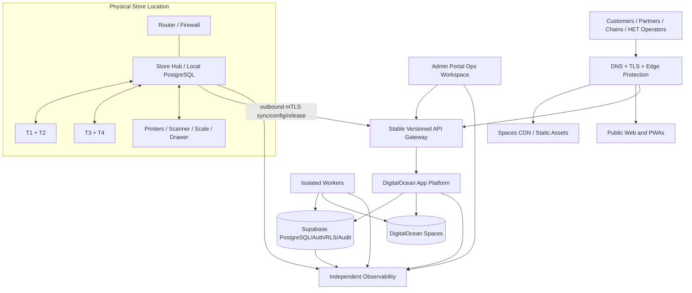

# KitLuy Deployment Topology — Phase 1

| Field | Value |
|---|---|
| **Filename** | `kitluy-deployment-topology-phase1-v1.0.0.md` |
| **Version** | `v1.0.0` |
| **Date** | `2026-07-26` |
| **Phase** | Phase 1 — Laundry |
| **Owner** | HET / KitLuy Suite Project Owner |
| **Audience** | Infrastructure, platform, security, release, database, support and QA teams |
| **Status** | Canonical operating target; not implementation evidence |
| **Timezone** | `Asia/Phnom_Penh` |

> **Purpose:** Define the deployable cloud-and-edge topology, trust boundaries, workload placement, failure behavior and scale path for Phase 1.

## Source authority and evidence discipline

This document is derived from the current KitLuy Project Instructions and the following approved target sources:

- `kitluy-ecosystem-infrastructure-phase1-spec-v1.0.0.md`
- `kitluy-storehub-phase1-spec-v1.0.0.md`
- `kitluy-admin-pwa-portal-phase1-spec-v3.1.0.md`
- current Phase 1 product specifications and owner-locked Digital Store, Store Hub, T1–T4, provisioning, release and security decisions

Authority order:

1. Current owner decisions and active Project Instructions.
2. Applied migrations, verified code/tests, infrastructure state, deployment records and production evidence.
3. This operating document after approval.
4. Current KitLuy infrastructure, Store Hub, security, API, database and product specifications.
5. Approved handoffs and registries.
6. Competitor analyses or clone documents as design references only.

Nothing in this document is evidence that infrastructure is implemented. `IMPLEMENTED`, `DEPLOYED`, `RESTORED`, `PILOT-APPROVED` or `GO-LIVE-APPROVED` may be used only when the corresponding evidence exists. Unknown provider, account, domain, owner, threshold, retention, RPO, RTO or credential values remain `[REQUIRED: ...]` and must not be guessed.

## Mandatory guardrails

- Supabase owns authoritative cloud PostgreSQL, Auth, RLS, approved Realtime, metadata and audit/event records.
- DigitalOcean owns application and worker compute, Container Registry, Spaces, release storage, AI/MCP/RAG compute and the initial App Platform deployment.
- Store Hub owns local Store operations after provisioning; T1–T4 use it over LAN and do not depend on live cloud access for normal operation.
- Cloud application compute is stateless and replaceable. Containers, pods, caches and queues do not own authoritative business truth.
- Finalized finance, payment, inventory, custody, security and audit records are append-only or corrected through compensating records.
- Production changes require authenticated, authorized and audited human action. Defined high-risk changes require four-eyes approval.
- Production migrations are never run automatically during application startup.
- Production secrets are never committed, embedded in images, copied into client bundles or recorded in this document.
- Monitoring and alert delivery remain available when the Admin Portal is unavailable.
- No multi-region, recovery, readiness or availability claim is made without tested evidence.


## 1. Phase 1 deployment decision

Phase 1 uses managed DigitalOcean App Platform for web applications, APIs and selected workers; Supabase for authoritative cloud data/Auth/RLS; DigitalOcean Spaces for object bytes and release artifacts; and Store Hub for local Store authority. DOKS is prepared but not operated until measured triggers and an approved migration decision exist.

## 2. Logical topology



## 3. Workload placement

| Workload | Phase 1 placement | Authority / persistence rule |
|---|---|---|
| B2B Website | Static/web component + CDN | Public content only |
| Admin, Chain, Partner PWAs | Static/web components | No privileged secrets in client bundles |
| Storefront | App Platform web service | Uses governed APIs; no direct production DB authority |
| Public/API gateway | App Platform service | Stable versioned boundary |
| Management API | App Platform service/approved Edge Function | Scoped server authorization |
| Commerce Store API | App Platform service/approved Edge Function | Session, rate-limit and transaction controls |
| Edge Operations cloud API | App Platform service | Hub identity/mTLS and idempotent ingest |
| Connector API | App Platform service | No direct connector database access |
| File Service | App Platform | Bytes in Spaces; metadata/permissions in Supabase |
| Device Registry/Provisioning | App Platform | HET registry and PKI-backed trust |
| Sync workers | Dedicated worker component | Durable relational job/event truth |
| Webhook/notification workers | Dedicated worker components | At-least-once, idempotent consumers |
| Reporting/export workers | Bounded asynchronous workers | Lower priority than transactions/sync |
| AI Gateway/MCP/RAG | Separate services/workers | Degradable and resource-isolated |
| Authoritative cloud data | Supabase | RLS and controlled service identities |
| Local Store operations | Store Hub | Local PostgreSQL and LAN authority |
| Media/releases/backups | Spaces logical classes | Signed/private/lifecycle controls by class |

## 4. Traffic classes and protection order

1. Store synchronization and configuration acknowledgement.
2. Payment and transaction confirmation.
3. Authentication and authorization.
4. Partner/Chain/Admin management.
5. Public Storefront and B2B traffic.
6. Notifications and outbound webhooks.
7. Reports, exports and cleanup.
8. AI, RAG and bulk indexing.

Lower classes must not starve higher classes. Workers and budgets are isolated accordingly.

## 5. Trust boundaries

| Boundary | Required control |
|---|---|
| Public user to edge | TLS, rate limits, input limits, abuse controls |
| Edge to API | Origin protection and authenticated internal paths where applicable |
| API to Supabase | Environment-scoped service identity, connection budget, RLS where applicable |
| API to Spaces | Short-lived scoped credentials or signed access |
| Hub to cloud | Outbound mTLS, device/Store scope, revocation |
| Terminal to Hub | LAN authorization, assigned T-profile, session and user permission |
| Worker to queue/job tables | Lease, idempotency, least privilege |
| Admin operator to sensitive action | MFA, explicit permission, reason, re-auth and approval policy |
| Connector to KitLuy | Versioned API/scopes; never database credentials |

## 6. Network rules

- No public inbound Store Hub port.
- No public PostgreSQL exposure.
- Public ingress terminates only at approved edge/API endpoints.
- Internal management and health endpoints are private or strongly authenticated.
- Hub initiates outbound connections and continues local operations during WAN loss.
- Provider firewalls and allowlists are used where practical.

## 7. Failure behavior

| Failure | Expected behavior |
|---|---|
| WAN outage at Store | T1–T4 continue through Hub; outbox/files queue locally |
| Admin Portal outage | Store operations continue; independent alerts remain available |
| Notification provider outage | Transactions continue; delivery queues retry and show delayed truth |
| Spaces outage | Local/worker queues retain pending uploads; no false success |
| AI/RAG outage | Core transaction and Store operations continue |
| App Platform service failure | Health routing/restart; rollback if release-related |
| Supabase incident | Stores continue locally; cloud mutations fail safely; recovery plan invoked |
| Hub failure | Replacement-first Hub recovery |

## 8. Scaling path

```text
optimize queries/static delivery
-> separate workers
-> increase App Platform replicas within budget
-> activate approved pooling/cache/read models
-> Regional Load Balancer when topology requires
-> DOKS staging and canary after trigger approval
-> DOKS production
-> secondary region/global routing only after full DR proof
```

## 9. DOKS trigger evidence

DOKS evaluation requires sustained evidence of replica complexity, worker isolation need, economic benefit, advanced rollout/network policy need, team readiness or availability/compliance requirement. Store count alone is not sufficient.

## 10. Required topology values

- `[REQUIRED: production region and project names]`
- `[REQUIRED: exact application and worker inventory]`
- `[REQUIRED: minimum/maximum replicas and resource sizes]`
- `[REQUIRED: connection budgets]`
- `[REQUIRED: edge/WAF provider decision]`
- `[REQUIRED: ingress and internal-network policy]`
- `[REQUIRED: DOKS review triggers and observation period]`

## 11. Verification checklist

- [ ] Every service declares owner, dependencies, health checks and runbook.
- [ ] Authoritative state is outside replaceable compute.
- [ ] Hub operates without WAN.
- [ ] AI/report saturation does not degrade Store sync or transactions.
- [ ] No connector has production database access.
- [ ] Public endpoints remain stable across deployment platform changes.
- [ ] Failure paths expose truthful freshness and delivery state.
- [ ] Same immutable image can deploy to App Platform and DOKS staging.
