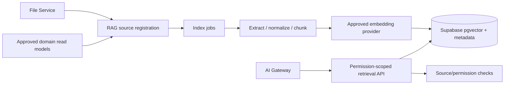

# KitLuy RAG Indexer — Phase 1 Shared-Service Specification

| Field                             | Value                                                              |
| --------------------------------- | ------------------------------------------------------------------ |
| **Filename**                      | `kitluy-rag-indexer-phase1-spec-v1.0.0.md`                         |
| **Version**                       | `v1.0.0`                                                           |
| **Date**                          | 2026-07-26                                                         |
| **Service**                       | `kitluy-rag-indexer`                                               |
| **Phase**                         | Phase 1 — Laundry shared foundation                                |
| **Owner**                         | HET / KitLuy Suite Project Owner                                   |
| **Primary runtime**               | DigitalOcean container service/worker; Kubernetes-ready            |
| **Authoritative metadata**        | Supabase PostgreSQL + RLS in schema `kitluy_rag`                   |
| **Primary region**                | Singapore / SGP1 unless approved evidence states otherwise         |
| **Status**                        | Canonical target specification; not implementation evidence        |
| **Locales / currency / timezone** | Khmer and English; KHR and USD where applicable; `Asia/Phnom_Penh` |

> **Mission:** Create permission-aware, traceable and refreshable retrieval indexes from approved KitLuy sources without turning embeddings or extracted text into a new authority.

> **Evidence rule:** This document defines the target contract. Nothing is `IMPLEMENTED` without verified repository code, applied migrations, executable tests, deployed infrastructure, monitoring evidence and applicable pilot/production evidence.

# 0. Authority, source baseline and reconciliation

## 0.1 Authority order

1. Current owner decisions and active KitLuy Project Instructions.
2. Applied migrations, verified repository code/tests, deployment state and production evidence.
3. This specification after approval.
4. Current KitLuy Rebuild, Business, infrastructure, security, API, event/job/webhook and product specifications.
5. Approved handoffs and the Master Feature Registry.
6. Evidence-based competitor analyses/classifications.
7. Competitor clone/rebuild documents as design references only.
8. Superseded planning.

A competitor pattern, draft route, threshold or schema never becomes product truth without KitLuy authority. Live conflicts must be recorded in the decision/reconciliation register; do not silently overwrite production behavior.

## 0.2 Source baseline

- Current KitLuy Project Instructions and owner decisions
- `kitluy-suite-rebuild-bible-v3.0.0.md`
- `kitluy-ecosystem-infrastructure-phase1-spec-v1.0.0.md`
- `kitluy-admin-pwa-portal-phase1-spec-v3.1.0.md`
- `kitluy-storehub-phase1-spec-v1.0.0.md`
- `kitluy-partner-portal-phase1-spec-v2.0.0.md`
- `kitluy-storefront-phase1-spec-v1.1.0.md`
- `kitluy-master-feature-registry-v0.2.md`
- Approved product comparison, classification and implementation-backlog packages

## 0.3 Status labels

| Label             | Meaning                                                                          |
| ----------------- | -------------------------------------------------------------------------------- |
| `OWNER-LOCKED`    | Explicit project-owner decision.                                                 |
| `APPROVED TARGET` | Approved target requiring implementation evidence.                               |
| `SPECIFIED HERE`  | Concrete Phase 1 contract introduced by this document, subject to normal review. |
| `DEFERRED`        | Excluded from Phase 1 until its re-entry gate is approved.                       |
| `REJECTED`        | Prohibited architecture or behavior.                                             |
| `[REQUIRED: ...]` | Missing exact value that must not be guessed.                                    |

# 1. Purpose and Phase 1 boundary

## 1.1 Phase 1 purpose

Phase 1 indexes approved Rebuild/Business/operating documents, SOPs, support knowledge, selected Store/Booking summaries and authorized evidence classes needed for scoped AI. Indexing of highly restricted data is disabled unless explicitly approved.

## 1.2 Service owns

- Source registration and eligibility validation.
- Extraction, normalization, chunking, embedding and index versioning.
- Permission/scope projection into retrieval metadata.
- Source lineage, checksum, freshness, invalidation, reindex and deletion propagation.
- Retrieval API used by AI Gateway, with citations and filters.

## 1.3 Service does not own

- Original files/records.
- Business truth or document approval.
- AI answer generation.
- General search UI.
- Permission grants independent of source systems.

## 1.4 Cross-cutting rules

- The Digital Store is the control plane; Store Locations are offline-capable edge environments.
- Store Hub remains local operational authority after provisioning.
- Failure of this cloud service must not stop approved local Laundry intake, payment, production, ready scan-in or pickup scan-out unless a security control explicitly fails closed.
- Finalized finance, payment, inventory, custody and audit records are append-only or corrected through compensating records.
- Relational tables hold authoritative data; JSON is limited to optional metadata or versioned payload envelopes.
- Khmer, English, KHR, USD and `Asia/Phnom_Penh` are supported where the service presents or formats business data.
- Reporting/history/export capability cannot be commercially paywalled. Fair-use, privacy, security and capacity controls remain allowed.

# 2. Runtime boundary and topology



## 2.1 Deployable units

- `kitluy-rag-indexer-api` — stateless request/control API.
- `kitluy-rag-indexer-worker` — durable asynchronous job processing.
- `kitluy-rag-indexer-scheduler` — optional scheduled dispatcher; may share worker image but runs as a separate process.
- Database migrations under `supabase/migrations/` for `kitluy_rag`.
- Admin Portal health/control pages consume APIs; they are not the service runtime.

## 2.2 Dependency rules

- Every dependency has a timeout, retry policy, circuit-breaker/degraded rule and health signal.
- A request never holds a database transaction open while waiting for an external provider.
- Durable business work is committed to an outbox/job record before asynchronous processing.
- Workers are horizontally scalable, use leases, and tolerate duplicate execution.
- Local container storage is temporary; no authoritative payload depends on it.

# 3. Schema ownership and data model

## 3.1 Target schema

The target PostgreSQL schema is `kitluy_rag`. These table names are **SPECIFIED HERE** and remain subject to the canonical Supabase schema/data-dictionary/migration pack. They must not be treated as applied until migration evidence exists.

| Table                  | Purpose                                                                   |
| ---------------------- | ------------------------------------------------------------------------- |
| sources                | Logical source, owner service, authority class, checksum and eligibility. |
| source_versions        | Immutable source snapshot/version and extracted-content reference.        |
| documents              | Normalized document identity and locale.                                  |
| chunks                 | Chunk text/reference, order, token count and checksum.                    |
| embeddings             | Vector, model/version and chunk link.                                     |
| index_versions         | Index configuration, embedding model and promotion state.                 |
| permission_projections | Tenant/store/role/resource filters derived from authority systems.        |
| index_jobs             | Extraction/chunk/embed/reindex/delete job state.                          |
| extraction_results     | Parser result, warnings and safe errors.                                  |
| retrieval_runs         | Query filters, returned chunk IDs/scores and permission snapshot.         |
| invalidation_events    | Source changed/deleted/permission changed and propagation state.          |
| quality_evaluations    | Recall, citation, leakage and freshness tests.                            |

## 3.2 Relational invariants

- Tenant-scoped rows carry `tenant_id uuid NOT NULL`; Store-scoped rows also carry `digital_store_id` and, when physical, `location_id`.
- IDs are UUIDs; offline-originated cross-system records preserve the originating event/idempotency identity.
- Timestamps are `timestamptz` stored in UTC.
- Every mutable control record has `created_at`, `updated_at`, actor and version/revision.
- Business-effect and audit histories are append-only.
- Foreign keys and check constraints enforce ownership and valid state transitions.
- Raw provider payloads are minimized, protected, referenced and retained only as approved.
- Deletion uses explicit lifecycle/tombstone records; finalized evidence is not silently hard-deleted.

## 3.3 State machine

| State      | Meaning                                                            |
| ---------- | ------------------------------------------------------------------ |
| REGISTERED | Source accepted but not indexed.                                   |
| INELIGIBLE | Source policy denies indexing.                                     |
| QUEUED     | Index work pending.                                                |
| EXTRACTING | Content extraction active.                                         |
| CHUNKING   | Normalization/chunking active.                                     |
| EMBEDDING  | Embedding active.                                                  |
| ACTIVE     | Index version available for retrieval.                             |
| STALE      | Source or permission changed; restricted retrieval policy applies. |
| FAILED     | Indexing failed.                                                   |
| DELETING   | Deletion/invalidation propagating.                                 |
| DELETED    | No retrievable chunks remain; tombstone/evidence retained.         |

All transitions declare actor, permission, preconditions, idempotency behavior, resulting events and audit record. Workers must compare expected state/version before applying a transition.

# 4. Runtime responsibilities and workflows

## 4.1 Synchronous path

1. Authenticate caller and resolve authoritative scope.
2. Authorize permission, environment, reason and approval policy.
3. Validate schema, size, state and idempotency key.
4. Commit authoritative control metadata and transactional outbox/job record.
5. Return a stable resource/job reference.
6. Perform external or long-running work asynchronously unless the contract explicitly requires synchronous completion.

## 4.2 Asynchronous path

1. Worker leases oldest eligible job.
2. Rechecks current connection/permission/configuration state where required.
3. Executes bounded work with provider timeout and correlation ID.
4. Records append-only attempt evidence.
5. Commits outcome, next retry or dead-letter state transactionally.
6. Emits versioned domain event through the outbox.
7. Exposes truthful current state and freshness to Admin/Partner surfaces.

## 4.3 Offline and Store Hub behavior

- Store Hub records local events/files/intent while WAN is unavailable when the owning product permits it.
- Cloud processing begins only after signed, idempotent synchronization.
- Cloud acknowledgements map to Hub-local identity without duplicating business effects.
- Stale delayed work carries original event time and freshness/expiry rules.
- Cloud failure never causes terminals to bypass Hub or write directly to Supabase.

# 5. API contracts

| Surface    | Endpoint                                            | Contract                                                                       |
| ---------- | --------------------------------------------------- | ------------------------------------------------------------------------------ |
| Internal   | POST `/internal/v1/rag/sources`                     | Register approved file/domain source.                                          |
| Internal   | POST `/internal/v1/rag/sources/{id}/reindex`        | Reindex with reason and version.                                               |
| Internal   | POST `/internal/v1/rag/sources/{id}/invalidate`     | Mark stale/deleted/permission changed.                                         |
| Internal   | GET `/internal/v1/rag/sources/{id}/status`          | Index state and freshness.                                                     |
| Internal   | POST `/internal/v1/rag/retrieve`                    | Permission-scoped retrieval for AI Gateway only.                               |
| Internal   | POST `/internal/v1/rag/index-versions/{id}/promote` | Promote evaluated index configuration.                                         |
| Management | GET `/v1/ai-sources`                                | Authorized operator view of source/index status; no unrestricted content dump. |

# 6. Shared API and contract rules

This service does not create a fifth public “generic KitLuy API.” It participates only through the approved surface that owns the caller and operation:

- **Management API** for authenticated Admin, Chain and Partner control-plane operations.
- **Commerce Store API** only when a public Storefront/customer flow needs a narrowly scoped contract.
- **Edge Operations API** for Store Hub and managed-device operations.
- **Connector API** for approved connector ingress/egress and partner-system integration.
- **Internal service API** for signed service-to-service calls that must never be exposed as a public developer surface.

All contracts must be versioned, idempotent where a request can be retried, tenant/store/location scoped, auditable, retry-safe and explicit about freshness.

### 6.1 Standard request context

Every accepted request resolves or derives:

```json
{
  "request_id": "uuid",
  "actor_type": "user|service|device|connector",
  "actor_id": "uuid",
  "tenant_id": "uuid",
  "digital_store_id": "uuid|null",
  "location_id": "uuid|null",
  "environment": "development|staging|production",
  "idempotency_key": "string|null",
  "trace_id": "string",
  "requested_at": "timestamptz"
}
```

A client-supplied scope can only narrow access. It never grants access. Server-side authorization and Supabase RLS remain authoritative.

### 6.2 Authentication and machine identity

- Human calls use Supabase Auth JWTs and explicit permission grants.
- Store Hub calls use device certificates and outbound mTLS.
- Internal services use purpose-limited workload identities with key rotation.
- Connectors use approved OAuth, API credentials or signed webhook identities.
- Service-role database credentials stay server-side and are never shared with clients, devices, connectors, AI models or generated code.

### 6.3 Idempotency

- Every mutating endpoint declares whether `Idempotency-Key` is required.
- The idempotency record stores request fingerprint, caller, scope, result reference and expiry.
- Reuse with a different payload returns `409 IDEMPOTENCY_KEY_REUSED`.
- Duplicate provider callbacks, Hub replay and worker retry return the original business effect rather than creating another effect.
- Idempotency does not permit destructive overwrites of finalized payment, finance, inventory, custody or audit records.

### 6.4 Error envelope

```json
{
  "error": {
    "code": "SERVICE_DOMAIN_CODE",
    "message": "Safe operator-facing message",
    "request_id": "uuid",
    "retryable": false,
    "retry_after_seconds": null,
    "details": {}
  }
}
```

Errors are registered in `kitluy-api-error-code-registry-v1.0.0.md`. Raw provider secrets, SQL, stack traces and personal data are never returned.

### 6.5 Pagination, filtering and consistency

- List endpoints use opaque cursor pagination.
- Maximum page sizes and bulk limits are environment-configured and documented.
- Filters are allowlisted; arbitrary SQL and unbounded scans are prohibited.
- Responses that may be asynchronous include `data_as_of`, `source`, `freshness_state` and `reconciliation_state` when relevant.
- Read-after-write paths use an authoritative source or explicitly report pending propagation.

### 6.6 Rate limits and backpressure

Rate limits apply by actor, tenant, Digital Store, Location, connector, IP and operation class as appropriate. A rejected request returns `429` and `Retry-After`. Queue admission limits protect Supabase, Spaces, providers, Store Hubs and downstream services from overload.

### 6.7 Audit expectations

Every sensitive or business-significant call records:

- actor and delegated actor;
- tenant, Digital Store, Location and environment;
- permission and approval decision;
- reason code where required;
- request/result references;
- before/after references where mutation is allowed;
- source device/service/connector;
- correlation and trace IDs;
- immutable timestamp.

# 7. Domain events and durable jobs

## 7.1 Events

| Event                            | Producer     | Consumers               | Meaning                          |
| -------------------------------- | ------------ | ----------------------- | -------------------------------- |
| rag.source_registered            | RAG Indexer  | Index worker            | Eligible source accepted.        |
| rag.source_indexed               | Index worker | AI Gateway/source owner | Active index available.          |
| rag.source_stale                 | RAG Indexer  | AI Gateway/source owner | Source or permission changed.    |
| rag.index_failed                 | Index worker | AI Operations           | Indexing failed.                 |
| rag.source_deleted               | RAG Indexer  | AI Gateway/audit        | Retrieval content removed.       |
| rag.permission_projection_failed | RAG Indexer  | Security/AI Ops         | Fail closed for affected source. |

Events use the canonical event envelope, schema version, event ID, occurred-at, recorded-at, tenant/store/location scope, producer, aggregate reference and trace ID. Event publication uses the transactional outbox. Consumers must be idempotent.

## 7.2 Jobs

| Job                    | Priority | Purpose                                                    | Failure/retry rule                        |
| ---------------------- | -------- | ---------------------------------------------------------- | ----------------------------------------- |
| rag.extract            | normal   | Extract text/structure from approved source.               | Sandbox parsers and bound resource use.   |
| rag.chunk              | normal   | Apply deterministic chunk policy.                          | Versioned configuration.                  |
| rag.embed              | normal   | Generate embeddings through approved provider.             | No provider retains data beyond contract. |
| rag.permission-project | high     | Derive retrieval filters from authoritative grants.        | Failure makes source unavailable.         |
| rag.invalidate         | high     | Remove/deactivate stale/deleted/permission-changed chunks. | Prioritize privacy/security changes.      |
| rag.reconcile          | normal   | Compare source checksum/version/permissions with index.    | Create repair jobs.                       |
| rag.evaluate           | normal   | Leakage, freshness, recall and citation tests.             | Blocks promotion when thresholds fail.    |

Every job defines queue, payload schema/version, timeout, lease duration, maximum attempts, jittered backoff, deduplication key, dead-letter behavior, replay permissions and observability. Exact numerical values are configuration governed by the durable-job registry.

# 8. Permissions and approval controls

| Permission           | Permitted action                  | Scope / additional control         |
| -------------------- | --------------------------------- | ---------------------------------- |
| rag.source.register  | Register eligible source          | File Service/domain service        |
| rag.source.manage    | Reindex/invalidate                | source owner/AI Ops                |
| rag.retrieve         | Retrieve chunks                   | AI Gateway signed identity only    |
| rag.restricted.index | Index restricted class            | explicit security/privacy approval |
| rag.index.promote    | Promote model/chunk configuration | AI Ops + independent approval      |
| rag.audit.read       | View lineage/retrieval evidence   | security/audit scoped              |

Frontend visibility never replaces API authorization or RLS. Permission changes take effect on new requests immediately and on queued work at the next policy recheck where applicable.

# 9. Data lifecycle, retention and privacy

- Data minimization applies to payload bodies, provider responses and logs.
- Retention is class- and purpose-specific, not one global period.
- User/customer deletion requests propagate according to privacy policy without destroying legally or operationally required immutable evidence.
- Export/download grants are short-lived and audited.
- Non-production fixtures use synthetic or approved masked data.
- Backups retain the same classification and access restrictions as live data.
- Data residency/provider processing terms remain `[REQUIRED: approved legal/provider position]`.

# 10. Security and authorization baseline

### 10.1 Mandatory controls

- Least privilege across users, services, devices and connectors.
- Tenant, Digital Store, Location, environment and device isolation.
- Supabase RLS for tenant-scoped authoritative rows.
- Encryption in transit; encryption at rest through approved provider controls.
- Secret values kept in approved secret managers and excluded from logs, exports, screenshots, prompts and client bundles.
- Immutable audit for sensitive actions.
- Re-authentication, reason and four-eyes approval for defined high-risk production actions.
- Human confirmation for sensitive financial, permission, compliance, safety, release and destructive actions.
- No connector, model, terminal or browser receives direct production-database access.

### 10.2 Data classification

| Class             | Examples                                                        | Minimum treatment                                                           |
| ----------------- | --------------------------------------------------------------- | --------------------------------------------------------------------------- |
| Public            | approved marketing assets, public Storefront media              | reviewed publication, integrity and cache controls                          |
| Internal          | service health, non-sensitive configuration                     | authenticated staff/service access                                          |
| Private           | customer/contact/operational records                            | scoped access, encryption and audit                                         |
| Restricted        | payment references, damage evidence, credentials, security logs | strong access, explicit purpose, shorter exposure and enhanced audit        |
| Highly restricted | signing keys, service-role keys, private device keys            | non-exportable or dedicated key custody; never exposed to application users |

### 10.3 Threats that must be tested

- Cross-tenant or cross-Store access.
- Forged device/service/connector identity.
- Replay and idempotency bypass.
- Credential leakage through logs or exports.
- Queue poisoning or oversized payload denial of service.
- Provider callback forgery.
- Stale authorization after role, consent or certificate revocation.
- Privilege escalation through AI/MCP or integration mappings.
- Supply-chain tampering in dependencies or release artifacts.

# 11. Observability, SLOs and operational truth

Every service emits structured logs, metrics and traces carrying `request_id`, `trace_id`, environment, service version and safe scope identifiers. Logs must not contain secrets or unrestricted payloads.

### 11.1 Required health endpoints

- `/health/live` — process is alive; no dependency check.
- `/health/ready` — service can accept the declared workload.
- `/health/dependencies` — privileged dependency summary with freshness and degraded reasons.

### 11.2 Required SLO definition

Exact Phase 1 numerical targets remain `[REQUIRED: approved service SLOs]`. Each service must define:

- availability;
- latency by endpoint/job class;
- queue admission and oldest-item age;
- successful business-effect rate;
- data freshness where relevant;
- recovery time objective;
- recovery point objective;
- measurement source and exclusions.

### 11.3 Alert requirements

Alerts include service, environment, severity, current value, threshold, start time, affected scope, dashboard, runbook and owner/on-call route. Alerts must distinguish provider outage, internal defect, capacity exhaustion, data-integrity risk and customer-specific configuration failure.

### 11.4 Evidence discipline

Dashboards must distinguish planned, deployed, healthy, degraded, stale, partial and unknown states. A green process health check is not proof that business effects are correct. A capability is never labeled `IMPLEMENTED` without repository, migration, test, deployment and applicable pilot evidence.

## 11.5 Service-specific metrics

- registered/active/stale/failed sources
- index queue depth/oldest age
- extraction failure by parser
- embedding latency/error/cost
- permission projection latency/failure
- invalidation propagation time
- retrieval latency/empty rate
- leakage test failures
- citation/source freshness
- index storage growth

# 12. Failure modes and degraded behavior

| Failure                           | Required behavior                                                       |
| --------------------------------- | ----------------------------------------------------------------------- |
| Parser failure                    | Mark failed with safe reason; source remains authoritative outside RAG. |
| Embedding provider outage         | Queue/retry; do not serve incomplete new index as active.               |
| Permission projection unavailable | Fail closed and make affected source unretrievable.                     |
| Source changed during indexing    | Discard/promote only matching checksum/version.                         |
| Deletion request                  | Prioritize invalidation and verify no retrievable chunk remains.        |
| Stale index                       | AI Gateway receives stale state and may exclude it.                     |
| Malicious document content        | Treat content as untrusted data, not instructions or permission.        |
| Vector query overload             | Apply bounded top-k/filtering and backpressure.                         |

## 12.1 Circuit breakers and retry safety

- Retry only errors classified as retryable.
- Honor provider `Retry-After` where present.
- Never retry a possible financial or authoritative business effect blindly; reconcile unknown outcome first.
- Dead-letter does not mean lost: it remains visible, replayable under policy and linked to the original request.
- Recovery must not create duplicate payments, notifications, files, connector effects, reports, release installations or audit events.

# 13. Deployment, environments and release compatibility

### 13.1 Runtime placement

Phase 1 uses containerized services on DigitalOcean App Platform or approved DigitalOcean workers. The image must also be runnable on DOKS later without changing business contracts. Supabase remains the authority for PostgreSQL/Auth/RLS/Realtime/metadata/audit. DigitalOcean Spaces remains the heavy-file layer.

### 13.2 Environment isolation

Development, staging and production use separate credentials, queues, provider endpoints, storage namespaces and callback registrations. Production data must not be copied to lower environments without approved masking and purpose.

### 13.3 Artifact requirements

- immutable image digest;
- semantic service version;
- SBOM and dependency scan;
- build provenance where available;
- configuration schema version;
- database compatibility range;
- rollback or forward-fix plan;
- migration validation evidence.

### 13.4 Migration policy

Migrations are additive and backward-compatible by default. Application startup never auto-applies production migrations. An authorized operator applies production migrations after review, dry run, backup/restore readiness and compatibility verification. AI may draft or review migrations but may not apply them to production.

### 13.5 Kubernetes readiness

The service is stateless except for approved external stores, exposes health probes, supports graceful shutdown, bounded concurrency, horizontal scaling and queue-safe duplicate execution. No assumption may depend on a single mutable local filesystem.

# 14. QA and acceptance matrix

| Test ID     | Acceptance criterion                                                               |
| ----------- | ---------------------------------------------------------------------------------- |
| KRAG-QA-001 | Cross-tenant retrieval returns zero foreign chunks.                                |
| KRAG-QA-002 | Permission revocation removes retrieval access within approved propagation target. |
| KRAG-QA-003 | Source checksum change marks prior index stale.                                    |
| KRAG-QA-004 | Deletion removes chunks and embeddings while preserving audit tombstone.           |
| KRAG-QA-005 | Malicious source instruction cannot authorize tools.                               |
| KRAG-QA-006 | Failed permission projection fails closed.                                         |
| KRAG-QA-007 | Citations resolve to authorized current source/version.                            |
| KRAG-QA-008 | New embedding model cannot promote before evaluation.                              |
| KRAG-QA-009 | Restricted source cannot index without explicit policy.                            |
| KRAG-QA-010 | Reconciliation repairs missing/duplicate chunks idempotently.                      |

Additional mandatory suites: unit, component, JSON-schema/OpenAPI, negative authorization, RLS, idempotency, event compatibility, retry/dead-letter, load/backpressure, secret scanning, dependency vulnerability, backup/restore and incident simulation.

# 15. Operations and runbooks

Required runbooks:

- Embedding provider outage
- Parser failure spike
- Permission leakage incident
- Source deletion/invalidation
- Index corruption/rebuild
- Stale index backlog
- Embedding model rollback
- Vector storage/capacity pressure

Each runbook states trigger, severity, decision authority, immediate containment, verification queries, customer/operator communication, rollback/recovery, audit requirements and post-incident follow-up.

# 16. Completion gates and Rebuild Test

| Gate                         | Exit evidence                                                                                                                               |
| ---------------------------- | ------------------------------------------------------------------------------------------------------------------------------------------- |
| G0 — Authority               | Scope, owner decisions, privacy/legal/provider constraints and prohibited patterns are versioned.                                           |
| G1 — Contract                | Schema, APIs, events, jobs, permissions, state machines, retention, failure behavior and migration plan are approved.                       |
| G2 — Build                   | Code, migrations, seeds/configuration, workers and automated unit/component/contract tests exist in development.                            |
| G3 — Integrated verification | RLS/RBAC, cross-service, retry, replay, provider failure, performance, recovery and audit tests pass.                                       |
| G4 — Pilot readiness         | Monitoring, alerts, support, rollback, data recovery, runbooks and operator training are ready.                                             |
| G5 — Phase exit              | Approved pilot evidence exists and one qualified engineer can reconstruct and operate the service from current documentation and contracts. |

A specification, checklist or successful demo alone is not G5 evidence.

# 17. Rebuild sequence

1. Approve scope, permission registry, data classification and all blocking `[REQUIRED]` values.
2. Add schema, enums/reference values, constraints, indexes and RLS migrations for `kitluy_rag`.
3. Add idempotency, outbox, audit and service-identity dependencies.
4. Implement API schemas and contract tests for each approved surface.
5. Implement durable jobs, retries, dead-letter and replay controls.
6. Implement Admin/Partner/Hub integration only after backend authorization exists.
7. Configure environment-isolated secrets, queues, provider endpoints and storage namespaces.
8. Deploy development; run unit, contract, RLS, negative and failure tests.
9. Deploy staging; run cross-service, load, recovery and security tests.
10. Produce monitoring dashboards, alerts, runbooks and backup/restore evidence.
11. Promote to controlled pilot with feature flags and rollback.
12. Approve G5 only after pilot and Rebuild Test evidence.

# 18. Required values and open decisions

- `[REQUIRED: Initial eligible source classes]`
- `[REQUIRED: Approved extraction libraries/sandbox]`
- `[REQUIRED: Chunking policy by source type/language]`
- `[REQUIRED: Embedding provider/model and data terms]`
- `[REQUIRED: Permission propagation target]`
- `[REQUIRED: Deletion/privacy response target]`
- `[REQUIRED: Evaluation datasets/thresholds]`
- `[REQUIRED: Approved SLOs and cost limits]`

These values belong in the centralized open-decisions/required-values register. They must not be silently invented by an implementation agent.

# 19. Phase 1 feature inventory

| Feature ID  | Capability                                  | Priority |
| ----------- | ------------------------------------------- | -------- |
| KRAG-P1-001 | Approved source registry and lineage        | P0       |
| KRAG-P1-002 | Extraction/chunking/embedding pipeline      | P0       |
| KRAG-P1-003 | Permission-scoped vector metadata           | P0       |
| KRAG-P1-004 | AI Gateway retrieval API with citations     | P0       |
| KRAG-P1-005 | Freshness/invalidation/deletion propagation | P0       |
| KRAG-P1-006 | Index reconciliation                        | P1       |
| KRAG-P1-007 | Quality/leakage evaluation                  | P1       |
| KRAG-P1-008 | Index configuration promotion/rollback      | P1       |

# 20. Migration and documentation impact

Required companion updates:

- Supabase schema, data dictionary, enum/reference registry, migration plan, functions/triggers and RLS documents.
- API surface OpenAPI/JSON Schema and error/scope/contract-test registries.
- Domain-event, durable-job, webhook, outbox and replay registries.
- RBAC permission, resource scope, sensitive-action and audit-event registries.
- Infrastructure, monitoring, backup/recovery, incident and go-live documents.
- Product specifications for every consuming Admin, Chain, Partner, Storefront, POS, Store Hub or mobile workflow.
- Source-of-truth index, implementation-status/evidence register and Rebuild/Business Bibles.

# 21. Version history

| Version | Date       | Change                                                                                                                                                                          |
| ------- | ---------- | ------------------------------------------------------------------------------------------------------------------------------------------------------------------------------- |
| v1.0.0  | 2026-07-26 | Initial Phase 1 shared-service authority covering runtime boundaries, schema ownership, APIs, jobs, permissions, observability, failure modes, QA, operations and Rebuild Test. |
